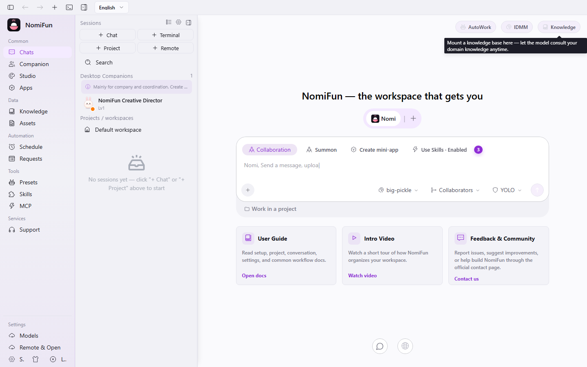
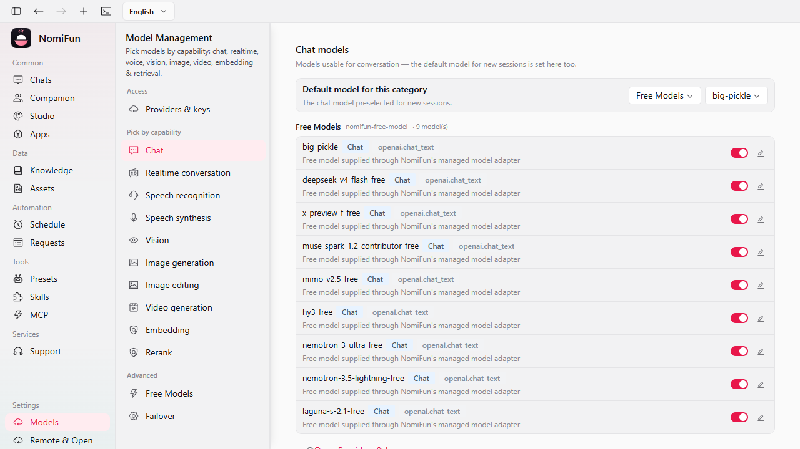
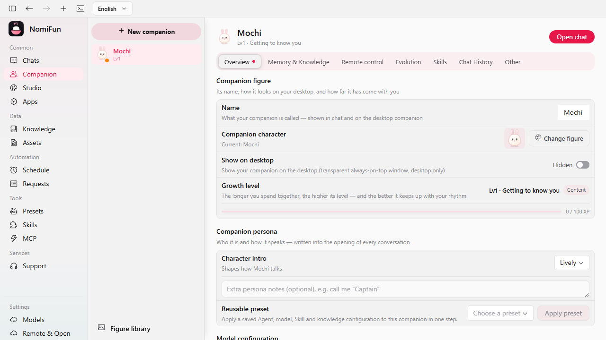
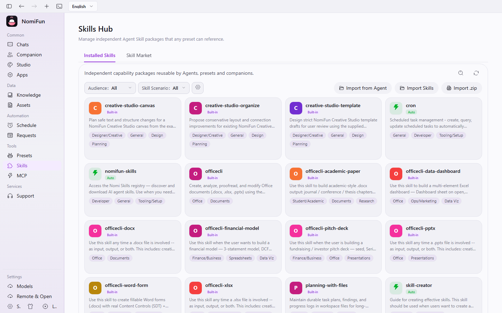
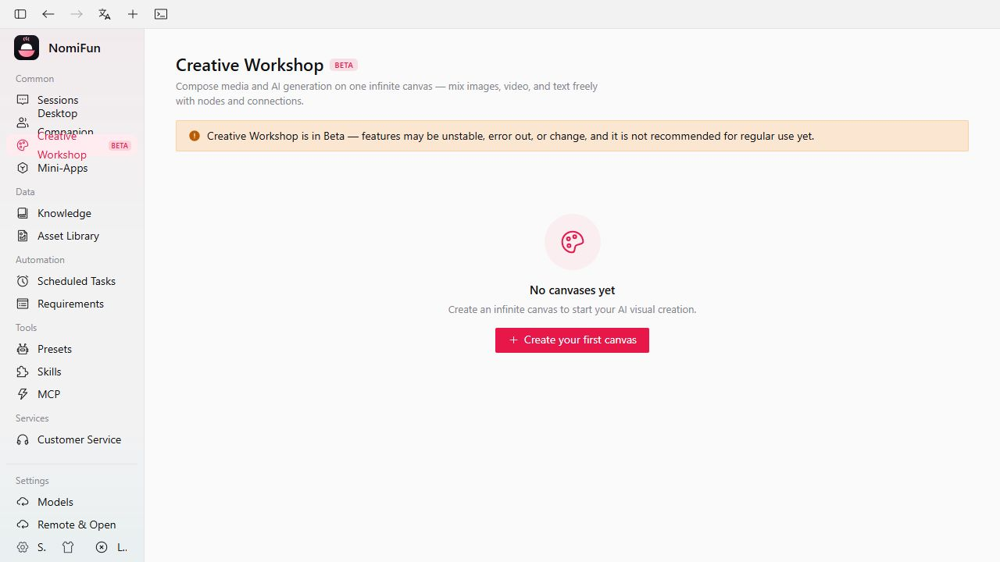

<a name="top"></a>

<div align="center">

<a href="https://www.nomifun.com">
  
</a>

<h3>A no-holds-barred, fully open-source, <em>local-first</em> super AI workstation.</h3>

<p>
  Rich, inventive capabilities and serious productivity gains —<br/>
  with <b>all your data staying on your own machine</b>. Safe for individuals and enterprises, free to commercialize, open to audit.
</p>

<p>
  <a href="LICENSE"></a>
  
  
  <a href="https://www.nomifun.com"></a>
</p>

<p>
  
  
  
  <a href="https://github.com/nomifun/nomifun-desktop/stargazers"></a>
</p>

<p>
  <b>English</b>&nbsp;·&nbsp;<a href="README.zh-CN.md">简体中文</a>
</p>

<p>
  <a href="https://www.nomifun.com">🌐 Website</a>&nbsp;·&nbsp;
  <a href="docs/README.md">📖 Docs</a>&nbsp;·&nbsp;
  <a href="#-getting-started">🚀 Get started</a>&nbsp;·&nbsp;
  <a href="https://github.com/nomifun/nomifun-desktop/releases">📦 Releases</a>&nbsp;·&nbsp;
  <a href="https://gitee.com/nomifun/nomifun-desktop">🇨🇳 Gitee source</a>&nbsp;·&nbsp;
  <a href="https://pan.baidu.com/s/5GPonoJNrwJ7GciBSDgXLaA">China mirror</a>&nbsp;·&nbsp;
  <a href="./RELEASING.zh-CN.md">发版手册</a>&nbsp;·&nbsp;
  <a href="#-contact--community">💬 Community</a>
</p>

</div>

---

> [!IMPORTANT]
> **Public-interest open-source and data-risk notice**: NomiFun is a public-interest open-source project. The maintainers do not assume responsibility for user data loss, corruption, or unrecoverable damage during iteration. Back up your data before upgrades, migrations, experimental features, or real production use.

---

**NomiFun** is everything you imagine an AI workstation to be — and it runs on your terms. One React frontend and one Rust backend give you an evolving desktop companion, an unattended automation platform, a unified knowledge base, native computer- and browser-use, and an open capability bus that any agent can drive. No cloud account. No telemetry. No subscription. Your data never leaves your machine except for the LLM calls **you** configure.

> The product name is **NomiFun**. Lowercase `nomifun` is used only for code identifiers, crate names, environment variables, and repository paths.

---

## NomiFun open-source product family

NomiFun now has four related open-source projects. **Desktop is the local AI,
data, model, Agent, task, and tool hub**; Mobile and the Xiaozhi robot connect to
capabilities that you explicitly enable, while Net Infra provides an optional,
self-hosted cross-network relay. Desktop also hosts Agent
Mini Apps, so an app created by an Agent can keep using the same local runtime
and governed capabilities instead of becoming an isolated demo.

| Project | Role | Start here |
|---|---|---|
| **NomiFun Desktop** (this repository; [GitHub](https://github.com/nomifun/nomifun-desktop) · [Gitee](https://gitee.com/nomifun/nomifun-desktop)) | Local source of truth and runtime for data, models, Agents, tasks, Skills, knowledge, Mini Apps, WebUI, REST and MCP | [Download](https://github.com/nomifun/nomifun-desktop/releases) · [Desktop docs](https://www.nomifun.com/docs/) · [WebUI remote access](docs/guides/webui-remote-access.md) |
| NomiFun Mobile ([GitHub](https://github.com/nomifun/nomifun-mobile) · [Gitee](https://gitee.com/nomifun/nomifun-mobile)) | Android / iOS / H5 client that directly reuses Desktop sessions, tasks, requirements, companions and administration | [Mobile docs](https://github.com/nomifun/nomifun-mobile#readme) · Enable **Remote & Open → WebUI access** in Desktop, then scan its one-time QR code |
| NomiFun Xiaozhi Yuntai ([GitHub](https://github.com/nomifun/nomifun-xiaozhi-yuntai) · [Gitee](https://gitee.com/nomifun/nomifun-xiaozhi-yuntai)) | ESP32-S3 Xiaozhi robot and pan-tilt platform for voice, motion and device-side multimodal interaction | [Xiaozhi docs](https://github.com/nomifun/nomifun-xiaozhi-yuntai#readme) · [Desktop integration guide](docs/guides/xiaozhi-robot.md) |
| NomiFun Net Infra ([GitHub](https://github.com/nomifun/nomifun-net-infra) · [Gitee](https://gitee.com/nomifun/nomifun-net-infra)) | Self-hosted NomiRelay infrastructure for exposing Desktop or other HTTP/WebSocket/TCP/UDP services behind NAT across networks | [Product page](https://www.nomifun.com/products/net-infra/) · [Portal guide](https://www.nomifun.com/docs/guides/net-infra/) · [Relay docs](https://github.com/nomifun/nomifun-net-infra/tree/main/docs/integration) |

### Connect the four projects

1. Run Desktop, configure the models/companions you need, and keep all data on
   that machine.
2. For Mobile, open **Remote & Open → WebUI access**, start the listener, and
   scan the short-lived, one-time QR code from the Mobile app. On a LAN, Mobile
   connects directly to Desktop with **no NomiFun cloud relay**. Desktop remains
   the authority and server; the phone is an authenticated client, so model
   credentials and the durable data set do not need to be copied to the phone.
3. For Xiaozhi, build and flash the Yuntai firmware, then follow the companion
   **Remote control → Robot connection** flow in Desktop to bind the device.
4. When access must cross networks, self-host NomiRelay and `nfagent`, then
   point Mobile at the relay business endpoint. Mobile never receives relay
   admin credentials, and Desktop remains the application-data authority.

Only enable remote interfaces on networks you trust. The Desktop guides above
document authentication, LAN exposure, and deployment boundaries.

### One local hub, many interaction surfaces

This is not a collection of unrelated clients that happen to share a logo. Desktop owns
the durable state and executes models, Agents, requirements, tools, knowledge,
companion memory, and Skills. Mobile is a direct LAN control surface; Xiaozhi is
a voice-and-motion hardware surface; Mini Apps are interactive software surfaces
created and hosted by the same Desktop installation; Net Infra is an optional
transport layer rather than another application backend. The result is one governed
capability graph with multiple ways to reach it, rather than separate clouds,
accounts, credentials, and copies of user data.

Read [the NomiFun product ecosystem architecture](docs/architecture/product-ecosystem.md)
for the trust boundaries, communication model, differentiators, and product
innovation timeline. Simplified Chinese:
[`product-ecosystem.zh.md`](docs/architecture/product-ecosystem.zh.md).

---

## ✨ Why NomiFun

|  | |
|---|---|
| 🔓 **Open & local** | Source fully open, no reservations. Data lives on your machine and is never sent out on its own. Free for personal **and** commercial use. Open to audit. |
| 🐾 **Evolving companions** | The most complete companion-growth system we know of — it learns how you work and gets better over time. Not just a buddy, a genuine productivity partner. |
| 🤖 **Unattended automation** | Manage requirements, then just give the order. AutoWork + IDMM keep your sessions alive and working reliably while you're away. |
| 🌐 **Open capability ecosystem** | Everything is here, everything connects, everything cooperates — and *any* agent can borrow NomiFun's powers over MCP / REST. |
| 🧩 **Config once, use anywhere** | Unified management of knowledge bases, skills, agents, MCP servers, and models — defined once, reused across every surface. |
| 🖥️ **Truly native** | In-process, self-built **computer use** and **browser use** as native tools — more capable, faster, and cheaper on tokens. |
| 🚀 **Built for productivity** | Designed from real needs, with a lot of inventive capabilities. And many delightful features are still on the way. |

---

## 🔒 Local-first, by design

Data security is not a setting in NomiFun — it is the architecture.

- **All data is local.** NomiFun never proactively sends your data anywhere. The **only** outbound network calls are the LLM requests you explicitly configure to your chosen model provider. There is no other third-party service integration phoning home.
- **Safe for anyone who cares about data.** Individuals and enterprises with strict data-handling requirements can use it with confidence. The code is **fully open and open to audit**.
- **We cut features to keep this promise.** To guarantee your data stays yours, we deliberately dropped several advanced, genuinely fun feature designs. Everything here is in service of letting users — and developers — relax.
- **No ads. No commercialization. No membership tiers.** We promise to *never* charge for any feature of this project. The only thing that costs money is your LLM provider's tokens, which is outside our control. (If finding/serving models is painful, [reach out](#-contact--community) — we're happy to help build a unified model gateway.)

See [`SECURITY.md`](SECURITY.md) for the deployment threat model and responsible-disclosure policy.

---

## 🖼️ A look inside

<div align="center">

<p>
  🎬 <b>Demo videos:</b>
  China:
  <a href="https://www.bilibili.com/video/BV1kwKZ6UE5X/">Bilibili</a>
  &nbsp;|&nbsp;
  International:
  <a href="https://youtu.be/AsEToBDFR9s">YouTube</a>
</p>

<p>
  
  <br/><sub><b>Workspace · conversations, Agents, tasks, tools, and connected devices in one desktop</b></sub>
</p>

<table>
  <tr>
    <td width="50%"><br/><sub><b>Multi-model management · task-aware routing and Free Models</b></sub></td>
    <td width="50%"><br/><sub><b>Desktop companions · persona, memory, models, and remote control</b></sub></td>
  </tr>
  <tr>
    <td width="50%"><br/><sub><b>Skills Hub · reusable, governed Agent capabilities</b></sub></td>
    <td width="50%"><br/><sub><b>Creative Studio · infinite canvas, workbenches, prompts, assets, and templates</b></sub></td>
  </tr>
</table>

<sub>Freshly captured from the current NomiFun product build. See <a href="docs/images/SCREENSHOTS.md">the screenshot manifest</a> for source, synchronization, and usage details.</sub>

</div>

---

## 🚀 Feature highlights

NomiFun Desktop has grown from an Agent chat client into a local, extensible AI
workspace. Its major product surfaces now share the same conversations, models,
memory, tools, permissions, and execution runtime:

| Product surface | What it adds |
|---|---|
| **Multi-Agent execution cluster** | Plans dependency-aware work, delegates steps to specialized Agents, schedules parallel execution, and exposes live state, transcripts, approvals, retry, and recovery. |
| **Agent Mini Apps** | Turns a normal Agent conversation into a previewable and publishable local web tool, with an editable working copy and a durable published snapshot. |
| **Creative Studio** | Provides a persistent infinite Canvas, independent Image and Video Workbenches, prompt and asset libraries, collections/tags/search, exact-model media tasks, private templates, and a bounded 3D Director. |
| **Task-aware multi-model control plane** | Separates provider credentials from model records, accepts native and compatible/custom endpoints including local or self-hosted services, and routes chat, realtime, speech, vision, media generation, embedding, and reranking with per-task fallback. |
| **NomiFun Free Models** | Ships a managed provider that can be enabled, refreshed, health-checked, and used without first creating your own provider entry. |
| **Phone, robot, and open access** | Pairs Mobile directly with Desktop, binds a Xiaozhi robot to a companion, and exposes governed capabilities through WebUI, REST, MCP, IM channels, and NomiRelay. |

### 🐾 Desktop Companion — it grows with you

> Guide: [`docs/guides/companions.md`](docs/guides/companions.md)

The companion you talk to every day quietly becomes the partner who *gets* you.

- **Make it yours.** Upload a custom companion figure (DIY), or pick from an independent figure library decoupled from any single companion.
- **A family, not a hive mind.** Run multiple companions side by side, each a complete individual with **its own** chat model, persona, memory, and domain knowledge bases. Memory belongs to exactly one companion — nothing you tell the work companion leaks into the one you chat with at home.
- **Chat with them where you already work.** Companion chats now live in the main **Sessions** UI under a dedicated desktop-companion group, while `/nomi` stays focused on companion management.
- **It learns you (opt-in, on by default after a one-time consent).** A background learner distills your usage into durable memories; a deterministic evolution engine mines your recurring multi-step tool sequences into **draft skills** it proposes for your review. Memory is fully **visible and editable**.
- **Skills it writes itself.** Companions distill their own skills out of real work and discuss them with you before anything is kept.
- **A super gateway, not just a buddy.** Each companion is a complete, independent individual that can connect to multiple IM channels. From anywhere with a network and a chat app, message your companion to drive your computer for you. Each companion can fully operate the desktop's capabilities.

### 🤖 XiaoZhi robot — give your companion a physical presence

> Guide: [`docs/guides/xiaozhi-robot.md`](docs/guides/xiaozhi-robot.md) · Firmware: [nomifun-xiaozhi-yuntai](https://github.com/nomifun/nomifun-xiaozhi-yuntai)

Connect a compatible XiaoZhi ESP32 robot directly to NomiFun over your LAN. The
robot supplies the microphone, speaker, display, servos, and device-side MCP
tools, while NomiFun supplies the companion's persona, models, memory, ASR, TTS,
sessions, and tool coordination. Setup is built into each companion's **Remote
control → Robot connection** page: copy its OTA address, enter the six-digit
activation code shown by the robot, and bind the device to that companion.

### 🧩 Agent Mini Apps — turn a conversation into a reusable tool

Create a Mini App in a normal Agent conversation, preview it in the same
workspace, and explicitly publish a durable snapshot to the local Mini Apps
library. Desktop keeps that published version separate from the editable working
copy, so you can continue iterating without silently changing what users launch.
Every revision remains attached to a normal, auditable conversation rather than
a hidden second chat system, and the resulting app can reuse the same local
Agents, data, models, and governed tools.

### 🎨 Creative Studio — focused creation on an infinite canvas

> Guide: [`docs/guides/creative-studio.md`](docs/guides/creative-studio.md)

Creative Studio combines a persistent infinite Canvas, independent Image and Video
Workbenches, prompt and asset libraries, private templates, and a bounded
3D Director. It has no Project product object: Canvas is Canvas, while Image and
Video remain usable with zero Canvases. The prompt library keeps reusable briefs
close to the work, and the asset library supports text, image, video, and audio
items with search, kinds, collections, tags, and metadata for cross-iteration reuse.
A Canvas persists eight node kinds: text, image, video, audio, panorama, config,
director, and group; generation is owned by media nodes plus auditable config
nodes rather than fictional loop, compare, or output node types.

Every model request uses an exact enabled NomiFun provider/model task: Chat for
one-shot drafts and manually approved proposals, image generation/edit for
T2I/I2I, video generation for T2V or one-image I2V, and speech synthesis for
TTS. Canvas documents use revision CAS, Canvas tasks can reconcile after reload,
and a version-2 Canvas ZIP carries the referenced asset and Director-sidecar
closure while the reader remains compatible with version 1. Standalone task
ownership and history use only `workbenchKind`; Image and Video preserve
versioned session drafts without a Canvas binding. The UI/API contract is 22.
The minimal Template AI previews a strict one-shot draft, then waits for the
user to Apply it to the editor and explicitly Save; it does not create a public
template, complex conversation, or automatic run.

### 🧠 Multi-Agent execution cluster — plan, schedule, supervise

Start from a normal Agent conversation. When a task deserves specialization or
parallel work, NomiFun creates one persistent `AgentExecution` aggregate linked
to that Conversation, plans a dependency graph, and schedules ready steps across
delegated Agents while the lead Agent remains the control point.

- **Dependency-aware scheduling.** Independent steps can run concurrently; blocked steps wait for their prerequisites instead of racing on incomplete context.
- **Per-step preflight control.** Override a delegated Agent's model and add a preset brief before it starts; completed or failed steps can be retried with the same configuration.
- **Review before execution.** Approval-enabled collaboration pauses after planning and presents the graph in the conversation so you can adjust it before work begins.
- **Live, real transcripts.** Follow state changes and open any step's actual Agent conversation, then return to the lead conversation to keep supervising the whole cluster.
- **Recovery is part of execution.** Persisted state supports retry and restart recovery instead of reducing a cluster run to disposable background messages.

### 🤖 Unattended automation — Requirements + AutoWork + IDMM

> Guides: [`autowork-requirements.md`](docs/guides/autowork-requirements.md) · [`intelligent-decision.md`](docs/guides/intelligent-decision.md)

You give the orders; NomiFun reliably does the work.

- **Requirement platform** — a CRUD store with ordered rotation, a board/kanban, tags, and per-item claim.
- **AutoWork** — claims pending requirements, drives a turn, rotates to the next, and renews leases while a turn is in flight. Targets can be **conversation agents *or* terminal PTYs**.
- **IDMM (Intelligent Decision-Making)** — per-session supervision that keeps agents alive through provider faults and decision stalls, with a no-LLM rule tier and a sidecar backup-model tier, stacking on top of AutoWork.
- **Notify out** — completion notifications to **Lark/Feishu** custom bots, **Slack**, and HTTP webhooks.

### 📚 Unified Knowledge Base

> Guide: [`docs/guides/mcp-and-skills.md`](docs/guides/mcp-and-skills.md)

Pull the knowledge scattered across your system into one managed, trackable place.

- **Centralized management & tracking** — create, mount, and track consumers across conversations, terminals, and companions.
- **Safe write-back** — a code-enforced, per-surface write policy. Every mount picks its **write-back disposition**: **manual** (the default — nothing is written back unless you ask for it in the conversation) or **automatic** (the agent decides on its own, and only writes what it is confident is durably worth keeping). Either way an update **appends** to the existing document under compare-and-swap, so a write-back can add to the text you curated but never overwrite it.
- **Real-time URL snapshot** — turn any web page into a knowledge source (SSRF-guarded fetch, HTML→Markdown), in *snapshot* (persisted, re-fetchable) or *live* mode.
- **Scoped retrieval** — agents call a `knowledge_search` tool whose scope is decided server-side and cannot be widened.

### 🖥️ Native Computer Use & Browser Use *(desktop build)*

> Guide: [`docs/guides/computer-browser-use.md`](docs/guides/computer-browser-use.md)

Self-built, **in-process Rust** — no Playwright, no Node, no third-party automation daemon. More capable, faster, and far cheaper on tokens, with fine-grained control and fully open source for you to extend.

- **Computer use** — accessibility tree + Set-of-Marks overlay + OCR, steering the model to act on real UI elements instead of guessing pixels. macOS (AXUIElement + Vision OCR) and Windows (UI Automation) are complete; Linux (AT-SPI2) is partial.
- **Browser use** — a main-process `BrowserSessionHub` owns managed Chromium Hosts and addressable Browser Lanes. The built-in agent, the Gateway, and parallel AgentExecution attempts all enter the same platform instead of launching private browsers.
- **Status and lifecycle browser management** — the **Browser** page reports conversations, runtimes, Lanes, tabs, URLs, identity mode, capacity, queue position, pressure, resource estimates, and failures. Within that management boundary, a user can explicitly foreground an already-running Primary Lane; the page still does not embed a preview or expose page input or takeover controls.
- **Shared live login identity** — ordinary interactive Lanes use an application-managed Primary profile and see live shared login state. Public crawls use an anonymous identity with no Primary cookies or site storage, while explicitly isolated work gets a separate identity. NomiFun never opens the user's real Chrome or Edge profile.
- **Bounded, observable concurrency** — different Lanes can run concurrently while each Lane remains strictly serialized. When safe capacity is exhausted, callers and the UI receive queue position, pressure reason, and recommended concurrency rather than an apparently ready handle blocked by a hidden global lock.
- **Quiet by default, foreground on request** — ordinary Primary Agent work uses a real headful managed Chromium window that starts minimized in the background and does not pop up or steal focus. **Open browser in foreground** restores that same window and active target for a running Primary Lane; explicit sign-in flows foreground it automatically. NomiFun retains lifecycle authority, including user closes, owner revocation, and managed process-tree cleanup.
- **Agent-only interaction** — page navigation and input remain owned by the executing agent. Browser approvals still enforce the existing danger × surface policy, without a separate viewer takeover path.
- **Guarded by design** — every action carries a danger × surface approval matrix; irreversible actions wait for explicit confirmation.

> ℹ️ Computer/browser control ship with the **desktop app**. The headless web/server host omits them by design.

### 🌐 Open capability bus — MCP + REST

> Guides: [`remote-capability-api.md`](docs/guides/remote-capability-api.md) · [`remote-capability-api-examples.md`](docs/guides/remote-capability-api-examples.md)

Every capability NomiFun has is exposed through a single, typed capability registry — **~20 domains and 150+ tools** — so you can wire NomiFun into anything.

- **MCP front door** at `/mcp` (authenticated, Streamable-HTTP). Point **Claude Code, Cursor, or your own agent** at it and they operate NomiFun exactly as the desktop companion does.
- **REST + OpenAPI** at `/v1/tools`, with streaming and an auto-generated `/v1/openapi.json`.
- Adding a capability to the bus makes it appear on MCP **and** REST automatically — no drift.

### 🧩 One built-in agent, many models

> Guide: [`docs/guides/model-routing.md`](docs/guides/model-routing.md)

- **Built-in `nomi` agent** — no extra install, and the only conversation engine. Works with **26+ model providers/presets** (OpenAI, Anthropic, Gemini + Vertex AI, AWS Bedrock, DeepSeek, OpenRouter, Moonshot/Kimi, Qwen/Dashscope, Zhipu/GLM, MiniMax, SiliconFlow, xAI, Volcengine/Doubao, and more) across **4 wire protocols**, plus the **New API** aggregator gateway.
- **One code path** — every conversation runs the same engine, so capabilities, tool policy, approvals, and failover behave identically no matter which model you pick.
- **Want Claude Code, Codex, or Gemini CLI?** Run them in **terminal mode** — real in-app PTY sessions with NomiFun's capabilities injected through each CLI's own native config. See [`docs/guides/terminal.md`](docs/guides/terminal.md).
- **Everywhere** — the native capabilities are available to the built-in agent, in the chat UI, **and** in the terminal.
- **Graceful multimodal fallback** — if a selected provider/model rejects image input, NomiFun strips the images, retries in the same conversation, and leaves an inline notice instead of killing the session.
- **Per-model context tuning** — override context-window limits per model when an upstream platform reports bad defaults or hides them, improving routing and long-context budgeting.

### 🔌 Multi-model control plane — providers, capabilities, and Free Models

NomiFun separates provider credentials from model records and capabilities. Extend the
catalog with native providers, compatible protocols, custom base URLs, or local and
self-hosted endpoints, then assign models to chat, realtime, ASR, TTS, vision,
image generation/editing, video generation, embedding, and reranking. Routing is
task-aware, supports per-model context and output limits, and can fail over without
pretending that every provider uses the same URL, protocol, or auth.

The important boundary is explicit capability, not a fixed vendor list: a model is
usable for a task only when its configured provider and protocol declare that task.
Creative Studio carries the exact `{ provider, model, task }` identity into every
media operation, so a same-named model from another provider is never substituted
silently.

**NomiFun Free Models** are available through a built-in managed provider. You
can enable it, refresh its catalog, run a health check, and activate an available
model without first creating a separate provider entry or supplying your own API
key. These are online third-party inference services: availability, limits, and
data-handling terms can change, so review the in-product notice before sending
sensitive content.

For your own providers, pick by region, price, quota, capability, and data policy,
then add the credentials on **Models & Agents**. The following services are
third-party offerings; their pricing, availability, rate limits, and data terms
remain under each provider's control.

| Provider | Start here | Good to evaluate |
|---|---|---|
|  **StepFun** | [Platform](https://platform.stepfun.ai/) | Step models for Chinese, agentic, and cost-conscious workloads |
|  **Kimi / Moonshot AI** | [API keys](https://platform.kimi.ai/console/api-keys) | Long context, Chinese writing, coding, and general tasks |
|  **GLM / Zhipu BigModel** | [API keys](https://open.bigmodel.cn/usercenter/apikeys) | GLM models, general reasoning, coding, and enterprise integration |
|  **Doubao / Volcengine Ark** | [API keys](https://console.volcengine.com/ark/region:ark+cn-beijing/apiKey) | Doubao models and China-region cloud/enterprise workflows |
|  **Qwen / Alibaba Cloud Model Studio** | [API keys](https://bailian.console.aliyun.com/?tab=model#/api-key) | Qwen models, DashScope, and Alibaba Cloud workflows |
|  **MiniMax / MinMax** | [API keys](https://platform.minimax.io/user-center/basic-information/interface-key) | MiniMax models, long-form text, multimodal, and voice capabilities |
|  **MiMo / Xiaomi** | [Website](https://mimo.mi.com/) | MiMo models and Xiaomi ecosystem capabilities |
|  **DeepSeek** | [API keys](https://platform.deepseek.com/api_keys) | Reasoning, coding, and high value-for-money model calls |
|  **OpenRouter** | [API keys](https://openrouter.ai/keys) | Multi-model aggregation, unified billing, fallback routing, and comparison |
|  **Claude / Anthropic** | [API keys](https://platform.claude.com/settings/keys) | Claude models, long-form work, coding, and the Claude Code ecosystem |
|  **GPT / OpenAI** | [GPT models](https://platform.openai.com/docs/models) · [API keys](https://platform.openai.com/api-keys) | GPT models, OpenAI API, agent workflows, coding, and general-purpose tasks |
|  **Gemini / Google AI** | [API keys](https://aistudio.google.com/app/apikey) | Gemini models, multimodal work, very long context, and Google AI Studio |

### 💻 Terminal mode — where third-party agent CLIs live

> Guide: [`docs/guides/terminal.md`](docs/guides/terminal.md)

Run agent CLIs inside in-app PTY sessions (or the standalone `nomi` CLI). This is how **Claude Code, Codex, and Gemini CLI** are used with NomiFun: a real pseudo-terminal, the CLI's own auth and OAuth, its own approval prompts, nothing re-implemented. NomiFun injects native capabilities — knowledge search, requirement completion, and lifecycle hooks — into known CLIs through their *own* native config, so you keep full fidelity. AutoWork can drive such a terminal turn by turn.

### 📱 NomiFun Mobile — direct to your Desktop

> Guide: [`docs/guides/webui-remote-access.md`](docs/guides/webui-remote-access.md)
> · App: [nomifun-mobile](https://github.com/nomifun/nomifun-mobile)

No social platform or NomiFun cloud relay is required on a LAN. One-tap **QR
pairing** gives the phone a short-lived, one-time login credential and connects
it directly to the authenticated listener inside Desktop. Mobile then uses the
same sessions, tasks, requirements, companions, models, and tools in real time;
Desktop remains the data and execution authority. The phone is a connected,
authenticated client, so it does not need a duplicate database or a second copy
of your model credentials.

### ⚙️ Config once, use anywhere

Central hubs for **Knowledge**, **Presets & Skills**, **MCP**, **Models**, and **Open Capabilities** — define them once, then select per conversation, terminal, channel, or companion. One source of truth, reused everywhere.

### 💬 11 IM channels

> Guide: [`docs/guides/channels.md`](docs/guides/channels.md)

Bind a companion to any of these and drive it from where you already chat:

`Telegram` · `Lark / 飞书` · `DingTalk / 钉钉` · `WeChat / 微信` · `Discord` · `Slack` · `Matrix` · `Mattermost` · `Twitch` · `Nostr` · `QQ Bot`

---

## 🏗️ Architecture

One React frontend, one Rust backend, **two host modes** — and the same backend runs in-process in both.

At the product-family level, Desktop is also the hub for Mobile, Xiaozhi, Mini
Apps, and companion IM channels. See
[`docs/architecture/product-ecosystem.md`](docs/architecture/product-ecosystem.md)
for the full communication, security, and innovation model.

| | `nomifun-desktop` | `nomifun-web` |
|---|---|---|
| **Shell** | Tauri 2 desktop app | Standalone axum server |
| **Backend** | Embedded in-process, private loopback port | Same backend, in-process |
| **Auth** | Local-trust token injected into the webview | Login required by default |
| **Serves** | Native desktop UI + tray + companion windows | API + `/ws` + built SPA on one port |
| **Computer / browser use** | ✅ Included | ❌ Headless (omitted) |

There is no Electron shell, no Node web host, and no prebuilt backend handoff.

<details>
<summary><b>Repository map</b></summary>

```text
apps/
  desktop/      Tauri 2 shell and desktop-only commands
  web/          standalone web host for API + SPA
crates/
  agent/        15 nomi-* crates: engine, providers, tools, MCP, skills, memory,
                browser/computer use, and the standalone nomi CLI
  backend/      29 nomifun-* crates: app composition, auth, database, sessions,
                MCP, knowledge, requirements, terminal, companion, gateway, etc.
  shared/       2 cross-layer crates: nomifun-net and nomi-redact
ui/             React 19 + Vite SPA shared by desktop and web
docs/           technical docs, user/operator guides, architecture notes
packaging/      Linux deployment support for the web host
```

Start with [`docs/architecture/overview.md`](docs/architecture/overview.md) for the full system map. The Cargo workspace is defined in [`Cargo.toml`](Cargo.toml).

</details>

---

## 🚀 Getting started

> 📦 **Installers**: use [GitHub Releases](https://github.com/nomifun/nomifun-desktop/releases) first. Mainland China users can use the [Baidu Netdisk mirror](https://pan.baidu.com/s/5GPonoJNrwJ7GciBSDgXLaA) (shared as `nomifun`). You can also install from source or run the server with Docker.

**Prerequisites**

- [Rust](https://rustup.rs) — stable toolchain, edition 2024
- [Bun](https://bun.sh) ≥ 1.3.13
- Recommended on PATH for full agent tooling: `node` / `npm` / `npx`, `git`, `ripgrep`

**Desktop app (from source)**

```bash
git clone https://github.com/nomifun/nomifun-desktop.git
cd nomifun-tauri
bun install

bun run dev      # develop with hot reload
bun run build    # build a desktop bundle for your OS
```

**Web server (self-host)**

```bash
bun run build:ui && bun run serve:web
# serves API + SPA on http://127.0.0.1:8787 (login required)
```

**Docker (self-host the server)**

The official image is published on Docker Hub:
[`nomifun/nomifun-web`](https://hub.docker.com/repository/docker/nomifun/nomifun-web).
The examples below use `latest`, the stable rolling tag published on Docker
Hub. For reproducible deployments, pin an explicit version or image digest.

```bash
# Pull and run the official image.
docker run -d \
  --name nomifun-web \
  --restart unless-stopped \
  -p 8787:8787 \
  -v nomifun-data:/data \
  nomifun/nomifun-web:latest
# then open http://<server-ip>:8787 and create the first admin
```

For unattended or internet-facing deployments, pre-seed the first admin before
the port is reachable:

```bash
docker run -d \
  --name nomifun-web \
  --restart unless-stopped \
  -p 8787:8787 \
  -v nomifun-data:/data \
  -e NOMIFUN_ADMIN_USERNAME=admin \
  -e NOMIFUN_ADMIN_PASSWORD='change-me-to-something-strong' \
  nomifun/nomifun-web:latest
```

Compose can use the same official image:

```yaml
services:
  nomifun:
    image: nomifun/nomifun-web:latest
    restart: unless-stopped
    ports:
      - "8787:8787"
    volumes:
      - nomifun-data:/data
    environment:
      NOMIFUN_ADMIN_USERNAME: admin
      NOMIFUN_ADMIN_PASSWORD: "change-me-to-something-strong"
      # Set to "true" when NomiFun is behind an HTTPS reverse proxy.
      NOMIFUN_HTTPS: "false"

volumes:
  nomifun-data:
```

If you prefer to build the image locally from this repo:

```bash
docker compose up -d --build
# then open http://<server-ip>:8787  —  pair with the bundled Caddyfile for TLS

# Fast path when ui/dist and target/release/nomifun-web are already built:
bun run docker:prebuilt -- --tag nomifun/nomifun-web:latest --build-missing --sudo
```

See [`docs/getting-started/installation.md`](docs/getting-started/installation.md) and [`docs/guides/web-server-deployment.md`](docs/guides/web-server-deployment.md) for details.

---

## 🛠️ Development

```bash
bun install        # install dependencies (one-time)
bun run dev        # desktop app development (hot reload)
bun run dev:web    # web host + Vite development
bun run build:ui   # build the SPA
bun run check      # frontend typecheck + i18n + theme + script-registry gate
bun run test       # Rust tests (use test:fast for nextest)
```

Prefer the scripted entry points over plain `cargo`/`vite` — they include build-dir pruning and consistency checks. New to the codebase? Read [`CONTRIBUTING.md`](CONTRIBUTING.md), [`CONTRIBUTING.zh-CN.md`](CONTRIBUTING.zh-CN.md), and [`docs/contributing/development.md`](docs/contributing/development.md).

### 📦 Desktop packaging

Each OS has its own command, and **a package can only be built on its matching OS** —
macOS bundles must be signed/notarized on macOS, Windows installers built on Windows,
Linux packages on Linux. There is no cross-OS build. All artifacts are collected into
`dist/desktop/`.

Common argument shape for all three:

```
bun run build:<os> [arch ...] [--signed] [-- <args passed straight to `tauri build`>]
```

- **arch** — zero or more architectures. Omit to use the per-OS default below.
- **`--signed`** — sign (and, on macOS, notarize). Requires local signing config; see each OS.
- **`-- …`** — everything after `--` is forwarded verbatim to `tauri build`
  (e.g. `-- --bundles nsis`). `build:mac` and `build:win` also forward unknown `--xxx`
  options directly. For updater builds, layer on the committed overlay as a **file path**:
  `bun run build:<os> --config apps/desktop/tauri.updater.conf.json` — pass the file, not
  inline JSON, because Windows PowerShell 5.1 strips the quotes from `--config '{...}'`.

**macOS — `build:mac`** (produces `.dmg`; default arch: `universal`)

| Goal | Command |
| --- | --- |
| Universal (Intel + Apple Silicon, one fat package) | `bun run build:mac` |
| Universal, signed + notarized | `bun run build:mac --signed` |
| Apple Silicon only | `bun run build:mac arm` |
| Intel only | `bun run build:mac intel` |
| Intel only, signed + notarized | `bun run build:mac --signed intel` |
| All three separately (ARM + Intel + Universal) | `bun run build:mac arm intel universal` |

Arch aliases: `arm`/`aarch64`/`silicon`, `intel`/`x64`/`x86_64`, `universal`/`all-arch`.
Signing reads `apps/desktop/signing/.env.signing` (gitignored); missing → it errors with setup hints.

**Windows — `build:win`** (produces a single NSIS `.exe`; default arch: the host's, usually `x64`)

| Goal | Command |
| --- | --- |
| Current arch | `bun run build:win` |
| x64 only | `bun run build:win x64` |
| ARM64 only | `bun run build:win arm64` |
| Both | `bun run build:win x64 arm64` |
| Signed (Authenticode) | `bun run build:win --signed` |

Arch aliases: `x64`/`x86_64`, `arm64`/`aarch64`/`arm`. `--signed` reads the cert thumbprint from
`WINDOWS_CERTIFICATE_THUMBPRINT` (no “notarization” concept on Windows).

**Linux — `build:linux`** (produces `.deb` / `.AppImage` / `.rpm`; default arch: the host's)

| Goal | Command |
| --- | --- |
| Current arch | `bun run build:linux` |
| x64 only | `bun run build:linux x64` |
| ARM64 only | `bun run build:linux arm64` |
| Both | `bun run build:linux x64 arm64` |

Arch aliases: `x64`/`x86_64`, `arm64`/`aarch64`/`arm`. Linux has no signing/notarization step.
⚠️ Cross-arch (e.g. building arm64 on an x64 host) needs the target's sysroot/toolchain and often
fails on the webkit2gtk link — build on the target architecture's machine/container instead.

> `bun run build` stays as the simple "just build for whatever OS I'm on" shortcut; the
> `build:<os>` commands above add explicit arch selection, signing, and `dist/desktop/` collection.

<details>
<summary><b>Full script catalog</b></summary>

<!-- BEGIN GENERATED SCRIPTS (bun run help --readme) -->

| 脚本 | 说明 |
| --- | --- |
| **开发（热重载）** | |
| `bun run dev` | 启动桌面应用开发（tauri dev，热重载） |
| `bun run dev:web` | 启动 Web 全栈开发（后端 API + 前端 vite） |
| `bun run dev:ui` | 仅启动前端开发服务器（纯 vite，无后端） |
| **构建（出制品）** | |
| `bun run build` | 为当前操作系统打桌面安装包 |
| `bun run build:fast` | 快速构建可直接运行的 debug 桌面二进制（不打安装包） |
| `bun run build:win` | 打 Windows 安装包（NSIS），汇总到 dist/desktop/ |
| `bun run build:mac` | 打 macOS 安装包（.dmg），汇总到 dist/desktop/ |
| `bun run build:linux` | 打 Linux 安装包（.deb/.AppImage/.rpm），汇总到 dist/desktop/ |
| `bun run build:signed` | 打桌面包并签名+公证（仅 macOS） |
| `bun run build:updater` | 打桌面包并产出自更新 .sig 制品 |
| `bun run make:latest` | 扫描本机更新产物，生成/合并自动更新清单 latest.json |
| `bun run release:mac` | 一键 macOS 发版：自动判定追加/首发；首发用 -Version 打版本号 + -NotesFile/-Notes 建 Release；-DryRun 只预检 |
| `bun run release:win` | 一键 Windows 发版：自动判定追加/首发；首发用 -Version 打版本号 + -NotesFile/-Notes 建 Release；-DryRun 只预检 |
| `bun run release:linux` | 一键 Linux 发版：自动判定追加/首发；首发用 -Version 打版本号 + -NotesFile/-Notes 建 Release；-DryRun 只预检 |
| `bun run build:ui` | 前端生产构建 → ui/dist |
| `bun run docker:prebuilt` | 用已有 ui/dist + nomifun-web release 二进制快速构建 Docker 运行时镜像 |
| **运行（组装好的应用）** | |
| `bun run serve:web` | 启动 Web 服务器，托管已构建的前端 |
| **测试** | |
| `bun run test` | 运行全部 Rust 测试（含 doctest） |
| `bun run test:fast` | 用 nextest 快速跑 Rust 测试（日常） |
| `bun run test:crate` | 运行单个 Rust crate：bun run test:crate <crate> [cargo 参数] |
| `bun run test:core` | 运行不含 desktop-only feature 的 Rust workspace |
| `bun run test:desktop` | 运行桌面壳测试，不监听或打包 ui/dist 资源 |
| `bun run test:browser` | 运行 browser-use 门控的 Rust 测试（browser-platform 全量 + gateway/ai-agent/nomi-agent/app 开启 --features browser-use；crate/core 车道会静默跳过这些） |
| `bun run test:ui` | 运行前端单元测试（bun test，收集 ui/src 下全部 *.test.ts/tsx） |
| **静态检查** | |
| `bun run check:process-runtime-boundary` | Enforce the supervised process runtime boundary and exact hand-off allowlist. |
| `bun run check:browser-platform-boundary` | Enforce the single BrowserSessionHub ownership boundary and reject private browser launch paths. |
| `bun run check:agent-vocabulary` | Enforce AgentExecution as the only active collaboration aggregate and permit only exact migration fences. |
| `bun run check` | 聚合静态检查：typecheck + i18n + 主题契约 + 图标导入 + 死 CSS 工具类 + 进程运行时边界 + Agent 词汇边界 + 脚本登记 |
| `bun run typecheck` | 前端 TypeScript 类型检查（tsc --noEmit） |
| `bun run check:i18n` | 校验 i18n 类型与 locale 键是否一致 |
| `bun run check:theme` | 校验预设 CSS 主题契约 |
| `bun run check:icons` | 校验 @icon-park/react 导入禁别名/禁命名空间（别名会被图标包装插件改写成非法代码，tsc 抓不到） |
| `bun run check:dead-css` | 死 CSS 工具类棘轮：拦住新增的 {text,bg,border}-[rgb(var(--ramp-N))] / border-border-N / border-b-base / border-b-light（存量记在脚本 BASELINE，只许变少） |
| **代码生成** | |
| `bun run gen:i18n` | 由 locale 重新生成 i18n 类型声明 |
| **维护 / 工具** | |
| `bun run clean` | 深度回收构建空间（debug 产物 + flycheck + 旧安装包） |
| `bun run seed:dev` | 用生产数据目录播种 dev 数据目录 |
| `bun run bump` | 统一改版本号：根 Cargo.toml(真源) + package.json + ui + Cargo.lock，可选 --tag 提交并打 tag |
| `bun run help` | 打印脚本目录（--check 校验登记 / --readme 生成 README 表） |

<!-- END GENERATED SCRIPTS -->

</details>

---

## 📖 Documentation

- [`docs/README.md`](docs/README.md) — documentation index
- [`docs/getting-started/`](docs/getting-started) — installation and first run
- [`docs/guides/`](docs/guides) — user & operator guides (companions, channels, AutoWork, knowledge, computer/browser use, terminal, remote API, …)
- [`docs/guides/xiaozhi-robot.md`](docs/guides/xiaozhi-robot.md) — connect a XiaoZhi ESP32 robot to a NomiFun companion
- [`docs/architecture/`](docs/architecture) — technical architecture
- [`docs/reference/`](docs/reference) — configuration, API overview, FAQ, troubleshooting

Docs are bilingual: every page has an English `*.md` and a Simplified-Chinese `*.zh.md` sibling.

---

## 🗺️ Coming soon

NomiFun is **pre-1.0** and built part-time, so there's a lot still in flight. On the horizon: prebuilt installers, inbound issue-tracker / requirement sources, more knowledge connectors (Feishu, and beyond), official desktop binaries — plus a few surprises we're genuinely excited about. **Stay tuned.** ✨

---

## 🤝 Contributing & community

NomiFun very much needs your help to grow — code contributions, community building, and evangelism are all hugely welcome. If you have passion for this project, please [reach out](#-contact--community) and build the NomiFun ecosystem with us.

- Read [`CONTRIBUTING.md`](CONTRIBUTING.md) to get set up and learn the check ladder. Simplified Chinese: [`CONTRIBUTING.zh-CN.md`](CONTRIBUTING.zh-CN.md).
- Be excellent to each other — see [`CODE_OF_CONDUCT.md`](CODE_OF_CONDUCT.md).
- Found a vulnerability? Follow [`SECURITY.md`](SECURITY.md).
- Browse [open issues](https://github.com/nomifun/nomifun-desktop/issues) for a place to start.

---

## 💛 A note from the author

> This is a part-time effort with limited bandwidth, and many delightful features are still on the way. If this resonates with you, join in any way you like — a line of code, a suggestion, a reshare all mean a lot.

NomiFun is **completely open source, with nothing held back**. Individuals and enterprises are free to build on it and use it commercially.

- **Forks & commercial use are welcome.** They're also at your own risk — the author and contributors assume no liability for downstream use. Apache-2.0 requires no permission from us.
- **A friendly heads-up is appreciated, not required.** If you fork or commercialize NomiFun, we'd love a note — *not* as a license condition, simply because knowing the project is valued is the kind of recognition that keeps it going.
- **Some features were intentionally left out of the open-source release** to keep the local-data promise airtight — without the people and funding to guarantee everyone's data security, removing them was the responsible choice. As time and resources allow, we hope to bring more of them to you.

Thank you for being here. 🙏

---

## 🔗 Friendly links

Projects and products we appreciate:

| Product | What it does |
|---|---|
| [Saytive](http://saytive.ai/) | **Be Creative, Be Saytive.** A voice input method for creative workers, using strong models and thoughtful product design to sense your work context and deliver fast, accurate, scene-aware transcription. |
| [Fast](https://fast.saien.pro) | **Search, one tap away.** Type, click, and jump straight to search results across RED, Douyin, Meituan, and dozens of mainstream apps. No feed distraction, just search. |
| [AionUi](https://github.com/iOfficeAI/AionUi) | AionUi ships with a complete AI agent engine. Unlike tools that require separate CLI-agent installs, AionUi works the moment you install it. |

---

## 📬 Contact & community

The following contact information is shared across the NomiFun open-source
product family. For reproducible bugs and feature requests, GitHub Issues is the
preferred channel.

| Channel | Where |
|---|---|
| 🌐 **Website** | [www.nomifun.com](https://www.nomifun.com) |
| 🐙 **Issues** | [github.com/nomifun/nomifun-desktop/issues](https://github.com/nomifun/nomifun-desktop/issues) |
| 📮 **Contact** | [www.nomifun.com/contact](https://www.nomifun.com/contact) |
| 📕 **小红书 / RED** | [NomiFun](https://xhslink.com/m/4x6ti8n6cA1) |
| 📺 **Bilibili** | [NomiFun](https://b23.tv/0UhgKDh) · [demo video](https://www.bilibili.com/video/BV1kwKZ6UE5X/) |
| 🎵 **抖音 / Douyin** | [NomiFun](https://v.douyin.com/MDT5QVdYaJk/) |
| ▶️ **YouTube** | [@NomiFun-o2y](https://www.youtube.com/@NomiFun-o2y) · [demo video](https://youtu.be/AsEToBDFR9s) |
| 𝕏 **X (Twitter)** | [@colir0](https://x.com/colir0) |
| 🎬 **TikTok** | [@colir0luo](https://www.tiktok.com/@colir0luo) |

**Join the chat groups** — scan to join:

<div align="center">
<table>
  <tr>
    <td align="center"><br/><sub><b>NomiFun WeChat group / NomiFun 微信交流群</b></sub></td>
    <td align="center"><br/><sub><b>QQ group / QQ 群</b></sub></td>
  </tr>
</table>
</div>

---

## ⚖️ License

[Apache-2.0](LICENSE) © 2025–2026 NomiFun.

See [`NOTICE`](NOTICE) for third-party attributions.

<div align="center">
<br/>
<sub>Built with 💛 for people who want AI on their own terms.</sub>
<br/><br/>
<a href="#top">⬆ Back to top</a>
</div>
