<a name="top"></a>

<div align="center">

<a href="https://www.nomifun.com">
  
</a>

<h3>一项毫无保留、<em>本地优先</em>的超级 AI 工作站。</h3>

<p>
  丰富的创新能力，极高的生产提效 ——<br/>
  而你的<b>数据始终留在自己的电脑上</b>。个人与企业都能放心使用、自由商用、接受审计。
</p>

<p>
  <a href="LICENSE"></a>
  
  
  <a href="https://www.nomifun.com"></a>
</p>

<p>
  
  
  
  <a href="https://github.com/nomifun/nomifun-desktop/stargazers"></a>
</p>

<p>
  <a href="README.md">English</a>&nbsp;·&nbsp;<b>简体中文</b>
</p>

<p>
  <a href="https://www.nomifun.com">🌐 官网</a>&nbsp;·&nbsp;
  <a href="https://www.nomifun.com/zh/docs/">📖 文档</a>&nbsp;·&nbsp;
  <a href="#-快速开始">🚀 快速开始</a>&nbsp;·&nbsp;
  <a href="https://github.com/nomifun/nomifun-desktop/releases">📦 下载</a>&nbsp;·&nbsp;
  <a href="https://gitee.com/nomifun/nomifun-desktop">🇨🇳 Gitee 源码</a>&nbsp;·&nbsp;
  <a href="https://pan.baidu.com/s/5GPonoJNrwJ7GciBSDgXLaA">百度网盘</a>&nbsp;·&nbsp;
  <a href="#-联系我们--社区">💬 社区</a>
</p>

</div>

---

> [!IMPORTANT]
> **公益开源与数据风险声明**：这是一个公益开源项目，不承担迭代过程中用户数据丢失损坏的责任。NomiFun 仍处于快速迭代阶段，请在升级、迁移、体验实验功能或接入真实工作数据前自行做好备份。

---

**NomiFun** 满足你对 AI 工作站的全部想象 —— 而且一切由你做主。一套 React 前端 + 一套 Rust 后端，为你带来会成长的桌面伙伴、无人值守的自动化平台、统一知识库、原生的 computer / browser use，以及任何智能体都能驱动的开放能力总线。无需云账号、无遥测、无订阅。除了**你自己配置**的大模型调用，你的数据绝不离开本机。

> 产品名是 **NomiFun**；小写 `nomifun` 仅用于代码标识符、crate 名、环境变量与仓库路径。

---

## NomiFun 开源产品家族

NomiFun 由四个运行时项目与 **NomiFun Portal** 组成。Portal 是整个产品家族的
统一产品使用文档入口；**Desktop 是本地数据、模型、Agent、任务与工具中枢**；
Mobile 和小智机器人接入你在 Desktop 中显式开放的能力，Net Infra 则提供可选的
自托管跨网中继。Desktop 还承载 Agent 小程序，让 Agent 创建的应用继续复用同一套
本地运行时与受治理能力，而不是沦为一个割裂的演示页面。

| 项目 | 定位 | 文档与入口 |
|---|---|---|
| **NomiFun Desktop**（本仓库；[GitHub](https://github.com/nomifun/nomifun-desktop) · [Gitee](https://gitee.com/nomifun/nomifun-desktop)） | 数据、模型、Agent、任务、Skill、知识库、小程序、WebUI、REST 与 MCP 的本地事实源和执行中枢 | [下载](https://github.com/nomifun/nomifun-desktop/releases) · [产品文档](https://www.nomifun.com/zh/docs/) · [WebUI 远程访问](https://www.nomifun.com/zh/docs/guides/webui-remote/) |
| NomiFun Mobile（[GitHub](https://github.com/nomifun/nomifun-mobile) · [Gitee](https://gitee.com/nomifun/nomifun-mobile)） | 直接复用 Desktop 会话、任务、需求、伙伴与管理能力的 Android / iOS / H5 客户端 | [Mobile 使用指南](https://www.nomifun.com/zh/docs/guides/mobile-bridge/) · 在 Desktop 开启**远程与开放 → WebUI 访问**后扫描一次性二维码 |
| NomiFun 小智云台（[GitHub](https://github.com/nomifun/nomifun-xiaozhi-yuntai) · [Gitee](https://gitee.com/nomifun/nomifun-xiaozhi-yuntai)） | 为伙伴提供语音、运动、屏幕和设备侧多模态交互的 ESP32-S3 机器人与云台 | [小智接入指南](https://www.nomifun.com/zh/docs/guides/xiaozhi-robot/) · 固件源码：[nomifun-xiaozhi-yuntai](https://github.com/nomifun/nomifun-xiaozhi-yuntai) |
| NomiFun Net Infra（[GitHub](https://github.com/nomifun/nomifun-net-infra) · [Gitee](https://gitee.com/nomifun/nomifun-net-infra)） | 自托管的 NomiRelay 网络中继，把 NAT 后的 Desktop 或其他 HTTP/WebSocket/TCP/UDP 服务提供给跨网络手机与 IoT 设备 | [产品页](https://www.nomifun.com/zh/products/net-infra/) · [门户接入文档](https://www.nomifun.com/zh/docs/guides/net-infra/) · [中继文档](https://github.com/nomifun/nomifun-net-infra/tree/main/docs/integration) |
| **NomiFun Portal**（[GitHub](https://github.com/nomifun/nomifun-protal)） | 统一管理产品使用文档、首次使用、截图、功能教程和用户排障 | [中文文档](https://www.nomifun.com/zh/docs/) · [English docs](https://www.nomifun.com/docs/) |

### 四个项目如何接入

1. 运行 Desktop，配置需要的模型和伙伴；Desktop 保留主数据集并实际执行任务。
2. Mobile 在 Desktop 的**远程与开放 → WebUI 访问**页面开启监听，然后扫描短时效、
   一次性的二维码。局域网内 Mobile **直连 Desktop，不经过 NomiFun 云中转**；手机是
   已认证客户端，Desktop 是权威服务器，所以无需把模型密钥和持久数据复制到手机。
3. 小智云台刷入固件后，在伙伴的**远程控制 → 机器人连接**页面完成绑定。
4. 需要跨网络访问时，自行部署 NomiRelay 与 `nfagent`，再让 Mobile 连接 Relay 的
   业务入口。Mobile 不持有中继管理员凭据，Desktop 仍然是业务数据与执行权威端。

请仅在可信网络中开启远程接口。认证、局域网暴露和部署边界以相应指南为准。

### 一个本地中枢，多种交互界面

这不是几个恰好使用同一 Logo 的独立客户端。Desktop 保存持久状态并执行模型、Agent、
需求、工具、知识库、伙伴记忆和 Skill；Mobile 是局域网直连的移动控制界面；小智是
语音与运动硬件界面；小程序则是同一 Desktop 安装创建并托管的软件交互界面；Net Infra
是可选网络承载层，而不是另一套业务后端。它们共享
一张受治理的能力图，而不是各自创建云账号、凭据和用户数据副本。

信任边界、通信模型、架构创新与产品里程碑详见
[《NomiFun 产品生态架构》](docs/architecture/product-ecosystem.zh.md)；English:
[`product-ecosystem.md`](docs/architecture/product-ecosystem.md)。

---

## ✨ 为什么选 NomiFun

|  | |
|---|---|
| 🔓 **开放 · 本地** | 源码完全开放，毫无保留。数据全在本地、绝不主动外发。个人与企业**均可**免费商用，接受审计。 |
| 🐾 **超级伙伴，智能进化** | 我们所知最完整的伙伴养成体系 —— 越用越懂你。不只是伙伴，更是真正的生产力工具。 |
| 🤖 **智能值守，需求管理** | 你只管指挥。AutoWork + IDMM 高可靠保活，在你离开时持续、可靠地为你工作。 |
| 🌐 **开放能力，超级生态** | 什么都有、什么都能用、什么都能配合 —— 而且*任意*智能体都能经 MCP / REST 拥有它的能力。 |
| 🧩 **无限搭配，config one** | 知识库、skill、agent、MCP、模型统一管理 —— 配置一次，处处复用。 |
| 🖥️ **更 native 的实现** | 进程内、自研的 **computer use** 与 **browser use** 作为原生工具 —— 更强、更快、更省 token。 |
| 🚀 **专为提效设计** | 从实际需求出发，用心打磨，海量创新能力。更多惊喜功能，敬请期待。 |

---

## 🔒 本地优先，是底层设计

在 NomiFun 里，数据安全不是一个开关，而是架构本身。

- **数据全在本地。** NomiFun 绝不主动向外发送任何数据。**唯一**的出站网络请求，是你自己明确配置、调用所选模型厂商的大模型请求；除此之外，没有任何第三方服务的网络对接。
- **关注数据安全的个体与企业都可放心使用。** 代码**完全开源、接受审计**。
- **为了这个承诺，我们砍掉了不少功能。** 为了保障你的数据安全，我们刻意舍弃了很多先进、有趣的功能设计 —— 一切都是为了让用户、也让开发者更放心。
- **无广告、无商业化、无会员制。** 我们承诺：永远不对本项目的任何功能收费。唯一花钱的地方是模型供应商的 token，这是我们无法替你解决的客观成本。（如果你在寻找 / 搭建模型上遇到困难，欢迎[联系我们](#-联系我们--社区)，我们很乐意帮忙搭建统一的模型网关。）

部署威胁模型与漏洞披露策略见 [`SECURITY.md`](SECURITY.md)。

---

## 🖼️ 先睹为快

<div align="center">

<p>
  🎬 <b>演示视频：</b>
  中国区：
  <a href="https://www.bilibili.com/video/BV1kwKZ6UE5X/">B 站</a>
  &nbsp;|&nbsp;
  海外：
  <a href="https://youtu.be/AsEToBDFR9s">YouTube</a>
</p>

<p>
  
  <br/><sub><b>统一工作台 · 会话、Agent、任务、工具与连接设备集中管理</b></sub>
</p>

<p>
  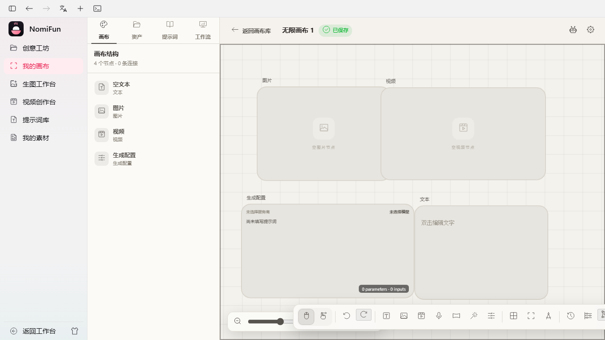
  <br/><sub><b>创意工坊 · 持久化 Canvas、独立媒体工作台、可复用提示词与素材、模板和受限 Director</b></sub>
</p>

<table>
  <tr>
    <td width="50%">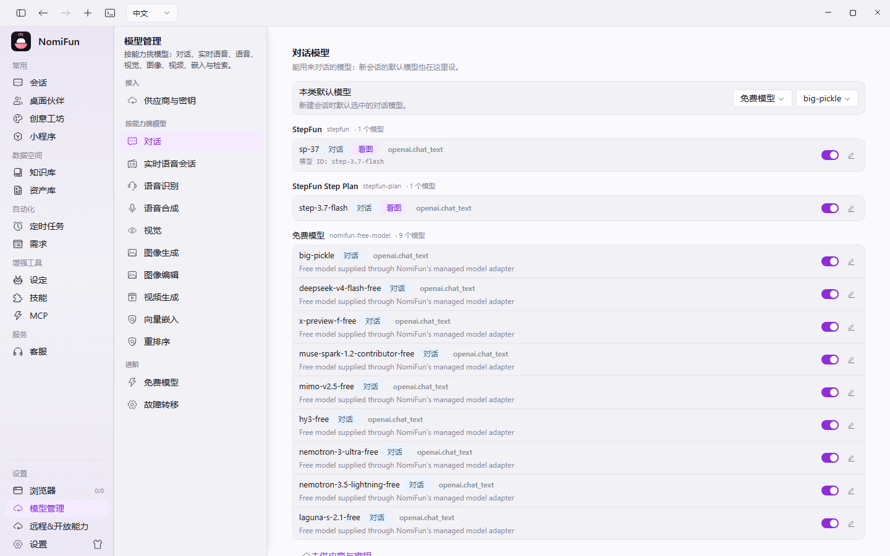<br/><sub><b>多模型管理 · 按任务路由与免费模型</b></sub></td>
    <td width="50%">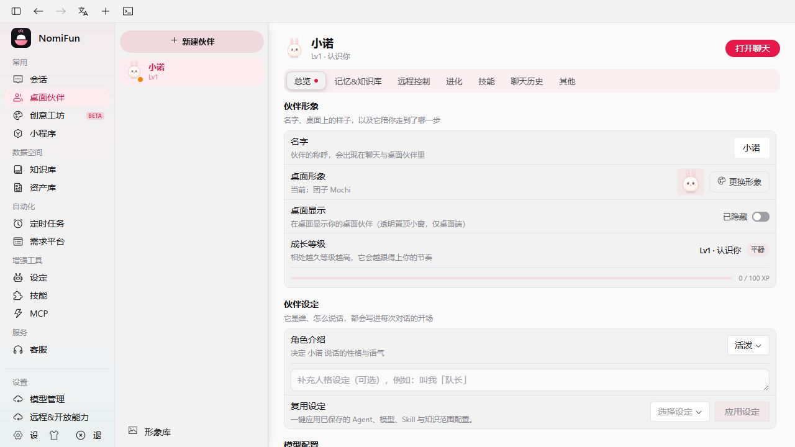<br/><sub><b>桌面伙伴 · 人格、记忆、模型与远程控制</b></sub></td>
  </tr>
  <tr>
    <td width="50%">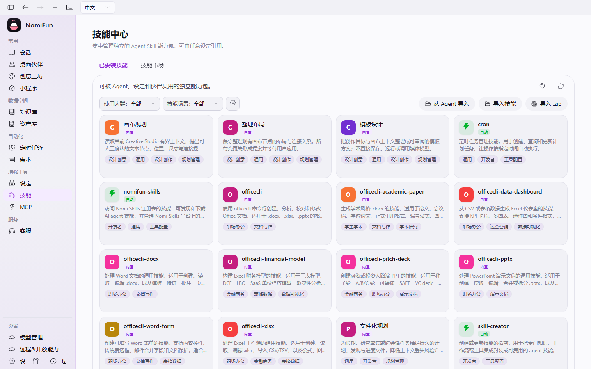<br/><sub><b>Skill 中心 · 可复用、受治理的 Agent 能力</b></sub></td>
    <td width="50%"><sub><b>更多创意工坊截图见下方</b><br/>编号画廊覆盖当前 Canvas、工作台、素材库、模板、Assistant、技能、Director 与伙伴协同流程。</sub></td>
  </tr>
</table>

<sub>已从当前 NomiFun 产品构建重新采集。完整截图清单、同步关系与使用范围见 <a href="docs/images/SCREENSHOTS.md">截图 manifest</a>。</sub>

</div>

---

## 🎨 创意工坊 —— 亮点新创作面

创意工坊是 NomiFun Desktop 中新加入的专注创作面，不是一张宣传图。
下面的编号画廊按真实产品入口展开：持久化 Canvas、独立图像与视频工作台、
Prompt Center、My Assets、私有模板与 AI Create、多图系列、Director、
Canvas Assistant、明确选择的 Creative Studio 技能，以及可选的原生桌面伙伴。

<table>
  <tr>
    <td width="50%">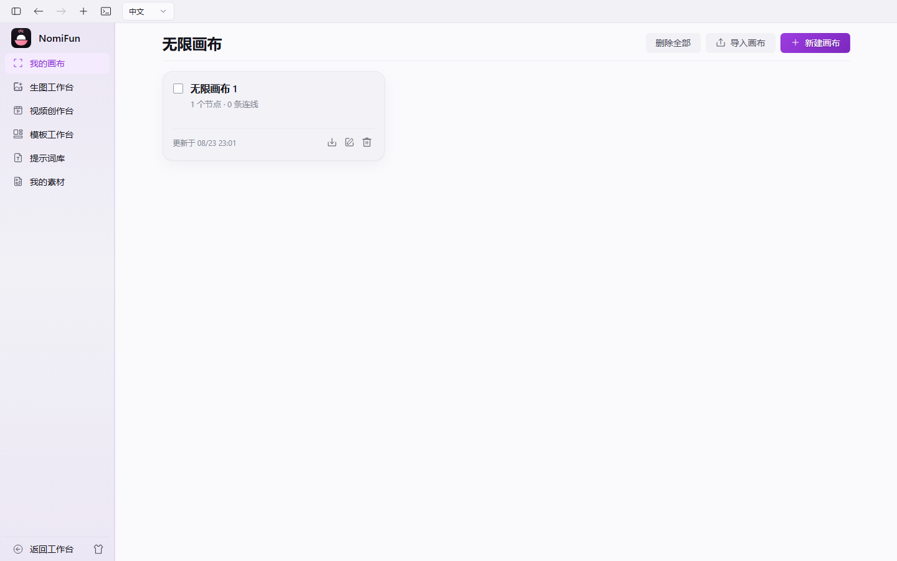<br/><sub><b>Canvas 库</b> · 新建、打开、管理、导入、导出持久化 Canvas</sub></td>
    <td width="50%">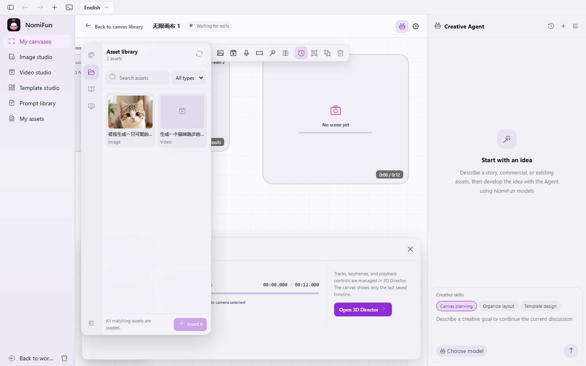<br/><sub><b>Canvas 编辑器</b> · 无限文档、媒体节点、素材库、Director 面板与 Assistant</sub></td>
  </tr>
  <tr>
    <td width="50%">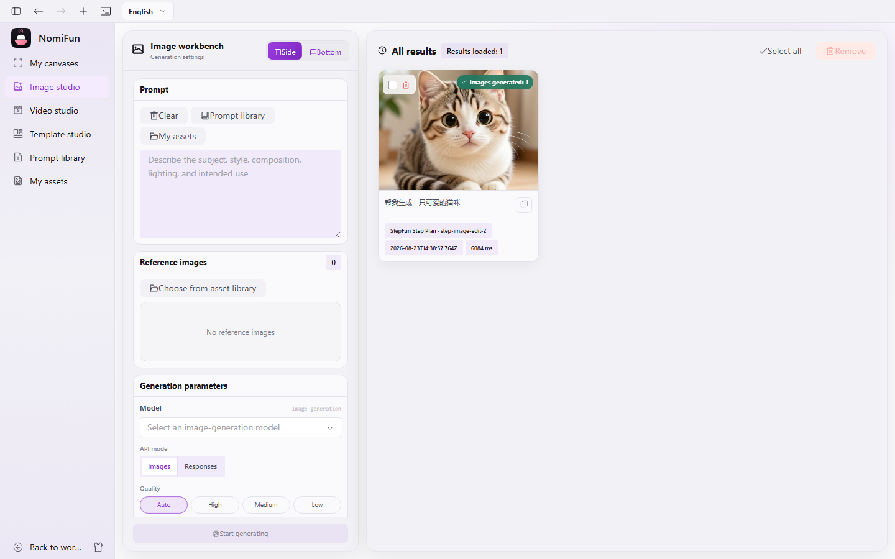<br/><sub><b>图像工作台</b> · 独立 T2I/I2I、精确图像任务与真实素材参考</sub></td>
    <td width="50%">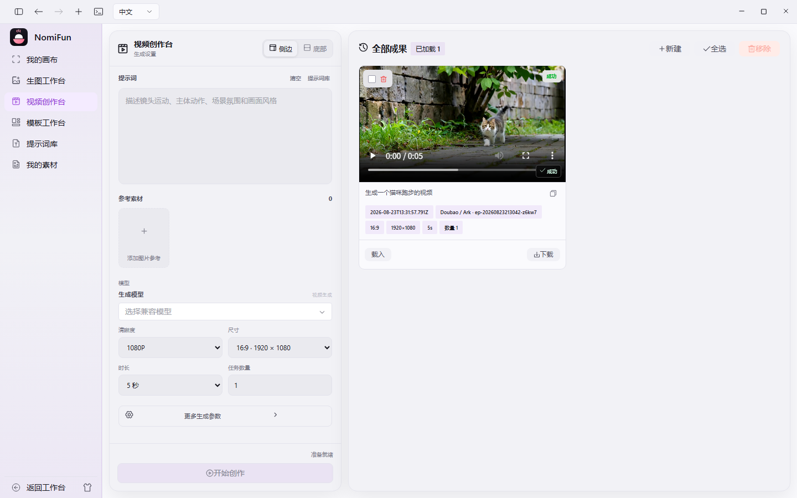<br/><sub><b>视频工作台</b> · 独立 T2V/单图 I2V、时长、画幅与历史记录</sub></td>
  </tr>
  <tr>
    <td width="50%">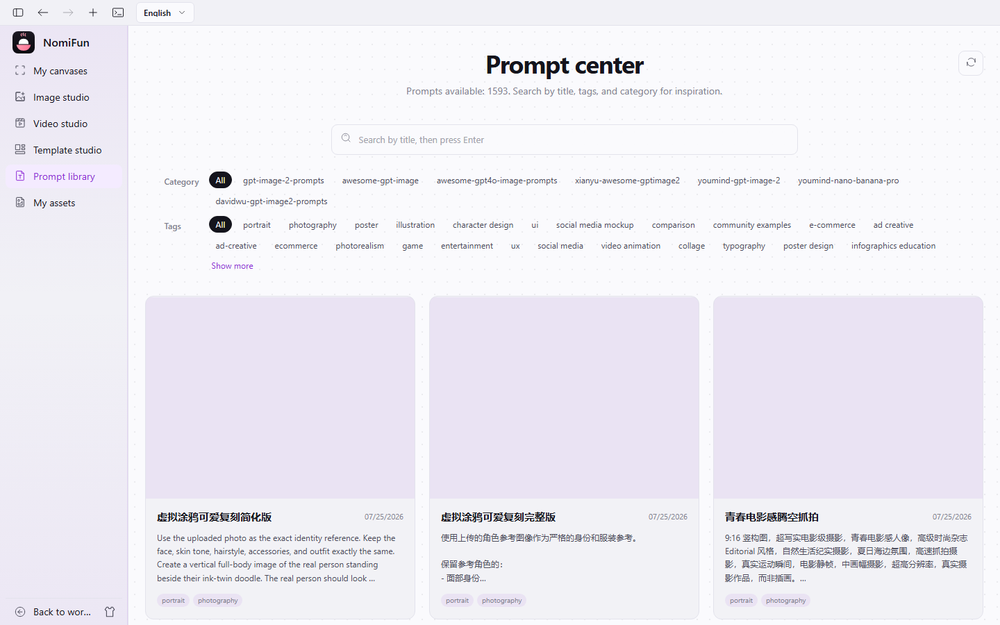<br/><sub><b>Prompt Center</b> · 可搜索、带来源归属的提示词目录，支持分类、标签、复制与保存到素材</sub></td>
    <td width="50%">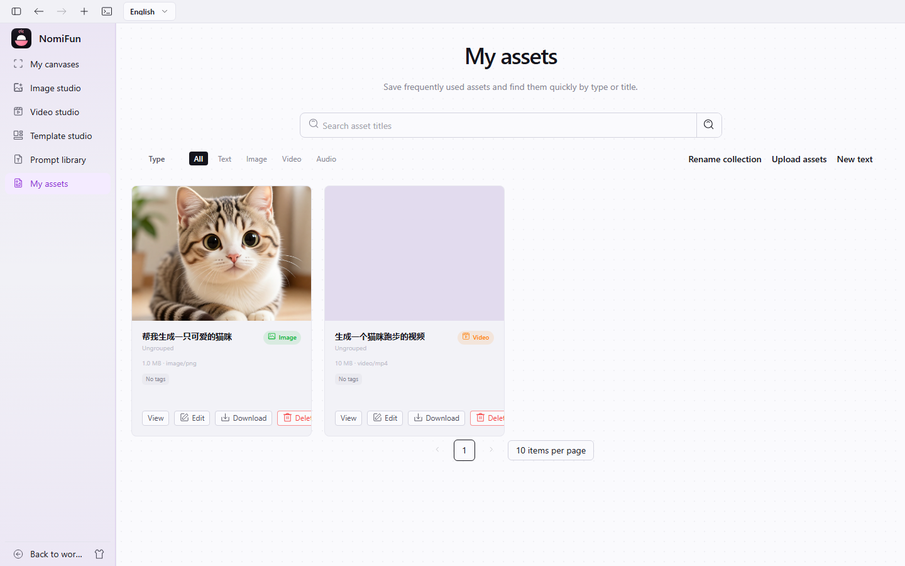<br/><sub><b>My Assets</b> · 可复用文字、图片、视频、音频，支持筛选、集合、标签与选择器</sub></td>
  </tr>
  <tr>
    <td width="50%">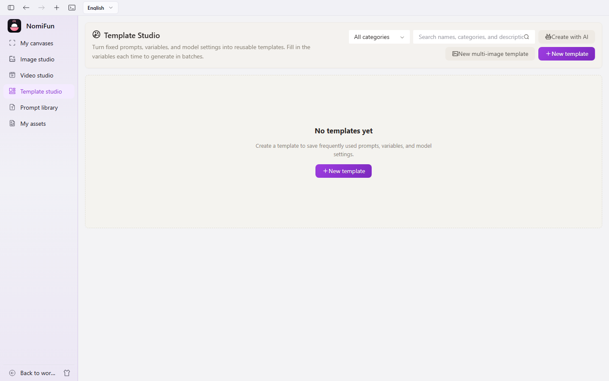<br/><sub><b>Template Studio</b> · 私有单图与多图系列模板、变量和精确模型设置</sub></td>
    <td width="50%">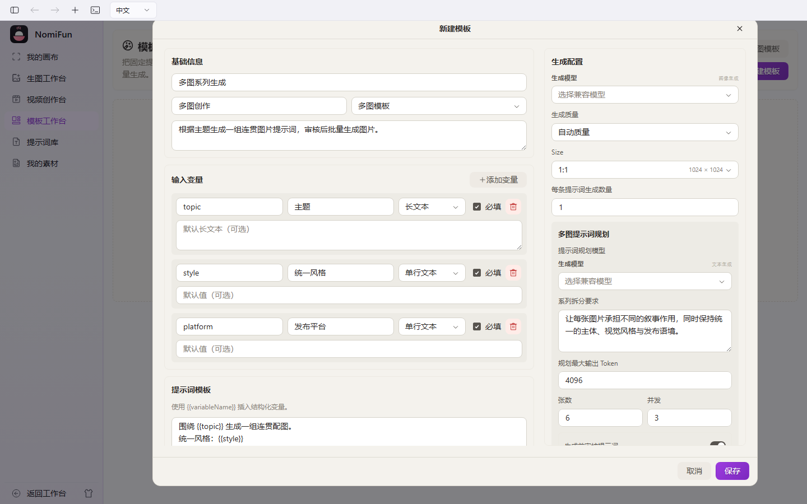<br/><sub><b>AI Create + 模板编辑器</b> · 审阅一份受限草稿，编辑后显式保存再复用</sub></td>
  </tr>
  <tr>
    <td width="50%">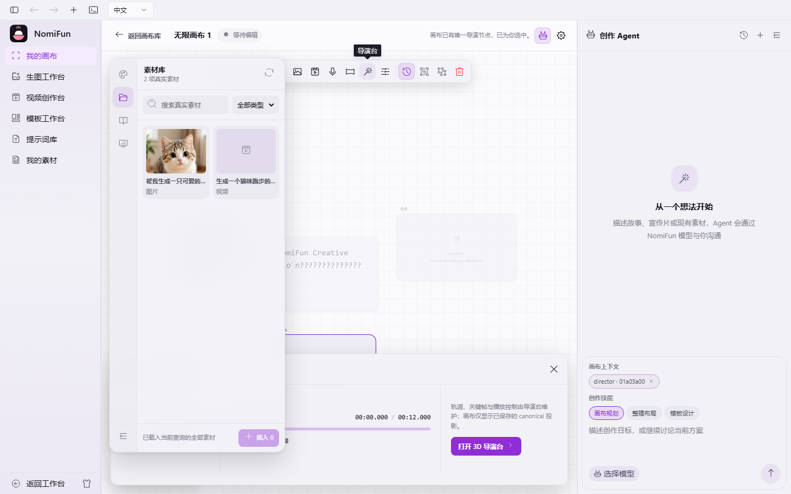<br/><sub><b>Director 时间线</b> · 绑定 Canvas 的受限 3D 场景、镜头、关键帧、捕获与引用</sub></td>
    <td width="50%">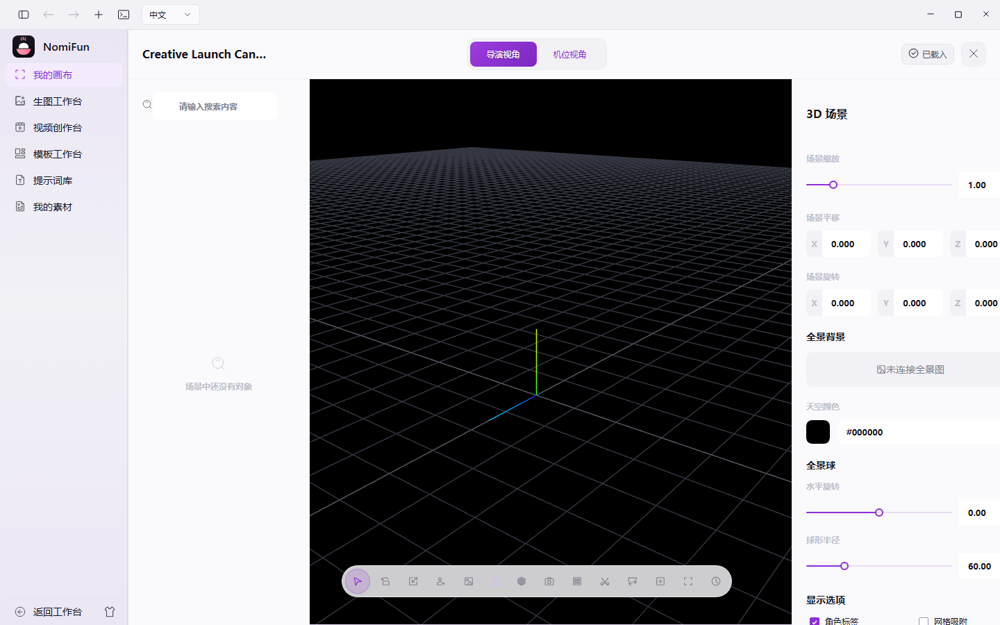<br/><sub><b>Director 舞台</b> · 绑定到 Canvas 的 3D 场景与机位视图</sub></td>
  </tr>
  <tr>
    <td width="50%">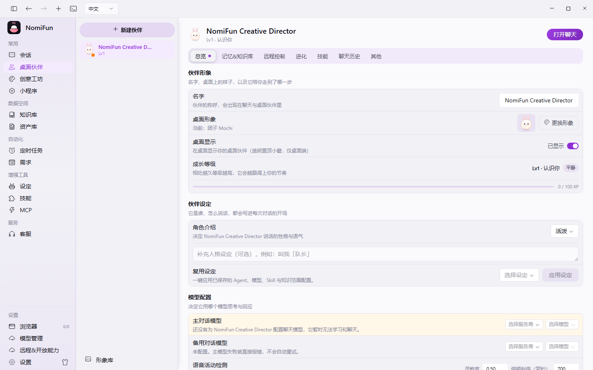<br/><sub><b>伙伴工作区</b> · 伙伴形象、人格、模型、记忆、Skills 与“显示在桌面”控制</sub></td>
    <td width="50%">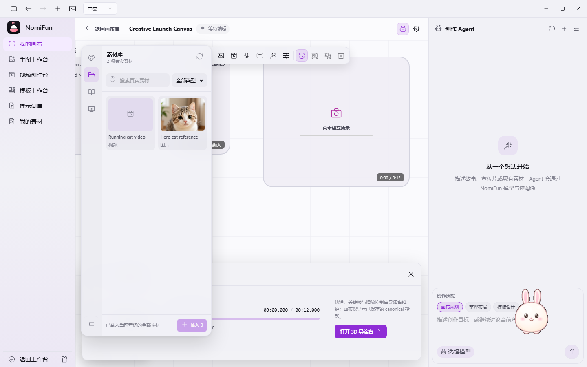<br/><sub><b>桌面伙伴协同</b> · 原生伙伴窗口可以在创作时保持可用</sub></td>
  </tr>
</table>

编号路径是 Creative Studio 画廊的稳定 README 约定：`01`–`12`。Canvas 编辑器截图
同时展示 Canvas Assistant 与明确选择的 Creative Studio 技能；上方 Skills Hub
截图展示这些技能作为可复用能力包。所有截图都应来自正在运行的产品，不应是
mockup 或凭空扩展的能力。完整来源与采集说明见
[`docs/images/SCREENSHOTS.md`](docs/images/SCREENSHOTS.md)。

面向用户的教程、首次使用与排障请使用
[NomiFun Portal 创意工坊指南](https://www.nomifun.com/zh/docs/guides/creative-workshop/)；
下方本地链接保留 Desktop 技术契约。

---

## 🚀 功能亮点

NomiFun Desktop 已经从 Agent 聊天客户端发展为本地优先、可扩展的 AI 工作空间。下面
这些产品界面共享同一套会话、模型、记忆、工具、权限与执行运行时：

| 产品能力 | 带来的价值 |
|---|---|
| **多 Agent 执行集群** | 按依赖规划任务，委派给专用 Agent，并行调度执行，同时提供实时状态、真实会话、审批、重试与恢复。 |
| **Agent 小程序** | 把普通 Agent 会话变成可预览、可发布的本地 Web 工具，同时保留可编辑工作副本与稳定的发布快照。 |
| **创意工坊** | 提供持久化 Canvas、独立 Image/Video Workbench、Prompt Center、My Assets、私有模板、AI Create、多图系列、Canvas Assistant、Creative Studio 技能、受限 Director，以及可选的桌面伙伴协同。 |
| **按任务路由的多模型控制面** | 将 provider 凭据与模型记录分开管理，支持原生与兼容/自定义 endpoint（含本地、自托管服务），并为聊天、实时、语音、视觉、媒体生成、Embedding 与 Rerank 提供任务级路由和故障切换。 |
| **NomiFun 免费模型** | 内置托管供应商，无需先手动新建供应商，即可启用、刷新目录、健康检查并开箱使用。 |
| **手机、机器人与开放接入** | Mobile 直连 Desktop，小智机器人绑定伙伴，并通过 WebUI、REST、MCP、IM 渠道和 NomiRelay 安全开放能力。 |

### 🐾 桌面伙伴 —— 越用越懂你

> 产品使用文档：[NomiFun Portal 桌面伙伴指南](https://www.nomifun.com/zh/docs/guides/companions/)

每天与你对话的伙伴，会悄悄变成那个最懂你的助理。

- **专属形象。** 上传自定义伙伴形象（DIY），或从与具体伙伴解耦的独立**形象库**中挑选。
- **一家人，而非一个脑。** 运行多个伙伴并同时使用，每一个都是完整的独立个体：**各自**的聊天模型、人格、记忆和领域知识库。每条记忆都只属于一个伙伴——你对工作伙伴说的话，不会漏进你在家里聊天的那一个。
- **聊天入口回到主会话。** 伙伴聊天现在直接进入主 **会话** 体系，并在侧边栏拥有独立的「桌面伙伴」分组；`/nomi` 则专注于伙伴管理。
- **它在学你（默认开启，首启动一次性确认）。** 后台 Learner 把你的使用蒸馏为长期记忆；确定性的进化引擎从你反复出现的多步工具序列中挖掘出 **skill 草稿**，提交给你审阅。记忆**完全可见、可编辑**。
- **自己写 skill。** 伙伴从真实工作里自动总结、生成 skill 并与你商议，确认后才留下。
- **不只是伙伴，更是超级网关。** 每个伙伴都是完整、独立的个体，可连接多个 IM 渠道。只要有网络和社交平台，随时随地一条消息，就能指挥伙伴帮你操作电脑。每个伙伴都能完整驱动桌面的系统能力。

### 🤖 小智机器人 —— 让桌面伙伴走进实体设备

> 产品使用文档：[NomiFun Portal 小智机器人指南](https://www.nomifun.com/zh/docs/guides/xiaozhi-robot/) · 固件：[nomifun-xiaozhi-yuntai](https://github.com/nomifun/nomifun-xiaozhi-yuntai)

通过局域网把兼容的小智 ESP32 机器人直接连接到 NomiFun。机器人提供麦克风、
扬声器、显示屏、舵机和设备端 MCP 工具；NomiFun 提供伙伴人格、模型、记忆、
ASR、TTS、会话和工具协同。接入入口就在每个伙伴的**远程控制 → 机器人连接**：
复制 OTA 地址，输入机器人显示的 6 位激活码，即可把实体设备绑定到该伙伴。

### 🧩 Agent 小程序 —— 把一次会话变成可复用工具

在普通 Agent 会话中创建小程序，在同一工作区预览，并显式发布稳定快照到本地小程序
库。Desktop 会把已发布版本与可编辑工作副本分开管理，因此后续迭代不会悄悄改变用户
正在启动的版本。每次修改仍然依附于一条正常、可审计的会话，而不是藏在小程序里的
第二套聊天系统；最终的小程序可以继续复用同一套本地 Agent、数据、模型和受治理工具。

### 🎨 创意工坊 —— 专注的无限画布创作

> 产品使用文档：[NomiFun Portal 创意工坊指南](https://www.nomifun.com/zh/docs/guides/creative-workshop/)
>
> 技术契约：[`docs/guides/creative-studio.zh.md`](docs/guides/creative-studio.zh.md)

创意工坊不是一次性的白板，而是一套持久化的创意文档系统。无限 Canvas 支持文字、
图片、视频、音频、全景、配置、Director 与分组节点。媒体节点负责可见的创作表面；
配置节点保存精确的 provider/model/task、类型化参数、有序输入、任务状态和结果，确保
每次生成都可审计。**Canvas Assistant** 只提出经过严格校验的图结构操作，失败时拒绝
执行，并等待用户点击**应用到画布**；它不会在后台静默修改文档或偷偷启动生成。

图像与视频工作台独立于 Canvas，即使没有任何 Canvas 也能使用。图像支持 T2I 与带真实
参考素材的 I2I；视频支持 T2V 与单张真实图片 I2V；音频创作通过 Canvas 音频节点与 TTS
提供。**Prompt Center** 提供可搜索、带来源归属的提示词集合；**My Assets** 管理可
复用的文字、图片、视频和音频，并支持类型筛选、集合、标签、元数据和素材选择器。参考
图只保存素材 ID，重载时逐项恢复，不会复用过期的浏览器对象。

**Template Studio** 把提示词、变量、精确模型绑定和输出计划整理成私有模板。**AI Create**
只生成一份严格草稿供审阅；点击应用只打开内存中的编辑草稿，只有显式**保存**才会持久化。
多图系列可在生成前要求人工复核。**Director** 是绑定到 Canvas 的受边界约束的 3D 场景与
时间线界面，支持镜头、关键帧、捕获和 Canvas 引用，但不冒充完整 DCC 或视频编辑器。

每项操作都携带精确启用的 `{ providerId, model, task }`：Canvas Assistant 与模板草稿使用
`chat`，T2I/I2I 使用 `image_generation`/`image_edit`，T2V/I2V 使用 `video_generation`，
TTS 使用 `speech_synthesis`。Canvas 写入使用基于 revision 的 CAS；冲突会停止自动保存而
不会覆盖新版本，任务历史在重载后只对账同一个 owner。Canvas ZIP v2 导出经过校验的文档、
引用素材闭包和 Director sidecar，同时继续兼容 v1 reader。独立工作台历史只按
`workbenchKind` 归属，不会暗中绑定 Canvas。

### 🧠 多 Agent 执行集群 —— 规划、调度与监督

从一条普通 Agent 会话开始。当任务需要专业分工或并行执行时，NomiFun 会创建一个与原始
Conversation 关联的持久化 `AgentExecution` 聚合，规划依赖图，把就绪步骤调度给被委派的
Agent；主 Agent 始终是整次执行的控制点。

- **依赖感知调度。** 相互独立的步骤可以并行；被依赖阻塞的步骤会等待前置结果，不会拿着不完整上下文抢跑。
- **逐步骤启动前控制。** 被委派 Agent 启动前可单独改模型、补充预置要求；完成或失败步骤可以沿用配置重试。
- **执行前先审批。** 开启计划审批后，系统会在规划完成时暂停并把执行图放回会话，让你调整后再开始。
- **实时状态与真实会话。** 跟踪每个步骤的状态，打开该 Agent 的真实会话，再返回主会话继续监督整个集群。
- **恢复属于执行本身。** 持久化状态支持重试与重启恢复，不会把集群任务降级成一次性后台消息。

### 🤖 智能值守 —— 需求平台 + AutoWork + IDMM

> 产品使用文档：[需求平台与 AutoWork](https://www.nomifun.com/zh/docs/guides/autowork/) · [智能决策（IDMM）](https://www.nomifun.com/zh/docs/guides/intelligent-decision/)

你只管下令，NomiFun 可靠地把活干完。

- **需求平台** —— 带有序轮转的 CRUD 存储、看板、标签与逐项 claim。
- **AutoWork** —— 自动 claim 待办需求、驱动一个回合、轮转到下一个，并在回合进行中续租保活。目标可以是**会话智能体**，也可以是**终端 PTY**。
- **IDMM（智能决策）** —— 逐会话的守护，穿越供应商故障与决策停滞维持会话存活；无 LLM 的规则层 + 旁路备用模型层，叠加在 AutoWork 之上。
- **出站通知** —— 完成通知可推送到**飞书/Lark** 自定义机器人、**Slack** 与 HTTP webhook。

### 📚 统一知识库

> 产品使用文档：[NomiFun Portal MCP 与 Skills 指南](https://www.nomifun.com/zh/docs/guides/mcp-and-skills/)

把散落在系统各处的知识，收拢到一个可管理、可追踪的地方。

- **集中管理与追踪** —— 创建、挂载，并跨会话、终端、伙伴追踪消费方。
- **安全回写** —— 代码强制、按使用面分级的写策略。每个挂载点自选**回写意识**：**手动型**（默认 —— 除非你在对话里明确要求，否则不回写）或**自动型**（智能体自主判断，只写它有把握、确有长期价值的内容）。两种意识下，更新已有文档都以 compare-and-swap **追加**，回写只能给你整理好的正文添内容，绝不覆盖。
- **实时 URL 快照** —— 把任意网页变成知识来源（带 SSRF 防护抓取、HTML→Markdown），支持*快照*（持久化、可重抓）与*实时*两种模式。
- **作用域受控的检索** —— 智能体调用 `knowledge_search` 工具，其作用域由服务端裁定、无法被擅自放大。

### 🖥️ 原生 Computer Use 与 Browser Use *（桌面版）*

> 产品使用文档：[NomiFun Portal Computer / Browser Use 指南](https://www.nomifun.com/zh/docs/guides/computer-browser-use/)

自研、**进程内 Rust** 实现 —— 不依赖 Playwright、不依赖 Node、不依赖第三方自动化守护进程。能力更强、速度更快、token 更省，提供细粒度控制，且完全开源供你增强。

- **Computer use** —— 无障碍树 + Set-of-Marks 叠层 + OCR，引导模型操作真实 UI 元素而非猜像素。macOS（AXUIElement + Vision OCR）与 Windows（UI Automation）已完整，Linux（AT-SPI2）为部分支持。
- **Browser use** —— 由应用主进程中的 `BrowserSessionHub` 统一管理 Chromium Host 与可寻址 Browser Lane；内置 Agent、Gateway 和并行 AgentExecution attempt 都进入同一平台，不再各自启动私有浏览器。
- **只做浏览器状态与生命周期管理。** 右侧 **Browser** 页面展示会话、runtime、Lane、Tab、URL、身份模式、容量、队列位置、压力、资源估算和错误；用户可对 running Primary Lane 显式“前台打开”，但页面不嵌入预览，也不提供页面输入或接管控件。
- **共享实时登录身份。** 普通交互式 Lane 使用 NomiFun 管理的稳定 Primary profile，并实时共享登录状态；公开抓取使用不携带 Primary cookies/站点存储的匿名身份，显式隔离任务使用独立身份。NomiFun 不读取用户真实 Chrome / Edge profile。
- **并发有界且可观察。** 不同 Lane 可真正并行，同一 Lane 严格串行；容量不足时显示队列位置、压力原因和建议并发，而不是用不可见的全局锁假装浏览器已就绪。
- **默认静默后台，按需前台打开。** 普通 Primary Agent 任务使用真实、headful 的受管 Chromium，但默认以最小化窗口在后台启动，不自动弹窗或抢焦点。对 running Primary Lane 执行“前台打开”会恢复同一个窗口和活动 target；显式登录流程则会自动前台打开。NomiFun 继续权威管理用户关闭、owner 撤销和受管进程树清理。
- **仅 Agent 操作页面。** 页面导航与输入只属于执行中的 Agent；浏览器高风险操作仍遵循既有 danger × surface 审批策略，但不再存在独立的查看器接管路径。
- **生而受控** —— 每个动作都带 danger × surface 审批矩阵，不可逆操作须显式确认。

> ℹ️ computer/browser 控制随**桌面应用**提供；无头的 web/server 宿主按设计不含。

### 🌐 开放能力总线 —— MCP + REST

> 产品使用文档：[NomiFun Portal 开放能力指南](https://www.nomifun.com/zh/docs/guides/open-capability/)

NomiFun 的每一项能力都经由单一、强类型的能力注册表对外开放 —— **约 20 个域、150+ 个工具** —— 让你能把 NomiFun 接进任何地方。

- **MCP 前门** 位于 `/mcp`（鉴权，Streamable-HTTP）。把 **Claude Code、Cursor 或你自己的智能体**指向它，它们就能像桌面伙伴一样操作 NomiFun。
- **REST + OpenAPI** 位于 `/v1/tools`，支持流式，并自动生成 `/v1/openapi.json`。
- 在总线上新增一项能力，会自动同时出现在 MCP **与** REST 上 —— 不漂移。

### 🧩 一个内置智能体，任意模型

> 产品使用文档：[NomiFun Portal 模型管理与路由指南](https://www.nomifun.com/zh/docs/guides/model-routing/)

- **内置 `nomi` 智能体** —— 无需额外安装，也是唯一的会话引擎。支持 **26+ 模型供应商/预设**（OpenAI、Anthropic、Gemini + Vertex AI、AWS Bedrock、DeepSeek、OpenRouter、Moonshot/Kimi、通义千问/Dashscope、智谱/GLM、MiniMax、SiliconFlow、xAI、火山/豆包 等），覆盖 **4 种线缆协议**，并支持 **New API** 聚合网关。
- **只有一条代码路径** —— 每个会话跑的都是同一个引擎，因此不论你选哪个模型，能力、工具策略、审批与故障转移的行为完全一致。
- **想用 Claude Code、Codex 或 Gemini CLI？** 请用**终端模式** —— 真实的应用内 PTY 会话，NomiFun 的能力经各 CLI 自己的原生配置注入。见 [Portal 终端指南](https://www.nomifun.com/zh/docs/guides/terminal/)。
- **处处可用** —— 这些原生能力对内置智能体、聊天界面**以及**终端一律可用。
- **多模态失败会优雅降级。** 如果当前模型/供应商不接受图片输入，NomiFun 会自动剔除图片、在同一会话里重试，并给出一条可见提示，而不是直接把整段会话打断。
- **每模型上下文窗口可单独校准。** 当上游平台默认值不准、没报全，或你想精细控制路由与长上下文预算时，可以按模型单独覆写上下文窗口上限。

### 🔌 多模型控制面 —— 供应商、能力与免费模型

NomiFun 把供应商凭据、模型记录与能力分开管理。你可以通过原生 provider、兼容协议、
自定义 base URL，以及本地或自托管 endpoint 持续扩展目录，再把模型分别用于聊天、
实时交互、ASR、TTS、视觉、图片生成/编辑、视频生成、Embedding 与 Rerank。路由会
感知任务类型，支持逐模型上下文/输出限制与故障切换，也不会假设不同供应商共用同一套
URL、协议或鉴权方式。

重要边界是显式能力，而不是固定厂商清单：只有所配置的 provider 与协议声明支持某项
任务时，模型才会被用于该任务。创意工坊会把精确的 `{ provider, model, task }` 身份
带入每次媒体操作，不会静默用另一个 provider 的同名模型替换。

**NomiFun 免费模型**通过内置托管供应商提供。无需先新建供应商或填写自己的 API Key，
即可启用服务、刷新模型目录、执行健康检查并激活可用模型，真正做到开箱即用。它们属于
在线第三方推理服务，可用性、限额和数据处理方式可能变化；发送敏感内容前请阅读产品内提示。

对于自有供应商，可以按地区、价格、额度、能力和数据政策选择，并在 **模型 & Agent**
页面填写凭据。下列均为第三方服务，费用、可用地区、速率限制与数据处理规则由各家控制。

| 供应商 | 快速入口 | 推荐关注点 |
|---|---|---|
|  **StepFun / 阶跃星辰** | [开放平台](https://platform.stepfun.ai/) | Step 系列模型，适合中文、Agent 与性价比场景 |
|  **Kimi / Moonshot AI** | [API Key](https://platform.kimi.ai/console/api-keys) | 长上下文、中文写作、代码与通用任务 |
|  **GLM / 智谱 BigModel** | [API Key](https://open.bigmodel.cn/usercenter/apikeys) | GLM 系列、通用推理、代码与企业接入 |
|  **Doubao / 火山方舟** | [API Key](https://console.volcengine.com/ark/region:ark+cn-beijing/apiKey) | 豆包系列模型，适合国内云账号与企业部署链路 |
|  **Qwen / 通义千问 / 百炼** | [API Key](https://bailian.console.aliyun.com/?tab=model#/api-key) | Qwen 系列、DashScope 生态与阿里云工作流 |
|  **MiniMax / MinMax** | [API Key](https://platform.minimax.io/user-center/basic-information/interface-key) | MiniMax 模型、长文本、多模态与语音能力 |
|  **MiMo / 小米** | [官网](https://mimo.mi.com/) | MiMo 系列模型与小米生态能力 |
|  **DeepSeek** | [API Key](https://platform.deepseek.com/api_keys) | 推理、代码与高性价比模型调用 |
|  **OpenRouter** | [API Key](https://openrouter.ai/keys) | 多模型聚合、统一账单、备用路由与模型对比 |
|  **Claude / Anthropic** | [API Key](https://platform.claude.com/settings/keys) | Claude 系列、长文本、代码与 Claude Code 生态 |
|  **GPT / OpenAI** | [GPT 模型](https://platform.openai.com/docs/models) · [API Key](https://platform.openai.com/api-keys) | GPT 模型、OpenAI API、Agent 工作流、代码与通用任务 |
|  **Gemini / Google AI** | [API Key](https://aistudio.google.com/app/apikey) | Gemini 系列、多模态、超长上下文与 Google AI Studio |

### 💻 终端模式 —— 第三方 agent CLI 的落脚处

> 产品使用文档：[NomiFun Portal 应用内终端指南](https://www.nomifun.com/zh/docs/guides/terminal/)

在应用内 PTY 会话里运行各种 agent CLI（或独立的 `nomi` CLI）。**Claude Code、Codex、Gemini CLI** 就是这样与 NomiFun 配合使用的：真实的伪终端，CLI 自己的登录与 OAuth，自己的审批提示，没有任何一处被重新实现。NomiFun 会把原生能力 —— 知识检索、需求完成、生命周期 hooks —— 经各 CLI *自己的*原生配置注入进去，从而保留完整保真度。AutoWork 也能逐回合驱动这样的终端。

### 📱 NomiFun Mobile —— 直连你的 Desktop

> 产品使用文档：[NomiFun Portal WebUI 远程访问指南](https://www.nomifun.com/zh/docs/guides/webui-remote/)
> · 应用：[nomifun-mobile](https://github.com/nomifun/nomifun-mobile)

局域网内无需社交平台，也无需 NomiFun 云中转。一键**扫码配对**会给手机签发短时效、
一次性的登录凭证，让 Mobile 直连 Desktop 进程内的认证监听器。Mobile 随即实时使用
Desktop 中同一套会话、任务、需求、伙伴、模型和工具；Desktop 始终是数据与执行权威端。
手机只是经过认证的连接客户端，因此不需要复制一套数据库，也不需要再保存一份模型密钥。

### ⚙️ config one，use anywhere

**知识库**、**设定 & Skills**、**MCP**、**模型**、**开放能力**的集中管理中枢 —— 配置一次，再按会话、终端、渠道或伙伴逐一选用。单一事实源，处处复用。

### 💬 11 个 IM 渠道

> 产品使用文档：[NomiFun Portal 渠道接入指南](https://www.nomifun.com/zh/docs/guides/channels/)

把伙伴绑定到下列任意渠道，从你已经在用的聊天工具里指挥它：

`Telegram` · `飞书 / Lark` · `钉钉 / DingTalk` · `微信 / WeChat` · `Discord` · `Slack` · `Matrix` · `Mattermost` · `Twitch` · `Nostr` · `QQ Bot`

---

## 🏗️ 架构

一套 React 前端、一套 Rust 后端，**两种宿主模式** —— 同一套后端在两者中均为进程内运行。

在产品家族层面，Desktop 同时也是 Mobile、小智、小程序和伙伴 IM 渠道的中枢。完整
通信、安全与创新模型见
[`docs/architecture/product-ecosystem.zh.md`](docs/architecture/product-ecosystem.zh.md)。

| | `nomifun-desktop` | `nomifun-web` |
|---|---|---|
| **外壳** | Tauri 2 桌面应用 | 独立 axum 服务器 |
| **后端** | 进程内嵌入，私有回环端口 | 同一后端，进程内 |
| **鉴权** | 注入 webview 的本地信任令牌 | 默认需要登录 |
| **提供** | 原生桌面 UI + 托盘 + 伙伴窗口 | 单端口提供 API + `/ws` + 已构建 SPA |
| **Computer / browser use** | ✅ 含 | ❌ 无头（不含） |

没有 Electron 外壳，没有 Node web 宿主，也没有预编译后端交接。

<details>
<summary><b>仓库结构</b></summary>

```text
apps/
  desktop/      Tauri 2 外壳与桌面专属命令
  web/          API + SPA 的独立 web 宿主
crates/
  agent/        15 个 nomi-* crate：引擎、供应商、工具、MCP、skills、记忆、
                browser/computer use，以及独立 nomi CLI
  backend/      29 个 nomifun-* crate：应用组装、鉴权、数据库、会话、
                MCP、知识库、需求、终端、伙伴、网关等
  shared/       2 个跨层 crate：nomifun-net 与 nomi-redact
ui/             桌面与 web 共用的 React 19 + Vite SPA
docs/           技术文档、用户/运维指南、架构说明
packaging/      web 宿主的 Linux 部署支持
```

系统全景从 [`docs/architecture/overview.zh.md`](docs/architecture/overview.zh.md) 入门。Cargo 工作区定义见 [`Cargo.toml`](Cargo.toml)。

</details>

---

## 🚀 快速开始

> 📦 **下载安装包**：优先使用 [GitHub Releases](https://github.com/nomifun/nomifun-desktop/releases)；中国大陆下载可使用 [百度网盘镜像](https://pan.baidu.com/s/5GPonoJNrwJ7GciBSDgXLaA)（分享名：`nomifun`）。也可以从源码安装，或用 Docker 跑服务器。

**前置依赖**

- [Rust](https://rustup.rs) —— stable 工具链，edition 2024
- [Bun](https://bun.sh) ≥ 1.3.13
- 建议在 PATH 中具备（以获得完整 agent 工具链）：`node` / `npm` / `npx`、`git`、`ripgrep`

**桌面应用（源码）**

```bash
git clone https://github.com/nomifun/nomifun-desktop.git
cd nomifun-tauri
bun install

bun run dev      # 热重载开发
bun run build    # 为当前操作系统打桌面安装包
```

**Web 服务器（自托管）**

```bash
bun run build:ui && bun run serve:web
# 单端口提供 API + SPA：http://127.0.0.1:8787（需登录）
```

**Docker（自托管服务器）**

官方镜像已发布到 Docker Hub：
[`nomifun/nomifun-web`](https://hub.docker.com/repository/docker/nomifun/nomifun-web)。
下面示例使用稳定滚动标签 `latest`。如需可复现部署，请固定明确版本或镜像 digest。

```bash
# 拉取并运行官方镜像。
docker run -d \
  --name nomifun-web \
  --restart unless-stopped \
  -p 8787:8787 \
  -v nomifun-data:/data \
  nomifun/nomifun-web:latest
# 然后打开 http://<服务器IP>:8787 并创建首位管理员
```

无人值守或公网部署时，建议在端口可访问前预置首位管理员：

```bash
docker run -d \
  --name nomifun-web \
  --restart unless-stopped \
  -p 8787:8787 \
  -v nomifun-data:/data \
  -e NOMIFUN_ADMIN_USERNAME=admin \
  -e NOMIFUN_ADMIN_PASSWORD='change-me-to-something-strong' \
  nomifun/nomifun-web:latest
```

Docker Compose 也可以直接使用官方镜像：

```yaml
services:
  nomifun:
    image: nomifun/nomifun-web:latest
    restart: unless-stopped
    ports:
      - "8787:8787"
    volumes:
      - nomifun-data:/data
    environment:
      NOMIFUN_ADMIN_USERNAME: admin
      NOMIFUN_ADMIN_PASSWORD: "change-me-to-something-strong"
      # 当 NomiFun 位于 HTTPS 反向代理之后时设置为 "true"。
      NOMIFUN_HTTPS: "false"

volumes:
  nomifun-data:
```

如果你想从当前仓库源码本地构建镜像：

```bash
docker compose up -d --build
# 然后打开 http://<服务器IP>:8787  —  配合自带的 Caddyfile 启用 TLS

# 已有 ui/dist 和 target/release/nomifun-web 时的快路径：
bun run docker:prebuilt -- --tag nomifun/nomifun-web:latest --build-missing --sudo
```

详见 [Portal 安装指南](https://www.nomifun.com/zh/docs/getting-started/installation/) 与本地[Web 服务器部署契约](docs/guides/web-server-deployment.zh.md)。

---

## 🛠️ 开发

```bash
bun install        # 安装依赖（一次性）
bun run dev        # 桌面应用开发（热重载）
bun run dev:web    # web 宿主 + Vite 开发
bun run build:ui   # 构建 SPA
bun run check      # 前端 typecheck + i18n + 主题 + 脚本登记检查
bun run test       # Rust 测试（日常可用 test:fast 跑 nextest）
```

优先使用脚本入口而非裸 `cargo`/`vite` —— 它们附带了构建目录清理与一致性检查。第一次接触代码库？请读 [`CONTRIBUTING.zh-CN.md`](CONTRIBUTING.zh-CN.md)、[`CONTRIBUTING.md`](CONTRIBUTING.md) 与 [`docs/contributing/development.zh.md`](docs/contributing/development.zh.md)。

<details>
<summary><b>完整脚本目录</b></summary>

<!-- BEGIN GENERATED SCRIPTS (bun run help --readme) -->

| 脚本 | 说明 |
| --- | --- |
| **开发（热重载）** | |
| `bun run dev` | 启动桌面应用开发（tauri dev，热重载） |
| `bun run dev:web` | 启动 Web 全栈开发（后端 API + 前端 vite） |
| `bun run dev:ui` | 仅启动前端开发服务器（纯 vite，无后端） |
| **构建（出制品）** | |
| `bun run build` | 为当前操作系统打桌面安装包 |
| `bun run build:fast` | 快速构建可直接运行的 debug 桌面二进制（不打安装包） |
| `bun run build:win` | 打 Windows 安装包（NSIS），汇总到 dist/desktop/ |
| `bun run build:mac` | 打 macOS 安装包（.dmg），汇总到 dist/desktop/ |
| `bun run build:linux` | 打 Linux 安装包（.deb/.AppImage/.rpm），汇总到 dist/desktop/ |
| `bun run build:signed` | 打桌面包并签名+公证（仅 macOS） |
| `bun run build:updater` | 打桌面包并产出自更新 .sig 制品 |
| `bun run make:latest` | 扫描本机更新产物，生成/合并自动更新清单 latest.json |
| `bun run release:mac` | 一键 macOS 发版：自动判定追加/首发；首发用 -Version 打版本号 + -NotesFile/-Notes 建 Release；-DryRun 只预检 |
| `bun run release:win` | 一键 Windows 发版：自动判定追加/首发；首发用 -Version 打版本号 + -NotesFile/-Notes 建 Release；-DryRun 只预检 |
| `bun run release:linux` | 一键 Linux 发版：自动判定追加/首发；首发用 -Version 打版本号 + -NotesFile/-Notes 建 Release；-DryRun 只预检 |
| `bun run release:cloud` | 管理 CrabNebula Cloud 发布草稿、分平台上传、发布与更新端点验证 |
| `bun run build:ui` | 前端生产构建 → ui/dist |
| `bun run docker:prebuilt` | 用已有 ui/dist + nomifun-web release 二进制快速构建 Docker 运行时镜像 |
| **运行（组装好的应用）** | |
| `bun run serve:web` | 启动 Web 服务器，托管已构建的前端 |
| **测试** | |
| `bun run test` | 运行全部 Rust 测试（含 doctest） |
| `bun run test:fast` | 用 nextest 快速跑 Rust 测试（日常） |
| `bun run test:crate` | 运行单个 Rust crate：bun run test:crate <crate> [cargo 参数] |
| `bun run test:core` | 运行不含 desktop-only feature 的 Rust workspace |
| `bun run test:desktop` | 运行桌面壳测试，不监听或打包 ui/dist 资源 |
| `bun run test:browser` | 运行 browser-use 门控的 Rust 测试（browser-platform 全量 + gateway/ai-agent/nomi-agent/app 开启 --features browser-use；crate/core 车道会静默跳过这些） |
| `bun run test:ui` | 运行前端单元测试（bun test，收集 ui/src 下全部 *.test.ts/tsx） |
| **静态检查** | |
| `bun run check:process-runtime-boundary` | Enforce the supervised process runtime boundary and exact hand-off allowlist. |
| `bun run check:browser-platform-boundary` | Enforce the single BrowserSessionHub ownership boundary and reject private browser launch paths. |
| `bun run check:agent-vocabulary` | Enforce AgentExecution as the only active collaboration aggregate and permit only exact migration fences. |
| `bun run check` | 聚合静态检查：typecheck + i18n + 主题契约 + 图标导入 + 死 CSS 工具类 + 进程运行时边界 + Agent 词汇边界 + 脚本登记 |
| `bun run typecheck` | 前端 TypeScript 类型检查（tsc --noEmit） |
| `bun run check:i18n` | 校验 i18n 类型与 locale 键是否一致 |
| `bun run check:theme` | 校验预设 CSS 主题契约 |
| `bun run check:icons` | 校验 @icon-park/react 导入禁别名/禁命名空间（别名会被图标包装插件改写成非法代码，tsc 抓不到） |
| `bun run check:dead-css` | 死 CSS 工具类棘轮：拦住新增的 {text,bg,border}-[rgb(var(--ramp-N))] / border-border-N / border-b-base / border-b-light（存量记在脚本 BASELINE，只许变少） |
| **代码生成** | |
| `bun run gen:i18n` | 由 locale 重新生成 i18n 类型声明 |
| **维护 / 工具** | |
| `bun run clean` | 深度回收构建空间（debug 产物 + flycheck + 旧安装包） |
| `bun run seed:dev` | 用生产数据目录播种 dev 数据目录 |
| `bun run bump` | 统一改版本号：根 Cargo.toml(真源) + package.json + ui + Cargo.lock，可选 --tag 提交并打 tag |
| `bun run help` | 打印脚本目录（--check 校验登记 / --readme 生成 README 表） |

<!-- END GENERATED SCRIPTS -->

<sub>此表由 <code>bun run help --readme</code> 依据 <code>scripts/scripts.json</code> 在 <a href="README.md">README.md</a> 与本文件中自动维护，请勿手改。</sub>

</details>

---

## 📖 文档

- **产品使用：** [NomiFun Portal 中文文档](https://www.nomifun.com/zh/docs/) · [English docs](https://www.nomifun.com/docs/)
- **快速开始：** [安装](https://www.nomifun.com/zh/docs/getting-started/installation/) · [快速上手](https://www.nomifun.com/zh/docs/getting-started/quick-start/)
- **技术架构：** [`docs/architecture/`](docs/architecture)
- **技术契约：** [`docs/reference/`](docs/reference) · [`docs/guides/creative-studio.zh.md`](docs/guides/creative-studio.zh.md) · [`docs/guides/web-server-deployment.zh.md`](docs/guides/web-server-deployment.zh.md)
- **开发文档：** [`docs/contributing/`](docs/contributing) · [`CONTRIBUTING.zh-CN.md`](CONTRIBUTING.zh-CN.md)

产品教程、截图、首次使用和用户排障统一由 Portal 管理。本仓库主要保留
源代码架构、API/线协议、部署、开发、安全与发版资料。

---

## 🗺️ 敬请期待

NomiFun 目前处于 **pre-1.0**，且为兼职开发，所以还有很多正在路上：预编译安装包、入站 issue / 需求来源接入、更多知识库连接器（飞书及更多）、官方桌面安装包 —— 以及几个我们非常期待的惊喜。**敬请期待。** ✨

---

## 🤝 贡献与社区

NomiFun 非常需要你的加入来壮大 —— 代码贡献、社区运营、技术布道都热烈欢迎。如果你对这个项目有热情，请[联系我们](#-联系我们--社区)，与我们一起共建 NomiFun 的生态。

- 阅读 [`CONTRIBUTING.zh-CN.md`](CONTRIBUTING.zh-CN.md) 完成环境搭建、了解检查阶梯；英文版见 [`CONTRIBUTING.md`](CONTRIBUTING.md)。
- 友善相待 —— 见 [`CODE_OF_CONDUCT.md`](CODE_OF_CONDUCT.md)。
- 发现漏洞？请按 [`SECURITY.md`](SECURITY.md) 操作。
- 从 [open issues](https://github.com/nomifun/nomifun-desktop/issues) 找一个起点。

---

## 💛 写在最后（来自作者）

> 开发者兼职、精力有限，很多惊喜功能还在路上。如果你认同这件事，欢迎以任何方式加入 —— 一行代码、一条建议、一次转发，都是莫大的鼓励。

NomiFun **完全开源、毫无保留**。个人与企业都可以在它之上二次开发并商用。

- **欢迎二次开发与商用。** 同时，这些行为风险自担 —— 作者与贡献者不承担后续一切法律责任。Apache-2.0 无需我们另行授权。
- **告知一声，是渴望而非要求。** 如果你二次开发或商用 NomiFun，希望你能留言告知我们 —— 这*不是*授权条件，只是因为「知道项目被认可」这份肯定，正是让它走下去的动力。
- **部分功能被刻意排除在开源版之外** —— 为了让本地数据的承诺滴水不漏。在没有足够人力与资金保障每位用户数据安全的前提下，移除它们是负责任的选择。等条件允许，我们希望把更多功能奉上给大家。

谢谢你来到这里。🙏

---

## 🔗 友情链接

这些是我们欣赏的产品与项目：

| 产品 | 简介 |
|---|---|
| [Saytive](http://saytive.ai/) | **Be Creative, Be Saytive.** Saytive 是一款专为创意工作者打造的语音输入法，它通过顶级模型和产品设计，自动感知你的工作上下文，提供快速准确而符合场景的转写体验。 |
| [Fast](https://fast.saien.pro) | **搜索，一触即达。** 你只需输入文字并点击，即可直达小红书、抖音、美团等数十个主流应用的搜索结果页面。拒绝信息流，专注搜索本身，搜索本该如此简单。 |
| [AionUi](https://github.com/iOfficeAI/AionUi) | AionUi 内置完整的 AI agent 引擎。不同于需要你额外安装 CLI agent 的工具，AionUi 安装后即可使用。 |

---

## 📬 联系我们 / 社区

以下联系信息由 NomiFun 开源产品家族统一使用。对于可复现的问题与功能建议，优先使用
GitHub Issues。

| 渠道 | 入口 |
|---|---|
| 🌐 **官网** | [www.nomifun.com](https://www.nomifun.com) |
| 🐙 **问题反馈** | [github.com/nomifun/nomifun-desktop/issues](https://github.com/nomifun/nomifun-desktop/issues) |
| 📮 **联系页** | [www.nomifun.com/contact](https://www.nomifun.com/contact) |
| 📕 **小红书** | [NomiFun](https://xhslink.com/m/4x6ti8n6cA1) |
| 📺 **哔哩哔哩** | [NomiFun](https://b23.tv/0UhgKDh) · [演示视频](https://www.bilibili.com/video/BV1kwKZ6UE5X/) |
| 🎵 **抖音** | [NomiFun](https://v.douyin.com/MDT5QVdYaJk/) |
| ▶️ **YouTube** | [@NomiFun-o2y](https://www.youtube.com/@NomiFun-o2y) · [演示视频](https://youtu.be/AsEToBDFR9s) |
| 𝕏 **X (Twitter)** | [@colir0](https://x.com/colir0) |
| 🎬 **TikTok** | [@colir0luo](https://www.tiktok.com/@colir0luo) |

**加入交流群** —— 扫码即可：

<div align="center">
<table>
  <tr>
    <td align="center">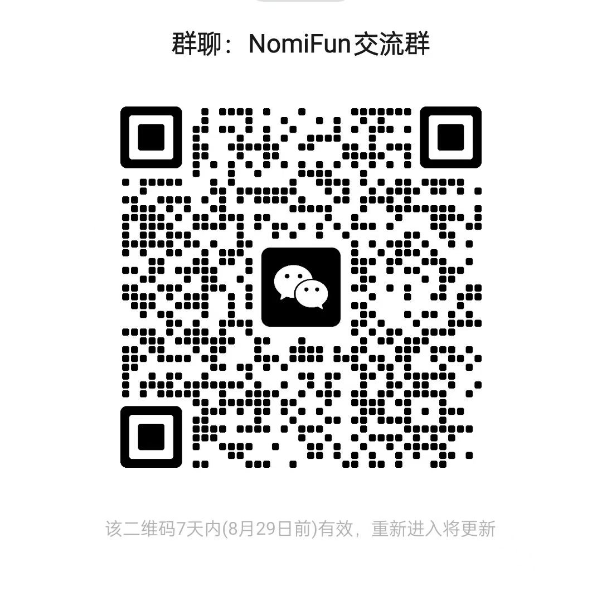<br/><sub><b>NomiFun 微信交流群</b></sub></td>
    <td align="center">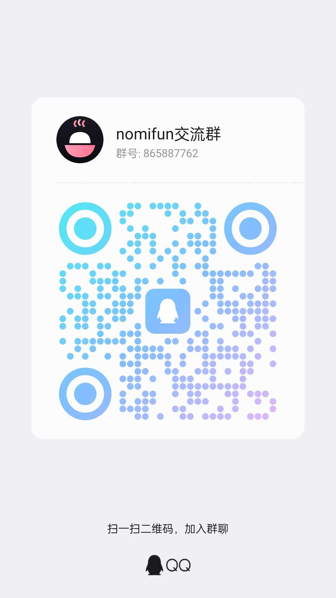<br/><sub><b>QQ 群</b></sub></td>
  </tr>
</table>
</div>

---

## ⚖️ 许可证

[Apache-2.0](LICENSE) © 2025–2026 NomiFun。

第三方署名见 [`NOTICE`](NOTICE)。

<div align="center">
<br/>
<sub>用 💛 打造，献给希望以自己的方式拥有 AI 的人。</sub>
<br/><br/>
<a href="#top">⬆ 回到顶部</a>
</div>
