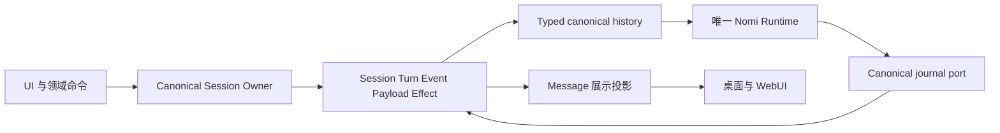

# Agent Session 日志与内容架构

AgentSession 是 NomiFun 会话、回合、内容、效果和取消的唯一事实链。产品里的“对话”和 Conversation 接口投影同一个 `AgentSessionId`，不创建第二份会话。Chat 与 Coding 都由 `nomifun.nomi` 的同一个进程内 Runtime 执行。

本页是当前开发入口。执行合同来自 Rust 类型、Session event registry 和 canonical schema；历史设计及施工说明只保存在 Git 历史中。修改实现时同时更新本页，不另建一份可长期使用的旧设计说明。

## 事实与派生数据

| 数据 | 所有者与用途 |
| --- | --- |
| `agent_sessions` 和 binding transitions | Session 身份、冻结的 Agent Revision 与 Snapshot、资源及明确的 Agent 切换边界 |
| `agent_turns` | accepted input 对应的 operation、准入、幂等、状态和终态回执 |
| `agent_events` 和 `agent_payloads` | 有序语义事件和它们引用的内容，是上下文与展示的事实来源 |
| `agent_effects` | 统一的效果回执；结果含义仍由执行效果的领域解释 |
| `agent_session_resources` | 不可变资源定义；保留效果回执引用的定义。当前授权集合只来自当前 `agent_binding_json.typed_resource_bindings` |
| `agent_messages` | 用户界面的查询投影；不能补造缺失的 Runtime 事件或推断完成 |
| native Runtime checkpoint | 精确绑定 build、Snapshot、Session 和 cursor 的恢复数据；不是另一套 transcript |
| AgentExecution 和领域数据 | Execution 的 Step、Attempt、租约及领域自身业务事实；引用同一 Session 与 Turn，不复制会话日志 |

### Runtime 上下文读取

`engine_history.rs` 从 canonical events 及已解析 payload 构建 typed history，不读取 `agent_messages` 来决定模型消息角色。Runtime 回合通过有序的 native journal 重建；缺失结构化日志不能降级成聊天文本继续执行。

准入后、Runtime 启动前就失败或取消的输入仍是有效 accepted input。读取时保留这个输入和明确的终态事实，不伪造 Runtime 启动、工具结果或完成证明。

Creation prompt、Cron notice、AgentExecution summary 使用正式消息事件成为数据上下文。Agent 切换前的文本和工具结果只从已提交的 canonical event/payload 读取。工具结果保持原文，以明确的不可信历史数据包装进入下一 Agent；不重放旧工具角色，不继承旧 Agent 系统指令、权限、可用进程句柄或完成门槛。历史图片和音频不作为新观察传输；MCP resource journal 仅记录 owner settlement 时不能补造资源正文。上下文清空事件和当前 accepted root cursor 限定读取窗口。

### 当前会话内的历史

同代会话的前序 Turn、不可变 Snapshot、显式 Agent transition 和模型切换是当前产品语义。它们需要验证身份、binding、sequence 和内容完整性。它们不授权读取退役的 Conversation 表、私有 transcript 或旧格式投影。

可执行恢复必须满足 native checkpoint 的精确 build 和 binding 条件；只读的已关闭事件历史允许经过明确验证的模型或 Agent transition 边界。不能为了恢复而扩大权限或补造缺失日志。

Agent 或资源切换不能删除已结算效果引用的资源定义，也不能修改同一 binding ID 的定义。所有持久资源定义使用合同层 `resource_definition_id`：摘要覆盖 kind、resource、owner、operations、connection 和完整参数，排除 ID 自身；相同定义复用 ID，权限或参数改变生成新 ID。调用方在最终工作目录和策略参数确定后生成 ID，不以物理资源 ID 替代定义身份。执行期权限收窄继续引用原 canonical 定义，不写入第二份资源定义。

Store 在同一事务中更新当前 binding 并保留必要的历史引用；资源查询、知识库挂载和删除保护只按当前 binding 选取资源。历史定义用于回执追溯，不赋予新 Agent 权限，不形成第二份活动资源账本。

### 内置浏览器与 Agent Browser 授权

用户侧栏浏览器是 Browser domain 的同 Session 实体：认证 owner 可以直接导航网页，不以 Agent Module grant
或 typed resource binding 作为人工浏览的前提。用户打开或重试不会改写 canonical Agent binding。
Agent Browser 工具仍只从当前冻结 Snapshot、exact Provider 与 typed Resource binding 获得权限；授权后的
managed Agent wrapper 借用用户的同一真实页面，attached Chrome 工具继续独立指向已连接的 Chrome。

所有 Agent Turn 在预备阶段取得同 Session 用户浏览器的原生输入锁，包括没有 Browser 工具的聊天。
预备失败、取消和正常终态经过同一 retained owner 清理；settle 仅排空操作，exact Turn 终态持久化后才 finish 与解锁。下游清理或终态写入失败继续保持原生硬件锁。canonical running 与原生输入锁之间的窗口不放行用户创建或命令。
用户 Profile 使用独立于授权定义的 owner/Session 身份，路径为 `browser-v4/agent-sessions/<hash>/`。
Session 删除也关闭与清除此用户实体，即使当前 Agent binding 中没有 Browser 资源；不另建 Agent 活动授权账本。
详见 [浏览器架构](browser-platform.zh.md)。

Runtime SDK 对同一已发表终态的重试，只能在原 root、delivery、Snapshot/route 与 canonical Runtime terminal
完全匹配时确认既有回执并继续原生 final release，不新增终态或改写失败结果。未执行取消的代际零证据链保持独立。
原生 `turn/paused` 仍保留 active Operation 与 checkpoint 恢复权；它不作为最终终态进入用户重建证明或重复终态 ACK。
完整 Runtime teardown 后，资源上下文按 exact 实例退出宿主 Weak cache；保留旧 handle 不会复活已关闭上下文，
迟到的旧 cleanup 也不会释放或驱逐后继实例。

### 推理强度

Session 只持久化一个 native `reasoning_effort`，取值由共享 `ReasoningEffort` 合同定义。写入与读取使用同一字段，不维护有损镜像，不从旧字段回退。数据库 schema 更新不得从已退役的 Agent 字段重建会话内容。

## 消费端边界

UI 直接消费当前 stream 与 Message projection，不保留缺少旧协议 marker 时启动的本地终态加工状态机。错误使用明确的当前 error code；不以旧错误文字猜测其含义。

内置 Agent 的界面名称来自 host 验证的 `official_template_key` 与统一翻译；创作入口统一显示“创作”。隐藏的内部会话配置只保存稳定模板 key，并按完整官方 seed 核验后修正显示元数据。浏览器创作草稿只保存媒体输入，不镜像 Agent 身份或名称；新旧会话使用同一个名称来源。个人 Agent 仍使用其冻结身份，名称修正不改写不可变 Revision、Snapshot、Session binding 或事件历史。

思考的实时展示按 canonical Turn 与 model step 使用独立于正文的稳定消息标识，历史投影使用同一标识。已记录的正文、工具或下一 model step 事件由 Runtime 展示适配器发出该思考条目的 `done` 通知；UI 直接消费它，不能因为整个任务仍在执行而继续显示已完成条目的加载状态。Turn 终态回执关闭该 Turn 的剩余思考展示，不依赖会话级处理中标志。

Channel 从当前 owner 和 typed binding 找 Session。存在会话记录但没有 authority binding 时应报告冲突，不能选择最早的旧记录自动回绑。新建、重置与取消均调用 canonical owner。

Cron、Companion、Requirements、AutoWork、IDMM 和 AgentExecution 可以保留各自业务配置及监督状态，但会话输入、准入、取消与终态必须引用 canonical Turn receipt。Conversation 名称不代表另一个存储源。

AgentExecution 的正常结算、重启恢复与人工采纳通过同一个 Session 输出查询读取精确 Turn 的终态、正文和工具效果。查询在同一事务中只解析该 Turn 的事件窗口，不扫描整个 Session 的历史。正文限于该 Turn 的 canonical assistant 内容，不能读取 UI 投影、推理文本或后续 Turn。产物来自该 Turn 已结算的文件操作或发布回执，并验证工作区身份、路径、字节数与摘要；目录扫描、模型声称已保存和旧工具展示 marker 都不是产物证据。同路径的后续写入、修改和删除按事件顺序决定最终可交付状态。

Execution 的 Step spec 是任务输入，不是另一份产物合同。完成要求由唯一 Runtime 的 typed requirements、completion 和 delivery 机制执行；调度器不能从自然语言中的参考文件、格式或数量猜测第二个验收门槛。恢复使用 canonical Session owner 的完整 OperationId，与正常结算共享输出和错误分类；终态元数据不能冒充任务正文。缺失、未知或未完成的回执不授权自动重放，只有明确允许安全重试的结构化失败可进入重试调度。

自动工具路由只能提示当前输入中明确的动作和对象。内部委派输入只用 step_spec 判断意图，task_brief、参考内容和代码中的媒体词不能截断已授权工具目录。工具搜索覆盖全部已授权工具，包括已显示和延迟显示的工具；提前展示某个工具不增加权限。

取消先由 canonical owner 在同一事务中固定目标 Turn；Runtime 停止只使用该回执的目标和当前 native execution generation。重复取消、迟到 StopTurn 或原 Turn 已结束时不能取消后继回合。AgentExecution 的 StopTurn write-ahead intent 保存稳定取消标识和精确目标 OperationId；决策续执行与普通 Step 共用调度 job，使其他任务结算、取消和租约丢失能继续被处理。

## 数据切换与物理删除

重构采用同库 Agent 数据 clean cut：旧 Agent Session、消息、日志、Execution、Preset 与绑定不迁移、不展示、不兼容读取；非 Agent 配置按它们的 owner 和明确的数据切换合同保留。清理代码与文件不能直接操作开发者或用户正在使用的数据目录。

每次替换都必须同时删除旧 reader、writer、DTO、schema 字段、测试、夹具和文档。已经提交的数据库 lineage 与当前 schema 变更需要单独处理：不能偷偷改 checksum，也不能把长期多写和回退包装为普通升级。

不保留旧草稿自动导入、旧会话文本恢复、闲置的第二套 Runtime checkpoint API、历史删除合同或让生成器依赖过期文档的规则。需要追溯时查 Git 历史。

## 实现入口与验证

| 边界 | 实现来源 |
| --- | --- |
| Session 与 Store | [canonical_session_owner.rs](../../crates/backend/nomifun-conversation/src/canonical_session_owner.rs)、[store.rs](../../crates/backend/nomifun-agent-session/src/store.rs) |
| Runtime factory | [official_runtime.rs](../../crates/backend/nomifun-app/src/router/official_runtime.rs) |
| Journal 与 history | [engine_journal.rs](../../crates/backend/nomifun-app/src/router/engine_journal.rs)、[engine_history.rs](../../crates/backend/nomifun-app/src/router/engine_history.rs)、[unified_runtime_history.rs](../../crates/backend/nomifun-app/src/router/unified_runtime_history.rs) |
| Runtime | [nomifun-agent-runtime](../../crates/backend/nomifun-agent-runtime/src/lib.rs) |
| 合同与 schema | [nomifun-agent-contracts](../../crates/backend/nomifun-agent-contracts/src/lib.rs)、[Agent schema](../../crates/backend/nomifun-db/migrations/001_canonical_baseline.sql) |

运行受影响的 Rust 与 UI 定向测试、contract generator check、`bun run check:agent-session-boundary` 和 `bun run check:uarc-boundary`。renderer 变更还需 `bun run check:desktop-ui-boundary`；支持的最小桌面窗口为 880×600。

新建、连续 Turn、准入失败后继续、显式 Agent 切换、上下文清空、取消、进程重启、暂停恢复、未知效果及删除需要覆盖。结构化日志缺失必须拒绝继续，不能通过投影读者把测试修成绿色。
