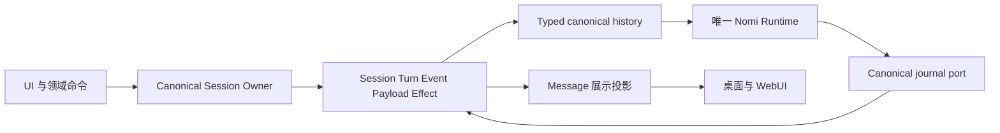

# Agent Session 日志与内容架构

AgentSession 是 NomiFun 会话、回合、内容、效果和取消的唯一事实链。产品里的“对话”和 Conversation 接口投影同一个 `AgentSessionId`，不创建第二份会话。Chat 与 Coding 都由 `nomifun.nomi` 的同一个进程内 Runtime 执行。

本页是当前开发入口。执行合同来自 Rust 类型、Session event registry 和 canonical schema；历史设计及施工说明只保存在 Git 历史中。修改实现时同时更新本页，不另建一份可长期使用的旧设计说明。

## 事实与派生数据

| 数据 | 所有者与用途 |
| --- | --- |
| `agent_sessions` 和 binding transitions | Session 身份、冻结的 Agent Revision 与 Snapshot、资源及明确的 Agent 切换边界 |
| `agent_turns` | accepted input 对应的 operation、准入、幂等、状态和终态回执 |
| `agent_events` 和 `agent_payloads` | 有序语义事件和它们引用的内容，是上下文与展示的事实来源 |
| `agent_effects` | 统一的效果回执；结果含义仍由执行效果的领域解释 |
| `agent_session_resources` | 不可变资源定义；保留效果回执引用的定义。当前授权集合只来自当前 `agent_binding_json.typed_resource_bindings` |
| `agent_messages` | 用户界面的查询投影；不能补造缺失的 Runtime 事件或推断完成 |
| native Runtime checkpoint | 精确绑定 build、Snapshot、Session 和 cursor 的恢复数据；不是另一套 transcript |
| AgentExecution 和领域数据 | Execution 的 Step、Attempt、租约及领域自身业务事实；引用同一 Session 与 Turn，不复制会话日志 |

### Runtime 上下文读取

`engine_history.rs` 从 canonical events 及已解析 payload 构建 typed history，不读取 `agent_messages` 来决定模型消息角色。Runtime 回合通过有序的 native journal 重建；缺失结构化日志不能降级成聊天文本继续执行。

准入后、Runtime 启动前就失败或取消的输入仍是有效 accepted input。读取时保留这个输入和明确的终态事实，不伪造 Runtime 启动、工具结果或完成证明。

可选 Mobile voice 的即时纠正只由明确设置 `SupersedeModelStep` 的 voice-started Turn 启用。普通文字请求的 `voice_immediate` 为 `None`，沿用原模型流、纠正边界和工具结算。voice 调用原 canonical writer 验证 Session、binding、context floor、精确 Operation 与 execution generation，不形成第二个工作引擎或权限账本。

中途替换模型步骤需要真实自有模型操作的取消及 JoinHandle 退出证明；关闭等待失败不授权启动后继模型步骤。`VoiceModelStepSuperseded` 记录精确 step、model Operation、已提交纠正 receipt IDs、未准入工具调用及清理证明。typed history 只排除该步骤已失效且未准入的生成内容，原审计事件与历史身份仍保留；其他步骤和已结算效果不受影响。工具的实际准入与纠正检查共享原 writer 的原子边界，已有准入工具先结算，不伪造 ToolResult 或重放未知效果。

voice 的转写、媒体、来源关联和待处理输入保存在独立 VoiceJournal，只引用上述 canonical 事实。模型重试的新调用 ID 不能重新准入同一已提交来源及同一意图。不能证明转写时钟与当时工作目标时，相对取消/纠正先等待 authenticated Mobile 用户对精确来源 revision 和目标呈现的确认，不能取收到事件时的最新任务补造关联。voice 关闭、媒体故障或 journal 不可用不改变文字请求的结果。

语音重启恢复只在 authenticated 用户显式启动语音并完成 lazy journal reconciliation 后接原 voice dispatcher。已确认尚未准入的 Queued 输入使用原 operation key、原策略及 namespace/binding/context-floor 围栏恢复；未知 Dispatched 只查原 canonical receipt，不盲发第二次。首次健康 HostedRuntime 的 constructor `status=None` 不表示忙碌：voice-only 入口同时验证原 registry、canonical active Turn、未结算效果与传输状态后才允许首次输入。普通文字启动及 Runtime 能力声明不改变。

voice 产品回执的可选 `request_kind` 仅来自应用实际解析、执行的输入，用于厂商无关的观测分类，不是供应商工具参数、权限或完成证明。触发事件先于工作 worker 的回执发布；纠正延迟仅从收到触发到同 operation 的 canonical Applied 回执计时。无法确定分类或没有这两个端点时无样本，不推断已听、成功或听感延迟。

Creation prompt、Cron notice、AgentExecution summary 使用正式消息事件成为数据上下文。Agent 切换前的文本和工具结果只从已提交的 canonical event/payload 读取。工具结果保持原文，以明确的不可信历史数据包装进入下一 Agent；不重放旧工具角色，不继承旧 Agent 系统指令、权限、可用进程句柄或完成门槛。历史图片和音频不作为新观察传输；MCP resource journal 仅记录 owner settlement 时不能补造资源正文。上下文清空事件和当前 accepted root cursor 限定读取窗口。

### 当前会话内的历史

同代会话的前序 Turn、不可变 Snapshot、显式 Agent transition 和模型切换是当前产品语义。它们需要验证身份、binding、sequence 和内容完整性。它们不授权读取退役的 Conversation 表、私有 transcript 或旧格式投影。

可执行恢复必须满足 native checkpoint 的精确 build 和 binding 条件；只读的已关闭事件历史允许经过明确验证的模型或 Agent transition 边界。不能为了恢复而扩大权限或补造缺失日志。

Agent 或资源切换不能删除已结算效果引用的资源定义，也不能修改同一 binding ID 的定义。所有持久资源定义使用合同层 `resource_definition_id`：摘要覆盖 kind、resource、owner、operations、connection 和完整参数，排除 ID 自身；相同定义复用 ID，权限或参数改变生成新 ID。调用方在最终工作目录和策略参数确定后生成 ID，不以物理资源 ID 替代定义身份。执行期权限收窄继续引用原 canonical 定义，不写入第二份资源定义。

Store 在同一事务中更新当前 binding 并保留必要的历史引用；资源查询、知识库挂载和删除保护只按当前 binding 选取资源。历史定义用于回执追溯，不赋予新 Agent 权限，不形成第二份活动资源账本。

### 内置浏览器与 Agent Browser 授权

用户侧栏浏览器是 Browser domain 的同 Session 实体：认证 owner 可以直接导航网页，不以 Agent Module grant
或 typed resource binding 作为人工浏览的前提。用户打开或重试不会改写 canonical Agent binding。
Agent Browser 工具仍只从当前冻结 Snapshot、exact Provider 与 typed Resource binding 获得权限；授权后的
managed Agent wrapper 借用用户的同一真实页面，attached Chrome 工具继续独立指向已连接的 Chrome。

所有 Agent Turn 在预备阶段取得同 Session 用户浏览器的原生输入锁，包括没有 Browser 工具的聊天。
预备失败、取消和正常终态经过同一 retained owner 清理；settle 仅排空操作，exact Turn 终态持久化后才 finish 与解锁。下游清理或终态写入失败继续保持原生硬件锁。canonical running 与原生输入锁之间的窗口不放行用户创建或命令。
用户 Profile 使用独立于授权定义的 owner/Session 身份，路径为 `browser-v4/agent-sessions/<hash>/`。
Session 删除也关闭与清除此用户实体，即使当前 Agent binding 中没有 Browser 资源；不另建 Agent 活动授权账本。
详见 [浏览器架构](browser-platform.zh.md)。

Runtime SDK 对同一已发表终态的重试，只能在原 root、delivery、Snapshot/route 与 canonical Runtime terminal
完全匹配时确认既有回执并继续原生 final release，不新增终态或改写失败结果。未执行取消的代际零证据链保持独立。
原生 `turn/paused` 仍保留 active Operation 与 checkpoint 恢复权；它不作为最终终态进入用户重建证明或重复终态 ACK。
完整 Runtime teardown 后，资源上下文按 exact 实例退出宿主 Weak cache；保留旧 handle 不会复活已关闭上下文，
迟到的旧 cleanup 也不会释放或驱逐后继实例。

### 推理强度

Session 只持久化一个 native `reasoning_effort`，取值由共享 `ReasoningEffort` 合同定义。写入与读取使用同一字段，不维护有损镜像，不从旧字段回退。数据库 schema 更新不得从已退役的 Agent 字段重建会话内容。

### 全局扩展与输入框选择

MCP 与 Skill 是所有 Agent 共用的全局能力，预设不持有扩展总开关。创建或空闲时明确更新会话选择，
host 捕获全局技能库，并把选中的 MCP 工具编译到同一 Session-only Revision/Snapshot；变体只使用
现有 Agent Store，不创建另一份绑定或权限台账。Library Skill 冻结正文、辅助资源、来源与摘要，
`selected` 控制默认输入注入；Package Skill 保留现役精确锁与原 JSON 合同。

输入框使用 typed `session_capabilities` 和带版本 CAS 的 capability-selection API，不读写 `extra.skills`
或 MCP 镜像。空闲更新复用 canonical binding transition，保留非 MCP 资源，完成 Runtime teardown
与效果结算后原子提交 binding、资源定义与 active set。活动或暂停 Turn、Remote 和 Attempt 禁止更新。
技能正文只从 Session 冻结内容读取，大正文和辅助资源由同一个 native context reader 按需读取，
不执行 Skill hooks、shell 或 fork，不增加工具权限。工具搜索由 Runtime 自动提供。

## 消费端边界

### 智能决策的消息来源与依据

IDMM 自动输入在正式 `message/user-accepted` 内容中保存服务端作者的
`idmm_decision` 合同，记录实际规则、旁路模型或恢复路径、当次模型身份、简短依据
及精确的问题消息引用。普通输入接口拒绝此保留字段和 `origin=idmm`；UI 不通过
正文、当前配置或有限的介入日志补造来源，也不从旧 origin 回填模型与依据。

首次自动投递与问题身份、完成序列和摘要的复核在同一 Store 写事务内进行；已被
回答、清空上下文或切换 Agent 的问题不能继续自动回答。已提交输入的重放仍使用
原 exact-input 幂等规则。来源与依据随 canonical 投影进入历史和实时查询，显示开关
只控制气泡外说明的展开，不改变模型调用、输入正文或 Runtime 上下文。

等待人工与决策失败使用 `idmm/notice-recorded` 正式事件，关联原问题并通过同一
事务投影成独立历史提示。提示不创建 Turn，不修改原问题，不形成 assistant 完成
回执，也不授权暂停恢复或重放效果。重复提示保留首次事实；问题已经被回答时不
追加过期提示。首版不持久化或显示模型自报的置信度。

UI 直接消费当前 stream 与 Message projection，不保留缺少旧协议 marker 时启动的本地终态加工状态机。错误使用明确的当前 error code；不以旧错误文字猜测其含义。

错误终态的诊断信息从本 Turn 已准入的 Agent、模型和工作区捕获，随同原始 detail 保存在既有 canonical 终态 payload 中。任务未完成的具体原因由后端生成 typed `taskIncompleteReason`，renderer 不从 detail 文字猜测原因。实时错误与历史投影读取同一终态信息；缺少历史诊断字段时不借用会话当前选择补造上下文。面向用户的原因和建议与折叠的技术细节分层展示。

模型请求的细分原因与请求证据使用同一个 `ModelFailureDiagnostic`，从调用层经过 Broker、typed failure 和既有终态进入 `providerDiagnostic`；不从英文文案、消息投影或未知错误正文重建分类。明确的上游机器码优先于笼统状态；401、403、404、429 等单独不足以证明 Key 过期、模型权限、错误 API 路径或余额耗尽时，提示保留不确定范围。记录脱敏的实际请求地址、服务商与模型、协议及认证方式、HTTP 状态、上游码/类型/参数、请求 ID 和等待提示；任意响应正文、凭证和认证头值不进入诊断。安全的本地传输原因可作为技术详情，诊断不改变重试、权限或终态规则。故障切换后的请求身份与会话所选模型分别展示；账号外链只使用与已记录服务商身份相符的可信配置。

失败、当前暂停和准入前请求错误使用同一报错展示组件。模型或服务商失败经过既有 owner 清理、原生资源释放与 canonical `turn/failed` 结算后，自动解除输入阻断，不要求用户再结束回合。当前代已保存的 typed 模型失败暂停可在启动、会话读取或下一次准入前由同一 owner 结算为失败；事务必须复核 exact pause revision、execution fence、Snapshot、当前代清理回执以及无 pending/unknown 效果，不运行模型、不重放工具、不转成成功或取消。清理未确认、未知效果、人工暂停与其他恢复暂停仍保留原生阻断和明确恢复权限。真正的暂停提示只从已确认的当前状态派生，不写入 Message 历史或补造失败终态。准入前错误仅在原会话临时展示，已准入请求的 canonical 错误替代其 HTTP 提示。

SSH 会话的主机身份直接来自当前 `agent_snapshot.canonical_binding.typed_resource_bindings`
中的 `ssh_host`，Header、侧栏分组和普通会话筛选共用这个 typed 来源。界面不能从
`extra.ssh_host_id` 回填或镜像资源身份；资源切换后的展示和链路状态必须匹配当前 binding。
远程命令的目录和环境属于真实长驻 shell，由 SSH owner 管理，不是另一份 Session 内容或环境台账。

内置 Agent 的界面名称来自 host 验证的 `official_template_key` 与统一翻译；创作入口统一显示“创作”。隐藏的内部会话配置只保存稳定模板 key，并按完整官方 seed 核验后修正显示元数据。浏览器创作草稿只保存媒体输入，不镜像 Agent 身份或名称；新旧会话使用同一个名称来源。个人 Agent 仍使用其冻结身份，名称修正不改写不可变 Revision、Snapshot、Session binding 或事件历史。

已有会话的创作模式、模型选择、参数与素材草稿按会话 ID 保存到持久浏览器存储；完整 key 同时隔离 backend dataset 与 Agent data generation。重启恢复用户最后选择的模式，包括明确选择的“日常对话”，不从最近生成任务反推或覆盖选择。欢迎页草稿及待提交准入状态仍使用会话级临时存储。新建创作会话的状态移交与后续编辑使用同一 writer，权威会话删除通知同时清理其草稿；这些界面编辑偏好不授予 Agent 权限，也不改变 canonical 事实链。

语言模型可以通过冻结预设中已授权的 `creation.media` 操作调用对应生成服务；生成路由按操作独立选择，产物入库不要求额外的画布或素材管理授权。大型工具目录中的 `deferred` 只控制 schema 展示，媒体提示或工具搜索展开 schema 时不改变权限；执行前校验所有其他 binding 字段并恢复冻结 binding，Kernel、Plugin 与资源 owner 继续执行原有精确检查。媒体专用配置可以不设 Chat，但明确选择的文本模型必须形成经过验证的 Session-local Chat 路由；没有 Chat 路由的历史 Session 不通过模型切换补造路由。文本创作按原生 Chat 配置校验并使用既有文本 executor，不经过单次媒体协议探测。

生成任务与产物读取由冻结的媒体模块授权控制，独立于是否存在直接创作输入框。普通会话、伙伴及只读 Attempt 都可呈现已授权任务；只读视图不提供取消、再创作或编辑转换等效果入口。工具返回任务已准入不是产物完成证明，界面继续读取对应 canonical Turn 的生成任务终态与实际资产。

工具的 canonical `capability_id` / `action_id`、模型调用名称和用户标题分别承担身份、调用和展示职责。第一方工具从共享 `contracts/tool-presentation.json` 选择简短调用名和中英文动作标题；MCP 与插件调用名保留可读的来源和动作，并用完整身份的摘要消除碰撞。展示目录不参与授权、效果判断、重试分组或 checkpoint 恢复。

实时工具消息从已准入的 typed `ToolStarted` 投影完整身份，历史消息沿用 canonical tool event 中的身份；两者使用同一展示规则呈现动作与查询词、路径或域名，原始名称和身份保留在展开详情中。既有日志的调用名保持原值，UI 不从被截断的路由名称补造动作身份。

思考的实时展示按 canonical Turn 与 model step 使用独立于正文的稳定消息标识，历史投影使用同一标识。已记录的正文、工具或下一 model step 事件由 Runtime 展示适配器发出该思考条目的 `done` 通知；UI 直接消费它，不能因为整个任务仍在执行而继续显示已完成条目的加载状态。Turn 终态回执关闭该 Turn 的剩余思考展示，不依赖会话级处理中标志。

思考阶段首个片段及正文交接先提交 canonical Runtime 事件，再发布实时通知；后续正文仍使用有界缓冲。同一 model step 在正文交织后恢复思考时更新原有条目及其明确状态，不能按相邻位置创建重复消息。活动 Turn 的历史读取从同 Turn 已提交的 typed Runtime 阶段事件推导 `thinking` / `done`，与实时展示共用阶段转换规则；已记录思考正文不等于思考完成，不新增持久状态或完成账本。

会话容器将已验证的活动 Turn、开始时间与对应用户请求标识传入时间轴，迟到消息不能通过列表位置关闭当前回合。页面重新挂载时，尚未确认的运行状态不能当作空闲或完成；历史与实时回执共用字段规范，未结束 Turn 的 `finished_at_ms: null` 表示没有结束边界，只有有限数值才能形成计时边界。活动回合的过程默认展开，回合终态后自动折叠；各思考阶段按自己的 `thinking` / `done` 状态展开或折叠，同一阶段内的正文刷新保留用户的手动选择。

`runtime.processing_started_at` 与 Turn summary 的 `started_at_ms` 均来自该 Turn 已提交的 `turn/started` 事件 UUIDv7 墙钟，Session sequence 只用于排序和分页。工作时间使用独立时钟，每秒与流更新按墙钟计算，回到前台立即校时；页面切回及部分历史窗口恢复同一开始时间，回合终态使用已提交的结束时间，计时刷新不重绘思考和工具正文。

Channel 从当前 owner 和 typed binding 找 Session。存在会话记录但没有 authority binding 时应报告冲突，不能选择最早的旧记录自动回绑。新建、重置与取消均调用 canonical owner。

Cron、Companion、Requirements、AutoWork、IDMM 和 AgentExecution 可以保留各自业务配置及监督状态，但会话输入、准入、取消与终态必须引用 canonical Turn receipt。Conversation 名称不代表另一个存储源。

AgentExecution 的正常结算、重启恢复与人工采纳通过同一个 Session 输出查询读取精确 Turn 的终态、正文和工具效果。查询在同一事务中只解析该 Turn 的事件窗口，不扫描整个 Session 的历史。正文限于该 Turn 的 canonical assistant 内容，不能读取 UI 投影、推理文本或后续 Turn。产物来自该 Turn 已结算的文件操作或发布回执，并验证工作区身份、路径、字节数与摘要；目录扫描、模型声称已保存和旧工具展示 marker 都不是产物证据。同路径的后续写入、修改和删除按事件顺序决定最终可交付状态。

Execution 的 Step spec 是任务输入，不是另一份产物合同。完成要求由唯一 Runtime 的 typed requirements、completion 和 delivery 机制执行；调度器不能从自然语言中的参考文件、格式或数量猜测第二个验收门槛。恢复使用 canonical Session owner 的完整 OperationId，与正常结算共享输出和错误分类；终态元数据不能冒充任务正文。缺失、未知或未完成的回执不授权自动重放，只有明确允许安全重试的结构化失败可进入重试调度。

完成审核只允许提交当前任务的完成报告时，执行工具暂时不在模型 schema 中，冻结授权并未
因此丢失。该阶段再次提议执行工具属于审核协议错误，不能重放已结算效果，也不能把未派发的
新提议计成实际执行失败或覆盖同一 Turn 中已有的工具回执。审核纠正必须明确保留这些 canonical
观察；实际失败、未知效果、未完成工作和证据不足仍由原有完成门槛拒绝。
审核阶段及其有界协议纠正预算由同一个 native checkpoint 保存；暂停恢复和上下文刷新
不能重新开放已关闭的执行工具。新的 accepted input 才能明确解除对应审核阶段，旧格式
checkpoint 不通过字段回退重建审核状态。

自动工具路由只能提示当前输入中明确的动作和对象。内部委派输入只用 step_spec 判断意图，task_brief、参考内容和代码中的媒体词不能截断已授权工具目录。工具搜索覆盖全部已授权工具，包括已显示和延迟显示的工具；提前展示某个工具不增加权限。

取消先由 canonical owner 在同一事务中固定目标 Turn；Runtime 停止只使用该回执的目标和当前 native execution generation。重复取消、迟到 StopTurn 或原 Turn 已结束时不能取消后继回合。AgentExecution 的 StopTurn write-ahead intent 保存稳定取消标识和精确目标 OperationId；决策续执行与普通 Step 共用调度 job，使其他任务结算、取消和租约丢失能继续被处理。

## 数据切换与物理删除

重构采用同库 Agent 数据 clean cut：旧 Agent Session、消息、日志、Execution、Preset 与绑定不迁移、不展示、不兼容读取；非 Agent 配置按它们的 owner 和明确的数据切换合同保留。清理代码与文件不能直接操作开发者或用户正在使用的数据目录。

每次替换都必须同时删除旧 reader、writer、DTO、schema 字段、测试、夹具和文档。已经提交的数据库 lineage 与当前 schema 变更需要单独处理：不能偷偷改 checksum，也不能把长期多写和回退包装为普通升级。

不保留旧草稿自动导入、旧会话文本恢复、闲置的第二套 Runtime checkpoint API、历史删除合同或让生成器依赖过期文档的规则。需要追溯时查 Git 历史。

## 实现入口与验证

| 边界 | 实现来源 |
| --- | --- |
| Session 与 Store | [canonical_session_owner.rs](../../crates/backend/nomifun-conversation/src/canonical_session_owner.rs)、[store.rs](../../crates/backend/nomifun-agent-session/src/store.rs) |
| Runtime factory | [official_runtime.rs](../../crates/backend/nomifun-app/src/router/official_runtime.rs) |
| Journal 与 history | [engine_journal.rs](../../crates/backend/nomifun-app/src/router/engine_journal.rs)、[engine_history.rs](../../crates/backend/nomifun-app/src/router/engine_history.rs)、[unified_runtime_history.rs](../../crates/backend/nomifun-app/src/router/unified_runtime_history.rs) |
| Runtime | [nomifun-agent-runtime](../../crates/backend/nomifun-agent-runtime/src/lib.rs) |
| 合同与 schema | [nomifun-agent-contracts](../../crates/backend/nomifun-agent-contracts/src/lib.rs)、[Agent schema](../../crates/backend/nomifun-db/migrations/001_canonical_baseline.sql) |

运行受影响的 Rust 与 UI 定向测试、contract generator check、`bun run check:agent-session-boundary` 和 `bun run check:uarc-boundary`。renderer 变更还需 `bun run check:desktop-ui-boundary`；支持的最小桌面窗口为 880×600。

新建、连续 Turn、准入失败后继续、显式 Agent 切换、上下文清空、取消、进程重启、暂停恢复、未知效果及删除需要覆盖。结构化日志缺失必须拒绝继续，不能通过投影读者把测试修成绿色。
