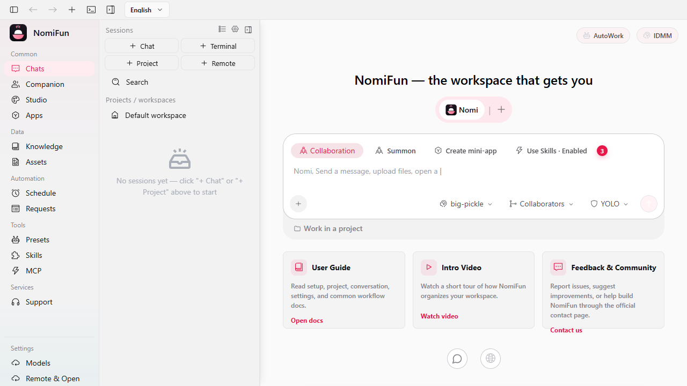

# Introduction

**NomiFun** is an open-source AI workstation and coding workspace. It unifies
one agent engine, an extensible provider/model control plane, Creative Studio,
MCP servers, skills, terminals, knowledge bases, scheduled work, and
companion/remote capability surfaces in one local-first application.

> Ready to run it? Start with [Installation](installation.md), then
> [Quick Start](quick-start.md). For the full documentation map, see
> [docs/README.md](../README.md).



## What NomiFun Solves

Modern AI workflows are scattered across separate CLIs, terminals, browser
tabs, MCP servers, and local scripts. NomiFun pulls them into one workspace:

- **One agent, one code path.** Every conversation runs the built-in Nomi
  engine, so capabilities, tool policy, approvals, and model failover behave the
  same way regardless of which model you point it at. Third-party CLIs such as
  Claude Code, Codex, and Gemini CLI run in
  [in-app terminals](../guides/terminal.md) instead, keeping their own auth and
  approval prompts.
- **One extensible model catalog.** Native providers, compatible protocols,
  custom endpoints, and local or self-hosted services share one catalog, with
  explicit task capabilities, context/output limits, and ordered failover.
- **One workspace per conversation.** Conversations can own files, previews,
  diffs, terminals, and knowledge bindings instead of living as isolated chat
  transcripts.
- **One creation system beyond chat.** Creative Studio combines a persistent
  infinite Canvas, independent Image/Video Workbenches, prompt and asset
  libraries, private templates, and a bounded Director.
- **Backend-driven automation.** Scheduled tasks, AutoWork requirements,
  terminal sessions, channel integrations, and completion notifications are
  durable backend services, not foreground browser-tab state.
- **Extensible capability layer.** MCP servers, skills, presets, browser use,
  computer use, and public remote capability fronts compose per conversation.
- **Local-first deployment.** Run it as a Tauri desktop app or a self-hosted web
  server. You provide the model/API credentials and decide where the data lives.

NomiFun is not a no-code SaaS chat product. It is infrastructure for users who
are comfortable configuring providers, local tools, and self-hosted services.

## Two Hosts, One Backend

Both hosts run the same Rust backend (`nomifun-app`) in-process and load the
same React SPA (`ui/dist`).

| Mode | Binary | Auth model | Typical use |
| --- | --- | --- | --- |
| Desktop app | `nomifun-desktop` | Per-boot local trust token injected into the desktop webview | Personal workstation |
| Web server | `nomifun-web` | Login required by default; first-run setup or pre-seeded admin | Browser / LAN / server deployment |

```text
nomifun-desktop
  Tauri shell -> embedded backend on 127.0.0.1:<ephemeral> -> same SPA

nomifun-web
  axum server -> /api + /ws + static ui/dist on one port (default 8787)
```

For implementation details, see [Architecture Overview](../architecture/overview.md).

## Main Surfaces

- **Home & conversations** (`/guid`): start and continue AI sessions.
- **Terminals**: PTY-backed agent or shell sessions inside the app.
- **Models**: providers, extensible model catalog, task capabilities,
  context/output limits, and global IDMM/failover settings.
- **Creative Studio** (`/workshop/*`): infinite Canvases, independent Image and
  Video Workbenches, prompts, reusable assets, private templates, and Director.
- **Presets & Skills**: reusable launch configurations and focused capability management.
- **MCP**: local MCP server configuration.
- **Open Capabilities**: WebUI remote access, remote MCP, and REST capability
  exposure.
- **Requirements / AutoWork**: backend-owned queue processing and completion
  notifications.
- **Scheduled tasks**: recurring or one-shot jobs.
- **Desktop Companion** (`/nomi`): companion configuration, memory, and remote binding.
- **Knowledge**: local knowledge-base management and session bindings.

The current frontend route source is
`ui/src/renderer/components/layout/Router.tsx`.

## Project Status

NomiFun is in active development. [STATUS.md](../../STATUS.md) is the compact
current-state snapshot. Design and audit history is not kept in the repo; consult
git history for past decisions.

## License

NomiFun is released under the Apache-2.0 License. See
[`NOTICE`](../../NOTICE) for third-party attributions.
