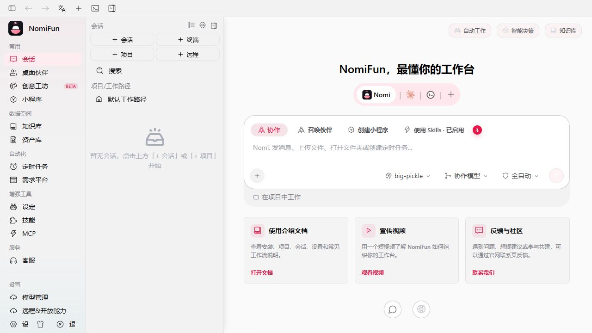

# 简介

**NomiFun** 是一个面向 AI agent 工作流的本地优先工作台。它把一个内置
Nomi 引擎、可扩展 provider/模型控制面、创意工坊、MCP 服务、技能、终端、
知识库、计划任务和远程 WebUI 收拢到同一个 Rust + Tauri monorepo 中。

> 想立刻开始？请先读 [安装](installation.zh.md)，再读
> [快速上手](quick-start.zh.md)。完整文档地图见 [`../README.zh.md`](../README.zh.md)。

## 它解决什么问题

真实的 AI 工作流经常被拆散在多个地方：一个终端跑 agent CLI，浏览器里开着
自托管页面，旁边还有单独的 MCP 服务、知识文档和项目脚本。NomiFun 的目标
不是再做一个聊天框，而是把这些东西接到同一个工作区：

- **一个智能体，一条代码路径。** 每个会话跑的都是内置 Nomi 引擎，因此
  不论你把它指向哪个模型，能力、工具策略、审批和模型故障转移的行为都一致。
  Claude Code、Codex、Gemini CLI 等第三方 CLI 则运行在
  [应用内终端](../guides/terminal.zh.md)里，保留它们自己的登录与审批提示。
- **一个可扩展模型目录，多处复用。** 原生 provider、兼容协议、自定义 endpoint，
  以及本地或自托管服务进入同一目录；任务能力、上下文/输出限制和故障转移也在这里
  统一管理，会话、设定、伙伴与计划任务都能复用。
- **一个工作区，不只是消息流。** 会话有工作目录、文件树、预览面板和后端
  管理的 PTY 终端。
- **一套不止于聊天的创作系统。** 创意工坊包含持久化无限 Canvas、独立
  Image/Video Workbench、提示词与素材库、私有模板和受限 Director。
- **后端驱动的自动化。** 计划任务、AutoWork、IDMM、WebUI 远程访问、
  MCP 暴露和频道能力都由 Rust 后端持久化管理。
- **桌面与 Web 共用后端。** Tauri 桌面端和 `nomifun-web` 自托管服务使用
  同一套 `nomifun-app` 后端与同一份 React SPA。

NomiFun 更适合已经在用 agent 做真实工作的用户。它要求你理解 API key、
本地数据目录和自托管边界；它不是零配置的 SaaS 聊天产品。

## 两种运行方式

| 模式 | 二进制 | 鉴权模型 | 典型用途 |
| --- | --- | --- | --- |
| 桌面应用 | `nomifun-desktop` | 桌面外壳使用本地信任 token 访问嵌入式后端；远程浏览器仍需登录 | 单机工作站、日常开发 |
| Web 服务 | `nomifun-web` | 默认开启登录；首次访问创建管理员 | LAN/VPN/VPS 自托管 |

桌面模式会在进程内启动 `nomifun-app`，监听一个随机 localhost 端口，并通过
每次启动生成的本地信任 token 让 WebView 免登录访问。WebUI 远程访问打开后，
额外的 LAN 监听器仍然要求远程浏览器登录。

`nomifun-web` 则在一个端口上同时提供 SPA 与 API，默认端口是 `8787`。Docker
和 systemd 部署都走这条路径。

## 当前功能地图

- **会话与工作区**：`/guid` 创建会话，`/conversation/:id` 运行会话。
- **模型配置**：`/models` 管理 provider、可扩展模型目录、任务能力、
  上下文/输出限制和全局故障转移队列。
- **创意工坊**：`/workshop/*` 管理无限 Canvas、独立 Image/Video Workbench、
  提示词、可复用素材、私有模板与 Director。
- **设定与技能**：`/presets` 管理可复用启动设定；`/skills` 独立管理技能。
- **MCP**：`/mcp` 管理 MCP server、连接测试、OAuth 和 agent 配置同步。
- **开放能力**：`/open-capabilities` 管理 WebUI 远程访问、MCP/API 暴露等外部入口。
- **桌面伙伴**：`/nomi` 管理伙伴、远程频道绑定和 companion 相关设置。
- **终端**：`/terminal-new` 创建、`/terminal/:id` 运行后端 PTY。
- **计划任务**：`/scheduled` 管理 cron 触发的会话任务。
- **AutoWork**：`/requirements` 管理需求看板和自动执行。

更多内部结构见 [`../architecture/`](../architecture/)，用户指南见
[`../guides/`](../guides/)。

## 项目状态

NomiFun 仍在活跃开发中，但已经不是旧的 Electron 多仓迁移状态。当前仓库是
Rust workspace + Tauri desktop + Web host 的单仓结构。顶层
[`../../STATUS.md`](../../STATUS.md) 记录当前状态；历史设计稿与审计记录不在
仓库中保留，需要时请查阅 git 历史。

## 接下来

- [安装](installation.zh.md)
- [快速上手](quick-start.zh.md)
- [开发环境](../contributing/development.zh.md)
- [Web 服务部署](../guides/web-server-deployment.zh.md)
