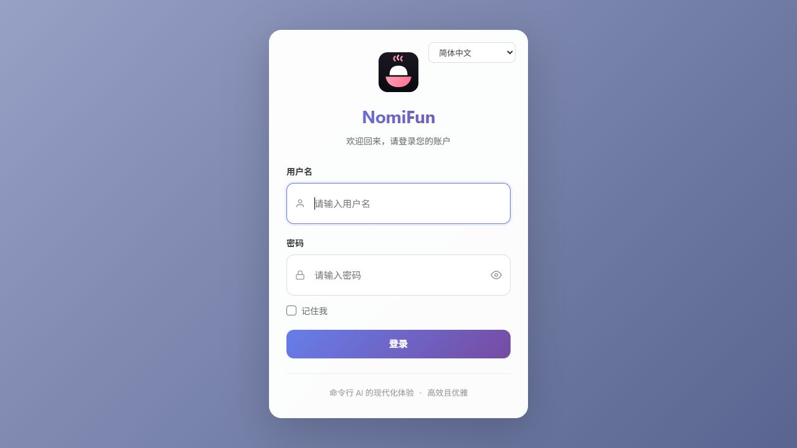
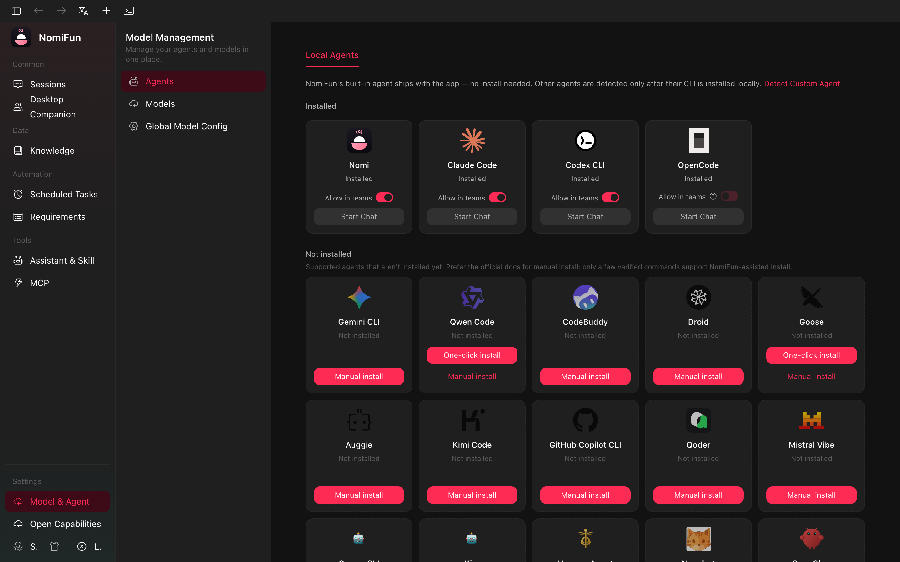

# Quick Start

A short walkthrough for the first useful NomiFun session. This assumes the repo
is already installed; otherwise start with [Installation](installation.md).

## 1. Launch

Desktop development:

```bash
bun run dev
```

The desktop shell starts the backend on a private loopback port and injects a
local trust token into its own webview. There is no desktop login screen.

Web server:

```bash
bun run serve:web
# open http://127.0.0.1:8787
```

The web host requires login by default. On a fresh data directory, the first
visitor creates the initial admin unless you pre-seed `NOMIFUN_ADMIN_PASSWORD`.



## 2. Start From `/guid`

After auth, the app opens `/guid`. This is the default session start surface.

You can choose:

- a model/provider,
- a reusable preset,
- skills or MCP tools,
- a workspace path,
- and the first prompt.


## 3. Configure A Model

Open **Models** (`/models`) and configure at least one provider. The page owns
provider credentials, the model catalog, and global reliability settings such as
IDMM and model failover.



For the simplest first run, use the built-in Nomi engine with an API provider
you have credentials for. If you would rather drive a third-party CLI such as
Claude Code, Codex, or Gemini CLI, install it on the host and run it in an
[in-app terminal](../guides/terminal.md).

## 4. Send The First Message

Back on `/guid`:

1. Choose a model if required.
2. Optionally choose a preset.
3. Type a prompt.
4. Send with the button or `Ctrl/Cmd+Enter`.

NomiFun creates a conversation and navigates to `/conversation/<id>`.

## 5. Use The Workspace

Each conversation can use a working directory. Inside a conversation you can
inspect messages, tool calls, file edits, previews, and terminal sessions.

Useful next pages:

- [Terminal](../guides/terminal.md)
- [MCP & Skills](../guides/mcp-and-skills.md)
- [Presets](../guides/presets.md)
- [AutoWork & Requirements](../guides/autowork-requirements.md)
- [Scheduled Tasks](../guides/scheduled-tasks.md)
- [Web Server Deployment](../guides/web-server-deployment.md)
- [Architecture Overview](../architecture/overview.md)
