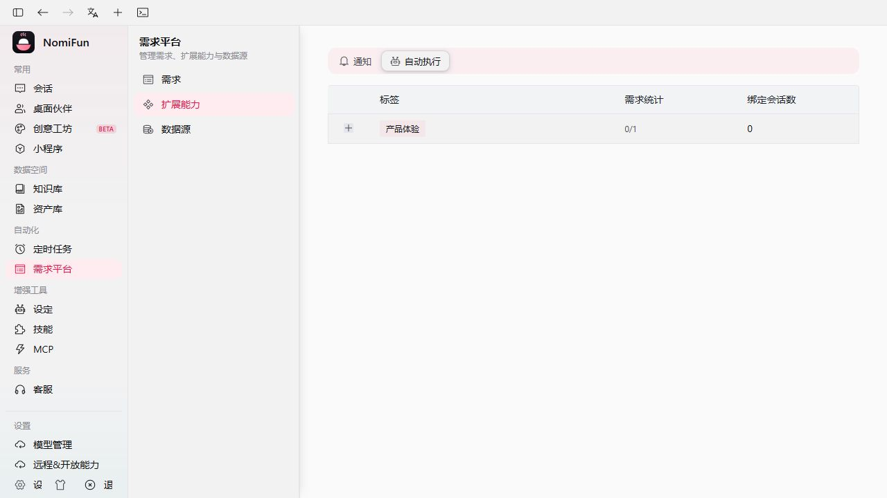
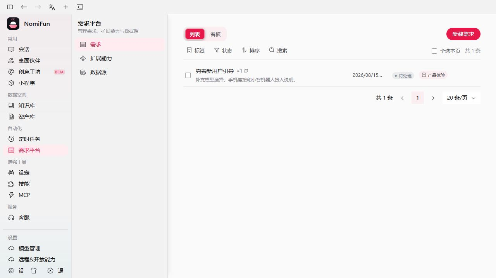
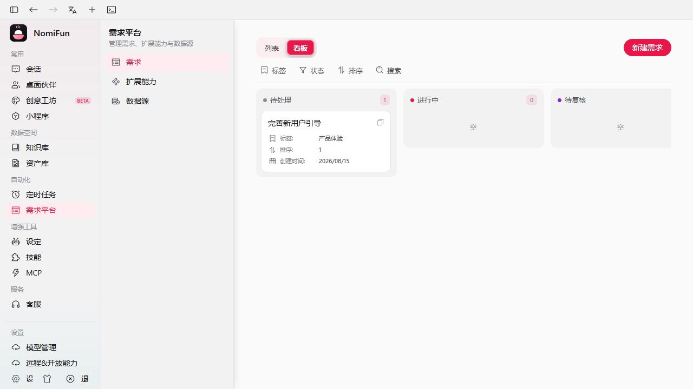
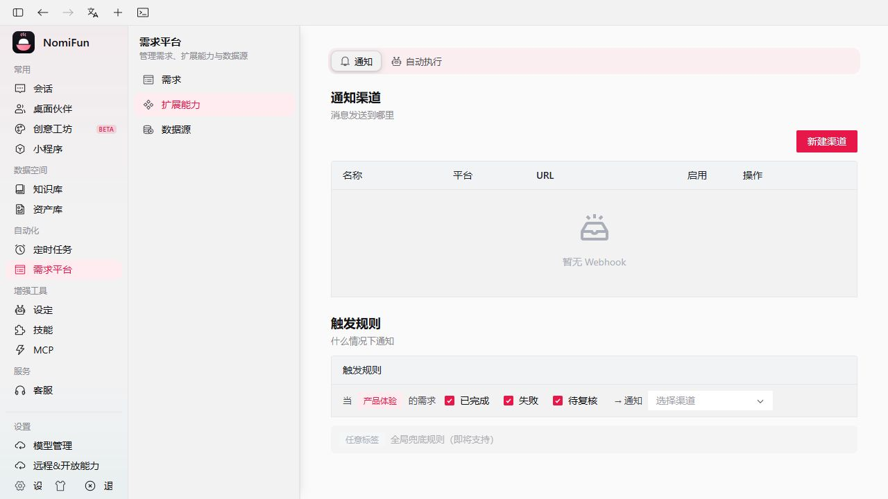

# AutoWork & Requirements

AutoWork is Nomi's flagship automation: a **requirements board** plus a
**per-AgentSession execution loop** that drives the Session's frozen Agent
through those requirements one at a time, without you holding its hand.

You file requirements, group them by tag, bind a tag to an AgentSession, and
the AutoWork loop claims, executes, and
finalises them in order. When a requirement reaches a terminal state it can
fire a **completion notifier** (Lark/飞书 webhook) so your team hears about
it the moment it lands.

Everything described here is **backend-authoritative**: AutoWork resumes on
boot and runs whether or not you have the UI open.



## Concepts

| Term                  | What it means                                                                                                                                                |
| --------------------- | ------------------------------------------------------------------------------------------------------------------------------------------------------------ |
| **Requirement**       | A unit of work: title, content (the actual instructions), tag, an `order_key` (string compared lexicographically), and a status. Stored in SQLite.           |
| **Tag**               | A free-form string used to group requirements into a queue. Bindings, kanban columns, and webhook routing all key off the tag.                               |
| **Status**            | `pending` → `in_progress` → `done` (or `failed` / `cancelled`). The kanban view has one column per status.                                                   |
| **Claim & lease**     | The AutoWork loop atomically transitions the lowest-`order_key` `pending` requirement in a tag to `in_progress` and writes a lease that expires.              |
| **Lease sweeper**     | A background task (every 60 s) that parks expired, ownerless `in_progress` rows in `needs_review`; expiry alone never proves that effects are safe to replay. |
| **AutoWork loop**     | The per-target loop that claims → injects → waits → finalises → repeats. One loop per bound session. Persistent: it idles when the queue drains, it does not exit. |
| **Target**            | A canonical AgentSession with one immutable Agent binding and resolved model. Terminal AutoWork has been retired. |
| **Execution receipt** | AgentExecution owns the Attempt, AgentSession turn and canonical terminal receipt. AutoWork advances the queue only from that durable result. |
| **Completion notifier** | A Lark/飞书 webhook fired when a requirement reaches `done`/`failed`/`cancelled`. Bound per tag.                                                            |

## Lifecycle of one requirement

```
pending  ──claim_next()──▶  in_progress (lease)  ──admission──▶  AgentExecution runs
                                  │                                   │
                                  ▼                                   ▼
                       sweeper parks ambiguous           AgentExecution receipt
                       expiry in needs_review                        │
                                                                     ▼
                                                            done | failed | cancelled
                                                                     │
                                                                     ▼
                                                       CompletionNotifier fires (best-effort)
```

The AutoWork loop does **not** exit when the tag is empty. It awaits a wake
notification (with a 10 s safety-net poll) and keeps claiming forever, so a
new requirement filed against a bound tag is picked up almost instantly.

It exits only when:

- you disable AutoWork on that target,
- the binding hits its `max_requirements` cap (which is then persisted as
  disabled, so the cap survives a restart), or
- its AgentSession is deleted.

## Three views

AutoWork's data is the same in every view; the views are different lenses.

### Requirements list — `/requirements`

The flat table. Filter by tag, status, or free-text search. Bulk-delete
selected rows. Open a row to see its detail drawer; **Edit** lives at
`/requirements/:id/edit`. **New requirement** opens the list with
`/requirements?new=1`; the old `/requirements/new` route redirects there.



### Board — `/requirements?view=board`

One column per status for a chosen tag. Drag-and-drop is intentionally not
the way to change status here; use the detail drawer. The board re-fetches
on every `requirements.*` realtime event so it tracks the AutoWork loop
live.



### Tag sessions — `需求平台 → 扩展能力 → 自动执行`

The AutoWork admin (`/requirements/extensions?tab=autowork`). Lists every
tag, every binding (which AgentSessions are bound to which
tag), and the live run-state for each binding (`Idle`, `Active` while a
turn is in flight). The per-tag completion webhook now lives one tab over,
in **通知** (see [Completion notifications](#completion-notifications--lark--http--slack)).

This is where you watch active bindings. To **start** AutoWork on a binding, open
the session itself and toggle AutoWork there — that is the canonical place
to bind a tag, set `max_requirements`, and persist the configuration.


## Filing a requirement

Press **New requirement** from the list page (or navigate to
`/requirements?new=1`). The form has:

- **Title** — short label.
- **Tag** — pick an existing tag or type a new one. Tags are created on
  first use.
- **Content** — the actual instructions the bound Agent will be handed.
  Write it like you would write a ticket: enough context that the agent can
  start without asking back, plus a clear definition of done.
- **Order key** — a string used for queue order. Lexicographic, so common
  patterns are `1.0`, `1.1`, `1.2.0` etc. Lower is earlier.
- **Status** — defaults to `pending`. You can manually mark a row `done` or
  `cancelled` from here too.

Submit and the row is queued. If a session is already bound to that tag, it
is woken up immediately and starts on this requirement (assuming nothing
else is in flight ahead of it).

## Binding an AgentSession

A binding is `(conversation, agent_session_id, tag, max_requirements?)`.

Open any conversation. The header has an **AutoWork** control. Pick a tag,
optionally set a completion cap, and enable.

What happens per turn:

1. The AutoWork loop claims the next `pending` requirement in that tag.
2. It submits one idempotent execution generation to AgentExecution, using the
   exact Agent snapshot and resource bindings frozen into the selected Session.
3. AgentExecution owns the Attempt, retry/adaptation state, user-action state,
   cancellation and canonical turn receipt, but an AutoWork Attempt **reuses
   the bound main AgentSession**. The requirement is injected as a hidden
   `origin=autowork` turn, so the main Agent streams and retains the work in the
   main conversation. No `Collaboration · Requirement` child Session or
   collaboration canvas is created.
4. A successful receipt marks the Requirement `done`. Failure, ambiguous
   effects, or an unsafe cancellation parks it as `failed`/`needs_review` and
   pauses the tag instead of replaying effects.
5. A paused control is shown explicitly in the conversation header. Review the
   main conversation and Requirement, then choose **Resume**; failed rows are
   requeued by that explicit user action.

## Boot resume — it runs without you

The AutoWork loop's active set is in-memory, but every binding's `enabled`,
`tag`, and `max_requirements` is stored as an append-only canonical
AgentSession automation fact. On process start the backend enumerates the
installation owner's enabled Session bindings and **spawns the loops itself**.
You do not need to open the session page for AutoWork to work; the UI just
shows you what is already running.

This is why "AutoWork only worked while I had the tab open" is a bug, not a
feature. If you observe it, check the AutoWork loop logs for resume failures
on that user / target.

## Completion notifications (Lark / HTTP / Slack)

When a requirement transitions to a terminal state, the
`CompletionNotifier` is invoked. Today it does this:

1. Look up the **per-tag setting** for the requirement's tag — if the tag
   has no setting or no bound webhook, the notifier silently no-ops. If
   the tag's event filter (**完成 / 失败 / 待复核**) excludes this
   transition, it also no-ops.
2. Look up the bound webhook by id; if it is disabled, no-op.
3. Build a payload for the webhook's platform — a **Lark/飞书** interactive
   card, a **通用 HTTP** JSON body, or a **Slack** message — carrying these
   fields:
   `需求id` · `需求名` · `需求内容` (truncated to 500 chars) ·
   `完成状态` (`done`/`failed`/`cancelled`) ·
   `完成记录(报告)` (the completion note captured during the turn,
   truncated to 500 chars).
4. POST to the webhook URL. If the webhook has a secret configured, the
   request is signed with the standard Lark custom-bot scheme
   (`HMAC-SHA256(key="{ts}\n{secret}", msg="")`, base64).
5. Failure is logged at `warn` and swallowed — a flaky webhook never
   affects requirement state.

### Setting it up

Notification setup now lives entirely inside the platform at
**需求平台 → 扩展能力 → 通知** (`/requirements/extensions?tab=notify`) —
channel and routing sit side by side on the one sub-tab.

1. In the **通知** sub-tab, **Create webhook**: give it a name, pick the
   platform (**Lark/飞书**, **通用 HTTP**, or **Slack**), paste the URL,
   and (optionally) the matching secret. Use **Test** to send a card and
   verify the bot is reachable.
2. Under **触发规则** in the same sub-tab, find the tag and pick the
   webhook from the per-tag dropdown. You can also filter which events
   fire — **完成 / 失败 / 待复核** — so a tag only notifies on the states
   you care about. The setting is saved per tag.

You can change which webhook a tag points to at any time, including
clearing the binding to mute notifications for that tag.



## Routes & API

| What                              | Where                                                            |
| --------------------------------- | ---------------------------------------------------------------- |
| Requirements list                 | `/requirements`                                                  |
| Board (per tag)                   | `/requirements?view=board`                                       |
| Tag sessions admin (自动执行)     | `/requirements/extensions?tab=autowork`                          |
| Notification config (通知)        | `/requirements/extensions?tab=notify`                            |
| New / edit                        | `/requirements?new=1`, `/requirements/:id/edit`                  |
| Legacy `/requirements/new`, `/requirements/kanban` | redirect to the current query-param routes      |
| Legacy `/autowork`, `/requirements/tag-sessions` | redirect to `/requirements/extensions?tab=autowork` |
| Legacy `/settings/webhook`, `/other` | redirect to `/requirements/extensions?tab=notify`             |
| List / create requirement         | `GET /api/requirements`, `POST /api/requirements`                |
| Tags                              | `GET /api/requirements/tags`                                     |
| Tag bindings (admin)              | `GET /api/requirements/tag-bindings`                             |
| Per-tag board                     | `GET /api/requirements/board?tag=…`                              |
| Get / update / delete             | `GET|PUT|DELETE /api/requirements/:id`                           |
| Status / completion               | `POST /api/requirements/:id/status`, `…/complete` (claim authority is internal) |
| AutoWork toggle / state           | `POST /api/requirements/autowork`, `GET …/autowork/:kind/:tid`   |
| Webhooks                          | `GET|POST /api/webhooks`, `…/{id}`, `…/{id}/test`                 |
| Per-tag webhook                   | `GET|PUT /api/tags/:tag/settings`                                |

## Implementation notes (for the curious)

- A live claim records a typed AgentSession owner, a monotonic generation and
  an opaque capability. Public status routes cannot mint or replace that
  authority.
- The AutoWork loop's `wake` Notify is shared with `RequirementService`;
  every state transition that re-pends or creates work fires it, and the
  loop is armed-then-awaited around each `claim_next()` call so a wake
  arriving between "claim returned None" and "await" is never lost.
- The claim generation and capability are hashed into the idempotent
  AgentExecution source operation. The opaque capability is never written to
  the execution aggregate or exposed to the model.
- Completed, failed, partially failed, cancelled and outcome-unknown receipts
  each have an explicit Requirement projection. Ambiguous effects always stop
  automatic replay and require review.
