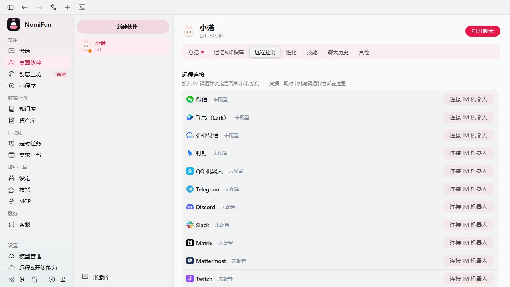
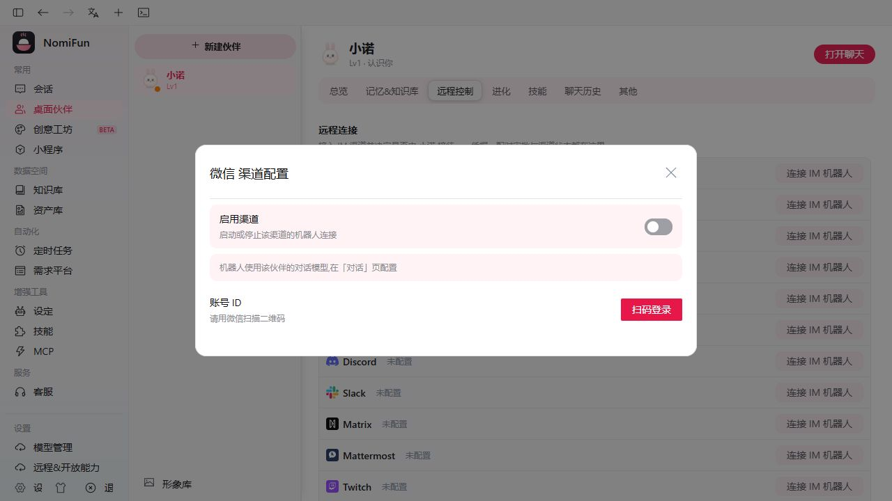

# Channels

通过 **channel**，你可以从外部聊天应用——Telegram、飞书（Lark）、钉钉、微信、企业微信（WeCom）、QQ Bot 等——操作 NomiFun 的智能体，而不必坐在桌面客户端前面。你可以把一个或多个机器人连接到伙伴或客服，然后分别决定每个机器人允许谁在私聊和群聊中使用。私聊继续使用既有配对流程；群聊则使用简单的 per-bot 访问策略。

Channel 适用于以下场景：

- 你想从手机或群聊里给智能体下达指令；
- 你希望让一个工作区感知的智能体能从团队现有 IM 中触达；
- 你希望长时任务（[AutoWork](./autowork-requirements.zh.md)）能从桌面之外被发起，而不必启动 WebUI。

> 内置适配器都是 `nomifun-channel` 的 Cargo feature：`telegram`、`lark`、`dingtalk`、`weixin`、`wecom`、`discord`、`matrix`、`mattermost`、`slack`、`twitch`、`nostr`、`qqbot`。`nomifun-app` 默认构建会全部启用；自定义构建可以省略部分适配器，被省略的平台将不可用。用户界面主称为**飞书（Lark）**，但协议与配置 key 仍是 `lark`，旧配置无需改名。



## 在哪里找

打开 Nomi 页面（`/nomi`），选择一只伙伴，然后进入 **Remote** tab（`/nomi?companion=<id>&tab=remote`）。这个 tab 会列出该伙伴可用的远程连接器，包括 Telegram、飞书（Lark）、钉钉、微信、企业微信（WeCom）、QQ Bot、Slack、Discord、Matrix、Mattermost、Twitch、Nostr 与扩展。每个已连接的机器人会显示：

- 一个状态药丸（`stopped` / `connected`）；
- 连接成功后的 bot 用户名；
- 当前已授权用户数；
- 传输凭据，以及伙伴或客服的归属绑定；
- 对能够可靠识别群聊的适配器，显示 per-bot 的**群聊访问**选择器。

企业微信和 QQ Bot 都是可运行的内置适配器，不是占位卡片。企业微信使用智能机器人的长连接协议；QQ Bot 使用官方 Gateway WebSocket 与 REST API。

## channel 是怎么工作的

```
external IM ──▶ plugin (long-poll / WebSocket)
                    │
                    ▼
             chat scope + 结构化 @ 检查
                    │
                    ▼
            ChannelManager  ◀─▶  PairingService
                    │
                    ▼
              SessionManager  ──▶  agent / conversation
```

- **Plugin** 持有平台特定连接（Telegram 长轮询；飞书、钉钉、企业微信和 QQ Bot 使用 WebSocket；微信使用 QR-code 登录）。
- **范围检查**先区分私聊与群聊；群消息还必须带平台提供的真实 `@` 结构，并在配对或创建 session 之前套用该机器人的群聊访问模式。
- **PairingService** 把首次联系变成由你在桌面 UI 中批准的请求。私聊保留既有 6 位验证码流程；群聊的部分成员模式复用同一套 Pending 与 Authorised user 记录。
- **SessionManager** 让后续消息稳定落到同一上下文，同时把每个群与私聊、负责人的桌面对话以及其他群隔离开。
- **消息循环**把入站消息接到智能体流并送回回复；平台支持时会编辑进行中的消息，微信、企业微信等适配器则回退为追加回复。

## 私聊与群聊访问

群聊访问按机器人保存到 `group_access_mode`，不是整个平台共用一个开关。例如，同一个 NomiFun 实例上的两套飞书应用可以绑定不同伙伴并分别设置。

| 设置 | Wire 值 | 群聊行为 |
| ---- | ------- | -------- |
| **对群所有成员开放** | `all_members` | 任意群成员都可以用结构化 `@机器人` 发起对话，无需先配对。这只开放当前群聊，**不会**授予该成员私聊权限。 |
| **对群部分成员开放** | `allowlist` | 只有该机器人的 Authorised users 可以使用；其他成员有效 `@` 机器人时，会创建或复用一条 Pending 请求，等待负责人批准。 |
| **禁止群聊** | `disabled` | 忽略所有群消息，包括负责人和已授权用户发出的消息；私聊不受影响。 |

新建的伙伴机器人默认使用 `allowlist`；已有的非客服机器人升级时也回填为 `allowlist`，维持最基本的安全边界。客服机器人默认使用 `all_members`，已有客服机器人升级时也回填为这个值，以免群服务突然停用；负责人之后仍可自行修改。

任何被接受的群消息都必须包含平台事件里**对当前机器人的结构化 `@`**。正文里仅仅写了类似 `@bot` 的文字、引用内容以及未提及机器人的普通群消息都不算；系统会在创建配对请求或 session 之前直接忽略。若平台没有提供可靠的聊天类型、发送者或 mention 数据，同样按拒绝处理。

群消息使用按“机器人 + 群”隔离的独立 session，不进入负责人或任一成员的私聊 Conversation，也不会让两个群共享上下文。选择“对群所有成员开放”后，群成员仍不会自动出现在私聊授权名单中；同一成员之后私聊伙伴机器人时，仍需正常配对。为稳定路由，NomiFun 会在内部记录隐藏的 `auto_group` 身份，但它不会显示在 Authorised users 中，其 Nomi runtime 被强制限制为“只用模型回复”：不能使用 cron、AutoWork、需求、记忆、跨会话、终端、浏览器、computer-use、自定义 MCP 或平台 Gateway 工具。通过 `allowlist` 明确批准的 `approved` 身份则保留既有的已授权渠道能力。

只有能可靠上报群聊类型和结构化 mention 的适配器才显示这个选择器。首批支持飞书、钉钉、企业微信、QQ Bot、Discord、Slack 与 Mattermost。Matrix 目前不能稳定区分私聊和群聊，Telegram 尚未统一解析消息实体里的结构化 `@`，因此两者暂不显示；仅支持私聊的适配器也不会显示。

## 各平台配置步骤

### Telegram

1. 找 [`@BotFather`](https://t.me/BotFather) 创建一个 bot，保存 token（形如 `123456:ABC-DEF…`）。
2. 在 **Nomi → Remote → Telegram** 粘入 token。
3. 点 **Test**——后端会调 `getMe`，成功后显示 bot 用户名。
4. 点 **Enable**。插件开始长轮询（25 s 超时，指数退避，最多 10 次重连）。

为了把 Telegram 用户与桌面端配对：用户给你的 bot 发消息；bot 用一个 6 位验证码（10 分钟 TTL）回复。在桌面端的 **Nomi → Remote → Pending pairings** 中粘入或键入该验证码并点 **Approve**。从此该 Telegram 用户即可与智能体对话。

### 飞书（Lark）

1. 在飞书开发者控制台创建一个自定义 app，开启你需要的事件（文本消息、卡片动作、bot 菜单）。
2. 复制 **App ID**、**App Secret**，以及（可选）**Encrypt key / Verification token**。
3. 把它们填入 Channels tab 中的**飞书（Lark）**表单，点 **Enable**。

飞书适配器通过 WebSocket 长连接接入（无需公网 webhook），带一个 60 秒的事件去重清理循环和分片重组。回复以**互动卡片**形式发送，因为飞书 API 只支持编辑卡片消息。内部协议 key 仍为 `lark`，已有部署配置无需更名。

### 钉钉

1. 在钉钉开发者后台创建一个内部 app，启用 **Stream Mode**。
2. 把 **Client ID** 与 **Client Secret** 填入 DingTalk 表单并启用。

钉钉插件通过标准 stream-mode 握手打开 WebSocket；配对流程与 Telegram 一致。

### 企业微信（WeCom）

1. 在企业微信中创建**智能机器人**，并选择**长连接（WebSocket）**模式。
2. 把机器人的 **Bot ID** 和 **Secret** 填入企业微信表单。
3. 测试凭据、启用机器人，并保持 NomiFun 运行以维持出站 WebSocket。

这种模式不需要回调 URL、回调域名或公网 IP。

### QQ Bot

1. 在 [QQ 开放平台](https://q.qq.com/)创建机器人，复制 **AppID** 与 **ClientSecret**。
2. 在平台控制台申请 `GROUP_AND_C2C` intent；否则 QQ 不会把群聊和 C2C 消息投递给机器人。
3. 把凭据填入 **QQ Bot** 表单，测试后启用。

适配器通过官方 Gateway WebSocket 接收事件，通过官方 REST API 发送回复。

### 微信

1. 微信用 QR-code 登录。在 WeChat 插件上点 **Enable**——`POST /api/channel/weixin/login/start` 会启动登录，后端通过现有的应用 WebSocket 向桌面端推送 QR-code 刷新事件。
2. 用微信 app 扫码确认登录，插件转为 `connected`。

微信 **不支持** 消息编辑——回复以新消息形式投递到同一聊天，而不是就地编辑。

## 配对与授权用户

对于绑定伙伴的机器人，陌生用户第一次发来**私聊消息**时，系统会创建 Pending 请求，并返回一个 TTL 为 10 分钟的 6 位验证码。负责人可以在 **Nomi → Remote → Pending pairings** 中批准或拒绝，也可以调用 `POST /api/channel/pairings/approve` 与 `POST /api/channel/pairings/reject`。

在“对群部分成员开放”（`allowlist`）的群里，陌生成员有效 `@` 机器人时，会创建或复用同一个 per-bot Pending 记录。NomiFun 不会把配对码公开发到群里；负责人直接在现有 Pending 列表中处理。批准后的身份会出现在该机器人的 **Authorised users** 中，不需要另建成员目录或维护复杂的群 ACL。

“对群所有成员开放”不会创建配对请求；系统只会创建或复用隐藏的 per-bot `auto_group` 身份，以保持群路由稳定。这个身份不会加入 Authorised users，也不能授权私聊。绑定客服的机器人继续沿用既有的客服私聊服务语义，不会因为新增群聊设置而被强制套用伙伴配对流程。

你可以随时撤销已批准用户（`POST /api/channel/users/revoke`），服务也会清理该用户的活跃 session。该用户下一次私聊伙伴机器人时需要重新配对；群聊能否使用则取决于机器人当前的 `group_access_mode`。



## 渠道 Agent 接入

渠道消息与桌面端共用同一套 Agent 和 Conversation runtime，它不是额外的 Agent 类型，也不是可切换的模式。对于绑定伙伴并使用 Nomi 的机器人，已授权私聊继续沿用既有的私有 Conversation 行为；通过检查的群消息则进入独立的群 session。`allowlist` 中由负责人明确批准的成员保留既有渠道能力；`all_members` 自动准入但未获批准的访客只获得模型回复，不加载负责人的私有伙伴上下文，也不会追加到负责人或任何成员的私聊记录中。

负责人权限绝不写入 Conversation 元数据；Agent factory 校验本机实例所有者后，只注入由进程私有根签发、带作用域和有效期的平台 Gateway 能力声明。群聊准入——即使是 `all_members`——也不等于负责人授权，绝不会把发送者提升为私聊授权用户。`auto_group` 的 Nomi runtime 被强制限制为只用模型回复；经 `allowlist` 明确批准的 `approved` 用户则保留既有的已授权渠道能力。

机器人的启停开关与 `group_access_mode` 是两件事：禁用机器人会断开整个连接，而群聊模式 `disabled` 只停止处理群消息。若机器人绑定的是客服（在「服务 → 客服」中绑定），也要先经过同一套群聊检查；通过检查的消息仍整体移交客服域处理，完全不进入伙伴 Conversation。客服使用一次性引擎会话作答，工具注册面固定为三个只读工具（知识检索 / 知识阅读 / 客服笔记检索），并且永远不会获得平台 Gateway 能力声明。客服私聊继续沿用既有的自动服务语义。

当负责人已授权的 Nomi 渠道上下文获得网关工具时，这些统一前缀为 `nomi_*` 的工具（目前共 32 个）能替你做以下事情：

- **会话**——列出所有会话及其运行态，查看单个会话（状态 + 最近消息，
  含进行中的流式回复），向任意会话注入消息或任务 prompt，新建会话，
  修改与删除旧会话（`nomi_list_conversations`、`nomi_conversation_status`、
  `nomi_send_to_conversation`、`nomi_create_conversation`、
  `nomi_update_conversation`、`nomi_delete_conversation`）。
- **定时任务**——列出 / 创建 / 修改 / 删除 cron 任务
  （`nomi_cron_list`、`nomi_cron_create`、`nomi_cron_update`、
  `nomi_cron_delete`）。
- **长期记忆**——读写伙伴的全局记忆库（`nomi_memory_list`、
  `nomi_memory_save`、`nomi_memory_update`、`nomi_memory_delete`）。
- **需求平台**——浏览与管理需求平台（`nomi_requirement_list`、
  `nomi_requirement_create`、`nomi_requirement_update`、
  `nomi_requirement_delete`）。
- **终端与监督**——列出终端会话、创建新终端（可经 `knowledge_base_ids`
  顺带绑定知识库），以及读取 / 切换某个终端的 AutoWork 绑定与 IDMM
  监督（`nomi_list_terminals`、`nomi_create_terminal`、
  `nomi_get_autowork`、`nomi_set_autowork`、`nomi_get_idmm`、
  `nomi_set_idmm`）。
- **知识库**——浏览知识库与绑定关系，改绑会话 / 终端 / 伙伴，新建
  知识库，向库内写 markdown 文件，触发 AI 梗概生成，或把一个 URL
  抓取为 markdown——伙伴可以自主沉淀知识
  （`nomi_knowledge_list_bases`、`nomi_knowledge_get_binding`、
  `nomi_knowledge_set_binding`、`nomi_knowledge_create_base`、
  `nomi_knowledge_write_file`、`nomi_knowledge_autogen`、
  `nomi_knowledge_fetch_url`）。`nomi_knowledge_create_base` 带
  `urls` 时抓取为后台异步——工具立即返回，等待期间勿重复建库；
  库描述（description）出现即代表抓取与梗概流水线已完成。
- **Provider**——列出已配置的 LLM provider（`nomi_list_providers`）。

于是"把我的日报 cron 改到早上 9 点，再说说现在桌面上有什么在跑"
只需要一条飞书消息。

**选择由哪只伙伴接待。** 有了[多伙伴](./companions.zh.md)之后，机器人按
**渠道行**绑定伙伴：`channel_plugins` 每行代表一个机器人（同一平台
可以接入多个机器人，比如飞书上为每只伙伴各开一个企业自建应用），行上
的 `companion_id` 决定由哪只伙伴接待，`UNIQUE(type, bot_key)` 唯一约束从结构
上保证**同一个机器人永远不会被绑到第二只伙伴**（bot 身份：飞书
`app_id`、Telegram bot id、钉钉 `client_id`……）。绑定 / 解绑走
`POST /api/channel/settings/companion`（带 `plugin_id`），一步完成持久化与
**该渠道** session 的重置——下一条进来的消息由新宠的人格、模型与知识
库挂载接待（会话带 `extra.companionId`）。在伙伴面板的 **远程连接** tab 里
为某只伙伴连接机器人，就是「新建渠道行 + 绑定该宠」一步完成。未绑定
伙伴的渠道行回退到平台级偏好 `channels.<platform>.companionId`。系统不会
隐式回退默认伙伴：若两级绑定都未解析到存活伙伴，该渠道保持未绑定，
也不注入伙伴人格。绑定变更会重置受影响的 session，确保下一轮从新归属
干净启动。

**Agent 与模型解析。** 渠道连接表单只配置传输凭据和归属绑定，不再引入
另一套 Agent 或模型选择器。绑定桌面伙伴的 Nomi 机器人以伙伴 profile
中的模型为权威值，仅在该模型缺失时回退部署配置
`channels.<platform>.defaultModel`。绑定客服的机器人使用该客服在
「服务 → 客服」中配置的模型。未绑定渠道默认使用 Nomi；若部署显式配置了
`channels.<platform>.agent`，也可选择其他引擎，ACP 则继续读取其部署级
backend/model 配置。平台级配置发生变化后，调用
`POST /api/channel/settings/sync` 会清理该平台 session，使下一轮按新配置解析。

## 从 IM 端能做什么

平台无关抽象（`UnifiedIncomingMessage`、`UnifiedOutgoingMessage`、`UnifiedAction`）覆盖：

- **纯文本**——双向。
- **流式编辑回复**——智能体的增量更新会被编辑进正在飞行的 bot 消息（微信除外）。
- **动作按钮**——确认 prompt、重试动作等等，渲染为 inline keyboard（Telegram）、互动卡片按钮（飞书）或对应平台的等价物。
- **安全的群聊访问**——支持群聊的适配器始终先要求对当前机器人的结构化 `@`，再应用 `all_members`、`allowlist` 或 `disabled`；这个 mention 要求不是可关闭的开关。
- **群会话隔离**——通过检查的群消息只延续该“机器人 + 群”的 session，不共享私聊或其他群的记录。

从 IM 端目前还做不到：

- 超出平台插件原生能力的文件上传；
- per-user 工作区选择——智能体的工作区就是它路由到的会话上设的那个。

## 路由与 API

| 用途                            | 位置                                                       |
| ------------------------------- | ---------------------------------------------------------- |
| Channels UI                     | `/nomi?companion=<id>&tab=remote`                          |
| 列出插件 / 状态                 | `GET /api/channel/plugins`                                 |
| 启用 / 禁用                     | `POST /api/channel/plugins/enable`、`…/disable`            |
| 测试凭证                        | `POST /api/channel/plugins/test`                           |
| 群聊访问                        | `POST /api/channel/settings/group-access`                  |
| 待处理配对                      | `GET /api/channel/pairings`                                |
| 批准 / 拒绝配对                 | `POST /api/channel/pairings/approve`、`…/reject`           |
| 已授权用户                      | `GET /api/channel/users`、`POST .../users/revoke`          |
| 活跃 session                    | `GET /api/channel/sessions`                                |
| 同步（变更时清掉 session）      | `POST /api/channel/settings/sync`                          |
| 绑定渠道伙伴                    | `POST /api/channel/settings/companion`                     |
| 微信 QR 登录启动                | `POST /api/channel/weixin/login/start`                     |

## 注记

- 插件生命周期是一个状态机——`Created → Initializing → Ready → Starting → Running → Stopping → Stopped`，每一步都可能转到 `Error`。UI 上的状态药丸就是这个枚举。
- 撤销用户时，session 会先于该 user row 被拆掉。该用户下一次私聊伙伴机器人时会重新触发配对；群消息则按当前群聊模式处理。
- 修改群聊访问模式时，模式更新与群聊 / 未知范围 session、待处理队列的清理在同一事务内完成，私聊 session 保留。接口返回后新消息只按新模式准入；已经完成持久化准入的单次回复可以正常收尾。
- 私聊配对码为 6 位，由 `getrandom` 生成，TTL 10 分钟。配对服务会周期清理已过期的 Pending 记录。
- 各适配器都受 feature gate 控制。自定义 `--no-default-features` 构建需要显式启用准备暴露的每个连接器。

## 相关

- [渠道群聊访问策略](../specs/2026-08-13-channel-group-access.zh.md)——per-bot 策略、身份能力上限、迁移与适配器能力矩阵的规范说明。
- [伙伴（Companions）](./companions.zh.md)——多伙伴管理、按伙伴独立的记忆，以及搭载在渠道会话上的每宠知识库绑定。
- [AutoWork & Requirements](./autowork-requirements.zh.md)——从聊天里登记一条需求，再用 webhook 卡片把通知打回飞书。
- [Web Server Deployment](./web-server-deployment.zh.md)——当你在服务器上自托管后端时同样能暴露这些 channel。
