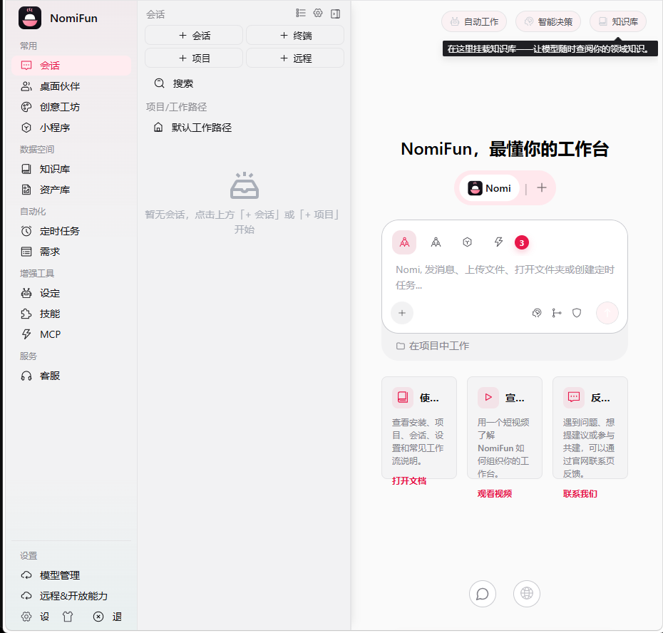

# Running NomiFun as a Desktop App

The desktop app (`nomifun-desktop`) is a [Tauri](https://tauri.app/) shell that links the Rust backend (`nomifun-app`) **into the same process**. There is no spawned backend binary, no Electron, no bundled `nomicore`. The shell starts the backend as an async task on a free `127.0.0.1` port, then loads the bundled SPA (`ui/dist`) into a WebView and points it at `http://127.0.0.1:<port>/api`.

The desktop WebView does not show a login screen. Instead, the embedded backend
runs under `AuthPolicy::TrustLocalToken`: the shell injects a per-boot local
trust secret into its own WebView, and only requests carrying that secret are
treated as the desktop user. If you want login + remote browser/phone access,
see [WebUI Remote Access](./webui-remote-access.md) for the in-app feature, or
[Self-Host the Web Server](./web-server-deployment.md) for the standalone
server.



## Quick start

### Prerequisites

The desktop app requires:

- A platform Tauri supports (Windows 10+, macOS 11+, mainstream Linux distros).
- A WebView runtime: **WebView2** on Windows (preinstalled on Win 11; on Win 10 install the [Evergreen Bootstrapper](https://developer.microsoft.com/microsoft-edge/webview2/)), **WKWebView** on macOS (built-in), **WebKitGTK** on Linux (`libwebkit2gtk-4.1-0` is enough to *run* a packaged build; building from source needs the `-dev` package below).
- For development: Rust toolchain, [Bun](https://bun.sh) ≥ 1.3.13, Git, CMake, and the platform Tauri build deps (see the [Tauri prerequisites](https://v2.tauri.app/start/prerequisites/)). That upstream list is complete for Windows and macOS; on Linux this repo needs three libraries beyond it, because the computer-use screen capture stack (`xcap`, reached through `nomi-computer`) links PipeWire and GBM and runs `bindgen`.

#### Linux system packages (Debian/Ubuntu)

Verified on Ubuntu 26.04. This set is enough for `bun run dev` to compile and launch:

```bash
sudo apt install build-essential cmake pkg-config git \
  libwebkit2gtk-4.1-dev libayatana-appindicator3-dev \
  libpipewire-0.3-dev libgbm-dev libclang-dev
```

`bun run build` / `bun run build:linux` also produce an AppImage, which needs two more:

```bash
sudo apt install librsvg2-dev xdg-utils
```

Why the less obvious entries are there:

| Package | Required by |
| --- | --- |
| `libwebkit2gtk-4.1-dev` | `webkit2gtk-sys`, `soup3-sys`, `javascriptcore-rs-sys` and `gtk-sys` under `tauri` → `wry`. Its dependency closure is also the only source of the `egl.pc`, `dbus-1.pc`, `wayland-client.pc`, X11/XCB and xkbcommon development files that other crates probe, so installing the runtime-only `libwebkit2gtk-4.1-0` instead breaks several unrelated crates at once. |
| `cmake` | `opusic-sys` compiles a vendored libopus for the robot gateway ([`crates/backend/nomifun-robot/Cargo.toml`](../../crates/backend/nomifun-robot/Cargo.toml)). It is a plain dependency, not an optional one, so a missing CMake stops the build with ``is `cmake` not installed?``. |
| `libpipewire-0.3-dev` | `libspa-sys` and `pipewire-sys` probe `libpipewire-0.3.pc` and `libspa-0.2.pc` and panic when either is absent. The second file ships in `libspa-0.2-dev`, which this package depends on, so one install covers both. Wayland screen capture for computer use. |
| `libgbm-dev` | `gbm-sys` links `-lgbm` through a source-level `#[link]` attribute, so nothing checks it until the final link step. Only the `-dev` package ships the unversioned `libgbm.so`. Same screen-capture chain. |
| `libclang-dev` | `bindgen`, a build dependency of `libspa-sys` and `pipewire-sys`, loads `libclang.so` while generating bindings. The `clang` package alone does not ship that file. |
| `libayatana-appindicator3-dev` | The tray icon. `libappindicator-sys` opens `libayatana-appindicator3.so.1` at **runtime**, and that library is not part of a default Ubuntu desktop; the `-dev` package pulls it in and also satisfies the pkg-config preflight in [`scripts/desktop-build-linux.sh`](../../scripts/desktop-build-linux.sh). |
| `librsvg2-dev`, `xdg-utils` | Packaging only: the linuxdeploy GTK plugin reads `librsvg-2.0.pc`, and the AppImage target shells out to `xdg-open` / `xdg-mime`. No Rust crate in this tree needs either. |

Three more notes specific to this dependency tree:

- Tauri's generic list also names `libssl-dev`, `libxdo-dev` and `libasound2-dev`, and a missing `-lgbm` is often blamed on `libdrm-dev`. None of the four are used here: there is no `openssl-sys` (TLS is rustls with vendored crypto), no `libxdo` (input simulation goes through pure-Rust `x11rb`), no ALSA consumer (Opus is vendored and `symphonia` is pure Rust), and `drm-sys` uses pregenerated bindings and emits no `-ldrm`. They are harmless if you already have them.
- The first build needs network access: `ort-sys` downloads a prebuilt ONNX Runtime (see [First build needs network access to pyke](../contributing/development.md#first-build-needs-network-access-to-pyke)), and `bun run build` fetches linuxdeploy and its plugins from GitHub.
- `lsof` is optional. `bun run dev` uses it to free port 5173 ([`scripts/free-ports.mjs`](../../scripts/free-ports.mjs)) and silently skips that cleanup when it is missing.

### Run from source (development)

From the repo root:

```bash
bun install
bun run dev
```

This runs `tauri dev --config apps/desktop/tauri.conf.json`. It starts the Vite dev server (`http://localhost:5173`) for the SPA, builds and launches `nomifun-desktop`, and the embedded backend is started on a fresh free localhost port at every boot.

### Build a release bundle

```bash
bun run build
```

Output bundles land under `target/release/bundle/` per platform (an NSIS installer (`.exe`) on Windows, `.app` + `.dmg` on macOS, `.deb` + `.AppImage` on Linux). To produce signed updater artifacts (extra `.sig` files), use `bun run build:updater` after configuring signing keys (see [Updater status](#updater-status) below).

A successful build prints the bundle locations, for example on macOS:

```text
$ bun run build
   Compiling nomifun-app v0.1.0
    Finished `release` profile [optimized] target(s)
    Bundling NomiFun.app (macos)
    Bundling NomiFun_0.1.0_aarch64.dmg (macos)
    Finished 2 bundles at:
      target/release/bundle/macos/NomiFun.app
      target/release/bundle/dmg/NomiFun_0.1.0_aarch64.dmg
```

## Window and titlebar

The main window is **frameless** on Windows and Linux: the React titlebar component draws min/maximize/close on the same row as the in-app navigation. On macOS the native traffic-light buttons are kept via Tauri's `Overlay` title-bar style, with content extending under the bar.

- Default size: `1280 × 832`, minimum `880 × 600`.
- Resizable everywhere (edge-resize and Snap still work on Windows even without OS-drawn decorations).
- Title bar: `NomiFun`.

> The exact chrome differs per OS: a frameless titlebar with in-app controls on
> Windows and Linux, and the native traffic-light buttons (content under an
> `Overlay` bar) on macOS.

## Single instance

`tauri-plugin-single-instance` enforces a single running copy of the app on Windows and Linux. Trying to launch a second `nomifun-desktop` will silently focus the existing window instead of starting another backend on a different port.

## Deep links

The app registers the `nomifun://` URL scheme (configured in `apps/desktop/tauri.conf.json` under `plugins.deep-link.desktop.schemes`). When the OS launches Nomi via a `nomifun://...` URL, the shell forwards the URLs to the renderer over the Tauri event `deep-link://received`. The renderer can subscribe with `listen('deep-link://received', ...)` from `@tauri-apps/api/event` to handle the payload.

`register_all()` is called at startup to install the scheme; on platforms that need an out-of-band registration step (some Linux desktops, dev contexts) the call is best-effort and a failure is ignored.

## Autostart

The shell ships `tauri-plugin-autostart` so the renderer can opt the app into "launch at login" via the plugin's invoke API. On macOS this uses a `LaunchAgent`; on Windows the registry's `Run` key; on Linux a `.desktop` file in the autostart folder. The user-facing toggle lives in app settings.

## Notifications

`tauri-plugin-notification` is enabled. The renderer can show OS-level notifications (e.g. when an agent finishes a long task or AutoWork has results). On macOS the user is asked for permission the first time; on Windows, notifications use the modern Action Center; on Linux they go through `libnotify`.

## Where data is stored

The installed desktop app persists the SQLite database, agent state, logs, and the Bun runtime cache under the stable per-user application-data directory — **`%LOCALAPPDATA%\NomiFun`** on Windows, **`~/Library/Application Support/NomiFun`** on macOS, **`$XDG_DATA_HOME/NomiFun`** on Linux (resolved by `nomifun_app::cli::default_data_dir()`). Hosts on the same build channel share a default; development scripts use the isolated `NomiFun-dev` sibling instead. Use `bun run seed:dev` when dev needs a copy of stable state.

Set `NOMIFUN_DATA_DIR=<absolute path>` before launching the app and that path **is** the data dir — the value is taken literally on every host, with no `/Nomi` suffix. The backend takes an exclusive `server.lock` on the data dir at startup; if it fails to start — for example because another instance already holds the directory — the desktop shell shows a native error dialog and exits.

> Older builds stored data under `NomiFun/Nomi` (dev: `NomiFun/Nomi-dev`; before that, `<system temp>/nomifun-data/Nomi`). On the first boot after upgrading, a one-shot automatic migration moves such a legacy dataset into the new root. The migration is crash-safe and resumes on the next boot if interrupted; if the old app instance is still running it is deferred to the next launch. Absolute paths stored in the database (knowledge-base roots, terminal cwds, custom workspaces) are rewritten once after the move.

To start fresh, **quit the app** and delete that directory. To migrate, copy the directory to a new machine.

```text
~/Library/Application Support/NomiFun/    # macOS (see paths above for Windows/Linux)
├── nomifun-backend.db        # SQLite state (conversations, settings, sessions, …)
├── logs/                     # nomicore.log
├── companion/                # companions + their memory database (one file, per-companion rows)
├── knowledge/                # managed knowledge bases
├── runtime/                  # extracted Bun runtime cache (regenerable)
└── server.lock               # exclusive lock held while a backend is running
```

## Authentication and local trust

The desktop shell does not expose the old blanket no-auth backend to every
localhost caller. It starts the embedded backend with `TrustLocalToken`, injects
`window.__nomiLocalTrust` into the WebView, and the renderer presents that secret
on HTTP and WebSocket calls. A process that only knows
`127.0.0.1:<port>/api` is not automatically trusted.

The desktop app is still a single-user tool: the OS account that starts it owns
everything the agent can do, including shell and file access.

If you want to access the same install from another device, do **not** expose the embedded port. Use one of:

- **WebUI remote access** (a per-instance feature, see [WebUI Remote Access](./webui-remote-access.md)) — turns on a separate authenticated server and gives you a QR-code login.
- **Self-hosted web server** ([Web Server Deployment](./web-server-deployment.md)) — runs the same backend headlessly under `nomifun-web` with auth required.

## Updater status

The Tauri updater plugin (`tauri-plugin-updater`) is wired in: the renderer checks for updates through the plugin's `check()` API and installs the selected version through the Rust-owned `install_update` command. However:

- The endpoint configured in `apps/desktop/tauri.conf.json` (`plugins.updater.endpoints`) is a **placeholder** (`https://REPLACE-WITH-YOUR-HOST/...`). Until you replace it with a real HTTPS URL serving a signed `latest.json`, the updater check will fail.
- The included `pubkey` is a **development key** generated for local testing. **Replace it before any public release** and store your private key in a CI secret.
- `bun run build:updater` produces signed update artifacts (extra `.sig` files next to each installer).

The full updater flow (signing env vars, `latest.json` schema, supported platform
keys) is documented in `apps/desktop/updater/README.md`. OS-level code signing /
notarization is separate. macOS Developer ID signing and notarization are wired
through `bun run build:signed` and documented in
`apps/desktop/signing/README.md`; Windows signing still requires an external
code-signing certificate.

## Troubleshooting

**The window opens to a blank white area.**
Make sure the WebView runtime is installed (WebView2 on Windows 10 needs the Evergreen Bootstrapper). On Linux, `libwebkit2gtk-4.1-0` is required.

**The Linux build compiles ~1300 crates and then fails with `rust-lld: error: unable to find library -lgbm`.**
`gbm-sys` requests `-lgbm` from a source-level `#[link]` attribute, so nothing detects the missing library until the final link step. Install `libgbm-dev` — the runtime `libgbm1` package does not ship the unversioned `libgbm.so` — and re-run; only the link is redone, not the crates. See [Linux system packages](#linux-system-packages-debianubuntu).

**The Linux build stops early with `Cannot find libraries: PkgConfig ... libpipewire-0.3` (or `libspa-0.2`).**
`libspa-sys` and `pipewire-sys` probe pkg-config in their build scripts and panic when the `.pc` files are absent. Install `libpipewire-0.3-dev`; it depends on `libspa-0.2-dev`, which owns `libspa-0.2.pc`. Both crates come from the computer-use screen capture stack, so they build even when you never use screen capture.

**"Failed to bind backend port".**
Another process is holding `127.0.0.1` ephemeral ports. The backend tries `pick_free_port()` and falls back to `8799` if that fails — quit any other NomiFun instance and try again.

**Agent commands fail with `bun: command not found`.**
The agent engine spawns Bun as a child process for tool execution. Install Bun (`curl -fsSL https://bun.sh/install | bash`) and make sure it is on the system `PATH`, or build the desktop bundle with `NOMIFUN_EMBED_BUN=1` to embed it.

## See also

- [Web Server Deployment](./web-server-deployment.md) — run the same backend headlessly under `nomifun-web`.
- [WebUI Remote Access](./webui-remote-access.md) — expose your desktop instance for remote browser/phone use.
