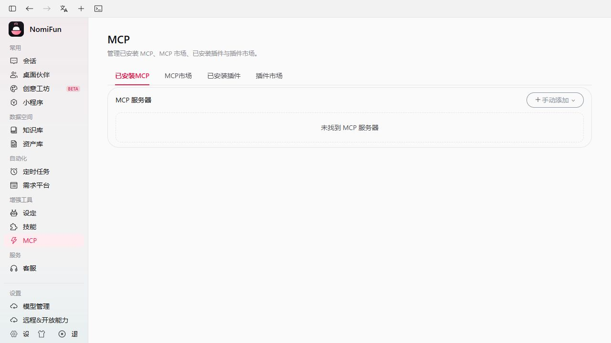
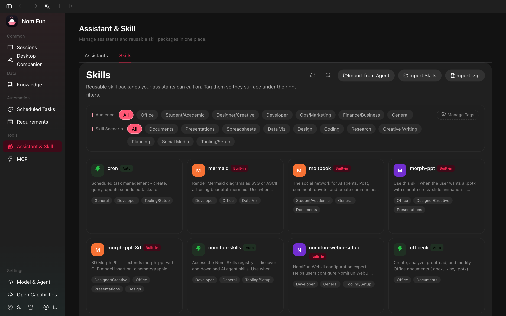

# MCP & Skills

NomiFun has two extension mechanisms that are easy to confuse:

- **MCP servers** are external tool servers. They expose callable tools over
  stdio, HTTP, or SSE.
- **Skills** are markdown/folder knowledge bundles. They tell an agent how to do
  a workflow; they are not long-running tool servers.

Current pages:

| Capability | Page |
| --- | --- |
| MCP servers | `/mcp` |
| Skills | `/skills` |
| Agent workbench | `/agent` |
| Public/remote capability exposure | `/open-capabilities` |

Legacy settings URLs redirect to these pages.

## MCP Servers

Open `/mcp` to add, import, test, enable, disable, and sync MCP servers.

Each server row owns:

- name;
- transport: `stdio`, `http`, or `sse`;
- command / args / env for stdio, or URL for HTTP/SSE;
- raw imported JSON, when imported from another agent config;
- enabled state;
- last connection-test result.

Connection test uses a temporary MCP client, performs the handshake, lists tools,
and persists the result. Failure codes include command-not-found, permission,
timeout, HTTP, RPC, and protocol errors.

OAuth-backed HTTP/SSE servers use the `/api/mcp/oauth/*` flow.

The canonical owner currently supports Streamable HTTP/stdio at `2025-03-26`
and explicit legacy SSE at `2024-11-05`. It does not silently convert between
transports and does not yet claim the `2026-07-28` `server/discover` lifecycle
without `initialize`; a server that only supports that lifecycle returns a
typed protocol error. That is a separate owner and security-model migration,
not part of market configuration import.

### MCP market boundary

The MCP market is a **configuration catalog**, not a package manager. When an
entry is added, NomiFun ranks the configuration examples in its market
documentation (preferring portable `npx`/`uvx` launchers and HTTPS over Docker,
global commands, or placeholder endpoints), normalizes common forms such as
`streamableHttp` and `baseUrl`, and imports the result disabled. It does not
install Node.js, Docker, Python/uv, browser drivers, complete third-party login,
or create API keys.

The confirmation screen shows the actual command, arguments, URL, env/header
keys, and fields that still need values. A server containing `${...}`, `<...>`,
`xxxxx`, `YOUR_*`, or similar placeholders cannot be tested until those fields
are completed, preventing template URLs from being contacted or unconfigured
processes from being launched. Failed entries previously imported from the
market expose a **Repair config** action; replacements are reviewed again and
remain disabled.

A connection test only proves that the configuration completed the MCP
handshake and `tools/list` at that moment; it is not a live presence signal.
Failures distinguish missing runtimes, HTTP status, timeout, RPC, and protocol
errors. URL-based servers enter the OAuth flow only after an explicit OAuth
Bearer challenge, so API-key/header configurations are not treated as OAuth.

Portable package runners (`npx`, `bunx`, `uvx`, and equivalent launcher
forms) get a separate 120-second first-run bootstrap budget during a manual
test; ordinary MCP handshakes keep the 30-second budget. Stdio children receive
only proxy-related variables from the parent or detected system proxy through
the shared proxy policy (including its stale loopback-proxy guard), while API
tokens and unrelated parent environment remain isolated. Raw child stderr is
never returned or logged: it is drained and
reduced to non-secret categories such as package-not-found, download/network,
missing dependency, missing configuration, permission, or early process exit.

An HTTP URL on `localhost` is only a client connection descriptor. NomiFun does
not start the referenced application or Docker container. A failed local probe
therefore reports the host and port and asks the user to start that prerequisite
service; it no longer presents every runtime or service failure as malformed
MCP JSON.

## Importing and Syncing Agent Configs

`GET /api/mcp/agent-configs` detects MCP config files from supported local agent
CLIs. The UI lets you import detected servers into NomiFun and push the NomiFun
list back to selected agent configs when an adapter supports writing.

This sync is config management only. A conversation still decides which MCP
servers are visible for that session.

## Global capabilities and Session selection

Every Agent preset can use the same installed Skill Library and global MCP catalog. The Workbench has
no Skill, MCP, or tool-search master switch. The two icons beside the composer select what this Session
uses, without editing the Agent preset or global installation state.

New Sessions select auto-injected Skills and enabled MCP servers with successful discovery and a
nonempty tool catalog by default. Users can deselect defaults and choose other installed Skills or ready
servers. Global Skill bodies and supporting text/images are captured as immutable reference data.
Selected instructions accompany accepted input; long bodies and supporting resources use the native
context reader. Skill scripts, hooks, and tool declarations grant no additional permissions.

Creation accepts top-level `session_capabilities` with `skill_names` and `mcp_server_ids`. Omission uses
global defaults; explicit empty arrays select none. Existing Sessions use
`GET` / `PUT /api/agent-sessions/{id}/capability-selection` with `expected_binding_version`.
Sending waits for selection admission; failures preserve input and selection for an explicit retry.

Selections compile into the existing immutable Revision/Snapshot and apply through canonical binding
transitions. Running or paused Turns, unsettled effects, Remote bindings, and read-only Attempts cannot
change selection. Agent switches retain selection; workspace and other resources remain intact.
Accepted input and native checkpoints are not rewritten. An unchanged connection test or metadata
update keeps the same MCP connection identity; actual configuration, credential, or schema changes
require reapplying selection.

## MCP API

| Operation | Endpoint |
| --- | --- |
| List / create | `GET`, `POST /api/mcp/servers` |
| Import batch | `POST /api/mcp/servers/import` |
| Get / update / delete | `GET`, `PUT`, `DELETE /api/mcp/servers/{id}` |
| Toggle | `POST /api/mcp/servers/{id}/toggle` |
| Test connection | `POST /api/mcp/test-connection` |
| Detect agent configs | `GET /api/mcp/agent-configs` |
| OAuth | `POST /api/mcp/oauth/check-status`, `/login`, `/logout`; `GET /api/mcp/oauth/authenticated` |

## Skills

Open `/skills`.

A skill is either a single markdown file or a directory containing `SKILL.md`.
Sources:

| Source | Meaning |
| --- | --- |
| Builtin | Shipped with the app. Some are auto-injected. |
| Custom | Imported by the user or placed in a configured skill directory. |

Skills can be tagged, imported, exported/symlinked, and scanned from external paths.
Custom and bundled Skills use the same Session capture and native context reader.

## Skill API

| Operation | Endpoint |
| --- | --- |
| List | `GET /api/skills` |
| Builtin auto-injected list | `GET /api/skills/builtin-auto` |
| Tags | `PUT /api/skills/{name}/tags` |
| Info / paths | `POST /api/skills/info`, `GET /api/skills/paths` |
| Import / export / delete | `POST /api/skills/import`, `POST /api/skills/import-symlink`, `POST /api/skills/export-symlink`, `DELETE /api/skills/{name}` |
| Scan / detect paths | `POST /api/skills/scan`, `GET /api/skills/detect-paths`, `GET /api/skills/detect-external` |
| External paths | `GET`, `POST`, `DELETE /api/skills/external-paths` |
| Skills market | `POST /api/skills/market/enable`, `POST /api/skills/market/disable` |

## Related

- [Agent Workbench](./presets.md)
- [Remote Capability API](./remote-capability-api.md)
- [Terminal](./terminal.md)
