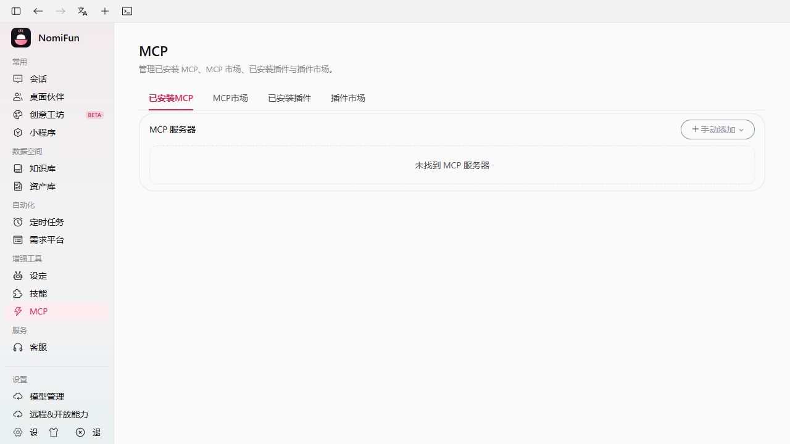
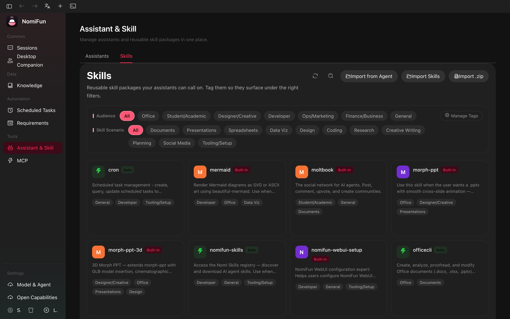

# MCP、技能与 Agent 工作台

> MCP 与 Skill 是平台能力供给/说明层；Agent 工作台（`/agent`）是唯一的 Agent
> authoring 入口。本文不再把 MCP、Skill 或旧 Preset 当作同一个产品配置对象。

NomiFun 有两种容易混淆的扩展机制：

- **MCP server** 是外部工具服务器，通过 stdio、HTTP 或 SSE 暴露可调用工具。
- **技能** 是 markdown/文件夹知识包，告诉 agent 如何完成某个工作流；它不是常驻工具服务器。

当前页面：

| 能力 | 页面 |
| --- | --- |
| MCP server 管理 | `/mcp` |
| 技能管理 | `/skills` |
| Agent 能力设计与试用 | `/agent` |
| 对外能力暴露 | `/open-capabilities` |

旧 Settings URL 会重定向到这些页面。

## MCP Server

打开 `/mcp` 可以新增、导入、测试、启用/禁用和同步 MCP server。

每条 server 记录包含：

- 名称；
- transport：`stdio`、`http` 或 `sse`；
- stdio 的 command / args / env，或 HTTP/SSE 的 URL；
- 从其他 agent 配置导入时保留的 raw JSON；
- enabled 状态；
- 最近一次连接测试结果。

连接测试会启动临时 MCP client，完成握手、列出工具并持久化结果。失败码覆盖命令
不存在、权限、超时、HTTP、RPC 和协议错误。

需要 OAuth 的 HTTP/SSE server 走 `/api/mcp/oauth/*` 流程。

当前 canonical owner 的协议边界是 Streamable HTTP/stdio `2025-03-26` 与显式 legacy SSE
`2024-11-05`。它不会把新旧 transport 静默互转，也尚未宣称支持 `2026-07-28` 的
`server/discover` / 无 initialize 生命周期；只支持该新生命周期的服务会返回明确的协议错误。
这是一次独立的 owner/安全模型迁移，不属于市场配置导入。

### MCP 市场的边界

MCP 市场是**配置目录**，不是包管理器。点击添加时，NomiFun 会从市场说明中选择更可移植的
MCP 配置候选（优先 `npx`/`uvx` 与 HTTPS，避开 Docker、全局命令和占位 endpoint），把
`streamableHttp`、`baseUrl` 等常见写法规范化，并以停用状态导入。它不会替用户安装 Node.js、
Docker、Python/uv、浏览器驱动，也不会完成第三方登录或生成 API Key。

导入确认页会显示实际命令、参数、URL、env/header 键和仍需填写的字段。含 `${...}`、
`<...>`、`xxxxx`、`YOUR_*` 等占位内容的 server 在补全前不能执行连接测试，因此不会误把
模板 URL 发到网络或误启动未配置的进程。已从市场导入但检测失败的条目可在市场中选择
“修复配置”；替换内容仍须再次确认，并会保持停用。

连接测试只代表该配置在检测时完成了 MCP 握手和 `tools/list`，不是常驻在线状态。失败时
UI 会区分缺少本地运行时、HTTP 状态、超时、RPC 与协议错误；URL 型服务只有在服务端明确
返回 OAuth Bearer challenge 时才进入 OAuth 登录流程，API Key/Header 配置不会被误判为 OAuth。

`npx`、`bunx`、`uvx` 等便携包运行器在手动检测时使用独立的 120 秒首次引导预算，普通 MCP
握手仍保持 30 秒预算。stdio 子进程通过统一代理策略只接入父进程代理变量或系统代理（并保留
失效本地代理探测），同时继续隔离父进程的 API Token 和无关环境变量。子进程原始 stderr
不会进入 API 或日志；后台
只保留无敏感信息的失败分类，例如包不存在、下载/网络失败、依赖缺失、配置缺失、权限问题或进程
提前退出。

指向 `localhost` 的 HTTP URL 只是客户端连接描述，NomiFun 不会代替第三方项目启动本地程序或
Docker 容器。本地探测失败时会明确显示 host/port 并提示先启动前置服务，不再把运行时、前置服务
或网络问题一律描述成“MCP JSON 配置错误”。

## 导入和同步外部 Agent 配置

`GET /api/mcp/agent-configs` 会探测已支持本地 agent CLI 的 MCP 配置。UI 可把探测到
的 server 导入 NomiFun，也可在 adapter 支持写入时把 NomiFun 的 MCP 列表同步回选中的
agent 配置。

这只是配置管理。某次会话最终能看到哪些 MCP server，仍由该会话的选择决定。

## 每会话选择

全局启用 MCP server 只是让它可用，不会自动注入每个 agent。会话启动时最终 MCP 列表来自：

- 全局 enabled server；
- 该会话选择的 server；
- 当前能力集需要的 builtin bridge server。

最终列表会进入 Agent 工作台生成的 Revision/Snapshot 主链，或进入明确的非 Agent
consumer resolver；MCP 管理页不会直接改写既有 Session 的 Snapshot。

## MCP API

| 操作 | Endpoint |
| --- | --- |
| 列表 / 创建 | `GET`, `POST /api/mcp/servers` |
| 批量导入 | `POST /api/mcp/servers/import` |
| 获取 / 更新 / 删除 | `GET`, `PUT`, `DELETE /api/mcp/servers/{id}` |
| 启用切换 | `POST /api/mcp/servers/{id}/toggle` |
| 连接测试 | `POST /api/mcp/test-connection` |
| 探测 agent 配置 | `GET /api/mcp/agent-configs` |
| OAuth | `POST /api/mcp/oauth/check-status`, `/login`, `/logout`; `GET /api/mcp/oauth/authenticated` |

## 技能

打开 `/skills`。

技能可以是单个 markdown 文件，也可以是包含 `SKILL.md` 的目录。

| 来源 | 含义 |
| --- | --- |
| Builtin | 随应用发布；部分会自动注入。 |
| Custom | 用户导入或放入配置目录。 |
| Extension | 已安装扩展提供。 |

技能可打标签、导入、导出/符号链接、扫描外部目录，也可按某个 agent 后端进行
materialize。

## 技能 API

| 操作 | Endpoint |
| --- | --- |
| 列表 | `GET /api/skills` |
| 自动注入 builtin 列表 | `GET /api/skills/builtin-auto` |
| 标签 | `PUT /api/skills/{name}/tags` |
| 信息 / 路径 | `POST /api/skills/info`, `GET /api/skills/paths` |
| 导入 / 导出 / 删除 | `POST /api/skills/import`, `POST /api/skills/import-symlink`, `POST /api/skills/export-symlink`, `DELETE /api/skills/{name}` |
| 扫描 / 探测路径 | `POST /api/skills/scan`, `GET /api/skills/detect-paths`, `GET /api/skills/detect-external` |
| 为 agent materialize | `POST /api/skills/materialize-for-agent` |
| 外部路径 | `GET`, `POST`, `DELETE /api/skills/external-paths` |
| 技能市场 | `POST /api/skills/market/enable`, `POST /api/skills/market/disable` |

## 相关

- [Agent 工作台](./presets.zh.md)
- [远程能力 API](./remote-capability-api.zh.md)
- [终端](./terminal.zh.md)
