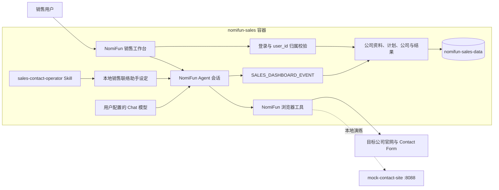
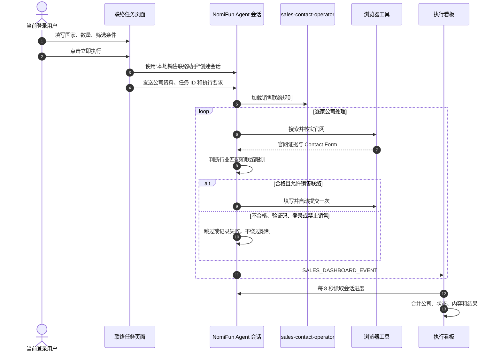
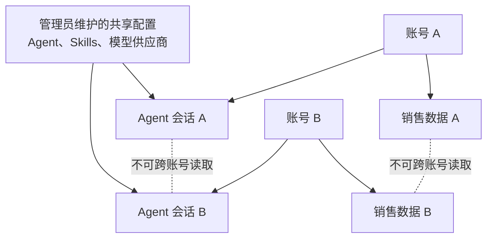

# NomiFun 本地销售工作台：当前架构与执行逻辑

> 当前实现直接使用 NomiFun 自己的 Agent、模型、Skills、浏览器工具和会话系统，不接入外部 Agent Worker。

## 系统架构

## 立即执行逻辑

## 多账号隔离

- 公司资料、任务、公司列表、结果和 Agent 会话按登录账号隔离。
- 普通账号不能读取其他账号的数据，也不能进入账号管理和系统配置。
- Agent、Skills 与模型供应商属于当前 NomiFun 实例的共享配置，由管理员维护。
- 如果未来不同客户公司需要完全不同的 Agent 和知识库，应增加“客户组织”层，并为组织绑定不同设定和知识库。

## 本地组件

| 组件 | 职责 |
|---|---|
| `nomifun-sales` | WebUI、认证、销售数据、Agent、模型、Skills 和浏览器运行时 |
| `mock-contact-site` | 本地 Contact Form 演练和提交验证 |
| `sales-contact-operator` | 官网核实、资格判断、表单处理、自动提交与事件格式 |
| “本地销售联络助手” | 把默认 Agent、销售 Skill 与可用模型组合为任务设定 |

详细启动和验收步骤参见 [sales-runtime-local.zh.md](./sales-runtime-local.zh.md)。
