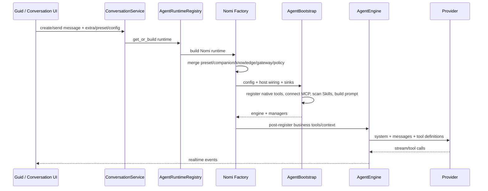

# 现状与 Harness 调研（2026-09-02 修订）

> 文档角色：本文是经 2026-09-02 修订的**设计背景与历史审计记录**，用于解释 Agent Capability Platform v2 为什么需要重构，以及哪些既有构件值得保留。
>
> 本文**不是执行状态源、当前 TODO、发布清单或 Gate 结果**。当前设计修订以
> `05-system-capability-replacement-foundation.zh.md` 为准；工作项的 open/closed/blocked
> 状态以 `GLOBAL-CLOSURE-TODO.zh.md` 为准。
>
> 本文中的行数、Capability 数量、工具数量、目录大小和上游版本均是调研发生时的
> **审计快照**，只用于说明当时问题的规模，不代表 2026-09-02 的当前实现进度，
> 也不得转化为固定数量 Gate、发布阈值或长期兼容合同。

本次修订不是给旧要求增加一段笼统免责声明，而是直接删除或改写已经被 05 否定的
错误设计。保留的是现状调查、架构债务和目标方向的依据；实施编排、生命周期、
Sidecar 协议、发布矩阵与证明体系一律服从 05 的止损边界。

## 1. 调研方法与证据边界

原调研采用只读证据链：

- NomiFun 证据使用本文所在仓库的 repo-root-relative 路径；
- DeepSeek Harness 历史快照位于约定的兄弟目录 `../deepseek-harness/`，当时核对提交为
  `cd5ef8148158c3a752a658978873241fdf8e2bbc`；
- Codex 历史快照位于约定的兄弟目录 `../codex/`，当时核对提交为
  `dc2ccc6843abb09c9d297862dc10b6bd12a3935d`；
- 当时未在约定目录发现 Pi/piagent 本地源码，相关结论只作为上游比较材料；
- 当时 Web UI 只能审计到登录前后有限路径，不能据此宣称完成视觉或端到端验收。

路径便携仍是有效工程要求：源码和文档不得编码盘符、用户名、临时 worktree、机器
目录或本地文件 URI。运行时数据根、Workspace、Package root 和外部工具位置必须由
Host 或测试 fixture 明确解析。

本文引用的代码路径和行号是历史定位线索。代码迁移后路径或行号变化，不应被解释为
调查结论失效，也不应通过 source-string 测试把旧文件布局锁死。

## 2. 当时的 NomiFun Agent 请求链

历史 owner 会话大致经过：



### 2.1 组合根已成为业务装配中心

下表是原调研时的代码规模快照，不是当前行数或质量 Gate：

| 文件 | 当时约计行数 | 当时承担的职责 |
|---|---:|---|
| `crates/backend/nomifun-app/src/services.rs` | 5,008 | 进程级服务总装配 |
| `crates/backend/nomifun-app/src/router/state.rs` | 2,678 | RouterState 构造与 late wiring |
| `crates/backend/nomifun-app/src/router/routes.rs` | 1,233 | HTTP/WS 路由合并 |
| `crates/backend/nomifun-ai-agent/src/manager/nomi/agent.rs` | 7,831 | Nomi 会话与业务接线 |
| `crates/agent/nomi-agent/src/engine/mod.rs` | 6,121 | Turn loop、工具、恢复与压缩 |

行数本身不是缺陷。真正的问题是同一批业务实例沿多条路径反复注入：

- `GatewayDeps` 聚合 Conversation、Runtime、Cron、Requirement、Companion、Terminal、
  Provider、IDMM、Workshop、Creation、Knowledge、AutoWork、Channel、File、Shell、MCP、
  AgentExecution、Browser 和 Computer 等服务。历史注释还要求新增 Gateway 能力时继续
  “加字段并由 App 注入”；证据位于
  `crates/backend/nomifun-gateway/src/deps.rs:17-114`；
- `AppServices` 同时持有 DB/Auth 等 Kernel 基础设施和大量业务单例，RouterState 再次
  组合并互相装配这些实例；证据位于
  `crates/backend/nomifun-app/src/services.rs:1553-1635` 及其后续字段；
- `AgentFactoryDeps` 把 Model、Gateway、Browser、MCP、Requirement、Cron、Companion、
  Knowledge 和 SSH 等重新灌入 Factory；证据位于
  `crates/backend/nomifun-ai-agent/src/factory/mod.rs:92-185`；
- `ConversationService` 反向持有 Runtime Registry，并通过构造后的
  `RwLock<Option<...>>` slot 接入 Cron、MCP、Knowledge、Preset、IDMM、turn observer、
  Provider failover 和 terminal proof，而这些业务服务又需要 Conversation；证据位于
  `crates/backend/nomifun-conversation/src/service.rs:1007-1087,2294-2330`；
- `NomiBuildExtra` 继续把 MCP、Companion、SSH、Browser、Computer、Gateway、Channel、
  Knowledge、Delegation 与业务开关编码到运行参数；证据位于
  `crates/backend/nomifun-api-types/src/agent_build_extra.rs:112-227`。

历史 `GatewayDeps` 注释直接记录了循环形成过程：Gateway 必须先创建，Agent Factory
又需要 Gateway config；Conversation 先拿到 Runtime Registry，随后再接收依赖
Conversation 的 Cron、MCP、Knowledge 等服务。App/RouterState 只能在所有对象出现后
补做 `set_deps` 或 slot registration：

```text
App creates partial Gateway/Conversation services
  -> Factory consumes Gateway and business providers
  -> domain services consume Conversation
  -> App/RouterState late-wires those services back into Conversation/Gateway
  -> Agent build receives the same service bag again
```

这不是“某个 struct 过长”，而是多个对象都能充当第二 Composition Root。同一事实可从
App、Gateway、Factory 或 Conversation 进入，启动顺序和后置写入变成业务语义。正确
修复不是在现有聚合器外再包一层 facade，而是让消费者只依赖 canonical Capability、
AgentSession port 或窄 typed service，并让业务 repository 与生命周期继续归 owning
domain。

### 2.2 数据与恢复存在多套事实

当时的数据不只位于主 SQLite。Knowledge、Memory、Extension、Skill、MCP、Browser、
Robot、Terminal 和 SSH 各有 side store、配置或外部引用；`conversation.extra` 与其他
JSON 又承载了难以枚举的隐式装配语义。更关键的是，会话完成与恢复至少由四个可独立
变化的事实面共同决定：

1. **Conversation SQLite 与 StreamRelay** 保存 Conversation/Message、delivery receipt、
   turn admission 和终态；StreamRelay 同时更新 message row 并投递 WebSocket。
   历史证据位于
   `crates/backend/nomifun-db/src/repository/conversation.rs:90-156,454-688,767-800,1082-1125`
   与
   `crates/backend/nomifun-conversation/src/stream_relay.rs:3503-3575,3635-3780`；
2. **Nomi 私有 session/index** 在独立文件中保存 transcript、usage、deferred activation、
   editable checkpoint、host context、accepted/pending turn root 和 crash idempotence
   标记；恢复还要与 Conversation 时间、source message 和 receipt 交叉校验。历史证据
   位于 `crates/agent/nomi-agent/src/session.rs:15-180,210-371` 与
   `crates/backend/nomifun-ai-agent/src/nomi_session_persistence.rs:1-42,103-130,254-327,424-463`；
3. **Runtime rollout/checkpoint** 如果被当作完成权威，就会形成第三套产品历史；它只能
   是 opaque Runtime binding/cache，不能从私有 thread/rollout 状态反向推进产品 Session；
4. **Broadcast/WebSocket** 是低延迟投递面，不是事实源。断线补读、repair/rewind 与
   terminal receipt 已经说明它不能决定完成。

这个调查结论仍然有效：目标需要一个 canonical `AgentSession` 事实主链，Projection
可重建，Runtime checkpoint 只是可丢弃的执行缓存。SessionEvent 记录执行与产品历史，
但 Requirement、Memory、Creative Task、Robot、Channel 等业务状态继续归 owning
domain，不能为了“统一日志”复制进 Session。

Clean v4 仍是有效方向，但本文不再保留旧的超长 archive 状态机和逐崩溃点证明要求。
Fresh-v4 baseline、fixture 和数据库结构应直接按当前 canonical contract 修正；不为尚未
Stable 的开发数据继续建设 converter、双读写或兼容迁移平台。

### 2.3 Remote 当时绕过 AgentSession

历史 Remote 路径已经具备 installation-owner 认证，但认证后会直接进入全局 Gateway：

1. App 同时挂载 `/mcp`、特制 `/mcp-agent` 和 `/v1`；它们共享 `GatewayDeps` 或
   `Registry::global()`，并通过固定 profile、任意 `domains` 或 transport scope 选择
   能力。历史证据位于
   `crates/backend/nomifun-app/src/router/routes.rs:447-489`、
   `crates/backend/nomifun-public/src/handler.rs:52-109,198-235` 与
   `crates/backend/nomifun-public/src/rest.rs:42-82,118-172`；
2. REST 从 installation token 得到 owner `CallerCtx` 后直接 dispatch 全局 Registry，
   请求没有 AgentSession、frozen Snapshot、exact Revision 或 typed resource binding；
3. MCP 的 server-generated transport session 只固定连接清理、owner 和 request budget，
   却同时被描述为逻辑任务边界。断线或重连后，没有稳定产品 Session 可
   observe/resume。历史证据位于
   `crates/backend/nomifun-public/src/session.rs:31-77,1380-1486,1540-1610`；
4. Remote 复制了 Gateway danger/confirmation 流程，包括 `confirm: true` 重调与
   `needs_confirmation` 到 HTTP `409` 的映射。这与唯一 FullAuto 主链冲突；
5. 单一 installation token 只认证 installation owner、可 rotate/revoke，这一方向正确。
   历史证据位于 `crates/backend/nomifun-auth/src/instance_token.rs:1-77`；
6. 旧 Remote Agent 表虽已删除，兼容 DTO 中仍曾保留 `remote_agent_id` 等退休字段。
   clean v4 应直接 schema-fail，而不是继续发布兼容解释。

缺失的不是另一个 Remote Agent 类型或 token scope DSL，而是：

```text
authenticate owner
  -> resolve owner-owned RemoteBinding
  -> open canonical AgentSession
  -> use explicit agent_session_id for turn/observe/cancel
```

Token rotate/revoke 只影响后续请求 admission。已经通过 admission 的请求可以完成；
不需要 token-to-Session 反向索引、后台 fan-out cancel 或跨 Response Body 生命周期的锁。

## 3. 为什么当时的简单问答也很重

### 3.1 默认路径是“先构造全部，再过滤”

历史 `AgentBootstrap` 默认创建 Read、Write、Edit、ApplyPatch、Shell、搜索、进程和记忆
等 Native Tool，随后再加入 Skill、MCP、Plan、ToolSearch、Browser 或 Computer。工具
限制发生在对象创建、MCP 连接和 Skill 扫描之后，且空 allowlist 曾表示“不限制”。

因此当时的实际顺序是：

```text
construct/connect/scan all
  -> build prompt and registries
  -> retain visible tools
```

这解释了为什么“模型最终看不到某个 Tool”不等于其 Provider、连接、索引或 Context
没有初始化。目标应改为 Snapshot 正向选择：空集合就是零能力，未选择的对象不构造、
不连接、不扫描。

### 3.2 Gateway 与 Prompt 的历史规模

以下数字仅是原审计快照，不是固定目录合同：

- Gateway 当时静态登记约 155 个 capability、23 个 domain；
- `work` profile 当时约暴露 76 个 Gateway 项；
- 普通 Desktop owner 会话叠加 Native、Requirement、Cron 后，当时约为 97 或 98 个
  provider-visible Tool，再加用户 MCP；
- 76 个 deferred stub 的名称和摘要当时约占 12,964 字符。

这些数字只证明旧默认组合很宽。后续 Catalog 只验证 ID 唯一、依赖闭合和关键角色
可运行，不锁定 Capability、模板、Tool 或 domain 的数量。

Gateway deferred schema、ToolSearch 和 ContextContributor 都是可复用构件，但 schema
折叠不等于 on-demand activation。真正的按需语义必须推迟 Provider、MCP、Skill body、
Context 和资源实例的构造。

### 3.3 MCP、Skill、Prompt 与产品页同样提前装配

历史 `AgentBootstrap` 在模型表达需求之前连接 MCP、扫描 Skill，最后才按
`allowed_tools` 做 retain；证据位于
`crates/agent/nomi-agent/src/bootstrap.rs:660-685,966-974`。Context 又固定组装通用
工具指南、AGENTS、Project Memory、Plan/Browser 规则、Skill 摘要、环境与工作目录，
Factory 再追加 Preset、伙伴 Persona、召唤记忆、Knowledge、委派、生图和语言政策。

当时 Windows 展开的通用 `tool_usage_guidance()` 约 5,199 字符，Memory index 可注入
最多 25,000 bytes，Project AGENTS 上限 32 KiB。它们只是说明静态 Context 不会被消息
compaction 自动消除的历史规模证据，不构成 token、时延或性能 Gate。

前端也在补偿后端缺少完整 Snapshot：`ui/src/renderer/pages/guid/GuidPage.tsx` 同时加载
Skill/MCP catalog，并维护 Knowledge、AutoWork、IDMM、Summon、模型、协作等草稿；
普通会话、Terminal、Cron、伙伴、客服和创意工坊又各自实现装配入口。问题不是某个页面
字段太多，而是产品层必须跨 API 猜测本应由唯一 Compiler 产生的执行闭包。

`ContextContributor` 是值得保留的 typed seam，但它必须由选中 Capability 的 Context
plan 驱动；不能继续作为没有 canonical identity、依赖和 ownership 的任意追加列表。

### 3.4 Preset 不是完整执行合同

历史 Preset 已能保存 instructions、Agent/model preference、Skill、Knowledge policy、
targets 和 tags，并生成不可变解析结果。值得保留的不变量是“运行使用不可变解析结果”，
而不是旧表、旧 ID 或旧 Snapshot bytes。

当时 Preset 仍缺少：

- canonical Capability closure；
- Runtime Profile；
- initial/on-demand activation；
- typed resource binding；
- Browser、Computer、Memory、IM、Robot、Creative、Requirement 等真实执行闭包；
- 对旧 Factory bool/Option 与 `conversation.extra` 的替代。

因此 AgentPreset Compiler 必须成为唯一 Compiler，而不是让 Control Plane、Kernel 和
Session Open 各自计算或比较一份 Snapshot。

### 3.5 Extension、Tool 与 Capability 身份分裂

历史 Extension 已有 manifest、semver、dependency、enabled state、路径校验和多种
contribution，但它不是统一 Capability Runtime：

- Extension、Agent、Skill、MCP 和 Tool 重复表达同一能力；
- Native Tool、Gateway Capability 和 MCP Tool 各自保存 schema 与 handler；
- built-in 可以绕过 Package mount/materialize 直接在 Factory、Gateway、Manager、
  RouterState 或 `AppServices` 注册；
- installed state、Hub、产品 SQLite 和运行 Registry 不是同一事实源；
- lifecycle shell、hot reload、permission/risk 等路径没有形成首版需要的稳定合同。

有效结论是统一为：

```text
Package -> Capability / Skill / MCP contribution
        -> canonical materialization
        -> AgentPreset selection
        -> Snapshot
        -> one invocation route
```

`Capability` 是稳定执行与 schema identity；`Skill` 是说明和工作流；`MCP` 是外部来源与
传输；Package 负责来源、版本和贡献。内部 typed service 只解决 Rust 对象接线，不应
变成第五个产品 Catalog。

## 4. Harness 调研与 Runtime 选择依据

### 4.1 DeepSeek Harness 是完整插件平台

原调研快照中，DeepSeek Harness 约有 254 个 package manifest、2,640 个 TypeScript
源文件、90 份 Cordis 配置，并包含 Loader、Fiber、Scope、Session、Web、Sandbox 和
大量生命周期逻辑。这些数字只说明“整体 Rust 转写”会复制一个平台，不是目标规模 Gate。

值得有限借鉴的只有：

- 插件拥有自己注册的 listener、effect 和 resource；
- 停止时能够按 ownership 逆序、确定性清理；
- Host 基础设施与 Agent Preset 执行选择分离；
- 同一 Loop 可以承载不同能力面。

不迁移的内容包括依赖缺失等待、Service replacement 重装、Loader rollback、HMR、
丰富 EventBus 求值模式、通用 scope registry 和任意配置代码。

### 4.2 Host Plane 与 Agent Preset Plane

Harness 的 Host/Profile 持有 Agent registry、Session、LLM、Tool/SystemPrompt registry
等共享基础设施；Agent Preset 只提供 Persona、模型可见能力、Prompt/Skill 与局部运行
选择。这个区分仍有直接价值：Preset 不应拥有 authentication、database、credential
store、plugin loader、全局 Provider registry 或系统进程事实源。

对 NomiFun 而言，AgentPresetRevision 是 Kernel 已发布能力和资源的不可变选择，不是
另一个 Composition Root。反过来，Host 也不能借“平台默认”把未选中的业务能力塞回
Session。

### 4.3 上游模式证明“同一 Runtime，不同能力面”可行

历史 Harness 的标准、PTC、极简和创造模式并不是四套独立引擎。尤其极简模式证明：
同一执行基座可以关闭 Skill、Plan、Subagent、Web 和大部分 Tool，只保留明确需要的能力。

四种模式提供的证据并不相同：

| 模式 | 可借鉴结论 | 不能推出的结论 |
|---|---|---|
| 标准 | 同一 Loop 可承载完整 Coding 能力 | 不能作为普通问答默认模板 |
| PTC | Tool presentation 可以压缩为较小入口 | 底层能力、Prompt 和调度仍在，不能证明结构轻量 |
| 极简 | 同一 Loop 可以真正关闭 Skill、Plan、Subagent、Web 等能力 | 不代表 NomiFun 应复制其具体 Tool 集 |
| 创造 | 动态 Tool/Skill 可以叠加在同一 Runtime | 进程内 Map 与任意 JavaScript 不等于持久 Package 生态 |

这个观察支持 NomiFun 的目标：

- `chat.minimal` 使用空 Capability 集合和非 Coding instructions；
- Coding 使用完整 Codex-native 能力；
- 其他场景只获得 Snapshot 选择的领域能力；
- 不为每个产品场景建立独立 Runtime。

### 4.4 Harness Preset 的限制同样需要保留

原调研还发现：只有部分入口真正接入 per-session Preset；同 generation 的 Agent 共享
standing mount；turn 开始后不能切换；generation 更新不能完整感知 Skill/assets；
旧 generation 缺少可靠回收；UI 也不是结构化 Capability builder。

因此 Harness 是“Host 与 Preset 分层、同一 Runtime 多能力面”的参照，不是可直接替换
NomiFun AgentPreset、Snapshot、Session 与产品编辑器的成品。

### 4.5 Codex-derived Runtime 仍是目标基座

Codex 的有效优势是成熟的 Coding instructions、Workspace/Git/AGENTS、文件与 Patch、
Shell/Process、Skill、MCP、subagent、turn、cancel、event、compaction 和恢复能力。
NomiFun 选择它，是为了保留完整 Coding 能力并让同一 Runtime 支持精简 Profile，而不是
抽取一个新的通用 Tool Loop。

Codex 进程边界仍是普通 trusted in-process plugin 之外的特例，但 05 已纠正旧 Sidecar
假设：

1. 优先复用官方 app-server 已有 initialize/version、thread/turn、cancel 和 event 协议；
2. 一个 Runtime binding 当前独占一个受管进程；
3. 正常结束先关闭协议，再由 Host 有界终止完整 descendant process tree；
4. Host-managed Tool 在请求到达 Host 时执行必要的 Effect reservation，不再额外要求
   自定义 `native_action/start`；
5. 没有真实进程内复用需求时，不要求自定义 `runtime/session/dispose` ACK；
6. 只有 upstream spike 证明 Codex-native file/shell 缺少必要调用前 seam 时，才允许保留
   一个窄 patch；
7. hello 只校验协议 major、build identity 和必要 feature，不镜像整个平台合同。

因此本文不再把 `runtime/hello`、`native_action/start`、`runtime/session/dispose` 或其他
仓库外 patch 当作既成事实、发布前置或 Host contract 扩张依据。

Nomi Runtime 只属于待删除的旧生产组合。其退出采用一次性 C9 shutdown，不再建设
per-domain sticky canary、read-only shadow、durable Session handoff 或在线迁移平台。

## 5. 保留的目标架构依据

### 5.1 Thin Kernel

Thin Kernel 的职责应可穷举：

- App bootstrap 与最小 Plugin Host，只按简单 required dependency 启动 trusted
  in-process registration；
- DB connection、transaction、migration lineage 与 outbox 基元，但领域表和
  repository 语义仍归 owning domain；
- principal、ownership、remote auth 与 credential storage；
- 一个 canonical AgentPreset Compiler；
- Capability Registry、Snapshot allowlist 与 exact invocation route；
- canonical AgentSession identity、turn admission 和语义 SessionEvent；
- Codex Runtime client、process supervision、cancel 与 descendant cleanup；
- ChatModelBroker、provider/model/task 路由和 credential 注入；
- 最小 Remote ingress，只负责认证、Binding 解析和进入 AgentSession；
- canonical Event commit 后的 best-effort typed wake-up；可靠业务动作继续使用 typed
  command 或 owning-domain outbox。

历史 D-006 中仍应保留的最小正确性边界是：Auth/Ownership、Snapshot allowlist、
typed resource binding、Remote auth 与 credential storage。它们是确定性输入，不是
另一套 Permission、Grant、Lease、Approval 或插件隔离平台。

下列业务域必须离开 `AppServices`、Factory 与 Conversation 固定字段，作为普通
PluginRegistration、Capability、typed port、Router contribution 和自身 repository
接入：

- Chat/Session 产品行为、附件、标题、场景入口与 UI projection；
- Knowledge、Project/Companion Memory、Skill 与 MCP 配置/投影；
- Files、Workspace、Artifacts、Process、Terminal、SSH、VCS/LSP；
- Browser、Computer、Accessibility 与 Office；
- Companion、Channel/IM、Customer Service 与 Robot；
- Creation、Creative Studio/Workshop、Canvas、Asset、MiniApp 与媒体任务；
- Requirement、AutoWork、Cron/Scheduler、IDMM 与 AgentExecution/协作；
- Notification、Webhook、Provider protocol adapter、Model catalog/admin 与其他
  System 业务功能。

这些域可以共享同一进程和 Rust 类型，但只能依赖 Kernel contract、Capability required
keys 或窄 typed service，不能依赖 `nomifun-app` Composition Root，也不能通过
Conversation 或 Gateway 重新取得全部业务服务。

### 5.2 统一 Capability 主链

目标对象保持四层：

| 对象 | 唯一职责 |
|---|---|
| `Package` | 来源、版本、mount、配置和贡献 |
| `Capability` | canonical ID、schema、说明、依赖和执行 binding |
| `Skill` | 模型说明、方法、workflow 与 assets |
| `MCP` | 外部 server/source 与 Tool transport |

Browser/Computer 的 `ExecutionRole`、`RoleProviderContribution` 和
`ResolvedRoleProviderLock` 是 canonical Capability 背后的实现选择接缝，不是第五种
用户能力对象。第一方 Provider 必须与未来 Provider 走同一个 materializer、index、
Compiler 和 Dispatcher。

Native、Codex-native、Gateway、REST/MCP projection 应追溯到同一 Capability descriptor。
不再允许同一产品能力拥有多份可独立漂移的名称、schema 和 handler。

### 5.3 单一 AgentSession

技术域只保留一个 canonical `AgentSession` 与 typed `AgentSessionId`。Chat、Remote、
scheduled automation 和其他入口都创建或引用同一种 Session：

- immutable Preset Revision 与 frozen Snapshot；
- explicit typed resource bindings；
- turn、observe、cancel、delete 和 fork 使用同一 identity；
- fork 创建新 Session 并记录 provenance；
- transport connection、token、Binding ID 或“最近会话”不能替代 Session identity。

旧 Conversation、Nomi private session 和 Runtime checkpoint 不得继续成为平行产品
生命周期。

### 5.4 一个 Compiler 与选中执行闭包

历史 Preset 只解析 Agent、model、Skill 和 Knowledge，真正的 Tool、Context、
Runtime Profile 与资源仍由 Factory bool/Option、Gateway profile 和
`conversation.extra` 决定。如果 Control Plane、Kernel 和 Session Open 各算一次，
同一 Revision 就可能得到不同 closure、diagnostics 和 digest。

因此 Preview、Save 和 Test 必须调用同一个纯函数 Compiler：

```text
Preview ─┐
Save ────┼─> one canonical Compiler
Test ────┘          │
                    └─> Snapshot + authority + diagnostics

Session Open ─> read saved Snapshot + current executor compatibility check
```

Control Plane 只把 diagnostics 映射成产品 DTO，不复制 dependency、profile、closure
或 digest 算法。Session Open 读取已经保存的 Snapshot，只做当前执行兼容检查，不重新
编译另一份结果。

Snapshot 冻结实际执行闭包：

- 实际选择的 Capability、Provider 和 Package contribution；
- 实际 Tool schema、model route 与 typed resource binding；
- 当前需要的 Runtime protocol/features；
- initial/on-demand 分组；
- Snapshot digest。

未选择的 Package、完整 target inventory、官方模板全集、决策文档 digest 和无关全局
schema ledger 不应决定旧 Session 是否可执行。

Catalog 和模板不使用固定数量作为 Gate。官方 seed 只需要满足真实角色任务；
release-required 用户闭环之外的能力可以明确显示尚未提供，而不是用 metadata-only
注册制造完成。

### 5.5 正向装配与按需激活

AgentPresetRevision 仍可表达：

```text
initial_capabilities[]
on_demand_capabilities[]
```

Compiler 在 Session 创建时解析选中闭包。initial 进入首个 Runtime Profile；on-demand
只进入紧凑索引，并在 turn boundary 激活已经冻结的 exact Capability。两个集合之外的
调用确定性失败。

关键不变量是：

- 空集合就是零能力；
- 未选择或未激活对象不构造、不连接、不扫描；
- 激活不搜索全局 Catalog、不修改 Preset、不扩大 Snapshot；
- 不建设 capability release、Lease、Permit 或动态降权状态机。

### 5.6 SessionEvent、Projection 与 Effect

保留一套语义 `SessionEvent`、cursor 和最终用户/助手消息。Projection 只保存 UI 当前
需要的最终状态、文本、Tool 摘要和引用，不再内嵌完整 Event Log。

模型 token/delta 默认 transient：

- 正常完成只持久化最终 assistant message；
- 中断时最多保存 bounded partial；
- 不为每个 content part 重读并重写全部旧事件；
- Runtime checkpoint 只作为可丢弃缓存。

Effect 只保留三种策略：

```text
read_only
managed_effect
external_uncertain_effect
```

本地 DB、KV、文件和 VCS 使用事务、revision/CAS 或原子文件操作。外部发送、远程命令
和设备控制在 dispatch 前持久化必要 reservation；结果 unknown 时禁止自动 retry，由
owning domain reconcile。不得为所有写操作建立统一五阶段状态机、全局 EffectCoordinator、
Wave 级 JSON journal 或与 SessionEvent 重复的 receipt。

### 5.7 Remote 进入同一主链

Remote 永远是 ingress/transport，不是 Agent 类型或权限模式。RemoteBinding 持有
canonical AgentBinding；`open` 返回 typed `agent_session_id`，后续 `turn/observe/cancel`
显式提交同一 ID。

Binding 更新只影响新 Session。Token revoke 只拒绝之后的 request admission；既有
Session、Binding、Event 和 Effect 不级联取消或删除。

### 5.8 Browser/Computer 可替换能力

05 已把 Browser/Computer Role Provider seam 确认为一期必做：

```text
Agent / Cron / AutoWork / Requirement / MiniApp / Remote
  -> canonical browser.* / computer.* capability
  -> frozen ResolvedRoleProviderLock
  -> role_provider_index
  -> exact Provider Mount
```

保留该 seam 的理由不是“未来可能有插件”，而是当前主链已经存在会导致替换失真的
具体旁路：

| 历史事实 | 直接问题 |
|---|---|
| Gateway 直接依赖并调用 `ComputerRegistry` | Agent 主链换 Provider 后，Gateway 仍可执行第一方实现 |
| `mcp-computer-stdio` 自行构造 `ComputerTool` | Codex/ACP 可完全绕过 Snapshot Provider lock |
| Knowledge URL render 直接使用 `BrowserSessionHub` | Chat 可换 Browser，但 Knowledge 仍暗中启动第一方 Chromium |
| legacy Nomi Factory 使用 Browser slot | 新 v4/Codex 主链若复用会把具体实现重新灌回 Factory |
| canonical Capability 先应用第一方平台限制 | 远程 MCP/未来 Provider 会在被选择前就被第一方条件拒绝 |

`ExecutionRole` 只表示稳定的系统能力角色；Agent 仍只选择 canonical
`browser.*`/`computer.*` Capability。Provider binding 回答“由谁实现”，不能扩大
Snapshot capability ceiling。第一方与未来 Provider 的差异只来自 Package、Mount、
Artifact、配置和 typed export，不能通过抢占同一 Capability ID 表达。

Compiler 的顺序必须是：

```text
resolve selected canonical Capability members
  -> derive required Browser/Computer Role members
  -> choose exact Provider from Revision override or installation default
  -> validate that Provider's platform and typed resource requirements
  -> freeze ResolvedRoleProviderLock in Snapshot
  -> create AgentSession
```

必须先选 Provider，再校验该 Provider 的平台和资源约束；否则第一方实现的本机限制会
被错误提升为整个 Role 的永久限制。运行期也不能重读 latest/default，Provider 缺失或
结构不兼容时原 Session 只读并显式 fork，不静默回退第一方实现。

同一个 exact lock 必须覆盖三类路径：

- Tool handler 使用 Provider Mount 的 config、state、service view 和 frozen resources；
- ContextContributor 与 ResourceProvider 使用同一 Provider，而不是回到 façade Mount；
- 没有 AgentSession 的 Knowledge import 等系统操作，在 operation admission 时解析并
  冻结同一种 lock，随后通过同一个 dispatch primitive 执行
  `browser.render_content`。

`RoleDispatcher` 只是 Kernel Registry 内第一次选择 handler 的 exact route，不是新的
Service、Package 或“先调 façade handler、再回调 Kernel”的第二次分发。它不做发现、
评分、fallback、自动 retry 或 AI 选 Provider。

这些旁路需要清理，但底层 Browser Hub、lane、ComputerTool、target arbiter 和人类
Browser management/login/Surface 并非必须删除；它们应成为第一方 Provider 或明确
owning surface 的内部实现。第一方 Provider 与 alternate fixture 必须走同一
materializer、index、Compiler 和 Dispatcher，才能证明 seam 不是写死内置 ID。

### 5.9 First-party dogfood 与代表性闭环

历史设计中“第一方也必须走公共主链”的判断继续有效。可信度不能来自只给未来第三方
保留一组 interface；至少一个真实 first-party Package 和隔离测试中的 `sample.echo`
需要共同证明：

```text
Package mount
  -> schema-backed config + namespaced state
  -> PluginRegistration
  -> materialize Capability/Skill/MCP contribution
  -> Compiler selection
  -> Snapshot
  -> canonical invocation
```

`sample.echo` 不进入 production inventory、默认模板或用户导航，也不能获得 test-only
direct register、fake Catalog 或专属 Runtime。它的意义是证明公共 seam 可执行，而不是
增加一个固定“三哨兵”数量 Gate。真实产品闭环仍以 05 的 release-required 场景为准。

### 5.10 Clean v4 与物理删除边界

Clean v4 的有效原则是：

- 新 baseline 直接使用当前 canonical schema 和 fixture；
- 新 Runtime 不读取旧 Conversation、Nomi session 或散落业务 JSON 作为运行事实；
- 不建设 whole-dataset converter、dual-read、dual-write 或长期 fallback；
- 已迁移消费者不能继续通过旧 DTO、Factory 或 service bag 绕回 legacy producer；
- 旧 published migration 可以作为历史源码保留，但不应成为 fresh-v4 runner 的运行依赖。

旧设计中关于 whole-root archive、immutable operation intent、每个 crash point 和文件系统
调用的完整证明体系不再由本文规定。数据根初始化与升级必须保持真实数据安全，但具体
合同以 canonical bootstrap 实现和针对性行为测试为准，不恢复过度 proof 对象。

物理删除前先枚举真实消费者、数据 ownership、路由、构建依赖和测试入口。切换后删除
被替换的生产旁路，不保留 alias、双 Registry、hidden fallback 或只为旧测试存在的
adapter。Nomi-only 精确 allowlist 可以按 05 保留到 C9，但不得增长或接入新架构。

### 5.11 AgentBinding、Editor 与真实 Test

Requirement、AutoWork、Cron、Remote、IM 等持续对象需要复用 canonical AgentBinding，
而不是各自保存 Preset、model、Skill、Knowledge、Tool 和 resource 字段子集。Binding
更新只影响之后创建的 Session，既有 Session 继续使用 frozen Snapshot。

普通 Agent 编辑器使用产品语言展示名称、用途、模型、能力分组和资源 picker。Revision、
Snapshot、digest、protocol 和 raw JSON 只放入默认折叠的技术诊断区。

Test 不建立 `TestSession`、临时 Runtime 或 mock resource 主链：

- dirty draft 先走正常保存；
- clean draft 复用当前 Revision；
- 随后打开一个普通、可观察的真实 AgentSession；
- state-changing Capability 对真实绑定资源产生正常 Effect；
- 删除和生命周期规则与其他 Session 相同。

这保留了“只有一条执行主链”的核心设计，同时删除旧结构测试、固定模板数量和为 Test
单独复制状态机的要求。

### 5.12 Snapshot 兼容与显式延续

运行期不能把 Provider 或 Package 静默切换为 latest。建立 Runtime binding、首次激活
Capability 或执行实现变化时，应检查 frozen Snapshot 所需的实际 protocol、Provider、
Package contribution 和 resource compatibility。

结构不兼容时：

- 原 Session 与历史仍可读取；
- 原 Snapshot 不被改写或重新绑定；
- 用户通过新 Session 或显式 fork 延续；
- Tool、外部 Effect 和未完成进程不得因恢复而自动重放。

临时网络、Credential、Provider process 或资源故障仍是普通运行错误，不应伪装成
Snapshot 结构不兼容。Checkpoint 只有满足当前 canonical compatibility 条件时才作为
快速缓存复用，否则丢弃并从持久事实建立新 binding。

## 6. 05 已纠正的旧设计

### 6.1 不再使用固定数量 Gate

删除以下完成判定：

- 固定 Capability、Tool、domain、模板或 handler 数量；
- 读取 Rust/JSX 源码字符串并锁定组件、方法名或清单长度；
- “全部 inventory 项都有 owner”才允许 Stable；
- 用固定模板全集 digest 决定旧 Session 是否兼容。

替代方案是 ID 唯一、依赖闭合、真实 owner、关键角色可运行和代表性用户闭环。

### 6.2 不再使用固定五流与 ROM

旧 D-019 的固定五 workstream、6-8 agents、engineer-weeks 和周数估算已删除，不再作为
设计事实、Gate、进度基线或资源承诺。

仍保留的工程原则只有：

- 并行任务必须有互斥写集和清晰 owner；
- 主机保留 merge 与集成职责；
- 每批使用最小定向检查；
- 全仓 broad test 只在真正跨域合流或最终 RC 执行；
- 测试障碍记录一次，必要时转人工验证，不盲目重试。

### 6.3 D-024 只保留真实删除语义

Session 删除保留：

```text
live -> deleting
  -> stop new writes
  -> cooperative dispose
  -> hard-kill descendant process tree
  -> idempotently delete Session-owned content
  -> minimal tombstone
```

删除 `ZeroOutstandingProof::verified()`、由调用者填写多组零计数以及每类 handle 的发布级
证明对象。Runtime 返回真实 `RuntimeDisposeReport`；Store 只删除自己拥有的数据。

### 6.4 D-027 改为一次性 C9 shutdown

旧 per-domain sticky canary、祖先 deadline 最小值、read-only shadow、durable Session
handoff 和多维 outstanding ledger 已删除。

新的 C9 前置是：

```text
stop Nomi admission
  -> cancel internal Nomi work
  -> bounded application/runtime shutdown
  -> kill descendant process tree
  -> mark genuinely unknown external Effect as uncertain
  -> verify Nomi process/binding/public route/release artifact absent
  -> delete Nomi
```

不在同一 Session 中途切换 Runtime，不自动重放 Effect。

### 6.5 D-028 改为首发三平台

首批 release-blocking 平台为：

1. Windows Desktop x64；
2. macOS Desktop arm64；
3. Linux Desktop x64。

macOS x64 与 Linux Headless x64 保留设计兼容和后续交付入口，但不阻塞首个 Stable。
只有在真实宣称支持时，才在对应原生 Host 上补齐 build/package/install/launch/critical
capability/dispose 证据。

删除五 native cell 笛卡尔矩阵、HP-1/HP-2 固定暂停、whole-cohort tuple、affected/unaffected
attestation 和每次修复触发全平台重验的要求。Cross compile 和静态检查仍可提供开发信息，
但不能冒充对应原生平台 PASS。

### 6.6 C8/C10 不再是证明平台

C8/C10 只保留为受影响集成检查或最终 RC 检查的阶段名称，不再承载：

- 四元 cohort tuple；
- source SHA 自引用；
- digest envelope 递归证明；
- allowed/deferred/unclassified residual 分类引擎；
- 五平台复制全部功能/fault；
- 文档或 Gate 自身变化导致所有旧制品证据失效。

真实 release lock 在打包后记录 Host、Sidecar 和 Package digest；platform result 记录目标
平台、实际 suite、结果和日志引用。Fixture 使用明确的 synthetic digest，不得与真实
release artifact 混用。

## 7. 可复用的正向样板

以下构件证明重构不需要丢弃全部现有代码：

| 正向样板 | 历史证据 | 应保留的不变量 | 不能保留为第二主链的部分 |
|---|---|---|---|
| Gateway typed Capability | `crates/backend/nomifun-gateway/src/registry/capability.rs`、`registry/mod.rs` | typed request、schema 生成、参数校验、handler 与同 registry dispatch | Gateway 自有 name/schema/handler catalog、全局 `GatewayDeps` 与独立能力入口 |
| One-shot / Customer Service | `crates/backend/nomifun-ai-agent/src/one_shot.rs` 与历史客服聚焦工具面 | 构造时只接收显式 Tool、未提供的 handler 根本不存在，证明正向最小装配可行 | 第二个生产 Runtime、性能 baseline 或绕过 AgentSession 的正式 Chat 路径 |
| ToolRegistry / ToolSearch / ContextContributor | `crates/agent/nomi-tools/src/registry.rs`、`crates/agent/nomi-agent/src/context_contributor.rs` | schema validation、deferred activation identity、turn boundary 发布、空 contributor no-op | 独立 Tool/Context identity、先全量构造后 retain、空 allowlist 等于全部 |
| Model invoke resolver | `crates/backend/nomifun-model-invoke/src/resolve.rs` | exact provider/model/task、protocol compatibility、credential origin 与 config revision fencing | 每个业务域自行保存凭据、猜测协议或静默 compatibility fallback |
| Browser Host/Lane | `crates/agent/nomi-browser/` 与主进程 Browser platform | owner/lane、明确资源引用、归属校验、close/cancel 与进程回收 | Agent/Gateway/Knowledge 直接拿 Hub 或把 handle 扩张成通用 Grant/Lease 平台 |
| Creative Studio typed domain | `crates/backend/nomifun-workshop/src/creative_studio.rs`、`service.rs` | Canvas/Project、Asset、Task 的 typed contract、owner 与 repository 边界 | 把 Creative 状态复制进 SessionEvent，或继续由 Factory service bag 直接装配 |
| Immutable Preset resolution | 历史 `nomifun-preset` resolver | 运行使用不可变解析结果 | 旧 Snapshot bytes、旧表身份或另一套 Compiler |

复用标准是“抽取到 canonical contract 后仍有真实消费者”，不是因为已有代码或测试就
永久保留旧入口。第一方实现必须 dogfood 同一 Package/PluginRegistration/materializer/
Compiler/invoker；`sample.echo` 只能证明公共 seam，不获得 test-only direct register 或
专属 Runtime。

## 8. 需要持续清理的架构债务

以下是设计层面的长期清理方向，不是当前 open/closed 状态清单：

1. `GatewayDeps`、业务型 `AppServices`、Agent Factory service bag 与构造后 late wiring；
2. `ConversationService` 同时承担 Session authority 和跨域协调；
3. Native/Gateway/MCP/REST 对同一能力重复保存 name/schema/handler；
4. `conversation.extra`、自由 JSON 和业务 bool/Option 充当隐式能力图；
5. “先构造全部再 retain”和空 allowlist 等于全部；
6. Guid、Cron、Companion、Customer Service、Creative 等页面重复装配 Agent；
7. Requirement、AutoWork、Cron、Remote 等对象各自保存 Preset/Snapshot/resource 子集；
8. Conversation、Nomi private session、checkpoint 和 projection 的多事实源；
9. Remote token 或 transport session 直通全局 Registry/Gateway；
10. Gateway、Knowledge、stdio 和 Agent Factory 对 Browser/Computer 具体实现的旁路；
11. first-party built-in 绕过 Package/PluginRegistration/materializer；
12. Extension loader、hot reload、permission/risk、Hub 和 installed-state 的旧产品语义；
13. 只写不读、与 canonical JSON/Event 重复的数据库 projection；
14. 为未来能力预建但没有 repository、真实 owner、消费者或产品入口的 DTO/receipt；
15. source-string、固定数量、synthetic digest 和排列组合 evidence 主导的测试；
16. Nomi process、binding、public route、fallback 和 release artifact 的生产可达性。

每次物理删除前仍应先检查真实消费者、数据 ownership 和运行入口，避免误删用户功能。
检查的目标是确定改动边界，不是建立永久 residual 规则引擎。

## 9. 修订后的验证原则

验证以用户行为和受影响范围为中心：

- 文档编辑只做内容与 diff 检查；
- Rust/UI/packaging/platform 改动运行最小相关检查；
- 跨模块合同变更在主要合流点运行 broad checks；
- 代表性真实 E2E 优先于 source-string、fixture shape 和排列组合测试；
- dirty worktree 可以运行诊断性 verify，release attestation 才要求 clean candidate；
- 每个可能挂起的 E2E 有自身 deadline；
- 同一环境或 harness 障碍不反复盲跑，记录一次后给出人工步骤或所需外部信息。

首批核心用户闭环按 05 的当前边界验收，包括：

- 最小 Chat；
- 完整 Codex Coding；
- Workspace/File/Process/VCS；
- 一个真实 MCP Tool 调用；
- Browser observe/navigate/act；
- 平台可用时的 Computer observe/input；
- Knowledge select/search/read；
- AgentSession create/continue/cancel/delete；
- 一个 scheduled/automation Session；
- Remote open/turn/observe/cancel；
- first-party/fixture 同链证明；
- Runtime crash/cancel/process-tree cleanup。

这份列表描述首批产品闭环，不是固定 Capability 数量，也不要求所有可选场景、设备、
凭据或高级组合在首个 Stable 前全部完成。

## 10. 调研结论

NomiFun 已经拥有足够多的正确局部构件。缺失的不是更多 facade、DTO 或 evidence，而是
关键事实必须收敛到一条主链：

```text
principal + AgentPresetRevision + typed resources
  -> one canonical Compiler
  -> selected Capability/Provider execution closure
  -> frozen Agent Snapshot
  -> initial activation + bounded on-demand index
  -> Codex-derived Runtime
  -> canonical AgentSession + semantic SessionEvent
```

Thin Kernel 之外的业务域通过统一 Package/Capability 主链接入。`AppServices`、
`GatewayDeps`、Factory 和 Conversation service bag 不能继续充当第二 Composition Root。
Remote 必须进入显式 AgentSession；Browser/Computer 必须经过 frozen Role Provider；
Runtime checkpoint 只能是缓存；Effect 正确性归事务、原子操作或 owning domain；
Codex Sidecar 优先复用 upstream 协议并保持最小 Host contract。

历史调查支持这些方向，但不再支持旧的固定数量 Gate、五流 ROM、伪 zero proof、
sticky canary drain、五平台笛卡尔 evidence、自定义 Sidecar RPC 假设或过度 C8/C10
证明体系。当前实施与发布判断必须回到 05 和 `GLOBAL-CLOSURE-TODO.zh.md`。
