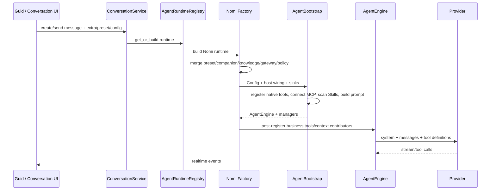

# 现状与 DeepSeek Harness 调研

## 1. 调研方法与边界

本报告采用只读证据链：

- 当前 NomiFun checkout：本文所在 Git 仓库根目录；本工程文件一律使用 `crates/`、`ui/`、`scripts/`、`docs/` 等仓库根相对路径，不编码 checkout 目录名；
- DeepSeek Harness checkout：约定为当前仓库的兄弟目录 `../deepseek-harness/`，本轮核对提交为 `cd5ef8148158c3a752a658978873241fdf8e2bbc`；其工程文件一律带该完整前缀；
- Codex checkout：约定为当前仓库的兄弟目录 `../codex/`，本轮核对提交为 `dc2ccc6843abb09c9d297862dc10b6bd12a3935d`；其工程文件一律带该完整前缀，Codex 结论以该源码和官方文档交叉验证；
- 在当前仓库与约定的兄弟仓库层级 `..` 中未发现用户提到的 Pi/piagent 本地源码；Pi 结论使用官方仓库一手源码，不写入机器相关的搜索路径；
- 运行态 Web UI 能启动到登录页，但无认证 API 被当前 Windows 工具链与 `nomifun-knowledge` 的既有编译问题阻断，因此没有把本轮称为完整视觉审计；
- 本轮只形成架构方案和实施计划，不修改运行代码。

路径便携是本文的持续门禁：仓库内证据只写 repo-root-relative 路径，兄弟源码只写明确约定的 `../codex/` 或 `../deepseek-harness/` 路径；不得回退为盘符、用户名、机器目录、临时 worktree 编号或本地文件 URI。运行时数据根、workspace 与 Package root 仍由 Host 在运行时解析，不允许把本文的 checkout 布局写进目标 schema、代码默认值、fixture 或发布脚本。

本篇出现的 Approval、Permission Mode、Grant、Sandbox、签名和隔离等术语只用于描述当前 NomiFun 或上游实现，不代表 v2 目标。新的架构裁决是唯一 FullAuto：Preset 范围内自动执行，范围外直接失败，不复制任何审批模式。

**D-005 已确认采用方案 C。** 本次重构把交付效率、实现简单和调试直接性放在最高优先级，普通第一方与第三方 Capability Plugin 均视为可信代码，优先在 NomiFun 主进程内直接加载和调用。安全不再扩张为多层权限与隔离平台，但不能误删维持产品正确运行所需的最小边界。本期不建设 WASI、通用 subprocess sandbox、插件 Permission/Risk、Grant/Consent/Lease/Permit、签名链、信任分级、审批或隔离 conformance；现有相关事实仍保留在调研证据中，但目标是主动删除过度设计，而不是补强它。唯一固定例外是 D-004 已确认的 Codex-derived Runtime sidecar：它因独立上游、依赖规模、SQLite/native 冲突、升级和崩溃域采用受管进程，不作为普通插件隔离模板。

本期只保留五类必要最小边界，它们是平台事实与确定性输入，不是用户可切换权限模式：

1. **Auth / Ownership**：确认当前 principal、tenant/user、installation owner 与业务对象归属；
2. **Snapshot allowlist**：模型只看见并调用当前 Snapshot 正向列出的 capability/action/tool；空集合就是零能力；
3. **Resource binding**：Workspace、KB、Memory namespace、Channel、Robot、Browser、SSH 等绑定到明确资源引用，禁止依赖散落的业务布尔权限；
4. **Remote auth**：唯一 installation token 只认证 owner；服务端 RemoteBinding 持有 canonical `AgentBinding`，调用方通过显式 AgentSession `open/turn/observe/cancel` 运行。URL/query、transport session、token 或最近会话不能选择能力、资源或代替产品 Session；
5. **Credential storage**：Provider key、OAuth token 和其他凭据继续由 NomiFun 统一加密存储与按调用注入，不进入 Prompt、Plugin 配置或普通日志。

**D-006 已确认采用方案 A。** 目标是一个职责可穷举的薄功能 Kernel：只保留无法由普通插件自举的启动骨架、唯一事实源和上述五项最小边界；Knowledge、Memory、Browser、Computer、IM、Robot、Creative、Requirement、AutoWork、IDMM 等全部业务能力都迁为同一进程内的 trusted plugin。当前 `AppServices`、`GatewayDeps`、Agent Factory/Manager 与 `ConversationService` 之间的 service bag、late wiring 和反向引用不是目标 Kernel，而是必须拆除的历史债务。

**D-007 已确认采用方案 A。** 插件生态只保留 `Package / Capability / Skill / MCP` 四层：Package 负责安装、版本、简单依赖和分发；Capability 是 AgentPreset 可选择的唯一稳定原子能力；Skill 是模型可读说明/工作流；MCP 是外部工具来源和传输，发现的 Tool 必须 materialize 为 Capability。进程内实现之间只使用 exact typed `ServiceKey<T>` 接线；`ServiceKey` 不是产品对象、数据库 catalog 或版本依赖图。本期不建设 RuntimeContribution、Engine catalog、独立 Service catalog、Service Provider/Consumer graph、virtual provides 或条件依赖 DSL。

**D-008 已确认采用方案 A。** 每个 AgentPresetRevision 只把 Capability 分为 `initial_capabilities` 与 `on_demand_capabilities` 两个集合。Compiler 在创建 Snapshot 时一次性解析两者；Session 只启动 initial，on-demand 只进入紧凑短索引，命中后在 turn boundary 自动激活。两个集合之外的能力确定性失败；Agent 不安装 Package、不修改 Preset、不扩大集合。已激活能力保持到 Session 结束或 Runtime 重建，本期没有模型侧 release/降权状态机。

**D-009 已确认采用精简方案 A。** 产品只预装 7 个角色型 Agent 设定：轻量问答、通用助理、Coding、伙伴、实体机器人、客服、创意工坊。Research 不再是独立 Agent，而是可加到任意设定的 `research.core` Capability Pack；Requirement、AutoWork 与 Cron 不预装 Agent，它们作为业务对象/trigger 保存 canonical `AgentBinding`。IDMM、IM、Remote、Browser、Computer、Knowledge、Memory 同样保持 middleware、transport、ingress、Capability 或 resource binding 身份，不伪装成 Agent。

**D-010 已确认采用方案 A。** Agent 设定使用一个单页渐进式 Editor 完成身份/Persona/模型、initial/on-demand Capability、Skill、资源、Preview/Test 和 Save Revision；不建设分步向导、YAML 主编辑器或“设定市场”。导航中 Agent 设定、Package、Capability、Skill、MCP 各归自己的入口，业务页通过同一 picker 创建或更新 canonical `AgentBinding`。第三方插件的真实安装、SDK、Marketplace、分发与兼容承诺延后到 Stable 后的 Phase N；本期必须先消除 first-party 硬编码，保留并由第一方真实使用 `Package mount → config → materialize → select → invoke` 通用接缝，并提供独立 sample fixture 证明它不依赖内置分支。

**D-011 已确认采用方案 A。** 首个端到端交付同时包含 `chat.minimal` 零工具问答、`coding.codex` 完整 Codex Coding 和一个 test-only Package fixture。三者必须贯通最终单页 Editor、正式 AgentPresetRevision/Snapshot、Plugin/Capability Registry、ChatModelBroker、Codex sidecar 与 SessionEvent 主链；不得通过 Nomi Factory、`GatewayDeps`、业务型 `AppServices`、legacy `conversation.extra`、fake registry、临时表/DTO/schema 或演示专用 API。只有三个哨兵同时通过，平台抽象才算可运行。

**D-012 已确认采用方案 C：clean-start。** 新架构只在全新数据根上创建干净 baseline，不转换、导入或兼容当前 Conversation/Message、Preset/Agent、Nomi session、Knowledge、Memory、配置、凭据或任何业务数据。本期删除 whole-dataset converter、legacy inventory/mapping/conflict report、历史 replay import、dual-read/dual-write 和旧数据 fallback 的建议。现有数据库、side store、session 文件和 published migrations 只作为当前/历史事实保留，不进入目标 Runtime 依赖图。

**D-013 已确认采用方案 A：whole-root atomic archive。** fresh install 与首次 clean cutover 都先在 canonical root 的父目录原子写入并 durable-flush 一份不可变 operation-intent marker。它的 exact-set 只引用 02 canonical `operation_id/operation_kind/canonical_normalized_relative_basename/cutover_archive_sibling_relative_basename?/target_data_generation/canonical_schema_manifest_digest`，不记录或更新 stage。只有确认 canonical 旧数据根存在的 cutover 才在 intent durable 后，于同一文件系统、同一父目录下将整个旧 root 原子 rename 为 marker 指定的 archive sibling；rename 成功后才在原 canonical path 创建空 v4 root。恢复只由 immutable marker、marker 指定的 exact source/target/root/ready 路径存在性和 v4 `schema_metadata` 推导，不扫描、猜测或改写 marker。只在 fixed ready sentinel 存在且 `schema_metadata.data_generation`/`canonical_schema_manifest_digest` 与 intent exact 匹配后，bootstrap 才 durable-remove 这份一次性 intent，然后继续正常 bootstrap/composition；崩溃恢复见到同样的 ready + metadata 组合时也只执行该幂等清理。Cutover 不枚举、读取、解析、复制或校验旧文件，不提供 converter/import/export/view/restore，也不把 archive 当 rollback 或兼容数据源。v4 Runtime、插件、搜索、备份和 UI 永不访问 archive；marker/ready/schema recovery contract 也不暴露给 Runtime 或产品 API。若 archive 目标冲突、无法证明同卷、rename 失败或 exact path state 不属于合法恢复组合，操作立即失败：旧 root 保持原路径原内容，不得创建不能由该 intent 解释的 v4 root。

**D-014 已确认采用方案 A：切片内原子硬删除。** 每个切片/领域迁移必须把目标 v4 实现、该领域全部直接消费者的切换与 legacy surface 的物理删除放在同一变更中完成；同一变更必须删除旧 API、DTO/schema、table/ORM mapping、配置与 feature flag、mode/approval、Factory/DI wiring、测试/fixture 和仅为旧链存在的依赖。v4 不保留 alias、compatibility view、dual-read/dual-write、deprecated facade/re-export 或 fallback；首个 Stable 产品中兼容残留必须为 0。旧 published migration 文件仅作为不可改写的历史源码保留，但明确排除在 v4 migration runner、baseline、fixture 和依赖图之外。唯一独立例外是 D-004 的临时 Nomi baseline/replay/canary adapter：只有 migration-only coordinator 可以通过 fresh-v4 internal Session 主链选择它作为 single primary；它没有 public/product entry、不能读取 legacy root/archive、不能成为生产 consumer 或 fallback。D-020 A 已将其最终删除点固定为全场景 Codex-only 门禁通过后、Nomi-free RC 生成前。

**D-015 已确认采用方案 A：规范化语义 Event 为唯一事实。** `agent_sessions/session_events/session_payloads` 保存 `SessionEvent + bounded payload`，用户/助手消息、turn 状态、实际模型可见的变化型 Context、Tool call/result、Effect receipt、capability activation、completed compaction、fork provenance 与 Runtime binding digest 都由这条 append 主链表达；`session_heads/message_projection` 只是可删除并全量重建的 Projection。Codex rollout/checkpoint 是可丢弃缓存：有效时用于高保真快速 resume；缺失、损坏或版本/Snapshot 不匹配时不开发 converter，只在通过 D-025 已确认的 exact compatible-executor admission 后，才可从 exact Snapshot、最新 completed compaction 与后续 Event 创建新 binding；当前执行栈不兼容时，原 Session 只读并通过显式 fork 新 `AgentSessionId` 延续。流式文本按有界 chunk 聚合持久化，不记录逐 token/raw SSE；业务状态与 Effect idempotency/reconciliation 归 owning plugin，`effect/uncertain` 明确失败且不得自动重试或在 replay 中重新执行外部 Effect。Event kind/version、projector/upcaster 与 Runtime ACK 属于已经可以直接冻结的工程 contract，不再占用用户决策编号。

**D-016 已确认采用方案 A：本地优先、单 SDK MVP。** 本次核心 Stable 只冻结 vendor-neutral 的 `PackageManifest`、`PluginRegistration`、`PluginConfigSchema`、`PluginStateNamespace(package_id,mount_id,scope_key,state_key)`、source metadata 与四层 materialization；production first-party Package 和 CI/test-only `sample.echo` 必须走完全相同的 config/state/materialize/AgentPreset select/invoke 主链。Stable 不交付用户 loader、public SDK、任意代码动态发现、市场/分发、更新、hot reload、compatibility shim 或第三方数据库 migration 的生产面。Phase N1 才支持用户从本地目录或压缩包安装到唯一 managed Package root，以 schema 生成配置并让安装、启停、替换和卸载在重启后生效；它完整复用既有 AgentPreset/Preview/Test/Save Revision/Snapshot/Runtime/SessionEvent/Effect 主链，且只发布一种 exact-host-version executable entrypoint/SDK profile。Rust native 与 embedded JavaScript/TypeScript 的选择由最终 `PluginRegistration` 可运行后的有界 loader/ABI spike 决定，不进入 Stable 关键路径。第二语言 SDK、依赖获取/更新、state migration 与兼容/弃用政策属于 Phase N2+；这些稳定后才建设 catalog/search/download/publisher/market，hot reload 最后考虑且可以永久不做。Stable 内部 Plugin SPI、窄 Host surface、cancel/panic/dispose 与 ServiceKey DAG 可以按已确认原则直接冻结；Phase N1 的公开单 entrypoint/SDK 仍由 D-016 spike 决定。

**D-017 已确认采用方案 A：服务端 RemoteBinding + 显式产品 Session。** Remote 永久只是 ingress/transport plugin，不是 Agent、官方模板、RuntimeProfile 或权限模式。用户在本地管理面创建 owner-owned `RemoteBinding`，其 Agent 选择只引用 canonical `AgentBinding`；installation token 只认证 owner，不能选择 Preset、资源或 capability scope。REST/MCP 统一投影 `open(binding_id) → agent_session_id`、`turn(agent_session_id)`、`observe(agent_session_id,cursor)`、`cancel(agent_session_id)`；返回和后续提交的都是 D-021 已确认的 typed `AgentSessionId`，不再包一层 opaque handle 或第二产品 identity。MCP transport session、HTTP connection、token、IP、客户端名或最近 Session 都不能代替它。Binding 更新只影响新建 AgentSession，既有 AgentSession 的 Snapshot/model/capability/resource 永不漂移；Remote 全程 FullAuto，旧 `/mcp-agent`、`profile/domains/confirm/remote_agent_id`、RemoteAgent、per-token scope 与全局 Registry 直通必须删除。

**D-018 已确认采用收窄方案 A：结构轻量、Coding 完整，本期不测性能。** `chat.minimal` 以正向最小装配保证 initial/on-demand/resolved/active set、Tool、Tool Search/compact index、Skill/MCP、Coding Context 和未选择资源初始化全部为零，最终 Provider request 必须 `tools=[]`；禁止全量扫描、连接或构造后再过滤，也禁止隐藏 warmup。`coding.codex` / `coding.codex-native` 以 canonical Capability/Runtime feature exact-set、Codex 原生实现身份、Responses 语义和代表性真实功能 E2E 验收，不得为轻量化删能力或降级为通用 MCP。本次不建设或执行量化 SLO、matched baseline、benchmark、性能 telemetry、reference runner、统计 Coding eval 或 RC performance observation；D-020 不依赖 tokens/bytes、请求分布、TTFT/E2E、cold/warm、P50/P95 或统计质量分。

**D-020 已确认采用方案 A：全场景后先硬删除 Nomi，再生成 RC。** 迁移期只在 internal Beta 按 `Scene + AgentBinding.revision_digest + Domain Wave/cohort` 分配新 Session，并保持 session-sticky；只读场景可 shadow，有副作用的 Turn 只能由一个 primary 真执行，另一侧只能消费 recorded/simulated result，禁止双写或双 Effect。每个 Domain Slice 转到 Codex 时，只有在该域功能门禁通过且满足 D-027 A 的有界排空、强制归零与 D-024 删除 contract 后，才可在同一变更删除该域 Nomi route/wiring/Factory field/test/dependency。全场景 Codex-only 功能门禁通过且全局 D-027 drain gate 成立后，先物理删除剩余 Nomi loop/Bootstrap/Manager/Factory/private session/index/adapter/shim/Cargo feature/package/dependency/专属测试，再从该删除提交生成 Nomi-free functional RC；Stable 直接提升同一 digest。删除后只允许回退兼容的同-v4 Host 或 pinned Codex sidecar、exact Preset/model route，或 halt rollout + forward fix；产品不得恢复 Nomi fallback、Engine selector、pre-v4/Nomi binary、old-binary rollback bundle、D-013 archive 读取或数据 downgrade。D-024～D-028 已共同闭合 Session 删除、旧 Snapshot、Remote revoke、canary drain 与正式平台矩阵，发布顺序和零残留结果不再有未定义语义。

**D-021 已确认采用改良方案 A：技术域只存在 AgentSession。** 新架构只有一个 canonical `AgentSession` aggregate 和一个 UUIDv7 `AgentSessionId`；标题、置顶、归档、消息、SessionEvent、Runtime binding、turn、resume、cancel、delete 与 fork 都使用这一个 identity，fork 必须创建新的 `AgentSessionId` 并以 Event 记录 provenance。产品中文统一显示“会话”，英文只使用 “Chat” 或 “Session”；技术术语、Rust 类型、API、schema 与数据库中 `Conversation` residual 必须为零，canonical API 为 `/api/agent-sessions/{agent_session_id}`，canonical table 为 `agent_sessions`。不保留 `ConversationId`、Conversation table/type/service/repository、Conversation↔AgentSession 映射或两套生命周期。本文后续仍出现的 `Conversation`、`ConversationService`、`ConversationRepository` 等名称只是在引用当前旧代码、published migration 或待删除 ledger，绝不代表目标产品或目标架构保留该概念。

**D-022 已确认采用方案 A：Test 就是普通 Revision 上的一次真实运行。** Editor 草稿 dirty 时，点击 Test 先按正常保存契约创建一个普通、可见、immutable `AgentPresetRevision`；草稿 clean 时直接复用当前已保存 Revision，禁止为重复测试制造无内容变化的新 Revision。随后创建普通、持久化的 `AgentSession`，使用该 Revision 的真实 typed resource bindings，并沿唯一 FullAuto Runtime、SessionEvent 与 Effect 主链执行；state-changing Capability 会对所绑定的真实资源产生真实 Effect。目标中不存在 hidden/test-only Revision、TestSession 类型、test table/API、disposable/mock resource 装配、测试专用 cleanup、`DraftSnapshot`、ephemeral execution 或 Test approval/confirmation 分支。Editor 只需在操作区持续清楚标示“Test 会自动保存未保存改动，并可能产生真实副作用”，不能增加确认弹窗或第二套执行模式。

**D-023 已确认采用改良方案 A：角色完整、Context 最小。** 本次确认的是 official seed 政策，不在方案文档中凭当前不完整 inventory 冻结一张 Capability ID 表：`chat.minimal` 必须 exact-empty，`coding.codex` 必须完整覆盖 `coding.codex-native`，其他每个角色模板必须默认预置完成该角色主任务所需的能力，再通过 initial/on-demand 分层使首轮 Context 保持最小。`companion.default` 的 Knowledge、Memory 与 IM/Channel 明确属于官方默认能力范围，不得要求用户从空模板手工补齐。用户可以 fork 只读官方模板，再从 canonical Capability Catalog 把任意已安装、可绑定的能力加入 initial 或 on-demand，保存新 Revision 后由新 Session 生效；运行中 Agent 仍不得越过 Snapshot ceiling 自行安装、加入或扩容能力。G0 inventory/contract closure 必须先冻结并记录 `OfficialPresetSeedManifest` target-contract digest；fresh-v4 seed 随后只创建 authoring `AgentPresetRevision`，不提前伪造 resolved Snapshot，真正的 resolve/materialize 只在 AgentSession create 时针对安装态和 typed resource bindings 发生。这样没有 seed→Snapshot→manifest 的循环依赖；只要符合本政策，不再需要新一轮用户决策确认。

**D-024 已确认采用方案 A：删除 Session 内容，只保留最小 deletion tombstone。** 删除必须先关闭 admission、取消并排空 Runtime、释放 handle，再删除该 AgentSession 的 SessionEvent、payload、Projection、消息、附件、Runtime binding、checkpoint 与 session-owned resource；`agent_sessions` 只保留 `agent_session_id`、owner reference、`state=deleted` 与 `deleted_at`，不保留任何会话内容。已删除 Session 不可恢复、继续、观察或 fork，所有 late ACK/request/callback 都稳定失败为 `SESSION_DELETED`。已经发生的真实 Effect、idempotency、receipt/reconciliation、业务状态与 outbox 事实仍由 owning plugin/domain 保留且不级联删除；这些记录最多引用最小 tombstone，不得复制或保留聊天内容。Editor Test 创建的普通 AgentSession 没有删除例外；本期不建设 retention、restore 或隐藏历史平台。

**D-025 已确认采用方案 A：兼容执行栈原地继续，不兼容时只读并显式 fork。** 当前 Runtime build 不必与创建 Session 时的 build 相同，但必须由 canonical manifest/handshake 对 frozen Snapshot 的 protocol、schema、RuntimeProfile/native feature 与 exact Package/Capability/MCP execution identity 通过完整兼容 admission。旧 checkpoint 只有在其 `runtime_bound_event_ref` 指向的原 build identity、protocol、Snapshot digest 与 `through_seq` 全部 exact-match 时才可直接复用；否则删除该缓存，并在当前 active 执行栈兼容时从 canonical SessionEvent 重建新的 Runtime binding。执行栈不兼容时原 Session 保持只读，用户显式选择当前 AgentBinding/资源并 fork 新的 UUIDv7 `AgentSessionId`；禁止改绑原 Session、静默升级实现或重放 Tool/Effect。

**D-026 已确认采用方案 A：Remote token revoke 只作用于后续请求 admission。** rotate/revoke 后，旧 token 的下一次 `open/turn/observe/cancel` 认证立即失败；已经完成认证并提交 admission 的请求按其已冻结 principal、AgentSession 与幂等语义运行到 terminal，不被 revoke 级联取消。既有 AgentSession、RemoteBinding、领域 Effect 与历史事实都不因 token revoke 删除或改写；确需终止时必须走显式 AgentSession cancel，确需删除时再走 D-024。实现不建设 token→Session 反向索引、revoke fan-out worker 或隐式批量清理状态机。

**D-027 已确认采用方案 A：按既有 deadline 有界排空，然后强制归零并删除内部 canary Session。** 进入 Domain 或全局 drain 时先关闭新的 Nomi admission；无 durable accepted operation 的 Nomi-bound Session 立即执行 `cancel → dispose Runtime → kill descendants → zero handles → D-024 delete`。已有 Turn/operation 只排空到它自身与全部祖先在 admission 时已有 finite deadlines 的最小值，不续期、不无限等待；deadline 到达后执行 `cancel → dispose → kill descendants → uncertain Effect handoff → zero handles → D-024 delete`。只有 outstanding Session/Turn/process/handle/Tool/Effect/private write/reachability 全部为零，才能删除对应 Nomi wiring；不保留 continuation 或恢复旁路。

**D-028 已确认采用分层方案 A，并采用 Windows-first 原生验证接力。** 首个 Stable 有四个 required 产品单元、五个 native execution cells：Windows Desktop x64、macOS Desktop Universal 的 x64/arm64 两个真机证据、Linux Desktop x64 与 Linux Headless x64。Windows x64 是主开发与首个全功能验证平台；C1～C7 的全部产品功能先在 Windows 连续开发和集成，期间可以开发跨平台代码、接口和条件编译，但只累计 pending native verification，绝不按功能、模块或待验证点暂停。只有 Windows `pre` candidate 完成全功能/pre-version 全量 Gate 后，任务才第一次暂停并通知用户切换真实 macOS ARM64；ARM64 对整个 `pre` candidate 完成全部平台适配和原生 Gate 后才再次暂停，再通知用户在其他电脑上并行验证真实 Intel macOS x64、Linux Desktop x64、Linux Headless x64。每轮平台验证先整体完成，再统一合并 shared fixes并冻结新 candidate；必要的 C8/C10 whole-cohort recheck 批次一次准备五格原生 Host，affected cells 完整 Gate、unaffected cells 新 tuple scoped attestation，绝不按单个改动换平台。交叉编译、VM、模拟器或 Rosetta 不能产生其他 cell 的 PASS。五个 native cells 都必须完整支持 `coding.codex-native`；其余平台与 Capability availability 边界保持不变。

**D-019 已确认采用方案 A：五条稳定 owner workstream。** 以 6–8 个并行 implementation agents 为执行包络，最终 gross ROM 为 P50/P80 `213/314 engineer-weeks`，对应日历 P50/P80 `29/42 周`：W1 Platform Foundation & Fresh-v4 `42/62 EW`，W2 Codex Runtime & Providers `46/68 EW`，W3 Product Control Plane `19/26 EW`，W4 Domain Migration & Inline Demolition `74/108 EW`，W5 Shared Integration, Hard Delete & Release `32/50 EW`。这些数字是实施规划基线而非固定承诺或 D-018 已删除的 Runtime 性能测量；每个 Gate 后以 actual + remaining ETC 滚动重估。

## 2. 当前 NomiFun Agent 请求链

一次普通 owner 会话大致经过：



关键组合文件已经达到明显的维护风险规模：

| 文件 | 当前行数 | 主要职责 |
|---|---:|---|
| `crates/backend/nomifun-app/src/services.rs` | 约 5,008 | 进程级服务总装配 |
| `crates/backend/nomifun-app/src/router/state.rs` | 约 2,678 | 各业务 RouterState 构造与 late wiring |
| `crates/backend/nomifun-app/src/router/routes.rs` | 约 1,233 | 全部 HTTP/WS 路由合并 |
| `crates/backend/nomifun-ai-agent/src/manager/nomi/agent.rs` | 约 7,831 | Nomi 会话、工具、审批、知识、浏览器和业务接线 |
| `crates/agent/nomi-agent/src/engine/mod.rs` | 约 6,121 | Turn loop、工具执行、压缩、状态、恢复 |

行数本身不是定罪证据，但与手工注册和多域依赖一起出现时，说明变化原因已经过多。

### 2.1 当前 Composition Root 已经结成业务循环依赖

当前问题不是单个 struct 太长，而是同一批业务实例沿四条方向反复灌入：

- `GatewayDeps` 自称“Everything the gateway tools need”，直接持有 Conversation、Runtime、Cron、Requirement、Companion、Terminal、Provider、IDMM、Workshop、Creation、Knowledge、AutoWork、System、Channel、File、Shell、MCP、Extension、AgentExecution、Browser 与 Computer；其注释要求每个新能力继续“加一个字段并在 App 注入”。证据：`crates/backend/nomifun-gateway/src/deps.rs:17-114`；
- `AppServices` 同时持有 DB/Auth/Remote token、Provider、Runtime、Conversation、Requirement、Terminal、SSH、Robot 和大量业务单例，随后 RouterState 再把这些实例互相装配。证据：`crates/backend/nomifun-app/src/services.rs:1553-1635` 及其后续字段；
- `AgentFactoryDeps` 把 Model、Gateway、Browser、MCP、Requirement、Cron、Companion、Knowledge、SSH 等业务 sink/provider 再灌入 Agent Factory。证据：`crates/backend/nomifun-ai-agent/src/factory/mod.rs:92-185`；
- `ConversationService` 反向持有 Runtime Registry，并用 `RwLock<Option<...>>` 在构造后注册 Cron、MCP、Knowledge、Preset、IDMM、turn observer、Provider failover 与 terminal proof；而这些业务服务又需要 Conversation 才能工作。证据：`crates/backend/nomifun-conversation/src/service.rs:1007-1087,2294-2330`；
- `NomiBuildExtra` 再把 MCP、Companion、SSH、Browser、Computer、Gateway、Channel、Knowledge、Delegation 与业务开关编码进开放运行参数。证据：`crates/backend/nomifun-api-types/src/agent_build_extra.rs:112-227`。

`GatewayDeps` 的注释还直接记录了循环形成过程：Gateway 必须先于 Agent Factory 启动，Factory 又需要 Gateway config，因此 App 在服务启动后再 `set_deps`。这类“先构造半成品、再 late-wire、再把同一服务袋传回 Agent/Conversation/Gateway”的 choreography 必须整体删除，不能在新 Plugin Registry 外再包一层 facade。

### 2.2 当前数据面只作为 clean-start 前的历史事实

当前 NomiFun 数据并不只在一个 SQLite 文件：主数据库保存 Conversation/Message/Preset/Provider/Requirement/Cron/Channel/Creative 等状态，Nomi Agent 另有 session/index 文件，Knowledge 和 Memory 使用独立文件目录或 side store，Extension/Skill/MCP/Companion/Browser/Robot/Terminal/SSH 等也各有配置、状态或外部引用。Published migrations 记录了这些历史关系，`conversation.extra` 和各类 JSON 又承载了无法稳定枚举的隐式装配语义。

这些事实解释了为什么 converter 会变成另一个庞大项目，也说明“只迁几张核心表”会产生看似成功、实际缺资源的半迁移。D-012 C 不再尝试证明旧数据的完整 inventory、ID mapping、scope 推断、Tool effective set、历史 replay 或跨 side-store 引用；D-013 A 更进一步禁止 cutover 为归档目的遍历这些表和目录。目标 Runtime 从第一天只认识新 baseline。旧 migration 文件保持原样只是为了不篡改 published history，并明确排除在 v4 migration runner、baseline、fixture 和依赖图之外；archive 只是 rename 后留在磁盘上的不透明目录，不是可访问历史库。D-014 A 又把代码迁移边界收紧到切片本身：不能只新增 v4 producer 后让调用方继续经过旧 DTO、Factory 或 facade；每个领域的直接消费者必须在同一变更切到 canonical v4 contract，并同时物理删除该领域的旧 API、mapping、配置、模式、测试和依赖。

### 2.3 当前 Session、消息与恢复至少有三套事实

当前会话链不是“一份日志加多个只读视图”，而是多个可独立变化的持久层和实时面共同决定最终状态：

1. **Conversation SQLite** 保存 Conversation/Message、delivery receipt、turn admission 与终态。`ConversationRepository` 同时暴露 message insert/update、receipt claim/complete 和 unsettled admission 查询；`StreamRelay` 又把 Text/Thinking/Tool/terminal 流分别写入或更新 message row，并独立向 WebSocket 转发。证据：`crates/backend/nomifun-db/src/repository/conversation.rs:90-156,454-688,767-800,1082-1125`，`crates/backend/nomifun-conversation/src/stream_relay.rs:3503-3575,3635-3780`；
2. **Nomi 私有 session** 在 `{app_data_dir}/nomi-sessions` 维护 `index.json` 和 `*_{conversation_id}.json`。文件不只保存模型 transcript，还保存 usage、deferred activation、editable checkpoint、host context、accepted/pending turn root 与 crash idempotence 标记；恢复/reset 代码必须再用 Conversation `created_at`、source message 和 receipt 状态交叉校验，说明它已经承担第二套恢复权威。证据：`crates/agent/nomi-agent/src/session.rs:15-126,128-180,210-371`，`crates/backend/nomifun-ai-agent/src/nomi_session_persistence.rs:1-42,103-130,254-327,424-463`；
3. **Runtime checkpoint/rollout** 在 Codex 切换后若被当作完成权威，会成为第三套历史。D-003/D-004 已把它限定为受管 Runtime 的 opaque binding/cache；NomiFun checkpoint metadata 只需要 locator、digest、`runtime_bound_event_ref`、protocol、Snapshot 与 through-seq，实际 build identity 只在 canonical `runtime/bound` Event，不得根据 thread/rollout 内部状态直接推进产品 Session 或领域状态；
4. **Broadcast/WebSocket stream** 是低延迟投递面，不是事实源。当前 stream segment、message row、terminal receipt 与 Nomi transcript 需要专门 repair/rewind 才能重新对齐，已经证明继续叠加一套 raw Codex event DB 或 checkpoint 兼容层只会放大 crash/replay 状态空间。

D-015 A 的目标不是给这三套状态再加一个 audit log，而是以 canonical semantic `SessionEvent` 取代它们的完成权威：当前 Conversation Message/Tool card/Session head 变成 Projection，Nomi session JSON/index 随 Runtime 删除，Codex checkpoint 随时可丢弃。业务插件自己的表仍是业务状态权威，但它们只通过 idempotency key、Effect receipt/reference 与 SessionEvent 关联，不把业务对象复制进会话事件。

### 2.4 当前 Remote 是 Gateway 直通，不是 AgentSession ingress

当前 Remote 已有正确的 installation-owner 认证和传输 admission，但运行语义仍停留在“认证后调用全局 Gateway”：

1. App 同时挂载 `/mcp`、特制 `/mcp-agent` 和 `/v1`；三者共享 `GatewayDeps` 与静态 `Registry::global()`。`/mcp` 默认暴露 Remote 全目录，`/mcp-agent` 传入固定 `AGENT_PROFILE_DOMAINS`，REST 再接受 `?profile=agent` 或任意逗号分隔 `domains`。证据：`crates/backend/nomifun-app/src/router/routes.rs:447-489`，`crates/backend/nomifun-public/src/handler.rs:52-109,198-235`，`crates/backend/nomifun-public/src/rest.rs:42-82,118-172`；
2. REST 调用只从 installation token 得到 owner `CallerCtx`，随后直接 `Registry::global().dispatch_opt(GatewayDeps, ...)`；请求没有 `AgentSession`、frozen Snapshot、exact Preset revision 或 typed resource binding。MCP 虽有 server-generated `Mcp-Session-Id`，但 `RemoteSessionManager` 只把 owner、domain scope、request budget 和 transport cleanup 固定到 rmcp 连接；它不是目标产品的 `AgentSession`。证据：`crates/backend/nomifun-public/src/rest.rs:84-172,207-220`，`crates/backend/nomifun-public/src/session.rs:31-77,1380-1486,1540-1610`；
3. MCP handler 同样从 `RemoteMcpSessionIdentity.scope` 计算全局 Tool specs，再直接 dispatch `Registry::global()`；其注释甚至把 rmcp session id 同时当 cleanup runtime 与“logical Remote task/connection boundary”。这会让 transport 生命周期、能力 scope 和任务身份混在一起，断线或重连时没有稳定产品 Session 可 observe/resume。证据：`crates/backend/nomifun-public/src/handler.rs:155-215,225-347`；
4. Remote 当前仍复制 Gateway danger gate：MCP instructions 要求 destructive action 带 `confirm: true` 重调，REST 把 `needs_confirmation` 映射成 `409`，OpenAPI 也发布这一流程。它与 D-002 唯一 FullAuto 冲突。证据：`crates/backend/nomifun-public/src/handler.rs:179-189`，`crates/backend/nomifun-public/src/rest.rs:127-172,240-265`；
5. 当前单一 installation token 的方向是正确的：它只认证 installation owner，可 rotate/revoke，不选择或 impersonate companion。Migration 058 明确拒绝把旧 `companion_access_token` 提升为 installation owner token并物理删除旧表。证据：`crates/backend/nomifun-auth/src/instance_token.rs:1-77`，`crates/backend/nomifun-db/migrations/058_instance_access_token.sql:1-12`；
6. 旧 Remote Agent 产品已由 migration 034 删除 `remote_agents` 表和 `conversation.extra.remote_agent_id`，但 Gateway `CreateConversationParams` 仍声明 retired `remote_agent_id` 以返回兼容说明，旧 repository/migration 源也保留其映射证据。D-017/D-014 要求 v4 contract 直接 schema-fail 这些字段，不继续发布兼容 DTO。证据：`crates/backend/nomifun-db/migrations/034_collapse_engines_to_nomi.sql:401-429`，`crates/backend/nomifun-db/src/repository/sqlite_conversation.rs:778-789`，`crates/backend/nomifun-gateway/src/caps_conversation.rs:96-112,440-456,790-815`。

因此缺的不是再为 Remote 建一个 Agent 类型或 token scope DSL，而是把认证后的 ingress 接到 canonical AgentBinding/AgentSession 主链：token 证明“谁”，RemoteBinding 持有“哪个 canonical AgentBinding”，D-021 已确认的 `AgentSession`/`AgentSessionId` 冻结“一次运行事实”。Remote `open` 必须显式返回该 `agent_session_id`，后续请求也只提交同一个 typed identity。

### 2.5 全局终审决策闭包：D-021～D-028 与 D-019

下表只保留真正改变产品语义的最终裁决。Runtime ACK、SessionEvent 版本、Plugin SPI、EventBus、Effect、Opening 和生命周期等已有唯一工程答案的内容不再占用决策编号，由 canonical contract closure 直接冻结。D-021～D-028 与 D-019 已全部确认，设计决策链已经闭合并经用户整体确认；接下来的唯一依赖顺序是 **confirmed decisions → D-019 final plan → Contract Closure/G0**。本文是已批准的设计基线，不表示 production implementation 已经完成；下一任务从 G0 开始。

| ID / 状态 | 当前直接证据 | 已确认的修复方向 | 最终 contract |
|---|---|---|---|
| **D-021 / 已确认：唯一 AgentSession identity** | 当前旧代码的 Conversation SQLite、Nomi session、Remote transport session 和业务 dialogue/run 各自承担“会话”语义 | 目标只保留 UUIDv7 `AgentSessionId`：中文“会话”、英文 “Chat/Session”、内部 `AgentSession`、API `agent-sessions`、DB `agent_sessions` | 已选改良 A；Conversation 技术对象与双 lifecycle residual 为零，fork 创建新 `AgentSessionId` |
| **D-022 / 已确认：Editor Test Revision 与真实 Effect** | 未保存 Draft 要直接 Test，但每个 Session 又必须引用 immutable Revision；FullAuto Test 还可能对生产资源执行真实 Effect | dirty 时正常保存可见 Revision，clean 时复用；随后创建普通持久 AgentSession，以真实资源执行 FullAuto Effect | 已选 A；test-only type/table/API/resource/cleanup、`DraftSnapshot`、ephemeral 与 approval residual 为零 |
| **D-023 / 已确认：七模板 seed 政策** | 当前 Preset 只解析 Agent/model/Skill/Knowledge，实际能力仍由大 Factory/Gateway profile、业务专用装配和 `extra` 决定；当前 ID inventory 不完整，不能冒充最终 manifest | 改良 A：角色完整、Context 最小；Chat 空、Coding 完整、Companion 默认含 Knowledge/Memory/IM，用户 fork 后可从 Capability Catalog 扩展 | G0 先冻结 `OfficialPresetSeedManifest` target contract；fresh seed 只建 authoring Revision，Session create 才 resolve/materialize；符合政策时无需再次用户确认 |
| **D-024 / 已确认：Session 删除与 Effect 保留** | 当前删除需 admission fence、Runtime quiescence、DB 与 workspace/checkpoint cleanup；真实 Effect 可能已改变领域状态 | 删除全部 Session 内容，只在 `agent_sessions` 保留四字段 deletion tombstone；领域 Effect/idempotency/receipt/reconciliation、业务与 outbox 事实不级联 | 已选 A；不可 restore/continue/observe/fork，late ACK/request/callback 统一 `SESSION_DELETED`，Test 无例外且不建设 retention/restore |
| **D-025 / 已确认：v4 旧 Snapshot 可执行性** | Snapshot pin exact Capability/Package/MCP identity，而 app upgrade 后 build 可以变化 | 当前 build 可不同，但必须通过 exact compatibility admission；旧 checkpoint 只有 exact-match 才复用 | 不兼容时原 Session 只读；显式 fork 新 UUIDv7 `AgentSessionId`，原 Session 不 rebind，Tool/Effect 不 replay |
| **D-026 / 已确认：Remote token revoke** | installation token 是 request credential，不是 Session owner、Runtime lease 或能力 scope | revoke/rotate 只拒绝旧 token 的后续 request admission；已经提交 admission 的请求运行到 terminal | 不级联 cancel/delete AgentSession、RemoteBinding、Effect 或历史；终止和删除分别走显式 cancel 与 D-024 |
| **D-027 / 已确认：Canary Session 排空** | D-020 要求 session-sticky，又要求在同 wave 删除 Nomi wiring | stop Nomi admission；idle 立即 cancel/dispose/kill/zero/delete；已有 operation 到自身与祖先 deadline 最小值后执行 cancel/dispose/kill/uncertain handoff/zero/delete | outstanding Session/Turn/process/handle/Tool/Effect/private write/reachability 全部为零；内部 canary Session 按 D-024 删除 |
| **D-028 / 已确认：正式平台矩阵** | Codex bundle、进程树、辅助制品和清理必须有明确 required cell | 四个产品单元、五个 native cells；Windows 全功能首验 → HP-1/mac ARM64 → HP-2/Intel Mac+Linux Desktop+Linux Headless 并行 → 必要 whole-cohort recheck | 每个 cell 只接受对应原生 Host 证据；跨平台代码可预开发但只登记待验证点；只在整轮边界批量换平台；全部完整 Coding，其他平台/设备边界保持不变 |
| **D-019 / 已确认：实施工作流与 ROM** | 跨 Kernel、Runtime、Product、Domain、Release 的巨型重构需要稳定 owner，避免八流重复收费与三流串行瓶颈 | 五条稳定 workstream，6–8 个并行 implementation agents，slice 内同改同删、阶段 commit、targeted checks 与低频全量 `cargo test` | P50/P80 `213/314 EW`、日历 `29/42 周`；W1 `42/62`、W2 `46/68`、W3 `19/26`、W4 `74/108`、W5 `32/50` EW |

D-021～D-028 与 D-019 不推翻 D-001～D-018、D-020，反而把唯一 AgentSession、真实 Test、official seed、删除、升级恢复、Remote revoke、canary drain、平台发布和实施组织全部收口成一条可执行 contract。所有设计决策和用户整体确认均已完成；下一任务直接进入 Contract Closure/G0，但不能把“设计获批”写成“production implementation 已完成”。

#### D-022 已确认 A 的执行闭包

- 草稿 dirty：先通过正常 Save Revision API 创建普通、可见、immutable Revision，再用它执行；
- 草稿 clean：复用页面当前已保存 Revision，不因每次 Test 产生无内容变化的新 Revision；
- 每次 Test 都创建普通、持久化 `AgentSession`，进入正常 Chat/Session 历史、SessionEvent、Runtime binding、Effect receipt 与 D-024 已确认的统一删除生命周期；
- typed resource bindings 就是真实资源，FullAuto state-changing Capability 就产生真实 Effect；UI 只做持续静态说明，不加入确认弹窗、approval 或 Effect suppression；
- `TestRevision`、`TestSession`、hidden revision、test-only table/repository/API/flag、disposable/mock resource、专用 workspace/browser、测试 cleanup、`DraftSnapshot` 与 ephemeral execution exact-zero。

#### D-023 已确认改良 A 的实施闭包

当前代码给出的证据并不支持直接复制某套现有默认值：旧 `Preset` 只解析 Agent、模型、Skill 与 Knowledge，真正的 Tool/Context 仍由 `conversation.extra`、Factory bool/Option、默认 Gateway `work` profile 与各场景专用 wiring 决定，证据见 `crates/backend/nomifun-preset/src/service.rs:285-389`、`crates/backend/nomifun-ai-agent/src/factory/nomi.rs:261-276`。Customer Service 的聚焦工具面与 Robot 的宽 Nomi thread 只能作为 inventory 输入，证据见 `crates/backend/nomifun-ai-agent/src/one_shot.rs:400-427`、`ui/src/renderer/pages/customerService/index.tsx:70-97`、`crates/backend/nomifun-app/src/robot_wiring.rs:593-665`；它们不是可以原样提升为新 seed 的 exact manifest。因此用户已确认的是以下政策和实施闭包：

- 七个 official key 不变；`chat.minimal` exact-empty，`coding.codex` 的 initial/on-demand union 与 Codex Runtime-native 功能不得退化；
- 其余模板使用 **role-complete/context-minimal** 规则：official seed 必须覆盖角色主任务，initial 只携带首轮必需 Context/Tool，同角色的其余默认能力进入 on-demand；
- `companion.default` 必须默认预置 Knowledge、Memory 与 IM/Channel 能力；它们的 exact Capability IDs、initial/on-demand partition 和 typed binding slots 由 G0 inventory 确定，不得借“Context 最小”把功能移出 seed；
- 用户可 fork 官方模板，在 Capability Catalog 中把其他已 materialize 的能力显式加入 initial 或 on-demand，并为其绑定资源；保存后产生新 immutable Revision，新 Session 才使用新 ceiling；
- 模型只能在 Snapshot 预编译的 on-demand 集合内自动激活，不能搜索全局 Catalog、自行修改 Preset 或扩大 ceiling；
- G0 必须对当前七场景功能、实际路由/Tool/Context/resource、新 Package materialization 与 Codex Coding manifest 做完整 inventory，先生成并冻结 versioned `OfficialPresetSeedManifest` target contract、fixture 与 digest，再允许第一个 production seed 提交。这是已确认政策下的实施 contract closure，不再等待用户逐 ID 复审。

#### D-024 已确认 A 的删除闭包

- delete 首先关闭新 Turn、resume、observe 与 fork admission，取消并排空 Runtime、释放全部 handle；清理尚未完成时不得让迟到请求穿过 fence；
- 删除该 AgentSession 的全部 SessionEvent、payload、Projection、消息、附件、Runtime binding、checkpoint 与 session-owned resource；外部绑定资源和 owning domain 的业务对象不属于 Session 内容，不能随之误删；
- `agent_sessions` 最终只保留 `agent_session_id`、owner reference、`state=deleted`、`deleted_at` 四项最小 tombstone。它不可恢复、不可继续、不可观察、不可 fork；重复 delete、late Runtime ACK、request 与 callback 都由同一 tombstone 稳定拒绝为 `SESSION_DELETED`；
- 已经发生的真实 Effect、原 idempotency key、receipt/reconciliation、业务状态与 outbox 事实仍归 owning plugin/domain 保留，不因会话删除而回滚、重试或伪装未发生。领域记录最多保存最小 tombstone 来源引用，不能复制 SessionEvent、消息、payload、附件或其他会话内容；
- Editor Test 产生的是普通 AgentSession，适用完全相同的删除闭包；本期不存在 Test cleanup 特例、软删除、历史隐藏、retention、restore 或 legal-hold 平台。

#### D-025 已确认 A 的兼容执行闭包

- 非删除 Session 的 canonical 历史始终可读；是否可继续执行由当前 Host/Runtime/Package manifest 对 frozen Snapshot 做 exact compatibility admission，current build digest 不要求等于创建时 build digest；
- compatible exact-set 至少覆盖 protocol/schema、RuntimeProfile/native feature 与 Package/Capability/MCP execution identity，不能只比较一个宽松 semver、Capability 名称或“最新版本可用”；
- `runtime_bound_event_ref` 指向的原 build identity、protocol、Snapshot digest 与 `through_seq` 只决定旧 checkpoint 能否直接复用。任一 mismatch 就删除缓存；若当前 active 执行栈兼容，则从 exact Snapshot、最新 completed compaction 和 canonical Event 创建新 Runtime binding；
- 结构性依赖缺失或不兼容时，原 Session 在当前执行栈下只读；用户显式选择当前 AgentBinding 与资源，fork 新的 UUIDv7 `AgentSessionId`，以自包含的有界 semantic base 延续；
- 原 Session/Snapshot 永不 rebind、overwrite 或静默 upgrade；不复制整份 transcript，不迁移 PTY/进程/隐藏 reasoning/未完成任务，不重放 Tool/Effect；
- Provider、network、credential 或 resource 的临时故障仍是普通运行错误，不冒充 Snapshot incompatibility。

#### D-026 已确认 A 的 Remote revoke 闭包

- installation token 只在每个请求 admission 时认证 owner；rotate/revoke commit 后，旧 token 的下一次 `open/turn/observe/cancel` 必须稳定认证失败；
- 已经完成认证且 durable 提交 admission 的请求保留其 frozen principal、AgentSession、Snapshot 与 idempotency，继续到正常 terminal；revoke 不能把已经发生或已接收的事实伪装成从未发生；
- revoke 不遍历、不 cancel、不删除既有 AgentSession/RemoteBinding，不回滚领域 Effect，也不修改 SessionEvent。新 token 或本地 owner surface 仍可按正常授权操作 owner-owned Session；
- 需要停止工作时显式 `cancel(agent_session_id)`；需要删除历史时显式执行 D-024。目标中没有 token→Session 反向 membership、revoke fan-out、background cancellation worker 或批量 delete 状态机。

#### D-027 已确认 A 的有界 drain 闭包

- Domain wave 与最终全局 drain 的第一步都是关闭新的 Nomi admission；没有 durable accepted operation 的 Nomi-bound internal canary Session 立即执行 `cancel → dispose Runtime → kill descendants → zero handles → D-024 delete`，不为“可能继续”保留 Nomi；
- 已 admission 的 Turn/operation 只允许排空到它自身与全部祖先当时已有 finite deadlines 的最小值；drain 不延长 deadline、不新增无限 grace period、不等待用户未来回来继续；
- deadline 到达后先 cooperative cancel，再 dispose Runtime并强制终止完整 descendant process tree；对 started-but-unknown Effect durable 写 `uncertain` 并 handoff owning plugin 后，才关闭剩余 task/worker/lease/resource handle/private writer、证明 zero handles并走 D-024 delete；
- 同 wave 删除 Nomi wiring 前必须证明 Nomi-bound active/resumable Session、Turn、model request、Tool/Effect、process tree、task、lease、handle、private write 与 runtime reachability 全部精确为 0；
- 已无 Runtime/Effect 的内部 canary Session 最终统一走 D-024 删除，late callback 由 `SESSION_DELETED` fence 拒绝；没有 continuation、Nomi rehydrate 或无限期 tombstone 外历史。

#### D-028 已确认分层 A 的平台闭包

| 首个 Stable cell | Tier | Host/Codex sidecar | Coding | Computer Use |
|---|---|---|---|---|
| Windows Desktop x64 | Required | 本地 bundle + 完整进程树监督/清理 | `coding.codex-native` 完整必需 | 独立 Capability，按平台实现验收 |
| macOS Desktop universal（x64 + arm64） | Required | universal 产品包内包含两架构可执行制品 | `coding.codex-native` 完整必需 | 独立 Capability，按平台实现验收 |
| Linux Desktop x64 | Required | 本地 bundle + 完整进程树监督/清理 | `coding.codex-native` 完整必需 | 如保留 partial 支持，必须作为独立 Capability；不构成 required 功能承诺 |
| Linux Headless x64 | Required | 本地 bundle + 无 GUI supervisor/cleanup | `coding.codex-native` 完整必需 | exact-unavailable；Browser 同样 exact-unavailable |
| Windows ARM64、Linux ARM64 | Unsupported in first Stable | 不发布本地 Host/sidecar 承诺 | 不纳入首版 Gate | 不纳入首版 Gate |
| Mobile、Web client、Embedded/Robot firmware、IM client | Remote-only client | 不在客户端运行 Host/Codex sidecar | 通过 RemoteBinding 调用 required Host | 由被绑定 Host 的 Capability 决定 |

任何 required cell 缺少完整 Coding、协议 conformance、process cleanup 或 bundle/release manifest 证据，都会阻断首个 Stable；不能用“聊天可用”替代 Coding Gate。Linux partial Computer Use 如保留，只是条件性能力可用性声明，不得把它写成 Linux Coding 降级、整个 Linux cell 的 partial 状态或首个 Stable 的必交功能。

#### D-028 Windows-first 原生验证与人工交接门禁

平台开发与验证分离为下列硬顺序：

1. **C1～C7 / Windows 连续全功能开发。** 所有业务、七模板、Remote、完整 Coding、D-024～D-027、安装包和进程树功能先在 Windows x64 连续开发、集成和调试，不能因为完成某个 feature、platform adapter 或 verification point 就暂停。开发者可以同期实现 macOS/Linux adapter、trait、条件编译和 packaging manifest，但这些工作只追加/收敛 `pending_native_verification`；
2. **C8-WIN-PRE：Windows `pre` candidate 全量验证。** 只有 C1～C7 的整体功能范围全部完成后，才冻结 Windows `pre` candidate，并在 Windows x64 一次性执行 all-scene、全功能、workspace test、Windows bundle、完整 Coding、D-024～D-027 和 lifecycle/fault Gate。Cross-platform preflight 只更新待验证清单，不能标记其他平台通过；
3. **HP-1 强制暂停。** C8-WIN-PRE 通过并输出整批跨平台待验证清单后，当前任务才第一次停止并通知用户切换到真实 Apple Silicon/macOS ARM64。未经用户在该机器恢复任务，不得宣称 macOS 或完整 C8 通过；
4. **C8-MA：macOS ARM64 整体 `pre` 验证。** 在真实 ARM64 Mac 上针对同一完整 `pre` candidate 批量完成全部 macOS-specific build/package、Sidecar、完整 Coding、Browser/Computer availability、cancel/crash/process cleanup 与全功能 native Gate。平台内发现的问题可以连续修复和复验，不按 feature/module 触发中间暂停；不得用 Rosetta 代替 Intel Mac 证据；
5. **HP-2 再次计划内暂停。** C8-MA 整体通过后任务才第二次停止并通知用户，要求在其他电脑上以三个独立任务并行验证：真实 Intel Mac 的 macOS Desktop x64、Linux Desktop x64、Linux Headless x64。只要 C8-MA 的 canonical cohort tuple 任一字段不同于 C8-WIN-PRE，同一批次也要求 Windows 复验：affected 时跑完整 Gate，unaffected 时跑新 tuple scoped attestation；只有四字段 exact-equal 才可沿用原 Windows pass；
6. **C8-MX/C8-LD/C8-LH 并行。** 所有任务必须从同一 `candidate_source_sha/confirmed_decision_contract_digest/platform_validation_manifest_digest/runtime_release_digest` 开始，只在各自 native Host 上对整个 candidate 产生有效 PASS。本轮发现的问题和 `affected_cell_ids` 先累计，不因单个失败或修复要求其他平台换机。Cross compile、静态链接检查、Windows/macOS VM、模拟器、容器冒充另一 OS 或 Apple Silicon Rosetta 都只能作为开发信息，不能替代对应原生 Gate；
7. **C8-MERGE / C8-RECHECK-n：批量证据收敛。** 当前整轮全部返回后，中央 owner 才一次合入本轮 shared/platform fixes、冻结新 tuple。若 canonical cohort tuple 任一字段变化，whole-cohort recheck 同批覆盖五格：影响集命中 cell 回对应原生 Host 跑完整受影响 Gate，未命中 cell 也在原生 Host 产出 artifact/install/launch/hello/scoped-Coding attestation；只有四字段 exact-equal 才可沿用旧 pass。现有 Host/task 可复用，不可用时在该整轮边界一次提醒用户换平台；只有整轮复验又产生 shared fix 才开启下一轮。五个 native cells 对最终 tuple 全部 PASS 后才允许进入 C9；
8. **C10 最终 RC 复验。** C9 删除 Nomi 后，各 native Host 对 Nomi-free RC 再执行 package/install/fresh/upgrade/Coding/lifecycle smoke。任一 RC fix 先累计到本轮结束，再统一合入并冻结新 RC tuple；必要的 C10-RECHECK-n 同样以 whole-cohort 五格批次执行 affected full RC checks + unaffected native scoped attestation，绝不按单修复换机。Stable 只提升 C10-MERGE 最终同 tuple 证据对应的制品。

HP-1/HP-2 是两次计划内暂停/通知；后续必要换机只允许发生在完整验证轮次结束、整批 fixes 合入并冻结新 tuple 后的 C8/C10 whole-cohort recheck 边界，绝不发生在单个功能、模块、adapter、verification point、失败或修复完成时。它们是实施任务编排门禁，不是产品 approval、数据库状态机或自动化服务。平台验证清单和 evidence 是 repo-local/build artifact；D-019 的 `29/42 周`假设用户能及时提供目标机器并恢复任务，HP/recheck 实际等待用户或机器的时间单独记录，不伪装成工程执行时间。

#### D-019 已确认五流 A 与最终 ROM

| Workstream | 唯一完整所有权 | P50 | P80 |
|---|---|---:|---:|
| **W1 Platform Foundation & Fresh-v4** | canonical contract、Thin Kernel、Package/Capability/Skill/MCP、D-015 facts/projections、Compiler/activation、PluginRegistration/`sample.echo`、fresh-v4/cutover/seed | 42 EW | 62 EW |
| **W2 Codex Runtime & Providers** | pinned Codex fork/sidecar、Runtime protocol/client、ChatModelBroker/Responses、Providers、完整 Coding、D-025 compatibility、D-027 process cleanup、D-028 bundle cells | 46 EW | 68 EW |
| **W3 Product Control Plane** | 单页 Editor、七模板、Preview/Test/Revision/Inspector、AgentBinding/RemoteBinding UI、D-025 continuation、D-026 singleton token、D-028 availability presentation、导航/fresh-start/a11y | 19 EW | 26 EW |
| **W4 Domain Migration & Inline Demolition** | Domain Waves、Remote REST/MCP、全部直接消费者切换、slice-local canary、D-026 request admission、每 slice 同变更删除 Nomi/legacy wiring | 74 EW | 108 EW |
| **W5 Shared Integration, Hard Delete & Release** | 唯一共享 Gate、三联合流、recovery/fault、all-scene/D-028 matrix、D-027 global drain、剩余 Nomi hard delete、Nomi-free RC、same-digest Stable | 32 EW | 50 EW |
| **总计** | 6–8 个并行 implementation agents；长期 accountable owner 固定五条 | **213 EW** | **314 EW** |

日历关键路径基线为 P50 `29 周`、P80 `42 周`。Engineer-week 已含实现、直接相关 unit/integration/E2E/fault、评审修复、inline demolition 和必要文档；D-005 安全平台、D-012 converter/import、D-016 Phase N、D-018 性能测量、长期双 Runtime/fallback 与 archive rollback 始终是 `0 EW`。五流允许在三联 Gate 后把 W4 临时拆成 disjoint Domain pods，但不增加第六套平台 contract 或共享 owner。每个 closed slice 形成可回退 staged commit；定向 checks 随 slice 执行，workspace 级 `cargo test` 只属于 C6、C8-WIN-PRE、C10-WIN 三个 Gate 节点族，并按 exact input tuple 去重；整批修复生成新 tuple 且使 Windows broad evidence stale 时在原节点族合并重跑，其他 native cells 只跑 target-specific checks。

唯一关键依赖已经闭合：**D-001～D-028 confirmed → D-019 final → Contract Closure/G0 → implementation commits**。完整设计方案已经用户确认，当前状态为 IMPLEMENTATION READY；本设计提交尚未包含生产实现，下一任务从 Contract Closure/G0 启动。

## 3. 为什么简单问答也很重

### 3.1 Native 基础工具是默认正向注册

`crates/agent/nomi-agent/src/bootstrap.rs:529-658` 默认构造：

- Read
- Write
- Edit
- ApplyPatch
- remember
- Bash
- Grep
- Glob
- exec_command
- write_stdin

随后还会加入 Skill、可选 Delegate、Plan、UpdatePlan 和 ToolSearch；Computer/Browser 根据 Host 偏好加入。工具限制发生在这些对象创建、MCP 连接和 Skill 扫描之后，且空 allowlist 表示“不限制”。也就是说当前顺序是 `construct/connect/scan all → retain`：即使最后模型看不到某个 Tool，它的对象、依赖、连接或索引也可能已经付出启动成本。

这意味着当前默认语义是“完整 Coding Agent，再剔除”，而不是“按场景正向组合”。

### 3.2 Gateway profile 继续叠加平台能力

当前 Gateway 编译期静态注册 155 个 capability、23 个实际 domain。固定 profile 大致为：

| Profile | 工具数 | 用途 |
|---|---:|---|
| `lite` | 27 | Channel 等受限面 |
| `work` | 76 | 普通 owner 会话默认 |
| `desktop` | 66 | 桌面能力面 |
| `admin` | 61 | 管理能力面 |
| `full` | 155 | 全量能力面 |

证据位于：

- `crates/backend/nomifun-gateway/src/lib.rs:41-70`
- `crates/backend/nomifun-gateway/src/registry/mod.rs:151-195`
- `crates/backend/nomifun-api-types/src/mcp_bridge.rs:521-617`
- `crates/backend/nomifun-ai-agent/src/factory/nomi.rs:261-276`

Gateway 工具已经支持 deferred schema，是值得保留的基础；但 deferred 当前主要减少完整 JSON Schema，provider 仍会获得工具名称和短描述，Gateway registry、业务服务、MCP 连接和 Skill 扫描也不会因此按需启动。它还不能约束 Native、SSH、Robot MCP、用户 MCP 或 Skill hook 的完整权限面。后两点是当前实现事实，不构成本期补齐多层权限治理或隔离层的门禁；D-008 要解决的是把 deferred 从“少发 schema”改成“未激活就不构造 Provider/Context/Tool runtime”。

按当前 Desktop production composition、普通 owner、无 KB、无额外用户 MCP、非 Plan Mode 的静态提取结果：

| 来源 | Provider-visible 数量 |
|---|---:|
| Gateway `work` profile | 76 |
| 默认 Native tools | 16 |
| Requirement native tools | 2 |
| Cron native tools | 3 |
| Image generation | 0 或 1 |
| 合计 | 97 或 98 |

76 个 Gateway deferred stub 的 canonical 名称约 4,586 字符、截断摘要约 8,378 字符，仅目录就是 12,964 字符，按四字符/token 粗略估算约 3.2k token；尚未计函数 wrapper、native tool schema、system prompt 和用户 MCP。这个静态估算只解释当前“能力目录并不轻”的量级，不进入 D-018 目标 SLO，也不要求本次再建设 tokenizer、Provider telemetry 或性能 baseline。

用户 MCP 的问题更严重：创建会话时默认把 enabled MCP 固化进 snapshot，repo/session MCP 目前通常以 `deferred=false` 转换，完整 schema 每轮进入请求；即使改成 deferred，当前 bootstrap 仍先连接和列举。因而当前静态组合是 `97/98 + 用户 MCP 全部工具`，不能把 schema 折叠冒充 on-demand activation。

### 3.3 MCP、Skill 和 Prompt 仍提前初始化

`crates/agent/nomi-agent/src/bootstrap.rs:660-685` 在模型实际表达需求之前连接 MCP 并扫描 Skill；`crates/agent/nomi-agent/src/bootstrap.rs:966-974` 才在末尾根据 `allowed_tools` 做 retain，且空列表不收窄。`crates/agent/nomi-agent/src/context.rs:205-321` 固定组装：

- 通用工具指南；
- AGENTS.md；
- Project Memory；
- Plan/TOON/Browser 规则；
- 全部可见 Skill 摘要索引；
- 环境与工作目录。

Factory 再追加 Preset、伙伴 Persona、召唤记忆、Knowledge、委派、生图和语言政策。Existing `ContextContributor` 是正确接缝，但目前没有统一预算、优先级、依赖和 capability identity。

Windows 展开的通用 `tool_usage_guidance()` 约 5,199 字符，粗略约 1.3k token，并有意与各工具说明重复；它主要是 Coding 工具指南，却也进入普通问答。Memory index 还可注入最多 25,000 bytes，Project AGENTS 上限 32 KiB，Skill listing 另有 context-window 比例预算。Context compaction 主要估算消息历史，不能消除这些静态 system/tool 成本。

### 3.4 产品启动页也在组合“超级 Agent”

`ui/src/renderer/pages/guid/GuidPage.tsx` 同时加载 Skills/MCP catalog，并维护 Knowledge、AutoWork、IDMM、Summon、模型、协作和权限草稿。普通会话、Terminal、Cron、伙伴、客服和创意工坊又分别实现自己的装配入口。

这不是单纯前端复杂，而是后端缺少 `ResolvedAgentSnapshot` 后，产品不得不跨多个 API 拼接能力。

### 3.5 已有优化不能替代统一能力图

当前值得复用的优化包括：

- `ToolRegistry` 的 schema 编译、执行适配和 deferred 机制，但不继续作为独立能力身份或 schema 事实源；
- `ToolSearch` 的搜索与 activation persistence；
- `ContextContributor`；
- Provider 的 task-specific model capability；
- Gateway typed capability registry，可迁为 canonical Capability descriptor/handler 的母版；
- owner/model-only ceiling；
- Browser 现有 owner/resource binding 中可抽取的资源定位、归属校验与清理边界；旧 full-power permission、risk、approval 或类似用户门禁状态不复用；
- One-shot engine；
- Customer Service 的三只读工具轻量 Agent；
- Preset immutable runtime snapshot。

这些证明不需要为了本期目标重写或强化安全平台；缺失的是把能力描述、正向装配和调用放进一个统一 Resolver 与简单生命周期。Auth/ownership、Snapshot allowlist、resource binding、remote auth 与 credential storage 直接保留为窄平台边界；本期按应用启动完成插件注册，安装、更新或移除后通过重启确定性加载，不为热更新、sandbox、Grant/Lease、授权模式或信任隔离增加状态机。

## 4. 当前 Preset 的真实语义

`Preset` 已经不只是 Prompt，它可以保存：

- instructions 与 routing description；
- Agent preference；
- Chat model preference；
- included/excluded Skill；
- Knowledge policy 和 KB binding；
- targets、tags、fallback、auto-selectable state。

`crates/backend/nomifun-preset/src/service.rs:285-389` 会解析 Agent、模型、Skill 和 Knowledge，并产出不可变 `ResolvedPresetSnapshot`。可复用的是“运行使用不可变解析结果”这一不变量，不是旧 snapshot bytes、表记录、ID 或 resolver schema；D-012 C 下它们都不导入 clean baseline。

但它不是完整的 Agent 设定：

- 没有由 Agent 设定编译出的 Runtime Profile；
- 没有 Native/Gateway/MCP capability graph；
- 没有 Memory、IM、Browser profile、Computer、Terminal、AutoWork、IDMM、Robot、客服、创意工坊 scope；
- 没有 typed scope、FullAuto boundary、budget、activation、dependency、conflict；
- `required` 对 Agent/model 有语义，对 Skill/KB 不对称；
- revision 只有整数递增，没有不可变历史实体；
- 后端仍依赖 `conversation.extra` 和 Factory bool/Option 决定真正能力面。

因此目标只在 clean baseline 重新实现 immutable revision/snapshot 与必要的 source semantics，不继续在旧表上加字段，也不复制旧 UUID、source key、tag、current revision、Preset 内容或绑定。D-009 的 7 个 builtin source key 由新系统重新创建。

## 5. 当前 Extension 的真实语义

Extension 已经具备：

- semver、dependencies、host/runtime API version；
- permissions、lifecycle、i18n；
- MCP、Preset、Agent、Skill、Theme、Channel、WebUI、Settings Tab、Model Provider contributions；
- 路径 containment、文件引用、enabled state、resolver 和 hot reload 基础；
- builtin/package contribution materialize 到稳定产品 ID 的实践。

从现状事实看，它还不是统一的 Capability Plugin Runtime：

- permissions 主要计算展示风险，未强制进入 executor/sandbox；
- lifecycle hook 直接通过 shell/PowerShell/cmd 执行；
- 依赖问题和循环会降级为 warning/继续加载；
- `entry_point` 没有形成稳定运行时 ABI；
- Extension Agent、Model Provider、WebUI、Skill、MCP 等多项 contribution 没有完整 materialize 到统一权威 catalog；
- Channel contribution 明确是 metadata-only；
- enable/disable 与 lifecycle hook 语义不完全闭环；
- installed state 与产品 SQLite 权威分裂；
- Extension iframe 当前信任边界存在缺口。

### 5.1 Extension、Agent、Skill、MCP 与 Tool 正在重复表达同一能力

`ExtContributes` 同时声明 `mcp_servers`、`presets`、`agents`、`skills`、Channel、WebUI、Settings Tab 和 Model Provider，证据：`crates/backend/nomifun-extension/src/types.rs:333-355`。这些 contribution 随后进入不同 materializer、catalog 和 API；其中 `ExtAgent` 又与 Agent metadata/Preset 的用户概念重叠，Skill 可以携带工具或 MCP 依赖，MCP server 再发现 Tool，Tool 又以 provider-visible alias 注册到 `ToolRegistry`。结果是一个功能可能同时拥有 Package contribution ID、Agent/Skill ID、MCP server/tool ID、native tool name、Gateway name 和 provider alias，却没有唯一 Capability identity。

Schema 也有三套事实源：

- Native Tool 通过 `nomi_tools::Tool::input_schema()` 自己声明 schema，证据：`crates/agent/nomi-tools/src/lib.rs:157-204`；
- Gateway `Capability<Request>`/registry 持有另一份 typed request/schema/handler；
- MCP Tool definition 自带 input schema，`McpToolProxy` 再复制到本地 `Tool`，证据：`crates/agent/nomi-mcp/src/tool_proxy.rs:63-112,234-266,326-440`。

Knowledge、Files、Terminal、Conversation 等能力又同时存在 Native 与 Gateway/MCP 投影。当前这些路径可以各自改名、改 schema、加 approval/category 或注册不同 handler，因此“同一个产品能力”会因入口不同产生漂移。D-007 的归一化目标是：一个 `CapabilityKey` 拥有 canonical input/output schema、说明和调用实现；Native、Codex-native、Gateway REST/MCP 与外部 MCP 只是来源或投影。外部 MCP Tool 首次发现/固定时 materialize 为带 source binding 的 Capability，不再作为第五类 Agent 可选对象。

### 5.2 当前 Extension 的可复用接缝与 first-party 硬编码债务

当前 Extension 已经证明若干底层实现片段可以抽取：manifest parse、semver/required dependency 校验、路径 containment、package root/file reference、enabled-state persistence，以及把部分 contribution materialize 到稳定产品 ID。但这些只是可重写到新 contract 后复用的实现证据，不是 v4 contract 或主链。现有 Extension loader 的用户目录扫描、环境变量/执行环境拼装、lifecycle shell、hot reload、permission/risk、分裂的 installed state、Hub index/installer stub 及其 API/UI 都不能被整体保留或包一层 facade 作为 v4 PluginManager；只有不携带旧身份、状态机和产品入口的窄解析/校验函数可以被抽取到 vendor-neutral 实现。

真正阻碍第三方接入的不是缺 Marketplace 页面，而是 first-party 仍能绕过 Package 主链：

- `ExtContributes` 为 MCP、Preset、Agent、Skill、Theme、Channel、WebUI、Settings Tab、Model Provider 逐项硬编码字段；每新增一种贡献都要同时修改 Rust type、resolver、materializer、API 和 UI；
- builtin Capability/Tool/Skill/业务服务可以直接在 Factory、Gateway、Manager、RouterState 或 `AppServices` 注册，不需要经过 Package mount/materialize；
- Extension contribution、builtin registry、Gateway、Native Tool 和 MCP 各有自己的 enabled/source/identity/schema 路径；
- Hub/Installer 面向当前 Extension 目录，但 AgentPreset Compiler 与 Capability Registry 并不只消费它的统一 materialized output；
- Settings、Guid、业务页和自然语言插件安装会话各自发现/选择不同对象，导致“安装了”“可见”“可选择”“实际可调用”不是同一条链。

因此本期第三方要求不是发布 Marketplace，而是 first-party dogfood：内置业务插件也必须通过同一 `PackageMount`、`PluginConfigSchema`、`PluginStateNamespace(package_id,mount_id,scope_key,state_key)`、`PluginRegistration`、Contribution materializer、Capability/Skill selector 和 invocation dispatcher。CI/test-only `sample.echo` 使用相同 contract，但不进入 production inventory、seed、API 或 UI。只要 first-party 仍有直接注册捷径，或者 built-in 与 fixture 使用不同 config/state namespace，所谓“为第三方预留”就只是不可验证的接口占位。

这些条目用于解释现有 Extension 为什么难以作为统一能力目录和运行入口，并不意味着本期要补齐安全治理或交付用户 loader。按 D-005 C，普通 Extension/Capability Plugin 统一视为 trusted in-process contribution；Stable 只有随产品构建提供的 first-party registration 与测试构建中的 `sample.echo` 在应用启动时注册，配置和 namespaced state 使用一份 canonical contract。用户安装、启停、替换和卸载属于 Phase N1，并统一在重启后生效；当前不建设动态 discovery、hot reload、事务卸载或可逆清理框架。删除或绕开只服务风险展示、审批、Plugin Permission、Grant/Consent/Lease/Permit、签名验证、WASI/subprocess 隔离的复杂路径。插件直接消费 Host 已解析的 Snapshot capability 和 resource binding，不再维护第二套插件权限；任意第三方代码导致宿主崩溃或数据损坏的风险在本期明确接受，不作为发布门禁。Auth/ownership、remote auth 和 credential storage 仍由 Host 统一持有，不能下沉给每个插件自行实现。未来若真实业务需要 hostile-plugin 隔离，再以独立需求和新 contract 引入。

因此可复用的是被抽离并重新受 `PackageManifest` / `PluginRegistration` 约束的轻量解析、校验和进程内 lifecycle 实现，而不是当前 Extension 产品面。`Extension Agent` 必须按真实语义转换为 AgentPreset 模板、Capability 或 Skill，不能继续形成独立 Agent catalog；Tool、Context、Event、UI contribution 都归属于某个 Capability，不再成为平行产品层。现有 loader/env/hot-reload/Hub 主链、display-only permission/risk 模型和新的安全插件 Runtime 都不保留。

## 6. DeepSeek Harness 架构事实

### 6.1 它是完整插件平台，不是小型 Agent Loop

本地快照统计约有：

- 254 个 package manifest；
- 2,640 个 packages 下 TypeScript 源文件；
- 90 份 Cordis 配置；
- Vendored Cordis/Loader 以及大量生命周期修补；
- Node `^22.19 || >=24`；
- 版本 `0.1.2-alpha.1`；
- MIT License。

所以“完全 Rust 转写 DeepSeek Harness”实际意味着长期拥有 Loader、依赖等待、Fiber 生命周期、作用域、事务回滚、HMR、Session、SDK、Web、Sandbox 与数百 packages，而不是转写几百行 Loop。

### 6.2 值得有限借鉴的 Cordis 语义

Cordis 的关键关系是：

- `Context` 是层级 Service Container；
- `Fiber` 是插件生命周期单元；
- `inject` 缺失时等待，依赖恢复后激活；
- `ctx.effect()` 和事件 listener 都归 Fiber，卸载逆序清理；
- Service 替换会触发依赖插件卸载/重装；
- Loader config update 支持 rollback；
- event bus 支持 waterfall/serial/parallel/bail；
- scope registry 有 global、parent chain 和 exact Agent layer。

上述是 DeepSeek Harness/Cordis 的历史参照能力，不是 NomiFun v2 的整体目标规范。NomiFun 只借鉴两个有限语义：插件拥有自己注册的 listener/effect/resource，以及停止时按逆序确定性清理。依赖缺失等待、Service replacement 触发重装、Loader update rollback、HMR、丰富 EventBus 求值模式、层级 scope registry 与 Proxy/`!!js` 均不迁移；目标仍是 D-005/D-007/D-016 已确认的 trusted in-process startup registration、简单 required-key DAG 和 exact typed `ServiceKey<T>` 单实现接线。

### 6.3 Host Plane 与 Agent Preset Plane

DeepSeek Harness 的 Host/Profile 持有 Agent registry、Session、LLM、Sandbox、Approval、Tool/SystemPrompt registry 等共享基础设施。Agent Preset 只提供 Persona、模型可见 Consumer、Prompt/Skill 和部分 isolate service。

这一区分很重要：Preset 不应拥有 authentication、database、secret vault、plugin loader 或系统进程事实源。

### 6.4 四种模式不是四套引擎

#### 标准模式

完整 Coding Agent，包含 Shell、文件、Web、Skill、Plan、Goal、Subagent、Workflow 等，模型工具约 24 项。它不是轻量问答模板。

#### PTC 模式

底层能力基本仍在，只把 tool presentation 切为 PTC，让模型主要看到 `run_code`。它减少 Tool Schema，但没有删除背后的能力、SDK prompt、代码生成和 runtime 调度，所以不能作为 `chat.minimal` 的结构轻量证明；D-018 本期不为此建设 token、TTFT、耗时或错误率评测。

#### 极简模式

`complete: true`、`includeRuntimeContext: false`，只装平台对应持久 Shell 和 `str_replace_editor`，无 Skill、Plan、Subagent、Web 和 Compaction。它直接证明“同一 Loop、不同能力面”有效。

#### 创造模式

标准模式 + 7 个 `cordis_*` 动态工具 + 两个创作 Skill。动态定义保存在进程内 Map，执行任意 JavaScript，VM 不是可靠安全边界，也不等于持久插件生态。这是上游现状判断；D-005 C 不要求安全 VM，可信插件在 NomiFun 进程内直接运行不因这一风险被阻断。

### 6.5 Agent Preset 的真实限制

- 只有 Web Session Controller 真正接入 per-session Preset；Headless、SDK、ACP 仍直接创建 Agent；
- 同一 Preset generation 的多个 Agent 共享 standing mount，不是每 Agent 独立服务实例；
- Session 开始 turn 后不能切换 Preset；
- generation 更新只比较 `agent.cordis.yml` mtime+size，Skill/assets 不触发；
- 旧 generation 永不回收；
- UI 主要支持 copy/delete/default/open directory，不是结构化 capability builder；
- Profile/Bundle manifest 缺少 capability、permission、conflict、budget 和完整兼容元数据；
- `!!js` 是可信配置代码，不适合普通用户。

因此 DeepSeek Harness 是重要的架构参照，不是可直接替换 NomiFun 产品模型的成品。

## 7. Runtime 基座评估与已确认选择

| 方案 | 优势 | 主要问题 | 结论 |
|---|---|---|---|
| DeepSeek Harness 全量 Rust 转写 | Scope/Lifecycle/Preset/Session 关系最完整 | Alpha；254 packages；Cordis 平台级 ownership；长期跟进成本巨大 | 不做逐行重写，移植语义与测试 |
| Pi agent-core | API 小、事件流/steering/follow-up、多 provider 清晰 | Node sidecar；官方无内建权限；不是系统 capability graph | 只保留 provider/loop 研究参照，不建设产品 adapter |
| Codex-derived Runtime | 完整 Coding prompt/tool/workspace/Git/AGENTS/Skill/MCP/subagent 能力；Thread/Turn/Item、steer/interrupt、恢复、compaction 与跨平台执行成熟 | 只原生支持 Responses wire；默认 Coding context 不适合所有场景；dynamic tools 等宿主接口仍有实验项；上游更新频繁 | **已确认目标**：独立浅层 fork + 长驻 sidecar；Coding 使用完整 native pack，非 Coding 使用精简 Profile |
| 继续长期保留 Nomi Runtime | 最快复用现有 provider、安全和 UI | Loop/恢复/工具/事件稳定性债务继续存在，所有插件需要维护第二套适配 | 不作为产品 Runtime；D-004 只允许迁移期隔离的 functional baseline/replay/canary adapter，并在全场景门禁与 D-027 A 的有界 drain/forced-zero contract 同时满足后、RC 前随剩余 Nomi 一起硬删除 |
| NomiFun 多 Runtime | 可逐场景独立选择 | 永久产生两套 Session、Tool、Context、恢复、FullAuto 和测试矩阵 | 已否决为终态；产品不提供 Runtime/Engine 选择器 |

Codex sidecar 是唯一 Runtime 部署特例，不改变 D-005 C 的普通插件模型。它保留进程边界是为了复用固定上游基座、避免把其依赖图和 native 冲突灌入主进程，并支持独立升级/崩溃恢复；不得由此推导出第三方插件也要 sidecar、WASI、sandbox、签名或权限层。

选择 Codex 的首要目标是完整迁移其 Coding 能力，不是只提取一个通用 Tool Loop。第一方 `coding.codex-native` Capability Pack 必须保留原生基础指令、workspace/repository、AGENTS、Shell/Terminal、文件与 Patch、Git/worktree、Skills/Plugins/MCP/Hooks、Code Mode、Tool Search、计划/目标、子 Agent/多 Agent、代码审查、取消/恢复/压缩和后续通过 conformance 的上游 Coding 能力。

同一个 Codex-derived Runtime 由 `AgentPresetCompiler` 生成不同 Runtime Profile：Coding Profile 启用完整 native pack；零工具普通问答完全替换 Coding 指令并关闭 workspace、AGENTS、Git、Shell、Patch、Coding Skills 与子 Agent；客服、伙伴、Robot、Creative、AutoWork 等只获得其 Snapshot 选择的领域能力。这样既保留 Codex 的最强能力，又不把简单问答重新做重。

模型链采用两条通道：OpenAI/Codex 原生 Responses 路由保持 reasoning、tool-call、prompt-cache 和 stream item 语义；Anthropic、Gemini、OpenAI Chat、Bedrock 等现有协议通过 NomiFun 本机 Responses Bridge。Provider catalog、凭据和配置 revision 始终归 NomiFun。

一手来源：

- [DeepSeek Harness](https://github.com/deepseek-ai/deepseek-harness)
- [Pi Agent Core](https://github.com/earendil-works/pi/tree/main/packages/agent)
- [Pi 权限说明](https://github.com/earendil-works/pi#permissions--containerization)
- [Codex app-server](https://github.com/openai/codex/tree/main/codex-rs/app-server)
- [Codex License](https://github.com/openai/codex/blob/main/LICENSE)

## 8. 可立即复用的 NomiFun 正向样板

### 8.1 Gateway Capability

已有 typed request、schema、DangerTier、AccessScope、Surface policy、同一 registry 的 schema/dispatch，是 canonical Capability descriptor/handler 的最佳母版。迁移后 Gateway 只投影该 Capability，不再保留自己的名称、schema 或 handler catalog。

### 8.2 One-shot Engine 与 Customer Service

One-shot engine 不创建完整 Session/Skill/MCP/FS，只接收显式工具；Customer Service 固定三只读工具。它们只作为“正向最小装配可行”的静态结构参照，不成为性能 baseline、benchmark 或第二套生产执行器；目标实现仍迁入唯一 Codex-derived Runtime 的 `managed_minimal` Profile。

### 8.3 ToolRegistry 与 ContextContributor

Deferred state、schema validation、ToolSearch、动态 registration 和 ContextContributor 可以作为 v2 第一阶段执行/投影适配层；其 name/schema/context identity 最终必须来自 Capability Registry，不能继续成为第二事实源。应保留 request/turn boundary 才发布新 ToolPlan 的安全语义，但删除“先构造全部后 retain”和空 allowlist=all 的行为。

### 8.4 Model Invoke Resolver

精确 `(provider, model, task)`、credential origin、统一加密 credential storage、protocol compatibility 和 config revision fencing 应作为必要最小平台边界保留；具体 protocol adapter 才是可信进程内插件，不再各自实现权限或凭据保存。

### 8.5 Browser Host/Lane

主进程统一 Browser ownership、Agent 使用明确资源引用，是应保留的最小 resource binding 与 Provider/Consumer 关系，适合推广到 Process、SSH、Robot 和 Secret。本期 handle 只服务资源定位、归属校验、复用和清理，不扩展为 Grant、Lease、Permit、审批或插件安全隔离体系。

### 8.6 Creative Studio typed port

Canvas、Asset、Task 和 Nomi transport 已有清晰 adapter 边界，可较早迁入 Capability graph。

### 8.7 D-006 A：固定薄 Kernel 与全业务插件边界

目标 Kernel 清单固定如下。清单外不得因为“调用方便”继续增加业务 Service 字段：

1. **App bootstrap + 最小 Plugin Host**：读取配置、创建 Kernel、发现并按 Package required dependencies 的简单顺序启动 trusted in-process plugins；安装、更新、停用和移除通过重启生效；
2. **DB / Migration / Transaction 基础**：数据库连接、migration lineage、事务/outbox 基元与备份恢复入口；领域表和 repository 语义仍归对应插件；
3. **Principal / Ownership**：登录身份、tenant/user、installation owner 和业务对象归属的最小事实；
4. **AgentPreset Compiler**：把 scene、preset revision、模型、capability 和 resource binding 编译为不可变 Snapshot/RuntimeProfile；
5. **Capability Registry + Snapshot allowlist**：成为 Capability identity、input/output schema、说明、实现 binding、正向可见集合与调用路由的唯一事实源；不包含审批、Grant/Lease 或插件权限系统；
6. **AgentSession semantic Event authority**：`agent_sessions/session_events/session_payloads` 是 Session 执行与产品历史唯一事实；`session_heads/message_projection` 仅作同事务更新且可全量重建的 Projection。Kernel 持有 turn admission、event sequence/correlation、terminal receipt 与 Runtime binding digest，不持有业务状态；
7. **CodexRuntimeClient / Supervisor**：唯一 Codex-derived sidecar 的版本握手、启动、事件、取消、恢复和进程清理；这是 D-004 固定例外；
8. **ChatModelBroker + Credential Store**：集中 provider/model/task 路由、协议选择、config revision、凭据加密存储与按调用注入；具体 Provider protocol adapter 是进程内插件；
9. **最小 Remote ingress**：installation token 认证 owner，owner-owned RemoteBinding 持有 canonical `AgentBinding`，`open/turn/observe/cancel` 全部显式使用 D-021 已确认的 typed `AgentSessionId`；不建设 token scope DSL、query profile/domains、Remote Agent、授权或确认状态机；
10. **基础 Event Bus**：只在 canonical Event append、Projection 与 `last_seq` 同一事务提交后分发 best-effort 类型化 wake-up，客户端按 cursor 补读；EventBus 自身不是事实源，也不承担 Knowledge、IM、AutoWork、IDMM 等可靠业务策略，可靠动作使用 typed command 或 owning domain outbox。

下列业务域全部移出 `AppServices`/Factory/Conversation 固定字段，作为统一 trusted in-process plugin 注册 Capability、Context、Tool、Event handler、Router contribution 和自身 repository：

- Chat/Session 产品行为、附件、标题、场景入口与 UI projection；
- Knowledge、Project Memory、Companion Memory、Skills 与 MCP 配置/投影；
- Files、Workspace、Artifacts、Process、Terminal、SSH 与 VCS/LSP；
- Browser、Computer、Accessibility 与 Office；
- Companion、Channel/IM、Customer Service 与 Robot；
- Creation、Creative Studio/Workshop、Canvas、Asset、MiniApp 与媒体任务；
- Requirement、AutoWork、Cron/Scheduler、IDMM 与 AgentExecution/协作；
- Notification、Webhook、Remote MCP/REST、Provider protocol adapter、Model catalog/admin 与其他 System 业务功能。

这些插件共享同一进程、同一 Rust 类型和直接调用路径；不为每个域创建 sidecar、WASI、sandbox、权限表或独立 Broker。MCP/SaaS/设备本身可以天然是外部连接，但负责连接和贡献注册的 NomiFun 插件仍在进程内。插件只能依赖薄 Kernel contracts、Capability required keys 和 exact typed `ServiceKey<T>`，不能依赖 `nomifun-app` composition root，也不能通过 `ConversationService` 或 Gateway 取得全部其他业务服务。`ServiceKey<T>` 只在启动时把一个 consumer 绑定到一个明确实现，不持久化、不进入 UI、不参与多 Provider 选择，也不形成独立 Service Definition/Provider/Consumer catalog。

### 8.8 D-007 A：四层对象与内部 ServiceKey

目标对象模型固定为：

| 层 | 唯一职责 | 不再承担 |
|---|---|---|
| `Package` | 安装目录、版本、来源、启停、简单 required package dependencies，以及贡献文件清单 | 不等于 Agent 能力，不进入 AgentPreset，不承载权限/签名/运行隔离设计 |
| `Capability` | 唯一稳定 `CapabilityKey`、canonical schema/说明/handler binding、所需 capability keys、Runtime native feature 映射和 AgentPreset 选择 | 不复制 Package 安装状态，不形成 Native/Gateway/MCP 三套身份 |
| `Skill` | 模型说明、方法、workflow、模板和 assets；可声明 required Capability keys | 不拥有执行权限，不自动安装或启用 Capability，不复制 Tool schema |
| `MCP` | 外部 server connection/source metadata 与工具发现/调用 transport | 不直接进入 AgentPreset；每个可用 MCP Tool materialize 为 Capability |

补充规则：

1. AgentPreset 只选择 Capability、Skill 和 resource binding；Package 与 MCP transport 由安装状态和 Capability source binding 间接解析；
2. 一个 Package 可以贡献多个 Capability/Skill/MCP source；first-party 内置代码也必须先表达为随产品构建发布的 Package inventory，再经过与 fixture/未来第三方相同的 `mount → register → materialize` 主链贡献 Capability，不存在 direct-register 豁免；
3. Codex-native feature 和 `coding.codex-native` Pack 直接发布为第一方 Capability/Capability Pack，不创建 `RuntimeContribution` 或另一套 native-feature catalog；
4. Tool、Context、Event handler、Router/UI contribution 是 Capability 的投影或实现细节，不增加第五层产品对象；
5. Package dependency 只支持 required package keys；Capability dependency 只支持 required Capability keys。缺失即启动/编译失败，不建设 virtual provides、recommends、conflicts solver、条件表达式或 Provider ranking；
6. 进程内 wiring 使用编译期 typed `ServiceKey<T>` 和单实现绑定。它只解决 Rust 对象如何互相调用，不保存版本、owner、scope、health、provider/consumer graph，也不出现在数据库/API/Agent 设定中；
7. Extension `agents` contribution 删除：若它描述完整可运行 Agent，转换为 AgentPreset 模板；若只提供方法或执行能力，分别转换为 Skill 或 Capability；
8. 同一 Capability 的 Native/Codex-native/Gateway/MCP/REST 投影必须从同一 descriptor 生成，schema diff 测试要求字节级 canonical 等价。

### 8.9 D-008 A：一次解析、两集合、turn-boundary 激活

目标数据与运行规则固定为：

```text
AgentPresetRevision
  initial_capabilities[]
  on_demand_capabilities[]

ResolvedAgentSnapshot
  resolved_initial[]
  resolved_on_demand[]
  initial_tool_context_plan
  on_demand_compact_index
```

1. Compiler 在 Session 创建前只解析一次：检查 Package 是否已安装、Capability required keys、模型/平台 feature 和 typed resource binding，并把精确版本、schema digest 与 source binding 写入 Snapshot；运行中不重新求完整依赖图；
2. Plugin module/descriptor 可以随应用启动注册，但这不等于 Capability activation。只有 initial 集合创建 session consumer、连接 MCP/Provider、构造昂贵 Context/Tool runtime 并进入首个 RuntimeProfile；
3. on-demand 集合初始不启动 Provider、不连接 MCP、不扫描其 Skill body、不生成完整 Tool schema，也不注入 Context。它只提供 `CapabilityKey + 名称 + 极短描述 + 用途标签` 的有界搜索索引；
4. `capability_search` 只搜索当前 Snapshot 的 on-demand 集合。on-demand 为空时连搜索工具和索引都不发送，零工具问答保持精确零工具；
5. 命中后 Host 只激活 Snapshot 中已经解析的 exact Capability，不再选择 Package、Provider 或资源。激活失败返回明确不可用错误，不改用更宽能力；
6. 激活事务只能在当前 turn 完成与下一次模型请求之间提交，递增 `active_set_generation`，重新生成 RuntimeProfile/ToolPlan/ContextPlan；同一模型响应不能搜索后立即调用尚未发布的工具；
7. 激活成功后能力保持到 Session 结束或 Runtime 重建，由 Host 统一清理；模型没有 `capability_release`、降权、Lease 到期或重新激活状态机；
8. initial 与 on-demand 之外统一返回 `CAPABILITY_NOT_IN_PRESET`。Agent 可以提示用户编辑或 fork Agent 设定，但不能自行安装 Package、写 Preset、搜索全局 Capability catalog 或扩大 Snapshot；
9. Preset revision 更新不改变现有 Session 的两个集合；需要新能力时创建新 Snapshot/generation，禁止静默套用 latest revision；
10. 与 capability activation 有关的 SessionEvent 只增加 `capability/activation-started|activated|failed` 和 resulting generation；它们进入 D-015 canonical Event 主链，但不产生 approval、request、Grant、Lease、Permit 或 release 事件族。

### 8.10 D-009 精简 A + D-023 改良 A：固定 7 个角色 key，G0 冻结 exact seed

内置模板的 key/role exact set 已由 D-009 固定为下列 7 个。D-023 不再把当前文档中不完整、未 materialize 的名称当成最终 Capability IDs；下表是实施 G0 的 **inventory/closure checklist**，用来生成机器可执行的 versioned exact seed manifest，不是新一轮用户逐 ID 选择题。

| Key | G0 必须枚举并闭包的角色能力 | initial/on-demand 分层门禁 | Resource / conformance 证据 |
|---|---|---|---|
| `chat.minimal` | 无；保持 exact-empty | initial/on-demand/compact index 全空 | 无外部资源；Tool、Skill、MCP、workspace 和 Coding Context 精确为空，Provider request `tools=[]` |
| `assistant.general` | 从现有通用助理主任务枚举附件、Web/Research、Knowledge/Memory、文件与其他真正必需的通用能力；不因旧 Factory 缺失 descriptor 而遗漏 | 首轮必需读取/Context 进 initial，较重搜索、连接和操作进 on-demand | 逐项映射 production Package/Capability 与 typed binding；不把无关业务域的全部写能力混入通用助理 |
| `coding.codex` | 对照 pinned Codex fork/upstream 枚举 workspace/repository、AGENTS、file/search/patch、Shell/PTY/process、Git/review、Skills/Plugins/MCP、Tool Search/Code Mode、plan/goal、subagent、validation、steer/cancel/resume/fork/rollback/compaction 与进程清理全集 | 可按 Context 需要分层，但 initial/on-demand union、native implementation 与 Responses semantics 必须与 `coding.codex-native` manifest exact-equal | 必须绑定 workspace/repository；通过 protocol conformance、pinned upstream tests 和真实 repo E2E 证明 Coding 无退化 |
| `companion.default` | Persona/伙伴状态、Memory 召回/写入/学习/演化、Knowledge 检索/读取、IM/Channel 连接/收发/回复与其他现有伙伴主任务能力均属默认 seed inventory | Persona 与当轮必需召回进 initial；Knowledge、Memory 写/演化、IM 等可按需激活，但不得移出 official seed | 必须枚举 companion、memory namespace、KB 和 Channel/IM connection 的 typed binding，未绑定时给出可操作的配置错误 |
| `robot.default` | 连接、音频/ASR/TTS、显示、视觉、运动、设备 Tool 及当前 Robot 主任务真正依赖的伙伴/Memory/Knowledge 接缝 | 保持基本 turn 的 Context 最小，视觉、运动和扩展设备等重能力进 on-demand | 必须绑定 robot/device 及 inventory 确认的其他 typed resources；不复制当前完整 Nomi thread 作为 seed |
| `customer-service.default` | 客服对话、customer/context、notes 读写、Knowledge、Channel 收发/回复、handoff 及现有客服主任务的真实业务操作 | 只有当轮必需只读 Context 进 initial，写入、回复、转接与低频业务操作进 on-demand | 必须枚举 customer、Knowledge、Channel 及业务系统 typed bindings；只收录官方客服角色真正支持的操作 |
| `creative-studio.default` | Canvas/project/asset 读写、template/director、文本/图像/编辑/视频/音频生成及创意工坊现有主任务的完整能力 | 当轮必需 Canvas/Asset Context 进 initial，生成、编辑、写入与重 Provider 进 on-demand | 必须绑定 Canvas/project/assets 与所需 generation providers；发布/删除等是否属于角色主任务由 G0 以真实产品路由证据收口 |

G0 对每一行必须输出 direct `initial_capabilities[]`、`on_demand_capabilities[]`、typed resource binding slots、source Package/version、Tool/Context contributors、确定性 expansion recipe 和 digest；并使用 fixture 证明 official template source 创建 authoring Revision 时已展开为 direct Capability IDs。顺序固定为 `inventory → freeze OfficialPresetSeedManifest target contract/digest → fresh seed creates authoring Revision only → AgentSession create resolves/materializes exact Snapshot`。Seed 不持久化或假装已经解析某个安装态/资源态的 `ResolvedAgentSnapshot`，因此不会为了生成 manifest 先依赖 seed，也不会让 bootstrap 与 Compiler 形成循环。只要满足上表政策与门禁，不再回到用户决策队列。

用户 fork 后可以在 canonical Capability Catalog 中搜索任意已安装且已 materialize 的 Capability/Pack，显式加入 initial 或 on-demand，选择所需 Skill/MCP 并绑定 typed resources。这个 Catalog 是能力管理/选择面，不恢复已删除的“设定市场”。保存产生新 immutable Revision；已存在 Session 不漂移，Agent 也不能在运行中搜索 Catalog、修改 Preset 或扩展 Snapshot 外的 ceiling。Provider/model 不锁定具体厂商或模型 ID，实际 model binding 继续服从 ChatModelBroker 与用户显式选择，不成为隐藏能力来源。

所有持续业务对象、runner 与 ingress 统一引用同一个 canonical `AgentBinding`，不得各自缩写成 preset id、revision id 或自由 JSON：

```text
AgentBinding
  preset_id
  revision
  revision_digest
  resolved_snapshot_ref: ResolvedSnapshotRef
  typed_resource_bindings[]
  binding_version
```

`ResolvedSnapshotRef` 是对已解析不可变 Snapshot 的 typed reference，不允许业务对象内联或重算 Snapshot。更新 `AgentBinding` 必须显式选择新 revision、生成新 binding version，并只影响之后创建的 Session/run；既有 Session 保持创建时冻结的 Snapshot。D-020 migration coordinator 的 cohort/Runtime primary 选择不属于 `AgentBinding`，也不得进入产品 schema/API/UI。

七个模板之外不再新增“技术能力 Agent”或“工作流 Agent”。具体规则：

1. **Research → Capability Pack**：`research.core` 组合 Web search/fetch、引用、笔记和 Knowledge read 等 Capability；可放入任意 Preset 的 initial 或 on-demand 集合，不拥有独立 Persona、模型路由、Session 类型或 Runtime；
2. **Requirement → 业务绑定**：Requirement board/project/template 只保存一个 canonical `AgentBinding` 与自己的 typed business input；它可以绑定上述任一内置模板或用户自定义设定，不创建 `requirements.analyst`；
3. **AutoWork → 业务执行绑定**：AutoWork config/run 保存 canonical `AgentBinding`、Requirement/input/result 引用和 trigger 状态；它不拥有 `autowork.executor` Persona、Prompt、模型、Skill、能力列表或第二份 workspace/resource binding；
4. **Cron → Trigger**：Cron job 只负责 schedule、input 和 canonical `AgentBinding`，到点后按其 `ResolvedSnapshotRef` 创建运行；不提供 Cron Agent 模板，也不读取“当前 stable/latest”猜测版本；
5. Requirement、AutoWork 和 Cron 不再各自接受 `model + skills + knowledge + tools + flags` 组合字段；所有 Agent 行为只来自 `AgentBinding` 指向的 resolved Snapshot，typed resources 只在 binding 内保存一次；
6. IDMM 是 middleware/Capability，IM 是 Channel transport/binding，Remote 是 ingress/environment binding；Browser、Computer、Knowledge、Memory、MCP 和 `research.core` 是 Capability/Pack，不进入 Agent 模板导航；
7. IM、Remote、伙伴、Robot、Customer Service、Creative 等需要长期选择 Agent 的产品对象同样只保存 canonical `AgentBinding`；不得创建 scene-specific binding DTO、字段子集或 latest/default 策略；
8. 用户需要“需求分析助手”“研究助手”或“自动工作助手”时，fork 七个角色模板之一并加入对应 Capability，而不是系统再预装一个名称不同但能力重复的 Agent。

### 8.11 D-010 A：单页 Editor、正确导航与 Phase N 插件生态

#### 单页 Agent 设定 Editor

一个页面从上到下固定为：

1. **Header/List context**：返回列表、内置/我的设定、名称、状态、revision；7 个内置模板只读，可一键 fork；
2. **身份与模型**：头像、名称、用途、Persona/instructions、Chat model route；不显示 Runtime/Engine、权限模式或风险评分；
3. **Capabilities**：左右两栏分别编辑 initial 与 on-demand，搜索 Capability/Pack，显示来源 Package 和结构性的 Context/Tool 摘要；
4. **Skills**：选择模型说明/资源，显示 required Capability 是否已进入任一集合；只提示缺失，不自动改写集合；
5. **Resource bindings**：只展示已选 Capability 所需的 workspace、KB、companion、channel、robot、canvas、customer、remote connection 等字段；
6. **Preview/Test**：Preview 可在不创建 Session 的前提下展开候选 Snapshot、initial/on-demand、短索引、Tool/Context 摘要和配置错误；Test 按 D-022 A 固定为 dirty 时先正常保存普通可见 Revision、clean 时复用当前 Revision，再创建普通持久 AgentSession，使用真实资源执行 FullAuto Effect；操作区持续标示真实副作用，但不弹确认框；
7. **Save Revision**：显式 Save 或 dirty Test 都调用同一 Save Revision contract 并生成 immutable revision，不静默更新现有业务 binding；clean Test 不产生重复 Revision。

高级 Inspector 是同页默认折叠区域，不成为第二个编辑器。业务入口只打开该页面的具体 Agent/revision，不能再各自实现模型、Skill、Knowledge、Tool 或权限编辑表单。

#### 产品导航

- **设定 → Agent 设定**：只包含 7 个内置模板、用户 fork/custom preset、revision 和 binding；没有“设定市场”、推荐 SkillHub、Package 市场或第三方模板商店；
- **插件**：本期生产只读展示 first-party Package inventory 与 mount/config/state/materialize 诊断；`sample.echo` 只在 CI/隔离测试环境出现；Stable 不存在用户 loader/SDK/market，用户从本地目录或压缩包安装、启停、替换、卸载的入口留到 Phase N1；
- **能力**：canonical Capability/Pack 目录、来源与 schema/调用诊断；
- **Skills**：Skill 内容、资源和 required Capability；
- **MCP**：server connection/source 与 materialized Capability 状态；
- **业务页**：伙伴、Robot、客服、创意工坊、Requirement、AutoWork、Cron、IM 等只创建/更新 canonical `AgentBinding`，不复制 Editor；Remote/连接页只管理持有同一 `AgentBinding` 的 D-017 `RemoteBinding` 与显式 Session 操作，不出现 Remote Agent 或 Preset 编辑副本。

“设定市场”不以改名方式迁到其他导航，也不由 Capability/Skill/MCP 页面反向推荐或创建 AgentPreset。用户创建 Agent 的路径只有 fork 内置/已有设定或从空白建立。

#### 本期必须完成的第三方通用缝

```text
mount(PackageManifest, mount_id) -> PackageMount
config(PackageMount, config_json) --PluginConfigSchema--> ValidatedConfig
state(package_id, mount_id, scope_key, state_key) -> NamespacedPluginState
register/materialize(PluginRegistration, mount, config, state) -> Capability / Skill / MCP source / Preset template contributions
select(snapshot compiler input) -> exact Capability / Skill / resource bindings
invoke(capability_key, input, runtime context) -> canonical result/event
```

1. first-party builtins 使用同一 canonical 主链，不允许 Factory/Gateway/AppServices/Router 直接插入只有内置代码知道的能力；
2. Stable 的 `mount` 只消费随产品构建提供的 first-party inventory 与 CI/测试构建注入的 fixture root；它不扫描用户目录、不加载任意可执行代码，也不暴露用户 loader。Phase N1 的 managed Package root 必须复用同一 materializer/selector/invoker；
3. `config` 由一份 `PluginConfigSchema` 同时驱动默认值和后端校验；state exact namespace 固定为 `(package_id,mount_id,scope_key,state_key)`，built-in 与 fixture 不得各自发明 key、表或 raw DB 访问；credential 仍走 Kernel credential storage；
4. `materialize` 只产生 D-007 四层对象的贡献，所有 Tool schema 归一为 Capability；
5. `select` 只消费已 materialize catalog 与 D-008 initial/on-demand，不读取 first-party enum 或 package path 特判；
6. `invoke` 只按 CapabilityKey 调用已绑定进程内 handler/MCP source，返回 canonical result/event；调用方不知道它是不是 first-party；
7. 至少一个真实 first-party 业务 Package 必须完整 dogfood 主链；另提供一个不进入生产 inventory、不会成为第八个内置模板的 CI/test-only `sample.echo`，至少贡献 config、namespaced state、一个 Capability、一个 Skill、一个 MCP source 或 stub 和一个 Preset template，并通过 mount/config/state/materialize/select/invoke/restart contract test；
8. CI 扫描禁止新增 `if builtin/first_party { direct_register(...) }`、按具体 Package key 的 selector 分支或绕过 canonical Capability invoke 的入口；
9. Stable 的 schema、OpenAPI、route、UI、bundle 和依赖中，用户 loader、public SDK、任意代码 dynamic discovery、URL/registry install、market/distribution/update、hot reload、compatibility shim 与第三方 DB migration API 必须全部为零。

#### D-016 A：Stable 后 Phase N 分段

1. **Phase N1，本地优先单 SDK MVP**：用户显式选择本地目录或压缩包，校验后安装到唯一 managed Package root；`PluginConfigSchema` 生成配置表单；安装、启停、替换和卸载都在重启后生效。materialized Capability/Skill/MCP 进入现有目录与 Agent 设定 Editor，Preview/Test/Save Revision、Snapshot、Runtime、SessionEvent/Effect 完整复用 Stable 主链；不得另建第三方 Preset、Runtime 或 Event API。
2. Phase N1 只支持一种正式 executable entrypoint/SDK profile，交付 schema/types、validator、scaffold、reference Package 与 conformance runner，并只接受 exact host-contract version，不做 semver range 求解或 compatibility shim。Rust native 与 embedded JavaScript/TypeScript 不在 Stable 提前锁死；等最终 `PluginRegistration` 原型可运行后做有界 loader/ABI spike，以开发、打包、调试与跨平台总成本选择一种。Phase N1 只使用既有 namespaced state API，不提供 migration callback；Phase N2+ 最多增加窄 version callback，始终不开放任意 SQL 或第三方 DB migration contract。
3. **Phase N2+** 根据真实插件反馈再增加第二语言 SDK、调试器、依赖获取/更新、state migration 与兼容/弃用政策；这些稳定后才建设 catalog/search/download/publisher/market。Market 必须最后，不能反向要求 Stable 或 N1 预建 listing、publisher、download、rating、compatibility matrix 表/API；hot reload 更晚评估，也允许永久不做。

### 8.12 D-011 A：首个最终主链双 Slice + Fixture

三个哨兵必须并行落在同一生产 composition 和正式 contract 上。三联 Gate 只要求 `chat.minimal`、`coding.codex` 与 CI/test-only `sample.echo` 证明平台主链成立，不要求其余五个 official template 在这一最早汇合点同时完成；但是七个 official template 都必须在 C8 All-scene readiness 之前以正式 Revision、Session create resolve/materialize、typed binding 与代表性 E2E 证明可执行。

```text
single-page Editor Preview + D-022 A normal Save Revision / persistent Test Session
  -> AgentPresetRevision(initial, on_demand, skills, resources, model route)
  -> AgentPreset Compiler
  -> ResolvedAgentSnapshot + RuntimeProfile
  -> Plugin/Capability materialize + select
  -> CodexRuntimeClient + ChatModelBroker + Capability invoke
  -> canonical SessionEvent + rebuildable Chat/Session UI projection
```

#### Slice 1：`chat.minimal` 零工具问答

- 使用正式 builtin preset revision；`initial_capabilities=[]`、`on_demand_capabilities=[]`、Skills/业务资源为空；
- 首个和后续模型请求的 Tool 定义、Capability 短索引和 `capability_search` 精确为 0；
- 不初始化 workspace、AGENTS、Git、Shell、Patch、MCP、Skill body、Memory、Knowledge、Browser、Computer、subagent 或 Coding context；
- 仍通过正式 ChatModelBroker、Codex sidecar、stream/cancel/resume/compaction 与 SessionEvent；不能用 one-shot engine、直接 provider client 或测试专用轻量 loop 冒充；
- 单页 Editor 的 Preview/Test 必须展示零 Tool/零 on-demand index；dirty Test 先保存普通可见 immutable Revision，clean Test 复用当前 Revision，两者都通过普通持久 AgentSession 运行。

#### Slice 2：`coding.codex` 完整 Coding

- 使用同一个 Compiler、Snapshot、Runtime、Model 和 Event 主链；initial/on-demand 的 union 必须完整覆盖 `coding.codex-native`，两组默认 partition 只服从 D-023 改良 A 政策下经 G0 inventory 冻结的 exact seed manifest；
- 覆盖 workspace/resource binding、AGENTS/instructions、Git/worktree、Shell/PTY/stdin、File read/search/write/edit/apply-patch、Skills/resources、Tool Search、subagent、review、验证、cancel/resume/compaction；
- Codex-native、Gateway/MCP/REST 投影都追溯到 canonical CapabilityKey/schema；不允许为了接入新 Registry 静默降级原生 Coding handler 或事件语义；
- 至少用真实 repository fixture 完成一次跨文件修改、命令/测试执行和最终 diff，证明不仅能生成聊天文本；
- 未选择的 Browser、Computer、外部 MCP、Knowledge、Creative 等仍遵守 D-008 initial/on-demand，不能因 Coding Pack 回退到全量。

#### Sentinel 3：CI/test-only `sample.echo` Package fixture

- fixture 编译进测试目标或隔离 fixture inventory，不出现在生产 Package/Capability/Skill/Agent 设定导航；
- 使用正式 `PackageManifest`、`PackageMount`、`PluginConfigSchema`、`PluginStateNamespace(package_id,mount_id,scope_key,state_key)`、`PluginRegistration`、materializer、selector 和 Capability invoker；
- 至少贡献一个有配置的 Capability、一个 Skill/resource、一个 MCP source/stub 和一个 test-only Preset template；
- 测试通过单页 Editor/Compiler 的同一 API 保存普通可见 revision，再创建普通持久 AgentSession，完成 initial 或 on-demand select，并通过 Codex Runtime 实际调用 fixture Capability；namespaced state 还必须覆盖隔离、重启恢复和与 first-party 相同的错误路径；
- fixture 不允许调用测试专用 direct register、内存假 catalog、专属 resolver 或绕过 SessionEvent 的 handler；删除 fixture 不影响任何生产功能。

#### 禁止临时主链

本 Slice 不能先建“以后再迁”的临时 schema。AgentPresetRevision、initial/on-demand、Package/Capability/Skill/MCP materialization、Runtime binding、SessionEvent、错误和 Editor API 都使用目标正式命名与字段；若某 contract 尚未确定，就先锁定它再实现 Slice，而不是增加 `v2_preview_*` 表、开放 JSON、`conversation.extra` key、兼容 DTO 或双写。

三个哨兵的依赖图必须证明正式产品路径没有 `nomifun-ai-agent` Nomi Factory/Manager/Bootstrap、`GatewayDeps`、业务型 `AppServices` service bag、旧 Preset resolver、Gateway profile 或产品场景私有 Agent assembler。D-004 临时 adapter 仅由 migration-only coordinator 调用：它可以用 canonical `AgentBinding` 在 fresh-v4 root 创建 internal Session，并在该 Session 中作为唯一 primary 运行 baseline/canary；也可以作为 read-only/recorded secondary，但不限定为 recorded-only。它不得暴露 public/product entry、读取 legacy root/archive、服务生产 consumer 或成为失败 fallback，并只能在全场景 Codex-only 门禁通过且 D-027 A 的 stop-admission、existing-deadline bounded drain、forced-zero 与 D-024 delete gate 成立后、Nomi-free RC 生成前物理删除。

### 8.13 D-012 C：Clean-start 数据边界

目标数据策略固定如下：

1. 新版本创建全新的数据根和干净 baseline schema；不在旧 DB 上追加表/列，不从旧 data root 读取新 Runtime 配置；
2. 不迁移 Conversation、Message、Turn receipt、附件关联、标题或历史 Session；新 UI 不提供“继续旧会话”或历史 replay import；
3. 不迁移 Agent/Preset、tag、rule、Skill binding、MCP binding、模型选择、Runtime snapshot、Nomi session/index 或 deferred activation；fresh seed 只根据已冻结 `OfficialPresetSeedManifest` 创建 D-009 的 7 个 authoring builtin revisions，不创建 resolved Snapshot；每个 AgentSession create 才根据当时安装态与 typed resources resolve/materialize；
4. 不迁移 Knowledge Base、Knowledge 文件/绑定、Project Memory、Companion Memory、学习/进化状态或检索索引；新系统从空资源库开始；
5. 不迁移用户设置、Provider/model 配置、API key/OAuth credential、Extension/Package enabled state、Channel/IM pairing、Browser profile、Robot binding、SSH host 或 Terminal state；用户在新系统重新配置；
6. 不迁移 Requirement、AutoWork、Cron、IDMM、AgentExecution、Customer Service、Creative Studio/Canvas/Asset、Creation task、MiniApp、Office、Webhook/Notification 等业务数据；
7. 不建设 whole-dataset inventory、converter、ID mapping、字段映射、冲突分类、不可转换对象 UX、hash/reference reconciliation、replay importer、legacy decoder、dual-read、dual-write 或按对象 fallback；
8. 目标 DB migration 从新的 clean baseline 开始，后续只维护新 lineage。旧 published migration 与旧 schema 只留在历史源码/旧版本，不成为新 composition、测试 fixture 或启动依赖；
9. 新版本遇到 canonical 旧数据目录时不得读取、枚举、解析、复制、转换、合并或删除其中任何内容；只允许先写入并 durable-flush D-013 定义的父目录 cutover marker，再执行 whole-root atomic rename；
10. Archive 不提供 rollback、导出、历史查阅、恢复或旧版本启动入口。新 Runtime 和产品永不把 archive 加入 allowed roots、watcher、index、backup、search、file picker 或 maintenance command。

D-012 C 也收窄了 D-011：“正式持久化”指目标 clean baseline 的正式表/API，而不是临时 schema，也不是从旧数据转换出的过渡 generation。三个哨兵必须在空数据根创建自己的新 revision、Session、Event 和 fixture state，证明 clean install 主链完整。

### 8.14 D-013 A：同文件系统 whole-root atomic rename

首次升级切换只有以下状态机：

```text
resolve parent + canonical root + fixed ready sentinel
  -> inspect exact path metadata only; reject ambiguous/collision/cross-filesystem state

fresh install: canonical root absent and no cutover/archive ambiguity
  -> atomically write + durable-flush immutable parent operation intent(kind=fresh)
  -> create empty canonical v4 root
  -> initialize clean baseline
  -> durable-flush exact schema_metadata/manifest digest
  -> atomically write + durable-flush fixed ready sentinel
  -> exact-verify ready + schema metadata, durable-remove one-shot intent
  -> hand off to normal bootstrap

first clean cutover: canonical old root exists
  -> atomically write + durable-flush immutable parent operation intent
     (kind=cutover, exact archive sibling)
  -> atomic rename(canonical old root, marker.archive sibling)
  -> only after rename success, create empty canonical v4 root
  -> initialize clean baseline
  -> durable-flush exact schema_metadata/manifest digest
  -> atomically write + durable-flush fixed ready sentinel
  -> exact-verify ready + schema metadata, durable-remove one-shot intent
  -> hand off to normal bootstrap

restart with an immutable parent operation intent
  -> derive progress only from marker + exact source/target/root/ready existence
     + schema_metadata/manifest digest
  -> if ready + metadata exactly match intent, durable-remove intent and finish
  -> never infer fresh install from "canonical root absent" alone
  -> never update the marker or scan/guess another source/archive path

any precondition/marker/rename failure
  -> return error without inventing a new operation or mutating the immutable marker
  -> if rename did not commit, old canonical root remains unchanged
  -> no unexplained v4 canonical root/ready sentinel is created
```

固定约束：

1. Parent marker 位于 canonical root/archive 共同父目录，是一次 operation 的不可变 intent；exact 字段只引用 02 canonical `operation_id/operation_kind/canonical_normalized_relative_basename/cutover_archive_sibling_relative_basename?/target_data_generation/canonical_schema_manifest_digest`，其中 `operation_kind=fresh|cutover`。它不含 stage、时间推进、旧对象、凭据或可恢复信息，写入后不原地更新；
2. Intent 首次写入必须使用临时文件 + atomic create-if-absent，并 durable-flush 文件和父目录；已存在 intent 只能在 canonical bytes 与本次 exact intent 完全相同时幂等复用，任何不同都直接失败，不覆盖或改写。只有 durable 成功后才允许 fresh `mkdir` 或 cutover `rename`。Intent、ready 和 schema recovery contract 只属于 bootstrap/composition root，不注册为 Runtime Capability，不暴露 API/UI/CLI；
3. Cutover archive basename 在 intent 首次写入前由 canonical basename 和固定 version suffix 一次计算并写入 intent；恢复时只使用该 exact basename，不读取旧 DB version、目录项、manifest、大小、mtime 或内容重新命名。Archive 必须是 canonical root 的 sibling，禁止 copy-then-delete、逐文件 move、打包压缩、跨 volume fallback、robocopy/rsync 或“尽力迁移”；
4. Fresh/cutover 只允许检查 intent 明确指定的 exact canonical root、archive target、fixed ready sentinel 的存在性/类型和同文件系统条件，以及新 v4 root 内 exact `schema_metadata`/manifest digest；不得 `read_dir`、打开旧 SQLite、解析旧 JSON、计算旧数据 hash、统计对象或检查旧 migration；
5. 恢复不保存 stage，而是从 immutable intent 和 exact 存在性推导：fresh intent 下 root 缺失则创建，root 存在但 ready 缺失则幂等完成/校验 target `schema_metadata`，ready 存在则必须与 `target_data_generation/canonical_schema_manifest_digest` 一致。Cutover intent 下 canonical old root 存在且 archive 缺失则执行原子 rename；canonical root 缺失且 archive 存在则创建/续建空 v4 root；canonical root 与 archive 同时存在时，只有 root 的 target `schema_metadata`/ready 与 intent 一致才表示 cutover 已进入或完成 v4 初始化，否则立即失败；任何其他组合都不扫描或猜测；
6. Marker 写入失败时不得 mkdir/rename。Rename 失败时不得创建空 DB、v4 目录、partial archive、ready 或更新 active pointer；旧 root 保持原路径和原字节，immutable intent 可留存并在下次启动中指向同一 exact 重试；
7. Rename 成功后旧数据的唯一状态是 intent 指定的 opaque archive。若随后空 v4 root/baseline 创建失败，停止启动并保留 archive 与 immutable intent；不得 rename 回去或把 archive 作为运行 fallback；下次由 archive/root/ready 存在性和 `schema_metadata` 续建同一空 v4 root；
8. Fixed ready sentinel 只能在 clean baseline、`schema_metadata.data_generation` 与 `canonical_schema_manifest_digest` 全部 durable 后原子写入并 durable-flush；它只表示 target root 可启动，不是 mutable stage log。Ready 与 target `schema_metadata` 逐字段匹配 intent 后，bootstrap 必须以可重试的 remove + 父目录 durable-flush 删除一次性 intent；如果在 ready 后、intent remove 前崩溃，下次启动只重复 exact verify 和 durable remove，不重跑 rename/baseline。只有 intent 已不存在且 ready/metadata exact 有效时才交给正常 bootstrap，不把 operation intent 保留为长期 marker。Canonical root 缺失时必须先读取 immutable intent 和其 exact path identities，不允许用“root 不存在”一个信号选择 fresh/cutover；
9. v4 process 的 filesystem roots、Plugin mount、Knowledge/Memory scan、file picker、backup、diagnostic、search 和 cleanup 明确排除 archive path；访问 archive 视为边界失败；
10. 产品不展示 archive 内容、对象数、可恢复项目或兼容性状态，不提供 import/export/view/restore 按钮、API、CLI 或 maintenance tool；
11. Archive 不是 backup、rollback generation、compatibility layer 或可验证迁移结果。它只是 cutover 前整个旧 root 的原子改名保留；
12. 后续是否以及何时删除 archive 是新的显式破坏性操作，不得由 v4 Runtime 的空间清理、更新或卸载流程顺带执行。

测试使用一个包含不可解析随机文件、假 SQLite/JSON 和嵌套目录的旧 root，并以受控 filesystem adapter 拒绝 `open/read/read_dir/copy`，只允许 intent 指定的 exact path metadata、immutable parent marker atomic write/durable flush/remove、rename、新 root mkdir/baseline/schema_metadata 和 fixed ready sentinel 写入。成功用例验证 archive 字节未变且 v4 访问日志为零；fresh install 与 cutover 都验证 marker 在存在期间字节不变，且 ready + metadata exact 成立后 intent 被 durable-remove。每个 marker/rename/mkdir/baseline/schema_metadata/ready/intent-remove/durable-flush 崩溃点都重启，仅由 intent + exact source/target/root/ready 存在性 + `schema_metadata` 推导并幂等续行原操作，不会把 rename 后窗口误判为 fresh install。必须单独覆盖 ready durable 而 intent 未删、intent remove 后父目录 flush 前崩溃，并证明重启只清理 intent、不重跑 rename/baseline；正常 bootstrap 接管时 intent 必须不存在。Collision、cross-volume、marker 写失败与 rename error 用例验证旧 root 路径/内容完全不变且不生成 unexplained v4 root/ready；marker/ready 不出现在 Runtime/API/UI contract inventory。

### 8.15 D-014 A：切片内原子硬删除与零兼容残留

迁移单位不是“新增一条 v4 路径”，而是一个可独立验收的领域闭包。每个切片必须在同一变更中完成以下全部动作：

1. 建立该领域的 canonical v4 contract、持久化与 Runtime 实现；
2. 枚举并切换全部直接消费者，包括 Kernel/Plugin、REST/MCP、Router、Agent/Conversation、UI、后台任务、CLI/maintenance 与生成代码入口；
3. 物理删除被替换的 API/route/export、DTO/serde/schema、table/column/ORM mapping、配置键/env/feature flag、mode/approval、Factory/DI/late wiring、测试/fixture/snapshot/mock 和只为旧链保留的 crate/package dependency；
4. 更新 deletion ledger，并用 source scan、编译/链接依赖图、route/schema inventory、DB query/mapping inventory、配置 inventory、测试目标与确定性 runtime reachability trace 证明旧 surface 不再可达；
5. 仅在“新链通过 + 直接消费者全部切换 + 旧实现物理不存在 + residual scan 为零”同时成立时关闭该切片。不能把删除工作留给尾声 cleanup，也不能以 deprecated、internal-only、暂未调用或测试仍需要为理由保留。

v4 中下列过渡形态一律不是可接受的迁移工具：旧 route/type/name 的 alias 或 re-export、compatibility view/trigger、legacy column/JSON decoder、dual-read/dual-write、shadow write、deprecated facade、adapter 套 adapter、旧配置 fallback、Factory fallback、运行时 feature flag 回退和测试专用旧主链。依赖下一切片的消费者可以保持未迁移并使该边界显式串行，但一旦当前切片声明覆盖某消费者，就必须与其 producer 一起切换和删除；不能合并一个同时存在新旧可达路径的半切片。

旧 published migration 文件是唯一历史源码保留项：文件保持不可变，供旧版本历史追溯，但 v4 runner、baseline、schema generation、测试 fixture 与 production dependency graph 对它们的引用必须为零。它们不是 compatibility asset，不得生成 view、mapping 或 decoder。

D-004 的临时 Nomi baseline/replay/canary adapter 是唯一独立登记的运行对照例外，不属于任何领域的 legacy compatibility surface。它不进入 public/product composition，只能由 migration-only coordinator 通过 fresh-v4 internal Session creation path 调用；Nomi 可以是该 Session 的 single primary，并通过 canonical Snapshot/SessionEvent/Effect 边界运行，也可以作为 read-only/recorded secondary。它不注册旧 API/DTO，不读取 legacy root/archive，不使用 dual-read/dual-write，也不能用于切换已运行 Session 或 Runtime fallback。D-020 A 已固定删除顺序，但不固定 drain 策略：各领域只能在该域 D-027 drain gate 成立后同步删除 Nomi wiring；全场景 Codex-only 门禁和全局 D-027 drain gate 都通过后，才可在 Nomi-free RC 之前连同 coordinator、剩余 loop/Bootstrap/Manager/Factory/private session/shim/features/dependencies/tests 一次硬删除。Stable 产品可达的 Nomi 与 legacy residual 必须为 0。

### 8.16 D-015 A：semantic SessionEvent 唯一事实与可丢弃 checkpoint

目标最小持久化只保留三张事实表和两张投影表：

```text
agent_sessions       -- identity, owner, exact preset/snapshot, parent/fork base, next_seq
session_events       -- session_id + seq + kind/version/correlation + inline_json|payload_id
session_payloads     -- bounded body/blob, media_type, byte_len, digest
session_heads        -- rebuildable projection: status, active turn/generation, runtime binding
message_projection   -- rebuildable projection: UI message/tool/effect cards
```

`agent_sessions/session_events/session_payloads` 是唯一执行和产品历史事实；删除 `session_heads/message_projection` 后必须能从 seq 0 全量重建。最小语义事件覆盖用户/助手消息、turn admission/terminal、实际模型可见的变化型 Context、Tool call/result、Effect receipt、capability activation generation、completed compaction、fork provenance 和 Runtime binding digest。Event 保存产品语义，不镜像 Runtime 私有 item 类型或某个 Provider wire protocol。

Payload 边界固定如下：

1. 已展示的流式文本在内存或短批次中聚合，以有界 chunk/segment 和最终 message 语义持久化；不为每个 token、SSE chunk、typing、heartbeat 或重复 progress 写 SQLite；
2. 只保存模型实际看到的 bounded Tool result/Context；未进入模型的完整 stdout/stderr、内部 reasoning、Provider raw response 和被替代 checkpoint 可丢弃；
3. 大文件、diff、终端日志和媒体实体归 Artifact/对应资源插件；Session payload 只保存稳定 reference、digest、media type、byte length 与模型实际看到的有界内容；
4. 业务对象与当前状态仍归 owning plugin repository。SessionEvent 记录调用事实、idempotency key、bounded result、Effect receipt/reference/digest，不复制 Requirement、Memory、Creative Task、Robot、Channel 或其他业务表。

Append 与失败边界固定如下：

1. `append events + update projections + last_seq` 在同一个 SQLite transaction；commit 后才发布基础 EventBus wake-up。通知丢失或客户端断线时按 cursor 补读，不能让 WebSocket/broadcast 状态反向成为完成权威；
2. Runtime 使用稳定 `event_id/correlation_id` 幂等追加；重复事件返回原 cursor，不重复更新 Projection，也不能再次 dispatch Tool/Effect；
3. state-changing Tool 必须先提交 `effect/started` 再 dispatch。已获得确定结果时追加 completed/failed receipt；进程丢失或外部结果未知时追加 `effect/uncertain`，当前 turn 明确失败，Host 绝不自动重试；
4. `effect/uncertain` 的调查与 reconciliation 只归 owning plugin，并必须复用原 idempotency key。Session replay、UI rebuild、Runtime rebind，以及 canary/shadow 的 secondary 永不重新执行外部 Effect；migration canary 中被 coordinator 选为 single primary 的 Nomi 或 Codex 可以执行该 Turn 的唯一真实 Effect；
5. Projection 更新失败则整个 append transaction 失败；Projection 数据损坏或被删除则从 canonical Event 重建。已提交 Event 但通知失败不回滚事实；无 terminal semantic Event 的流式 chunk 不得被投影成 completed；
6. Compaction 只有 `completed` Event 才改变后续 Runtime context projection，不删除 canonical 产品历史。Fork 写入自包含 child base payload/provenance，不依赖父 Session、父 projection 或父 checkpoint 永久存在。

Codex thread id/rollout/checkpoint 只存在 Runtime 专用 root；NomiFun checkpoint metadata 仅记录 locator、digest、`runtime_bound_event_ref`、protocol、Snapshot digest 与 `through_seq`，实际 Runtime build identity 只在被引用的 canonical `runtime/bound` Event。旧 checkpoint 只有 referenced build identity、protocol、Snapshot digest 与 `through_seq` 全部 exact-match 才可直接复用，否则直接丢弃缓存。当前 Runtime build 可以不同，但只有当前 active execution stack 通过 D-025 A 的 exact compatible-executor admission，才可从 exact Snapshot、最新 completed compaction 和其后 SessionEvent 创建新 binding。缺少完整 compatible Runtime/Package/MCP executor 时原 Session 只读，延续必须显式 fork 新 UUIDv7 `AgentSessionId`；不得静默使用最新实现、改绑原 Session、永久保留旧制品或建设 checkpoint converter、compatibility checkpoint、独立 Runtime event DB 和“checkpoint 优先、Event best-effort”恢复分支。

D-015 的 replay 保证是产品语义终态、消息/Tool/Effect 历史和可继续执行的 Runtime context 可重建，不承诺逐 token、逐 SSE 字节、原始时间间隔或 Provider 内部 reasoning 重现。本期也不建设 raw trace/event lake、全局 content-addressed payload repository、Effect Coordinator、加密 CAS 或 legal-retention 平台；需要调试的有限 trace 只能作为有界、可过期的 diagnostic artifact，不能成为 Session 恢复依赖。

### 8.17 D-017 A + D-021 改良 A：RemoteBinding 与显式 AgentSession

Remote 是统一 ingress/transport plugin，不形成 Remote Agent、Remote Preset、Remote RuntimeProfile、Capability Pack、权限模式或第二套 Agent 编辑器。唯一新增的 owner-owned 运行配置是：

```text
RemoteBinding
  remote_binding_id
  owner_user_id
  name
  agent_binding: AgentBinding
```

`RemoteBinding` 不保存 token hash、capability scope、model override、mode、Grant、expiry、approval、confirmation 或 caller role。唯一 installation token 只认证 installation owner；`binding_id` 不是 secret，也不扩大 principal 权限。Remote 管理页只允许 owner 用同一 Revision/resource picker 生成 canonical `AgentBinding`，不复制 Preset Editor，也不维护第二套 exact-preset/snapshot/resource 字段。

REST/MCP 只投影同一组应用语义：

```text
open(binding_id, optional_first_turn, idempotency_key)
  -> authenticate owner
  -> read RemoteBinding + AgentBinding.binding_version
  -> validate AgentBinding revision_digest + ownership/resource preflight
  -> load and verify ResolvedSnapshotRef
  -> allocate UUIDv7 AgentSessionId
  -> transactionally persist canonical AgentSession
     with frozen binding facts and lifecycle=opening
  -> commit and return agent_session_id + opening
  -> prepare/bind Codex Runtime after the database commit
  -> append lifecycle=ready, then admit optional first Turn
     OR append lifecycle=failed with a canonical failure

turn(agent_session_id, input, idempotency_key)
observe(agent_session_id, cursor)
cancel(agent_session_id)
```

固定约束：

1. `open` 不伪造跨 SQLite 事务与 sidecar 启动的原子性。它先分配 UUIDv7 `AgentSessionId`，再以一个 DB transaction 持久化 canonical `AgentSession` 的 `session/opening` 事实和 exact Preset/Snapshot/model route/config revision、initial/on-demand、Package/MCP/schema digest、RuntimeProfile、所需 Runtime protocol/features/release constraint 与 typed resource bindings，但不写实际 Codex build ID；commit 后才准备 Runtime。RuntimeReadyAck 成功后，第二 transaction 追加 `runtime/bound`（含实际 admitted build）与 `session/ready`，失败追加 `session/open-failed`；可选首 Turn 只在 `ready` 后 admission。failed Session 可观测、可幂等返回且保留 exact provenance；删除时与其他普通 AgentSession 一样执行 D-024 A，不保留特殊历史分支；
2. Binding 更新、新 Preset revision 或资源配置变化只影响之后的 `open`。既有 AgentSession 永不解析 latest/default，也不接受后续 turn 覆盖 Preset、model、capabilities、profile、domains 或 resources；删除 Binding 只阻止新建，不隐式停止已存在 AgentSession；
3. Remote 没有 IM 的自然 chat key。客户端必须保存并显式提交 `agent_session_id: AgentSessionId`；installation token、MCP transport session id、HTTP connection、IP、客户端名称、Binding id 或“最近 Session”都不能作为 AgentSession 主键或隐式复用键；网络断开不改变 canonical AgentSession，`observe(cursor)` 通过 D-015 Event 补读；
4. `turn/observe/cancel` 只接受 `agent_session_id` 和各自必要的 input/cursor/idempotency key，REST/MCP 不重新提交或选择 Preset/资源。`cancel` 取消 AgentSession 当前 generation，不删除 Binding；fork 必须创建新的 UUIDv7 `AgentSessionId`，并在新 AgentSession 的 canonical Event 中记录 source AgentSession 与 through-seq provenance；
5. 若保留直接 Remote Capability projection，每次调用也必须先绑定 canonical AgentSession，并经该 AgentSession frozen Snapshot/active generation 的 canonical Capability dispatch；installation token → `Registry::global()` 或 `GatewayDeps` 直通为零；
6. 唯一行为是 FullAuto。Remote 不产生 `needs_confirmation`、`confirm=true`、danger approval、pending confirmation 或等待状态；`409` 只可表达 idempotency、busy 或 binding/session version conflict；
7. REST、MCP 和 SessionEvent 使用同一 canonical error code：authentication failed、Binding/Session not found、owner/resource mismatch、digest/version conflict、busy/idempotency conflict，以及既有 Capability/Provider 错误。旧 `profile/domains/confirm/remote_agent_id/agent_type=remote` 字段直接 schema failure，不返回兼容解释；
8. D-026 已固定 request-admission fence：Token rotate/revoke commit 后旧 token 的新 `open/turn/observe/cancel` 统一 `REMOTE_AUTH_REQUIRED`；commit 前已经 durable admitted 的 operation 继续到普通 finite boundary。既有 Binding、Snapshot、AgentSession、SessionEvent 与外部 Effect 不改写、不批量 cancel/delete；token 不变成 per-Preset/per-companion/per-session scope object，终止工作只走显式 Session cancel。

### 8.18 D-018 收窄 A：轻量 Chat 与完整 Coding 的结构门禁

第 3 节的工具数、字符量和初始化顺序只用于解释当前问题，不再派生目标 token/时延 SLO。`chat.minimal` 的“轻量”由以下确定性结构事实直接成立：

1. `initial_capabilities=[]`、`on_demand_capabilities=[]`、resolved initial/on-demand、active set、ToolPlan 和 ContextPlan 的业务贡献精确为空；
2. 最终 Provider request 的 `tools=[]`，不存在 `capability_search`、Tool Search、compact index、deferred stub、占位 schema、Skill catalog 或 MCP tool；
3. 不加载 workspace/repository、AGENTS、Git、Shell/Patch、Coding Skills/Plugins/MCP、Code Mode、Review、子 Agent、Memory、Knowledge、Browser、Computer、SSH、Office 或其他业务 Context/资源；非 Coding Runtime Profile 必须替换 Codex Coding instructions，而不是在其后追加“忽略 Coding”提示；
4. Compiler、PluginManager 和 Runtime 只正向构造 Snapshot 选中的对象。结构测试用 fake constructor/connector/scanner 与依赖图断言证明未选择的 Provider adapter、MCP server、Skill body、Context provider、worker、watcher 和资源连接调用次数为零；这属于普通功能正确性，不是性能 telemetry；
5. 禁止 `construct/connect/scan all → retain`、空 allowlist=all、启动时全局 Package/Capability search、隐藏 warmup 或“模型看不到但后台已初始化”。只隐藏 schema、折叠为 PTC 或在请求前过滤都不能通过。

`coding.codex` / `coding.codex-native` 的“完整”由 exact functional conformance 成立：

1. canonical Capability、Runtime native feature 与原生 Responses 行为的 expected exact-set 必须与实际 descriptor/binding 集合相等，缺项、额外降级项和 first-party 旁路均为零；
2. 必须保留 workspace/repository、AGENTS、Git/worktree、File read/search/write/edit/`apply_patch`、Shell/PTY/stdin/process、Skills、Plugins、MCP、Tool Search、Code Mode、计划/目标、子 Agent/多 Agent、Review、验证、steer/cancel/resume/fork/rollback/compaction、错误恢复和跨平台进程树清理；
3. Codex-native 能力优先复用 pinned Codex 原生实现，不得为了统一接口全部降级成语义更弱的 MCP；OpenAI/Codex Responses 通道继续保留 reasoning、tool-call、prompt-cache、stream item 和 Coding 模型特性；
4. 验收使用 capability/native-implementation identity 检查、协议/conformance、现有 pinned upstream tests、正常 build/test 和少量代表性真实 repository E2E，至少完成文件修改、命令、测试与 diff；这些是确定性的功能门禁，不是统计 Coding eval；
5. 不允许用“轻量化”为理由删除 Coding 能力、缩短必要 Coding instructions、把必需 initial 能力机械移到 on-demand，或为 `chat.minimal` 与 `coding.codex` 分叉两套 Runtime/Session 主链。

本次明确不创建、不执行也不为 ROM/RC 预留以下工作：目标 tokens/bytes cap、Provider request distribution、TTFT/E2E、cold/warm bind、sidecar reuse 或 CPU/RAM SLO；Nomi/Codex matched baseline、benchmark corpus、paired runs、reference device runner、P50/P95/P99、统计显著性/non-inferiority Coding eval；为这些测量增加的 schema、telemetry 字段、JSON artifact、dashboard、CI job、Prometheus/Grafana 或独立性能平台；以性能为目的的 Nomi-free RC 长期观察或性能优化 reserve。未来真实使用若出现具体性能问题，另立有真实复现和用户影响的需求，本次不提前建设测量项目。

### 8.19 D-020 A：内部功能 Canary、RC 前硬删除与同摘要提升

最终切换只有一条不可倒置的路径：

```text
freeze Nomi to migration-only fresh-v4 internal baseline/canary
  -> pass chat.minimal + coding.codex + sample.echo final-chain gate
  -> migrate each Domain Slice with internal session-sticky functional canary
  -> satisfy that domain's D-027 drain contract
  -> delete that domain's Nomi wiring in the same change
  -> pass all-scene Codex-only functional/fault gates
  -> satisfy the global D-027 drain contract
  -> hard-delete every remaining Nomi implementation and artifact
  -> build and test Nomi-free functional RC from that deletion commit
  -> promote the exact same RC digest to Stable
```

Internal canary 的边界固定如下：

1. 只在内部 Beta 按 `Scene + AgentBinding.revision_digest + Domain Wave/cohort` 为**新 Session**选择 primary；选择结果写入 internal Runtime binding 并保持 session-sticky；
2. 已运行 Session 不迁移 Runtime，不在 Turn 中途、Tool group 中途或 Effect 后切换。问题 cohort 只停止接收新 Session；旧 Session 按原 binding 完成、取消或明确失败；
3. Coordinator 可以为 fresh-v4 internal Session 选择 Nomi 或 Codex 作为 single primary；只读场景允许另一侧 shadow 消费同一 recorded input。任何 state-changing Turn 只能有一个 primary 真调用模型/Tool/外部系统，另一侧只消费 recorded/simulated Tool result 与 Effect receipt。双 model-owned side effect、dual write、dual Effect 和 shadow 自动 reconcile 全部禁止；
4. Nomi 冻结后不接受新产品能力、数据模型、协议或长期抽象，但 migration-only coordinator 可以创建 fresh-v4 internal Session 并让 Nomi 作为 single primary 生成 functional baseline/canary 结果；它也可运行 replay/recorded fixture，因此不是 recorded-only。Canary 只复用正常功能、故障和 D-015 fixture，不建立 public entry、production consumer、性能平台、固定天数、发布周期或样本窗口；
5. 一个 Domain Slice 的功能/fault gate 与 D-027 A 的该域 Nomi-bound Session drain gate 都通过后，在同一个变更删除该域 Nomi route、composition wiring、Factory/AppServices/Gateway field、adapter、config/feature、test/fixture 和 dependency；不能把已迁移领域的 Nomi 支路留给最后 cleanup。Drain 固定为 stop admission、idle Session 立即 cleanup/delete、已有 operation 只等自身与祖先既有 finite deadlines 的最小值、到期执行 `cancel → dispose → kill descendants → uncertain handoff → zero handles → D-024 delete`，最后证明全部 outstanding/reachability 归零。

全场景 Codex-only gate 覆盖七个官方模板、Research Pack、Requirement/AutoWork/Cron、Companion、Robot、Customer Service、Creative/MiniApp、IDMM、IM/Channel、D-017 Remote、Browser/Computer、Provider Bridge，以及 create/resume/fork/steer/cancel/compaction/crash/upgrade、D-015 Projection/no-checkpoint/Effect 和五项最小边界。这里只验收结构、功能、数据、Effect、故障与进程生命周期，不增加 D-018 已删除的性能/统计门禁。

全场景通过后，RC 生成前必须满足：

1. 全局 D-027 drain gate 先成立，再证明 Nomi admission、新 Session 创建、model request、Tool execution、file-session write、fallback、route 与 runtime reachability 全部为零；
2. 物理删除 Nomi turn loop、`AgentBootstrap`、Manager、Factory、private session/index、baseline/replay/canary adapter、compatibility shim、runtime selector/fallback、Cargo feature、crate/package、构建/打包依赖和 Nomi 专属测试；复用后已改名且属于 Host/Plugin 的 provider adapter、Capability Gateway 与业务服务不算 Nomi residual；
3. 从上述删除提交生成 Nomi-free RC，重跑普通 build/test、协议 conformance、代表性全场景 E2E、Projection rebuild、对已通过 D-025 compatible-executor admission 的 Snapshot 执行 no-checkpoint rehydrate、Effect uncertain/reconcile、Remote conformance、cancel/crash/process-tree cleanup 和 legacy residual-zero；
4. Stable 直接提升已经通过的同一 RC artifact digest，不重新构建、不重新引入可选 feature，也不发布一份“功能相同但摘要不同”的制品。

删除后的 rollback 语义只有：停止 rollout；回退 exact Preset revision 或 model route；部署与同一 v4 data/event contract 兼容的上一 Host 或 pinned Codex sidecar artifact；没有兼容制品时 halt rollout 并 forward fix。Checkpoint 不兼容按 D-015 丢弃；只有在 D-025 complete-ceiling compatibility admission 通过时才可从 exact Snapshot + Event rehydrate 原 Session，否则原 Session 在当前执行栈下只读并返回 `SNAPSHOT_EXECUTOR_UNAVAILABLE`，继续工作只能显式 fork 新 child Session。禁止 rebind 原 Session、旧制品保留平台、Nomi Engine selector、per-turn Nomi fallback、dormant Nomi binary、pre-v4/Nomi binary、old-binary rollback bundle、D-013 archive 读取、旧数据导入或 schema/data downgrade。

## 9. 需要清理的架构债务

以下功能与架构债务进入 migration deletion ledger，不建议在 v2 上继续兼容扩展。每个 ledger 条目必须记录 owner slice、legacy producer、全部直接消费者、API/UI/CLI/job 入口、DB mapping、配置/mode/approval、Factory wiring、测试/fixture、构建依赖、replacement 与 zero-residual evidence；它不是一个可拖到迁移末尾的待办清单。D-005 C 的处理原则不是“删除全部边界”，而是只保留 Auth/ownership、Snapshot allowlist、resource binding、remote auth 与 credential storage，主动删除其余 mode/approval/confirmation、Grant/Consent/Lease/Permit、Plugin Permission/Risk、sandbox/WASI 和各业务重复权限。删除目标是减少分支，不是换一套新的授权、签名或隔离系统。

1. migration 034 已收敛到唯一 Nomi，但 AgentRegistry/agent_metadata 仍保留外部 spawn、PATH、command/args/env、ACP handshake 和 vendor backend 字段；
2. `conversation.extra` 作为无统一 schema 的隐式 capability/scope 总线；
3. 空 `allowed_tools` 代表“全部”的反直觉组合语义；改为 Snapshot 正向 allowlist，空集合就是零能力；
4. Gateway 静态 `lite/work/desktop/admin/full` profile 作为长期能力边界模型；
5. 所有 auto Skill 默认注入，再靠 exclude 删除；
6. `/api/extensions/presets|agents|skills` 旁路 catalog；
7. `preset-rule` / `preset-skill` 伪 CRUD；
8. Extension display-only permissions、risk 计算、Host Access 审核和 sandbox 声明形成无执行价值的复杂度；本期主动删除，不建设强制 sandbox/WASI；lifecycle 只收敛为 trusted in-process startup registration；
9. 插件市场通过自然语言 Agent 会话安装；
10. Requirements Sources 中没有后端的占位来源；
11. Creative Studio deprecated project route/alias；
12. Gateway profile 中不存在真实 capability 的 `remote` domain；
13. Project Memory 与 Companion Memory 名称相同但 namespace、资源边界和实现完全分裂；
14. Channel `agent_type` 自由文本假扩展点；
15. Provider/model 场景中的 `platform preset` 命名与 Agent Preset 概念冲突；
16. Remote `profile/domains` URL query、`/mcp-agent` 固定 profile 和 MCP session scope 目前参与能力选择；迁移后 token 只认证 owner，RemoteBinding 只持有 canonical `AgentBinding`，D-021 已确认的 canonical AgentSession 冻结其 `ResolvedSnapshotRef`，旧 query/profile/scope 直接 schema/route failure；
17. Guid/Terminal/Cron/Companion/CS/Creative 各自重复半套 Agent 装配和业务权限判断；删除重复权限，统一消费 Snapshot allowlist 与 resource binding；
18. `Default/AutoEdit/Yolo`、`session_mode/set_mode`、ToolApprovalManager、pending confirmations、Browser/Gateway approval、AgentExecution plan approval 与 UI mode/permission cards 构成一整套将被 FullAuto v2 删除的模式债务。
19. `GatewayDeps` 把几乎全部业务服务重新聚合到 Gateway，并要求新 capability 继续增加字段；目标架构中必须删除该类型，Gateway 只投影 Capability Registry；
20. `AgentFactoryDeps`、`NomiBuildExtra`、Nomi Factory/Manager 形成第二套业务装配权威；随 owner slice 从产品 composition 硬删除，不迁成新的通用 Factory service bag。D-004 adapter 若临时复用 Nomi 内部实现，也不得把这些 wiring 重新暴露给 v4 产品链；
21. 当前 `AppServices` 是 DB/Auth/Runtime 与全部业务单例混合的大容器；必须拆成薄 Kernel composition 与 Plugin Registry，业务插件实例不再成为固定字段；
22. 当前 `ConversationService` 的 Cron/MCP/Knowledge/Preset/IDMM/failover/observer 等 post-construction slots，以及业务服务反向持有旧 Conversation service 的接线，形成循环依赖；目标 `AgentSession` Kernel 只保留 Session 事实和 turn authority，业务联动改为显式事件/窄 port；
23. RouterState、Gateway、Agent、Conversation 和业务 crate 对同一服务的重复 clone/late-wire 必须收敛到一次 plugin registration；禁止 facade 套 service bag 或 adapter 套 adapter。
24. Extension `agents`、`skills`、`mcp_servers`、Preset 与 Tool materializer 形成重叠身份和旁路 catalog；按 D-007 归一到 Package/Capability/Skill/MCP，删除 Extension Agent catalog；
25. Native Tool、Gateway Capability、MCP Tool Proxy 和 REST/MCP projection 分别保存 name/schema/handler，导致同一能力多份契约；迁移后 canonical Capability 是唯一 schema/handler 事实源；
26. RuntimeContribution、Engine Definition/catalog、native-feature catalog、独立 Service catalog 和 Service Provider/Consumer graph 都不是目标对象；已有占位、表、DTO、API 或文档设计必须删除，不迁入 v4；
27. virtual provides、recommends、复杂 conflict solver、条件依赖 DSL、Provider ranking/fallback 等超出简单 Package/Capability required keys 的依赖设计不进入实现；
28. `ServiceKey<T>` 若被持久化、暴露为产品 API、加入版本目录或允许多实现动态求解，即重新形成第五套 catalog，必须由 contract/residual gate 阻断。
29. `AgentBootstrap` 先构造 Native Tool、连接 MCP、扫描 Skill、拼 Context，最后才 `retain_named`；迁移后必须由 resolved initial 集合正向构造，on-demand 和 Snapshot 外对象不创建、不连接、不扫描，禁止隐藏 warmup；
30. `allowed_tools.is_empty()` 表示“不限制/全部”必须删除；initial/on-demand 都为空时就是零能力，任何 fallback-to-all 都是阻断错误；
31. Gateway deferred stub 与 ToolSearch 目前只折叠 schema，不能证明 Provider、MCP、Skill、Context 已延迟；迁移后由构造器/连接器/扫描器的确定性调用断言证明未激活 on-demand 的创建、连接和扫描均未发生，不为此建设 startup telemetry；
32. 运行中重新解析全局 Capability/Package catalog、自动安装、修改 Preset、扩大 on-demand 集合或 fallback 到全局工具都必须删除/禁止；
33. capability release、临时降权、Lease expiry、per-call Permit 或同一响应内 search-and-call 都不是本期状态，相关 DTO/API/Event/UI 占位不得建立。
34. `research.web`、`requirements.analyst`、`autowork.executor` 等独立内置 Agent 会复制通用/Coding 的 Persona、模型、Skill、Knowledge、Tool 与 Runtime 配置；不进入目标 builtin exact set；
35. Requirement、AutoWork、Cron 若继续各自保存 preset id/revision 子集、snapshot digest、resource JSON 或 agent/model/skill/knowledge/tool flags，会重新形成多套装配器；目标只允许 canonical `AgentBinding` + typed business input/result reference；
36. “Requirement Agent”“AutoWork Agent”“Cron Agent”“Research Agent”作为固定系统 Agent 的路由、卡片、source key、seed、i18n 和文档术语必须删除；Research 只显示为 Capability Pack，其他三个显示为绑定/触发配置；
37. IDMM/IM/Remote/Browser/Computer/Knowledge/Memory 被包装成独立 Agent 模板或出现在 Agent 类型选择器的占位必须删除，回到 middleware/transport/ingress/Capability/resource binding；
38. 业务 trigger 通过 preset id 运行时解析 latest/stable、选择第一个可用 Agent 或回退到隐藏默认模板都必须禁止；Requirement、AutoWork、Cron 持久化并执行 canonical `AgentBinding` 的 `ResolvedSnapshotRef`。
39. “设定市场”、推荐 SkillHub、第三方模板商店及其 route/tab/card/i18n/link data 不进入新导航；设定入口只管理 AgentPreset；
40. Guid、Companion、Robot、Customer Service、Creative、Requirement、AutoWork、Cron、IM 等业务页中的独立 Agent 编辑表单和 scene-specific binding DTO 必须删除，统一 deep-link 到单页 Editor 或 canonical `AgentBinding` picker；
41. `ExtContributes` 按 contribution kind 增字段、每类独立 resolver/materializer/API/UI 的扩张方式必须停止；新实现统一走 Package mount/config/materialize，产出四层对象；
42. first-party 在 Factory、Gateway、AppServices、RouterState、Manager 或 builtin enum 中直接注册 Capability/Skill/MCP/Preset 的捷径必须删除；所有 first-party 至少经过统一 materialize/select/invoke；
43. “预留第三方”但没有 first-party dogfood 和独立 fixture 的空接口、TODO adapter、仅测试 mock 或从未被生产 composition 调用的 SDK seam 不得计为完成；
44. 本期若出现用户安装、Marketplace、SDK、分发/发布或复杂 compatibility matrix 的产品/API/schema 实现，应移出关键路径并登记 Phase N，不得延迟唯一 Runtime、薄 Kernel、四层归一和单页 Editor；
45. 插件 inventory/diagnostic 页面若提供安装、推荐、评分、签名、兼容承诺或安全审查文案，会制造尚未交付的生态假象；本期只展示 first-party/sample Package 的真实 materialization 与调用状态。
46. 为 `chat.minimal` 单独保留 one-shot/直接 provider 快路径、为 `coding.codex` 保留 Nomi Factory 或为 fixture 建 fake registry，会产生三套无法证明正式架构的主链；全部禁止；
47. `v2_preview_*` 临时表、临时 DTO/schema、开放 JSON、`conversation.extra` 新 key、测试专用 Runtime/Event 格式和“后续再迁”双写不得为首个 Slice 创建；
48. Slice 运行中 fallback 到 `GatewayDeps`、业务型 `AppServices`、Gateway `work/full` profile、Nomi Manager/Bootstrap 或旧 Preset resolver 必须视为阻断错误，不是兼容成功；
49. 测试只验证 Compiler/Registry 单元而不经过 Editor API、正式持久化、Codex sidecar、ChatModelBroker、Capability invoke 和 SessionEvent，不能宣称完成 vertical slice；
50. sample fixture 若进入生产 inventory、成为第八个内置模板、获得专属 selector 分支或只能由测试 direct-register 调用，都说明第三方通用缝失败；
51. `chat.minimal` 出现任何 Tool/Search/短索引/deferred stub/Coding Context、未选择对象扫描或隐藏初始化，或者 `coding.codex` 的 canonical Capability/Runtime feature/native implementation exact-set 有缺项或被降级成通用 MCP，均禁止用“后续补齐”豁免首个 Slice。
52. v3→新 baseline whole-dataset converter、managed-dataset inventory、ID mapping、字段映射、conflict report、不可转换对象分类和 reference/hash reconciliation 均从目标与工作量中删除；
53. Conversation/Preset/Nomi session/Knowledge/Memory/config/credential/业务数据 importer、replay importer、legacy decoder、dual-read/dual-write 和 per-object fallback 不得进入新 Runtime、maintenance command、UI 或 API；
54. 新 schema 若继续从旧 published migration 顺序启动、复用旧表作为兼容视图或保留 legacy column/JSON decoder，就不符合 clean-start；目标需要独立 clean baseline；
55. “为了保留用户数据”新增 archive reader、只读历史页、旧 Conversation resume、旧 Knowledge mount、旧 Memory recall 或旧 Provider config import，都会把 converter 重新引入产品，必须阻断；
56. 测试若用转换后的旧 dataset、旧 session fixture 或 legacy migration 作为新 Runtime 必需前置，说明目标主链仍依赖历史数据；D-011 三哨兵必须从空数据根开始；
57. 除同文件系统 whole-root atomic rename 外，新版本删除、逐文件移动、复制、覆盖、合并或解析旧数据都违反 D-013；
58. Archive inventory、DB/JSON reader、对象统计、hash/check、migration validation、import/export/view/restore、历史搜索和兼容报告会把 opaque archive重新变成产品数据源，必须删除/禁止；
59. copy-then-delete、压缩打包、逐文件 move、跨 volume fallback、随机 archive 重命名或 collision 时覆盖/合并都会破坏原子失败边界，必须禁止；
60. Rename/collision/cross-volume 前置失败后若创建了空 canonical root、v4 DB、marker 或 active pointer，即造成双 root/遮蔽旧数据，必须作为阻断缺陷；
61. v4 Runtime、Plugin、Knowledge/Memory、File、Backup、Search、Diagnostic、Updater 或 Cleaner 若把 archive 加入 root、watch、index、扫描或删除范围，必须由 dependency/IO gate 阻断；
62. 将 archive 描述为 backup、rollback bundle、历史浏览、兼容层、可恢复 generation 或“稍后可导入”的文案、API 和测试必须删除；
63. Rename 成功后 v4 root 创建失败时回滚 rename、从 archive 启动或读取 archive补配置都不是恢复策略；只保留 archive并在后续启动重试创建空 v4 root。
64. 任何领域在 v4 producer 和直接消费者切换后仍保留的旧 API/route/export、DTO/schema、table/ORM mapping、config/env/feature flag、mode/approval、Factory/DI wiring、test/fixture/mock 或 build dependency，都是 D-014 阻断残留；
65. alias/re-export、compatibility view/trigger、deprecated facade、legacy decoder、dual-read/dual-write、shadow write 与 fallback 不能作为“先兼容再删除”的中间状态合入；
66. 仅被测试、dev command、生成代码、feature-gated build、dead module 或旧文档示例引用的 legacy surface 仍算可达残留，必须随 owner slice 删除或改写；
67. 旧 published migration 文件只可原样留在历史源码位置；任何 v4 runner、baseline、fixture、schema generator、mapping 或 production dependency 对它们的引用都必须删除；
68. D-004 临时 Nomi adapter 必须在独立 ledger 中标为 public/product 不可达且 migration-coordinator-only；它可以创建 fresh-v4 internal Session 并作为 single primary，不得暴露旧 API/DTO、读取 legacy root/archive、服务 production consumer 或 fallback；每个 Domain Slice 只在该域 D-027 drain gate 通过后同步删除 Nomi wiring，全场景门禁与全局 D-027 drain gate 通过后、Nomi-free RC 前物理删除 coordinator、adapter 与全部剩余 Nomi 实现；
69. 当前 Extension loader 的用户目录扫描、env/执行环境拼装、lifecycle shell、hot reload、permission/risk、installed-state authority 与 Hub index/installer stub 不能整体迁成 v4 PluginManager；ledger 必须逐项标注“抽取到 canonical contract 的窄解析/校验函数”或“物理删除”，不得以 legacy facade、route、UI、表或配置继续可达；
70. Stable 中的用户 loader、public SDK/脚手架、任意代码 dynamic discovery、URL/registry install、market/listing/publisher/download/distribution、auto-update、hot reload、compatibility shim 与第三方 DB migration API 都是阻断残留；其 schema/OpenAPI/route/UI/bundle/dependency/seed/feature flag 必须为零，不得以“Phase N 占位”保留；
71. Plugin state 中缺少 `mount_id` 或 `scope_key` 维度的旧 key、per-plugin table、raw DB handle 或 built-in 专用 state key 等分裂表达必须收敛并删除；唯一 namespace 是 `PluginStateNamespace(package_id,mount_id,scope_key,state_key)`，first-party 与 `sample.echo` 使用同一 Store、隔离和重启语义；
72. `apply migrations`、Extension lifecycle migration 或 Package 自带任意 SQL 若被解释成第三方 migration contract，会污染 fresh v4 baseline；Stable 只运行随产品构建发布的 first-party append-only migration，Phase N1 不提供第三方 migration callback，Phase N2+ 最多增加 namespaced state 的窄 version callback；
73. Phase N1 若新建第三方专用 AgentPreset Editor、Capability/Skill/MCP catalog、Snapshot、Runtime、SessionEvent/Effect、配置存储或 invoke path，就绕开了 Stable 接缝；本地目录/压缩包 managed-root loader 与单 SDK 只能接到现有主链，第二 SDK、更新/依赖获取、compatibility matrix 和 market 必须继续留在 Phase N2+ 及更后阶段。
74. 当前 Conversation/Message 可变表、delivery receipt/turn admission、Nomi session transcript/index 与 Runtime checkpoint 各自保存完成/恢复信息，形成多事实源；迁移后只有 canonical `agent_sessions/session_events/session_payloads` 是 Session 事实，旧 Conversation Message authority、Nomi private state 与 checkpoint completion authority 必须随 owner slice 删除；
75. `{app_data_dir}/nomi-sessions/index.json`、`*_{conversation_id}.json`、`SessionManager`、`NomiSessionPersistence`、accepted/pending turn root、editable checkpoint、host context 与 deferred activation 文件恢复协议都是 Nomi Runtime 私有第二事实；D-020 前只有 migration-only adapter 自己的隔离临时 root 可为 fresh-v4 internal Session 保存 disposable Runtime state，禁止读取产品/legacy root/archive或把私有文件当产品历史；Nomi-free RC 的 composition、恢复、测试和依赖图 residual 必须为零；
76. 把 `session_heads`、`message_projection`、WebSocket/broadcast stream、Codex thread/rollout 内部状态或 owning plugin 业务表当作 SessionEvent 缺失时的 fallback，会重新建立多权威；Projection 只能从 Event 重建，EventBus 只能在 commit 后通知，业务表只通过 receipt/reference 关联；
77. 逐 token delta、raw SSE/provider wire、完整 Runtime item、typing/heartbeat、重复 progress、中间 reasoning、未进入模型的 stdout/stderr、全量原始 Tool I/O 和被替代 checkpoint 不得进入 canonical Event schema；raw trace platform、独立 Runtime event DB、全局 CAS/event lake 和 legal-retention 占位都必须删除或不建设；
78. checkpoint converter、rollout importer、兼容 checkpoint、格式 range fallback、Nomi-session-to-Codex converter 和“checkpoint 优先、Event best-effort”恢复分支必须为零；Runtime binding 不匹配时先丢弃缓存，仅在 D-025 complete-ceiling compatibility admission 证明 current active executor 兼容时，才由 exact Snapshot + canonical Event 创建新 binding；不得绕过 admission 使用不兼容 executor；
79. `effect/uncertain` 后 Host 自动重试、resume/replay 时重新调用 state-changing Tool、canary/shadow 重放真实 Effect 或用新的 idempotency key reconcile 都会重复改变外部世界；这些路径必须删除，只有 owning plugin 可用原 key 对账并追加最终 receipt；
80. Effect Coordinator、全局业务状态副本或在 Session payload 中嵌入 Requirement/Memory/Creative/Robot/Channel 等完整对象会夺取 owning plugin authority；SessionEvent 只保存调用事实、bounded model-visible result、receipt/reference/digest。
81. D-018 旧量化工作包中的目标 token/byte cap、请求分布、TTFT/E2E、cold/warm、sidecar reuse、CPU/RAM、P50/P95/P99、matched baseline、benchmark corpus、paired/reference runner、统计显著性/non-inferiority Coding eval 与 RC performance observation 全部从本期计划、ROM 和退出条件删除；
82. 只为上述性能测量存在的 schema/DTO、telemetry 字段、JSON artifact、dashboard、CI/job、runner、Prometheus/Grafana 配置、性能数据存储或优化 reserve 若已经出现，必须物理删除；静态现状数字只留在调研证据中，不成为目标 contract、测试 artifact 或发布门禁。
83. `/mcp-agent` 特例、REST/MCP `profile/domains` query、`AGENT_PROFILE_DOMAINS`、Remote domain scope persistence 与按客户端 query 过滤全局 catalog 的 route/schema/test/UI 文案必须删除；Remote 能力只来自 AgentSession frozen Snapshot；
84. installation token 或 MCP transport session 直接构造 `CallerCtx` 并调用 `Registry::global()/GatewayDeps` 的旁路必须删除；直接 Capability projection 若保留，也必须接收 typed `AgentSessionId` 并通过其 Snapshot/active generation dispatch；
85. 将 MCP transport session id、HTTP connection、token、IP、客户端名、Binding id、opaque handle 或最近 Session 当作产品 Session/任务 identity 或隐式复用键必须删除；Remote 客户端只能显式保存并提交 `agent_session_id: AgentSessionId`，断线后从 Event cursor observe；
86. `RemoteAgent`、`remote_agents`、`conversation.extra.remote_agent_id`、Gateway compatibility DTO、`agent_type=remote`、per-companion/per-preset token、token scope/role/grant/expiry 与旧 `companion_access_token` 产品语义不得进入 v4 baseline、API、UI、配置、测试或普通依赖；published migration 只原样留作历史；
87. Remote `needs_confirmation`、`confirm=true`、danger approval、pending confirmation/wait 和把 `409` 表达为等待批准的路径必须删除；Remote 使用唯一 FullAuto，范围外、资源/owner/digest/provider 错误立即返回 canonical failure；
88. 后续 turn 重新解析 latest/default Preset、接受 model/capability/profile/domains/resource override、Binding 更新后改写既有 Session，或 Binding 删除时隐式取消 Session 都会造成 Snapshot drift；这些 route/DTO/fallback 必须为零。
89. Nomi 在冻结后新增 Capability、业务 scene、数据表、协议、抽象层或长期修复会延长双 Runtime；只允许 migration coordinator 创建 fresh-v4 internal Session、选择 Nomi 为 single primary，并维护 disposable baseline/replay/canary 所需的最小 adapter，所有 public/product Nomi 工作必须拒绝；
90. Canary 若按 turn、请求、随机比例或当前 latest Preset 重新选择 Runtime，或把运行中 Session 从 Nomi 迁到 Codex，会破坏 session-sticky 与 Effect 边界；分配只发生在新 Session，key 固定为 `Scene + AgentBinding.revision_digest + Domain Wave/cohort`；
91. 有副作用场景的 Nomi/Codex 双模型执行、双 Tool call、dual write、dual Effect、shadow 外部调用或自动 reconcile 必须为零；secondary 只能读取 recorded/simulated result/receipt，真实 Effect 只有一个 primary；
92. 已迁移 Domain 的 Nomi route/wiring、Factory/AppServices/Gateway field、adapter、config/feature、test/fixture 与 dependency 若留到最终 cleanup，即违反 D-014/D-020；每个 Slice 必须在功能/fault gate 与该域 D-027 drain gate 同时通过后，在同一变更删除该域 Nomi 支路；
93. 全场景门禁和全局 D-027 drain gate 都通过后，残留的 Nomi loop、Bootstrap、Manager、Factory、private session/index、baseline/canary adapter、shim、Runtime selector/fallback、Cargo feature/crate/package、build/package dependency 和专属测试必须在 RC 前物理删除；dead code、feature-off、test-only 或 dormant binary 仍算 residual；
94. 从 Nomi 删除前的提交构建 RC、RC 内携带可选 Nomi 制品、Stable 重新构建不同 digest，或在 RC 与 Stable 之间改变 feature/dependency 都会失去硬删除证据；Nomi-free RC 必须来自删除提交，Stable 只提升同一 artifact digest；
95. Nomi Engine selector、per-turn fallback、pre-v4/Nomi binary、old-binary rollback bundle、archive-based rollback/import、schema/data downgrade 或“临时恢复 Nomi”运维手册必须删除；删除后只允许兼容同-v4 Host/pinned Codex artifact、exact Preset/model route 回退或 halt + forward fix。
96. Requirement、AutoWork、Cron、IM、Remote 或其他业务对象若各自定义 preset/revision/snapshot/resource/binding-version 字段子集，即形成漂移 contract；所有 scene-specific binding DTO/table/form/mapper 必须删除并替换为 canonical `AgentBinding{preset_id,revision,revision_digest,resolved_snapshot_ref:ResolvedSnapshotRef,typed_resource_bindings,binding_version}`；
97. 本文、生成文档、handoff、fixture 或脚本中的盘符、用户名、机器目录、worktree 编号、绝对 checkout path 与本地文件 URI 会破坏复现；源码证据只允许 repo-root-relative，或使用明确约定的 `../codex/` 与 `../deepseek-harness/` 兄弟路径，运行路径必须由 Host/fixture root 解析；
98. D-021 改良 A 的 legacy 删除闭包必须物理删除 `ConversationId`、Conversation type/table/service/repository、Conversation↔AgentSession mapping、双 create/archive/pin/delete/fork lifecycle、双 ID API/DTO、旧英文产品文案和任何 `conversation_id` compatibility alias；目标只允许 UUIDv7 `AgentSessionId`、`/api/agent-sessions/{agent_session_id}`、`agent_sessions` 与 Chat/Session UI wording。当前源码与 published migrations 中为历史证据保留的名称不得进入 v4 runner、目标依赖图、产品 bundle 或 Runtime reachability；
99. D-022 A 的 Test 若创建 hidden/test-only Revision、`TestSession`、专用 table/repository/API/flag、disposable/mock resource、测试 workspace/browser、Effect suppression、cleanup worker、`DraftSnapshot`、ephemeral execution 或 approval/confirmation，即形成第二条主链，必须删除；唯一允许路径是 dirty 时正常保存普通可见 Revision、clean 时复用当前 Revision，再创建普通持久 AgentSession 对真实绑定执行 FullAuto Effect；
100. D-023 已确认政策但明确不冻结当前候选 ID 表；未完成 G0 七场景 inventory、Package materialization 对齐、`coding.codex-native` exact-equality、`OfficialPresetSeedManifest` target-contract/fixture/digest 冻结就提交 production official seed，或把 Companion 的 Knowledge/Memory/IM 移出默认 seed，都必须阻断。Fresh seed 只能创建 authoring Revision，AgentSession create 才 resolve/materialize；提前 seed resolved Snapshot 或形成 manifest↔seed 循环同样阻断。D-024 已解除 Session delete admission gate：实现若残留 SessionEvent/payload/Projection/消息/附件/Runtime binding/checkpoint/session-owned resource，若 tombstone 超出 `agent_session_id`、owner reference、`state=deleted`、`deleted_at`，若允许 restore/continue/observe/fork 或 late ACK/request/callback 不返回 `SESSION_DELETED`，均必须阻断；owning domain 的 Effect/idempotency/receipt/reconciliation、业务与 outbox 事实不得级联删除或复制会话内容。D-025～D-028 也已全部确认，其 exact compatibility/current-build/old-checkpoint-only/fork-new-ID、request-admission-only/no-cascade revoke、existing-deadline bounded drain/forced-zero/D-024 delete 与分层 required platform matrix 必须进入 canonical fixtures，不能被宽松替代。

每项在删除前必须先完成 reachability、数据和消费者枚举，避免误删仍由当前切片之外使用的 contract；枚举至少覆盖静态引用/导出、crate/package 与 feature 依赖、Router/API/MCP/schema、table/query/ORM/migration runner、config/env、Factory/DI、UI route/action、job/CLI/maintenance、测试/fixture/snapshot/mock。完成切换后必须再次运行同一 inventory 与确定性 runtime reachability trace，证明 legacy producer 和全部入口为零。前置 reachability 检查是为了确定切片闭包，不是允许残留；“列入僵尸候选”、不可达、deprecated 或测试专用都不等于已经删除。

本期必须删除或明确不建设：Permission Mode、Approval、Confirmation、Grant、Consent、Lease、Permit、Plugin Permission/Risk、Host Access 审核、WASI Component Host、通用插件 subprocess supervisor/sandbox、第三方签名/信任链、权限 diff、安全分级、hostile-plugin fault matrix，以及 Conversation/Guid/Terminal/Cron/Companion/CS/Creative 中重复的业务权限状态。Stable 的插件验收只覆盖 production first-party 与 CI/test-only `sample.echo` 的 manifest/依赖解析、应用启动时的进程内注册、Contribution 可用性、namespaced state 读写/重启恢复和错误可观测性；它没有用户安装或停用产品面。Phase N1 的安装、启停、替换和移除统一通过重启生效，仍不验收热卸载或恶意插件隔离。

本期仍是删除/退出门禁的最小边界只有：Auth/ownership 不可旁路；Snapshot 外 capability/action/tool 不可见且不可调用；resource binding 不得跨对象漂移；Remote 请求必须通过认证并绑定 principal/session；凭据只能从统一加密存储按调用注入。它们不产生审批、临时授权或插件权限状态。Codex sidecar 的进程监督、协议握手和清理仍是 Runtime 正确性门禁，因为它属于 D-004，而不是普通插件安全门禁。

D-006/D-021 的结构删除门禁同样是硬门禁：`GatewayDeps`、`AgentFactoryDeps`、`NomiBuildExtra`、Nomi Factory/Manager、当前业务型 `AppServices` service bag 与整个 legacy `ConversationService` 在 Stable cut 后 residual 为零，不是只清空其业务域 `RwLock<Option<Service>>`、`with_*_service` late wiring 或反向循环引用后继续保留壳。当前 Gateway/REST/Agent/Conversation 消费者必须切换到同一 Plugin/Capability Registry 与 canonical AgentSession authority；目标技术域不再产生 Conversation crate/service/type/route/schema。依赖图检查必须证明业务插件只指向薄 Kernel contracts、Capability required keys 或 exact typed `ServiceKey<T>`，不指向 `nomifun-app` composition root，且不存在业务域环。

D-007 的归一化门禁要求：AgentPreset、API、DB 和 UI 中只有 Capability/Skill/resource binding 可组合；MCP Tool 和 Codex-native feature 都能追溯到唯一 CapabilityKey；Native、Gateway、MCP、REST 的模型可见 schema 由同一 descriptor 生成；Extension Agent、RuntimeContribution、Engine catalog、独立 Service catalog、Provider/Consumer graph 和复杂依赖 DSL residual 为零；`ServiceKey<T>` 只存在于进程内 wiring 代码，不能被序列化或产品化。

D-008 的按需门禁要求：Snapshot 明确且仅有 initial/on-demand 两个集合；Compiler 只在 Session 创建时解析一次；首个请求只含 initial Tool/Context，on-demand 仅有有界短索引；未激活 on-demand 的 Provider/MCP/Skill/Context 构造、连接和扫描调用为零；激活只在 turn boundary 发布并递增 generation；Snapshot 外调用确定性失败；API/DB/Event/UI 中不存在 release、Lease、Permit、全局搜索或 runtime 扩集状态。

D-009 的模板门禁要求：builtin source key exact set 只有 `chat.minimal`、`assistant.general`、`coding.codex`、`companion.default`、`robot.default`、`customer-service.default`、`creative-studio.default` 七个；不存在 Research/Requirement/AutoWork/Cron/IDMM/IM/Remote/Browser/Computer/Knowledge/Memory 独立 Agent seed、类型或导航卡；`research.core` 只能作为 Capability Pack；Requirement、AutoWork、Cron、IM、Remote 与其他持续业务对象都引用同一 canonical `AgentBinding{preset_id,revision,revision_digest,resolved_snapshot_ref:ResolvedSnapshotRef,typed_resource_bindings,binding_version}`，自身 schema 不再保存模型、Skill、Knowledge、Tool、Preset/Snapshot 子集或能力组合副本。

D-010 的产品门禁要求：Agent 设定只有一个可编辑页面和一个不可变 revision 保存主链；导航中不存在“设定市场”，AgentPreset、Package inventory、Capability、Skill、MCP 与业务 binding 不混页；所有业务入口复用 Editor/deep-link/revision picker。第三方边界门禁要求 first-party 生产 Package 与 CI/test-only `sample.echo` 都通过 mount/config/state/register/materialize/select/invoke；canonical selector/invoker 中不存在 first-party/package-key 特判。本期没有用户 loader、public SDK、Marketplace、分发或 compatibility promise，Stable 后边界严格按 D-016 的 Phase N1/N2+ 分段。

D-011 的首切片门禁要求三个哨兵同时通过：`chat.minimal` 模型可见 Tool/Capability index 精确为零；`coding.codex` canonical Capability/Runtime feature/native implementation exact-set、真实 repo 修改/命令/测试/diff 功能 E2E 通过；CI/test-only `sample.echo` 贯通 exact config/state namespace、materialize/select/invoke/restart 和 Runtime 调用。三者都必须使用正式 Editor API、持久化、Preset/Snapshot、Codex sidecar、ChatModelBroker、Capability Registry/Invoker 和 SessionEvent；依赖图与确定性 runtime reachability trace 对 Nomi Factory/Manager/Bootstrap、`GatewayDeps`、业务型 `AppServices`、legacy `conversation.extra`、旧 Gateway profile、fake registry 和临时 schema 的命中为零。

D-012 的 clean-start 门禁要求：新 Runtime 在空数据根创建独立 baseline 并完成 D-011 三哨兵。代码、依赖图、DB schema、API、UI、普通命令和测试中不存在 converter、legacy inventory/mapping/conflict/replay import、旧 Conversation/Preset/session/Knowledge/Memory/config/业务数据 reader、dual-read/dual-write 或 fallback。旧 published migrations 不被修改，但也不进入新 Runtime migration runner。

D-013 的 atomic archive 门禁要求：fresh install 与 cutover 都必须先完成父目录 immutable operation-intent marker 的 atomic write/durable flush；marker exact 字段只有 02 canonical `operation_id/operation_kind/canonical_normalized_relative_basename/cutover_archive_sibling_relative_basename?/target_data_generation/canonical_schema_manifest_digest`，写后字节永不更新。Cutover 对旧 root 内容的 `open/read/read_dir/parse/copy/hash` 调用为零，唯一内容保留操作是 intent durable 后的同父目录同文件系统 whole-root rename；rename 成功后才创建空 canonical v4 root，target `schema_metadata.data_generation` 与 `canonical_schema_manifest_digest` durable 后才写 fixed ready sentinel；ready + metadata 与 intent exact 匹配后必须 durable-remove 这份一次性 intent，intent 清理完成前不得交给正常 bootstrap。Archive collision、cross-volume、marker failure 或 rename failure 时旧 root 路径/字节不变且不生成 unexplained v4 root/ready；intent durable 但 rename 失败时可留下该 immutable marker 以重试 exact 操作。每个 marker/rename/root/baseline/schema_metadata/ready/intent-remove durable 崩溃点都必须证明重启只由 marker + exact source/target/root/ready 存在性 + `schema_metadata` 推导并幂等续行，不以 root 缺失单独判定 fresh install，不扫描或猜测另一路径。Ready/metadata 已 exact 成立但 intent 仍存在时，恢复只执行幂等 durable-remove，不重跑 rename/baseline。成功后 v4 对 archive 的读取、扫描、watch、backup、search、view、export、import、restore 和 fallback 命中永久为零；marker/ready/recovery contract 不暴露给 Runtime/API/UI，产品和文档不把 archive 描述为兼容或恢复机制。

D-014 的切片删除门禁要求：每个 owner slice 的 v4 producer、正式持久化、全部直接消费者切换和 legacy 物理删除必须出现在同一变更；source/API/schema/DB/config/Factory/test/dependency inventory 与确定性 runtime reachability trace 对该 slice 的 legacy residual 均为零。v4 全局禁止 alias/re-export、compatibility view、deprecated facade、legacy decoder、dual-read/dual-write 与 fallback。旧 published migration 文件只能原样保留并从 v4 runner/fixture/依赖图排除。D-004 临时 Nomi adapter 只能由 migration coordinator 通过 fresh-v4 internal Session 主链调用，可作为 single primary 或 read-only/recorded secondary；其 public/product entry、legacy root/archive 读取、production consumer 与 fallback 为零。各领域 Nomi wiring 只在功能/fault gate 与该域 D-027 drain gate 同时通过后随 Slice 删除；剩余 coordinator/adapter/loop 只在全场景门禁与全局 D-027 drain gate 通过后、Nomi-free RC 前硬删除，Stable 兼容与 Nomi residual 为 0。

D-015 的事实与恢复门禁要求：`agent_sessions/session_events/session_payloads` 是唯一 Session 事实表，`session_heads/message_projection` 在删除后能从 canonical Event 全量、确定性重建；append、Projection 与 `last_seq` 同事务，commit 后 EventBus best-effort wake-up 与 cursor 补读通过 crash/fault-injection。Event contract 覆盖消息/turn、实际模型可见 Context、Tool result、Effect receipt、activation、completed compaction、fork provenance 与 Runtime binding digest；已展示流式文本按 bounded chunk 聚合，逐 token/raw SSE/provider wire、完整 reasoning/trace 与未进入模型的无界输出为零。重复 `event_id/correlation_id` 不重复投影或执行；无 terminal Event 的 partial stream 不成为 completed；Projection 丢失、EventBus 丢通知和进程重启都不改变 canonical 终态。

D-015 的 Effect/D-020 证据门禁要求：state-changing Tool 在 dispatch 前持久化 `effect/started`；未知结果追加 `effect/uncertain` 并使 turn 失败，Host/replay/canary/shadow 自动重试次数为零，只有 owning plugin 可按原 idempotency key reconcile。测试必须分别删除所有 Projection、整个 Nomi private session/index、全部 Codex rollout/checkpoint 和任意 compatibility checkpoint；对已通过 D-025 compatible-executor admission 的 fixture，再仅用 exact Snapshot + canonical SessionEvent 重建产品语义、active generation、消息/Tool/Effect 历史并创建新 Runtime binding。checkpoint 损坏，或 `runtime_bound_event_ref` 指向的 build identity/protocol/Snapshot/`through_seq` 任一 mismatch，也必须先丢弃缓存再走该 admission；缺少完整 compatible current executor 时原 Session 只读，延续只允许显式 fork 新 `AgentSessionId`，不得静默升级。Nomi-free RC 中 `SessionManager`、`NomiSessionPersistence`、Nomi session JSON/index、raw trace store、独立 Runtime event DB、checkpoint converter/importer、Effect Coordinator 与 checkpoint fallback residual 为零；byte-exact provider/token replay 不作为 D-020 门禁。

D-016 的 Stable 门禁要求：`PackageManifest`、`PluginRegistration`、`PluginConfigSchema`、`PluginStateNamespace(package_id,mount_id,scope_key,state_key)`、source metadata 和四层 materialization 都是 vendor-neutral exact contract；至少一个 production first-party Package 与 CI/test-only `sample.echo` 通过相同 mount/config/state/register/materialize/Editor/Preview/Test/Preset/Snapshot/Runtime/invoke/Event/Effect/restart assertions，built-in-only branch 与 namespace 串写为零。production inventory、seed、schema、OpenAPI、route、UI、bundle、feature 与依赖图中的 `sample.echo`，以及用户 loader/public SDK、任意代码 dynamic discovery、URL/registry install、market/distribution/update、hot reload、compatibility shim 和第三方 DB migration API residual 均为零。现有 Extension loader/env/lifecycle/hot-reload/permission-risk/Hub/installed-state 只有在去掉旧 identity、状态机与入口后作为 canonical contract 背后的窄实现片段才可复用；其 legacy producer、消费者和产品入口 residual 必须为零。

D-016 的阶段退出门禁要求：Phase N1 只能从用户显式选择的本地目录或压缩包安装到唯一 managed Package root，配置由同一 schema 驱动，安装/启停/替换/卸载在重启后生效，并完整复用 Stable AgentPreset 与 Runtime/Event 主链；它只发布一个 exact-host-version executable entrypoint/SDK profile，语言在 Stable `PluginRegistration` 原型后的有界 spike 决定。第二语言 SDK、依赖获取/更新、state migration、兼容/弃用政策属于 Phase N2+；catalog/search/download/publisher/market 必须在这些能力稳定后才启动，hot reload 更晚或永久不做。任何前置实现都不能回填到 Stable residual。

D-017/D-021 的 Remote contract 门禁要求：`RemoteBinding` exact 字段只有 `remote_binding_id/owner_user_id/name/agent_binding`，其中 `agent_binding` 必须逐字段等于 canonical `AgentBindingValue{preset_revision_ref:PresetRevisionRef,resolved_snapshot_ref:ResolvedSnapshotRef,typed_resource_bindings,binding_version}`；不含 token、scope、model override、mode、Grant、expiry、approval 或 caller role，也不复制 exact-preset/snapshot/resource 字段。REST/MCP 都只投影 canonical `open/turn/observe/cancel`；`open` 先在一个 DB transaction 中完成认证、Binding/version 读取、revision digest 与 owner/resource preflight、`ResolvedSnapshotRef` 验证，分配 UUIDv7 `AgentSessionId`，并持久化 canonical AgentSession 的 `session/opening` 事实和 Runtime requirement，但不写实际 build。commit 后返回 `agent_session_id` 再准备 Runtime；RuntimeReadyAck 成功时第二 transaction 追加 `runtime/bound + session/ready`，失败时追加 `session/open-failed`。可选首 Turn 只在 ready 后 admission，不伪造 SQLite 与 sidecar 之间的原子性。后续操作只接受 typed `agent_session_id` 与必要 input/cursor/idempotency key，既有 AgentSession 的 Preset/Snapshot/model/capability/resource drift 为零；fork 创建新的 UUIDv7 `AgentSessionId` 并保存 provenance。

D-017/D-026 的删除、revoke 与 D-020 Remote conformance 门禁要求：`/mcp-agent`、`profile/domains`、`AGENT_PROFILE_DOMAINS`、RemoteAgent/`remote_agent_id`/`agent_type=remote`、per-token/per-companion/per-preset scope、`needs_confirmation/confirm=true`、隐式最近 Session、MCP transport id 充当产品 Session，以及 installation token → global Registry/GatewayDeps 直通 residual 为零。最终功能矩阵必须覆盖 REST 与 MCP 的 `open → turn → observe(cursor) → cancel`、同 Session 显式复用、Binding 更新后旧 Session Snapshot 不漂移、Binding 删除只阻止新建、token rotate/revoke、resource owner/provider failure、FullAuto state-changing Effect、直接 Capability projection 的 Session/Snapshot dispatch，以及断线后 cursor/idempotency 恢复；REST/MCP/SessionEvent canonical error code 一致。Revoke fixture 必须证明旧 token 的下一请求 admission 失败、revoke 前已 durable admission 的请求正常 terminal，且既有 AgentSession/RemoteBinding/Effect/Event 不级联 cancel/delete/rollback；token→Session 反向索引和 revoke fan-out worker residual 为零。Remote 场景的功能/fault gate 和该域 D-027 A drain gate 都通过时，才在同一变更删除对应 Nomi route/wiring；全部场景门禁与全局 D-027 A drain gate 共同通过后才生成 Nomi-free RC。

D-018 的轻量 Chat 结构门禁要求：`chat.minimal` 的 initial/on-demand/resolved/active set、业务 ToolPlan/ContextPlan、Tool、Tool Search/compact index、Skill/MCP 和 Coding Context 精确为空，最终 Provider request `tools=[]`；非 Coding Profile 不含 workspace/repo/AGENTS/Git/Shell/Patch/Skills/Plugins/MCP/Code Mode/Review/subagent。构造器、连接器、扫描器 fake 与依赖图必须确定性证明 Snapshot 外 Provider adapter、MCP、Skill body、Context provider、worker/watcher 和资源连接调用为零；代码中不存在 all-then-filter、empty-means-all、全局 scan/search、deferred stub 或 hidden warmup。

D-018 的 Coding 完整性门禁要求：`coding.codex-native` expected Capability/Runtime feature/native implementation exact-set 与实际 descriptor/binding 集合相等；完整 workspace/AGENTS/Git/File/Patch/Shell/PTY/process/Skills/Plugins/MCP/Tool Search/Code Mode/plan/subagent/review/validation/steer/cancel/resume/fork/rollback/compaction/error-recovery/process-cleanup 功能及原生 Responses 语义通过协议 conformance、pinned upstream tests、正常 build/test 和代表性真实 repo E2E。native implementation 被通用 MCP 替换、必要能力缺失或为轻量化削弱 instructions 均为阻断错误。

D-018 的删测量门禁要求：本次 schema、API、代码、依赖、CI、artifact、ROM 和 Nomi-free RC 中不存在目标 SLO、performance telemetry、matched baseline、benchmark/reference runner、统计 Coding eval、dashboard/性能存储或 RC performance observation 工作；不生成 tokens/bytes、request distribution、TTFT/E2E、cold/warm、P50/P95/P99 或资源占用发布分数。D-020 只消费上述结构/功能 conformance、D-015 恢复/Effect 正确性、全场景接入、崩溃/取消/进程清理和 legacy residual-zero 证据，不等待性能 baseline 或统计质量分。

D-020 的 internal canary 门禁要求：migration-only coordinator 可以按 `Scene + AgentBinding.revision_digest + Domain Wave/cohort` 创建 fresh-v4 internal Session、选择 Nomi 或 Codex primary，并固定 Runtime binding；运行中 Session、Turn 中途和 Effect 后 Runtime switch 为零，public/product entry 为零。只读 shadow 只消费 recorded input；state-changing Turn 的 model/Tool/external Effect primary 数量精确为 1，secondary 真实执行、dual write 与 dual Effect 为零。每个 Domain Slice 通过功能/fault gate 的同一变更中，该域 Nomi route/wiring/Factory field/config/feature/test/dependency residual 必须为零。

D-020/D-027 的硬删除门禁要求：C8 前七个 official template 必须全部以正式 Revision、Session create resolve/materialize、typed resource binding 与代表性 E2E 证明可执行；Research、Requirement/AutoWork/Cron、Companion、Robot、Customer Service、Creative/MiniApp、IDMM、IM/Channel、Remote、Browser/Computer、Provider Bridge 与 create/resume/fork/steer/cancel/compaction/crash/upgrade 也全部通过 Codex-only conformance。随后关闭 Nomi admission；idle Session 立即执行 `cancel → dispose → kill descendants → zero → D-024 delete`，已有 Turn/operation 只排空到自身与祖先既有 finite deadlines 的最小值，到期执行 `cancel → dispose → kill descendants → uncertain handoff → zero → D-024 delete`。只有 Nomi-bound Session/Turn/model request/Tool/Effect/process/task/lease/handle/private write/fallback/reachability 全部为零，才可在 RC 前物理删除 loop/Bootstrap/Manager/Factory/private session/index/adapter/shim/selector/Cargo feature/crate/package/build dependency/专属测试。source、link/dependency、route/schema、feature/build、package content 与 runtime reachability inventory 必须共同证明 Nomi residual 为零。

D-020 的 RC/Stable/rollback 门禁要求：Nomi-free RC 必须从上述删除提交生成，并通过普通 build/test、协议 conformance、代表性全场景 E2E、Projection rebuild、D-025 exact compatible current-build/no-checkpoint rehydrate、incompatible-read-only + fork-new-ID、Effect uncertain/reconcile、Remote、cancel/crash/process cleanup 与 legacy-zero；Stable 只能提升相同 artifact digest。删除后允许的动作只有停止 rollout、回退 exact Preset/model route、部署兼容同-v4 Host/pinned Codex artifact 或 forward fix；每次 resume/rehydrate 都执行同一 D-025 admission，旧 checkpoint 仅 exact-match 复用。Nomi fallback/selector/binary、pre-v4/old-binary bundle、archive read/import、data/schema downgrade 与重新构建不同 Stable digest 全部为零。

D-028 的发布矩阵门禁要求：首个 Stable 的 required product cells 精确为 Windows Desktop x64、macOS Desktop universal（x64 + arm64）、Linux Desktop x64 和 Linux Headless x64，并展开为五个 native execution cells。验证顺序固定为 `C1～C7 Windows连续全功能开发 → C8-WIN-PRE Windows pre全量Gate → HP-1 pause/notify → C8-MA macOS ARM64整体Gate → HP-2 pause/notify → C8-MX || C8-LD || C8-LH 原生并行 → merge whole-batch fixes → (C8-RECHECK-n whole-cohort native batch)* → C8-MERGE`；不设 feature/module/单修复级 pause。每个 native cell 都必须在对应真实 Host 上通过 bundle/launch/hello/protocol、完整 `coding.codex-native`、cancel/crash/process-tree cleanup、release manifest 与代表性真实 repo E2E；cross compile/静态检查/VM/模拟器/Rosetta 不产生其他 cell PASS。所有 evidence 绑定同一最终 `candidate_source_sha/confirmed_decision_contract_digest/platform_validation_manifest_digest/runtime_release_digest`；每个新 tuple 的 affected cells 完整原生重验，unaffected cells 原生 scoped attestation。Windows ARM64 与 Linux ARM64不发布首版支持承诺；Mobile、Web client、Embedded/Robot firmware 与 IM client 只验证 Remote client contract。Linux Computer Use 如保留 partial，必须 materialize 为独立 Capability；Linux Headless Browser/Computer exact-unavailable。五格 C8 evidence 全部闭合前不得进入 C9；C10 对 Nomi-free RC 执行最终五格原生 package smoke，并通过相同整轮批处理规则与必要 C10-RECHECK-n 收敛到 C10-MERGE 同 tuple 全绿后才可 Stable。

路径便携门禁要求：本文及其生成引用中的 drive letter、用户名、机器绝对目录、worktree 编号和本地文件 URI residual 为零；repo 内证据从仓库根解析，兄弟源码从明确的 `../codex/` 或 `../deepseek-harness/` alias 解析。任何实现、fixture 或脚本都不能依赖本文作者的 checkout 位置。

D-021～D-028 的全部 admission gate 已解除并进入 Contract Closure 输入：唯一 UUIDv7 `AgentSessionId`/Conversation residual-zero；ordinary Revision + ordinary persistent Test Session + real FullAuto Effect；`OfficialPresetSeedManifest` 先冻结 target contract、fresh seed 只创建 authoring Revision、Session create 才 resolve/materialize；D-024 四字段 tombstone/`SESSION_DELETED`/domain non-cascade；D-025 compatible current build + old-checkpoint exact-only + incompatible fork-new-ID；D-026 request-admission-only revoke/no cascade；D-027 existing-deadline bounded drain + force zero + D-024 delete；D-028 四个 required 产品单元/五个 native cells/full Coding/Remote-only clients，以及“Linux Computer 如保留 partial 则独立 Capability”的条件性 availability。D-019 也已按五流 A 确认：`213/314 EW`、`29/42 周`、W1 `42/62`、W2 `46/68`、W3 `19/26`、W4 `74/108`、W5 `32/50`，执行包络为 6–8 个并行 implementation agents。依赖只能正向流动为 `confirmed decisions → D-019 final → Contract Closure/G0`；设计文档已经用户确认并进入 IMPLEMENTATION READY，本提交尚未开始 production implementation。

## 10. 调研结论

NomiFun 已有足够多的正确局部构件，不需要把所有代码丢弃；但缺失的核心抽象恰好位于最关键的位置：

```text
Scene + Principal + Agent Preset
          ↓
Capability Graph + Snapshot Allowlist + Typed Resource Bindings
          ↓
Resolved Agent Snapshot: initial + on_demand
          ↓
Initial Active Set + On-demand Compact Index
          ↓
Compiled Runtime Profile
          ↓
Codex-derived Runtime + Snapshot-filtered Capability Handles
```

薄 Kernel 之外的所有业务域都必须由统一 trusted in-process plugin 提供；否则所谓插件化只会停留在工具表面。只减少 Prompt、增加 deferred tool，或在 `AppServices`、`GatewayDeps`、Factory 和 Conversation service bag 外再包一层接口，仍不能消除分裂权威和循环依赖。目标必须是一次性拆除这些聚合点，以 Plugin Registry、唯一 Capability Registry、显式事件和 exact typed `ServiceKey<T>` 形成单向依赖图，并把 Codex Runtime 替换与 Agent Preset/Capability 插件化作为同一个重构计划实施。产品只保留七个角色型内置设定和一个单页 Editor，不存在“设定市场”；Research 归 Capability Pack，Requirement/AutoWork/Cron/IM/Remote 等持续对象统一使用 canonical `AgentBinding`，禁止用重复 Agent 身份、scene-specific binding DTO 或重复编辑器掩盖重复装配。首个实现不能停在抽象层：零工具 chat、完整 Coding 和 test-only Package fixture 必须同时在空数据根跑通最终主链。

会话侧必须同时消除当前 Conversation Message/receipt、Nomi session JSON/index 与 Runtime checkpoint 的多事实源。D-015 A 只让 semantic `SessionEvent + bounded payload` 成为执行和产品历史事实，所有 Session head、消息、Tool/Effect card 都是可重建 Projection；流式文本按有界 chunk 聚合，不建设逐 token/raw trace 平台。Codex checkpoint 只有 `runtime_bound_event_ref` 指向的原 build identity、protocol、Snapshot digest 与 `through_seq` 全部 exact-match 才是快速 resume cache；任一不匹配即删除缓存。当前 active build 可以不同，但必须先通过 D-025 exact compatible-executor admission，才能从 exact Snapshot + completed compaction + Event 新建 binding；不兼容时原 Session 只读并显式 fork 新 `AgentSessionId`，不保留旧制品平台、不 rebind 原 Session、不重放 Tool/Effect。业务状态和 `effect/uncertain` reconciliation 归 owning plugin，任何 replay、resume、canary 或 shadow 都不得重新执行外部 Effect。D-020 必须以“对具备 exact compatible current executor 的 fixture，删除 Nomi private session 和全部 Codex checkpoint 后仍可恢复产品语义”为 Nomi 硬删除证据，而不是要求 byte-exact provider replay。

Remote 也必须进入同一产品主链，而不是继续认证后直通 Gateway。D-017 A 让 installation token 只回答“谁”，owner-owned RemoteBinding 只持有 canonical `AgentBinding`；D-021 改良 A 让 UUIDv7 `AgentSessionId` 冻结“一次运行事实”，REST/MCP `open` 显式返回 `agent_session_id`，后续 `turn/observe/cancel` 只提交该 typed identity，fork 创建新 ID。Binding 更新不改变既有 Snapshot。`open` 以持久化 `opening → ready|failed` 代替跨 DB/sidecar 伪原子性。Remote 永远是 ingress 而非 Agent，全程 FullAuto；`/mcp-agent`、`profile/domains`、RemoteAgent/旧 token scope、confirmation 和 global Registry bypass 全部删除。D-026 A 进一步固定 revoke 只作用于后续 request admission：旧 token 下一请求失败，已 durable admission 的请求正常 terminal，既有 Session/Binding/Effect/Event 不级联取消或删除。D-020 必须覆盖 REST/MCP 的 open/reuse/cursor/cancel、上述 token rotate/revoke、resource/provider failure、Snapshot no-drift 和断线幂等恢复。

D-018 不再把“轻量”和“完整”转成性能研究项目：`chat.minimal` 通过零集合、`tools=[]`、零搜索/索引/扫描/隐藏初始化和非 Coding Profile 的结构断言直接证明轻量；`coding.codex-native` 通过 Capability/Runtime feature/native implementation exact-set、原生 Responses 语义和代表性真实 repo 功能 E2E 证明完整。本期不建设 SLO、matched baseline、benchmark、性能 telemetry、reference runner、统计 Coding eval 或 RC performance observation；静态工具数和字符估算只解释旧架构问题，D-020 不等待任何 P50/P95、TTFT、资源占用或统计质量分。

D-020 A 把双 Runtime 限制在 internal functional migration canary：migration-only coordinator 可以创建 fresh-v4 internal Session，并按 Scene/`revision_digest`/domain cohort 选择 Nomi 或 Codex single primary；有副作用时只有一个真实执行者，adapter 不是 recorded-only，但没有 public/product entry。每个领域的功能/fault gate 与 D-027 A 的 stop-admission、existing-deadline bounded drain、force-zero、D-024 delete gate 通过后，才在同 Slice 删除 Nomi wiring。C8 前七模板及全部业务场景必须可执行；全场景 Codex-only 与全局 D-027 gate 通过后，剩余 coordinator/Nomi loop/Bootstrap/Manager/Factory/private sessions/shim/features/dependencies/tests 必须先于 RC 全部物理删除。D-028 required matrix 的 Windows Desktop x64、macOS Desktop universal、Linux Desktop x64 与 Linux Headless x64 全部通过完整 Coding、bundle/protocol/process cleanup 后，Nomi-free RC 才可提升同一 digest 为 Stable。删除后的回退只在同-v4 Host/Codex artifact、exact Preset/model route 或 forward fix 内进行，永不恢复 Nomi、pre-v4 binary 或 archive/data rollback。

所有 Requirement、AutoWork、Cron、IM、Remote 与其他持续对象只使用 canonical `AgentBinding{preset_id,revision,revision_digest,resolved_snapshot_ref:ResolvedSnapshotRef,typed_resource_bindings,binding_version}`；scene-specific binding DTO 与重复资源字段必须为零。D-021～D-028 已全部收口：唯一 AgentSession identity；普通 Revision + 普通持久 Test Session + 真实 FullAuto Effect；角色完整/Context 最小、G0 先冻结 `OfficialPresetSeedManifest`、fresh seed 只建 authoring Revision、Session create 才 resolve/materialize；四字段 deletion tombstone 与领域 Effect non-cascade；compatible current build/old checkpoint exact-only/incompatible fork-new-ID；Remote request-admission-only revoke/no cascade；existing-deadline bounded drain/force-zero/D-024 delete；四个 required 产品单元/五个 native cells/full Coding/Remote-only client，以及“Linux Computer 如保留 partial 则独立 Capability”的条件性 availability。D-019 也已确认五流 A 和 `213/314 EW`、`29/42 周`最终基线。设计决策依赖已闭合为 `confirmed decisions → D-019 final → Contract Closure/G0`；完整设计已经用户确认，当前为 IMPLEMENTATION READY，本提交尚未包含 production code，下一任务从 Contract Closure/G0 启动。本文证据路径持续使用 repo/sibling-relative 形式，不能回退到机器绝对路径。

权限设计只保留 Auth/ownership、Snapshot allowlist、resource binding、remote auth 与 credential storage；其余模式、审批、临时授权、插件权限、风险分级和 sandbox/WASI 主动删除。产品领域只保留 Package、Capability、Skill、MCP 四层，Capability 是所有 Native/Codex-native/Gateway/MCP/REST 能力的唯一组合与 schema identity，`ServiceKey<T>` 只做内部接线。每个 Snapshot 一次解析 initial/on-demand 两集合：initial 正向启动，on-demand 只发短索引并在 turn boundary 激活，范围外失败且没有 release 状态机。插件实现统一采用最简单的 trusted in-process 路径，Codex 继续作为唯一受管 sidecar 例外。本次 Stable 只以 production first-party dogfood 与 CI/test-only `sample.echo` 把 vendor-neutral `PackageManifest → PluginRegistration → PluginConfigSchema/PluginStateNamespace(package_id,mount_id,scope_key,state_key) → materialize → AgentPreset select → invoke/Event/Effect` 主链做实；用户 loader、public SDK、market、hot reload、compatibility 与第三方 migration 产品面 residual 为零，现有 Extension loader/env/Hub 只能提供去除旧语义后的窄实现片段。Phase N1 再交付本地目录/压缩包到唯一 managed root 的重启式生命周期和一种 exact-host-version SDK，语言由有界 spike 选择；第二 SDK、更新、state migration 与兼容政策属于 Phase N2+，market 最后。D-011 三联 Gate 只以 Chat/Coding/`sample.echo` 验证 clean-start 正式数据、UI、Runtime、Model、Capability 与 Event contract；其余五模板不被错误加入这个最早汇合点，但必须在 C8 前全部可执行。新 Runtime 对旧 Conversation/Preset/session/Knowledge/Memory/config/业务数据和 converter 的依赖为零。Fresh install 与首次 cutover 都先 durable 写入不可变父目录 operation intent；只有 cutover 才在其后原子 rename 整个旧 root，然后创建空 v4 root。恢复仅使用 intent 中的 exact path identities、root/ready 存在性和 `schema_metadata`，不更新 stage、不扫描或猜测；ready + metadata exact 成立后 durable-remove 一次性 intent，清理前不交给正常 bootstrap。Archive 永远不被 v4 读取，也不承担兼容、导入、导出、浏览、恢复或回滚。每个后续领域切片都以 D-014 的原子闭包交付：同一变更切换全部直接消费者并硬删除旧 API/DTO/mapping/config/mode/approval/Factory/test/dependency，不留 alias、compat view、双读写或 deprecated facade；旧 published migrations 只留作历史且不进入 v4 runner。D-004 临时 Nomi adapter 只有 migration coordinator 能通过 fresh-v4 internal Session 调用，可以是 single primary 或 recorded secondary，但 public/product entry、legacy root/archive access、production consumer 与 fallback 为零；它与 coordinator、剩余 Nomi 一起只能在全场景门禁与 D-027 A 的有界 drain/forced-zero/D-024 delete gate 都通过后、Nomi-free RC 前物理删除，Stable 的 Nomi 与兼容 residual 均为 0。
