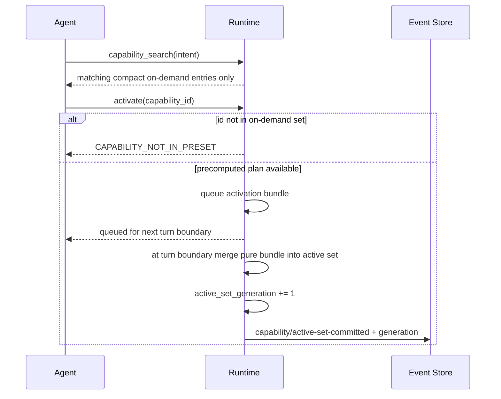

# Capability 目录与 Agent Preset 产品模型

## 1. 产品目标

以后所有 Agent 场景不只选择模型，而是选择一份版本化 Agent 设定。用户看到的是用途明确的 Agent；系统内部把设定编译为 `RuntimeProfile`、能力、typed resource bindings、上下文和预算，并统一采用 FullAuto 执行。

产品入口只提交：

```text
scene
principal
agent_preset_id / revision policy
resource bindings
user overrides
```

入口不直接拼 `system_prompt + skill ids + browser bool + knowledge ids + MCP ids + extra`，也不选择执行内核。v2 产品固定使用单一 Codex-derived Agent Runtime；Preset 的直接选择面只有 Capability、Skill 和 typed resources，不描述 Package、Service、裸 MCP Tool 或“由哪个运行时执行”。

v2 的全局优先级固定为：交付速度第一、逻辑简单第二、可验证的产品效果第三。只保留五个必要的同步边界：请求 principal/业务 ownership、Snapshot capability allowlist、typed resource binding、Remote ingress authentication、Provider credential centralized storage。它们在现有请求、Runtime dispatch 或领域服务边界直接检查，不引入额外持久状态机。

第一方与第三方普通插件采用同一模型：进入 mount inventory 即视为 trusted code，统一在 NomiFun 进程内运行。Capability/Preset 决定 Agent 看见和调用哪些组合，领域服务继续用 principal/ownership 与资源绑定防止普通业务误路由；这些边界不承诺阻止已 mounted 插件直接访问宿主进程能力，也不伪装成恶意插件隔离。

Codex sidecar 是唯一进程边界例外：它属于固定 Agent Runtime 的部署形态，用于隔离依赖、崩溃与升级节奏，不属于普通插件执行模型，也不代表 sidecar 中的代码是不可信代码。

**D-015 已确认采用方案 A。** 规范化语义 `SessionEvent + bounded payload` 是 Session 执行与产品历史的唯一事实；`session_heads/message_projection` 只是可删除、可全量重建的查询/UI 投影。Codex rollout/checkpoint 是绑定 exact Snapshot 和 event cursor 的可丢弃 Runtime cache，缺失或损坏时可丢弃；版本不匹配时先执行 D-025 exact compatibility admission：完整兼容原 Snapshot 才从原 Snapshot/Event 重建，否则原 Session 在当前执行栈下只读，不成为第二事实源，也不开发 checkpoint converter。

**D-016 已确认采用方案 A。** 首个 v4 Stable 只冻结并由 bundled first-party Package 与 CI/test-only `sample.echo` 共同 dogfood vendor-neutral Package contract；它不交付生产用户 Package loader、公开 SDK、动态 discovery、URL 安装、市场、分发、更新、hot reload、compatibility shim 或第三方数据库 migration。整体 Stable 且 Nomi Runtime 删除后，Phase N1 才开放本地 managed Package MVP；第二 SDK、调试/更新/状态兼容和市场按依赖顺序后置。整个 Phase N 继续遵守 trusted in-process 模型，不增加 sandbox、签名或插件权限平台。

**D-017 已确认采用方案 A。** owner 在本地 Remote/连接管理页创建最小 `RemoteBinding`，它只增加 id/owner/name 并嵌入唯一 canonical `AgentBindingValue`；认证 token 与 Binding 独立。REST/MCP 只适配 `open/turn/observe/cancel` 四个 canonical 操作，`open` 返回 exact `agent_session_id: AgentSessionId`，所有后续调用显式提交同一个 `agent_session_id` 并复用 SessionEvent cursor/idempotency/error 主链。Binding 更新只影响新 AgentSession，既有 AgentSession 的 Snapshot 永久冻结；Remote 不是 Agent、Preset、RuntimeProfile、权限模式或全局 Capability Registry 旁路。

**D-018 已确认采用收窄方案 A。** `chat.minimal` 通过 exact-empty Snapshot、最终 `tools=[]` 与正向最小构造证明没有隐藏 Coding/插件初始化；`coding.codex` 通过完整 Capability/Runtime feature/原生 Responses 清单和正常功能 conformance 证明不退化。本次不建设 tokens/bytes、TTFT/E2E latency、cold/warm、P50/P95、request distribution、baseline/benchmark、reference runner 或统计 Coding corpus 的 schema、API、UI、测试、SLO、性能 RC 或 ROM 工作包；D-020 不依赖任何性能数据。

**D-020 已确认采用方案 A。** migration canary 只存在于内部协调器，按 Session sticky，绝不进入 AgentPreset、AgentBinding、RemoteBinding、Session 产品 schema/API/UI；有副作用的 Turn 只有一个 primary 真执行。每个 Domain Wave 先按 D-027 停止 Nomi admission：无 accepted operation 的 Session 立即执行 `cancel → dispose → kill descendants → zero → D-024 delete`，fence 前已经 durable accepted 的 operation 只运行到自身与全部祖先既有 finite deadlines 的最小值；到期执行 `cancel → dispose → kill descendants → uncertain handoff → zero → D-024 delete`并证明 outstanding-set=0，再在同一 Wave 删除 Nomi wiring。全场景 Codex-only 门禁与全局 zero gate 通过后，才在 RC 前物理删除全部剩余 Nomi code/session/shim/dependency，再从删除提交生成 Nomi-free RC。Stable 直接提升同一 artifact digest。删除后只允许兼容 v4 Host/pinned Codex sidecar、exact Preset/model route rollback 或 forward fix，不恢复 Engine selector、Nomi/pre-v4 binary、fallback、旧 bundle 或 D-013 archive。

**D-021 已确认采用改良方案 A。** canonical 产品与执行身份统一为 `AgentSessionId(UUIDv7)`，`AgentSession` 是唯一 aggregate。不存在第二个产品容器、双 ID、映射关系或 opaque session handle；内部代码只使用 `AgentSession`，本地 API 只使用 `/api/agent-sessions`，数据库只使用 `agent_sessions`。中文 UI 文案统一为“会话”，英文 UI 只使用 “Chat” 或 “Session”；技术类型、表、ID、关系、API 与新架构命名中的 `Conversation` 残留必须为 0。

**D-022 已确认采用方案 A。** Agent Editor 的 Test 只是客户端对普通 Save Revision 与 AgentSession API 的顺序编排，不是 backend mode。dirty draft 必须先通过 canonical Revision API 保存为普通、可见、不可变 Revision；clean editor 直接复用当前已保存 Revision。只有保存/resolve 成功后，客户端才以该 exact `PresetRevisionRef + ResolvedSnapshotRef + typed resource bindings` 普通调用 `POST /api/agent-sessions`，创建普通持久 `AgentSession`；后续输入、FullAuto Tool/Effect、SessionEvent、EffectReceipt、Runtime binding、历史与生命周期全部走生产主链。保存失败不得创建 Session。不得增加 test-only schema/type/route/table/flag、隐藏 Revision、disposable resource、`DraftSnapshot` 或 ephemeral execution；Test Session 的删除与保留只服从 D-024 的统一 Session 决策。

**D-023 已确认采用改良方案 A。** 七个官方模板遵守“角色能力完整、初始上下文最小”策略：`chat.minimal` 保持 exact-empty，`coding.codex` 保持完整 Codex-native Coding surface；伙伴模板的默认能力并集必须包含常用 Persona、Knowledge、Memory 与 IM/连接能力，其他业务模板也必须覆盖各自正常工作所需的角色能力。本文不把调研阶段列举的候选 CapabilityId 或 initial/on-demand 分区写成产品契约；实施 G0 必须从 checked-in first-party contribution manifests 冻结版本化 `OfficialPresetSeedManifest`，把七模板的 target exact ID/version、initial/on-demand、Skill、typed resource defaults 与角色覆盖作为后续 materialization 的目标合同，而不是等待所有 handler 已完成后反向推断。具体清单和分区不再逐项请求产品审批；只有偏离上述策略或七模板边界时才升级决策。用户 fork 官方模板后，可以从已安装且兼容的 Capability Catalog 把未预置能力加入 initial 或 on-demand，并保存为新的 immutable Revision；运行中的 Agent 仍只能激活其 frozen Snapshot 已包含的 on-demand ceiling，不能自行从 Catalog 扩大能力。

**D-024 已确认采用方案 A。** 普通、Test、Remote、Coding 与所有业务入口创建的 `AgentSession` 使用同一幂等删除主链：删除开始先以 SQLite transaction 将 live row CAS 为临时 durable `deleting` admission fence，从该 commit 起拒绝新 Turn、activation、resume、observe、fork、restore 与 Runtime append；随后 cancel/quiesce Runtime，等待 task/process/lease/`CapabilityInstanceHandle`/`ResourceHandle` 全部归零，再删除该 Session 的 Event、payload、Projection、消息、附件、Runtime binding、checkpoint 与 Session-owned resources；最后才把 row 原子收缩为只含 `agent_session_id + owner_ref + state=deleted + deleted_at` 的不可恢复 tombstone。首次成功取得 fence 的 DELETE 等待闭包完成并返回 tombstone；fence 后的重复 DELETE、迟到 callback/ACK 与其他操作统一幂等返回 `SESSION_DELETED` 且不能复活 Session。owning plugin/domain 已发生的真实 Effect、idempotency、receipt/reconciliation、业务记录与 outbox 不级联，只能保留到 tombstone ID 的最小来源引用，不能保留已删除 Session 内容。本期不建设 retention、restore、legal hold 或 test-only lifecycle。

**D-025 已确认采用方案 A。** 未删除 Session 的历史保持可读；每次 resume/new Turn 前对 frozen Snapshot 的完整 initial + on-demand ceiling、Package/Capability/Skill/MCP schema、Runtime protocol/native feature、model route/config 与 typed resource contract 做 exact compatibility admission。通过时可丢弃不匹配 checkpoint 并从 canonical Event 重建新 Runtime binding，继续原 `AgentSessionId`；结构不兼容时返回 `SNAPSHOT_EXECUTOR_UNAVAILABLE`，不得自动 upcast、重新 resolve、隐式 rebind 或降级 Coding。继续工作只能显式 fork 新 `AgentSessionId`，使用自包含有界语义上下文；不复制 transcript/Runtime-private handle，不迁移 active Turn，不重放 Tool/Effect。

**D-026 已确认采用方案 A。** Installation credential 的 rotate/revoke 以同一 SQLite request-admission transaction commit 为唯一 fence：fence 前已经 admission-committed 的请求按原幂等键完成，fence 后所有 missing/old/revoked/stale credential 的新请求或 transport operation 统一返回 `REMOTE_AUTH_REQUIRED`（REST `401`，MCP 同 code）。撤销或轮换不 cancel、删除、改绑或改变任何 opening/ready/in-flight AgentSession；replacement 仍属于同一 owner，只有携带新 credential 并显式提交原 `agent_session_id` 才能继续既有 Session，不存在 credential ID、latest-token、connection 或 recent-Session 推断，也不保留旧 credential provenance。

**D-027 已确认采用方案 A。** Internal canary 中的 Nomi Session 是 disposable migration fixture；它不增加 Session 级 `drain_deadline`。没有 durable accepted operation 的 Session 在 stop-admission 后立即执行 `cancel → dispose Runtime → kill descendants → zero handles → D-024 delete`；fence 前已提交的 Turn/operation 只在原 sticky Runtime 内运行到自身与全部祖先原有 finite deadlines 的最小值，缺少或已过期 deadline 时立即进入 `cancel → dispose → kill descendants → uncertain handoff → zero → D-024 delete`。只有 active Session/Turn/Tool/Effect dispatch/process/lease/resource outstanding-set 全为 0，才允许删除对应 Nomi wiring 或生成 Nomi-free RC；不迁移 Runtime、不无限等待、不引入用户审批或产品 lifecycle 状态。

**D-028 已确认采用分层方案 A，并采用 Windows-first whole-candidate native handoff。** Required host cells 固定为 Windows x64 Desktop、macOS x64/arm64 Desktop、Linux x64 Desktop/Headless；所有本地 cell 都必须提供完整 `coding.codex`，其他平台与 Capability availability 边界保持既定合同。C1～C7 先在 Windows 连续完成全部功能；跨平台代码可以同期开发，但其他四格只累计 `PlatformVerificationPoint` 并保持 `pending_native_verification`，单个 Capability/feature/module/point 不触发暂停，cross-compile/静态/VM/模拟器/Rosetta 不能判 pass。完整 Windows pre-candidate 全功能/pre-version Gate 后才 HP-1；整个 macOS arm64 candidate 全部适配/native Gate 后才 HP-2；随后 macOS x64、Linux Desktop x64、Linux Headless x64 三个 whole-candidate 原生任务并行。HP-1/HP-2 是计划内平台交接；后续必要换机只允许在一整轮验证全部返回、shared fixes 合并且新 cohort tuple 冻结后，由 `C8-RECHECK-n` 启动 whole-cohort 五格批次：affected full Gate + unaffected native scoped attestation；只对尚不可用的 Host 一次提醒，绝不按 Capability/feature/module/单修复换机。这些工程通知不新增产品审批或状态机。

**D-019 已确认采用方案 A。** 实施采用五条稳定 owner workstream、默认 6–8 个并行 coding agents、disjoint write manifests、单一 shared integration/release owner、slice/wave staged commits 与 repo-local targeted gates；gross ROM 的唯一规划基线为 **213 / 314 engineer-weeks（P50/P80）**。这是实施期滚动 ETC 基线，不是日历承诺或 D-018 性能测量。设计文档完成并经用户审阅后才进入 G0 Contract Closure；本文不另建第二套工作流、ROM 或阶段编号。

## 2. 统一术语

### 2.1 Codex-derived Agent Runtime

v2 只有一个生产执行内核：基于固定 Codex 源码版本二次开发的 Codex-derived Agent Runtime。它负责 turn/step、模型请求、工具协议、steer/cancel、compaction、恢复和运行时事件；它不是用户可选择的产品对象，也不是 Capability。

这里的 Codex-derived 表示复用并改造 Codex 的 Rust Thread/Turn、tool loop、stream、compaction 和 persistence contracts，不表示把原版 Codex CLI、默认 Coding Prompt 或全部内建能力原样注入所有场景。当前 Nomi Agent Runtime 在替换验收完成后整体退出生产路径，不与新 Runtime 长期并存。迁移期只有 D-004 的内部 baseline/replay/canary adapter 可以独立保留；它不构成 v4 产品兼容层，不暴露旧 API、不读取 pre-v4 archive，并由 D-020 的最终门禁删除。

Agent Preset 不保存任何执行实现选择字段或实现配置，产品 UI 也不提供运行时选择器。Snapshot 只冻结所需协议与 feature inventory contract；系统发布清单记录可部署 build，而某个 Session 实际绑定的 Runtime build ID 只写入 `runtime/bound` Event，checkpoint 只引用该 Event，不在 Preset、CompiledRuntimeProfile、Snapshot content 或 checkpoint binding 中复制。升级 Runtime 属于平台版本发布，不属于用户编辑 Agent 设定。

产品中的“Agent”是 Agent Preset 编译后的运行实例；“System Agent”若保留为用户文案，只表示 NomiFun 随产品发布的内置 Agent Preset，不与 Runtime 同义。Pi 与 DeepSeek Harness 仅作为实现思想、测试用例和技术研究参考，不形成 v2 架构实体、Preset 字段、发布物或生产适配范围。

### 2.2 Capability Package

代码分发与 mount 单元，可以包含多个 Capability、UI contribution、Skill、MCP 映射、Preset 模板与资源。Package 经 `PluginHost` mount/register 后物化这些目录项；Agent Preset 不选择 Package。所有普通 Package 都作为进程内 trusted code 加载，使用同一入口和同一执行路径。

### 2.3 Capability

最小可治理系统能力。Capability 不一定直接形成模型 Tool，也可以是 context contributor、resource provider、turn middleware、event consumer、transport、scheduler 或 UI contribution。

Capability Package 可以声明 `requires_runtime_features` 和 Capability 依赖，但不能把 Runtime 本身作为 Agent 可动态申请的普通能力。兼容性判断只回答“当前固定 Runtime build 是否提供所需 feature/ABI”，不进行多运行时选择。

### 2.4 Skill

任务方法、工作流说明和领域知识。Skill 可以声明 `requires_capabilities`，但 Resolver 只做子集校验：所需 Capability 必须已经被 Agent Preset 直接选择。Skill 不能自动加入、隐式启用或扩大 Capability allowlist。

### 2.5 MCP

外部工具和资源协议。每个对 Agent 可见的 MCP Tool 必须以 `server_id + canonical_tool_key + schema_hash` 唯一映射到一个 CapabilityId。Agent Preset 选择该 Capability，并通过 typed resource binding 指向 MCP server/connection；Preset 不直接选择 MCP Server 或裸 Tool。MCP manifest 只提供连接与模型工具契约，不能改变 Snapshot capability allowlist。

### 2.6 四层领域边界

四层只允许单向关系：

```text
Package --materialize--> Capability
        --materialize--> Skill --requires subset of--> Capability
        --materialize--> MCP Tool Mapping --maps exactly to--> Capability

AgentPresetRevision --selects directly--> Capability[]
                    --selects directly--> Skill[]
                    --binds--> TypedResourceBinding[]
```

- Package 负责代码、分发和物化目录项，不进入 Preset；
- Capability 是 Agent 功能组合的唯一原子单位；Codex native Tool 也必须直接成为 Capability；
- Skill 只提供方法，不提供执行能力；
- MCP Tool 只有完成 canonical Capability 映射后才能进入 Agent；
- `ServiceKey<T>` 仅连接 Package 实现，不是第五层领域对象，不进入 Capability Catalog、Preset UI/API 或 Snapshot selection；
- 不存在独立 `RuntimeContribution`、Service Catalog、Provider/Consumer graph 或运行时二次求解层。

### 2.7 Agent Preset

用户可理解的版本化组合配方。产品中文统一建议为“Agent 设定”。

### 2.8 Resolved Agent Snapshot

某次 AgentSession、Cron、Companion、Robot、Customer Service 或 AgentExecution 真正运行的不可变锁定结果。

### 2.9 FullAuto 与固定执行范围

v2 只有一种 Agent 执行语义：FullAuto。系统不保存其他执行模式或运行时放行状态；v4 canonical schema、DTO、配置、API 和 UI 从第一天起都不包含 legacy mode alias、approval/confirmation 字段、兼容开关或 deprecated 默认值。

所有必要检查都是同步、无状态或读取现有产品事实：Runtime 查 Snapshot allowlist，领域服务查 principal/ownership 与 typed resource binding，Remote 入口查现有认证信息，Provider 调用读取集中存储的连接配置。当前不新增空 enum、port、表、manifest 字段或状态机，也不保留 pre-v4 mode/approval 配置的 reader、writer、alias 或 facade。

Agent Preset 在启动前冻结 `capability allowlist + typed resource bindings + execution constraints`。组合内调用全部自动执行；组合外、缺包、Provider drift、ownership 或资源不匹配直接结构化失败。外部生命周期资源通过 lazy `CapabilityInstanceHandle` 持有 `ResourceHandle`，不在 activation transaction 获取。

### 2.10 Thin Kernel 固定清单

AgentPreset/Capability 平台的 Thin Kernel 只包含以下固定职责：

1. 显式 Package mount inventory、exact dependency 排序和唯一 `PluginHost` 注册入口；
2. Capability Catalog、AgentPreset/Revision、Resolver、`CompiledRuntimeProfile` 与 Resolved Snapshot；
3. 单一 Codex-derived Runtime adapter，以及 Thread/Turn、stream、steer/cancel、compaction、tool protocol、on-demand compact index/turn-boundary activation 和 Runtime event mapping；
4. Model Resolver、Provider credential centralized storage、connection config revision 与模型调用入口；
5. 五项最小同步边界：principal/ownership、Snapshot capability allowlist、typed resource binding、Remote ingress authentication、Provider credential centralized storage；
6. Agent Session identity、规范化语义 SessionEvent/bounded payload 顺序追加、同事务 projection、commit ACK、EffectReceipt、cursor/idempotency，以及 D-024 tombstone fence、统一删除协调和 Runtime 创建的 CapabilityInstanceHandle/ResourceHandle 清理；
7. 精简的 typed service registry，仅用于 Package 实现 wiring，不形成 Service 领域目录、Preset 选择项或业务编排层。

该清单是封闭集合。Chat 产品能力、Files、Workspace、VCS、Process、Terminal、SSH、Knowledge、Memory、Skill、MCP、Browser、Computer、Requirement、AutoWork、Cron、IDMM、AgentExecution、Companion、IM、Customer Service、Robot、Creation、Workshop、Office、MiniApp、Notification、Remote transport 以及未来业务域都不是 Kernel。它们统一作为 trusted in-process Package 注册 Service 与 Capability contributions。

Host 的数据库、HTTP server、应用启动和桌面壳属于通用应用基础设施，不因被 Kernel 使用就成为 Agent Kernel 业务职责。Kernel crate 不得直接依赖任何上述业务 crate，也不得持有其 repository/service concrete type。

## 3. Capability 类型

第一版至少支持：

| Kind | 说明 | 示例 |
|---|---|---|
| `tool` | 模型可调用动作 | `knowledge.search`、`fs.patch` |
| `context_contributor` | 静态或动态模型上下文 | Persona、Memory 摘要 |
| `resource_provider` | 受控资源句柄 | Workspace、KB、Browser Lane |
| `event_source` | 产生域事件 | Channel inbound、Cron trigger |
| `event_consumer` | 处理域事件 | Webhook notification |
| `turn_middleware` | 请求前后行为 | RAG、IDMM observation |
| `transport` | 外部/本地协议 | MCP、IM、Remote REST |
| `scheduler` | 时间或队列触发 | Cron、AutoWork |
| `background_service` | Session 外长驻服务 | Browser Host、Robot link |
| `ui_contribution` | 声明式配置与状态展示 | 能力设置卡、运行状态 |

## 4. Package、Capability、Skill 与 MCP Schema

### 4.1 Package Manifest

Package 是 mount 与启用单位。所有 Package/Capability/Skill/MCP declarative manifest 使用 canonical strict RFC 8259 JSON，并由 canonical JSON Schema 校验；拒绝 JSON5、注释、trailing comma、legacy alias 和未知字段。v2 Manifest 只保留装载和组合所需字段：

```rust
struct PackageManifest {
    schema_version: Version,
    host_contract_version: Version,
    package_id: PackageId,
    package_version: Version,
    display: LocalizedMetadata,
    package_dependencies: Vec<ExactPackageDependency>,
    requires_runtime_features: Vec<RuntimeFeatureRequirement>,
    config_schema: JsonSchema,
    provides_services: Vec<ServiceDeclaration>,
    requires_services: Vec<ExactServiceRequirement>,
    entrypoint: InProcessEntrypoint,
    contributions: PackageContributions,
}

struct PackageContributions {
    capabilities: Vec<CapabilityManifest>,
    skills: Vec<SkillDefinition>,
    mcp_tools: Vec<McpToolCapabilityMapping>,
    preset_templates: Vec<AgentPresetTemplate>,
    host: Vec<HostContributionDescriptor>,
}

struct PluginRegistration {
    manifest: PackageManifest,
    mount_id: PluginMountId,
    source: PluginSourceMetadata,
    implementation: Arc<dyn InProcessPlugin>,
}

struct PluginSourceMetadata {
    source_kind: OpenPackageSourceKind,
    source_identity: String,
}
```

`PackageId`、`PluginMountId` 和 entrypoint profile 都是开放字符串/newtype，不存在 `FirstPartyPackage`、`BuiltinPluginKind` 或按内置业务枚举分支的注册 API。exact Package version 由 Manifest 提供；`PluginSourceMetadata` 只补充来源 identity 与诊断 provenance，不承载权限、风险、签名或执行语义。Stable 只允许 `bundled` 与隔离的 `test-fixture` 来源，Phase N1 再增加 managed-local 来源。当前 built-in Package 与 sample fixture 也必须构造同一个 `PluginRegistration`。

Stable 冻结的是语言中立的 entrypoint envelope 和 exact `host_contract_version` 检查，不是公开 Rust ABI 或 JavaScript Host API 承诺。Phase N1 只支持一个 executable entrypoint/SDK profile；Rust dylib 与 embedded JavaScript/TypeScript 由 Stable 最终 Host 上的有界 spike 再二选一，不能为同时支持两者提前引入第二套 loader 或 adapter。

Package 注册成功后，`PluginHost` 将 `capabilities/skills/mcp_tools` 物化为对应目录记录；`preset_templates` 只是创建 Preset Revision 的输入模板，保存 Revision 时必须展开为直接选择项；`host` 只用于普通业务 HTTP/UI/background contribution。Package 不能贡献或替换 Agent Runtime。当前 mount inventory 的增加、替换和移除随应用构建/启动配置生效，并在重启后重新加载。

### 4.2 Capability Manifest

Capability Manifest 是经过 canonical schema 校验的 strict JSON，不执行任意代码：

```rust
struct CapabilityManifest {
    id: CapabilityId,
    version: Version,
    kind: CapabilityKind,
    package: PackageRef,
    display: LocalizedMetadata,
    requires: Vec<ExactCapabilityDependency>,
    conflicts: Vec<CapabilityConflict>,
    supported_surfaces: Vec<AgentSurface>,
    requires_runtime_features: Vec<RuntimeFeatureRequirement>,
    supported_platforms: Vec<PlatformConstraint>,
    config_schema: JsonSchema,
    contributions: CapabilityContributions,
}
```

### 4.3 Skill Definition

```rust
struct SkillDefinition {
    id: SkillId,
    version: Version,
    package: PackageRef,
    display: LocalizedMetadata,
    body_ref: SkillBodyRef,
    resources: Vec<SkillResourceRef>, // references/templates/examples/scripts
    requires_capabilities: Vec<ExactCapabilityDependency>,
    supported_surfaces: Vec<AgentSurface>,
}
```

`requires_capabilities` 不参与依赖闭包扩张。Resolver 逐项检查它是否已存在于 Preset 的直接 Capability selections；缺失即编译失败，并返回需要用户补选的 CapabilityId。Skill 可以携带 references、templates、examples 和 script 文件；script 只是模型可读/可引用的资源，只有 Agent 已选择 Shell/Process/专用 Capability 时才能显式执行。Skill 不能携带自己的 Tool executor、自动执行 hook、MCP connection 或隐藏 Capability binding。

### 4.4 MCP Tool Capability Mapping

```rust
struct McpToolCapabilityMapping {
    package: PackageRef,
    server_id: McpServerId,
    canonical_tool_key: CanonicalMcpToolKey,
    schema_hash: Digest,
    capability_id: CapabilityId,
}
```

v2 采用一 Tool 一 Capability 的 canonical 映射。`server_id + canonical_tool_key` 在当前 inventory 中唯一，且 `capability_id` 必须指向已物化 Capability。MCP schema 变化会使旧映射失效，只有重新物化目录并创建新 Preset Revision/Snapshot 后才能使用；运行时不会把新发现 Tool 自动加入当前 Agent。

### 4.5 进程内注册契约

普通 Package 只实现一个统一的进程内注册入口：

```rust
trait InProcessPlugin: Send + Sync {
    fn register(
        &self,
        registrar: &mut PluginRegistrar,
        context: &PluginContext,
    ) -> Result<(), PluginLoadError>;
}

struct PluginContext {
    package_id: PackageId,
    mount_id: PluginMountId,
    source: PluginSourceMetadata,
    config: ValidatedJsonConfig,
    state: HostPluginStateApi,
    services: DeclaredServiceView,
    host_ports: DeclaredHostPortView,
    commands: TypedCommandPort,
    domain_outbox: DomainEventOutboxPort,
    cancellation: CancellationHandle,
    tasks: ManagedTaskRegistrar,
}

struct PluginStateNamespace {
    package_id: PackageId,
    mount_id: PluginMountId,
    scope_key: PluginStateScopeKey,
    state_key: PluginStateKey,
}

trait HostPluginStateApi {
    async fn get(&self, scope_key: &PluginStateScopeKey, state_key: &PluginStateKey) -> Result<Option<StateEntry>, PluginStateError>;
    async fn set(&self, scope_key: &PluginStateScopeKey, state_key: &PluginStateKey, value: BoundedJson) -> Result<StateRevision, PluginStateError>;
    async fn delete(&self, scope_key: &PluginStateScopeKey, state_key: &PluginStateKey) -> Result<bool, PluginStateError>;
    async fn compare_and_swap(&self, scope_key: &PluginStateScopeKey, state_key: &PluginStateKey, expected: StateRevision, value: Option<BoundedJson>) -> Result<CasOutcome, PluginStateError>;
}
```

`PluginHost::mount(registration, config_json)` 先把 `config_json` 作为 strict JSON 用 `PackageManifest.config_schema` 校验，再以 `(package_id, mount_id)` 派生唯一 config namespace，并把每个状态值固定在 `(package_id, mount_id, scope_key, state_key)` 四元 `PluginStateNamespace`，最后向插件提供受声明约束的 `PluginRegistrar + PluginContext`。`PluginRegistrar` 只能登记 Manifest 已声明的 contribution/service/route identity，不能暴露 root Host mutation。`package_id/mount_id` 由 Host 注入，插件只能通过 `PluginContext` 的窄 Host ports 选择自己的 `scope_key/state_key`，不能跨 Package 查询、打开数据库、自定义 namespace，或取得 root Registry/Session/Model/EventBus、`AppServices`、`GatewayDeps` 与任意 service locator。`get/set/delete/compare_and_swap` 四项是 Stable contract 必选方法，不能把 CAS 降级为 optional extension。Stable state 是 bounded strict-JSON KV，不发布第三方状态迁移 SDK 或兼容层。

Package Manifest 永远不声明第三方数据库 migration。只有随产品构建、由 Kernel v4 runner 注册的 bundled first-party append-only migrations 可以修改 canonical v4 schema；`sample.echo` 与未来第三方 Package 只能通过上述 Host state API 使用自己的四元 namespace。Phase N2+ 若增加 state migration，也只能在 Host state API 内做受版本约束的 per-Package state callback，不能演化为第三方 SQL/DDL 或 manifest-driven migration platform。

`PluginRegistrar` 接收 exact service、Capability、Tool、Context、Event 和 UI contribution 的声明。built-in、sample fixture 与未来第三方 registration 使用同一个 materializer，不存在内置专用 `match` 分支。Package 间服务只使用稳定的 typed key：

```rust
registrar.provide(ServiceKey<T>, Arc<T>)
context.services.require(ServiceKey<T>) -> Result<Arc<T>, MissingService>
registrar.contribute(CapabilityId, Arc<dyn CapabilityFactory>)
```

一个 `ServiceKey<T>` 在当前 Host generation 只能有一个 Provider；缺失、重复或 version 不匹配都在启动时失败。不做 Provider 自动择优、运行时替换或隐式 fallback。Package 只能通过 `DeclaredServiceView` 获得已声明的 service dependency。

`registrar.contribute` 注册的是 factory 和 metadata，不在 Host 启动时创建所有 Agent Tool。Resolver 选中 Capability 后，Runtime 才以最小激活上下文创建 contribution：

```rust
struct CapabilityActivationContext {
    principal: Principal,
    snapshot: Arc<ResolvedAgentSnapshot>,
    resource_bindings: TypedResourceBindings,
    services: DeclaredServiceView,
}
```

`DeclaredServiceView` 只解析该 Package Manifest 已声明的 `requires_services`，避免重新出现全量依赖袋。这里是结构约束而非恶意插件隔离；trusted plugin 仍在进程内执行。

RuntimeProfile 决定哪些 Agent-facing contributions 对某个 Agent 可见。任何 Tool、Context、MCP projection、turn middleware 或 Agent background action 都必须带 CapabilityId，并且存在于当前 Snapshot allowlist；普通业务 HTTP/UI contribution 可以是 host-only，但仍由 Package 经 `PluginHost` 注册。第一方与第三方使用同一入口，不维护两套 ABI 或部署逻辑。

插件实例默认是进程级单例；确实需要会话状态的 contribution 自行以 `session_id/resource_id` 建立状态，并在 Session 结束通知时清理。v2 不抽象通用 Provider/Consumer graph、deployment matrix 或热卸载事务。mount inventory 变化后重启应用，是更简单且可调试的确定性边界。

远程 HTTP/MCP 只是进程内插件访问的外部资源，不形成另一种插件代码部署类型。Codex sidecar 仍是固定 Runtime 的特殊部署，不通过 Package Manifest 注册。

### 4.6 Trusted in-process 边界

安装普通插件等同于允许其代码进入 NomiFun 进程。v2 只有这一种普通插件执行方式；插件来源提示、版本信息和启用状态只是产品信息。

Snapshot allowlist 与 typed resource binding 仍然约束模型通过 Runtime 发起的调用，现有领域服务仍然校验 principal/ownership；但这些检查不用于对抗 trusted plugin 本身。若未来需要运行不可信第三方代码，应作为独立架构需求重新设计。Codex sidecar 是固定 Runtime 的部署例外，不进入普通插件 Manifest。

### 4.7 Dependency

当前阶段只支持四种直接关系：Package dependency、exact Service dependency、Capability `requires` 和 Capability `conflicts`。所有依赖使用 ID + exact version；环依赖直接作为编译错误。

不实现 `requires any`、替代提供者、recommends、条件依赖 DSL、依赖评分或 Provider 自动择优。surface、platform 与 Runtime feature 使用 Manifest 顶层字段过滤，不再创建第二套依赖表达式，也不跨 Package 安装目录、Skill 目录或 MCP discovery 结果执行全局求解。

### 4.8 Capability 组合与资源绑定

Capability Binding 只需描述 Runtime 组装所需信息：

- 是否进入当前 Agent 的可见集合；
- 属于 `initial_capabilities` 还是 `on_demand_capabilities`，以及 Tool exposure；
- contribution 配置；
- 业务资源引用，例如 workspace、KB、companion、robot、MCP server；
- action/tool allowlist 与目标路由；
- call count、cost、deadline、rate limits 和资源清理。

这些字段用于生成模型可见 Tool/Context、把调用路由到正确业务对象并控制运行成本。模型调用未进入组合的能力时，Runtime 返回结构化失败。

Runtime 在调用前同步检查 Snapshot allowlist、principal/ownership 与 typed resource binding；领域服务收到调用后复用同样的业务身份和资源 ID。进程内 trusted plugin 在技术上仍可绕过 Runtime 直接调用其持有的宿主依赖，v2 对此不做额外承诺。

### 4.9 D-016 A：第三方扩展冻结与 Phase N 分期

D-016 已确认采用“Stable 只冻结可验证扩展缝，Phase N 本地优先、逐期开放”的方案 A。当前 schema 和 `PluginRegistration` 不把 PackageId 写成第一方 enum，也不让 contribution materializer 区分 built-in/third-party。Capability/Skill/MCP API 始终返回统一 source metadata；AgentPreset Resolver、编辑器、Snapshot、Runtime invoke 与 Event/Effect 不按来源改变行为。

**首个 v4 Stable 必须完成：**

1. 冻结 vendor-neutral `PackageManifest`、`PluginRegistration`、`PluginConfigSchema`、四元 `PluginStateNamespace`、`PluginSourceMetadata`、Capability/Skill/MCP materialization 与 source-neutral invoke contracts；这里的冻结是仓内唯一 canonical contract 与 conformance，不是公开 SDK/ABI 或跨版本兼容承诺；
2. 所有 bundled first-party Package 通过同一 registration/config/state/materialization/start/stop 路径 dogfood；不得保留 built-in-only parser、config UI、state store、route merge、Capability injection 或 invoke shortcut；
3. CI/test-only `sample.echo` 通过同一链完成 config、四元 state、Capability/Skill/MCP materialization、Preset Preview/Save、真实 Runtime invoke、SessionEvent/EffectReceipt、restart 与 fault 测试；Agent Editor Test 也只能按 D-022 的普通 Save Revision → `POST /api/agent-sessions` 顺序进入该主链；
4. production 中 user Package loader、public SDK/scaffold、任意目录扫描、dynamic discovery、URL/remote install、marketplace/listing/publisher、download/distribution/update、hot reload、compatibility shim/support matrix、third-party DB migration 的实现、表、API、route、UI、bundle 和依赖边精确为 0；
5. production mount inventory 只来自应用编译/启动时显式提供的 bundled registrations；测试构建可以额外注入 sample fixture，但它不得进入 production inventory、数据库 seed、模板库、API 或普通 UI。

**整体 Stable、Nomi Runtime 删除和上述 contract gate 完成后的 Phase N1：**

- 用户显式选择本地目录或压缩包，校验后安装到唯一 managed Package root；不扫描环境变量、legacy user dir、任意 AppData 目录，不接受 URL/remote repository；
- install、enable、disable、exact-version replacement 与 uninstall 只修改下一次启动的 mount inventory，应用重启后生效；不做 hot reload、运行中 unload 或跨插件补偿事务；
- 同一 `config_schema` 驱动默认值、Host 校验和 schema-generated 配置表单；config 使用 `(package_id, mount_id)`，state 只使用四元 Host namespace；
- materialized Capability/Skill/MCP 与非官方 authoring template 进入现有目录和单页 Agent Editor，沿用 Preview/Save Revision、Snapshot、Runtime、SessionEvent/EffectReceipt 主链；Agent Editor Test 沿用 D-022 已冻结的普通 Save Revision → AgentSession 顺序，不增加第三方插件测试旁路；
- 发布一个正式 executable entrypoint/SDK profile、schema/types、validator、scaffold、reference Package 与 conformance runner；Package 必须声明 exact `host_contract_version`，不匹配即在 mount 前返回 typed failure；
- 安装界面只明确说明“安装即信任该代码在 NomiFun 进程内运行”，不展示或保存 permission checklist、risk score、signature、approval 或可续期授权状态；
- 不提供 Marketplace、在线搜索、远程下载、自动依赖获取、自动更新、评分、发布者后台或长期 compatibility promise。

**Phase N2+：**先根据 Phase N1 的真实 Package 数据增加第二 SDK/entrypoint profile、调试工具、exact dependency 获取/更新、Host state migration callback、兼容/弃用/support matrix；这些稳定后才建设独立的 Package catalog/market、publisher、discovery、distribution 与 update channel。市场永远归“插件”导航，不恢复“设定市场”或 SkillHub。即使进入后续期，普通插件仍是 trusted in-process code，不增加 sandbox、WASI/subprocess plugin host、签名链或插件权限平台。

Rust dylib 与 embedded JavaScript/TypeScript 的选择是 Phase N1 唯一保留的实现型子决策：在最终 Stable Host 上做有界 spike，只选实现/打包/跨平台验证成本更低的一种作为第一 profile。该 spike 不改变四层领域对象、Preset/Snapshot/Event/Runtime contract，也不允许反向进入当前 Stable critical path。

### 4.10 当前纵向切片验收

首批生产纵向切片固定为 `chat.minimal` 和 `coding.codex`。两者都必须从 built-in `PluginRegistration` 开始，经 common materializer、最终 AgentPreset schema、Resolver、Snapshot、Codex-derived Runtime、统一 SessionEventStore/event mapping 到真实模型调用；不得以 sample、mock Preset 或旧 Runtime 代替：

```text
mount PluginRegistration
  -> validate PackageManifest.host_contract_version/config_schema/source metadata
  -> create config namespace + (package_id, mount_id, scope_key, state_key) state namespace
  -> InProcessPlugin::register
  -> common Capability/Skill/MCP/host contribution materializer
  -> production capability_definitions + official templates
  -> single-page AgentPreset editor
  -> Resolver builds Snapshot
  -> Codex-derived Runtime starts Thread/Turn
  -> provider stream / Tool execution / EffectReceipt
  -> product UI receives normalized events
```

- `chat.minimal` 是零模型工具生产切片：最终 provider request 的 `tools` 必须为空，on-demand index 为空，不加载 Coding、Skill、MCP、Memory、Knowledge、Browser 或 workspace contribution；
- `coding.codex` 是完整 Coding 生产切片：使用 `coding.codex-native` 最终 expansion、production resource bindings 和同一个 Codex-derived Runtime，完整覆盖届时 Codex fork 实际支持的 Coding surface；exact CapabilityId/version 与 initial/on-demand 分区由 G0 冻结的 `OfficialPresetSeedManifest` 给出，本文中的能力类别说明不是候选 ID 契约；
- `sample.echo` 只存在于 CI/test 构建和隔离 test data root，用于证明 source-neutral mount/config/state/materialize/select/invoke/Event/Effect；它不能进入生产 inventory、official template、seed、API 返回或 UI。

fixture 必须同时贡献至少一个可调用 `sample.echo` Capability、一个可加载 instruction resource 的 `sample.echo-guidance` `SkillDefinition`，以及一个 deterministic test MCP Tool→Capability mapping，并提供 strict-JSON string `prefix` config；Capability、Skill、MCP 三类 contribution 缺少任一类即 fixture gate 失败。它还必须用 `get/set/delete/CAS` 和至少两个 `scope_key/state_key` 验证四元 namespace；测试使用最终 Package/Capability/Skill/MCP/Preset schemas 与同一个 materializer。禁止创建 `TestPreset`、`TestCapabilitySchema`、sample-only Resolver、sample Factory 或另一套 Runtime contract。本期不因此增加用户安装、SDK、Marketplace 或 dynamic discovery 工作。

### 4.11 Canonical v4 schema manifest

Contract Closure 后只有三类 canonical machine source：Rust contract types、fresh-v4
schema 与 SessionEvent Registry。Package/OpenAPI/IPC/error/Runtime schemas 由 Rust types
生成，数据库 digest 来自 fresh-v4 schema，Event digest 来自 Registry；三者共同生成
strict-JSON `CanonicalV4SchemaManifest`。本节代码块仅解释生成物 shape，不是第四份
source：

```rust
struct CanonicalV4SchemaManifestPayload {
    manifest_version: Version,
    database_schema_digest: Digest,
    package_schema_digest: Digest,
    official_preset_seed_manifest_digest: Digest,
    openapi_digest: Digest,
    ipc_digest: Digest,
    session_event_registry_digest: Digest,
    error_registry_digest: Digest,
    runtime_protocol_digest: Digest,
    confirmed_decision_contract_digest: Digest,
}

type CanonicalV4SchemaManifest =
    ArtifactEnvelope<CanonicalV4SchemaManifestPayload>;
```

`payload_digest` 只覆盖 canonical payload，明确排除 envelope 自身字段、运行状态、
evidence、日志与 summary。Rust/TypeScript projection、OpenAPI、test golden 与本文摘要都
是生成物或解释，不得各自手写成第二权威。`schema_metadata`、v4 ready marker、RC
artifact manifest 和 Runtime handshake 使用同一 payload digest。D-021～D-028 的
confirmed contracts 必须共同进入 `confirmed_decision_contract_digest`；canonical
manifest 不保存 unresolved decision、placeholder/default branch 或“以后再定”的字段。

## 5. Capability Catalog

下面是首版目录，不要求第一期全部实现，但要求 ID、边界和依赖方向一次设计正确。

本章所有 ID 都是 Package contributions，不是 Thin Kernel 内建业务分支。即使某个 Package 随 NomiFun 默认发布，也必须经过同一 `InProcessPlugin::register → PluginHost → Resolver → Snapshot` 路径；“built-in”只表示随产品分发，不表示可以跳过 Package/Capability provenance。

### 5.1 模型与媒体

```text
llm.realtime
llm.embedding
llm.rerank
llm.image.generate
llm.image.edit
llm.video.generate
llm.audio.tts
llm.audio.asr
llm.vision
web.search
web.fetch
citation.render
```

Chat model route、基础 reasoning 选择、Provider credential centralized storage、credential origin 和 config revision 属于 Thin Kernel/ChatModelBroker 固定清单，不作为 Agent Capability；Preset 只保存 model/connection config reference。Realtime、Embedding、Rerank、Image/Video/Audio 等额外模型产品能力由对应 Package 提供。

### 5.2 Chat、Session 与 Agent

```text
session.attachments.read
agent.delegate
agent.fork
agent.execution.plan
agent.execution.steer
agent.execution.observe
```

基础 AgentSession create/send/answer/stream/history/receipt 是 Thin Kernel 的 Session 事实与协议，不进入 Capability Catalog；只有附件、委派、计划等可选能力注册为 Capability。因此 `chat.minimal` 可以在正常 Chat 的同时保持两个 Capability 集合都为空。

Turn 的唯一运行权、幂等、取消、恢复和事件顺序属于 Thin Kernel；Chat 展示、附件与交互产品逻辑由 Chat Package 提供，但它不得创建第二个 Session aggregate 或身份。

### 5.3 Files、Workspace、Process 与 SSH

```text
fs.read
fs.search
fs.write
fs.patch
fs.delete
fs.watch
fs.snapshot
workspace.bind
workspace.artifacts
vcs.status
vcs.diff
vcs.stage
vcs.commit
vcs.push
process.exec
process.session
terminal.pty
ssh.connect
ssh.fs.read
ssh.fs.write
ssh.exec
ssh.sudo
```

Local 使用 `fs.* / process.*`，SSH 使用 `ssh.*`。Preset 直接选择所需 Capability，不通过抽象替代者或 Provider 自动切换在两套实现间求解。

### 5.4 Knowledge

```text
knowledge.search
knowledge.read
knowledge.write
knowledge.mount
knowledge.source.sync
knowledge.autogen
knowledge.embedding
knowledge.rerank
```

KB binding 使用强类型 resource ID、operations、grounding、write disposition、source provenance 和 per-turn token budget。

### 5.5 Memory

```text
memory.project.read
memory.project.write
memory.project.distill
memory.project.citation
memory.companion.recall
memory.companion.write
memory.companion.merge
memory.companion.evolve
memory.session.scratch
```

Project Memory 与 Companion Memory 不应继续因名称相同而被当作一个资源域；必须使用不同 namespace 和业务资源 ID，避免路由到错误的数据集。

### 5.6 Skills、MCP 与外部连接器

```text
skill.catalog
skill.describe
skill.invoke
skill.hooks
mcp.connect
mcp.tool_proxy
mcp.resource
mcp.oauth
connector.data.read
connector.data.write
```

Skill body 默认按需加载；Preset 直接保存 SkillId，Resolver 校验其 `requires_capabilities` 已全部位于直接 Capability selections。

MCP Server 配置或 discovery 更新时，由 MCP & Connectors Package 物化 `McpToolCapabilityMapping` 与对应 Capability catalog record。AgentPreset Resolver 不扫描 MCP Server、不连接所有 Server，也不从裸 Tool 列表动态生成能力；它只验证 Preset 已选择的 Capability 是否存在有效 canonical mapping、schema hash 和 typed server binding。

`mcp.connect/tool_proxy/resource/oauth` 是 MCP Package 自己提供的普通 Capabilities；每个业务 MCP Tool 另外拥有自己的 canonical CapabilityId。Snapshot 锁定 server identity、canonical tool key、schema hash、CapabilityId 与 connection config reference。schema/identity drift 时当前调用失败，更新 mapping 并创建新 Preset Revision 后再运行；新发现 Tool 不进入当前 Snapshot。

### 5.7 Browser 与 Computer

```text
browser.identity
browser.observe
browser.navigate
browser.act
browser.download
browser.upload
browser.evaluate
browser.site_memory
browser.takeover
computer.observe
computer.input
computer.launch
a11y.observe
```

Browser identity、Cookie 数据、Computer foreground 状态和实际资源生命周期由现有业务服务管理。Observe 与 Input/Act 作为不同 Capability 配置，只决定 Agent 获得哪些模型调用入口；一旦进入 Snapshot 均自动执行。`computer.observe/input/launch` 表示完整 Desktop Computer surface。Linux Desktop Computer 如在 G0 availability inventory 后保留 partial surface，必须物化为独立 canonical CapabilityId/version/schema，不能作为 full Computer alias 或 fallback；本文不预先写死该 ID，也不承诺它必然进入首个 Stable。未保留时 Linux Desktop 返回 typed unavailable；Headless Host 对 full/partial Computer 都返回 typed unavailable。

### 5.8 Requirement、AutoWork、IDMM 与调度

```text
requirements.read
requirements.write
requirements.status
requirements.claim
autowork.runner
schedule.store
schedule.timer
schedule.agent_trigger
idmm.observe
idmm.intervene
idmm.fallback_policy
```

AutoWork 与 Cron 使用 exact Agent Preset revision 和固定 Snapshot capability allowlist。运行中只自动激活 Snapshot 内 on-demand 能力；请求未进入组合的能力时，run 直接失败并记录原因。

### 5.9 Companion、IM、客服与机器人

```text
companion.persona
companion.roster
companion.summon
companion.learn
companion.evolve
channel.receive
channel.reply
channel.send
channel.pairing
channel.group_policy
customer_service.dialogue
customer_service.notes.read
customer_service.notes.write
customer_service.handoff
robot.link
robot.audio
robot.vision
robot.display
robot.motion
robot.device_tools
```

每个客户、群、伙伴和 Robot 使用各自明确的业务资源 ID，不能把一个对象的绑定误用到另一个对象。物理设备控制继续由 Robot 业务服务根据 principal/ownership 与 device binding 处理，不依赖插件执行隔离。

### 5.10 创意工坊、Creation、Office 与 MiniApp

```text
creation.text
creation.image
creation.image_edit
creation.video
creation.audio
workshop.canvas.read
workshop.canvas.edit
workshop.asset.read
workshop.asset.write
workshop.template.run
workshop.director
office.preview
office.document.edit
office.sheet.edit
office.slides.edit
miniapp.read
miniapp.edit
miniapp.publish
miniapp.serve
```

Canvas/Asset revision、artifact ownership、published snapshot 和 iframe rendering policy 由 Creation & Workshop Package 自己拥有，不进入 Thin Kernel。

### 5.11 通知、Remote 与 Host

```text
notification.webhook
notification.desktop
remote.mcp
remote.rest
ingress.web
ingress.mobile
ingress.channel
```

Provider 配置、系统维护与 Factory Reset 不是普通 Agent 默认 Capability；这只是产品信息架构选择。

Remote ingress 在解析 Agent Preset 前必须先用独立的 installation authentication 得到 owner principal，再以 owner 查找 `RemoteBinding` 并只使用其中的 canonical `AgentBindingValue`。token 不进入 Binding，`binding_id` 不是秘密，也不能扩大 principal 权限。Remote 不新增 capability scope、confirmation、Grant/Consent/Lease 或持久放行状态机；会话创建后只按 frozen Snapshot 执行。

Provider credential 继续由现有平台服务集中存储与解析。RuntimeProfile、Snapshot、Package Manifest 和 Agent Preset 只引用 connection config ID；模型和普通配置 UI 不接触明文凭据。

### 5.12 D-028 A：首个 Stable formal platform matrix

首个 Stable 只承诺下列 required Host cells；每个 cell 都必须从同一 commit 构建 Host、pinned Codex sidecar 与 bundled Packages，并通过本地 Session/Runtime/Capability gates：

| Required cell | Host target / sidecar target | 产品 surface | Full `coding.codex` | Browser | Computer |
|---|---|---|---|---|---|
| Windows x64 Desktop | `x86_64-pc-windows-msvc` / 同 target | Desktop local Host | required、完整 | 读取 availability manifest | 读取 availability manifest |
| macOS x64 Desktop | `x86_64-apple-darwin` / 同 target | Desktop local Host | required、完整 | 读取 availability manifest | 读取 availability manifest |
| macOS arm64 Desktop | `aarch64-apple-darwin` / 同 target | Desktop local Host | required、完整 | 读取 availability manifest | 读取 availability manifest |
| Linux x64 Desktop | `x86_64-unknown-linux-gnu` Host / `x86_64-unknown-linux-musl` sidecar | Desktop local Host | required、完整 | 读取 availability manifest | 如保留 partial，只能由 G0 冻结的独立 canonical Capability 表达；否则 typed-unavailable；不得投影 full Computer |
| Linux x64 Headless | `x86_64-unknown-linux-gnu` Host / `x86_64-unknown-linux-musl` sidecar | Headless local Host | required、完整 | exact-unavailable | full 与 Linux partial Computer 均 exact-unavailable |

Windows arm64、Linux arm64 与其他 OS/architecture 不是首个 Stable Host cell，不生成 Host/sidecar 支持声明，也不因为能编译某个 crate 就视为支持。Mobile、Web、Robot firmware、IM/Channel client 和这些未支持目标只能通过 authenticated Remote/业务 ingress 作为 client；Remote-only client 不运行本地 Kernel、Package、Codex sidecar、Browser 或 Computer，不形成弱化本地 Agent Runtime。

完整 Coding 在五个 required cells 上具有同一 canonical Capability/Runtime/native action contract；允许的差异只来自路径、shell、PTY 和 process-tree 的 platform adapter。任何 required Coding Capability 在某个 cell 缺失都会阻断该 cell 和整体 Stable，不能用 generic Tool、MCP proxy、mock、stub 或隐藏 platform branch 补齐。

Browser/Computer availability 由 Package contribution 的 `CapabilityManifest.supported_platforms` 和 D-028 required cells 确定性生成唯一 release-time `CapabilityAvailabilityManifest`，Resolver/Preview 只读取这份静态投影：可用即按普通 Capability materialize/resolve，不可用返回 `CAPABILITY_UNAVAILABLE_ON_PLATFORM { capability_id, host_target, host_surface }`。它不是第五类产品对象，不进入 Preset/DB/UI 编辑，也不是持久 platform 状态机；Catalog 与 Preview 只显示 typed unavailable reason，Session create 对 required unavailable exact-set 失败。不得增加 mode、fallback、approval、runtime selector 或 per-Session platform override。Headless 不投影 Browser 或 Computer schema，Linux partial 不能满足 full Computer dependency。

Host/sidecar packaging gate必须验证 exact target pair、hello protocol、managed process-tree shutdown、Shell/PTY/stdin/process、filesystem path/permission semantics 和 crash cleanup；只对 required runners 的本地默认 filesystem 做发布验收，不承诺网络盘、虚拟文件系统或未列目标。Browser/Computer 的平台差异由上述 Capability availability 表达，不允许把整个 Preset 静默改写成较弱版本。

#### 5.12.1 Windows-first 原生验证与跨机器交接合同

跨平台代码开发与平台支持验证严格分开：C1～C7 在 Windows 上连续完成，不能因为某个跨平台模块已经写好或某个 validation point 已可执行就切断当前主线。Windows 阶段可以一次完成 shared Rust/TypeScript contracts、target cfg、Package/Capability manifests、platform adapter 接口和打包脚本，也可以运行 cross-compile、lint、静态 schema/golden 与非原生单元测试来尽早发现编译问题；但这些结果只属于开发 preflight。每个非 Windows 分支、平台 adapter、Capability availability 差异、打包差异和 native-only fault case 都必须记录为有目标 cell、受影响 Capability/Runtime feature、原生命令与预期证据的 `PlatformVerificationPoint`，只累计到目标 cell 的完整 native Gate，不按 Capability、feature 或 module 单独触发 pause/handoff，也不得在 Windows、VM、模拟器或兼容层上冒充目标平台验收。Rosetta 不能替代真实 Intel macOS x64 cell，arm64 Linux VM 也不能替代任一 required x64 Linux cell。

发布工程只维护 repo-local `PlatformValidationManifest` 与每格 `PlatformCellEvidence`。它们是 Gate 输入和跨机器 handoff artifact，不是 Package、Capability、Preset、Snapshot、AgentSession 或产品配置对象；不得进入 production DB、OpenAPI/IPC、用户 UI、Capability Catalog API 或 Agent Editor，也不得形成 approval/workflow 产品状态机。工程状态 exact-set 仅为 `pending_native_verification | pass | fail | stale`，只表示证据是否可被当前 release gate 消费。所有并行 native validation tasks 必须属于同一个 validation cohort，并逐项携带相同的：

```text
candidate_source_sha
confirmed_decision_contract_digest
platform_validation_manifest_digest
runtime_release_digest
```

四字段 tuple 必须按单向、无自引用顺序在任何原生任务启动前生成：

1. 先生成 immutable `CodexRuntimeReleaseManifest` 输入 payload，内容只含 Fork/upstream、patch/protocol/schema/RPC allowlist、Host/Sidecar/helper/package content digests、Runtime profile/Capability pack、license/NOTICE/SBOM 与 target matrix；`runtime_release_digest = H(canonical_json(payload))`。Payload 不含 `runtime_release_digest` 自身、不含 `platform_validation_manifest_digest`、cell status、日志、evidence 或 merge summary；
2. 再生成 immutable `PlatformValidationManifest` 输入 payload，引用 `candidate_source_sha`、`confirmed_decision_contract_digest`、上一步 `runtime_release_digest`，并固定 schema/Cargo lock/OfficialPresetSeed/CapabilityAvailability digests、五格 target/package identity、required Gate 与 `PlatformVerificationPoint` exact-set；`platform_validation_manifest_digest = H(canonical_json(payload))`。Payload 不含该 digest 自身，也不含任何运行状态、evidence、日志或 post-run summary；
3. 原生任务只消费这两个 immutable input manifests 和四字段 tuple。`PlatformCellEvidence`、append-only validation ledger 与 post-run `PlatformValidationEvidenceSummary` 在执行后生成并引用四字段 tuple；C8/C10 merge 只生成/替换 summary，不得回写两个 input manifests，也不得改变 tuple；
4. Canonical JSON 的字段顺序、缺省/absent 规则、hash algorithm/version 与 artifact identity 必须由 repo-local schema 固定。任何输入 payload 字节改变都生成新 digest/new tuple；只有四字段 exact-equal 才能沿用旧 pass。`PlatformValidationEvidenceSummary`/最终 signed release content digest 是 post-run 输出，永远不作为本轮 tuple 的输入。

每格 evidence 另记录 exact native target/host fingerprint、执行的 `PlatformVerificationPoint` exact-set、Host/sidecar/Package artifact digests、测试结果与日志引用。缺少 cohort identity、在错误 architecture/OS 上运行，或仅有 cross-compile/static/VM/emulation/Rosetta 证据时，该格保持 `pending_native_verification`；不得生成可发布 cell、不得把 `CapabilityAvailabilityManifest` 中的正向 availability 标为已验证，也不得把 C8 platform gate 记为通过。单个 Capability、feature、module 或 validation point 通过只会在 cell evidence 中追加记录，不能提前把 Catalog entry、availability projection 或整个 platform cell 标为 `pass`；只有该 cell 的完整 pre-candidate exact-set 和 native Gate 一次闭合后，release-time static availability 才能作为该 cell 的已验证发布输入。Headless Browser/Computer 的 exact-unavailable 与 Linux partial/full Computer 边界同样必须在对应原生 cell 验证 fail-closed 行为。

原生验证顺序固定为：

1. **Windows x64 Desktop 连续主线：**C1～C7 的全部功能开发、领域接入、集成与 Windows 原生验证持续推进，中间不因任何 Capability、feature、module、adapter 或 validation point 完成而暂停；同时把其他四格保持为 `pending_native_verification`，并持续补全它们的全部 `PlatformVerificationPoint`；
2. **Windows pre-candidate Gate 与第一次 pause/handoff：**只有整个 Windows pre-candidate 已通过全功能、完整 Coding、Browser/Computer availability、打包、安装、进程树、故障清理和 pre-version Gate，编排主任务才停止并向用户交付 exact cohort identity、已通过证据、四格 pending 清单、原生命令和已知风险；用户切换到真实 macOS arm64 后继续。这是整个平台候选的环境交接通知，不等待架构、权限或安全审批。原 Windows task/Host 若可保留可供后续批量复验复用，但不是强制常驻条件；
3. **macOS arm64 Desktop 整体候选：**在真实 Apple Silicon 机器上以同一 pre-candidate 完成该平台全部 adapter、Package/Capability materialization、完整 Coding、availability、打包安装、进程/故障与全部 native points，不以 Rosetta 结果代替 arm64 原生结果，也不在单项通过后暂停；
4. **macOS arm64 native Gate 与第二次 pause/handoff：**只有整个 macOS arm64 pre-candidate exact-set 与 native Gate 闭合后才再次停止并通知用户，把同一 cohort 的三个独立完整候选任务分发到真实 Intel macOS x64、Linux x64 Desktop 与 Linux x64 Headless。只要本阶段 canonical cohort tuple 任一字段不同于 C8-WIN-PRE，同一 HP-2 批次还必须包含 Windows：命中影响集时完整重验，未命中时执行新 tuple scoped attestation；只有四字段 exact-equal 才可沿用 Windows pass。Apple Silicon task/Host 可保留供后续批量复验复用，但不是强制常驻条件；
5. **三格完整候选并行闭合：**后三格使用互不共享工作目录/进程/本地状态的原生机器并行运行各自整个 pre-candidate/native Gate，但提交完全相同的 cohort identity、manifest 和 evidence schema；任何一格不能借另一格或单个功能结果推断为通过。

validation cohort 冻结后发生代码或任一 input manifest 变化时，不允许继续拼接旧证据。集成 shared/platform fix 必须生成新的 canonical cohort tuple；变更影响集命中的 cell/capability evidence 立即变为 `stale` 并在对应真实平台完整重验。未命中影响集的 cell 也必须在原生机器上对新 tuple 重新产出至少 artifact-digest、安装/启动和 scoped smoke 的同 cohort attestation，才能与其他格共同进入最终 gate；`confirmed_decision_contract_digest`、`platform_validation_manifest_digest` 或 `runtime_release_digest` 任一变化都使五格证据全部 `stale`。这样既避免无影响项重复跑全量套件，也绝不把不同 source/contract/platform-manifest/runtime-release 的结果拼成一次发布结论；只有四字段 exact-equal 才能沿用旧 pass。

五格原生 task/Host 可在可用时复用，以减少重复环境准备，但正确性不能依赖它们永久在线。当前整轮全部完成后，coordinator 才一次合入本轮 shared/platform fixes、冻结新 cohort tuple，并生成一个 `C8-RECHECK-n` whole-cohort 批次；五格能并行的同时复验，命中影响集的 cell 跑完整受影响 Gate，未命中 cell 跑新 tuple scoped attestation。只有完整 recheck 轮次又发现 shared fix 时才允许下一轮；某 Host 不可用时可以在此批次边界一次提醒用户准备缺失平台，但功能、单点、失败或单修复绝不触发换机，也不允许中央 owner 代签原生 pass。

C8 只有在五个 required native cells 的同 cohort evidence 全部为 `pass` 时，才允许声明五格的 production Package/Capability materialization、`coding.codex` runnable、typed platform availability 和 platform gate 全部通过。该闭合必须发生在 C9 Nomi hard-delete 开始之前，C9 只能消费已经闭合的 C8 matrix。C10 从 Nomi-free source 生成最终五格安装包和 release-time `CapabilityAvailabilityManifest`，执行 native package/install/start/smoke 与 provenance 校验；任一 RC fix 等本轮五格全部返回后统一合入并冻结新 RC tuple，`C10-RECHECK-n` 在五格原生 Host 同批执行 affected full RC checks + unaffected new-SHA scoped attestation。C10 的最终包不能反向替代 C8 的全功能 native validation，也不能把未验证 cell 提升为可发布；C10-MERGE 同 tuple 全绿后才可 Stable。

## 6. 业务 Package 边界与代码删除门禁

### 6.1 所有业务域统一 Package 化

第 5 章列出的所有业务系统都必须成为 trusted in-process Package。领域数据、repository、service、后台任务和 UI 仍由各自 Package 拥有；Agent-facing 部分只作为 Capability contribution 暴露：

| 业务 Package | 拥有的业务职责 | Agent-facing contributions |
|---|---|---|
| Chat | 会话展示、消息、附件和产品投影 | answer/history/stream/attachment context |
| Workspace & Execution | Files、VCS、Process、Terminal、SSH、artifact | file/process/terminal/ssh Tools 与 Resource Provider |
| Knowledge | KB、source、retrieval、writeback | search/read/write/context middleware |
| Project Memory | Project Memory 数据与整理 | recall/write/distill/context |
| Companion Memory | Companion namespace、learn/evolve | recall/write/merge/evolve/context |
| Skills | Skill catalog、body、invocation | catalog/describe/invoke/context |
| MCP & Connectors | MCP/OAuth、外部连接器配置和连接 | MCP Tool/Resource projection |
| Browser | Browser Host、identity、lane、downloads | observe/navigate/act/download/context |
| Computer & A11y | 屏幕、窗口、输入和启动 | observe/input/launch Tools |
| Requirements | board/project/requirement state | read/write/status/claim Tools |
| AutoWork & Cron | run、schedule、trigger | scheduler/event/runner contributions |
| IDMM & AgentExecution | observation、intervention、DAG execution | turn middleware/plan/delegation |
| Companion | persona、roster、summon、learning | persona/context/tools |
| Channel & IM | receive/reply/send/group policy | ingress/event/reply/send contributions |
| Customer Service | customer dialogue、notes、handoff | dialogue/notes/handoff Tools 与 Context |
| Robot | link、audio、vision、display、motion、device tools | Robot Resource/Tool/Event contributions |
| Creation & Workshop | generation、Canvas、Asset、Template | generation/workshop Tools 与 Context |
| Office & MiniApp | document preview/edit、publish/serve | office/miniapp Tools 与 Resources |
| Notification & Remote | webhook/desktop/remote transports | Event Consumer、Remote projection |
| Model Protocol Adapters | OpenAI/Anthropic/Gemini/Bedrock 等协议 | Model Resolver 使用的 exact adapter services |

Thin Kernel 只看到 `ServiceKey<T>`、Capability metadata 和 contribution contracts，不知道 `KnowledgeService`、`CompanionService`、`BrowserSessionHub` 等具体业务类型。新增业务域时，只能新增 Package，不得修改 Thin Kernel 字段或构造参数。

### 6.2 Host-only contributions

下列对象可以由 Package 注册管理 API、后台任务或 UI contribution，但不作为普通 Agent 设定中的模型调用入口：

- 登录、用户和设备管理；
- Provider 账号与连接配置；
- 插件安装、更新、启用和移除；
- DB v4 baseline initialization、v4-only backup/restore、factory reset；
- 主进程更新；
- OS Accessibility/Screen Recording 设置；
- Browser 登录数据管理；
- Robot 设备管理；
- 系统级设置。

Host-only 不等于进入 Kernel。它只表示 contribution 不参与 Agent Preset 编译。已安装的普通 Package 仍使用同一个 `PluginHost` 和 trusted in-process 执行模型。

### 6.3 手工装配删除门禁

重构不能以“在旧装配外再包一层 Plugin facade”结束。以下条件全部满足前，不得宣布 Capability/AgentPreset v2 完成：

1. 删除旧 Agent Factory 中的业务能力拼装，包括 `AgentFactoryDeps`、`NomiBuildExtra` 和 `crates/backend/nomifun-ai-agent/src/factory/nomi.rs` 的手工 Tool/Context/MCP/Knowledge/Companion/Browser 等注册；
2. 删除 `GatewayDeps` 巨型 service bag 和静态 Gateway capability 手工装配；Gateway 只能投影 `PluginHost` 中已注册的 canonical contribution；
3. 删除使用 `AppServices` 向 Agent、Gateway 或业务插件逐项灌入 concrete service 的装配路径；通用 DB/HTTP/desktop 基础设施启动后，composition root 只创建 Thin Kernel、发现 Package 并调用 `InProcessPlugin::register`，不再枚举业务 service；
4. 生产代码不存在匿名 `registry.register(tool)` 或不带 PackageId/CapabilityId 的 Agent-facing Context、MCP、middleware、background action；
5. Thin Kernel crate dependency allowlist 不包含任何业务 crate，CI 对反向依赖执行结构检查；
6. 每个模型可见 Tool/Context 都能从 Snapshot 追溯到 exact Package version、CapabilityId 和 resource binding；
7. 关闭任一业务 Package 后，其 Service 与 contributions 从 inventory 消失；轻量问答仍可仅依赖 Thin Kernel 与最小 Chat/LLM contributions 启动；
8. 生产 schema/code 中不存在 `RuntimeContribution`、独立 Service Catalog、Provider/Consumer graph、virtual provider 或条件依赖求解器；`ServiceKey<T>` 无数据库表和 Preset API；
9. Resolver 测试证明它不扫描 Package/Skill 目录、不连接未绑定 MCP Server，并且 Skill 缺 Capability 时只报错、不自动补选；
10. D-014 采用方案 A：每个 Vertical Slice/Domain Wave 必须在新 canonical 主链和全部直接消费者切换的同一个变更中，删除对应 legacy route、DTO、table mapping、配置字段、mode/approval 分支、Factory wiring、facade 和兼容测试；不得把删除延期为 Stable 后的集中清债；
11. 生产 schema/code/build 中不包含 pre-v4 converter、dual-read、dual-write、旧数据 fallback、legacy alias 或兼容 API；首个 v4 Stable 的产品兼容残留必须为 0，任何此类路径可达都视为 fresh-v4 未完成。

这是一项删除门禁，不是文档愿景：旧 Factory、`GatewayDeps` 或 `AppServices` 手工业务装配仍可达，就说明业务域仍可绕过 `PluginHost → AgentPreset Resolver → Snapshot allowlist` 主路径。典型旧实现位于 `crates/backend/nomifun-ai-agent/src/factory/nomi.rs`。D-004 adapter 只是 RC 前 internal migration 的临时例外；它只能消费 v4 canonical Snapshot/Event/Host ports，并由 D-020 在 RC 前物理删除。首个 v4 Stable 没有任何 adapter 例外。

## 7. Agent Preset Revision

NomiFun 官方模板固定为七个 stable keys：

```text
chat.minimal
assistant.general
coding.codex
companion.default
robot.default
customer-service.default
creative-studio.default
```

官方目录不包含 Research、Requirement Analysis/Requirement Agent、AutoWork、Cron、IDMM、IM 或 Remote Agent 模板。第三方 Package 可以贡献自己的非官方 authoring template，但创建 Revision 时同样展开为直接 initial/on-demand Capability、Skill 和 resource bindings。

建议新的关系模型：

```text
AgentPreset
  id
  metadata
  owner / source
  current_stable_revision

AgentPresetRevision
  revision_id / revision_no
  schema_version
  surfaces[]
  model_routes[]
  initial_capabilities[]
  on_demand_capabilities[]
  skill_bindings[]
  resource_bindings[]
  persona / instructions
  context_policy
  execution_constraints
  runtime_budget / provider_route_policy
  created_by / created_at / reason
  revision_digest
```

 authored Revision identity 与 Resolver 产物 identity 必须拆开：

```rust
struct PresetRevisionRef {
    preset_id: AgentPresetId,
    revision: RevisionNumber,
    revision_digest: Digest,
}

struct ResolvedSnapshotRef {
    snapshot_id: ResolvedSnapshotId,
    snapshot_digest: Digest,
}

struct AgentBindingValue {
    preset_revision_ref: PresetRevisionRef,
    resolved_snapshot_ref: ResolvedSnapshotRef,
    typed_resource_bindings: TypedResourceBindings,
    binding_version: u64,
}
```

`PresetRevisionRef` 证明用户保存的 immutable authoring content，`ResolvedSnapshotRef` 证明该 Revision 在某个 canonical inventory/Runtime/schema 下的具体解析结果。`AgentBindingValue` 是所有持续对象唯一可复用的 binding value；普通业务 target、Remote、job/run 只能嵌入或外键引用这一 shape，不能各自复制一套 scene-specific refs/resources/version DTO。它不能把 `snapshot_digest` 塞进 Preset ref，也不能只保存 Revision 后在 Session 启动时静默解析到另一个 Snapshot。跨版本恢复只对 frozen `ResolvedSnapshotRef` 执行 D-025 exact compatibility admission；不兼容时原 ref 和 Session 保持不变，只允许显式 fork 新 Session 与新 Binding。

### 7.1 RuntimeProfile 编译

`RuntimeProfile` 是 Resolver 针对当前固定 Codex-derived Agent Runtime 生成的不可变运行配置，不是 AgentPresetRevision 的用户字段。它把抽象 Capability 绑定翻译为 Runtime 能直接消费的 base/developer instructions、feature flags、native tools、Capability roots、context contributors、MCP projection 和模型请求边界。

```rust
struct CompiledRuntimeProfile {
    runtime_protocol_version: Version,
    base_instructions: String,
    developer_instructions: Vec<ContextFragmentRef>,
    enabled_runtime_features: BTreeSet<RuntimeFeatureId>,
    initial_capabilities: ResolvedCapabilitySet,
    initial_context_plan: ContextPlan,
    initial_tool_exposure_plan: ToolExposurePlan,
    on_demand_index: CompactOnDemandCapabilityIndex,
    on_demand_activation_plans: BTreeMap<CapabilityId, PrecomputedActivationPlan>,
    content_digest: Digest,
}

struct CompactOnDemandCapabilityEntry {
    capability_id: CapabilityId,
    display_name: String,
    short_description: String,
    search_terms: Vec<String>,
    activation_plan_digest: Digest,
}

struct PrecomputedActivationPlan {
    capability_bundle: Vec<CapabilityId>,
    tool_schema_refs: Vec<ToolSchemaRef>,
    context_refs: Vec<ContextContributionRef>,
    resource_binding_refs: Vec<ResourceBindingId>,
    model_route_refs: Vec<ModelRouteId>,
}
```

`CompiledRuntimeProfile` 不保存 `runtime_family`、`full_auto` 或实际 `runtime_build_id`：v4 只有一个 Codex-derived Runtime，FullAuto 是 Host/协议不变量而不是可配置数据。Profile 只声明所需协议与 feature contract；本次实际执行使用的 build 只能由 Session 的 `runtime/bound` Event 记录。schema、Snapshot digest 和产品 API 中出现这些单值选择字段都表示重新引入无效选择面。

编译规则：

1. Resolver 只读取 Agent Preset、固定 Runtime feature inventory、已物化 Capability/Skill/MCP mapping inventory、模型能力和 Host availability；
2. 任何被 Revision 直接选择或依赖闭包包含的 Capability，其 `requires_runtime_features` 都必须由当前 Runtime build 完整提供，否则编译失败且不生成 Snapshot；
3. Runtime feature 只是实现能力，例如 `thread.resume`、`turn.steer`、`tool.parallel`、`context.compact`，不是用户可选的产品能力；
4. 编译器不生成执行实现候选列表或优先序，也不按场景选择实现或自动切换到另一套执行循环；
5. `ServiceKey<T>` 已在 PluginHost 启动阶段完成 wiring；Preset Resolver 只读取 Capability availability，不选择 Service Provider，也不把 Service binding 写入 RuntimeProfile；
6. Resolver 为 initial 集合计算完整初始 closure，为每个 on-demand root 计算不可变 activation bundle；整个 allowlist 的 dependency、conflict、resource、model 与预算只校验一次；
7. compact index 只保留搜索和定位所需 metadata；完整 Tool schema、Context 与 Resource factory 保存在预计算 plan 中，激活前不进入模型上下文；
8. 同一部署只激活一个 Runtime build，pre-v4 Session 永不 resume。当前 v4 Snapshot 跨 Host/Runtime/schema 版本只允许两种确定性结果：exact compatibility 通过后继续原 Session，或返回 `SNAPSHOT_EXECUTOR_UNAVAILABLE` 并保持原 Session 只读；不得重新 resolve/upcast/改写/rebind，继续工作必须显式 fork 新 `AgentSessionId`。

#### 7.1.1 `coding.codex-native` 直接 Capability 模板

官方 `coding.codex` 模板内部使用版本化的 `coding.codex-native` expansion recipe；后者不是额外官方模板 key，也不单独出现在模板目录或 UI。创建 Revision 时它展开为 direct capabilities；G0 冻结的 `OfficialPresetSeedManifest` 保存 exact initial/on-demand 默认分配，Revision/Snapshot 不保存 pack reference。完整 union 必须映射届时固定 Codex fork 的 Coding 能力与 features：

```text
coding.codex-native
  instructions:
    codex coding base instructions
    workspace / AGENTS.md / git / shell environment context
  runtime features:
    thread resume/fork
    turn steer/interrupt
    automatic + manual compaction
    on-demand compact index/search
    parallel tool calls
    background process sessions
    sub-agent spawn/send/wait
    multi-agent coordination
    Tool Search / Code Mode
    review / validation feedback
    native Responses reasoning/tool-call/prompt-cache/stream items
  required capability surface (exact IDs/versions/partition come from the G0 manifest):
    workspace and repository binding/context
    file read/search/write/patch
    shell, PTY, stdin and persistent/background process execution
    VCS status/diff/stage/commit/push and review
    plan/goal, validation and test feedback
    attachments and visual understanding
    sub-agent, fork and multi-agent coordination
    Skills, Plugins, MCP, Tool Search and Code Mode
```

模板本身不注册 Tool 或 Context。上面的能力类别只是覆盖要求，不是预先批准的 CapabilityId 清单；G0 target contribution contract 必须把每一类落实为将由 Workspace & Execution、Chat、Model Adapter 等 Package 物化的 exact Capability，并写入 `OfficialPresetSeedManifest`。Runtime feature 只用于验证固定 Codex-derived Runtime 能否执行它；开发期缺少实际目录项时 authoring Revision 仍可 seed/Preview，但 Resolver 返回 typed unavailable 且禁止 Session open，不创建特殊 Codex contribution 类型。

“完整”意味着当前发布声明支持的 Codex-native Coding surface 必须整体进入模板展开结果、测试和版本 diff；不能为了让编译通过而静默缺少 workspace/repository、AGENTS、Git、File/Patch、Shell/PTY/stdin/process、Skills/Plugins/MCP、Tool Search、Code Mode、plan/goal、sub-agent/multi-agent、Review、验证、steer/cancel/resume/fork/rollback/compaction、错误恢复或跨平台进程清理。某项 required Capability、Runtime feature 或原生 Responses 语义在目标平台不可用时，Preset preflight 直接失败。

D-018 的 Coding 验收使用 versioned exact Capability/Runtime feature/Responses semantic manifest、现有 Codex upstream tests、普通项目 build/test 与少量代表性功能 E2E。它验证功能是否存在且主链可运行，不采集 matched baseline、paired runs、统计显著性或 non-inferiority 分数；不得为了制造“轻量化收益”缩短 Coding instructions、把必需 initial 能力机械移入 on-demand，或把 Codex 原生实现降级为能力更弱的通用 MCP adapter。

用户安装的 Skill、MCP capability、Browser identity、SSH host、外部账号和 Knowledge Base 不是 Codex-native 资源，仍需通过 Agent Preset 直接选择 Skill/Capability 并绑定 resources；`coding.codex-native` 不得借“完整 Coding”之名自动取得所有外部资源。

该模板展开结果始终使用 FullAuto。`agent.execution.plan` 表示模型可维护结构化执行计划，不表示切换到另一种运行状态。

#### 7.1.2 非 Coding 精简 RuntimeProfile

非 Coding 场景不先展开 `coding.codex-native` 再做减法，而是从空能力集合正向编译：

- 使用场景专属的精简 base instructions，不加载 Codex Coding Prompt；
- 默认不解析 AGENTS.md，不扫描 workspace/git，不创建 shell snapshot；
- 默认不注册 file、patch、shell、terminal、VCS、sub-agent、review 或 Coding plan 工具；
- 未选择 Skill 时不扫描或渲染 Skill catalog；未选择 MCP-backed Capability 时不连接 MCP；
- 未选择 Memory、Knowledge、Browser、Computer、IM 或 Creative 能力时，不构造其 Context/Tool schema，不启动后台服务，也不创建资源句柄；
- `chat.minimal` 的 `initial_capabilities=[]`、`on_demand_capabilities=[]`、active set、Tool exposure、Tool Search/compact index、Skill catalog、MCP、workspace、AGENTS、Git、Shell/Patch、Memory/Knowledge、业务 Context 和外部 resource bindings 全为空；基础 chat/answer/stream 直接使用 Thin Kernel 的 ChatModelBroker 与 Session 协议，最终 provider request 必须 `tools = []`；
- `chat.minimal` Compiler 从空集合正向构造，只访问 exact Preset、model route 与 Session 必需 Kernel port；禁止先扫描/连接/构造全量 Capability/Skill/MCP/workspace/Coding surface 再过滤，禁止为未选择能力启动 Provider adapter、MCP、Browser、Computer、SSH、Office、worker、watcher 或资源连接；
- 非 Coding Profile 使用专属 base instructions，并关闭 Codex repo/worktree/AGENTS/Git/Shell/Patch、Coding Skill/Plugin/MCP warmup、Tool Search、Code Mode、Review 与子 Agent；用户明确选择的非 Coding Capability/Skill 仍按 Snapshot 正向物化；
- 客服、伙伴、Robot、创意工坊等只加入各自 Preset 明确绑定的 Capability 与 typed resource bindings。

因此“同一个 Codex-derived Runtime”只代表共享成熟的 turn loop 和运行协议，不代表每个 Agent 都携带 Coding Agent 的上下文与系统能力。

#### 7.1.3 Research Capability Pack（非模板）

Research 不是官方 Agent 模板。`research.core` 是内置 Capability Pack/编辑器 bulk action，可应用到 `assistant.general`、`coding.codex` 或任意兼容自定义设定；保存 Revision 时展开为直接 Capability selections，不保留 Research Agent 身份：

```text
initial defaults:
  web.search / web.fetch
  knowledge.search / knowledge.read
  citation.render
on-demand defaults:
  browser.observe / browser.act
  fs.write
```

应用后只保存展开的 direct Capability selections 和 resource bindings，不保存 `research.core` key。General 是否获得 Shell、Coding 是否获得更完整 workspace 能力，完全由目标 Revision 已有 selections 决定；Research Pack 不补 Skill、不扩大模型路由，也不成为新的 Agent 类型。

### 7.2 Model Routes

按 task 建模：

```text
chat / reasoning / image / image_edit / video / ASR / TTS / embedding / rerank
```

每个 route 保存候选 provider/model、required、selection policy、budget、data policy 和平台连接配置引用，不在 Preset 中复制连接详情。

### 7.3 Capability Selections

```text
capability_key
exact_version
required
exposure: advertised | discoverable | hidden
config
resource_binding_refs[]
action_allowlist[]
destination_constraints[]
context_budget_override
tool_budget_override
```

同一个 CapabilityId 只能出现在一个集合中：

- `initial_capabilities[]`：Session 创建时构造完整 Tool/Context/Resource contribution，并进入初始 ActiveCapabilitySet；
- `on_demand_capabilities[]`：Resolver 完成同等校验并生成预计算 activation plan，但 Runtime 初始只向模型提供 compact index，不加载完整 schema/context/resource handle。

两个集合保存用户的直接 roots；Resolver 把 initial closure 与所有 on-demand activation bundles 合并为 Snapshot capability allowlist。未进入该编译结果的 Capability 对该 Session 始终不可用。compact index 只列 on-demand roots，不列内部 dependency 节点。

### 7.4 Skill Binding

```text
skill_id
exact_version
```

Skill Binding 不包含 Tool、MCP、Package 或 resource fields。Resolver 冻结 exact Skill version，并验证该 Skill 的 `requires_capabilities[]` 是 `initial_capabilities[] ∪ on_demand_capabilities[]` 的直接选择子集；不满足时返回 `SKILL_REQUIRES_CAPABILITY`，不会替 Preset 自动补能力。

### 7.5 Typed Resource Binding

每个 binding 使用最小公共字段：`resource_kind + resource_id + owner_id + operations + optional connection_config_ref`。Runtime 把当前 principal 与 binding 一起传给领域服务；领域服务同步校验 ownership 和资源存在性，不创建额外持久记录。

至少覆盖：

- Knowledge：KB IDs、search/read/write、grounded、write disposition；
- Memory：namespace、owner resource id、recall/write、retention、token budget；
- IM：bot/channel/chat/group/thread、receive/reply/send/manage；
- Filesystem：workspace roots、read/write/execute；
- Browser：lane/profile/origin/download/evaluate/takeover；
- Computer：display/window/app resource；
- MCP：server ID、tool allowlist、connection config reference；
- Companion/Robot：business IDs、device actions；
- Requirements/AutoWork/IDMM/Creative/CS：各自 typed resource bindings。

禁止把所有资源绑定压成一个无 schema JSON，也禁止只在 Prompt 文案中描述 owner 或 resource ID。

### 7.6 Context Policy

```text
max_system_tokens
max_dynamic_context_tokens
max_catalog_tokens
contributors[]
retrieval_policy
memory_policy
dedup_policy
cache_policy
source_wrapping
```

### 7.7 FullAuto On-demand Rule

Resolver 对 `initial_capabilities ∪ on_demand_capabilities` 一次性完成 Capability dependency/conflict、typed resources、principal/ownership、model routes、Runtime features、platform、Host availability 和预算校验。任何 required 项不满足都阻止 Session 创建，不把校验推迟到 activation 时重新求解。

- initial：Session 创建时完整加载并形成 `active_set_generation = 0`；
- on-demand：保存预计算 activation bundle 和 compact index；
- 不在编译后 Snapshot allowlist 中：Runtime 对任何来源统一返回 `CAPABILITY_NOT_IN_PRESET`；
- on-demand 但尚未激活：非 activation 路径返回 `CAPABILITY_NOT_ACTIVE`；
- `max_active_capabilities`、`max_advertised_tools`、`max_context_tokens` 和 `max_runtime_rebuilds` 在 Resolver 阶段一并检查。

Agent 只能激活 Snapshot 已包含的 on-demand entry；不能安装 Package、修改 Preset Revision、增加 resource binding 或改变 model route。

### 7.8 D-017 A：RemoteBinding 与 frozen Session

`RemoteBinding` 是 owner-owned 运行配置，不是 Agent、Preset、Capability Pack、认证凭据或授权记录。最小 schema 固定为：

```rust
struct RemoteBindingRecord {
    remote_binding_id: RemoteBindingId,
    owner_user_id: UserId,
    name: String,
    agent_binding: AgentBindingValue,
}

struct RemoteBindingVersionRef {
    remote_binding_id: RemoteBindingId,
    binding_version: u64,
}

enum RemoteOpenState {
    Opening,
    Ready,
    Failed { code: CanonicalErrorCode, recoverable: bool },
}
```

`remote_bindings` 的 Remote-specific fields 只有 id/owner/name；Preset/Snapshot/resources/version 只能来自嵌入的 canonical `AgentBindingValue`，不得再展开为另一套 Remote DTO 或重复列。表中不保存 credential/token hash、capability scope、model override、Runtime/mode、Grant/Consent/Lease、expiry、approval、confirmation、caller role 或 Remote Agent identity。installation credential 只认证 installation owner，`remote_binding_id` 只是普通配置 ID；rotate/revoke 的 D-026 fence 不修改 Binding 或 Session。

`open(binding_id)` 在认证后读取 owner 匹配的 exact Binding，先在本地 SQLite transaction 中完成 ownership/resource/ref 校验、生成唯一 `AgentSessionId(UUIDv7)`、创建 `AgentSession(opening)`、追加 `session/opening` 与 projection，然后 commit 并返回 exact `agent_session_id` 与可 observe cursor。Codex sidecar bind/handshake 发生在 transaction 之外；成功后追加 `session/ready`，失败后追加 `session/open-failed`，形成可恢复 `opening → ready | failed` 状态。不得声称跨 SQLite 与 sidecar 原子，也不得用崩溃留下不可观察的半 Session。

相同 open idempotency key 重试必须返回同一 Session/cursor，并继续或观察既有 opening，而不是创建第二 Session。只有 `ready` 才允许首 Turn admission；recoverable failed 可由同一 canonical recovery 操作重新驱动 opening，不改写 `AgentBindingValue`。`agent_sessions` row 与 opening Event 保存 Binding id/version provenance，但 Runtime 只消费创建时冻结的 canonical `AgentBindingValue`，不在后续 turn 重读 Binding。

Binding 更新、新 Preset Revision 或资源修改只影响之后 `open` 的新 Session。既有 Session 始终使用创建时冻结的 `AgentBindingValue`、model/config、initial/on-demand sets、Package/MCP/schema 与 RuntimeProfile；其实际 Codex build 只由该 Session 的 `runtime/bound` Event 冻结。删除 Binding 只阻止新 Session，停止既有 Session 必须显式 `cancel`。

Remote 没有 IM 的自然 chat key。token、IP、HTTP/MCP connection、MCP transport session id、客户端名称、Binding id 或“最近 Session”都不能成为产品 Session 主键或隐式复用键；`open` 返回 canonical `agent_session_id: AgentSessionId`，客户端必须保存并在 `turn/observe/cancel` 显式提交。它就是产品与执行共享的 UUIDv7 身份，不再包裹成 opaque handle 或映射到第二个 ID。

若 REST/MCP 保留直接 Capability projection，每次调用也必须提交 `agent_session_id`，用它读取 canonical AgentSession 的 frozen Snapshot、当前 active generation 与 RuntimeAuthority dispatch；installation token 到全局 Capability Registry 的直通路径为零。

### 7.9 D-026 A：Installation credential rotate/revoke

Installation credential 与 RemoteBinding、AgentSession 分表且不进入 Preset/Snapshot。认证事实只需最小 shape：

```rust
struct InstallationAuthRecord {
    owner_user_id: UserId,
    current_verifier_hash: Option<SecretVerifierHash>,
    auth_revision: u64,
    status: InstallationAuthStatus, // active | revoked
    updated_at: Timestamp,
}
```

这是 installation-wide singleton，而不是 credential collection。rotate 在一个 SQLite transaction 中校验 management principal 与 singleton owner 一致、原子替换 verifier、设置 `active` 并递增内部 `auth_revision`；revoke 清空 verifier、设置 `revoked` 并递增 revision。旧 hash、old revision history、credential ID、replacement link 与轮换 provenance 不保留。新 secret 只在本地管理动作结果中显示一次，RemoteBinding 与 Session 永不保存 secret/hash/revision/status。

每个 REST/MCP `open/turn/observe/cancel` 或 direct Capability projection 都先执行 canonical request-admission transaction：用请求携带的 secret 验证 singleton current verifier、得到 owner，校验 Binding/Session owner 与操作幂等键，并把该操作的 admission 与相应 opening/turn/cancel fact 放在同一 commit 边界；observe 在同一 admission transaction 得到 owner snapshot 后才读取 cursor。内部 `auth_revision/status` 只帮助该 transaction 与 rotate/revoke commit 排序，不写入产品 DTO、Session、Event 或 idempotency response。两类 commit 的 SQLite 顺序是唯一线性化顺序：

- 请求 admission 先 commit：该请求继续按原幂等结果完成；后续 revoke 不 retroactively cancel、回滚或改写它；
- revoke/rotate 先 commit：旧 credential 的新请求、同一长连接上的下一次 operation 与重连都返回 `REMOTE_AUTH_REQUIRED`，不得进入 Binding/Session lookup 或 Runtime dispatch；
- opening/ready Session、已经 admission-committed 的 in-flight Turn 与 owning-domain Effect 不因 credential 变化而 cancel/delete/rebind；需要终止 Session 只能显式调用 canonical cancel 或 D-024 delete；
- replacement credential 只有在 same-owner 校验通过、携带新 secret 并显式提交既有 `agent_session_id` 时才能继续该 Session。token/IP/transport connection/client/latest credential/recent Session 均不能隐式选择 Session。

rotate/revoke 沿用 singleton 管理面 `POST /api/webui/access-token` 与 `DELETE /api/webui/access-token`；请求/响应不出现 credential ID、generation 或 history DTO，internal `auth_revision/status` 不投影。所有 missing/old/revoked/stale credential 的 ingress failure 统一使用 `REMOTE_AUTH_REQUIRED`（REST `401`，MCP 同 code），不扩张 Remote credential error family；该实现不创建 scope、role、expiry、Grant/Lease、approval、connection session 或 credential-driven Session lifecycle。

## 8. Resolved Agent Snapshot

Snapshot 分成确定性的 `ResolvedSnapshotContent` 与带运行元数据的 `SnapshotEnvelope`。

`ResolvedSnapshotContent` 锁定：

- preset/revision/schema/resolver version；
- 所需 Runtime 协议/ABI version、feature inventory revision 与 `CompiledRuntimeProfile` digest；它不保存单值 `runtime_family`，也不锁定一次实际执行的 Runtime build；
- 每个 model task 的 exact provider/model/config revision；
- 每个 capability 的 exact version、Package version 和 transitive reason；
- exact `initial_capabilities` closure 与 `on_demand_capabilities` roots/activation bundles；
- exact initial Tool/Context plan，以及 compact on-demand index/plan digests；
- union capability allowlist、actions、destinations 与 typed resource bindings；
- 每个 Skill 的 exact version、body digest 与 `requires_capabilities` 校验结果；
- 每个 MCP-backed Capability 的 server ID、canonical tool key、schema hash 和 mapping revision；
- 所有目录项的 source PackageId/version provenance；
- CompiledRuntimeProfile content digest。

`SnapshotEnvelope` 保存：

- content digest；
- actor、scene、surface、audience；
- created_at、resolver run id；
- inventory/host/model availability evidence revision。

相同的冻结输入必须产生相同 content digest；时间等运行元数据不进入 deterministic content。健康/availability 必须先冻结为带 revision/evidence 的编译输入，不能在 canonicalization 中读取隐式实时状态。

On-demand 激活不修改原 Snapshot。Session 的 ActiveCapabilitySet 以 initial closure 开始，只能在 turn boundary 单调增加预计算 bundle；每次实际变化递增 `active_set_generation` 并记录事件。

### 8.1 RuntimeExecutionContext

```rust
struct RuntimeExecutionContext {
    principal: Principal,
    snapshot: Arc<ResolvedAgentSnapshot>,
    active_set: ActiveCapabilitySet,
    active_set_generation: u64,
    turn_local_activation_buffer: BTreeSet<CapabilityId>, // ephemeral, never persisted
    capability_instances: BTreeMap<CapabilityId, CapabilityInstanceHandle>, // lazy acquisition
}

struct CapabilityInstanceHandle {
    capability_id: CapabilityId,
    activated_generation: u64,
    acquisition_state: LazyAcquisitionState,
    resource_handles: Vec<ResourceHandle>,
}
```

Runtime Dispatcher 每次接收模型调用时按固定顺序检查：

1. `agent_sessions` row 必须仍是 live record；tombstone 统一返回 `SESSION_DELETED`，不再读取 Snapshot、active set 或 Runtime binding；
2. capability 是否属于编译后的 Snapshot capability allowlist，否则返回 `CAPABILITY_NOT_IN_PRESET`；
3. 是否位于当前 ActiveCapabilitySet，否则返回 `CAPABILITY_NOT_ACTIVE`；
4. action schema 是否匹配；
5. 当前 principal 是否匹配 binding 的 owner，resource/path/destination 是否具有可路由的 typed binding；
6. Remote 调用是否已经由 ingress 提供已认证 principal；
7. budget、deadline、rate limit 与依赖服务 availability 是否满足。

全部满足即自动执行并写 EffectReceipt；任一步失败立即返回 `SESSION_DELETED`、`CAPABILITY_NOT_IN_PRESET`、`CAPABILITY_NOT_ACTIVE`、`PRESET_RESOURCE_NOT_BOUND`、`RESOURCE_OWNER_MISMATCH`、`REMOTE_AUTH_REQUIRED`、`CAPABILITY_NOT_MATERIALIZED`、`CAPABILITY_UNAVAILABLE`、`PROVIDER_DRIFT` 或 `BUDGET_EXCEEDED`。EffectReceipt 用于 live Session 的 UI、恢复和调试；Session 删除后会话侧 receipt/Event/projection 随内容删除，但 owning domain 的真实 Effect receipt/reconciliation 继续存在。state-changing Tool 必须先提交 `effect/started` 再 dispatch；若外部结果未知则追加 `effect/uncertain` 并使当前 turn 明确失败，Runtime、replay 和 Remote ingress 都不得自动重试。上述检查只约束模型通过 Runtime 发起的调用，不约束进程内 trusted plugin 自身。

### 8.2 Runtime Object Model v4

Runtime Object Model（ROM）只定义 v4 最终对象：

```text
PackageRecord
CapabilityRecord
SkillRecord
McpToolCapabilityMapping
AgentPresetRevision
ResolvedAgentSnapshot
AgentSession / SessionEvent / SessionPayload
SessionHeadProjection / MessageProjection
RuntimeCheckpointBinding
EffectReceipt / ResourceHandle
```

Runtime protocol、SessionEventStore、event mapper 和 API serializer 只接受当前正式 contract shape；不存在 pre-v4 enum variant、compat field、legacy payload wrapper、old-ID remap、执行 mode 或 approval/confirmation 状态。无效 payload 直接返回普通 schema/protocol error，不调用 converter。Runtime protocol/version 与数据库 data generation 分别版本化，不把两者绑定为同一个 `rom_version` 字段。

Turn、Message、Tool card 和当前 Session head 是由语义 Event 形成的对象/projection，不建立另一组可变事实表。`SessionHeadProjection` 与 `MessageProjection` 可以删除后从 `agent_sessions + session_events + session_payloads` 全量重建；Runtime checkpoint binding 也只是可重建 cache metadata。

D-004 的内部 Nomi baseline/replay/canary adapter 不是 ROM 对象，也不是另一套 schema。它只在内部迁移编排中接收 canonical v4 Snapshot、请求和 SessionEvent，用于基线比较、重放与 canary；不得向产品客户端投影旧 contract，不得把 adapter identity/mode/rollback 状态写入 Preset、Snapshot、Package config、业务表或 UI，也不得读取 archive。该 adapter 的删除只由 D-020 门禁管理，不放宽任何 v4 canonical contract。

pre-v4 sibling archive 不属于 ROM：它不是 Resource、Workspace、Provider、Package state、backup source 或可挂载 data root，archive path 也不得进入 Snapshot、ResourceHandle、Package config/state 或 Runtime filesystem roots。一次性 bootstrap operation coordinator 在 Thin Kernel、PluginHost 和 v4 Runtime 启动之前完成 fresh initialization 或 cutover；只有 cutover 生成 archive，完成后任何 Runtime component 都不得发现、打开、索引或清理 archive。

### 8.3 D-015 A：Session Event、Projection 与 Runtime checkpoint

`agent_sessions/session_events/session_payloads` 是 Session 执行历史的唯一三张事实表；其他 Session 查询状态都是 projection 或 Runtime cache。核心记录固定为：

```rust
#[repr(transparent)]
struct AgentSessionId(UuidV7);

enum AgentSessionRecord {
    Live(AgentSessionLiveRecord),
    Deleting(AgentSessionLiveRecord), // transient durable fence; retains cleanup references
    Deleted(AgentSessionTombstone),
}

struct AgentSessionLiveRecord {
    session_id: AgentSessionId,
    owner_ref: PrincipalRef,
    metadata: AgentSessionMetadata,
    agent_binding: AgentBindingValue,
    remote_binding_provenance: Option<RemoteBindingVersionRef>,
    parent_session_id: Option<AgentSessionId>,
    fork_base_payload_id: Option<SessionPayloadId>,
    next_seq: u64,
}

struct AgentSessionTombstone {
    agent_session_id: AgentSessionId,
    owner_ref: PrincipalRef,
    state: AgentSessionDeletedState, // exact value: Deleted
    deleted_at: Timestamp,
}

enum AgentSessionDeletedState {
    Deleted,
}

struct AgentSessionMetadata {
    title: Option<BoundedTitle>,
    archived: bool,
    pinned: bool,
}

struct SessionEventRecord {
    session_id: AgentSessionId,
    seq: u64,
    event_id: EventId,
    producer_id: EventProducerId,
    idempotency_key: IdempotencyKey,
    runtime_binding_id: Option<RuntimeBindingId>,
    runtime_producer_seq: Option<u64>,
    kind: SemanticSessionEventKind,
    kind_version: u32,
    correlation_id: CorrelationId,
    causation_event_id: Option<EventId>,
    inline_json: Option<BoundedJson>,
    payload_id: Option<SessionPayloadId>,
}

struct SessionEventRegistryEntry {
    kind: SemanticSessionEventKind,
    kind_version: u32,
    payload_schema_ref: CanonicalSchemaRef,
    projection_reducer: ProjectionReducerId,
}

struct SessionEventAck {
    session_id: AgentSessionId,
    event_id: EventId,
    seq: u64,
    cursor: SessionEventCursor,
}

struct RuntimeEventEnvelope {
    runtime_binding_id: RuntimeBindingId,
    producer_seq: u64,
    event_id: EventId,
    idempotency_key: IdempotencyKey,
    semantic_event: SemanticSessionEventDraft,
}

struct RuntimeEventAck {
    runtime_binding_id: RuntimeBindingId,
    committed_producer_seq: u64,
    session_event_ack: SessionEventAck,
}

enum EffectReconcileOutcome {
    ConfirmedSucceeded { receipt: EffectReceiptRef },
    ConfirmedFailed { error: CanonicalErrorCode },
    StillUncertain,
}

struct SessionPayloadRecord {
    payload_id: SessionPayloadId,
    media_type: String,
    byte_len: u64,
    digest: Digest,
    body: BoundedBytes,
}

struct RuntimeCheckpointBinding {
    locator: RuntimePrivateLocator,
    digest: Digest,
    runtime_bound_event_id: EventId,
    protocol_version: Version,
    snapshot_digest: Digest,
    through_seq: u64,
}
```

`AgentSessionRecord` 是唯一产品与执行 aggregate；live row 使用完整 `AgentSessionLiveRecord`。D-024 删除期间只允许同一 row 临时进入 `Deleting(AgentSessionLiveRecord)`，以保留完成 Runtime/资源清理所需的 canonical references；它不是可恢复的产品历史或第二个 deletion job。删除闭包完成后，同一个 `agent_sessions` row 才能收缩为字段 exact-set 为 `agent_session_id/owner_ref/state/deleted_at` 的 `AgentSessionTombstone`。`AgentSessionId` 是全系统唯一 canonical identity，必须由 UUIDv7 生成。标题、归档、置顶、消息、Event、Runtime binding、Remote、fork parent/child 和所有产品入口都直接使用这一个 ID，不存在第二个容器类型、第二个 ID、关系表或公开映射。中文 UI 可以显示“会话”，英文 UI 只显示 “Chat” 或 “Session”，但它们都只是同一 `AgentSession` 的产品文案。Remote 直接复用 exact `agent_session_id: AgentSessionId`，不增加 opaque handle。

`(session_id, seq)`、`event_id` 与 `(producer_id, idempotency_key)` 分别唯一；来自 sidecar 的 Event 还以 `(runtime_binding_id, runtime_producer_seq)` 唯一。`seq` 是产品 Session 的 canonical cursor，`runtime_producer_seq` 是单个 Runtime binding 从 1 开始严格递增的传输序号，二者不能互相替代。event kind/payload/reducer 只能来自 machine-readable canonical SessionEvent registry。

Host 只有一个权威写入口 `SessionEventAppendPort`。本地 UI、Remote、Plugin 和 Runtime event mapper 都必须调用它，不能直接写 projection、发布 EventBus 或构造另一个 event store。每次 append transaction 必须先确认同一 `agent_sessions` row 仍是 live；D-024 tombstone 使包括已在途 producer resend 在内的所有 append 返回 `SESSION_DELETED`，不得重建 Event、Projection、cursor 或 Runtime binding。Sidecar 必须保留所有未 ACK 的 `RuntimeEventEnvelope`；Host 只接受下一个连续 `producer_seq`，在同一 Event+Projection transaction commit 后返回 `RuntimeEventAck`。序号有 gap 时 Host 返回最后已 commit 的 producer sequence，Sidecar 从下一条重发；ACK 丢失或重连时，重复 envelope 返回原 ACK/cursor，不重复投影、发布、Tool 或 Effect。Host/Plugin producer 同样只有在该事务 commit 后才收到 `SessionEventAck`。registry 固定表达：

- Session/turn：`session/opening|session/ready|session/open-failed`（包含 canonical `AgentBindingValue` 与可选 Remote Binding id/version provenance）、`turn/started|turn/completed|turn/failed|turn/cancelled`、`turn/steer-accepted|turn/follow-up-accepted`；
- 用户/助手可见消息：`message/user-accepted`、`message/content-part`、`message/completed`；content-part 是已展示文本的有界聚合，不是 provider token，completed 必须携带 canonical `content_digest + part_count`；
- 实际模型可见的变化型 Context：`context/model-visible-applied`，只含稳定 reference/digest 与模型真正看到的有界内容；
- Capability：`capability/active-set-committed`；每个 Session 在 opening transaction 必须写 generation 0（即使集合为空），后续 turn-boundary activation 只追加 generation N+1 与 exact active-set delta/digest；
- Tool/Effect：`tool/call-started|result-recorded` 与 `effect/started|succeeded|failed|uncertain|reconciled`，只含 bounded model-visible result、receipt/reference/digest；`effect/reconciled` 必须引用原 effect/idempotency key，并使用 `ConfirmedSucceeded | ConfirmedFailed | StillUncertain` canonical outcome；
- Runtime：`runtime/bound|checkpointed|binding-discarded`；`runtime/bound` 保存实际 Runtime build digest、protocol、RuntimeProfile digest 与 Snapshot digest，实际 build identity 只写在这里；checkpoint metadata 只引用该 Event，不复制 build ID；
- 压缩与分支：`compaction/completed`、`session/forked`，包含 through-seq、fork provenance 与 self-contained child base reference。

不允许插件自创 SessionEvent kind 来绕过上述词表；插件领域事件继续进入 owning plugin 表/EventBus，只有转化为上述 Agent 执行语义后才能进入 SessionEvent。

实际业务状态、Effect idempotency 与 reconciliation 仍归 owning plugin。SessionEvent 不复制 Knowledge、Memory、Requirement、Customer、Robot 等领域表；大文件、diff、完整终端日志和媒体实体归 Artifact/资源插件，Event 只保存稳定引用、digest 与模型实际看到的有界内容。

Event append、必要 `session_payloads`、`session_heads/message_projection` 更新与 `next_seq/last_seq` 必须在同一个 SQLite transaction。commit 后 Host best-effort publish EventBus/stream 并返回 ACK；发布失败不回滚事实，也不写 core/session outbox，消费者只按 `(session_id, seq)` cursor 补读。需要可靠外部投递的业务插件拥有自己的领域 outbox，不能把 EventBus 变成第二事实源。

checkpoint/rollout blob 只存在于 Runtime 专用 root。NomiFun 只在 semantic Event/`session_heads` projection 中保存 `locator/digest/runtime_bound_event_id/protocol/Snapshot/through-seq` binding；实际 build digest 必须从被引用的 canonical `runtime/bound` Event 读取，不能复制进 Snapshot 或 checkpoint binding。六项全部匹配才可快速 resume。任一缺失、损坏或不匹配都直接丢弃 binding；创建新 Runtime binding 前执行 D-025 exact compatibility admission，只有 `CompatibleExact` 才能从同一 frozen Snapshot、最新 `compaction/completed` base 和其后 canonical Event 重建。`ExecutorUnavailable` 返回 `SNAPSHOT_EXECUTOR_UNAVAILABLE`，不得重新 resolve、转换或换 latest dependency；checkpoint 本身不开发 converter。

Compaction 只有 `completed` Event 才改变 Runtime context projection，不删除或改写产品历史；started/failed compaction 对恢复无效。Fork 创建自包含 child base payload 并记录 parent provenance，child 恢复不依赖 parent Session、parent checkpoint、parent projection 或 parent 内容永久存在。删除 parent 不级联删除 child，删除 child 也不修改 parent；保留的 parent provenance 只能指向 parent tombstone ID，不能保留或反向恢复 parent 内容。

逐 token delta、raw SSE/provider wire、typing/heartbeat、重复 progress、中间 reasoning、未进入模型的完整 stdout/stderr 和已被替代的 checkpoint 是 transient，不写 `session_events/session_payloads`。已展示文本使用有界聚合 chunk；不建设 raw event source、全局内容寻址仓库、独立 Runtime event DB、Effect Coordinator、checkpoint converter、加密 CAS 或 legal-retention 平台。

### 8.4 D-024 A：统一幂等删除与最小 tombstone

普通 Chat/Session、Coding、Remote、Robot、其他业务入口及 Agent Editor Test 产生的 AgentSession 不区分来源、模板或用途，只调用一个 canonical delete coordinator。唯一顺序为：

1. 校验请求 principal 与 live row owner 后，在单个 SQLite transaction 内把该 row CAS 为临时 durable `deleting` 状态；该 commit 是不可逆 admission fence，之后新的 Turn、steer、activation、Tool/Effect dispatch、resume、observe、fork、restore、Runtime append、callback 与 ACK 全部返回 `SESSION_DELETED`；
2. delete coordinator 使用 `deleting` row 中的 Runtime/资源 references 发出 cancel，quiesce sidecar 与进程树，并等待该 `AgentSessionId` 的 task、process、lease、pending dispatch、`CapabilityInstanceHandle` 和 `ResourceHandle` 全部归零；在归零前不能报告删除完成；
3. 归零后以 `AgentSessionId` 幂等删除全部 `session_events`、`session_payloads`、`session_heads`、`message_projection`、消息、Session-owned attachment/artifact、Runtime binding/checkpoint 与 Session-owned resource record；
4. 内容 exact-zero 后，最后一个 SQLite transaction 才把 `deleting` row 原子收缩为 `AgentSessionTombstone`。首次成功取得 fence 的 `DELETE` 等待该闭包完成并返回 tombstone；fence 后的并发或后续重复 `DELETE` 统一返回 `SESSION_DELETED`，但不会中断后台/恢复清理。若进程在 fence 后、final tombstone 前崩溃，重启依据 `deleting` row 与残留 canonical indexes 继续第 2～4 步的幂等清理，绝不能恢复 live admission、重建 Snapshot/Runtime binding 或 Session 内容。

删除不表示撤销外部世界已经发生的真实 Effect。Knowledge、Memory、IM/Channel、Customer Service、Robot、Requirement、AutoWork、Creative、文件系统、Git、SSH、Webhook 等 owning plugin/domain 的业务事实、Effect idempotency key、receipt/reconciliation 与可靠 outbox 服从各自业务生命周期，不随 Session 级联；它们至多保留 `agent_session_id` 这一最小来源引用以对准 tombstone，不能复制或保留被删 Session 的标题、消息、Prompt、Tool 参数/结果、模型输出、附件或 Runtime Context。Session Event 中的 Effect 卡与 receipt projection 则和其他 Session 内容一起删除。

`archived` 仍只是 live Session 的普通列表元数据，不是删除、retention 或恢复状态。v4 不提供 soft-delete list、retention window、restore/undelete、legal hold、test-only cleanup/lifecycle、可恢复 Trash、Session export archive 或删除后 fork/rebind；需要继续工作时只能创建新的 `AgentSessionId`。

### 8.5 D-025 A：exact Snapshot compatibility admission

每次对未删除 Session 执行 resume、创建新 Turn 或在 checkpoint discard 后创建 Runtime binding，Host 都使用同一个只读 admission 函数：

```rust
enum SnapshotCompatibilityAdmission {
    CompatibleExact,
    ExecutorUnavailable { missing: Vec<SnapshotContractMismatch> },
}
```

输入是 frozen Snapshot、当前 Host canonical schema/release manifest、sidecar hello、当前 materialized Package/Capability/Skill/MCP inventory、model route/config contract 与 typed resource contract。比较必须覆盖完整 `initial ∪ on_demand` ceiling，而不是只比较当前 active set；`coding.codex` 还必须覆盖完整 native action/Responses/Coding feature contract。结果不持久化为新的 Session 状态：当前环境恢复兼容后，同一 Session 可在下一次 admission 重新得到 `CompatibleExact`。

- `CompatibleExact`：保持原 Snapshot 和 `AgentSessionId`，只允许从 completed-turn boundary 继续。旧 checkpoint exact-match 时可直接恢复；不匹配时丢弃 cache，从同一 Snapshot、latest completed compaction 与后续 canonical Event 建立新 Runtime binding；
- `ExecutorUnavailable`：历史继续可读，Turn/resume/Tool/Effect 返回 `SNAPSHOT_EXECUTOR_UNAVAILABLE`。不得自动 upcast、重新 resolve、换 latest Package/Capability、修改 resource binding、隐式 rebind 或保留多代 executor；Provider 网络故障、credential 临时不可用和已绑定资源暂时离线仍使用各自普通运行错误，不伪装成结构不兼容；
- 显式 continuation：用户从原 Session 选择当前可用的 exact AgentBinding 后调用 canonical fork，创建新的 `AgentSessionId`。child base 只包含由 canonical semantic history/completed compaction 生成的自包含有界上下文；不复制整份 transcript，不依赖 parent checkpoint，不迁移 PTY/process/handle/active Turn，不重放已完成或 uncertain Tool/Effect。Coding fork 只有目标完整 `coding.codex-native` contract 可用时才能创建。

D-024 tombstone 永远不参与 compatibility admission，也不能被 observe/resume/fork。D-025 不增加 converter、compatibility window 表、per-Session executor pin archive、read-only 持久状态、Runtime selector 或第二种 fork 路径。

## 9. 自动 On-demand Activation

`capability_search` 与 `activate` 是 Thin Kernel 固定 Runtime protocol operations，只读取当前 Snapshot index/plan，不是可安装业务 Capability。仅当 `on_demand_capabilities` 非空时，Runtime 才向模型提供这两个紧凑控制入口；on-demand 为空时两个入口、compact index 和对应 Tool schema 均不存在。



Activation 不调用 Resolver，不重新展开依赖，也不重新选择资源或模型；它只在 turn boundary 纯更新 ActiveCapabilitySet。Session opening 必须先提交 generation 0；多个 activation request 合并后追加 `capability/active-set-committed` generation N+1、active-set digest/delta 并更新 projection。该 transaction 不连接外部服务、不创建 ResourceHandle、没有 core outbox。重复请求使用同一 idempotency key 时返回原 ACK/cursor。

外部连接、worker、browser/PTY/MCP/SSH 等资源只在 Capability 第一次实际调用时通过 `CapabilityInstanceHandle` single-flight lazy acquire。acquire 失败返回 `CAPABILITY_UNAVAILABLE` 并记录普通 Tool/Effect failure，但不回滚纯 active-set generation、不改选 Provider、不安装 Package 或修改 Snapshot；后续是否可重试由 Capability idempotency/lifecycle contract 决定。

新 Tool schema 与静态 Context 从下一 turn 开始可见，当前 turn 不变；外部 resource 尚未 acquire。激活后的 Capability 在 Session 内保持 active，resume 只按 generation 0 + `capability/active-set-committed` 重建纯集合；已创建的 `CapabilityInstanceHandle` 按 checkpoint/cache 可重建并在 Session dispose 或 Runtime teardown 时清理。

Agent 和任何外部调用方都不能安装 Package、修改 Preset Revision、增加 resource binding 或把 Snapshot 外 Capability 注入当前 Session。对 Snapshot 外 ID 统一返回 `CAPABILITY_NOT_IN_PRESET`；用户只能编辑 Agent 设定并创建新 Revision，再以新 Session/generation 使用。

## 10. 七个官方模板

官方模板目录只展示以下七项：

```rust
struct OfficialPresetSeedManifestPayload {
    manifest_version: Version,
    target_first_party_contribution_digest: Digest,
    templates: BTreeMap<OfficialPresetKey, ArtifactEnvelope<OfficialPresetSeedPayload>>,
    role_coverage_evidence: BTreeMap<OfficialPresetKey, RoleCoverageDigest>,
}

struct OfficialPresetSeedPayload {
    initial_capabilities: Vec<ExactCapabilityRef>,
    on_demand_capabilities: Vec<ExactCapabilityRef>,
    skill_bindings: Vec<ExactSkillRef>,
    typed_resource_defaults: Vec<TypedResourceDefault>,
}

type OfficialPresetSeedManifest =
    ArtifactEnvelope<OfficialPresetSeedManifestPayload>;
```

`OfficialPresetSeedManifest` 是 **target first-party contribution contract**。实施 G0 从 checked-in first-party Package/Capability/Skill/MCP contribution manifests 确定性生成并作为源码、schema 与构建输入纳管，不等待所有 executable handler 已完成，也不在用户机器上随 runtime catalog 漂移而重新推断。G0 必须在任何 production baseline、migration 或 seed 编写前冻结 exact IDs/versions、initial/on-demand 分区、Skills、typed resource defaults、target contribution digest 与角色覆盖证据；后续 target contract 改变必须显式生成新 manifest/version 和对应 v4 migration，不能静默改写已发布 seed。具体 exact-set 属于实施期工程检查，不再逐项请求产品审批；只有违反“角色能力完整、初始上下文最小”、七模板边界或下列 hard invariants 时才升级产品决策。

这里明确区分三件事，避免 Seed 与实现形成循环：manifest 冻结“Stable 必须实现什么”；fresh seed 只创建七份 immutable authoring Revision；当前 Host 的 materialized inventory 决定“此刻能否 resolve/open”。Authoring selection 对 exact contribution ref 的保存不以 handler 已 materialize 为外键前提，Resolver/Session create 才验证它。开发期 Preview 可以返回 `CAPABILITY_NOT_MATERIALIZED`、`CAPABILITY_UNAVAILABLE_ON_PLATFORM` 或缺少 typed resource 的结构化诊断，但不得生成可执行 Snapshot；Session create 失败且不得启动 Runtime/Effect。

| Official key | 产品名称 | 默认角色能力策略 | 初始/按需策略 | 主要 typed resource 类别 |
|---|---|---|---|---|
| `chat.minimal` | 轻量会话 | exact-empty；基础 chat/answer/stream 是 Kernel 协议，不是 Capability | initial/on-demand 都为空 | 当前 Session；零 Skill、零外部资源 |
| `assistant.general` | 通用助理 | 覆盖通用问答、内容读取与常用信息获取，但不隐式取得 Coding 或所有业务域能力 | 高频且紧凑的核心进入 initial，其余常用能力进入 on-demand；exact partition 由 manifest 冻结 | 实际能力需要的附件、Knowledge、Web/Browser 等 typed slots |
| `coding.codex` | Coding | 完整覆盖 fixed Codex fork 的 Coding surface，任何降级都阻断 G0/发布 | 保持完整 union；按实际上下文/Tool 成本划分 initial/on-demand，不能为“轻量”牺牲功能 | Workspace/repository、外部 MCP/账号等实际所需 typed slots |
| `companion.default` | 伙伴 | 默认 union 必须覆盖 Persona、伙伴 Knowledge、Memory 读写与 IM/连接等日常伙伴能力，不把这些常用能力留给用户从零配置 | 常驻身份与每轮高频最小上下文进入 initial；其余知识、记忆和 IM 动作按需暴露，exact partition 由 manifest 冻结 | Persona、Knowledge Base、Memory scope、IM/account/channel connection |
| `robot.default` | 机器人 | 覆盖机器人正常对话、音频/显示、连接状态及其常用感知/动作能力 | 高频交互核心 initial，设备扩展与高成本能力 on-demand | Robot/device、audio/display、vision/motion endpoints |
| `customer-service.default` | 客服 | 覆盖客服对话、知识/记录读取及正常处理、回复和转接能力 | 每轮客服核心 initial，写操作、Channel 动作和低频业务动作 on-demand | Customer/knowledge source、case/order、Channel/account |
| `creative-studio.default` | 创意工坊 | 覆盖 Canvas/素材读取、编辑以及常用创作与生成工作流 | 编辑核心 initial，高成本生成器、Director 和低频发布/外部动作 on-demand | Canvas/project、asset library、generation providers |

表中的类别用于说明角色覆盖政策，不是 CapabilityId、SkillId 或分区候选清单；唯一 exact contract 是 G0 冻结并可生成/校验的 `OfficialPresetSeedManifest`。模板只能保存 typed resource 类型、必需性与默认选择规则，不得预置具体用户的 Workspace、Knowledge Base、IM 账号、Robot、Channel 或 Canvas ID。

用户从官方模板 fork 后，Agent Editor 必须展示当前已安装、已 materialize、与目标 surface/platform 兼容的完整 Capability Catalog。任何未出现在官方 seed 的兼容 Capability 都可以由用户加入 `initial_capabilities` 或 `on_demand_capabilities`，再保存为新的 immutable Revision；因此官方表不需要穷举未来所有能力。这里的可扩展性属于 authoring：运行中的 Agent 只能搜索和激活 frozen Snapshot 已预编译的 on-demand entries，不能访问安装动作、Catalog 全集或把 Snapshot 外能力加入当前 Session。

Research、Requirement、AutoWork、Cron、IDMM、IM 和 Remote 是能力组合或运行目标，不产生第八个官方模板：

- Research：把 `research.core` Capability Pack 展开到 `assistant.general`、`coding.codex` 或任意兼容自定义 Revision；
- Requirement 页面：绑定任意 exact Preset revision，并额外要求该 Revision 直接选择所需 `requirements.*` Capabilities、Skill 和 exact board/project/requirement resource binding；
- AutoWork/Cron：执行任意 exact Preset revision；job/run 记录 exact revision、resources、deadline 与输入，不要求或推断专用模板；
- IDMM、IM、Remote：分别作为 middleware、ingress/transport 或 target binding 使用任意 exact Preset revision，不进入官方模板目录。

上述 target preflight 缺少 Capability 或 resource 时直接失败并提示创建新 Revision，不回退到隐藏默认模板，也不在运行时修改 Preset。

## 11. 四层 API、持久化与 Resolver

### 11.1 API 边界

下面列出 v4 canonical API。所有真实 HTTP route 前缀固定为 `/api`；不得注册无前缀或其他前缀 alias、redirect、deprecated route。请求和响应只使用当前 DTO，不接受兼容参数、旧 query field 或 legacy payload wrapper，也不投影旧 response shape。

```text
GET  /api/packages
GET  /api/packages/{package_id}
GET  /api/plugin-mounts/{mount_id}
GET  /api/plugin-mounts/{mount_id}/config
PUT  /api/plugin-mounts/{mount_id}/config

GET  /api/capabilities
GET  /api/capabilities/{capability_id}
GET  /api/skills
GET  /api/skills/{skill_id}
GET  /api/mcp-tool-mappings
POST /api/mcp-servers/{server_id}/refresh-catalog
GET  /api/agent-preset-templates?source=official

POST /api/agent-presets
POST /api/agent-presets/from-template/{template_id}
GET  /api/agent-presets/{preset_id}/editor?revision={revision}
POST /api/agent-presets/{preset_id}/resolve-preview
POST /api/agent-presets/{preset_id}/revisions
GET  /api/agent-presets/{preset_id}/revisions/{revision}
POST /api/agent-presets/{preset_id}/revisions/{revision}/resolve-preview

POST /api/agent-sessions
GET  /api/agent-sessions/{agent_session_id}
GET  /api/agent-sessions/{agent_session_id}/capabilities
POST /api/agent-sessions/{agent_session_id}/turns
GET  /api/agent-sessions/{agent_session_id}/events?after_seq={seq}&limit={limit}
GET  /api/agent-sessions/{agent_session_id}/messages?after_seq={seq}&limit={limit}
POST /api/agent-sessions/{agent_session_id}/forks
DELETE /api/agent-sessions/{agent_session_id}

GET    /api/remote-bindings
POST   /api/remote-bindings
PUT    /api/remote-bindings/{binding_id}
DELETE /api/remote-bindings/{binding_id}
POST   /api/webui/access-token
DELETE /api/webui/access-token
POST   /api/remote/open
POST   /api/remote/turn
GET    /api/remote/observe?agent_session_id={uuidv7}&after_seq={seq}&limit={limit}
POST   /api/remote/cancel

PUT  /api/agent-bindings/{target_kind}/{target_id}
GET  /api/agent-bindings/{target_kind}/{target_id}
```

所有 `{agent_session_id}`、请求/响应中的 `agent_session_id` 和 SessionEvent cursor 都指向同一个 `AgentSessionId(UUIDv7)`；不存在公开别名、opaque handle、第二个产品 ID 或映射 endpoint。`POST /api/agent-sessions/{agent_session_id}/forks` 必须创建新的 child `AgentSessionId(UUIDv7)`，响应明确返回 `child_agent_session_id: AgentSessionId` 与起始 cursor。`DELETE /api/agent-sessions/{agent_session_id}` 是普通、Test、Remote、Coding 与业务 Session 共用的唯一删除入口：首次成功取得 fence 的请求同步等待 D-024 fence → cancel/quiesce → zero handles → content purge → final tombstone，并返回 `{agent_session_id,state="deleted",deleted_at}`；fence 后的重复请求返回 canonical `SESSION_DELETED`。删除完成后，read/capabilities/turn/events/messages/fork、Remote `turn/observe/cancel`、内部 resume/restore/append/callback/ACK 同样返回 `SESSION_DELETED`；不得把 tombstone 当作 read-only transcript，也不得提供 restore、undelete、Trash、retention 或 test-only delete route。

D-022 不增加 `/test`、`/test-sessions`、draft execution 或 ephemeral execution endpoint。Agent Editor 的 Test 控件只编排上面已有的 canonical API：dirty 时先调用 `POST /api/agent-presets/{preset_id}/revisions` 保存普通 immutable Revision，clean 时复用当前 Revision；保存与 resolve 成功后，再以其 exact `AgentBindingValue` 调用普通 `POST /api/agent-sessions`。若保存、resolve 或 resource validation 失败，调用链在创建 Session 前终止；成功后的输入继续使用普通 turns route。

每个 Vertical Slice/Domain Wave 必须在同一个变更中切换 Web UI、Desktop shell、CLI/automation、Package contribution 和其他直接调用方，然后删除相应旧 route、handler、DTO/serializer、client method、fixture 与 contract test。旧路径不重定向到 canonical path，旧字段不由 middleware 静默改名；它们分别表现为 route 不存在或当前 schema validation error。

当前 Stable 不提供任何 HTTP `plugin-mounts`、install、upload、discovery、update 或 marketplace endpoint。Composition Root 和自动化测试直接调用 Rust `PluginHost::register(PluginRegistration)`；它不接受 filesystem path、URL、上传包或任意代码。Package config API 在生产只配置已 mounted bundled Package；测试环境可配置 sample fixture。Phase N1 的 local-directory/archive installer API 必须在整体 Stable 后另立 canonical route/schema，只写唯一 managed Package root 与 next-start inventory，当前 OpenAPI 不预留空方法或兼容占位。

D-004 的 Nomi baseline/replay/canary adapter 只使用内部迁移 port 和上述 canonical v4 DTO/Event；它不注册 HTTP/IPC 旧产品 API、不成为客户端可选 transport，也不提供 legacy read、rollback 或 archive endpoint。

D-020 internal canary、cohort assignment、Nomi/Codex comparison、Runtime selection/fallback、Nomi kill switch 和 RC promotion 没有产品 HTTP/IPC endpoint、DTO、query/header 或 stream event；migration coordinator 的内部 control port 不进入 OpenAPI、客户端代码生成或产品鉴权面。

D-013 bootstrap operation / cutover 是 updater/startup 的一次性内部文件系统事务，不是上述 canonical API 的一部分。API 不得提供 operation、旧 root/archive 的 status、path、list、browse、view、export、import、restore、delete、retry 或 rollback endpoint，也不能把 archive 注册成普通 resource；操作系统文件系统是用户手工处理 archive 的唯一界面。

Capability/Skill 列表统一返回：

```rust
struct SourcePackageSummary {
    package_id: PackageId,
    package_version: Version,
    mount_id: PluginMountId,
    display_name: String,
    source: PluginSourceMetadataSummary,
}

struct CapabilityCardDto {
    capability: CapabilitySummary,
    source_package: SourcePackageSummary,
}

struct SkillCardDto {
    skill: SkillSummary,
    source_package: SourcePackageSummary,
}
```

DTO 不包含 first-party/third-party 类型字段，也不包含 permission、risk、signature 或 isolation 状态。来源 Package 用于解释、诊断和版本追溯，不改变卡片是否可选、Resolver 优先级或 Runtime 行为。Stable production 只返回 bundled source；sample source 仅在隔离测试环境出现，Phase N1 的 managed-local source 复用同一 DTO 语义。

Editor endpoint 返回完整 `AgentPresetEditorDocument`；draft preview 与创建 Revision 接受同一 writable document shape。Catalog/source/diagnostics 是只读字段，服务端忽略客户端伪造值并从当前 materialized inventory 重新生成。

Test dirty/clean 判定只比较 Editor 当前 writable document 的 canonical digest 与 `base_revision` digest，不形成持久状态。dirty draft 的保存结果是普通、可见 Revision；clean editor 不复制 Revision。Session create body 与普通入口相同，只提交 exact `PresetRevisionRef`、`ResolvedSnapshotRef`、真实 typed resource bindings 和普通 Session metadata，不接受 `test`、`preview`、`ephemeral`、`disposable` 或 Effect suppression 字段。

D-010 Preview/UI 只展示 initial/on-demand/active、Tool、compact index、Skill、MCP、resource binding 的 exact-set、count 与 canonical digest，以及缺失/冲突；不返回或展示 token/byte、latency、cost estimate、P50/P95 或 performance score。

Preset Revision 写 API 的选择字段只接受：

```text
initial_capabilities[]
on_demand_capabilities[]
skill_bindings[]
resource_bindings[]
```

persona/instructions、model routes、context policy 和 runtime budget 是该 Revision 的普通配置，但不允许提交 PackageId、ServiceKey、MCP Server/Tool 裸选择、Codex native pack reference 或任何 contribution ID。`coding.codex-native` 等模板必须在客户端/服务端创建 Revision 前展开成直接 bindings。

`GET /api/agent-sessions/{agent_session_id}/capabilities` 返回 `initial/active/on_demand/active_set_generation`。Activation 只存在于模型侧 Codex-derived Runtime ↔ Host 的内部 Runtime protocol：它只接受当前 Snapshot 的 on-demand CapabilityId，并放入当前 turn 的内存 buffer，在 boundary 合并；该 buffer 不持久化、不进入产品状态。Snapshot 外 ID 返回 `CAPABILITY_NOT_IN_PRESET`。生产 OpenAPI、IPC、REST、MCP adapter 和产品客户端都不得出现 public capability search/activate mutation；该内部操作也不能安装 Package、修改 Preset 或注入 Capability definition。

live AgentSession read operation 只返回 `session_heads/message_projection` 与 canonical event cursor；`events` 用于 cursor catch-up、恢复与诊断，`messages` 是同一 Event 的 UI projection。写请求携带稳定 request/event idempotency key；重复请求返回原 cursor。WebSocket/SSE 只在 transaction commit 后投递规范化语义 Event/Projection 更新，断线客户端按 `after_seq` 补读；raw Runtime token、provider SSE/wire、typing/heartbeat 和 checkpoint bytes 没有持久 API、下载 API 或 replay endpoint。tombstone 没有 projection/cursor/history read；包括重复 DELETE 在内的 Session operation 都只返回 `SESSION_DELETED`。

fork operation 在同一事务中生成 child `AgentSessionId(UUIDv7)`、创建 child `agent_sessions` row、自包含 fork-base `session_payloads` 与 `session/forked` Event，并返回 exact `child_agent_session_id` 与起始 cursor。Remote ingress 使用同一 frozen `AgentBindingValue`、AgentSession idempotency key、Event append 和 projection port，不建立 Remote 专用 transcript、event store 或 cursor；Remote delivery/transport receipt 只能作为 transport-local projection，不能成为 Session 历史事实。

D-017 的 REST 与 MCP adapter 必须映射到同一组 canonical DTO：

```rust
struct RemoteOpenRequest {
    binding_id: RemoteBindingId,
    idempotency_key: IdempotencyKey,
    initial_input: Option<BoundedUserInput>,
}

struct RemoteOpenResponse {
    agent_session_id: AgentSessionId,
    agent_binding: AgentBindingValue,
    open_state: RemoteOpenState,
    cursor: SessionEventCursor,
}

struct RemoteTurnRequest {
    agent_session_id: AgentSessionId,
    input: BoundedUserInput,
    idempotency_key: IdempotencyKey,
}

struct RemoteObserveRequest {
    agent_session_id: AgentSessionId,
    after_cursor: SessionEventCursor,
    limit: u32,
}

struct RemoteCancelRequest {
    agent_session_id: AgentSessionId,
    idempotency_key: IdempotencyKey,
}

struct RemoteMutationResponse {
    agent_session_id: AgentSessionId,
    cursor: SessionEventCursor,
    session_status: SessionStatus,
}

struct RemoteObserveResponse {
    agent_session_id: AgentSessionId,
    events: Vec<SemanticSessionEventDto>,
    messages: Vec<MessageProjectionDto>,
    next_cursor: SessionEventCursor,
}
```

singleton installation token 只存在于 transport/header，并在解析 DTO 前得到 installation owner principal；任何业务 DTO 都不携带 secret、credential ID、scope、Preset/model/capability/resource override、mode 或 confirmation。每次 operation 只携带当前 Bearer secret，并按 D-026 在 canonical request-admission transaction 中与 singleton token rotate/revoke fence 排序。`open` 只接受 `binding_id` 和幂等/可选首输入：本地 transaction 生成 `AgentSessionId(UUIDv7)`，持久化 frozen canonical `AgentBindingValue`、`AgentSession(opening)`、`session/opening` 与 projection；commit 后 sidecar handshake 再以 `session/ready` 或 `session/open-failed` 收敛。首输入只在 ready 后 admission。响应直接返回 exact `agent_session_id`，不额外返回或推断第二个产品身份。

`turn/observe/cancel` 只接受 canonical `agent_session_id: AgentSessionId` 与操作所需 input/cursor/idempotency key，不重提 Binding/Preset/model/capability/resource。turn 遇到 opening 返回 canonical opening 状态，遇到 failed 返回 open-failed error，不能偷偷重建另一 AgentSession。重复 `open/turn/cancel` 返回原结果/cursor；`observe` 从 canonical cursor 补读并可继续 commit-after stream。MCP transport session id、HTTP connection 与网络断开不创建、替换或结束产品 Session。

REST、MCP 和 SessionEvent 使用同一 canonical error vocabulary：`REMOTE_AUTH_REQUIRED`、`REMOTE_BINDING_NOT_FOUND`、`REMOTE_BINDING_VERSION_CONFLICT`、`REMOTE_BINDING_DIGEST_CONFLICT`、`REMOTE_SESSION_NOT_FOUND`、`REMOTE_SESSION_OPENING`、`REMOTE_OPEN_FAILED`、`REMOTE_SESSION_BUSY`、`REMOTE_IDEMPOTENCY_CONFLICT`、`SESSION_DELETED`、`SNAPSHOT_EXECUTOR_UNAVAILABLE`、`CAPABILITY_NOT_MATERIALIZED`、`CAPABILITY_UNAVAILABLE_ON_PLATFORM`，以及既有 `PRESET_RESOURCE_NOT_BOUND`、`RESOURCE_OWNER_MISMATCH`、Capability/Provider errors。HTTP `409` 只表达 idempotency、busy 或 version/digest conflict；已删除旧 credential 使用 `REMOTE_AUTH_REQUIRED`，不表示确认等待。旧 `profile/domains/confirm/remote_agent_id` 和任何 per-token scope 字段直接返回 schema error。

若公开 Remote Capability projection，DTO 必须包含 `agent_session_id` 与该 Capability 的普通 action/input；Host 仍从该 AgentSession 的 frozen Snapshot/active generation 解析 executor，不能接受全局 Capability ID 直通、临时 scope 或 Binding-level 能力扩张。

Official template API 必须且只能返回七个 stable keys。Target binding API 只接受 canonical `AgentBindingValue`；其中 `binding_version` 是 CAS 的 expected/current version，服务端成功保存后生成下一版本。所有 target 都拒绝 scene-specific binding DTO、template key、`latest/default/pinned/follow_stable/canary` 策略、Runtime choice 或缺少任一 ref/digest 的请求。

`POST /api/agent-presets/from-template/chat.minimal` 与 `POST /api/agent-presets/from-template/coding.codex` 必须创建同一个最终 `AgentPresetEditorDocument` shape，并继续走通用 revision/preview/session operations；不得路由到专用 Chat/Coding factory。Production 构建的 Package/Capability/Skill/template APIs 必须过滤掉 `source_package=sample.echo`，CI 构建通过隔离 data root 单独断言 fixture 可见。

### 11.2 持久化边界

D-021 改良 A 已冻结：下面是 mandatory canonical base exact-set，`agent_sessions` 同时承载产品与执行唯一 aggregate。不得再增加另一张 Session 容器表、双 ID 列、映射表、别名 view 或第二套 repository/service；canonical manifest、migration、ORM、OpenAPI 与生成类型必须直接固化该结果。

已冻结的目录、选择、AgentSession 事实与可重建 projection core tables 如下：

```text
schema_metadata
schema_migrations
plugin_packages
plugin_mounts
plugin_configs
plugin_states

capability_definitions
capability_packs
capability_pack_items
skill_instructions
mcp_servers
mcp_tool_materializations
agent_preset_templates

agent_presets
agent_preset_revisions
agent_preset_model_routes
preset_initial_capabilities
preset_on_demand_capabilities
preset_skill_bindings
preset_resource_bindings
agent_bindings
remote_bindings
installation_auth

agent_runtime_snapshots
agent_runtime_snapshot_capabilities
agent_runtime_profiles
agent_preset_audit_events

agent_sessions
session_events
session_payloads
session_heads
message_projection
```

数据库使用全新的 v4 migration lineage：首个 migration 直接创建 fresh baseline，后续版本只追加 v4 migration。它不引用、不复制也不执行 pre-v4 migration history；`data_generation=4` 只写入 `schema_metadata`，不能与 append-only migration head 共用一个固定整数。`PRAGMA user_version` 若使用，只表示当前 migration head；也可以完全由 `schema_migrations`/`schema_metadata.migration_head` 取代。fresh baseline 从第一天就不创建 legacy table/view/trigger、旧列 alias、compatibility projection 或 pre-v4 runtime mode/approval/config 字段。

- `schema_metadata` 是单行 canonical v4 元数据：`data_generation=4 / root_instance_id / migration_head / seed_manifest_digest / canonical_schema_manifest_digest / projection_schema_version`；runner、ready marker、Runtime handshake 与 RC manifest 必须核对适用字段。`v4-ready` marker 只镜像 data generation、root identity、migration head、seed/schema digest，不保存 exact app build；

D-014 的“首个 Stable 零兼容面”只针对 pre-v4 产品兼容 surface，不冻结 v4 自身演进。baseline 之后为 v4 新功能追加的 migration 属于正式 production lineage：已经发布的 v4 migration 保持不可变并继续由 runner 按序执行；每次升级完成后仍只有一个当前 canonical schema 和一条读写路径，不借升级重新引入 alias、dual-read/dual-write 或 facade。

- `plugin_packages` 以 `(package_id, package_version)` 唯一，保存 canonical Package Manifest、Manifest digest 与 package-level display metadata；它不保存 mount/source/启停状态；
- `plugin_mounts` 以 `mount_id` 唯一，保存对 `(package_id, package_version)` 的外键、唯一 `PluginSourceMetadata` owner，以及 desired/effective boot state；Stable production 只允许应用显式提供的 bundled mount，sample mount 只存在于隔离测试 data root，不接受用户目录、压缩包、URL 或网络来源；
- `plugin_configs` 以 `(package_id, mount_id)` 唯一，保存经过当前 Package `config_schema` 校验的 JSON 和 revision；schema 必须拒绝 pre-v4 config alias、Runtime mode 和 approval/confirmation keys；
- `plugin_states` 以 `(package_id, mount_id, scope_key, state_key)` 唯一，是 Package 只能通过 Host state API 访问的四元 namespaced JSON/KV，并保存 CAS revision、state format version 与 writer package version；
- `capability_definitions` 以 `(capability_id, version)` 唯一，并保存 source PackageId/version 与完整 Capability Manifest；`capability_packs/capability_pack_items` 保存有序的 Capability 组合，不形成第五层；
- `skill_instructions` 以 `(skill_id, version)` 唯一，并保存 source PackageId/version、body ref 和 required Capability IDs；
- `mcp_servers/mcp_tool_materializations` 保存 server config 与 `(server_id, canonical_tool_key)` 的 schema hash、CapabilityId、materialization revision 和 source Package provenance；
- `agent_preset_templates` 保存 G0 target contract 可展开的 initial/on-demand Capability、Skill 和 resource defaults，不作为 Revision 或当前 inventory 的外键；只有随产品发布的 built-in Package 可以物化 `source=official`，其行只能使用七个固定 official keys，且每个 key 唯一；第三方模板使用自己的 Package source；
- `agent_preset_templates` 的 seven-key exact rows 与 seed 的 initial immutable authoring Revisions 必须逐项匹配 G0 冻结的 `OfficialPresetSeedManifest`；`chat.minimal` 必须 exact-empty，`coding.codex` direct Capability union 必须等于 target `coding.codex-native` contract，`companion.default` 的 role coverage 必须包含 Persona、Knowledge、Memory 与 IM/连接类别，且所有模板都不允许 test/sample capability。缺少当前 materialization 只让 Preview typed-unavailable、Session create 失败，不得删除或缩水 authoring Revision；
- `agent_presets` 以 `preset_id` 唯一，只保存 owner/source、显示 metadata 与可选 current stable revision ref；它不复制 Revision authoring content，也不保存 Runtime 或 Capability effective state；
- `agent_preset_revisions` 以 `(preset_id, revision_no)` 唯一，保存 immutable `AgentPresetEditorDocument` canonical body、schema version、revision digest、created metadata 与 reason；保存后禁止原地改写。D-022 Test 保存的 dirty draft 也是这里的普通、可见 Revision，不增加 hidden/test kind 或专用表；
- `agent_preset_model_routes` 以 `(revision_id, model_task)` 唯一，保存 exact provider/model/connection-config revision 与 route policy；凭据明文不进入该表；
- `preset_initial_capabilities` 与 `preset_on_demand_capabilities` 分别以 `(revision_id, capability_id)` 唯一，同一个 CapabilityId 不得跨两表重复；两表只保存直接选择，不保存 dependency closure、Package、Service 或 pack reference；
- `preset_skill_bindings` 以 `(revision_id, skill_id)` 唯一，保存 direct Skill version/ref；`preset_resource_bindings` 以 `(revision_id, resource_binding_id)` 唯一，保存 typed resource binding；二者不反向补选 Capability；
- `agent_bindings` 只保存 `target_kind + target_id + agent_binding: AgentBindingValue`；所有业务 target 复用同一 value，不保存 scene-specific refs/resources/version 列，也不保存 latest/default/pinned/follow/canary 策略；
- `remote_bindings` 只保存 `remote_binding_id + owner_user_id + name + agent_binding: AgentBindingValue`；更新使用 owner + `agent_binding.binding_version` CAS，不复制 Preset/Snapshot/resource/version 列，也不保存 token/hash、scope、model override、mode、Grant/expiry/approval/caller role；
- `installation_auth` 是 installation-wide singleton，只保存内部认证事实 `owner_user_id/current_verifier_hash?/auth_revision/status/updated_at`；rotate 原子替换 same-owner verifier、置 active 并递增 revision，revoke 清空 verifier、置 revoked 并递增 revision，不保留 credential ID、old revision history、replacement link 或 token provenance。revision/status 不进入产品 API/Session/Event；表不保存 Binding/capability scope/role/expiry/approval/connection，并以 rotate/revoke commit 与 request-admission commit 排序；
- `agent_runtime_snapshots/agent_runtime_snapshot_capabilities/agent_runtime_profiles` 保存 exact initial/on-demand sets、precomputed activation bundles、compact index、Skill/MCP versions、资源绑定、required Runtime protocol/features 与 RuntimeProfile digest；Snapshot 不固定某个实际 Runtime build；实际 build 写入 `runtime/bound` Event；
- `agent_preset_audit_events` 是 append-only authoring audit，保存 preset/revision actor、action、reason、timestamp 与受影响 revision digest；它不保存 Session/Runtime Event，不参与 Revision/Snapshot truth 或回放；
- `agent_sessions` 以 `agent_session_id: AgentSessionId(UUIDv7)` 为唯一产品与执行身份，保存 owner、标题/归档/置顶等 Session metadata、创建时冻结的 `agent_binding: AgentBindingValue`、可选 Remote Binding id/version provenance、parent/fork-base payload reference 与 `next_seq`；Remote provenance 只解释创建来源，Session 不在 turn 时回读 Binding，也不另建可变 capability 配置表。D-022 Test 创建的也是这里的普通持久 row，不保存 test/preview/ephemeral/disposable flag；
- `session_events` 以 `(session_id, seq)` 唯一，并对 `event_id`、`(producer_id,idempotency_key)` 建唯一约束；Runtime 来源还对 `(runtime_binding_id,runtime_producer_seq)` 唯一。kind/version/payload schema 必须来自 canonical registry；每个 Session 必有 generation 0，后续 `capability/active-set-committed` generation 严格递增；
- `session_payloads` 只保存超过 inline budget 但仍受单条/Session 总预算约束的 body/blob、media type、byte length 与 digest；大 artifact 只存资源 reference/digest，不把完整文件、diff、terminal log 或媒体复制进来；
- `session_heads` 与 `message_projection` 是可删除并由三张事实表全量重建的 projection，分别保存当前 status/active turn/generation/runtime checkpoint binding/last_seq/unread view 与 UI/Remote 所需 message/tool/effect cards；它们不能反向成为写入权威；
- Event append、payload、projection 与 `next_seq/last_seq` 在同一个 SQLite transaction；commit 后返回 ACK 并 best-effort publish EventBus/stream。core outbox 为 0，失败消费者按 cursor 补读；
- Runtime checkpoint blob 不进入数据库；`session_heads` 只投影 locator/digest/runtime-bound-event-ref/protocol/Snapshot/through-seq binding，实际 build identity 只存在于被引用的 `runtime/bound` Event。任一不匹配就丢弃 projection/binding；只有 D-025 admission 返回 `CompatibleExact` 后，才可由同一 frozen Snapshot + completed compaction + 后续 Event 创建新 binding；`ExecutorUnavailable` 返回 `SNAPSHOT_EXECUTOR_UNAVAILABLE`，不得重新 resolve、转换或改写 Session；
- `effect/uncertain` 是 semantic terminal failure，不触发 Runtime/Remote/replay 自动重试；业务幂等与 reconcile 仍由 owning plugin 用原 idempotency key 完成；
- compaction completed 只更新 Runtime context projection，不删除 SessionEvent/产品历史；fork base 必须是 child 自包含 payload，不依赖 parent Session/checkpoint/projection 永久存在；
- 不创建 `runtime_contributions`、`service_catalog`、`preset_packages`、`preset_mcp_servers` 或 Provider/Consumer graph 表；
- 不创建独立 `turns/messages/tool_invocations/effects` 事实表、raw token/SSE/provider event store、Runtime event DB、Effect Coordinator、checkpoint converter、全局 CAS 或 legal-retention 表；这些对象的产品状态来自 semantic Event/projection；
- 不创建 `conversations`、`conversation_sessions`、`conversation_id` 列、Conversation↔AgentSession mapping、Conversation repository/service 或 `/api/conversations` projection；Chat/Session UI 直接读写 `AgentSessionId`；
- 不创建 RemoteAgent、remote session、remote transcript、per-token scope、recent-session map、MCP transport-session mapping 或全局 Registry bypass 表；Remote 始终复用 `agent_sessions/session_events/session_heads/message_projection`；
- 不创建 runtime canary/cohort/allocation、Engine selection、Nomi fallback、rollback generation、two-cycle retirement 或 emergency switch 表/列；迁移协调器内部状态不是 v4 产品数据，也不写 Preset、Binding、Snapshot、SessionEvent 或 Session projection；
- 不创建 research/requirement/autowork 专用 template key、Preset 类型或 target binding 表；这些目标统一使用 `agent_bindings` 或各业务 job/run 上的 canonical `AgentBindingValue`；
- `ServiceKey<T>` 只存在于当前 Host generation 的进程内 wiring，不持久化，也不进入 API。
- cutover/archive 不是 v4 领域数据：不创建 cutover、archive、legacy-root、restore、import 或 migration-report 表，不在数据库/API/Runtime 保存 archive path、状态、索引、manifest 或可重试选项；唯一例外是 operation 期间 parent marker 内 cutover-only 的 exact archive sibling **relative basename**，它不进入产品状态并在 operation complete 后删除。canonical data root 仍由应用启动配置唯一决定。

上述 baseline 不创建 user-package source、install transaction、SDK version、marketplace/listing/publisher/download/distribution/update、compatibility matrix 或 third-party migration 表。bundled first-party 领域 schema 只能由产品构建内的 v4 migration runner 演进；Package Manifest、sample fixture 和未来第三方 Package 都不能携带 SQL/DDL migration，第三方状态只能进入 `plugin_states` 四元 namespace。

D-004 的内部 adapter 不增加 Nomi/legacy 专用表、view、column、config row、mode 或 approval state。它需要的比较输入与结果只能来自 canonical v4 Snapshot/SessionEvent 和隔离的测试/发布遥测；不得以 adapter 为由保留旧 repository 或把 archive 注册成数据源。

单个 Package 的 materialization 是一个本地事务：校验 Manifest 后一次性替换该 Package 的 Capability、Skill、MCP mapping 和模板记录。Package 被关闭或版本变化时，只更新物化 inventory，不静默改写已有 Preset Revision；受影响 Revision 在下次 preview/start 时返回缺失或 version mismatch。

### 11.3 Resolver 固定流程

Resolver 不做跨目录发现或多层全局求解，只执行下面的确定性流程：

1. 读取 exact AgentPresetRevision 的 `initial_capabilities`、`on_demand_capabilities`、Skill 与 resource bindings，并拒绝两组 Capability 重复；
2. 从已物化 `capability_definitions` 为 initial roots 计算 initial closure，为每个 on-demand root 计算 activation bundle；检查整个 union 的 dependencies、conflicts、surface、platform 和 Runtime features；
3. 从 `skill_instructions` 冻结 exact Skill version，验证每个 `requires_capabilities` 都已位于两组直接 roots 的并集；
4. 对选中的 MCP-backed Capability 查找唯一 `McpToolCapabilityMapping`，校验 schema hash 与 server resource binding；
5. 对 initial 和所有 on-demand activation bundles 一次性校验 principal/ownership、typed resource bindings、model routes、Host availability 与预算；
6. 为 initial 生成完整 Context/Tool plan，为 on-demand 生成 compact index 与不可变 activation plans；
7. 生成 exact Snapshot allowlist、Skill lock、MCP mapping lock 与 `CompiledRuntimeProfile`。

Resolver 不读取 Package 安装目录、Skill 文件目录或未绑定 MCP Server 来发现候选；不选择 Package、Service Provider 或裸 MCP Tool；不通过 Skill/MCP/模板补充 Capability。Session 内 on-demand activation 只查预计算 plan，不再次调用 Resolver。

### 11.4 一次性 bootstrap operation 与 clean cutover

D-013 固定采用一个 bootstrap operation coordinator：fresh install 与已知 pre-v4 → v4 cutover 共享同一种 immutable parent operation intent 和同一 recovery decision table，不保存可变 stage、阶段枚举或长期状态机，也不存在 delete/import 两种长期选项。两条路径都必须在任何 mkdir/rename 之前 durable 写 parent marker；只有旧 canonical root 存在时才执行 **same-filesystem atomic rename** 并生成 archive，fresh install 不 rename、不生成 archive。整个 operation 必须在任何 v4 领域服务或 Runtime 尚未启动时执行。

fresh/cutover 共用 operation 的固定顺序是：

1. 停止 Desktop/backend、Codex sidecar、worker、Browser/Terminal/Office Host 以及所有可能持有 canonical root、数据库或其子路径 handle 的相关进程，关闭数据库连接并获得 process-stop completion；无法确认全部停止就失败，不进入路径操作；
2. 从受信任的应用启动配置取得唯一 canonical data root，并只对 canonical basename、parent 与 root identity 做 `lstat`/volume/target-existence 校验。parent 必须存在；root 不存在时选择 `fresh` 分支，存在时必须是预期普通目录而非 symlink/junction/reparse point并选择 `cutover` 分支。严禁 `readdir`、walk、glob、打开数据库或读取任何 child；
3. 仅 `cutover` 分支在同一 parent 计算唯一 sibling target `<root-name>.pre-v4-archive-<UTC timestamp>`，确认 target 不存在且 source/target parent 位于同一 filesystem/volume。碰撞不递增名称、不覆盖旧 archive，直接失败；`fresh` 分支没有 archive target；
4. 两个分支都在 parent 创建唯一 ephemeral `<root-name>.v4-operation-in-progress` marker。其 immutable exact fields 为 `operation_id / operation_kind(fresh|cutover) / canonical_normalized_relative_basename / cutover_archive_sibling_relative_basename? / target_data_generation / canonical_schema_manifest_digest`；archive sibling 字段只在 cutover 存在。它不含绝对 path、可变 stage、旧数据摘要或 child inventory，durable 后禁止原地更新；marker 未 durable 前，`fresh` 不得 mkdir，`cutover` 不得 rename；
5. 仅 `cutover` 分支对整个 canonical root 发起一次操作系统目录 `rename(source, sibling_archive)`。不得先枚举内容，不得 copy-then-delete，不得逐文件 move，也不得在 `EXDEV`、sharing violation 或其他错误后回退到复制；`fresh` 分支跳过本步且始终不创建 archive；
6. `fresh` 分支在 parent marker durable 后、`cutover` 分支在 rename 成功后，才可在 canonical path 创建全新空 v4 root，写入 root-local `v4-initializing` marker，执行 fresh baseline 并写 `schema_metadata`，再完成 materialization/seed；全部成功后原子写入含同一 schema manifest digest 的 `v4-ready` marker，移除 initializing 与 parent marker，在此之前不得启动 Runtime 或接受 ingress。

恢复 phase 不是持久字段，而是每次启动从 immutable marker 与 exact identity checks
推导：只允许检查 marker 指定的 canonical source basename、cutover-only archive
target basename、canonical root、root-local initializing/ready marker 是否存在，并在
新 canonical root 已存在时读取 `schema_metadata`/manifest digest；禁止扫描 sibling、
枚举、glob、猜测 timestamp target 或读取 archive 内容。marker durable 前失败不允许
出现 root/archive 变化；marker durable 后发生 target race、跨卷或 rename 失败时，
旧 canonical root 必须保持原 path/identity，不得创建 v4 root/database/seed，并保留
同一 immutable parent marker。恢复重新校验 exact facts 后只能重试或 fail-stop；只有
ready/metadata exact-match 后才删除 marker。rename 后初始化失败时 archive 保持不动；
fresh 初始化失败时没有 archive。恢复只能按上述 exact evidence 清理/重试无 ready 的
新 v4 root，不触发 rename-back，也不演化为双 root selector。

archive 永久位于 v4 系统边界之外：v4 Runtime、数据库 runner、PluginHost、workspace scanner、Knowledge/Memory indexer、backup/support-bundle、quota/cleanup job 和所有 API/UI 都不得访问它。产品只说明用户可以在应用完全停止后，通过操作系统文件管理器或 shell 自行处理该 sibling directory；产品不承诺查看、导出、导入或恢复。

### 11.5 Fresh v4 database baseline

目标数据库从 fresh `nomifun-v4` baseline migration 开始。cutover rename 成功后，首次启动只在原 canonical path 上新建的空 v4 root 中创建第 11.2 节的最终 tables、indexes、foreign keys 和约束；fresh install 也使用同一路径。之后只执行同一 v4 lineage 的 append-only migrations。pre-v4 migration 文件不进入该 runner，也不存在跨代 backfill/converter。D-014 不要求删除或压平已经发布的 v4 migration；这些文件是 v4 自身可升级性的正式组成部分，而不是 legacy compatibility surface。

v4 数据库明确不存在：

- pre-v4 Preset/Tool/Skill/MCP/Session/Conversation converter；
- import job、backfill queue、migration report、migration conflict 或 mapping table；
- dual-read、dual-write、fallback column、legacy ID/table/column alias 或 compatibility projection；
- 从旧数据库读取部分字段后补默认值的启动逻辑；
- pre-v4 config key、Runtime mode、approval/confirmation 字段或 deprecated facade；
- 面向旧 DTO、旧 route、旧 query 参数或旧 response shape 的 API。

pre-v4 历史 migration 文件可以作为仓库历史材料保留，但不得被 production binary 编译、注册、扫描或执行。相反，fresh baseline 与其后所有 append-only v4 migrations 必须保留在 production registry 中：fresh install 从 baseline 顺序升到最新版本，已有 v4 安装只执行尚未应用的 v4 migration。v4 database runner 永远只打开 canonical v4 root；它检测到非 v4 database 或缺少有效 `v4-ready` marker 时不得尝试升级、导入或寻找 sibling archive，而应在 Runtime 启动前失败。

### 11.6 Built-in materialization 与七模板 seed

fresh baseline 创建后只执行两个确定性步骤：

1. 从 G0 checked-in `OfficialPresetSeedManifest` 通过 canonical authoring writer seed 七个 official keys 及各自唯一 immutable initial Revision：`chat.minimal / assistant.general / coding.codex / companion.default / robot.default / customer-service.default / creative-studio.default`；
2. mount 当前构建已经实现的 production built-in `PluginRegistration`，通过 common materializer 写入 Package、Capability、Skill、MCP mapping 和 host contributions；Stable 构建必须最终 materialize manifest 声明的完整 target set。

七模板的 exact initial/on-demand/Skill/typed resource defaults 逐项来自 G0 冻结的 `OfficialPresetSeedManifest`，不得由 initializer、数据库状态或运行时 Catalog 临时推断。manifest 必须同时证明 `chat.minimal` exact-empty、`coding.codex` 完整覆盖 target Coding manifest、`companion.default` 默认覆盖 Persona/Knowledge/Memory/IM 角色能力，以及其余模板满足 role-complete/context-minimal policy。seed 不包含 ResolvedSnapshot、RuntimeProfile、handler availability、历史 alias、具体用户资源 ID 或 `sample.echo`；它不运行 Resolver，也不要求七模板的所有 handler 在数据库初始化时已经可执行。

开发合流阶段只允许下列同一主链渐进闭合：C6 只要求 `chat.minimal`、完整 `coding.codex` 与 CI-only `sample.echo` 已 materialize 且可真实 resolve/open/invoke；其余五个官方模板的 Preview 必须显示 target authoring Revision 和 typed unavailable diagnostics，`POST /api/agent-sessions` 必须失败，禁止 fake handler、stub Tool、mock Capability 或第二条 preview/test/runtime path。C8 及 Stable Gate 前，七模板声明的完整 exact contribution set 必须全部由 production Packages materialize，具备所需 typed resources 时均可沿同一个 Resolver、Snapshot、Session、Runtime 与 Event/Effect 主链运行。

`POST /api/agent-sessions` 是唯一执行门：它重新校验 frozen Revision 的完整 initial/on-demand exact set、dependencies、Runtime features、D-028 platform availability 与 typed resources，成功才持久化 ResolvedSnapshot/opening Session。Preview 的 typed unavailable 绝不等价于 executable，也不能以空 Tool、deferred placeholder 或 silent capability omission 通过。

fresh seed 不创建 `remote_bindings`、Remote Agent/RemotePreset、默认/latest Remote mapping 或 installation token scope；用户必须在 Remote/连接管理页显式选择 exact Preset revision、确认 typed resources 并创建 Binding。

### 11.7 Upgrade 与用户数据边界

从 pre-v4 版本进入 v4 时不导入任何旧数据，包括但不限于：

- Conversation、Message、Turn、Session 和 Agent 私有 transcript；
- AgentPreset、Revision、target binding、Tool enable/deferred 状态和运行记录；
- Knowledge Base、source、index、embedding、writeback；
- Project/Companion Memory、Skill、MCP server/OAuth、connector；
- Provider connection/model route、应用设置、Package config/state；
- Requirement、AutoWork、Cron、IDMM、Companion、Channel、Customer Service、Robot、Creation/Workshop、Office、MiniApp 等业务数据。

v4 首次启动按新用户流程展示七个官方模板和空配置页面；用户重新创建 Preset、Provider、Knowledge、Memory、MCP 与业务绑定。pre-v4 root 只能由 11.4 的 coordinator 在完全不检查内部内容的前提下执行一次 path-level rename；rename 后的 sibling archive 不会被 v4 Runtime 打开。

API 不提供 import/convert/legacy-read/archive/restore endpoint，UI 不提供旧数据扫描、archive 查看或路径展示、导入/导出/恢复向导、冲突报告或“继续使用旧配置”入口。任何旧数据读取依赖都会重新引入双数据真相，属于阻断发布的问题。

### 11.8 D-014 同改同删边界

D-014 采用方案 A。每个 Vertical Slice/Domain Wave 的完成单元固定为“建立一个 v4 canonical surface → 切换它的全部直接消费者 → 在同一变更中删除对应 legacy surface 与测试”。禁止先加 adapter/alias/facade、把消费者迁移和删除拆到未来波次，也禁止以 feature flag、隐藏 route、deprecated DTO 或只读 table mapping 暂存兼容债务。

首个 v4 Stable 的**产品兼容残留为 0**：production schema、migration registry、API/IPC contract、UI route/state、配置、Runtime protocol 和可达代码中均不存在 pre-v4 alias、DTO、table/view/column mapping、config key、mode/approval branch、dual-read/dual-write、fallback 或 compatibility facade。该门禁不禁止 11.5 所述 v4 自身 append-only migrations；它要求每个 v4 migration 收敛到唯一当前 schema，而不是继续服务 pre-v4 contract。

D-004 的内部 Nomi baseline/replay/canary adapter 只允许存在于 RC 前 internal migration，且不得暴露旧 API、读取 sibling archive、注册 legacy schema/config/UI 或成为正常请求 fallback。D-020 必须在构建 Nomi-free RC 前物理删除它；D-014 的 RC/Stable 零兼容门禁没有 adapter 例外。

### 11.9 D-020 A internal canary、Nomi 硬删除与 RC

D-020 的 canary 是迁移协调器内部的临时功能路由，不是产品能力。它可以在内部 Beta 按 `Scene + exact Preset revision digest + Domain Wave/cohort` 决定**新 Session**由 Nomi baseline adapter 或 Codex-derived Runtime 执行，但 `AgentPresetRevision`、Agent/Remote Binding、Snapshot、SessionEvent、产品 Session、OpenAPI/IPC、UI 和用户配置中都不能出现 canary/cohort/runtime-choice/fallback 字段、枚举或开关。

Canary 必须 session-sticky：一个 Session 在创建时选定迁移侧后，resume、turn、steer、cancel、compaction 与 recovery 都留在同一侧；不得在 turn 中途、checkpoint 不兼容、Provider error 或 Effect 后切换 Runtime。Nomi canary admission 只允许 internal disposable Session；每个 durable accepted Turn/operation 必须沿用自身与全部祖先普通 Runtime 已有 finite deadlines 的最小值，迁移协调器不得另写 Session 级 drain deadline。停止问题 cohort 立即阻断新的 Nomi admission；无 accepted operation 的既有 Session 立即执行 `cancel → dispose → kill descendants → zero → D-024 delete`，其余保持原 Snapshot/Event/Runtime 直到该 deadline 后执行 `cancel → dispose → kill descendants → uncertain handoff → zero → D-024 delete`。

只读场景允许另一侧消费 disposable recorded input 做 shadow comparison。有副作用的 Turn 只能有一个 primary 调用模型、Tool、领域写入和外部 Effect；非 primary 只能读取 recorded/simulated Tool result/EffectReceipt。Nomi/Codex 双模型请求、双 Tool dispatch、双 DB write、双消息投递或双外部 Effect 全部禁止。

每个 Domain Slice/Wave 的同一变更必须完成：

1. 该域所有入口和直接消费者切到 final Codex Runtime/Capability/SessionEvent 主链；
2. 代表性正常功能、invalid config/resource、Effect、cancel/crash/recovery 与 legacy reachability gate 通过；
3. 同提交删除该域 Nomi route、wiring、Factory/AppServices/Gateway field、private session writer/reader、test fixture、feature/dependency；
4. 该域 Nomi admission/new Session/model request/tool execution/file-session write/fallback/reachability 全部为 0，不能留到最终集中清理。

七模板、Research Pack、Requirement/AutoWork/Cron、Companion、Robot、Customer Service、Creative/MiniApp、IDMM、IM/Channel、Remote、Browser/Computer、Provider Bridge，以及 create/resume/fork/steer/cancel/compaction/crash/upgrade 和五项同步检查全部通过 Codex-only 功能/fault gate 后，还必须满足 D-027 全局 zero gate，才进入最终硬删除：物理删除剩余 Nomi loop、Manager、Factory、Bootstrap、private session/index、baseline/canary adapter、shim、Cargo feature/package/dependency、deployment reference 和 Nomi-only tests。删除完成前不得生成 RC。

Nomi-free RC 必须在 D-027 finite-deadline drain/forced cleanup/D-024 deletion/zero gate 已满足后直接从上述删除提交构建，重跑普通 build/test、protocol conformance、代表性全场景 E2E、Projection rebuild、no-checkpoint rehydrate、Effect uncertain/reconcile、cancel/crash/process cleanup 与 legacy residual-zero；不运行 D-018 已删除的 performance benchmark、统计样本或观察窗口。Stable 只能提升已经通过的**同一 RC artifact digest**，不得重新构建或把另一 digest 宣称为等价。

删除后的 rollback 只允许：停止 rollout；回退 exact AgentPreset revision 或 model route；部署满足 D-025 `CompatibleExact` 且兼容当前 v4 data/Event/protocol 的 Host 或 pinned sidecar；否则 halt + forward fix。checkpoint 不兼容时先按 D-015 丢弃 cache，再按 D-025 admission 决定从原 exact Snapshot/Event 重建或返回 `SNAPSHOT_EXECUTOR_UNAVAILABLE`；绝不重新 resolve 原 Session。禁止 Engine selector、Nomi/pre-v4 binary、old bundle、data downgrade、archive restore 或双 Runtime。

旧“两发布周期后再删”、dormant fallback、runtime canary mode、Nomi emergency switch 和 rollback generation 不是 v4 schema/API/UI 状态；对应 field/table/route/config/feature flag/文案/测试必须为 0。

### 11.10 D-027 A：disposable Nomi canary drain

D-027 只约束 internal migration coordinator，不增加产品 API、DB schema、Session status、Session 级 `drain_deadline` 或 UI。Wave cutover 的唯一闭包为：

1. 原子关闭该 cohort/domain 的 Nomi new-admission port；
2. 没有 durable accepted operation 的 opening/ready/idle Session 立即 cancel/dispose 并进入第 5 步；fence 前已提交的 Turn/operation 可在原 sticky Nomi Runtime 自然完成，但最多等待它自身与祖先已有 finite deadlines 的最小值；缺少、已过期或无法解析 deadline 的 work 立即进入第 3 步；
3. deadline 到达时强制 cancel active Turn/Tool，停止新 Effect dispatch，dispose Runtime/checkpoint/lease/CapabilityInstanceHandle/ResourceHandle，并 kill 整个 Nomi process tree；不得迁移到 Codex、延期 deadline、等待用户或切换 fallback；
4. 已知完成的 Effect 写 canonical succeeded/failed；外部结果无法确定的写 `effect/uncertain`，保留原 idempotency key并交由 owning domain reconcile。cleanup 不自动重放 Effect，也不等待所有外部系统最终对账才释放 Runtime；
5. 证明该 Wave 的 `active_nomi_sessions/turns/tool_dispatches/pending_effect_dispatches/processes/leases/handles/resources = 0`，随后对每个 disposable canary AgentSession 调用 D-024 canonical DELETE，证明内容 exact-zero + tombstone；
6. 只有上述 zero/deletion evidence 提交后，才能在同一 Wave 删除 Nomi wiring。全局重复该 gate 后才允许剩余 Nomi physical deletion 与 Nomi-free RC。

cohort 和 Nomi assignment 只存在于可删除的 internal migration fixture；operation deadline 复用普通 Runtime contract，不增加 migration 专属 deadline。它们不进入 AgentPreset/Binding/Snapshot/AgentSession/OpenAPI/IPC/UI/RC。普通用户 Session 不通过 D-027 被自动删除；Stable 产品中 D-027 数据、代码和开关残留为 0。

### 11.11 D-019 A：实施组织收口

设计方案完成且由用户审阅后，实施从唯一 G0 Contract Closure 开始；G0 冻结 canonical schema/error/Runtime contracts、D-028 release matrix 与作为 target first-party contribution contract 的 `OfficialPresetSeedManifest`。五条长期 owner workstream、6–8 个并行 coding agents、disjoint write manifests、central files 单一 integration owner、targeted repo-local gates、阶段性可回退 commits 与 `cargo test` 汇合点纪律由实施计划统一管理；本文不重复发明阶段或审批状态。

唯一 gross ROM 规划基线为 **213 EW P50 / 314 EW P80**。每个 closed slice 用 actual + remaining ETC 滚动重估，不能把 ROM 当固定日期，也不能恢复 D-018 已删除的性能 benchmark、统计 corpus 或 observation window。C6 只验收 Chat/Coding/sample 三联真实可执行；C8/Stable 前七模板和 D-028 required cells 全部 materialized/runnable；任何 fake handler、stub、mock production capability、第二 Resolver/Runtime path 或把 typed unavailable 当成功的做法都不计完成。

## 12. Agent 设定 UI

导航固定为：

```text
设置 > Agent 设定
  /settings/agent-presets

单页编辑器
  /settings/agent-presets/{preset_id}?revision={revision_no}#{section}

从模板新建
  /settings/agent-presets/new?template={template_key}
```

以上是 v4 唯一 canonical UI route。每个 Wave 切换直接入口、书签生成器、菜单和调用方的同时删除对应旧页面、route alias、redirect、query/hash alias、状态适配器与 i18n 文案；旧 deep link 进入普通 not-found，不通过隐藏 redirect 或 legacy loader 回到新编辑器。

“插件”是与“Agent 设定”并列的独立产品入口。Stable 插件页只展示 bundled Package 的 exact version、source metadata、config、mount/启动状态、贡献摘要与诊断；配置表单由同一 `config_schema` 生成。`sample.echo` 只在隔离测试 UI 中可见。Stable 页面没有本地/URL 安装、上传、目录扫描、更新、卸载、SDK、Marketplace、publisher、compatibility、permission/risk/signature 或 hot-reload 控件。

Phase N1 仍在“插件”入口增加本地目录/压缩包导入、managed root 中的 Package inventory、schema 配置、enable/disable/replacement/uninstall 和“重启后生效”状态；materialized Capability/Skill/MCP 仍分别出现在既有目录，并由同一个 Agent Editor 选择。Phase N2+ 的 catalog/market 也只能进入“插件”，不得恢复“设定市场”、SkillHub 或把 Package 安装动作塞入 Agent 编辑/运行过程。

“Remote/连接”是独立管理入口，只管理 installation authentication 状态与 owner-owned `RemoteBinding` 列表。Binding 创建/编辑表单只包含名称、existing AgentPreset 的 exact revision picker、只读 revision digest、只读 ResolvedSnapshot id/digest、typed resource bindings 和 binding version；可 deep-link 到通用 Agent Editor fork/save 新 Revision，但不复制 Persona/model/Capability/Skill 编辑器，也不创建 Remote Agent、RemotePreset 或专属模板。

Remote 管理页把认证与运行配置分栏：credential 不存入 Binding，Binding id 不作为 secret；rotate/revoke 明确显示 D-026 commit fence——旧 credential 的后续请求被拒绝，既有 Session 与 admission-committed Turn 不级联 cancel/delete。Binding update 只影响新 Session，删除 Binding 只禁止后续 open；停止旧 Session 必须显式 cancel。

Remote UI/API 不显示或保存 capability scope、domains、model override、mode、confirmation/approval、danger level、Grant/expiry/caller role，也不提供“最近 Session”或按 token/connection 自动复用开关。FullAuto 是唯一行为。

`section` 只允许 `overview / capabilities / skills / resources / models / context / preview / versions`。章节是同一页面内的 anchor，不创建八个子路由；左侧 sticky navigation、浏览器前进后退和重新进入页面必须保留 revision query 与 section hash。

编辑器一次加载并维护一个统一文档：

```rust
struct AgentPresetEditorDocument {
    preset: AgentPresetSummary,
    base_revision: AgentPresetRevisionSummary,
    initial_capabilities: Vec<CapabilitySelection>,
    on_demand_capabilities: Vec<CapabilitySelection>,
    skills: Vec<SkillBinding>,
    resources: Vec<TypedResourceBinding>,
    persona_and_instructions: PersonaInstructions,
    model_routes: Vec<ModelRoute>,
    context_policy: ContextPolicy,
    runtime_budget: RuntimeBudget,
    catalog: EditorCatalog,
    diagnostics: Vec<CompileDiagnostic>,
}
```

`AgentPresetEditorDocument` 只包含上面的当前字段；不得添加 legacy DTO wrapper、旧字段 alias、`execution_mode`、YOLO/default/auto-edit 枚举、approval/confirmation、compatibility mode 或 deprecated config bag。客户端缓存和表单 state 也使用同一 canonical shape，不在 hydrate/submit 时转换旧字段。

所有章节编辑同一个 draft；保存时一次提交完整 document 并创建不可变 Revision，不允许各章节分别写后端造成半保存状态。Resolve Preview 使用当前 draft，不要求先保存。

单页章节如下：

1. 概览：用途、场景、内置/用户 Agent 模板、状态、版本和来源；不显示 Runtime 选择器，仅在诊断信息中只读展示当前平台 Runtime build；
2. 能力：分为“初始能力”和“按需能力”两个直接列表；编辑时只能在 initial/on-demand/unselected 三个位置间移动 Capability，并展示 exact direct/expanded IDs、是否生成 compact index 和 source Package；
3. Skills：直接选择 Skill，展示 required Capabilities 和 source Package；缺失时提示用户补选，不自动修改能力；
4. 资源：Knowledge、Memory、Workspace、Browser、IM、Robot、MCP Server 等 typed bindings；
5. 模型与路由：各 task 的 exact provider/model route、预算和数据策略；
6. Context 与运行预算：最终 Prompt、Tool、Context、deadline、rate/cost limits；
7. Preview、保存与 Test：Preview 展示 effective snapshot、能力/Skill/资源 binding exact-set/count/digest、缺包、冲突和普通功能诊断；Test 对 dirty draft 先保存普通 Revision、对 clean editor 复用当前 Revision，随后创建普通持久 AgentSession；
8. 版本与 Runtime Inspector：revision、依赖版本、initial/on-demand/active 集合、`active_set_generation`、ResourceHandle、EffectReceipt 和运行日志。

Package、ServiceKey 和裸 MCP Tool 不出现在 Agent 设定选择器。Capability/Skill 卡片使用统一布局和选择行为，不按 Package 来源分组、加权或禁用；source Package 只作为副信息展示。MCP-backed Capability 的卡片展示 canonical Tool 和 Server binding；Codex native template 按钮展示即将加入的直接 Capability diff，创建 Revision 后不再保留 template/pack 依赖。

“从官方模板创建”页面固定展示 chat、general、coding、companion、robot、customer-service、creative 七张卡片。Research 作为 general/coding 编辑页里的“添加 Research 能力”批量操作；Requirement、AutoWork、Cron 页面只展示通用 exact Preset revision 选择器和 Capability/resource preflight，不展示专用模板卡片。

fresh v4 首次进入只显示七模板和空用户列表；导航、空状态和设置页不展示旧数据扫描、archive 状态/路径/浏览、导入、导出、转换、恢复、冲突报告、retry/rollback 或继续使用旧配置入口。cutover 失败发生在应用 UI 启动前，只返回“v4 初始化未开始”的启动错误；用户只能在应用外通过操作系统手工处理旧 root/archive。

D-004 的内部 Nomi baseline/replay/canary adapter 不出现在导航、Runtime 选择器、迁移模式、回滚按钮、诊断开关或客户端状态中。产品 UI 只展示 canonical v4 结果；adapter 的比较遥测属于内部发布门禁，并由 D-020 管理。

D-022 的 Test 不拥有第二套产品或运行语义。点击 Test 后，客户端先以 canonical document digest 判断 dirty/clean：dirty 必须完成普通 Save Revision 与 resolve，clean 复用当前 exact Revision/Snapshot；只有前一步成功才普通调用 `POST /api/agent-sessions` 并进入返回的 `AgentSessionId`。该 Session 使用用户当前真实 `AgentBindingValue` 与 Workspace、Knowledge、Memory、Browser、Computer、Robot、IM、SSH 等 typed resources；后续输入、FullAuto Tool/Effect、外部副作用、SessionEvent、EffectReceipt、Runtime binding、历史与故障恢复和任何普通 Session 完全一致。保存失败时 UI 保留 draft 与诊断，不创建 Session，也不尝试临时执行。

Test UI 必须静态明确说明“将先保存当前修改并真实执行”，但不得增加确认弹窗、审批状态或 Effect suppression。新架构中 `TestRevision`、`TestSession`、hidden revision、test-only schema/repository/route/table/flag、disposable resource/workspace/browser、mock Effect、`DraftSnapshot`、ephemeral execution 与测试专用清理器的实现和残留必须为 0。Test 产生的 Revision 与 AgentSession 都出现在正常版本/Session 历史中；删除时直接调用普通 canonical DELETE，并按 D-024 清空内容、保留最小 tombstone，不存在单独 retention、restore、过期或自动清理策略。

D-020 internal canary/cohort/session allocation、Nomi/Codex comparison、Nomi kill switch 与 RC promotion 只属于内部迁移/发布编排，不进入 Agent 列表/Editor、Remote/业务 Binding、Session Inspector、设置、诊断或更新 UI。用户从始至终只看到一个 Codex-derived Runtime；Stable 不显示或承诺“两发布周期后删除”、emergency fallback 或选择旧 Engine。

`chat.minimal` 卡片和 Preview 固定展示 initial/on-demand/active/Tool/compact index/Skill/MCP/resource binding 全部为空，并标明 workspace/AGENTS/Git/Shell/Patch/Coding Context 均未构造；若 materialized template、draft 或 hidden initializer 产生任一非空项，Preview 必须报 `CHAT_MINIMAL_NOT_EXACT_EMPTY` 并禁止创建 Revision。`coding.codex` 卡片只展示最终 Coding Capability/Runtime feature/Responses conformance 清单、缺失项和 source Packages，不展示相对 baseline、token/byte、延迟或统计质量分；不能用 sample capability 补齐缺口。`sample.echo` 不出现在 production UI、搜索、模板或 source Package 筛选项。

非技术用户在同一个单页渐进式 Editor 中按四组阅读顺序完成用途/模板 → 初始能力、按需能力与 Skills → 资源 → 模型；这些只是同页引导与 anchor，不是分步向导或四个独立 route。FullAuto 没有额外执行设置，也不存在 legacy mode、approval、兼容开关或“使用旧配置”入口。

## 13. 每个产品入口如何选择 Agent

- 新会话：展示七个官方模板、用户 Preset 和非官方模板；主选择为 Agent，模型退居运行参数；
- Coding：默认推荐 `coding.codex` 派生 Revision，并绑定 workspace；Research 通过 Capability Pack 加入，不出现 Research Agent；
- 伙伴：默认推荐 `companion.default` 派生 Revision，Persona 作为伙伴 overlay；
- Robot：默认推荐 `robot.default` 派生 Revision，并绑定伙伴、robot/device resources；
- 客服：默认推荐 `customer-service.default` 或其派生 Revision，模型/KB 只作普通配置；
- 创意工坊：默认推荐 `creative-studio.default` 或其派生 Revision，不再手拼“模型 + 至少一个 Skill”；
- 需求平台：board/project/requirement 可绑定任意 exact Preset revision，但必须通过 `requirements.*` Capability 与 exact resource preflight；
- AutoWork/Cron：执行任意 exact Preset revision，并在 job/run 上冻结 revision、resources、deadline 与输入；
- IDMM：作为 Capability/middleware 绑定到任意 exact target Snapshot，不存在 Supervisor Agent 模板；
- IM：每个 bot/group policy 绑定任意 exact Preset revision；
- Remote：在“Remote/连接”页创建 owner-owned `RemoteBinding`，其 Remote-specific fields 只有 id/owner/name，并嵌入同一个 canonical `AgentBindingValue`；它不是 Agent、模板或 Editor，远端只能显式 `open/turn/observe/cancel`。

会话必须可见当前 Agent 名称/revision、initial/on-demand/active capability 数、`active_set_generation`、资源绑定和“为什么它能做这件事”。Snapshot 外调用错误卡固定展示 `CAPABILITY_NOT_IN_PRESET`、缺少的 Capability、当前 revision，以及“编辑 Agent 设定并创建新 Revision”CTA；当前 Session 不自动安装 Package，也不改写 Preset。

持续实体统一嵌入或引用唯一 exact `AgentBindingValue`：它只包含 `PresetRevisionRef + ResolvedSnapshotRef + typed resource bindings + binding_version`，不保存 `pinned/follow_stable/canary/latest/default` 等策略枚举。Remote、Requirement、AutoWork/Cron、Companion 等不得复制 scene-specific binding DTO。用户要升级时必须先查看 diff，再显式把 Binding 改到新的两类 ref；更新只影响之后创建的 Session/run，既有 Session 永远使用已经冻结的 value。D-020 的 internal canary routing 只存在于迁移协调器，不能写入产品 Binding 或 AgentPreset。

### 13.1 D-015/D-024 Session UI、删除与 Remote projection

中文“会话”页面与英文 “Chat/Session” 页面只读取 `session_heads + message_projection`，并保存最后确认的 `(session_id, seq)` cursor。页面 route 与客户端状态直接使用同一个 `AgentSessionId`。首次加载读 projection，WebSocket/SSE 只接收 commit 后的语义更新；断线、切后台或跨设备恢复后从 `events?after_seq=` 补齐，再继续 live stream。UI 不直接解析 Codex rollout、raw provider item、token/SSE chunk 或 Runtime checkpoint blob。

assistant 文本按有界聚合 chunk 投影，Tool call/result 与 EffectReceipt 形成稳定卡片。`effect/uncertain` 卡片必须显示当前 turn 已失败、外部结果未知和 owning plugin 的 reconcile 状态；不得显示“正在自动重试”，也不得由刷新、resume、Remote redelivery 或 replay 再次 dispatch Effect。

Compaction 只在 Runtime Inspector 中显示已完成的 context base/through-seq，不隐藏或删除用户可见历史。Fork child 使用自包含 base payload；删除 parent 时 child 不级联、仍凭自己的内容恢复，并且只允许保留指向 parent tombstone ID 的最小 provenance。删除完成后页面立即移除该 Session，旧 route、缓存 cursor、WebSocket/SSE、Remote observe 与 Runtime Inspector 都返回 `SESSION_DELETED`，不展示 tombstone 详情或残留历史，也不提供恢复入口。

Runtime Inspector 可以只读展示 checkpoint cache 的 available/discarded、通过 `runtime_bound_event_id` 解析出的 runtime build、protocol、Snapshot digest 与 through-seq，不提供 checkpoint 下载、选择、回滚、converter 或“以 checkpoint 覆盖产品历史”动作。checkpoint 丢弃后 UI 结果必须由同一 projection 保持不变。

`sample.echo`、本地 UI、WebUI/Remote ingress 和其他业务入口使用相同 `session_heads/message_projection` shape 与 cursor；Remote 可以投影自己的 delivery 状态，但不得建立第二份 transcript、Session head、Effect 终态或 activation history。

## 14. 最小边界与运行不变量

1. FullAuto 是唯一执行语义，不产生其他运行分支；
2. 每个入口建立 principal 并贯穿 Runtime、领域服务和事件记录；
3. Snapshot capability allowlist 决定 Runtime 向模型暴露和接受哪些 Tool/Context；Runtime、Prompt、Skill、MCP 和 Package metadata 都不能在当前 Session 中自行改变它；
4. typed resource binding 携带 resource ID、owner ID 和 operations；领域服务在调用时同步检查 principal/ownership，防止普通业务请求路由到错误对象；
5. Remote ingress 必须先完成现有 authentication，再解析 exact Preset revision 与 resource bindings；
6. Provider credential 只在平台集中存储，Preset、Snapshot 和 Package 只保存 connection config reference；
7. 第一方与第三方普通插件统一视为 trusted in-process code，只维护一套装载和执行逻辑；上述同步边界不用于对抗插件本身；
8. 不确定的外部副作用不自动重试；state-changing tool 产生 EffectReceipt，供 UI、恢复和调试使用；
9. Session dispose 清理 ActiveCapabilitySet、CapabilityInstanceHandle 与其 ResourceHandle；新 revision 改变 Capability、资源绑定、数据或上下文时生成显式产品 diff；
10. Thin Kernel 职责只能来自 2.10 固定清单；任何新增业务需求必须进入 Package，不得给 Kernel 增加业务 service 字段、route 分支或 concrete crate dependency；
11. 除 2.10 固定清单中的 Thread/Turn/on-demand Runtime protocol operations 外，每个 Agent-facing Tool、Context、MCP、middleware、scheduler 和 background action 必须通过 `PluginHost` 注册，并由 exact AgentPreset Snapshot 选中；
12. 领域层只有 Package、Capability、Skill、MCP Tool Mapping；不存在独立 Runtime contribution 或 Service 领域目录；
13. AgentPreset Revision 只直接选择 Capability 与 Skill，并绑定 typed resources；Package、ServiceKey、裸 MCP Tool 和 authoring template 都不能成为持久选择项；
14. Skill 的 `requires_capabilities` 必须是 Preset 直接 Capability selections 的子集，Resolver 不自动扩张；
15. 每个 MCP Tool 通过 canonical mapping 对应一个 Capability；未映射或发生 schema drift 的 Tool 不进入 Agent；
16. Codex native authoring template 只展开直接 Capabilities，Snapshot 中不存在 pack 层；
17. Package 间实现依赖只能通过 declared `ServiceKey<T>`；它只做 Host wiring，不进入 Catalog、Preset、Resolver 选择或持久化；
18. 不得重新引入 `AppServices`、`GatewayDeps`、Factory optional fields 或其他全量依赖袋；
19. 旧 Factory/Gateway/AppServices 手工业务装配全部删除是上线门禁，兼容 facade 可达即视为未完成；
20. 每个 Preset Revision 只有 `initial_capabilities[]` 与 `on_demand_capabilities[]` 两个直接 Capability 集合，同一 ID 不得重复；
21. Resolver 在 Session 创建前一次性验证两个集合的 dependencies、resources、models、conflicts、Host availability 和 budgets，Session 内 activation 不重新求解；
22. on-demand 初始模型上下文只包含 compact index，完整 Tool/Context/Resource factories 保存在 Snapshot precomputed plans；
23. ActiveCapabilitySet 以 generation 0 event 开始，只在 turn boundary 纯合并 on-demand bundle；activation transaction 不 acquire 外部资源，首次调用才 lazy 创建 CapabilityInstanceHandle；search/activate 只能是内部 Runtime protocol operation，public HTTP/IPC/MCP activation mutation 数为 0；
24. 已激活 Capability 在 Session 内持续有效，只在 Session dispose 或 Runtime teardown 时统一清理相关资源；
25. Snapshot 外调用统一返回 `CAPABILITY_NOT_IN_PRESET`；Agent 与外部调用方都不能安装 Package、修改当前 Preset Revision 或注入新的 Capability definition；
26. `source=official` 模板集合精确等于 `chat.minimal / assistant.general / coding.codex / companion.default / robot.default / customer-service.default / creative-studio.default` 七项；
27. Research 只作为 general/coding 的 Capability bulk expansion，Revision/Snapshot 不保存 Research template/pack key；
28. Requirement target 可以绑定任意 exact Preset revision，但必须拥有所需 `requirements.*` direct selections 与 exact requirement resource binding；
29. AutoWork/Cron 可以执行任意 exact Preset revision，job/run 必须持久化 exact revision，不能依赖专用模板或运行时推断；
30. Research、Requirement Analysis/Requirement、AutoWork、Cron、IDMM、IM、Remote 不得重新成为官方模板 key、Agent 类型、隐藏 fallback 或专用 binding schema；
31. `PackageManifest`、`PluginRegistration`、materializer 和 Catalog DTO 不得出现 first-party/built-in 业务 enum 或按来源分支；
32. Package config 必须经通用 `config_schema` 校验并以 `(package_id, mount_id)` 唯一；每个 state 值必须使用 `(package_id, mount_id, scope_key, state_key)` 四元 `PluginStateNamespace`，且只能通过 Host state API 访问；
33. Capability/Skill 卡片展示 source Package，但 AgentPreset 选择、Resolver 和 Runtime 不按来源区别处理；
34. 首批生产切片精确为 `chat.minimal` 零模型工具和 `coding.codex` 完整 Coding，两者必须使用最终 schemas、Resolver、Codex-derived Runtime、SessionEventStore、event mapper 与 provider bridge；
35. D-016 采用方案 A：Stable production 中 user Package loader、public SDK/scaffold、任意目录/dynamic discovery、local/URL install、Marketplace/distribution/update、hot reload、compatibility shim/support matrix 和 third-party DB migration 的实现、表、API、UI 与依赖边精确为 0；
36. `sample.echo` 只用于 CI/test-support 与隔离 data root，不进入 production inventory、seed、API、模板或 UI；
37. chat/coding production slice 禁止使用 test-only Preset/schema/repository、sample Factory、MockAgentRuntime、旧 Factory、`GatewayDeps` 或 `AppServices` 手工路径；
38. `chat.minimal` 最终 provider request 必须 `tools=[]` 且 on-demand index 为空；`coding.codex` 缺少任一 required Coding Capability、Runtime feature 或原生 Responses semantic 时必须阻止发布；
39. 测试可以替换 provider transport 以获得确定性响应，但不能替换 Preset/Resolver/Runtime/持久化/事件生产 code path；
40. production database 只从 fresh `nomifun-v4` lineage 创建，并以 `schema_metadata.data_generation=4` 标识；migration head 由 `schema_migrations/schema_metadata.migration_head`（或仅表示 head 的 `PRAGMA user_version`）记录。首个 baseline 后只允许 append-only v4 migrations，已经发布的 v4 migrations 保持不可变并继续进入 runner，pre-v4 migration 不进入 runner；
41. fresh database 只 materialize built-in Packages 并 seed 七个 official templates，不能读取 pre-v4 seed 或 sample fixture；
42. v4 不导入 pre-v4 Conversation、Preset、Knowledge、Memory、config 或任何业务数据，用户重新创建；
43. production code/database 不存在 converter、import/backfill job、migration report/conflict/mapping table、legacy table/view/column alias、pre-v4 config/mode/approval 字段、dual-read、dual-write、旧数据 fallback 或 compatibility facade；
44. pre-v4 历史 migration 文件不被 production binary 编译、注册、扫描或执行；fresh baseline 与 append-only v4 migration lineage 不受此限制；
45. API、Runtime protocol、SessionEventStore 和 event mapper 只接受当前正式 contract shape，旧 route/DTO/query/response/payload 不被 alias 或投影，返回普通 not-found/schema/protocol error且不调用 converter；数据库 generation 不污染 Runtime object version；
46. fresh install 与首次 pre-v4 → v4 cutover 使用同一个 bootstrap operation coordinator；两者都在 mkdir/rename 前 durable 写 parent operation marker。只有 cutover 将 exact canonical root 原子 rename 为同 parent 的 timestamped sibling archive，fresh install 不 rename、不生成 archive；
47. cutover 只可 `lstat` canonical root/parent 并检查 exact target 与 filesystem identity；不得 enumerate、walk、glob、打开数据库、解析、复制或逐文件 move 旧 root 内容；
48. symlink/junction/reparse root、进程未停、target collision、跨卷或 rename 失败时旧 root 的 path/identity 必须保持不变，且不得创建 canonical v4 root、数据库或 seed；
49. parent operation marker durable 后，fresh 才可 mkdir、cutover 才可 atomic rename；随后创建空 v4 root、initializing、`schema_metadata`、materialization/seed 与同 manifest digest ready，移除 parent/root marker 后才启动 Runtime；
50. fresh/cutover 共用 immutable operation intent 与 recovery decision table；phase 只由 marker 指定的 exact source/target/root/ready existence 和 `schema_metadata` 推导，不写回 marker。v4 初始化失败不得触碰 sibling archive，只能清理或重试 canonical path 下带本次 initializing marker 且无 ready marker 的不完整新 v4 root，禁止 archive rename-back、copy-back 或 rollback；
51. sibling archive 不属于 ROM、Resource、Workspace、Package state 或 backup source；v4 Runtime、runner、PluginHost、scanner、indexer、cleanup/support-bundle 及任何后台任务永远不得访问；
52. database/API 不保存或暴露 archive path/status/manifest，不提供 browse、view、export、import、restore、delete、retry 或 rollback；UI 不提供相应入口，用户只可在应用外手工处理目录；
53. D-013 bootstrap operation 是一次性启动事务而不是配置、模式或长期数据生命周期选项；fresh/cutover 只共享 immutable filesystem operation intent 与 recovery decision table，不得新增产品 cutover/archive/import/restore table、可变 stage、长期状态机或双 root selector；
54. 恶意插件与不可信代码执行不在 v2 范围；未来若要支持，必须作为独立架构需求重新设计；
55. D-014 固定按 Wave 同改同删：新 canonical surface、全部直接消费者切换、旧 route/DTO/table mapping/config/mode/approval/facade 与对应测试删除必须属于同一个完成单元，不能延期清债；
56. v4 canonical schema/API/UI 从第一天不发布 legacy alias、deprecated DTO、兼容 table/view、旧 config、Runtime mode/approval、dual-read/dual-write 或 compat facade；首个 v4 Stable 的产品兼容残留必须为 0；
57. D-004 内部 adapter 只可在 RC 前 migration wiring 中消费 canonical v4 contracts；D-020 删除提交后 source/binary/dependency reachability 必须为 0，RC/Stable 不存在例外；
58. D-014 的零兼容面只约束 pre-v4 surface，不冻结 v4 自身演进；未来 v4 功能继续通过 append-only v4 migrations 升级，每一版本升级完成后保持一个 canonical schema 和一条读写路径。
59. Stable 的 `PackageManifest`、`PluginRegistration`、`PluginConfigSchema`、四元 `PluginStateNamespace`、`PluginSourceMetadata` 与 Capability/Skill/MCP materialization 是唯一 source-neutral contract；bundled Package 和 CI/test-only `sample.echo` 必须使用同一路径，built-in-only branch 为 0；
60. `PluginSourceMetadata` 只用于 identity、provenance 与诊断，不能改变 Catalog selection、Resolver、Snapshot、Runtime invoke 或 Event/Effect 语义，也不能携带权限、风险、签名或隔离状态；
61. Package Manifest 不得声明数据库 migration；只有产品构建中的 bundled first-party append-only v4 migrations 进入 Kernel runner，sample 与第三方只能访问 Host `plugin_states` API；
62. Phase N1 只能在整体 Stable、Nomi Runtime 删除和 same-chain contract gate 全绿后开始，范围固定为 local directory/archive → unique managed Package root、schema config、restart lifecycle、现有目录/Editor/Preview/Save/Test→普通 AgentSession/Runtime/Event 主链、一个 SDK/entrypoint profile 和 exact host contract；不得为第三方 Package 增加 test-only execution path；
63. Phase N1 不支持 URL/remote discovery、在线 dependency fetch、Marketplace、自动更新、双 SDK、长期 compatibility promise、hot reload、sandbox、签名或插件权限；
64. Phase N2+ 先增加第二 SDK、debug、exact dependency/update、Host state migration callback 与 compatibility/deprecation/support matrix，验证稳定后才增加 Package catalog/market/publisher/distribution；
65. Rust dylib 与 embedded JavaScript/TypeScript 只能通过 Stable 后有界 spike 选择第一 profile；该实现子决策不得修改四层对象、Preset/Snapshot/Event/Runtime contract，也不得进入 Stable critical path；
66. 无论 Phase N 进入哪一期，安装普通插件都只表达“用户信任进程内代码”，不得新增 permission checklist、risk score、signature、approval、Grant/Consent/Lease 或 sandbox/WASI/subprocess plugin host。
67. D-015 采用方案 A：`agent_sessions/session_events/session_payloads` 是 Session 执行与产品历史事实；`session_heads/message_projection` 可删除并从三张事实表全量重建，Codex rollout/checkpoint 只作可丢弃 cache；
68. 每个 `agent_sessions` row 固定 owner、exact Preset Revision 和 Snapshot digest；SessionEvent 以 `(session_id, seq)` 排序并以 `event_id/correlation_id` 幂等，任何 projection、stream 或 Remote delivery 都不能覆盖这些事实；
69. SessionEvent 只持久化用户/助手可见消息、turn 终态、实际模型可见的变化型 Context、Capability activation、Tool call/bounded result、Effect receipt、completed compaction、fork provenance 与 Runtime binding digest；业务状态仍归 owning plugin；
70. Event/payload append、`session_heads/message_projection` 与 `next_seq/last_seq` 必须同一 SQLite transaction；commit 后返回 ACK 并 best-effort publish，core outbox 为 0，客户端与 Remote consumer 只按 canonical cursor 补读；Sidecar RuntimeEvent 以 `(runtime_binding_id,runtime_producer_seq)` 连续编号、未 ACK 重发，所有来源只经唯一 `SessionEventAppendPort`；
71. state-changing Tool 在 dispatch 前持久化 `effect/started`；结果未知追加 `effect/uncertain` 并使 turn 明确失败，Runtime、resume、replay、Remote redelivery 绝不自动重试，只有 owning plugin 可用同一 idempotency key reconcile；
72. NomiFun 只保存 checkpoint locator/digest/runtime-bound-event-ref/protocol/Snapshot/through-seq binding；实际 build identity 只在 `runtime/bound` Event。任一不匹配直接丢弃且不转换，但必须先通过 D-025 Snapshot admission，只有接受原 exact Snapshot 才可从它、latest completed compaction 与后续 SessionEvent 创建新 binding；
73. Compaction completed 只改变 Runtime context projection，不删除 canonical 产品历史；fork child base 必须自包含，不依赖 parent Session、projection 或 checkpoint 永久存在；
74. 逐 token、raw SSE/provider wire、typing/heartbeat、重复 progress、中间 reasoning、未进入模型的完整 stdout/stderr 与 superseded checkpoint 不持久化；展示文本只能按 bounded chunk 聚合；
75. `sample.echo`、Capability activation、本地 UI 与 Remote ingress 必须使用同一 SessionEvent append/projection/cursor 路径，不得创建 fixture-only 或 Remote-only history store；
76. v4 不建设 raw event source、独立 Runtime event DB、Effect Coordinator、checkpoint converter、全局/加密 CAS 或 legal-retention 平台，也不以它们作为 D-020 删除 Nomi 的前置条件。
77. D-018 采用收窄方案 A：轻量性只用 exact-empty Snapshot/请求、正向构造调用图和 hidden-initializer zero assertion 验证，不做量化性能测量；
78. `chat.minimal` 的 initial/on-demand/active/Tool/compact index/Skill/MCP/workspace/Coding Context 必须全部为空，最终 Provider request 必须 `tools=[]`；任何搜索控制 Tool、占位 schema、deferred stub 或未选择域初始化均阻断发布；
79. 非 Coding Profile 必须替换 Codex Coding instructions，并关闭 repo/worktree/AGENTS/Git/Shell/Patch、Coding Skill/Plugin/MCP warmup、Tool Search、Code Mode、Review 和子 Agent；明确选择的非 Coding contribution 仍只从 Snapshot 正向物化；
80. `coding.codex-native` 的 versioned Capability、Runtime feature 与原生 Responses semantic exact-set 必须完整并通过普通功能 conformance；不得借轻量化删除能力、机械延后必需能力、缩短 Coding instructions 或降级原生实现；
81. 当前 schema/API/UI/test/SLO/release/ROM 中 tokens/bytes、TTFT/E2E latency、cold/warm、P50/P95、request distribution、baseline/benchmark、reference runner、paired/statistical corpus、性能 telemetry/dashboard/RC window/reserve 的测量专用字段、任务与 artifact 数为 0；
82. D-020 的 Nomi 删除门禁不读取性能 baseline、分位数、统计质量分或 observation window，只读取功能/结构、全场景、Coding、SessionEvent、Effect、崩溃/取消/进程清理与 legacy residual 证据。
83. D-017 采用方案 A：`remote_bindings` 是普通 owner-owned 配置事实，字段 exact-set 只有 id、owner、name 与 canonical `agent_binding: AgentBindingValue`；Preset/Snapshot/resources/version 不得在 Remote schema 中展开复制；
84. installation token/authentication 与 RemoteBinding 独立；Binding 不保存 token/hash、capability scope、model override、mode、Grant/expiry/approval/caller role，binding id 不具有认证或扩权语义；
85. Remote 协议语义 exact-set 为 `open/turn/observe/cancel`，REST/MCP 只做同 DTO/error adapter；`open` 返回 exact `agent_session_id: AgentSessionId(UUIDv7)`，`turn/observe/cancel` 显式提交同一个 `agent_session_id`，不能按 token/IP/connection/client/recent Session 隐式复用；
86. `open` 只在本地 transaction 原子创建 `opening` AgentSession/Event/projection；sidecar bind 在 commit 后执行，并以 `session/ready|session/open-failed` Event 收敛。跨 SQLite/sidecar 原子声明为 0，相同 idempotency key 恢复同一个 AgentSession；不存在第二个产品身份或 opaque handle；
87. Binding mutation/new Preset 只影响之后 open 的新 Session；既有 Session 永远使用创建时 frozen Snapshot，删除 Binding 不取消旧 Session；
88. Remote turn 不接受 Preset/model/capability/profile/domains/resource override；直接 Capability projection 也必须绑定 AgentSession 并经过其 frozen Snapshot/active generation dispatch，全局 Registry bypass 为 0；
89. Remote 全程 FullAuto，不存在 confirmation、`needs_confirmation`、danger approval、permission scope 或等待状态；`409` 只表达 idempotency、busy、version/digest conflict；
90. REST、MCP、SessionEvent 与 UI 使用同一 auth/Binding/Session/resource/Capability/Provider canonical errors、cursor 和 idempotency 语义；网络断开不改变产品 Session 事实；
91. Remote 只在“Remote/连接”管理页选择 existing exact AgentPreset revision 与 typed resources，不形成 Remote Agent、RemotePreset、官方模板或专属 Agent Editor；
92. `/mcp-agent`、`profile/domains/confirm/remote_agent_id`、per-companion/per-preset token、RemoteAgent、recent-session inference、installation-token→global-Registry 旁路与 danger-confirm surface 必须在对应 D-014 Wave 物理删除；
93. D-020 Remote gate 必须覆盖 REST/MCP × open/reuse、Binding update frozen-session、resource owner/provider failure、FullAuto Effect、断线 cursor/idempotency、direct Capability Session dispatch，以及 D-026 fence 前后、same-owner replacement + explicit `agent_session_id` 与 no-Session-cascade；
94. D-020 采用方案 A：canary/cohort/Runtime allocation 只存在于内部迁移协调器，AgentPreset、AgentBinding、RemoteBinding、Snapshot、Session/Event、schema/API/UI/config 中相应字段与开关数为 0；
95. internal canary 必须 session-sticky，只影响新 Session admission；stop-admission 后 idle Session 立即执行 `cancel→dispose→kill descendants→zero→D-024 delete`，pre-fence accepted operation 只到自身与全部祖先普通 Runtime contract 已有 finite deadlines 的最小值，到期执行 `cancel→dispose→kill descendants→uncertain handoff→zero→D-024 delete`；
96. effectful Turn 只有一个 primary 真执行 model/Tool/domain write/external Effect；shadow 只能消费 recorded/simulated result，双模型请求、双 Tool、双写与双 Effect 数为 0；
97. 每个 Domain Wave 切到 Codex 主链的同一提交必须删除该域全部 Nomi route/wiring/Factory/AppServices/Gateway field/private session/test/feature/dependency，跨 Wave cleanup backlog 为 0；
98. 七模板与所有业务/Remote/Provider/生命周期场景全部通过 Codex-only 功能/fault gate，且 D-027 zero + D-024 canary Session deletion gate 满足后，才可在 RC 前物理删除剩余 Nomi loop/Manager/Factory/Bootstrap/private session/index/adapter/shim/Cargo/deployment/test；
99. Nomi-free RC 只从上述删除提交生成，并在 D-027 gate 已满足后运行普通 build/test、protocol、代表性 E2E、projection/checkpoint/Effect/cancel/crash/process cleanup 与 residual-zero；不恢复 D-018 性能/统计工作；
100. Stable 必须直接提升已通过的同一 Nomi-free RC artifact digest，不重新构建另一份制品；
101. 删除前 canary 发现问题只能停止给问题 cohort 分配新 Session；已有 Nomi Session 保持原 Runtime sticky，idle 立即执行 `cancel→dispose→kill descendants→zero→D-024 delete`，accepted operation 到自身与全部祖先 pre-existing finite deadlines 的最小值后执行 `cancel→dispose→kill descendants→uncertain handoff→zero→D-024 delete`；gate 未闭合即阻断 Nomi wiring 删除与 RC；
102. 删除后只允许停止 rollout、回退 exact Preset revision/model route、部署对所需 frozen Snapshot 返回 D-025 `CompatibleExact` 且兼容当前 v4 的 Host/pinned Codex sidecar 或 forward fix；checkpoint mismatch 先按 D-015 丢弃 cache，再按 D-025 admission 决定原 exact Snapshot/Event 重建或 `SNAPSHOT_EXECUTOR_UNAVAILABLE`；
103. Engine/Runtime selector、per-turn/Nomi fallback、pre-v4/Nomi binary、old-binary rollback bundle、data downgrade、D-013 archive read/import/restore 和产品内双 Runtime 永久禁止；
104. “两发布周期后删除”、dormant Nomi、emergency switch、canary mode、rollback generation 的表/字段/API/UI/config/feature/test 数为 0；
105. D-020 删除门禁不读取固定天数、发布周期、turn 样本量、性能 baseline/P50/P95/统计质量分，只使用结构、功能、数据、Effect、故障、全场景与 residual evidence。
106. canonical Rust types、fresh-v4 schema 与 SessionEvent Registry 是三类唯一 owning
machine sources；它们共同生成 `CanonicalV4SchemaManifest`、strict-JSON/OpenAPI/IPC/
error/Runtime schemas 与 goldens。手写第四份 schema 或 digest 漂移阻断构建；
107. declarative manifest/config 只接受 strict JSON，canonical API 前缀只接受 `/api`；JSON5、未知字段、无前缀/其他前缀 alias 数为 0；
108. HostPluginStateApi 的 `get/set/delete/compare_and_swap` 四方法均为必选，sample fixture 全覆盖；
109. 普通 target、RemoteBinding 与 AgentSession 必须嵌入或引用同一个 `AgentBindingValue`，其中 `PresetRevisionRef(revision_digest)` 与 `ResolvedSnapshotRef` 仍是两个独立字段；scene-specific binding DTO、混合 ref、复制列或只存其一均为 schema failure；
110. D-021 改良 A 与 D-022 A 已冻结并进入 canonical schema/API/DTO/门禁；Agent Editor Test 只能按 dirty→普通 Save Revision（clean 则复用）→保存/resolve 成功→普通 `POST /api/agent-sessions` 顺序创建普通持久 Session，并使用真实 Binding/resources、FullAuto Effect 与同一 Event/lifecycle。test-only schema/type/route/table/flag、hidden Revision、disposable resource、`DraftSnapshot` 与 ephemeral execution 数为 0；保存失败时 Session create 调用数为 0；
111. D-023 改良 A 已冻结为 seed policy：G0 必须从 checked-in target first-party contribution manifests 生成并冻结 `OfficialPresetSeedManifest`，证明 role-complete/context-minimal、Chat exact-empty、Coding full、Companion 默认包含 Persona/Knowledge/Memory/IM；seed 只建 immutable authoring Revision，不 resolve Snapshot 或等待 handler；
112. D-024 方案 A 已冻结为所有 AgentSession 的唯一删除语义：普通、Test、Remote、Coding 与业务 Session 只使用同一个 canonical DELETE/delete coordinator，不得按入口、模板、Runtime 或 Effect 类型分叉；
113. delete fence 必须先把 live `agent_sessions` row CAS 为临时 durable `deleting`；该提交后所有 admission、resume、observe、fork、restore、append、callback 与 ACK 返回 `SESSION_DELETED`，并发或后续重复 DELETE 同样返回该错误而不创建第二个清理闭包，任何路径都不能恢复 live admission 或复活 Session；
114. 首次取得 fence 的删除请求成功前必须 cancel/quiesce Runtime 并证明 task/process/lease/pending dispatch/CapabilityInstanceHandle/ResourceHandle 全部为 0；随后删除 Event、payload、Projection、消息、Session-owned attachment/artifact、Runtime binding/checkpoint 与 Session-owned resources，最后才把 row 收缩为 `agent_session_id/owner_ref/state=deleted/deleted_at` tombstone；删除 parent/child 不互相级联；
115. owning plugin/domain 的真实 Effect、idempotency、receipt/reconciliation、业务记录与可靠 outbox 不随 Session 级联，只能留下 tombstone ID 最小来源引用且不得保留 Session 内容；soft-delete history、retention window、restore/undelete/legal hold、Trash 与 test-only lifecycle 的 schema/API/UI/job 数为 0；
116. D-025～D-028 与 D-019 均已冻结：exact Snapshot admission/new-ID fork、credential request-admission fence、finite-deadline Nomi drain/delete、五格 required platform matrix，以及五 workstream/213·314 EW ROM 必须进入同一 canonical contract/gate；不得保留 placeholder 或第二方案；
117. D-028 native validation 只能按 C1～C7 Windows x64 连续全功能与完整 pre-candidate/pre-version Gate → HP-1 → 真实 macOS arm64 整体 pre-candidate/native Gate → HP-2 → 真实 macOS x64/Linux x64 Desktop/Linux x64 Headless 三个完整候选并行 → 必要的整候选 `C8-RECHECK-n` 批次收敛的顺序闭合；跨平台代码可提前开发且 validation points 只累计，任何 Capability/feature/module/point/单修复不触发换机，cross-compile/static/VM/emulation/Rosetta 只能作 preflight，不能把 target cell、Catalog/availability、Coding、Browser/Computer 或 release gate 标为通过；
118. 同一 validation cohort 的五格任务必须使用 exact same `candidate_source_sha/confirmed_decision_contract_digest/platform_validation_manifest_digest/runtime_release_digest`；shared/platform fix 使影响集命中的 evidence `stale` 并要求原生重验，未命中格也必须在新 tuple 上产出原生 scoped attestation。已有 task/Host 可复用；不可用时只能在整轮结束、fix batch 合入和新 tuple 冻结后的 C8/C10 whole-cohort recheck 边界，一次提醒并准备缺失 Host，五格同批执行 affected full Gate + unaffected scoped attestation。C8 五格全为 `pass` 且 materialized/runnable/availability gate 闭合后才能进入 C9；C10 从 Nomi-free source 生成最终包并使用相同批量收敛规则，C10-MERGE 同 tuple 全绿后才能进入 C11；
119. `PlatformValidationManifest/PlatformCellEvidence` 及其 `pending_native_verification/pass/fail/stale` 只属于 repo-local release engineering，不进入 production DB/API/UI、Package/Capability/Preset/Snapshot/Session，也不形成审批、权限或产品工作流。

## 15. D-018 A：结构轻量与 Coding 完整性（无量化性能测量）

D-018 采用收窄方案 A。本次只验证两个架构事实：轻量 Preset 由空集合正向构造且没有隐藏初始化；Coding Preset 保留完整 Codex-native 功能。理论性能收益不需要通过量化实验再次证明。

`chat.minimal` 的结构成功标准是：

- `initial_capabilities=[]`、`on_demand_capabilities=[]`、ActiveCapabilitySet 为空；
- Tool exposure、provider Tool schema、Tool Search/compact index、Skill catalog、MCP mapping/connection、workspace/resource binding 全为空，最终 Provider request 精确 `tools=[]`；
- base instructions 是非 Coding Chat profile，repo/worktree、AGENTS、Git、File/Patch、Shell/PTY/process、Coding Skills/Plugins/MCP warmup、Code Mode、Review、子 Agent、Memory/Knowledge 与业务 Context 不构造也不初始化；
- Compiler/Composition 从 exact Preset 的空集合正向构造，不允许先枚举、连接、实例化全量 contribution 再过滤；未选择域的 factory/worker/watcher/connection 调用次数为 0；
- 正常 chat、stream、cancel/resume、SessionEvent 持久化与 projection 恢复仍走正式 Runtime 主链，不能用 one-shot shortcut 或另一套轻量 Runtime。

`coding.codex` / `coding.codex-native` 的功能成功标准是：

- versioned Capability exact-set、Runtime feature exact-set 与原生 Responses semantic manifest 完整；缺一项即 preflight/release failure；
- workspace/repository、AGENTS、Git、File/Patch、Shell/PTY/stdin/process、Skills/Plugins/MCP、Tool Search、Code Mode、plan/goal、sub-agent/multi-agent、Review、验证、steer/cancel/resume/fork/rollback/compaction、错误恢复和跨平台进程清理按正式实现工作；
- 原生 Responses reasoning、tool-call、prompt-cache 与 stream item 语义不因统一 Provider/Capability 抽象而丢失；
- 使用现有 upstream tests、普通 build/test、协议 conformance 和少量代表性功能 E2E；不建设规模化或统计型 Coding 评测。

本次 schema、OpenAPI/IPC、route、UI、test manifest、release artifact、SLO 和 ROM 中不增加或保留 tokens/bytes 成功目标、TTFT/E2E latency/cold-warm 指标、P50/P95、Provider request distribution、matched baseline、benchmark corpus、reference device runner、paired/statistical Coding corpus、性能 telemetry/JSON dashboard、性能 RC observation window 或优化 reserve。`ContextPolicy`、payload size、provider usage 与 deadline/rate/cost limit 等正常运行约束继续服务正确性、容量和计费，但不能被 D-018 当作性能比较、发布分数或 Nomi 删除阈值。

D-020 不依赖性能 baseline、分位数、统计质量分、长期性能 observation 或任何本节已删除的 artifact；它只依赖最终功能/结构、全场景接入、Coding 完整性、SessionEvent 恢复、Effect 正确性、崩溃/取消/进程清理和 legacy residual 为零。未来若真实使用出现性能问题，再以独立需求选择具体场景测量和优化。

## 16. D-011 首批切片、D-013 bootstrap/cutover、D-014 零兼容、D-015 Session Event、D-016 插件契约、D-017 Remote、D-018 结构与 D-020 Nomi 删除验收

### 16.1 共享生产路径

`chat.minimal` 与 `coding.codex` 的验收必须同时证明：

1. 从空 v4 data root 运行 fresh baseline initializer，materialize production built-in Packages 并 seed 精确七模板；
2. official template 由 production built-in Package 经 common materializer 产生；
3. 使用正式单页 EditorDocument 和 canonical revision API 创建 Preset，不直接写测试表；
4. 使用正式 Resolver 生成当前 Resolved Snapshot 与 CompiledRuntimeProfile；
5. 使用同一个 Codex-derived Runtime、provider bridge、`agent_sessions/session_events/session_payloads` 事实表、event mapper、`session_heads/message_projection` 与 commit-after stream；
6. production build 不包含或挂载 `sample.echo`，测试 build 使用隔离 data root；
7. 所有 Capability/Skill 卡和 Snapshot 项都具有 production source Package provenance。

### 16.2 `chat.minimal` 零工具验收

- template、创建后的 Revision 与 Snapshot 的 initial/on-demand/active/Skills/MCP/external resource bindings 全部为空；基础 chat/answer/stream 只走 Kernel 协议，不产生 Capability contribution；
- Resolve Preview 报告 `initial_count = 0`、`on_demand_count = 0`、`active_count = 0`、`model_tool_count = 0`、`on_demand_index_count = 0`、`skill_count = 0`、`mcp_count = 0`；
- 捕获 Codex-derived Runtime 发出的最终 provider request，断言 `tools = []`，且不存在 capability search/activate control、placeholder/deferred Tool、Skill catalog、MCP、Memory/Knowledge、Browser、Computer、SSH、Office、filesystem、patch、process、VCS、AGENTS/workspace 或其他 Coding/business Context；
- 以 constructor/connection spy 验证 Compiler 与 Composition 只正向访问 Preset、model route、Session Kernel port；未选择 Capability/Skill/MCP/Workspace/Coding/业务 Package 的 scan、factory、worker、watcher、warmup 和 resource init 调用次数均为 0；
- 仍通过正式 Thread/Turn streaming 产生一次 start、transient 文本 deltas、usage 和唯一 completed terminal；最终展示文本按 bounded chunk 写入 semantic SessionEvent，并可在删除 projection/checkpoint 后恢复相同产品历史；
- 不启动 MCP connection、Browser Host、PTY/Process 或 workspace scanner；
- 任一非空项、hidden initializer 或 `tools != []` 都使切片验收失败；测试不采集或比较 tokens/bytes、TTFT/E2E latency、cold/warm、P50/P95 或 request distribution。

### 16.3 `coding.codex` 完整 Coding 验收

- `coding.codex-native` expansion 产生 G0 `OfficialPresetSeedManifest` 声明的 exact Capability union，并在 C6 全部由 production Packages materialize；其 initial/on-demand partition 由 G0 target contribution contract 与 context-minimal 原则冻结，Runtime feature 和原生 Responses semantic exact-set 同时完整；
- Resolve Preview 的 Tool/Context plan 必须覆盖 workspace/repository、AGENTS、文件读写搜索与 patch、Shell/PTY/stdin/持久进程、VCS 全流程、计划/目标、Skills/Plugins/MCP、Tool Search/Code Mode、Review/验证、视觉理解和子 Agent/多 Agent；哪些 exact ID 位于 initial 或 on-demand 只读取 manifest，不使用本文示例硬编码；
- 通过正式 Runtime 完成代表性的 workspace/AGENTS → read/search → patch → Shell/PTY validation、VCS status/diff、Skill/Plugin/MCP Tool、Tool Search/Code Mode、plan/goal、sub-agent/multi-agent、Review/验证流程；
- 原生 Responses conformance 保留 reasoning、tool-call、prompt-cache、stream item 与 Coding model feature，不经能力更弱的 generic adapter 降级；
- 激活 on-demand Capability 时只查 precomputed plan，在 turn boundary 更新 `active_set_generation`，下一 turn 才出现新 Tool schema；
- cancel、steer、compaction、resume 和 EffectReceipt 使用正式 Codex/平台 contracts；state-changing Tool 覆盖 `effect/started → succeeded|failed|uncertain`，uncertain 不自动重试；
- 缺少任一 required Coding Capability、Runtime feature、Responses semantic 或 source Package 时阻止发布，不能用 sample/fake implementation 代替；
- 只运行现有 upstream tests、普通 build/test、协议 conformance 和少量代表性功能 E2E；不创建 paired/statistical Coding corpus、non-inferiority score 或性能 benchmark。

### 16.4 `sample.echo` CI-only 验收

- fixture 只能由 test build/test-support inventory 注入，PackageId、config 和 state 使用隔离 test namespace；
- fixture 必须实际 materialize 并调用一个 Capability、加载一个带 instruction resource 的 `SkillDefinition`、物化一个 deterministic MCP Tool→Capability mapping；Capability、Skill、MCP 三类 contribution 任一缺失都失败；
- Host state contract 必须分别覆盖 strict-JSON `get/set/delete/compare_and_swap`，验证成功 CAS、revision conflict 和四元 namespace 隔离；
- fixture 复用正式 PackageManifest、CapabilityManifest、SkillDefinition、PluginRegistration、materializer、Preset Revision schema、Resolver、Runtime invocation、SessionEvent append/projection/cursor contract；
- 禁止定义 `TestPreset`、`TestAgentPresetSchema`、`TestCapabilitySchema`、sample-only Resolver 或 sample-only Agent factory；
- production inventory、数据库 seed、Capability/Skill API、official template API 和 UI 中 `sample.echo` 出现即失败。

### 16.5 禁止旧路与测试捷径

CI 必须对两个生产切片执行 reachability 与结构检查：

- 不可达 `AgentFactoryDeps`、`NomiBuildExtra`、Nomi Agent Manager/Factory、旧 one-shot chat shortcut；
- 不可达 `GatewayDeps`、静态 Gateway capability registry 或 Gateway 自有 Tool schema；
- 不可通过 `AppServices` 手工注入业务 service；
- 不可使用 MockAgentRuntime、test-only Preset repository、test-only schema 或 route-specific builder；
- official template 不得由测试 seed、fixture helper 或直接 SQL 构造；
- chat/coding API、UI、Resolver 和 Runtime 必须与 production build 使用相同 feature set 和 code path，仅 provider transport 可用确定性 test double。

D-004 的内部 Nomi baseline/replay/canary adapter 只能在独立迁移测试或 RC 前 internal canary 中运行；两个生产切片的 canonical request path 不得经过它，且不能因其存在恢复上述任一 Factory、route、DTO、table/config 或 UI 捷径。D-020 最终删除提交必须物理删除该 adapter，Nomi-free RC 中不可达也不打包。

### 16.6 Fresh v4 / no-import 验收

- 分别完成 D-013 fresh 与 cutover operation 后，断言 fresh database 只在 canonical path 的新 v4 root 中创建；cutover fixture 的 pre-v4 sentinel/旧记录均未出现在 v4 API/DB，且运行时 access trace 不包含 sibling archive；
- `schema_metadata.data_generation` 必须为 4，`migration_head` 必须等于当前 v4 runner head；`PRAGMA user_version` 不得同时承担 data generation 与 migration head。除正常 v4 migration lineage 记录外，数据库中不存在 legacy import/backfill/report/conflict/mapping 辅助表、旧 table/view/trigger/column alias 或 pre-v4 Runtime mode/approval/config 字段；
- production binary 的 startup/repository/API reachability 不包含 pre-v4 converter、dual-read、dual-write、旧 DTO/route handler 或 compatibility facade；
- canonical API 对 pre-v4 payload、ID alias 或 query field 返回当前 schema error，不投影旧 response；
- fresh seed 后 official template API 精确返回七项，其他用户/业务表为空，sample 数据为零；
- production Runtime、SessionEventStore 和 event mapper 遇到旧或无效 payload 返回当前 schema/protocol error，不尝试修复或转换；
- pre-v4 历史 migration 文件不得出现在 production binary 的 embedded resources、migration registry 或 startup trace；fresh baseline 与所有已发布 append-only v4 migrations 必须存在于 registry，并能把 fresh/受支持旧 v4 fixture 顺序升级到同一个当前 canonical schema。

### 16.7 D-013 bootstrap operation / atomic cutover 验收

fresh install 与 cutover 必须在同一 filesystem 的临时 parent 中，以真实目录 identity 和可审计 filesystem wrapper 对同一 immutable operation intent / recovery decision table 做故障注入测试：

- 分别准备 canonical root 不存在的 fresh fixture，以及包含 opaque sentinel 的 exact pre-v4 root fixture；filesystem wrapper 允许 `lstat` root/parent、volume check、target existence check，且只在 cutover 允许一次 directory rename，但对旧 root/archive 下的 `readdir`、walk、glob、open/read、copy、逐文件 move 立即失败；
- process supervisor 记录 Desktop/backend、Codex sidecar 及所有 worker/Host 已停止并释放 handle；任一 stop 未完成时断言没有发生 path validation、rename、mkdir、baseline 或 seed；
- fresh 与 cutover 成功路径都先 durable 写唯一 immutable parent operation marker；fresh 随后 mkdir 且 rename 次数为 0，cutover 随后只执行一次 marker 所指向 exact relative sibling basename 的 rename。新 v4 root 都依次写 initializing、baseline `schema_metadata`、materialization/seed、含相同 canonical schema manifest digest 的 ready，最后移除 root/parent marker 后启动 Runtime。marker exact-set 等于 `operation_id / operation_kind / canonical_normalized_relative_basename / cutover_archive_sibling_relative_basename? / target_data_generation / canonical_schema_manifest_digest`，不含绝对 path、stage 或旧内容，durable 后 update 次数为 0；
- 分别注入 existing target collision、`EXDEV`/跨卷、sharing violation、symlink/junction/reparse source 和普通 rename error；每种情况下旧 canonical root 的 path/identity/sentinel 均保持原样，canonical v4 root 不存在，baseline/seed 调用次数为 0；
- fresh 分支分别在 parent-marker durable、mkdir、schema_metadata、materialization、seed、ready 与 parent-marker removal 前后 crash；cutover 分支额外覆盖 rename 前后 crash。两者恢复 phase 只能由 immutable operation intent、marker 指定的 exact source/target/root/ready existence 与 `schema_metadata`/manifest digest 推导；sibling scan、target guess、marker stage read/write 与 archive content read 次数均为 0；
- fresh install 证明 parent marker durable 前 mkdir 次数为 0、全程 rename/archive 次数为 0；已就绪 v4 的正常重启只运行 v4 lineage，不再次创建 operation marker、不执行 cutover，也不扫描 sibling 目录；
- 对 production filesystem access trace 做 deny assertion：Runtime、database runner、PluginHost、Workspace/Knowledge/Memory scanner、backup/support-bundle、quota/cleanup job 均不能访问任何 `.pre-v4-archive-*` path；
- `schema_metadata`、ready marker、CanonicalV4SchemaManifest 与 Runtime handshake digest 必须一致；API/UI 不暴露 archive/cutover 管理面。

D-013 成功标准是：两个分支都先有 durable parent operation marker，再在原 canonical path 上出现独立 fresh v4；cutover 额外保证一次目录 rename 后旧目录原封不动退出系统边界，fresh 保证从未创建 archive。失败只能停在“marker 前无文件系统变化”“旧 root 原样未切换”“archive 原样保留且新 v4 未完成”或“fresh 无 archive且新 v4 未完成”四类可判定状态，绝不出现复制数据、双 root 可选或 Runtime 读取 archive。

### 16.8 D-014 同改同删与 Stable 零兼容验收

每个 Vertical Slice/Domain Wave 和首个 v4 Stable 候选必须执行以下门禁：

- Wave change manifest 同时列出新的 canonical surface、全部直接消费者和被删除的 legacy route/DTO/table mapping/config/mode/approval/facade/test；任一直接消费者仍使用旧 contract，或删除被排入未来 Wave，当前 Wave 即未完成；
- generated route inventory、OpenAPI/IPC schema 与 client contract 只包含 canonical v4 endpoint/DTO；旧 route/alias 不注册、不 redirect，旧 query/field/payload 返回普通 not-found 或当前 schema error，不经过 translate/project middleware；
- fresh baseline schema scan 不存在 pre-v4 table/view/trigger/column alias、compatibility projection 或 Runtime mode/approval/config；repository reachability 只有 canonical reader/writer，不存在 dual-read、dual-write、fallback 或 deprecated facade；
- 对 fresh v4 和每个受支持旧 v4 fixture 运行完整 append-only v4 lineage，均到达同一个当前 schema 且保留预期 v4 数据；该测试证明 D-014 没有误删、压平或绕过 v4 自己的正式 migrations；
- UI route manifest、navigation snapshot、production bundle/string inventory 和实际交互证明旧页面、route/query alias、redirect、legacy loader、兼容 banner/toggle、mode/approval 控件及旧 state hydrator 全部不存在；
- internal migration artifact 可在 RC 前单列 D-004 adapter inventory，并证明无产品 API/DTO/table/config/UI、无正常 fallback、无 archive access；D-020 删除提交必须把该 inventory 清到 0；
- Nomi-free RC 与首个 v4 Stable 的 production route/schema/UI/binary/dependency reachability residual 必须为 0，不接受 D-004 adapter 或任何其他例外。

任一检查失败都阻止首批切片或首个 v4 Stable 发布；“sample 测试通过”不能替代 `chat.minimal`、`coding.codex` 的 production-path 验收，也不能替代 D-014 的逐 Wave 删除证据。

### 16.9 D-016 A Stable third-party-ready contract 验收

首个 v4 Stable 必须同时满足：

- 对 `PackageManifest`、`PluginRegistration`、`PluginConfigSchema`、`PluginStateNamespace`、`PluginSourceMetadata`、Capability/Skill/MCP materialization、Preset selection、Snapshot、Runtime invoke、SessionEvent/EffectReceipt 保存 machine-readable schema、golden example 和 contract digest；不存在 second schema、sample-only DTO 或 built-in-only variant；
- 至少一个 bundled production Package 与 CI/test-only `sample.echo` 通过相同 contract assertions。fixture 从 test-support inventory mount 开始，经 config validation、四元 state、Capability/Skill/MCP materialization、Editor Preview/Save/Test→普通持久 AgentSession、真实 Runtime invoke、Event/Effect、restart 和 dispose；D-022 Test 不能引入 fixture-only 或 product-test-only backend path；
- 对 invalid manifest/schema/host version、missing/duplicate dependency、duplicate Capability/ServiceKey、bad config、create/register/materialization/start/invoke failure 做 fault test；激活前失败不得发布半套 contributions，已有 catalog/Revision 不得被静默改写；
- 同一 `config_schema` 的默认值、Host 校验与 bundled 设置表单 conformance 一致；不存在手写同义字段或 second validator；
- production inventory、seed、Package/Capability/Skill/MCP/template API、UI 与搜索中 `sample.echo` 数为 0；移除 fixture 后 bundled Packages、Editor Preview/Save、Runtime invoke 和离线启动仍通过；
- production schema、migration registry、OpenAPI/IPC、route、UI bundle/string inventory、release dependencies 与 startup trace 中 user loader、public SDK/scaffold、filesystem/URL/dynamic discovery、install/upload/update/uninstall、marketplace/listing/publisher/download/distribution、hot reload、compatibility shim/support matrix 和 third-party migration 数为 0；
- Package Manifest/DTO/UI 中 permission、risk、signature、sandbox、WASI、quota、approval、Grant/Consent/Lease 状态数为 0；Codex sidecar 仍是唯一固定进程边界例外；
- DB schema 精确使用 `(package_id, mount_id)` config key 与 `(package_id, mount_id, scope_key, state_key)` state key；只有 bundled first-party append-only v4 migrations 进入 runner，sample/third-party SQL/DDL/migration descriptor 数为 0。

任一项失败都说明 Stable 既没有建立可信的 Phase N 扩展缝，也没有守住当前范围；不得用“未来 SDK 会修复”或保留旧 Extension loader/Hub/permission path 作为豁免。

### 16.10 D-016 Phase N admission、退出门禁与延后实施选择

Phase N1 的 admission 依赖是：整体 v4 Stable 已发布、D-020 的 Nomi Runtime 删除门禁完成、16.9 contract gate 与 16.11 D-015 SessionEvent gate 持续全绿。D-015 已固定所有插件复用的 SessionEvent/Projection/cursor 主链；D-017 已固定 Remote 通过产品 Session 使用该主链，不改变 D-016 的本地 Package 分期。

Phase N1 退出时必须证明：

1. clean user data root 上可显式选择 local directory/archive，经过 containment、Manifest、exact host version 和 direct dependency 校验后进入唯一 managed Package root；未扫描其他目录、URL、legacy root 或 sibling archive；
2. install/enable/disable/exact replacement/uninstall 的 next-start inventory 与重启后实际 mounted inventory 一致；运行中无 reload/unload，失败不留下半物化 catalog；
3. schema-generated config、四元 state、Capability/Skill/MCP materialization、source metadata、插件目录、Agent Editor Preview/Save/Test→普通持久 AgentSession、Snapshot、Runtime invoke 和 Event/Effect 完成真实 E2E；dirty save failure 不创建 Session，clean Test 复用当前 Revision；
4. 缺失/不兼容 Package 使受影响 Revision/绑定返回 typed diagnostic，不静默改写 immutable Revision、不自动安装依赖、不 fallback 到其他 Provider；
5. 唯一公开 SDK/entrypoint profile、schema/types、validator、scaffold、reference Package 和 conformance runner 在 D-028 五个 required Host cells 上通过；Windows/Linux arm64 与 Remote-only clients 不作为本地 Host gate；exact `host_contract_version` mismatch 在执行任意第三方代码前失败；
6. 产品没有 URL/remote install、Marketplace、online discovery/download/update、第二 SDK、compatibility shim、hot reload、sandbox、签名或 permission platform；安装页只有无状态的 trusted-code 说明。

Phase N2+ 的 admission 必须使用 Phase N1 真实 Package、升级和故障数据先确定第二 SDK、state migration 与 compatibility/deprecation/support matrix；Package market/catalog/publisher/distribution 只能在 installer、SDK 和兼容门禁稳定后启动，不能倒置依赖。

D-016 只保留一个 **Phase N1 延后实施选择**：第一 executable profile。它不属于当前 Stable 的未决项，也不阻断本次 Contract Closure/G0。未来 Phase N1 正式启动时，并行做 Rust dylib 与 embedded JavaScript/TypeScript 的有界 spike，以 loader/Host adapter 代码量、跨平台 packaging、crash/fault diagnostics、SDK ergonomics 和 contract drift 为同一评分集，只选择一个进入 N1。该结论只落在 entrypoint/SDK 层，不允许修改 Stable 的 Package/Capability/Skill/MCP、Preset/Snapshot、SessionEvent 或 Runtime contracts，也不恢复 D-018 已删除的性能 benchmark。

### 16.11 D-015 A Session Event Store exact 验收

首个 v4 Stable 与 D-020 Nomi 删除候选必须同时通过：

1. **Schema exact-set：**Session 历史事实表精确为 `agent_sessions/session_events/session_payloads`，projection 精确为 `session_heads/message_projection`；任何 pre-D015 combined-event alias、Conversation message truth、Nomi private session、独立 Runtime event DB、mutable turn/message/tool/effect truth table、Effect Coordinator 与 checkpoint blob DB row 数为 0；
2. **Canonical registry fixture：**从 machine-readable SessionEvent registry 生成 kind/version/payload/reducer golden，覆盖 `session/opening|session/ready|session/open-failed`、generation 0 与 N+1、message content-part + completed content digest、Tool/Effect、cancel/steer、compaction/fork 和 Runtime binding；手写额外 kind、缺 generation 0、part 顺序或 completed digest mismatch 均失败；
3. **Projection rebuild：**删除 `session_heads/message_projection` 后只从三张事实表全量重建，得到逐字段相同的 Session status、active turn/generation、UI message/tool/effect cards、Runtime binding metadata 和 last cursor；本地 UI、WebUI 与 Remote projection 结果一致；
4. **Atomic append/ACK：**在 Runtime receive、producer-seq validation、seq allocation、payload write、Event insert、head/message projection、commit 与 ACK return 各点注入失败；未 commit 时事实/cursor 与 producer ACK 不前进，commit 后重试返回同一 ACK。EventBus 只能 commit 后 best-effort publish，publish failure 不回滚且 core outbox row 数为 0；
5. **Cursor/idempotency/resend：**对同一 `event_id`、`(producer_id,idempotency_key)`、`(runtime_binding_id,runtime_producer_seq)` 并发，producer gap、ACK 丢失重试、sidecar reconnect resend 和 Remote redelivery，只有一个 `(session_id, seq)` 生效；gap 返回最后 committed producer sequence，重复 envelope 返回原 ACK/cursor，projection 和外部 Effect 次数不增加。断言所有 Runtime/UI/Remote/Plugin Event 只经 `SessionEventAppendPort`，mapper 直写 projection/EventBus 数为 0；
6. **Effect uncertain/reconcile：**证明 `effect/started` 在 dispatch 前已 commit；未知结果只产生 `effect/uncertain` 和 failed turn，resume/replay 不执行外部 Effect。owning plugin 用原 idempotency key reconcile，结果必须严格是 `ConfirmedSucceeded(receipt) | ConfirmedFailed(error) | StillUncertain` 并 ACK 幂等；
7. **Checkpoint discard/rebuild：**分别删除 checkpoint、破坏 digest、修改 `runtime/bound` build identity 或其 Event ref、protocol/Snapshot digest/through-seq，Host 均拒绝旧 binding且不调用 checkpoint converter；随后调用 D-025 fixture。`CompatibleExact` 从原 exact Snapshot、latest completed compaction 与后续 Event 创建新 binding；`ExecutorUnavailable` 返回 `SNAPSHOT_EXECUTOR_UNAVAILABLE` 且原 Session 只读，不重新 resolve/rebind；checkpoint locator/blob 永不出现在 API/UI payload；
8. **Compaction/fork/delete：**started/failed compaction 不改变恢复 base，只有 completed 生效；按 D-024 删除 parent 的全部 Session/Event/payload/projection/checkpoint 后，child 仍凭自包含 base payload 与自身 Event 恢复，且只保留到 parent tombstone ID 的最小 provenance。parent/child 删除互不级联；
9. **Transient/raw exclusion：**provider token delta、raw SSE/wire、typing/heartbeat、重复 progress、中间 reasoning、未 model-visible stdout/stderr 与 superseded checkpoint 在 DB/API/export 中为 0；已展示文本按 bounded chunk 可重建，超预算大对象只留下 Artifact reference/digest；
10. **Preset/activation/plugin/Remote 同链：**所有入口调用同一 append/projection/ACK/cursor port；activation fault test 证明 generation commit 时外部 acquire=0，首次调用 single-flight 创建 CapabilityInstanceHandle，acquire failure 不回滚 active set；fixture-only 或 Remote-only store 数为 0；
11. **No platform expansion：**raw event sourcing、全局/加密 CAS、legal-retention policy engine、checkpoint converter 与自动 Effect replay/retry 的 schema、service、route、UI 和依赖边为 0；
12. **D-020 recovery gate：**删除 Nomi private session files/reader、全部 Codex checkpoint/rollout 与任意 compatibility checkpoint 后，canonical SessionEvent 仍能重建产品语义；D-025 `CompatibleExact` 必须从原 exact Snapshot/Event 创建新 Runtime binding，`ExecutorUnavailable` 必须只读失败且不 re-resolve。此门禁不要求 token/SSE/provider wire 的 byte-exact replay。

任一事实表/projection 权威倒置、Event 与 UI/Remote 历史不一致、uncertain Effect 被自动执行、checkpoint 成为恢复必需条件或 raw stream 被持久化，均阻断 Stable 与 Nomi 删除。

### 16.12 D-018 收窄 A 结构与功能 conformance

D-018 不建立性能测试流水线；以下都是普通确定性正确性门禁：

1. **Chat exact-empty：**对 official template、fork 后未增能力的 Revision、Resolved Snapshot、RuntimeProfile、ActiveCapabilitySet 与最终 Provider request 逐字段断言：initial/on-demand/active/Tool/compact index/Skill/MCP/workspace/resource/Coding Context 全空，`tools=[]`；
2. **Positive construction：**用 constructor/connection spy 证明 `chat.minimal` 只构造 Session、非 Coding instructions、model route、ChatModelBroker 与 SessionEvent 主链；全量 Catalog scan、Capability/Skill/MCP materialize、workspace/repo/AGENTS/Git、Shell/Patch、Plugin warmup、Browser/Computer/SSH/Office、worker/watcher/resource init 调用数为 0；
3. **No hidden Runtime surface：**sidecar handshake 后的实际 Runtime Profile 不包含 Coding prompt、Tool Search/activate control、Code Mode、Review、sub-agent、placeholder Tool、deferred stub 或未选择业务 Context；任何隐藏项都使 release failure；
4. **Coding exact completeness：**`coding.codex-native` versioned manifest 与实际 expanded Capability IDs、Runtime features、source Packages在 D-028 五个 required Host cells 上 exact match；required 项缺失、被移到错误集合或以 generic mock/MCP 替代即失败；
5. **Responses/功能 conformance：**现有 upstream tests、普通 build/test、协议 conformance 与少量代表性 E2E 覆盖 workspace/AGENTS/Git/File/Patch/Shell/PTY/stdin/process、Skills/Plugins/MCP、Tool Search、Code Mode、plan、multi-agent、Review/验证、steer/cancel/resume/fork/rollback/compaction、错误恢复、进程清理，以及原生 Responses reasoning/tool-call/prompt-cache/stream item；
6. **Measurement surface exact-zero：**production/test schema、OpenAPI/IPC、route、UI/bundle、test manifest、CI required check、release artifact、SLO 和 D-019 ROM 中，不存在 tokens/bytes performance target、TTFT/E2E latency/cold-warm/P50/P95/request-distribution field、matched baseline、benchmark/reference runner、paired/statistical Coding corpus、non-inferiority score、性能 telemetry/dashboard、性能 RC window 或 optimization reserve；
7. **D-020 independence：**Nomi 删除 gate 只消费全场景功能与结构、Coding exact completeness、SessionEvent recovery、Effect/crash/cancel/process cleanup 和 legacy residual evidence；性能数据、分位数、统计质量分或 observation window 缺失不得阻断或延长 Nomi 删除。

结构 exact-empty 或 Coding 功能清单失败会阻断发布；缺少本次已删除的量化测量 artifact 不得被报告为验收缺口。未来若真实使用暴露性能问题，另立需求，不恢复当前 ROM 或 Stable gate。

### 16.13 D-017 A RemoteBinding 与产品 Session exact 验收

D-017 必须以 REST 与 MCP 两个 adapter 对同一 canonical fixture matrix 验收：

1. **Binding schema exact-set：**`remote_bindings` row 逐字段等于 `remote_binding_id/owner_user_id/name/agent_binding`，且 `agent_binding` 必须逐字段复用 canonical `AgentBindingValue{PresetRevisionRef, ResolvedSnapshotRef, typed_resource_bindings, binding_version}`；展开复制列、Remote-specific binding DTO、token/hash、scope、model override、mode、Grant/Consent/Lease、expiry、approval/confirmation、caller role 和 Remote Agent identity 字段数为 0；
2. **Authentication separation：**认证在 Binding lookup 前完成，credential 不进入 Binding，binding id 单独提交不能认证或扩权；request-admission 先 commit 的操作继续，rotate/revoke 先 commit 则旧 credential 的下一 operation 返回 `REMOTE_AUTH_REQUIRED`；opening/ready/in-flight Session 不级联 cancel/delete，旧 credential provenance 数为 0；
3. **Management UI/CAS：**Remote/连接页只能选择 existing exact Preset revision、显示 revision digest 与 ResolvedSnapshot id/digest、编辑 typed resources/name 并以 expected binding version CAS 保存；页面没有 Persona/model/Capability/Skill editor、scope、domains、mode、confirm/danger 或 Remote Agent/template；
4. **Recoverable open：**在 `AgentBindingValue` ref/resource/version 校验、opening transaction、commit/ACK、sidecar spawn/handshake、`session/ready|session/open-failed` append 与首 Turn admission 各点 crash；本地 commit 前无 AgentSession，commit 后必可用 exact `agent_session_id: AgentSessionId(UUIDv7)` observe `opening|ready|failed` product state。相同 idempotency key 返回同一 `agent_session_id/agent_binding/state/cursor` 并恢复 opening，不创建第二 AgentSession、不声称跨 sidecar 原子；
5. **Explicit reuse：**open 后分别更换 token、IP、HTTP/MCP connection、MCP transport session id、客户端名和“最近 Session”，均不能隐式选择或复用产品 Session；`turn/observe/cancel` 缺少或伪造 `agent_session_id` 必须失败；网络断开后使用原 `agent_session_id`/cursor 可继续；
6. **Frozen Snapshot：**创建 Session 后更新 Binding、创建新 Preset Revision、修改 resources 或删除 Binding；旧 Session 的 Preset/Snapshot/model/config/initial/on-demand/Package/MCP/RuntimeProfile/typed resources digest 逐字段不变，新 open 使用新 Binding version；删除只阻止新 open，不隐式 cancel 旧 Session；
7. **Turn/observe/cancel parity：**REST/MCP 对同一 DTO、cursor 与 idempotency fixture 产生逐字段相同的 SessionEvent/projection/error；observe 只按 canonical cursor 补读，cancel 只终止指定 Session，重复 turn/cancel 返回原结果且不重复 Event/Effect；
8. **Direct Capability through Session：**若保留 Remote Capability projection，valid call 必须携带 `agent_session_id` 并读取其 AgentSession frozen Snapshot allowlist、active generation、typed resource/owner 与 Runtime dispatch；Snapshot 外、inactive 或 owner mismatch 使用既有 typed error，installation-token→global Registry 调用次数为 0；
9. **FullAuto/errors：**Remote 正常 Tool/Effect 不产生 confirmation/approval/wait；`409` 只来自 idempotency、busy、binding version/digest conflict。REST、MCP、SessionEvent 与 UI 对 auth、Binding/Session missing、resource/owner、Capability/Provider failure 使用同一 canonical code；
10. **Legacy residual-zero：**production schema/OpenAPI/IPC/routes/UI/bundle/string/config/dependency/reachability 中 `/mcp-agent`、`profile/domains/confirm/remote_agent_id`、per-companion/per-preset token、per-token scope、RemoteAgent/RemotePreset、`needs_confirmation`、danger-confirm、recent-session inference 与 global Registry bypass 的实现数为 0；
11. **D-020 Remote gate：**Codex-only Nomi-free RC 重跑 REST/MCP × open/reuse/turn/observe/cancel、Binding mutation frozen-session、resource owner/provider failure、FullAuto Effect、disconnect cursor recovery、idempotency conflict、direct Capability Session dispatch，以及 D-026 fence-before/after、same-owner replacement + explicit `agent_session_id` matrix；不依赖性能数据。

任何 Remote 自建 Agent/历史/权限状态、Binding 更新漂移旧 Session、隐式 Session 复用、全局 Capability 直通或 confirmation 等待，均阻断对应 Domain Wave、Stable 与 D-020 Nomi 删除。

### 16.14 D-020 A internal canary、硬删除、RC 与 rollback exact 验收

D-020 以每个 Domain Wave、最终删除提交、Nomi-free RC 和 Stable promotion 四级 artifact 验收：

1. **Internal-only canary：**对 production schema/migrations、OpenAPI/IPC、AgentPreset/AgentBinding/RemoteBinding DTO、Snapshot/SessionEvent、UI bundle/string、config/feature inventory 扫描，canary/cohort/runtime assignment/Engine choice/Nomi fallback/emergency switch 字段与入口数为 0；只有隔离 migration coordinator fixture 能设置内部分配；
2. **Session sticky：**在 Nomi/Codex internal cohort 各创建 Session，覆盖多 turn、resume、steer、cancel、compaction、sidecar/checkpoint failure、Provider failure 和 reconnect；同一 Session 的执行侧始终不变。停止 cohort 后仅新 admission 被拒绝；idle Nomi Session 立即执行 `cancel→dispose→kill descendants→zero→D-024 delete`，pre-fence accepted operation 只到自身与全部祖先已有 finite deadlines 的最小值，随后执行 `cancel→dispose→kill descendants→uncertain handoff→zero→D-024 delete`；
3. **Single primary Effect：**只读 turn 可让 shadow 消费同一 recorded input；state-changing turn 在 primary model request、Tool dispatch、domain write、message delivery、external API/device Effect 各点计数恰好一次，shadow 只能读取 recorded/simulated Tool result/EffectReceipt，禁止双写/双 Effect；
4. **Per-Wave same-change deletion：**每个 Wave artifact 同时列出迁入 Codex 的 scene/entry/consumer 与被物理删除的 Nomi route/wiring/Factory/AppServices/Gateway field/private session reader-writer/test/feature/dependency；任一旧 edge 可达或删除排入未来 Wave，当前 Wave 即失败；
5. **All-scene Codex-only gate：**七模板、Research、Requirement/AutoWork/Cron、Companion、Robot、Customer Service、Creative/MiniApp、IDMM、IM/Channel、Remote、Browser/Computer、Provider Bridge，以及 create/resume/fork/steer/cancel/compaction/crash/upgrade 和五项同步检查全部通过最终 Codex-only 普通功能、代表性 E2E 与 fault fixture；
6. **Physical Nomi deletion before RC：**Nomi admission/new Session/model request/tool execution/file-session write/fallback/reachability 为 0，D-027 outstanding-set=0 且 canary Session D-024 tombstone/content-zero fixture 满足后，删除剩余 loop、Manager、Factory、Bootstrap、private session/index、baseline/replay/canary adapter、shim、Cargo feature/package/dependency、deployment reference 和 Nomi-only tests；binary/package/source dependency graph 的 Nomi symbol/artifact count 为 0，之后才允许构建 RC；
7. **Nomi-free RC：**在 D-027 gate 满足后，从删除提交构建唯一 RC，重跑普通 build/test、protocol conformance、代表性全场景 E2E、Projection rebuild、no-checkpoint rehydrate、Effect uncertain/reconcile、cancel/crash/process-tree cleanup、Remote cursor/idempotency 与 legacy/Nomi residual-zero；required checks 不包含性能 benchmark、统计 corpus 或 observation window；
8. **Same-digest Stable：**记录删除 commit、RC artifact digest、Host/sidecar build/protocol/Snapshot schema manifest；Stable 发布物逐字节提升同一 RC digest，不重新 build，不接受“同源码等价”或另一 digest；
9. **Allowed rollback：**演练停止 rollout、回退 exact Preset revision/model route、部署与当前 v4 schema/SessionEvent/Runtime protocol 兼容且对相关 frozen Snapshot 返回 D-025 `CompatibleExact` 的上一 Host 或 pinned Codex sidecar、checkpoint discard + exact Snapshot/Event recovery，以及 halt + forward fix；这些操作不创建第二 Runtime family 或改写 v4 数据；
10. **Forbidden rollback/residual-zero：**Engine/Runtime selector、per-turn fallback、Nomi/pre-v4 binary、old-binary rollback bundle、data downgrade、archive read/import/restore、dual Runtime、dormant Nomi、two-cycle retirement、canary mode、rollback generation、emergency switch 的 schema/API/UI/config/feature/dependency/test 数为 0；
11. **Phase N admission：**只有上述同 digest Stable 与 D-016 contract gate 完成后才允许 Phase N1；不得保留 Nomi adapter 作为第三方 Package fallback、SDK compatibility shim 或市场恢复路径。

任何 product-visible canary、非 sticky Session、effectful dual execution、跨 Wave Nomi cleanup backlog、RC 携带 Nomi、Stable digest 漂移或禁止型 rollback，均阻断 Stable 与 Phase N。

### 16.15 D-024 A 最小 tombstone 与删除 exact 验收

同一 fixture matrix 必须覆盖普通 Chat/Session、Agent Editor Test、Remote-created Session、`coding.codex` 与至少一个有真实 Effect 的业务 Session：

1. **唯一入口与 schema exact-set：**所有场景只调用 `DELETE /api/agent-sessions/{agent_session_id}` 与同一个 delete coordinator；删除后 `agent_sessions` row 逐字段只含 `agent_session_id/owner_ref/state=deleted/deleted_at`，标题、metadata、Binding、Snapshot、Remote provenance、parent/fork base、cursor 与任何 Session 内容列均为空或不存在；第二 tombstone/delete/retention 表数为 0；
2. **Fence 与竞态：**在 delete、Turn、activation、Tool/Effect dispatch、resume、observe、fork、Runtime append、callback 与 ACK 并发时，live→`deleting` fence transaction commit 是唯一 admission 线性化点；commit 前已接收工作进入 cancel/quiesce，commit 后所有新操作都返回 `SESSION_DELETED`，Event/cursor/Effect/Runtime binding 不再增长，late callback/ACK 不能把 row 或 projection 重建为 live；final tombstone transaction 只标志物理清理闭包完成；
3. **Quiesce before purge：**对 sidecar、sub-agent、Shell/PTY/process tree、Browser、Computer、SSH、MCP、IM/Robot connection 与 lazy Capability resources 注入 cancel/teardown fault；DELETE 只有在 task/process/lease/pending dispatch/`CapabilityInstanceHandle`/`ResourceHandle` 全部归零并完成内容清理后才成功返回；
4. **内容 exact-zero：**删除完成后，该 ID 的 `session_events/session_payloads/session_heads/message_projection`、消息、Session-owned attachment/artifact、Runtime binding/checkpoint 与 Session-owned resource record 数均为 0；GET/events/messages/capabilities/turn/fork、Remote turn/observe/cancel、内部 resume/restore 均只返回 `SESSION_DELETED`；
5. **幂等与 crash recovery：**首次取得 fence 的 DELETE 在闭包完成后返回 `agent_session_id/state/deleted_at`；fence 后的任意并发/重复 DELETE 幂等返回 `SESSION_DELETED`。在 fence commit 前、`deleting` fence 后到 Runtime 归零之间、各类内容删除之间、final tombstone transaction 前后与 response 丢失后 crash/restart，最终都收敛为同一 tombstone + 内容 exact-zero；任何路径都不恢复 live admission、不创建新 Snapshot/Runtime binding/Event 或重复 Effect；
6. **Fork independence：**分别删除 parent 与 child；二者不互相级联，未删除一方保持相同产品状态与执行能力。child 对已删除 parent 仅保留 tombstone ID provenance，不保留 parent payload、消息、Projection 或 checkpoint，也不能据此恢复 parent；
7. **领域 Effect 非级联：**在 Knowledge、Memory、IM/Channel、Customer Service、Robot、Requirement/AutoWork、Creative、文件/Git/SSH/Webhook 中各选代表性真实 Effect；删除 Session 后 owning-domain business fact、idempotency、receipt/reconciliation 与可靠 outbox 保持逐字段相同，只允许以 `agent_session_id` 指向 tombstone，且扫描证明其记录没有 Session title/message/Prompt/Tool input-output/model output/attachment/Runtime Context 副本；
8. **无保留平台：**production schema/OpenAPI/IPC/routes/UI/bundle/job/config 中 soft-delete history、retention period、restore/undelete、legal hold、Trash、delete archive/export、test-only delete/expiry/cleanup/lifecycle 的实现与字段数为 0。

任一 deleted Session 可被继续观察、恢复、fork 或重新绑定 Runtime，任一迟到写使内容复活，任一 handle 未归零即报告成功，或任一 owning-domain Effect 被级联删除，都阻断对应 Domain Wave、Stable 与 Nomi 删除。

### 16.16 Canonical contract coherence 与 D-019/D-021～D-028 final closure

终审 coherence gate 必须证明：strict-JSON manifests、唯一固定 `/api` routes、DB
schema、OpenAPI/IPC、SessionEvent/error registries、Runtime protocol、generated
Rust/TypeScript types 和 test goldens 均可追溯到三类唯一 owning machine source；
`CanonicalV4SchemaManifest.payload_digest` 与 `schema_metadata`/ready marker/Runtime
handshake/RC manifest 一致；canonical `AgentBindingValue`、PluginState 四方法、三类
sample contribution、两类 Binding ref、recoverable open、RuntimeEvent producer
sequence/Host ACK/resend、唯一 `SessionEventAppendPort`、generation 0、content digest、
Effect reconcile outcomes、best-effort EventBus 和 lazy CapabilityInstanceHandle 均有唯一
schema/fixture。

**D-021 已冻结并必须生成：**`AgentSession` 是唯一产品/执行 aggregate，`AgentSessionId(UUIDv7)` 是唯一身份；本地 route 只使用 `/api/agent-sessions`，Remote DTO 只使用 exact `agent_session_id: AgentSessionId`，fork 返回新的 child `AgentSessionId`，mandatory schema 只包含 `agent_sessions` 而不增加第二个容器或关系。中文 UI 使用“会话”，英文 UI 使用 “Chat/Session”。除 pre-v4 删除清单与本条 residual-zero 断言外，production schema/type/trait/service/repository/route/DTO/UI key/bundle string 中 `Conversation`、`ConversationId`、`conversations` 与 `/api/conversations` 技术残留数必须为 0。

**D-022 已冻结并必须生成：**Agent Editor Test 不是 backend mode 或第二条 execution path。canonical contract fixture 必须覆盖：dirty draft 先创建普通可见 immutable Revision，clean editor 复用当前 Revision；只有 save/resolve 成功后才以 exact `AgentBindingValue` 调用普通 `POST /api/agent-sessions` 并创建普通持久 `agent_sessions` row；后续 Turn 使用真实 typed resources、FullAuto Tool/Effect、SessionEvent/EffectReceipt、Runtime binding、历史与生命周期。save/resolve fault 时 Session create/Effect 调用数必须为 0。OpenAPI/IPC、DB、generated types、UI state 和 runtime protocol 中 `/test` route、TestRevision/TestSession、test/preview/ephemeral/disposable flag、hidden Revision、test-only table/repository/cleanup、disposable resource、mock/suppressed Effect、`DraftSnapshot` 与 ephemeral execution 数必须为 0。Test Session 删除必须直接使用 D-024 canonical DELETE、最小 tombstone 与内容清空规则，不生成独立默认值、retention 或 restore lifecycle。

**D-023 已冻结并必须生成：**七个 official keys 遵守 role-complete/context-minimal policy。G0 在 production baseline/migration/seed 编写前，从 checked-in target first-party contribution manifests 确定性生成并冻结 versioned `OfficialPresetSeedManifest`；它是 exact CapabilityId/version、initial/on-demand、Skill、typed resource defaults 和 role coverage 的唯一 target seed contract。fresh seed 只创建 immutable authoring Revision，不 resolve Snapshot、不要求 handler 已 materialize。`chat.minimal` exact-empty、`coding.codex` full Codex-native surface、`companion.default` 默认包含 Persona/Knowledge/Memory/IM 类别是 hard invariants。用户 fork 后可从 installed compatible Catalog 增补 initial/on-demand；Agent 只能激活 frozen Snapshot ceiling。C6 只要求 Chat/Coding/sample 可执行，C8/Stable 前七模板全 materialized/runnable；fake handler、stub 与第二 path 为 0。

**D-024 已冻结并必须生成：**所有 AgentSession 使用唯一 canonical DELETE 主链；live→`deleting` transaction 是 durable admission fence，fence commit 后统一 `SESSION_DELETED`；Runtime/资源归零并删除全部 Session 内容后，最后才把 row 收缩为字段 exact-set 为 `agent_session_id/owner_ref/state=deleted/deleted_at` 的 tombstone。首次取得 fence 的请求在闭包完成后成功返回；fence 后的重复删除返回 `SESSION_DELETED`，迟到 callback/ACK 不复活。owning-domain Effect/idempotency/receipt/reconciliation/business/outbox 不级联，只允许 tombstone ID 最小来源引用；retention/restore/test-only lifecycle 为 0。

**D-025 已冻结并必须生成：**resume/new Turn/checkpoint rebuild 对完整 frozen Snapshot 执行 exact compatibility admission。`CompatibleExact` 保留原 ID/Snapshot 并可从 Event 重建；否则返回 `SNAPSHOT_EXECUTOR_UNAVAILABLE`、原 Session 只读，绝不 upcast/re-resolve/rebind。显式 continuation 必须 fork 新 ID、自包含有界语义 base、零 Runtime-private handle 与零 Effect replay；Coding 不允许降级。

**D-026 已冻结并必须生成：**rotate/revoke commit 与 Remote request-admission commit 是唯一 fence。先 admission 的请求完成；先 rotate/revoke 后，missing/old/revoked/stale credential 的后续 operation 统一返回 `REMOTE_AUTH_REQUIRED`（REST `401`，MCP 同 code）；Session/Turn/Effect 不级联 cancel/delete/rebind。replacement same-owner 且必须与 explicit `agent_session_id` 一起使用；credential ID/product generation、旧 token provenance、latest-token/connection/recent-Session 推断为 0。

**D-027 已冻结并必须生成：**Nomi canary 不增加 Session 级 drain deadline；stop admission 后 idle Session 立即执行 `cancel→dispose→kill descendants→zero→D-024 delete`，pre-fence accepted operation 只到自身与全部祖先普通 Runtime contract 已有 finite deadlines 的最小值，随后执行 `cancel→dispose→kill descendants→uncertain handoff→zero→D-024 delete`。Outstanding-set=0 后才可删 Nomi wiring 和生成 RC；无限等待、Runtime migration、产品 lifecycle/approval 字段为 0。

**D-028 已冻结并必须生成：**required cells exact-set 是 Windows x64 Desktop、macOS x64/arm64 Desktop、Linux x64 Desktop/Headless；Linux Host GNU、sidecar musl。Windows/Linux arm64 不在首个 Stable，其他设备 Remote-only。五格本地 Host 的 Coding 完整；Browser/Computer 使用 typed platform availability。Linux partial Computer 如保留，必须由 G0 冻结独立 canonical identity；不保留则 Linux Desktop typed-unavailable。Headless Browser/Computer exact-unavailable；silent downgrade、stub 和 platform mode 为 0。C1～C7 在 Windows x64 连续完成，validation points 只累计且不按 Capability/feature/module 暂停；只有完整 Windows pre-candidate 的全功能/pre-version Gate 闭合后才 HP-1，随后只有整个真实 macOS arm64 pre-candidate 的全部适配与 native Gate 闭合后才 HP-2，最后由真实 macOS x64、Linux x64 Desktop、Linux x64 Headless 三格独立并行完成各自完整候选。每轮全部完成后才合并 shared fixes并冻结下一 tuple；必要的 C8/C10 whole-cohort recheck 启动五格原生批次，affected cells 完整重验、unaffected cells 新 tuple scoped attestation，只对缺失 Host 一次提醒，绝不按单修复换机。非原生 preflight 或单功能检查不能把 Catalog/availability/cell 判 pass。五格最终 evidence 必须具有同一 `candidate_source_sha/confirmed_decision_contract_digest/platform_validation_manifest_digest/runtime_release_digest`；代码、合同、platform manifest 或 runtime release 变化使相应证据 stale 并触发原生重验；C8 五格闭合后才可进入 C9，C10 Nomi-free RC 五格闭合后才可进入 C11。工程 validation manifest/evidence 不进入产品 DB/API/Preset，也不新增 approval。

**D-019 已冻结：**五条稳定 owner workstream、6–8 个并行 agents、disjoint write manifests、单一 shared integration/release owner、targeted repo-local gates、阶段性 commits 与低频 workspace `cargo test`；唯一 gross ROM 为 `213/314 EW (P50/P80)`。用户整体确认已经完成，当前为 IMPLEMENTATION READY，下一任务直接进入 Contract Closure/G0；本规范不增加审批状态或第二实施计划。

终审必须证明上述合同进入同一 `confirmed_decision_contract_digest`，API/schema/error/Remote/platform/seed/gate 逐项一致且没有未决分支。任一原 Session 被重新 resolve、旧 credential 继续 admission、Nomi 未归零即删除、unsupported platform 被伪装支持、seed 等待全部 handler 形成循环、Preview typed-unavailable 却能 open、fake handler/stub/第二 Runtime path、或 ROM 出现另一基线，均阻断 G0/对应 merge/Stable。
