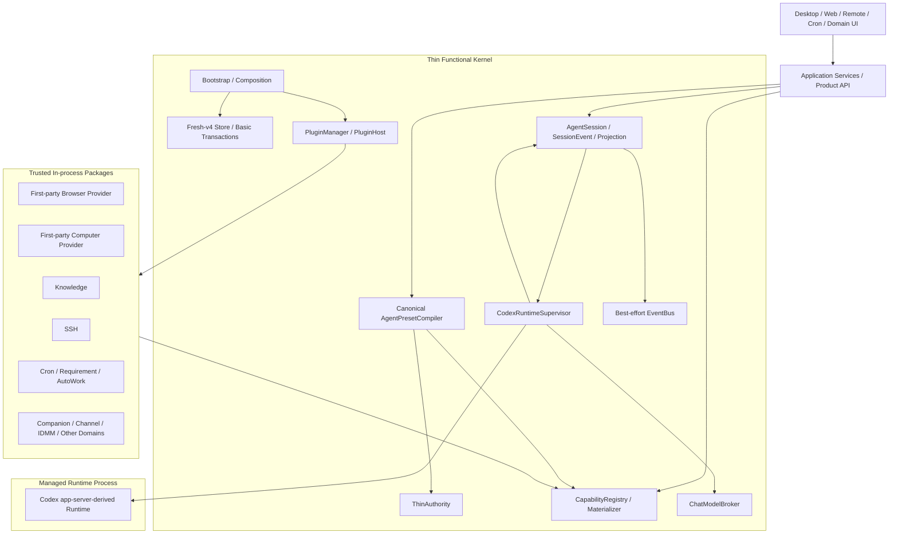

# 目标技术架构

> 修订说明：本文已于 **2026-09-02** 按
> [05-system-capability-replacement-foundation.zh.md](05-system-capability-replacement-foundation.zh.md)
> 完成止损修订。本文描述目标架构，不声明实施已经完成。
>
> 状态权威：当前完成、未完成、阻塞和外部验证状态只以
> [GLOBAL-CLOSURE-TODO.zh.md](GLOBAL-CLOSURE-TODO.zh.md) 为准。
>
> 解释顺序：本文保留长期目标架构；05 负责本轮止损边界和一期
> Browser/Computer Role/Provider 合同。两者文字冲突时以 05 为准。
>
> 机器事实：canonical Rust contract、fresh-v4 SQL/schema、API schema 和
> SessionEvent Registry 是机器合同。本文不复制第二套字段 exact-set、表清单或
> wire enum。

## 1. 架构目标

### 1.1 保留的长期目标

- **Thin Kernel**：Kernel 只拥有跨领域且不可下沉的事实、编译、调度和运行时边界。
- **统一 Plugin/Capability 主链**：第一方、测试 fixture 和未来第三方能力使用同一
  Package registration、materialization、Compiler、Snapshot 和 dispatch 路径。
- **单一 AgentSession**：产品中只有一个 `AgentSession` aggregate、一个
  `AgentSessionId` 和一条 Session API/事件主链。
- **单一 Codex-derived Runtime**：Coding 与非 Coding Agent 使用同一个 Runtime
  家族，通过编译后的 Profile 和 Capability 面表达差异。
- **fresh v4**：v4 使用干净数据根和干净 schema，不把 pre-v4 兼容、双读写或旧
  Runtime fallback 带入正常运行时。
- **清晰领域边界**：Kernel、Session、Runtime、Gateway、Knowledge、Browser、
  Computer、SSH、Remote 等各自只拥有自己的事实和资源。
- **FullAuto + ThinAuthority**：不恢复 approval/confirmation 工作流；所有正式
  Capability 调用仍经过同步、确定性的身份、所有权、Snapshot allowlist、typed
  resource binding 和 credential 边界。
- **可替换系统能力**：Browser Use 与 Computer Use 通过 canonical façade 和精确
  Provider lock 调用，第一方实现只是默认 Provider。
- **真实用户闭环优先**：设计、测试和发布以可使用的 Chat、Coding、文件、进程、
  VCS、MCP、Browser、Computer、Knowledge、Session、Automation 和 Remote
  路径为中心，不以内部证明对象数量为完成标准。

### 1.2 非目标

- 不建设多 Runtime/Engine catalog、运行时评分、自动 fallback 或同一 Session
  中途换 Runtime。
- 不把所有 Rust crate 改造成独立插件，也不建设通用 WASI/subprocess plugin
  sandbox。
- 不为 trusted in-process plugin 建设 permission、grant、lease、risk 或 consent
  平台。
- 不把 Package、Capability、Skill、MCP、Agent 和 Preset 合并成一个万能对象。
- 不建设通用 Provider graph、SAT solver、任意 Hook/Policy Engine 或全局业务
  coordinator。
- 不为 v4 保留 legacy endpoint alias、旧 DTO decoder、dual-read/write、
  compatibility view 或长期 feature switch。
- 不建设第二条 Test Session、Draft Snapshot、Effect simulator 或测试专用 Runtime
  主链。
- 不把内部 Revision、Snapshot、digest、resource ID 和 canonical JSON 直接暴露给
  普通用户编辑。
- 不用固定 Capability、模板、组件、文件或源码字符串数量充当结构 Gate。
- 不用跨平台 evidence 笛卡尔积替代目标平台上的真实产品验证。

## 2. 总体分层



依赖方向固定为：

```text
Product / Transport
  -> narrow application ports
  -> Thin Kernel contracts
  -> registered domain packages
  -> external systems
```

反向依赖被禁止：

- Kernel 不依赖具体 Knowledge、Browser、Computer、SSH、Channel 或 Automation
  实现 crate；
- Gateway 不持有 capability handler、`ComputerRegistry`、`BrowserSessionHub` 或
 领域 repository；
- 业务 Package 不取得 root SQLite、root Registry、root Session Store、
  `AppServices` 或 `GatewayDeps`；
- Composition Root 不手工拼装长期业务 service bag，只构造 Kernel、Package
  factory inventory 和必要的 typed ports。

### 2.1 Runtime wiring 与 Cargo 依赖是两张图

模块所有权必须同时由两张互不替代的依赖图约束：

- **Runtime typed-service DAG** 来自 Package manifest 声明的 service
  requirement/export。PluginManager 在任何 Package 产生业务副作用前检查 missing、
  duplicate 和 cycle，并且只向 Package 注入其已声明的 typed service view；
- **Compile-time Cargo DAG** 让 contracts 和 Thin Kernel 位于底层，业务 Package
  实现只向下依赖合同和明确基础库。Kernel、Session、Registry、Model、Gateway
  application port 不反向依赖具体业务 Package crate。

Runtime service key 只是进程内 typed wiring，不持久化、不进入 Snapshot、Prompt 或公共
API，也不扩张成 Service Catalog、候选 Provider 求解器或自动 fallback。只约束其中一张
图是不够的：全局 service bag 会绕过 Runtime DAG，反向 crate dependency 则会在编译期
把领域实现重新拉回 Kernel。

## 3. Thin Functional Kernel

Thin Kernel 是封闭的责任集合，但测试不通过“组件数量必须等于某个常量”来验证它。
新增责任必须证明无法归属现有 Kernel component 或领域 Package。

### 3.1 Bootstrap / Composition

- 打开已就绪的 fresh-v4 data root；
- 构造 Kernel component；
- 向 PluginManager 提供 Package factory inventory；
- 按依赖顺序启动，按反向顺序停止；
- 不持有领域 concrete service 字段；
- 不向 Runtime 注入巨型 optional dependency bag。

### 3.2 Fresh-v4 Store

- 正常应用只读取 canonical v4 root；
- 提供单一 SQLite pool、基础 transaction helper 和 schema compatibility 检查；
- 领域表、repository、outbox 和业务查询归 owning Package；
- pre-v4 数据只可由一次性 release/installer 维护流程归档，正常 Runtime 永不读取或
  回退该归档；
- v4 尚未 Stable 时直接修正 baseline 和 fixture，不为开发数据增加兼容 migration；
- Stable 后的升级依据 data generation、migration lineage/checksum 和 schema
  compatibility，不依赖应用 build 或设计文档 digest 完全相同。

### 3.3 ThinAuthority

只保留五类同步、无副作用的判断：

1. Auth / Principal；
2. 领域资源 ownership；
3. Snapshot action allowlist 与 active generation；
4. typed resource binding；
5. central credential resolution。

ThinAuthority 返回明确 allow/deny，不写业务状态，不成为 permission workflow，也不
承诺隔离同进程 trusted plugin。

### 3.4 Canonical Compiler

Kernel 只保留一个 **canonical `AgentPresetCompiler`**。其完整合同见第 6 节。

### 3.5 CapabilityRegistry / Materializer

- 拥有 Package contribution 的物化结果；
- 拥有 canonical Capability definition、Pack、Tool/Context/Resource export、
  active generation 和 invoke dispatch；
- 内部维护 Browser/Computer 的 flat `role_provider_index`；
- 不持有领域数据，不建立第二个 Provider catalog；
- 不按来源、安装顺序或健康分自动选择实现。

### 3.6 AgentSession

拥有 Session identity、Session fact、SessionEvent、cursor、最小 projection、Runtime
binding reference、fork provenance 和删除状态。领域业务事实不回流 Session 表。

### 3.7 CodexRuntimeSupervisor

拥有受管 Runtime process、协议 client、turn stream、cancel、timeout、process-tree
cleanup 和 disposable runtime cache。它不拥有 Capability 解析、Session 历史、
模型 route、领域状态或 Effect reconciliation。

### 3.8 ChatModelBroker

拥有 Chat model route、provider adapter、streaming、usage/error 和 central
credential 使用。Broker 是模型 retry/failover 的唯一 owner；一旦首个语义输出已进入
Session 因果链，本次 operation 不再换 route 续写。

### 3.9 EventBus

EventBus 只做 commit 后、进程内、typed、best-effort notification。lag/drop 不改变
事实；消费者按 owning store cursor 重建。可靠跨域动作使用 typed command 和
domain-owned outbox，不把 EventBus delivery 当作业务完成凭据。

### 3.10 PluginManager / PluginHost

拥有 Package manifest validation、factory lifecycle、typed service dependency、
registration、materialization 和 scoped event publisher。它不理解具体业务，也不把
所有领域服务汇总为全局依赖入口。

## 4. 统一 Package / Capability 主链

### 4.1 四个轻量概念

1. **Package**：发布和启用单位，包含 manifest、config schema 和 contributions。
2. **Capability**：进入 Agent 可执行组合的稳定原子能力；Capability Pack 只是有序
   Capability 引用集合。
3. **Skill**：instruction/workflow/resource references，不自行注册执行器，不扩大
   Snapshot allowlist。
4. **MCP**：外部连接和 Tool discovery 来源；Tool 必须先物化为 canonical
   Capability，再进入 Preset、Snapshot 和 Authority 主链。

Codex-native Coding operation 直接映射为 canonical Coding Capability，不经 MCP
伪装。

### 4.2 最小 PluginRegistration

Manifest 是声明事实源。Registration builder 从实际 handler/service export 自动派生
运行时 metadata，只保留：

- Package/Mount namespace；
- config schema；
- Capability/Pack/Skill/MCP contributions；
- typed service dependencies；
- Browser/Computer Role Provider contribution；
- cleanup handle。

Package 不再手写第二份 `allowed_operations`、`declared_*` 或其他镜像字段证明自己与
Manifest 相同。

### 4.3 窄 PluginContext

Plugin 只得到：

- package/mount identity；
- validated config；
- 自己 namespace 下的 state API；
- Manifest 已声明的 typed service view；
- scoped event publisher；
- 当前调用需要的最窄 Host port。

Plugin 不得到 root SQLite pool、root Session Store、root Registry、ChatModelBroker、
全量 EventBus publisher、`AppServices` 或 `GatewayDeps`。

### 4.4 启动与可见性

启动按“完整验证声明与依赖，再启动实例，成功后发布 contribution”执行：

1. 先检查 Manifest/config、typed service dependency、Capability/Role/route identity
   冲突和依赖环；
2. 再按 typed-service DAG 启动 Package，不在校验阶段执行领域副作用；
3. Package 及其 cleanup handle 都就绪后，才把 contribution 作为一个完整 Registry
   generation 发布；
4. required Package 失败使 Bootstrap 明确失败；optional Package 失败时不发布其任何
   contribution；
5. 失败或退出按反向依赖顺序幂等释放已启动资源。

同一 generation 对 Compiler、Snapshot 和 dispatch 是不可变视图，不能让启动中的半套
Tool、Context、Resource 或 Role Provider 被并发请求看见。这是一条简单 boot 原子性
纪律，不扩张为多状态健康平台、动态热重载或候选 Provider 调度器。

## 5. 单一 AgentSession

### 5.1 Identity 与 API

- `AgentSessionId` 使用 canonical lowercase UUIDv7；
- Chat、Remote、Editor Test、Automation 等入口都创建或复用同一种
  `AgentSession`；
- canonical API resource 为 `/api/agent-sessions`；
- fork 总是创建新的 `AgentSessionId`，并记录父 Session provenance；
- 旧 `Conversation` 不作为第二个产品容器、ID、repository 或 mapping 存在。

### 5.2 SessionEvent 与 Projection

SessionEvent 是 Session 语义事实。Runtime/private transport event 只有规范化并提交为
SessionEvent 后才能影响产品状态。

Projection 只保存 UI 当前需要的：

- 最终用户/助手消息；
- 当前 turn/session 状态；
- Tool 摘要和引用；
- bounded partial；
- 列表 metadata。

Projection 不内嵌完整 `events[]`，不复制 Event Log。模型 token/delta 默认 transient；
正常完成只持久化最终 assistant message，中断时最多保留一份 bounded partial。

### 5.3 Remote ingress

Remote 是 ingress/transport Package，不是第二种 Agent 或 Runtime：

- installation token 只解析 owner Principal；
- token generation/hash 的原子状态是 request admission 线性化点；
- rotate/revoke 提交后，之后使用旧 token 的请求立即返回
  `REMOTE_AUTH_REQUIRED`；
- 已通过验证并被接受的请求可按普通边界完成；
- 不跨 HTTP Response Body 持有 auth 读锁；
- 不建立 token-to-Session 索引、grace、后台 revoke worker 或级联取消；
- Remote 只通过显式 `agent_session_id` 调用 canonical open/turn/observe/cancel。

Remote open 先持久化 Session identity 和 `opening` 事实，再异步建立 Runtime binding；
调用方通过同一 Session/cursor 观察 ready 或 open-failed，不伪装跨 SQLite 与进程启动的
原子事务。

### 5.4 事实顺序、投影与恢复

- 每个 Session 的语义事件按单调 cursor/sequence 追加；Event、必要 bounded payload 和
  对应 projection 在同一个 Session Store transaction 中提交；
- EventBus/WebSocket 只在 commit 后通知。通知丢失或重连不改变事实，消费者从 canonical
  cursor 重读；
- stable event/operation/causation identity 由 Host 生成；Runtime item id、stdio request
  id、provider chunk id 和 transport connection id 都不能成为产品 identity；
- Event 保存稳定的 presentation intent 或 typed summary，不保存 UI component JSON、
  本地化文案、逐 token 流或完整 stdout/stderr；
- 当前 v4 lineage 内若需要 event upcast，只允许无 I/O 的纯语义转换；它不读取
  pre-v4 archive，不修改 Snapshot，也不替换 Runtime/Provider。

这些规则的目的不是建立第二个 Event 平台，而是确保 Runtime、Desktop、Web、Remote 和
领域消费者都不能各自形成一份完成事实。

## 6. Canonical Compiler 与小 Snapshot

### 6.1 唯一编译入口

```text
Preview ─┐
Save ────┼─> one canonical Compiler
Test ────┘          │
                    └─> Snapshot + authority inputs + diagnostics

Session Open ─> read saved Snapshot
             ─> check current execution compatibility
```

- Preview、Save 和 Test 调用同一个纯函数 Compiler；
- Control Plane 只把 diagnostics 映射为产品 DTO，不复制 closure、resource、
  Profile 或 digest 算法；
- dirty Test 先通过普通 SaveRevision CAS 保存，再打开普通 AgentSession；
- clean Test 复用当前 Revision；
- Session Open 不重新编译或比较第二份 Snapshot，只读取与 immutable Revision 绑定的
  已保存 Snapshot；
- Compiler 不启动 Browser、MCP、SSH、进程或其他外部资源。

### 6.2 编译输入

Compiler 只消费显式冻结输入：

- immutable Preset Revision；
- selected Capability/Pack 和 initial/on-demand 分组；
- selected Skill instruction refs；
- materialized Package/Capability/MCP inventory；
- Principal 与 typed resource binding facts；
- model route availability；
- Runtime protocol/feature compatibility；
- Browser/Computer installation default 与 Revision override。

它从所选集合正向展开 dependency closure，不先构造全量服务再过滤。

### 6.3 Snapshot 只锁定实际执行闭包

Snapshot 必须包含：

- 实际选中的 Capability、Package/Mount contribution；
- 实际 Tool schema、Context/Resource export；
- model route；
- typed resource binding refs；
- 当前需要的 Runtime protocol/features；
- initial/on-demand 分组和 activation plan；
- Browser/Computer exact Provider lock；
- Snapshot content digest。

Snapshot 不因以下全局事实变化而自动失效：

- 未选择的 Package/Capability；
- 完整 target inventory；
- 官方模板全集；
- 设计文档 digest；
- 与当前 Session 无关的 schema ledger；
- release evidence 或其他平台结果。

兼容性在 Runtime binding 建立、实际 Capability 激活或其执行实现变化时检查并缓存；
普通 Turn 不重算完整全局 ceiling。禁止静默修改旧 Snapshot、切换 Provider或降级
Coding。

### 6.4 RuntimeProfile

RuntimeProfile 是 Snapshot 的确定性派生物，不是可编辑产品对象：

- Coding Profile 保留完整 Codex-native Coding 能力和语义；
- 非 Coding Profile 只投影当前 Snapshot 需要的 Tool、Context 和资源；
- `chat.minimal` 不扫描、不连接、不启动未选能力；
- initial 在 Session 开始可见，on-demand 只可在 completed-turn boundary 激活；
- activation 只提交 active-set state，不在事务中获取外部资源。

### 6.5 Authoring identity 与执行 identity

不可变 Preset Revision 和已编译 Snapshot 是两个不同事实：

- `PresetRevisionRef` 标识用户保存的 authoring revision；
- `ResolvedSnapshotRef` 标识该 Revision 在一组冻结输入下得到的实际执行闭包；
- 持久化 Agent、Remote 和 Automation binding 同时保存两者及 typed resource refs，不从
  mutable preset id 推断 latest/default；
- 更新 Preset、installation default 或 Provider 只影响之后的 compile/open，不追溯改写
  既有 Session；
- Snapshot 在 resume 或新 turn admission 时按保存的完整执行 ceiling 做兼容性检查；
  不兼容时保留历史可读并返回 typed failure，继续工作必须显式 fork 新 Session。

机器字段由 canonical contract 决定；本文只冻结“authoring 与 executable 不得混成一个
可变引用”的数据边界。

### 6.6 Capability View、Context 与 MCP materialization

Capability membership 与 Runtime presentation 分离：

- `initial` 在 Session 首次模型请求中形成 active view；
- 未激活的 `on_demand` 只进入 Snapshot 内的短索引，不提前投影完整 Tool/Context
  schema；选择结果只在 completed-turn boundary 以单调 generation CAS 生效；
- hidden Capability 可供具名 Host workflow 使用，但不因此进入模型 Tool 面；
- Coding native、function Tool 和 hidden Host operation 只是呈现/执行方式，不改变
  canonical Capability identity 或 Snapshot membership。

Context contribution 必须表达 stable thread fact、按 key/revision 替换的 current value
或仅当前 turn 有效的 ephemeral input。Memory、Knowledge 命中、设备状态和客户状态等
变化事实必须替换或删除，不能永久追加成陈旧 history；Context provenance 仍可通过
Snapshot/SessionEvent 追溯。

MCP 是外部发现来源，不是第二条执行通道。`tools/list` 的结果必须先物化为带稳定 identity
和 schema digest 的 canonical Capability，再进入 Preset、Compiler、Snapshot、
Capability View 与 ThinAuthority。禁止把裸 MCP Tool 直接注入 Runtime Tool table，或由
Skill/MCP config 绕过 Snapshot 扩大能力面。

## 7. Codex-derived Runtime

### 7.1 所有权边界

NomiFun 拥有：

- AgentSession 与 SessionEvent；
- Snapshot、Capability 和 Provider lock；
- model route；
- Authority 与 credentials；
- Tool/Effect identity；
- 领域数据。

Codex-derived Runtime 拥有可丢弃的 thread/turn/rollout/checkpoint 执行状态。Runtime
private DB、stdout、item ID 或 checkpoint 不能成为产品事实。

### 7.2 Host/Runtime seam 与事件权威

Host 只向 Runtime 暴露当前 binding 所需的 RuntimeProfile、Capability callback、模型调用、
规范化事件入口和生命周期控制。Runtime 不取得 NomiFun SQLite pool、领域 repository、
Plugin instance、root Registry 或长期 credential。

Runtime 输出只有沿
`CodexRuntimeSupervisor -> AgentSession canonical append port`
规范化并提交后，才能改变产品 projection 或触发领域工作。stdout/stderr、provider stream
和 Runtime private store 不能成为并列事实入口。实际 Runtime build identity 记录在 binding
事件/metadata；Snapshot 只保存当前闭包需要的 protocol/feature compatibility。

传输排序、去重和恢复优先复用官方 app-server 已有语义；upstream spike 完成前，不预设
自定义 ACK/resend、handshake 或 dispose RPC。

### 7.3 先做官方 app-server upstream spike

Sidecar 合同不再预设仓库外尚不存在的自定义 RPC。冻结 Runtime protocol 前必须先用
真实官方 app-server 完成 upstream spike，验证：

- initialize/version 或等价的标准握手信息；
- thread/turn/cancel/event 主链；
- Host-managed Tool callback；
- Runtime 正常关闭和 Host 进程树回收；
- Codex-native file/shell action 是否存在可用的调用前 seam。

只有 spike 证明 Codex-native state-changing action 无法通过 upstream callback/Tool
seam 获得必要的最小调用前通知时，才允许保留一个窄 patch。Patch 只解决已证明的具体
缺口，不携带产品 manifest、平台 evidence 或第二套 Capability contract。

### 7.4 不再预设的协议

以下名称不再是目标架构前置条件：

- `runtime/hello`；
- `native_action/start`；
- `runtime/session/dispose`。

替代规则：

- build/protocol/feature compatibility 优先从标准初始化信息和受管 release metadata
  得到；
- Host-managed Tool 在请求到达 Host 后，按 Effect 分类先做必要 reservation，再执行；
- 当前一个 Runtime binding 独占一个受管进程，正常结束先关闭协议，再由 Host 回收整棵
  process tree；
- 没有必须复用的真实进程内资源时，不要求自定义 dispose ACK；
- timeout、crash、cancel、open-failed 和应用退出都必须最终回收 descendant process。

### 7.5 Coding 保真

统一 Runtime 不等于把 Coding 降级成普通 MCP Tool bag。`coding.codex` 必须保留真实
代码读取、搜索、patch、shell/process、diff 和版本控制等核心 Codex-native 语义。
非 Coding Agent 通过小 Profile 缩小能力面，而不是引入第二个简化 Runtime。

## 8. Effect 模型

一期只保留三种策略：

```text
read_only
managed_effect
external_uncertain_effect
```

### 8.1 read_only

读取操作直接返回 typed result。除正常 Session/Tool trace 外，不建立 Effect 生命周期
状态机。

### 8.2 managed_effect

本地 DB、KV、文件和 VCS 操作使用其自然正确性原语：

- transaction；
- revision/CAS；
- 同目录临时文件 + rename；
- 明确的 idempotency key。

记录一个最终 Tool result，不把每个本地写入强制扩张为通用多阶段 receipt。

### 8.3 external_uncertain_effect

外部发送、远程命令、设备控制等结果可能未知的操作：

- dispatch 前由 owning domain 持久化 effect identity/reservation；
- 确定结果写最终 outcome；
- transport unknown 不猜 success/failed；
- unknown 禁止自动 retry；
- 只有 owning domain 可按同一 identity reconcile。

SessionEvent 保存必要摘要或引用，不复制领域完整对账事实。

### 8.4 明确删除的复杂度

- 不建立全局 `EffectCoordinator`；
- 不为所有操作统一制造
  `started/succeeded/failed/uncertain/reconciled` 多状态平台；
- 不建立 Wave 级 JSON/CAS journal；
- 不因 Session 删除而删除、撤销或补偿已发生的领域 Effect；
- 不让 replay/debug/shadow 再次 dispatch 已记录的真实 Effect。

## 9. Session 删除与 Tombstone

删除只保留真实产品语义：

```text
live
  -> deleting
  -> stop new turn/resume/fork/activation/effect start
  -> cooperative Runtime dispose
  -> timeout 后 hard-kill descendant process tree
  -> idempotently delete Session-owned content
  -> minimal tombstone
```

### 9.1 删除责任

- Session Store 只删除自己拥有的 SessionEvent、payload、projection、message、
  Session-owned resource/artifact、Runtime binding reference 和 disposable cache ref；
- Runtime 返回真实 `RuntimeDisposeReport`，不要求调用方填写多类“零计数证明”；
- owning domain 保留真实 Effect、idempotency、reconciliation、business record 和
  domain outbox，只保留最小 Session/effect source reference；
- minimal tombstone 只保留 identity、owner reference、deleted state 和 deleted time。

### 9.2 崩溃恢复

启动发现 `deleting` 时重新执行同一幂等清理并完成 tombstone。不恢复复杂 Delete
Operation 状态机，不撤销到 `live`。

已删除 Session 的 turn、resume、observe、fork、restore、迟到 Runtime event 和 Remote
callback 都稳定返回 `SESSION_DELETED`，不得追加新事件、重建 projection 或重开 binding。

## 10. Browser / Computer Role-Provider Seam

Browser/Computer 可替换能力是一期目标架构，不因止损而降级。

### 10.1 稳定 Role 与 canonical façade

```text
system.browser_use  -> canonical browser.* capabilities
system.computer_use -> canonical computer.* capabilities
```

- Execution Role 是系统实现槽位，不是 Agent Persona、Preset 角色、Principal role 或
  Package source kind；
- `browser.*` / `computer.*` 是唯一 canonical Capability identity；
- Provider 不抢占这些 ID，也不发布第二套 Provider-specific façade；
- Role Binding 只决定“由谁实现”，不授予 Capability；
- Agent 是否可调用 member 仍由 Revision、Snapshot allowlist 和 typed resource
  binding 决定。

### 10.2 Provider identity 与选择

每个 Role Provider 由以下事实精确识别：

- versioned Role Contract；
- Package/version；
- Plugin Mount；
- contribution digest；
- source provenance。

Versioned Role Contract 冻结 canonical member 及 required/optional 关系；Provider 按
member 声明实际平台和 typed resource requirements。Compiler 必须先选择 exact Provider，
再对当前执行闭包所用 member 计算兼容性。第一方实现的平台限制属于第一方 Provider，
不能提前成为整个 canonical Role 的永久禁令。

Package 使用 source-neutral `RoleProviderContribution` 发布 Role 实现。同一 contribution
shape 由第一方 Rust Package 和未来 Plugin/MCP adapter 复用，不建立第二套按来源区分的
Provider schema。运行时 export 只按实际需要分为 action handler、
`ContextContributionFactory` 和 `ResourceProviderFactory`；不预建通用 Hook executor。

Registry 内只维护平表：

```text
(ExecutionRoleId, PluginMountId) -> MaterializedRoleProvider
```

解析顺序固定为：

```text
Agent Revision exact override
  -> installation default binding
  -> typed missing/unavailable failure
```

一期 seed 指向第一方 Browser/Computer Provider。Binding 缺失、Provider 缺失或合同不兼容
时明确失败；不按安装顺序选择，不自动换 Provider，不静默回退第一方实现。

一期冻结 binding、Revision override、Resolver 和 Snapshot lock，但不提供用户切换
Provider 的 API/UI。用户安装、选择、切换、Restore Built-in 和 MCP/CLI adapter 属于
后续阶段。

### 10.3 Snapshot exact lock

Compiler 先选择 exact Provider，再按该 Provider 的 member platform/resource
requirements 编译，并把结果作为 canonical `ResolvedRoleProviderLock` 冻结进
Snapshot：

- exact Role Contract；
- Package/Mount/contribution；
- supported members；
- source provenance；
- exact resource binding refs。

运行中不重新读取“当前默认 Provider”。旧 Session 的 exact Provider 不可用时返回
`SNAPSHOT_EXECUTOR_UNAVAILABLE`；用户显式 fork 新 Session，不改写旧 Snapshot。

没有 AgentSession 的系统操作在 admission 时用同一个 Resolver 生成 exact operation
lock，并随 operation context 传递。Knowledge 导入等路径不能在执行中重新 resolve。

### 10.4 唯一 dispatch route

Tool、ContextContributor 和 ResourceProvider 三类路径共用同一 Provider lock：

1. 对 canonical Capability 执行 ThinAuthority；
2. 从 Snapshot 或 operation context 读取 exact Role Provider lock；
3. 在当前 Registry generation 的 `role_provider_index` 找到 Provider export；
4. 使用 Provider Mount 的 config/state/service view 和冻结的资源；
5. 保持 canonical Capability、action、operation/effect identity；
6. 只调用一次 Provider；
7. 原样返回 canonical result 或 typed error。

`RoleDispatcher` 是 Registry 内部 exact route，不是第二个独立 Service，也不是 façade
handler 回调 Kernel 的二次 dispatch。

### 10.5 Browser Use

Browser v1 保留：

- 基线：observe、navigate、act；
- 系统集成：identity、hidden `browser.render_content`；
- 可选：download、upload、evaluate、site memory、takeover；
- session/resource-scoped lane、owner、close/cancel 和 process cleanup。

Knowledge 网页导入必须调用 `browser.render_content` 并使用同一 exact Provider；
不能直接调用第一方 `BrowserSessionHub`，也不能在 Provider 缺失时回退。

人类 Browser 管理、登录、诊断、Surface 和 Engine lifecycle 是具名 Browser 产品控制面，
可以直接拥有底层 Hub；Knowledge、Agent Factory、Gateway 和 Automation 不属于该例外。

### 10.6 Computer Use

Computer v1 保留：

- 基线：observe、input；
- 可选：launch、`a11y.observe`；
- observation generation 校验；
- 同一 exact target resource 上单次 physical action 串行。

共享 arbiter 属于 target resource，不属于某个 Provider。它不跨
observe -> model think -> input 的间隔持有长 lease。过期 element ref 返回 typed failure
并要求重新 observe。

### 10.7 第一方 dogfood 与旁路清理

- 第一方 Browser/Computer 通过普通 Package registration、materialization、
  provider index 和 exact dispatch 发布；
- 底层 Browser Hub、lane、ComputerTool 和 ComputerRegistry 可作为第一方 Provider
  内部实现保留；
- Gateway 只能委托 canonical Agent Platform/Capability route；
- `ComputerRegistry` 不出现在 Gateway 或业务 consumer dependency view；
- `mcp-computer-stdio` 不再自行构造和执行 `ComputerTool`；
- 新 v4/Codex Factory 不引用 Nomi-only Browser slot；
- Chat、Cron、Requirement、AutoWork、Remote、Knowledge、MiniApp 等消费者不依赖
  concrete Browser/Computer crate；
- test-only alternate Provider 使用同一主链，证明替换 Provider 不需要修改消费者。

## 11. 领域所有权

| 领域 | 拥有 | 不拥有 |
|---|---|---|
| Agent Platform | Compiler、Snapshot、Session、Capability dispatch | Knowledge/Browser/SSH 等业务数据 |
| Gateway / API | transport、DTO mapping、application port 调用 | capability handler、领域 registry、Provider 选择 |
| Browser Provider | Browser Hub、lane、profile、Browser process lifecycle | AgentSession、Knowledge import policy |
| Computer Provider | ComputerTool、ComputerRegistry、本机 desktop adapter | Gateway route、Agent Provider selection |
| Knowledge | source、document、index、search/read/import workflow | Browser concrete implementation |
| SSH | connection/host binding、read/write/exec/sudo、timeout/cancel | 全局 Effect journal、AgentSession history |
| Remote | token admission、RemoteBinding、transport mapping | Runtime/Session/Capability 的第二套 authority |
| Automation | schedule、requirement、attempt 和领域 outbox | Runtime factory、Browser/Computer concrete service |
| Channel / IM | account、channel、message transport 与领域 receipt | AgentSession identity 或模型执行事实 |
| IDMM | supervision/coordination 业务事实 | 第二个 Runtime 或 Session aggregate |

跨域协作规则：

- 同步调用使用窄 typed port；
- 可靠异步工作由接收方 command/idempotency 或 owning-domain outbox 承担；
- EventBus 只通知；
- SessionEvent 只记录 Agent 执行语义和最小领域引用；
- 不把 `AppServices`、`GatewayDeps` 或全量 service bag 当作领域依赖入口。

### 11.1 公共 API 与数据边界

- canonical Rust contract、fresh-v4 schema、SessionEvent Registry 及其生成物拥有字段、
  wire enum、error 和持久化约束；本文不复制第二套机器定义；
- Gateway、Desktop command、WebSocket、MCP 与 Remote 只做 transport、DTO mapping 和
  application port 调用，不拥有 Compiler、Provider selection 或领域 repository；
- direct Capability operation 必须绑定 `agent_session_id` 及其 Snapshot/active
  generation，或携带 admission 时生成的 exact non-Agent operation lock；
- Agent Platform 拥有 Revision、Snapshot、Session fact/event/projection；各 Package
  拥有自己的领域表、idempotency、external effect reconciliation 和 outbox；
- Runtime thread/rollout/checkpoint 是可丢弃 cache；Registry generation、Runtime private
  event、cleanup handle 和 release evidence 都不是客户端可写的产品状态。

## 12. 文件、资源与 Credential 边界

文件系统只保证产品必需的基本正确性：

- 用户明确选择 Workspace/Knowledge root；
- canonicalize、root containment、拒绝 `..` 和明显越界；
- 文件类型、单文件和总量上限；
- 写入使用同目录临时文件 + rename；
- 删除/覆盖前明确目标；
- 错误不泄漏不必要的宿主路径。

首版不为同权限恶意本地进程在每个 syscall 之间替换 symlink/junction 建设逐组件
TOCTOU 证明平台。

Resource binding 规则：

- Snapshot 只保存 typed resource refs；
- Provider identity 或任意配置不得塞入 stringly-typed parameter 形成旁路；
- ResourceHandle 在首次真实调用时 lazy acquire；
- Session/operation teardown 释放对应 handle；
- Compiler、Session create 和 on-demand activation 不提前启动外部资源。

Credential 由 Host 集中存储和使用，不进入 Prompt、RuntimeProfile、Plugin state、argv、
日志或测试 fixture。

## 13. 产品控制面

普通 Agent 编辑器默认只展示：

- 名称与用途；
- 模型选择；
- 按任务分组的 Capability/Pack；
- Workspace、Knowledge 和 connector picker；
- 保存；
- “试用 Agent”。

默认行为：

- initial/on-demand 由模板和 Capability metadata 决定，开发者模式才允许覆盖；
- binding/resource/operation 内部 ID 由后台生成；
- Save/Test 内部自动执行 Preview；
- Test 打开普通真实 AgentSession，不存在测试专用 backend；
- Revision、Snapshot、digest、protocol 和 raw Event 放在默认折叠的技术详情；
- Snapshot 不兼容时显示“在新会话中继续”，后台执行显式 fork；
- 删除提示描述用户内容和不可恢复性，不展示内部表名。

测试覆盖真实用户流程，不读取 JSX/Rust 源码字符串锁死组件名、方法名、分隔符或固定
Capability 数量。

## 14. 发布、验证与 C9

### 14.1 首批 release-blocking 平台

首批 Stable 的真实原生阻断平台是：

1. Windows Desktop x64；
2. macOS Desktop arm64；
3. Linux Desktop x64。

macOS x64 与 Linux Headless x64 保留设计兼容和后续交付入口，但不构成首个 Stable 的
五格 evidence 笛卡尔积。未在真实原生环境验证的平台必须明确标注未交付，不得用
cross-compile、VM、emulation 或 synthetic result 冒充。

### 14.2 验证原则

- 日常运行受影响 crate/module 的最小定向检查；
- broad workspace check 只用于主要合流、跨层变更和最终 RC；
- dirty worktree 可运行完整 verify，但结果只作诊断；
- release attestation 使用 clean candidate 和真实 Artifact；
- Catalog 检查 ID 唯一、依赖闭合和关键能力可执行，不锁固定数量；
- 代表性真实 E2E 优先于 source-string、fixture-shape 和排列组合测试；
- 每个可能挂起的 E2E 有自身 deadline；
- 共享 DB、固定端口或 process-tree 测试才单独串行；
- 遇到平台、credential 或 harness 障碍时记录一次原因和人工步骤，不盲目重试，也不写
  绕过产品语义的测试。

### 14.3 Release artifact

- schema fixture 只验证 schema，并明确使用 synthetic digest；
- `release-lock` 在打包后记录真实 Host/Runtime/Package digest；
- `platform-result` 记录目标平台、实际 suite、结果和日志引用；
- pre-run input 不自引用其所在 commit SHA；
- post-run result 可引用 immutable candidate SHA，但不写回并改变被验证源码；
- 相同未变化 Artifact 可复用对应结果；只有相关 ABI、Runtime protocol、Package 或
  目标平台 Artifact 变化才使该结果 stale。

### 14.4 一次性 C9 shutdown

C9 是本地桌面 fresh-v4 重构的一次性 clean cut，不是长期在线 canary drain 平台：

```text
stop Nomi admission
  -> cancel internal Nomi work
  -> bounded application/runtime shutdown
  -> kill descendant process trees
  -> mark unresolved real external effects uncertain
  -> verify production route/process/binding/release artifact no longer uses Nomi
  -> delete Nomi
```

不保留：

- per-domain sticky canary；
- ancestor deadline minimum；
- durable Session handoff；
- read-only shadow 平台；
- 多维 outstanding ledger；
- 同一 Session Runtime switch；
- 自动 Effect replay。

C9 后只允许 forward fix，不恢复 Nomi/pre-v4 fallback。最终 Stable 提升已验证 RC 的相同
bytes。

## 15. 已废止的旧设计

以下机制已从目标架构实质删除，不得以“兼容”“Gate”或“临时过渡”名义恢复：

1. 固定 Package、Capability、模板、组件、文件、方法或源码字符串数量的结构 Gate；
2. 全局 Effect coordinator、统一多状态 receipt、Wave 级 Effect journal；
3. `ZeroOutstandingProof`、由调用方填写多类零计数的伪资源证明；
4. sticky canary drain、祖先 deadline、durable handoff 和长期 shadow；
5. 五个平台、全功能、全 fault、same-tuple recheck 的 evidence 笛卡尔积；
6. 把 `runtime/hello`、`native_action/start`、`runtime/session/dispose` 当作尚未验证就必须
   存在的 Sidecar RPC；
7. Control Plane Compiler、Kernel Compiler 和 Session Open recompile 并存；
8. Snapshot 锁定未选择 inventory、文档 digest 和全局 schema ledger；
9. Provider 缺失时回退第一方 Browser/Computer；
10. `AppServices`、`GatewayDeps` 或 Factory 长期手工组合所有 concrete 业务服务；
11. 为每个本地文件写入建设 distributed-style uncertain/CAS/receipt 平台；
12. 用 synthetic digest、历史 evidence 或 metadata-only owner 宣称 release pass。

## 16. 架构验收不变量

实现验收以行为和依赖方向为准：

- Preview、Save、Test 只调用一个 canonical Compiler；
- Session Open 读取保存的 Snapshot，不生成第二份执行事实；
- 产品中只有一个 `AgentSessionId` 和一条删除生命周期；
- Projection 可从 SessionEvent 重建且不复制完整事件数组；
- Effect 只落入 read-only、managed 或 external-uncertain 三种策略；
- external unknown 不自动 retry，reconcile 归 owning domain；
- Runtime 退出后无 descendant process 遗留；
- 自定义 Codex patch 必须有真实 upstream spike 证明；
- Browser/Computer 的 Tool、Context、Resource 都读取同一 exact Provider lock；
- 第一方 Provider 与 alternate fixture 走同一 materializer/index/dispatch；
- Gateway、Knowledge、Automation 和 stdio bridge 不直接调用 concrete
  Browser/Computer implementation；
- fresh-v4 Runtime 不读取或恢复 pre-v4 archive；
- Kernel 不依赖具体业务 Package，Plugin 不取得 root authority/service bag；
- release 结果来自真实 Artifact 和真实目标平台；
- 当前完成状态只由 `GLOBAL-CLOSURE-TODO.zh.md` 报告，本文中的架构条款不能被解释为
  “已经完成”。
