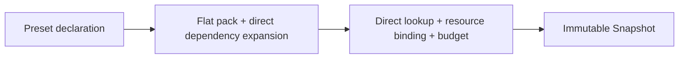
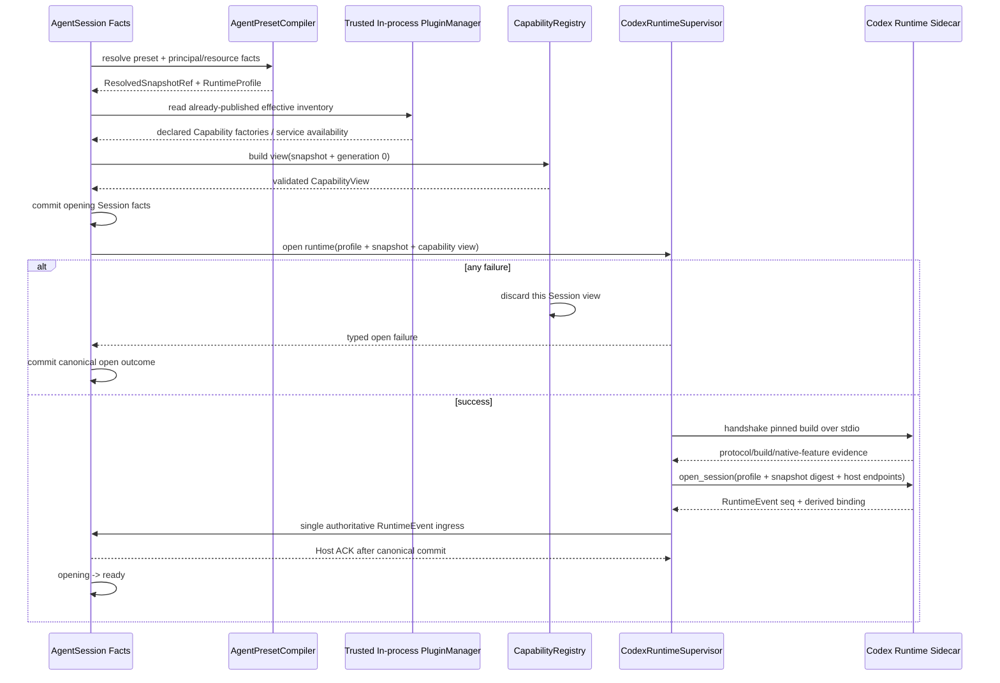
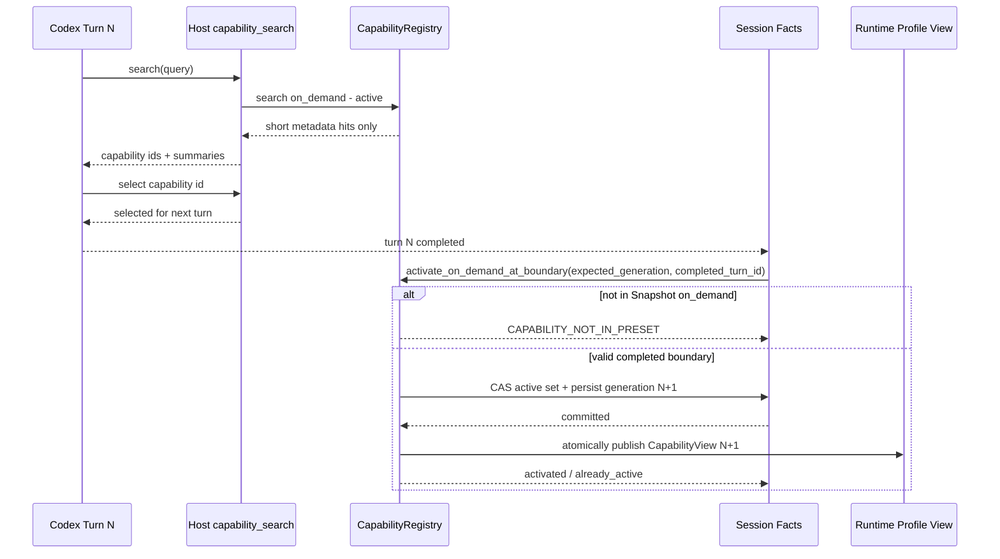

# 目标技术架构

## 1. 目标与非目标

### 目标

- 在 Runtime 构造前解析最小能力图；
- 以唯一 Codex-derived Runtime 实现承载所有 Agent，并为每个 Session 编译不同的 `RuntimeProfile`、typed resource binding 与能力面；
- Capability 的模型可见面、FullAuto 执行边界、资源句柄和生命周期来自同一 identity；
- 所有产品入口复用同一 Agent Preset Compiler；
- Snapshot 在 Session 创建前完整解析互斥的 `initial` / `on_demand` Capability 集合；Agent 只能在预解析的 `on_demand` 集合内自动激活能力；
- NomiFun 始终拥有 Session、Capability、Model route、RuntimeAuthority 与领域数据；Codex thread/rollout 只作可丢弃、可重建的运行绑定；
- Coding Agent 设定完整保留 Codex-native Coding Pack，非 Coding 设定使用同一 Runtime 的 dynamic/minimal Profile；
- 普通第一方与第三方插件统一作为 trusted code 在 NomiFun 进程内运行，优先交付效率、直接调用和调试简单；
- Capability scope 只描述 Agent 设定的组合、模型可见面与业务资源绑定，不承担恶意插件代码隔离；
- Thin Authority Kernel 只保留 auth/Principal ownership、Snapshot action allowlist、typed resource binding、remote auth 和 central credentials，所有判断同步、确定性地返回 allow/deny；
- Package、Capability、Skill、MCP 固定为轻量四层，只有 Capability/CapabilityPack 能进入 Agent 可执行组合；
- D-016 方案 A 要求首个 v4 Stable 只冻结并 dogfood vendor-neutral `PackageManifest`、`PluginRegistration`、config schema、`PluginStateNamespace = (package_id, mount_id, scope_key, state_key)`、source metadata 与四层 materialization；bundled first-party package 和 CI/test-only `sample.echo` 必须走完全相同的注册、配置、状态、Editor、Preview/Test/Save、Runtime/Event 主链；
- D-015 方案 A 要求规范化语义 `SessionEvent + bounded payload` 成为 Session 执行与产品历史的唯一事实；所有 UI/查询状态都是可删除、可全量重建的 projection，Codex rollout/checkpoint 只是 Runtime 专用 root 内的可丢弃 cache；
- D-024 方案 A 要求所有入口共用唯一 `DeleteAgentSession` 生命周期：先建立 admission fence，再使 Runtime quiesce/cancel 并清理到 zero-handle，随后以可恢复闭包删除全部 Session 内容，最终只保留不可逆的 minimal tombstone；真实 Effect 和对账事实继续归 owning domain plugin，不被 Session 级联删除；
- D-025 方案 A 要求旧 Snapshot 在每次 resume/new-turn admission 时校验完整 frozen execution ceiling；当前 Runtime build 可以不同，只要 exact compatibility 通过即可继续原 `AgentSessionId`，否则历史只读并由用户显式 fork 新的 child AgentSession；
- D-026 方案 A 将 Remote token rotate/revoke 固定为 request-admission fence：revoke commit 后旧 token 的新请求统一失败，commit 前已 durable accepted 的有限 operation 正常收敛，既有 AgentSession、Snapshot 与 Runtime binding 均不被级联修改或取消；
- D-027 方案 A 将剩余 Nomi canary Session 固定为 existing-deadline bounded drain：关闭新 admission 后，idle Session 立即 cancel/dispose/kill/zero/delete；已接受 operation 只运行到自身与全部祖先原有 finite deadlines 的最小值，随后执行 `cancel→dispose→kill descendants→uncertain handoff→zero→D-024 delete`；
- D-028 方案 A 固定首个 Stable 的 required native platform cells、Capability availability 与 Windows-first native handoff；C1～C7 的全部功能开发必须先在 Windows 连续完成，跨平台代码可以同期实现，但非当前原生目标只能累计 `pending_native_verification`，不得按功能/模块暂停交接，也不能借 cross-compile、VM、emulation 或 Rosetta 宣称通过；只有 Windows 整体 pre-candidate 全功能/pre-version Gate 通过后才首次 pause；所有 required local cells 都必须保留完整 Coding，Mobile/Web/Robot firmware/IM client 只作为 Remote client，不打包本地 Host/Runtime；
- D-018 收窄方案 A 只保留两类确定性正确性边界：轻量 Preset 必须从空集合正向最小装配，`chat.minimal` 精确为零且不扫描、不连接、不启动未选能力；`coding.codex-native` 必须保留完整 canonical Capability/native feature 集合、Native Responses 语义与功能 conformance。本期不建设量化性能测量、matched baseline、benchmark、metric/SLO contract、reference runner、统计 Coding 评测、telemetry-only 字段、性能 RC 或性能平台；
- D-022 方案 A 将 Editor Test 固定为纯 UI 编排：脏 Draft 先经普通 CAS SaveRevision 保存一个可见、immutable `AgentPresetRevision`，干净 Draft 复用当前 Revision；随后统一经 `/api/agent-sessions` 创建普通、持久化 `AgentSession`，使用当前真实 typed resource bindings 并按 FullAuto 主链执行真实 Tool/Effect；
- D-017 方案 A 将 Remote 永久固定为 ingress/transport plugin：本地管理面创建 owner-owned `RemoteBinding`，其 `agent_binding` 复用 02 唯一 canonical `AgentBindingValue`，从而冻结 exact `PresetRevisionRef + ResolvedSnapshotRef` 与 typed resource bindings；远端只经 `RemoteIngressAuthenticator` 和 `open/turn/observe/cancel` 显式创建、复用产品 Session，所有调用通过该 Session 的 frozen Snapshot/active generation dispatch；
- D-014 方案 A 要求每个 Vertical Slice / Domain Wave 在切换全部直接消费者的同一变更中，hard-delete 对应 legacy API/DTO、table mapping、配置、mode/approval、Factory wiring、测试与依赖；首个 v4 Stable 的产品兼容面精确为零；
- D-004 的 Nomi Runtime 只作为内部 recorded replay/shadow/canary 语义对照 adapter 存在，不进入产品 API、不读取 legacy archive，并由 D-020 的独立最终门禁删除；
- D-020 方案 A 只允许内部 Beta 在 Session admission 前按 scene + exact Preset digest + Domain Wave/cohort 做 sticky canary；产品没有 Runtime selector、canary binding 或 fallback 状态。每个 Domain Wave 切换时同变更删除本域 Nomi wiring；all-scene Codex-only gate 通过后先硬删除全部 Nomi，再生成 Nomi-free RC，Stable 直接提升同一 digest；
- 每个迁移波次都以“新主链可用 + 旧产品接线残留为零”共同完成，不制造永久双 Runtime 或另开 Stable 后清债项目。

本期优先级固定为：**交付效率与逻辑简单 > 可维护性 > 性能优化 > 安全性需求**。安全性是最低优先级；除系统正确运行不可缺少的 Thin Authority 五项同步确定性检查外，本次可以不考虑额外安全加固，任何安全诉求都不得增加实现复杂度或拖慢交付。其余过度隔离和可变权限设计全部淘汰。普通插件接受 trusted in-process 风险；只有 D-004 已确认的 Codex Runtime sidecar 保留独立进程边界，不能据此扩张出通用插件隔离平台。

D-006 方案 A 将 Thin Functional Kernel 设为封闭白名单：Bootstrap/Composition、SQLite/fresh-v4 baseline/v4-only migrations/基础事务、ThinAuthority、AgentPresetCompiler、CapabilityRegistry、AgentSession 事实事件、CodexRuntimeClient/Supervisor、ChatModelBroker/Provider route、EventBus、PluginManager。新增产品能力不能通过“先放进 Kernel”实现，只能成为进程内插件或现有 Kernel 接口的普通调用者。

### 非目标

- 不把所有 Rust crate 都强行改造成独立插件包；
- 不在本期建设 WASI、subprocess plugin host、sandbox、恶意代码防护、第三方故障隔离或资源配额；
- 不在本期建设插件签名、供应链信任、Grant/Lease/Consent/Permit 等安全体系；
- 不允许业务域、Plugin、Skill、MCP、Runtime 或 UI 再建立第二套 permission、risk、runtime permission mode、确认或可变授权状态；
- 不将 Skill、MCP、Extension、Agent 和 Preset 合并成一个对象；
- 不建设多 Runtime/Engine catalog、选择器或长期通用 adapter 体系；
- 不建设 RuntimeContribution、独立 Service catalog、Provider/Consumer graph 或复杂 Capability 实现求解器；
- 不为 v4 建立 legacy endpoint alias、旧 DTO decoder/response projection、compatibility view、dual-read/write、deprecated facade 或长期兼容开关；
- 不允许运行中安装 Package、修改 AgentPreset、把 Snapshot 外 Capability 加入 Session，或建立 capability release/revoke 状态机；
- 不建设 Test Revision、TestSession、DraftSnapshot、ephemeral execution、disposable resource、Effect simulator、测试专用 API/表/Runtime/清理器或审批分支；Editor Test 不形成第二条执行主链；
- 不把 Pi 或 DeepSeek Harness 做成产品 Runtime；两者只保留为 loop、scope、插件生命周期与测试语义的研究参照；
- 不为了形式统一而重写、削弱或 MCP 化 Codex 最有价值的原生 Coding 能力；
- 不以“Tool schema 变少”代替真实 Provider/Context/Scope 卸载；
- 不在这一方案评审阶段实现代码。
- 首个 v4 Stable 不提供 production user package loader、public Plugin SDK、dynamic discovery、目录/URL/压缩包安装、market/distribution/update/hot reload、compatibility shim 或第三方 DB migration；这些 production surface 的计数必须为零；
- Phase N 不建设 sandbox、签名或插件 permission/risk/grant 体系；第三方代码继续遵守 trusted in-process 前提。

### 1.1 Canonical contract 单一来源

[02-capability-catalog-and-agent-presets.zh.md](02-capability-catalog-and-agent-presets.zh.md) 是 v4 machine-readable contract 的唯一规范来源：Package/Capability/Skill/MCP 与进程内注册见其 §4，Preset/RuntimeProfile/Snapshot 见 §7–§8，SessionEvent/Runtime checkpoint 与 activation 见 §8.3–§9，API/持久化/Resolver 见 §11，产品与发布不变量见 §14–§16。对应 schema、OpenAPI/IPC、event vocabulary、示例和 contract digest 只能在 02 及其生成物维护。

本文件只规定架构所有权、依赖方向、生命周期、因果关系、失败语义和 release flow；不再复制 Rust struct、表 exact-set、API path inventory 或 SessionEvent kind 清单。实现发现 02 与本文件措辞不一致时，以 02 的当前 canonical machine-readable contract 为准，并在同一变更修正本文件的架构描述，禁止生成第二套 DTO/schema/enum。

### 1.2 D-021～D-028 与 D-019 最终确认

D-021 已确认为改良后的方案 A：v4 只有一个 canonical `AgentSession` aggregate 和一个 UUIDv7 `AgentSessionId`，不存在第二个产品会话对象、双 ID 或映射关系。中文 UI 统一显示“会话”，英文 UI 只使用“Chat”或“Session”；旧 `Conversation` 只能出现在现状说明和删除清单中，目标产品与技术面的同名英文文案、type、ID、table、service、repository、API 和 mapping 计数均为零。Canonical API resource 为 `/api/agent-sessions`，数据表为 `agent_sessions`，Remote 只传递 `agent_session_id`。fork 总是创建新 `AgentSessionId`，并以 canonical fork provenance 指向父 Session；标题、归档、置顶、未读等产品状态归 `AgentSession` metadata/projection，不另建容器对象。

D-022 已确认为方案 A：Editor 的 Test 按钮只编排现有正式 API，不引入 Test backend mode。若 `PresetDraft` 相对当前 Revision 为 dirty，Test 必须先携带 `expected_current_revision + preview_digest` 调用普通 SaveRevision CAS，追加一个正常可见、immutable `AgentPresetRevision`，并将编辑器切到该已保存 Revision；若 Draft 为 clean，则不写新 Revision，直接复用当前 `PresetRevisionRef`。两种情况随后都通过 canonical `/api/agent-sessions` 创建普通、持久化 `AgentSession`，绑定该 exact Revision/Snapshot 和用户当前真实 typed resources，并经相同 Codex Runtime、SessionEvent、Tool 与 Effect 主链以 FullAuto 真实执行。Test 不模拟 Effect、不隔离或替换 Workspace/Knowledge/Memory/Browser/Computer/Robot/IM/SSH 等真实资源，也不增加确认或审批；UI 必须静态明确提示“Test 会自动保存修改并真实执行”。Test 产生的 Revision、AgentSession、SessionEvent 与 Effect receipt 服从普通产品生命周期，AgentSession 删除必须走 D-024 已确认的唯一闭包与 minimal tombstone，不另建测试清理语义。

D-023 已确认为改良后的方案 A：七个 official template 采用“角色完整、上下文按需”的种子策略。每个模板默认选入完成其核心角色工作流所需的能力；`initial` 只投影首个 Turn 必需且轻量的 Tool/Context，`on_demand` 则是同一已编译 Snapshot 中默认具备、可被发现并在 Turn boundary 激活的能力，不代表未安装、未授权或二等功能。`chat.minimal` 继续 exact-empty，`coding.codex` 的完整 `coding.codex-native` union 不得退化；`companion.default` 必须默认包含 Persona、伙伴 Memory、Knowledge 与 IM 连接/收发等核心能力，并以轻量 initial、较重 on-demand 的方式分区。其他模板同样以其角色核心闭环为准，不能因追求轻量而退化为空壳。

D-023 不在方案阶段凭不完整的候选名称冻结 Capability exact ids。正式实现进入 G0 contract lock 时，必须先全量盘点现有 Capability Catalog 与所有业务入口，再生成并评审唯一 machine-readable、versioned official-template seed manifest；它固定七模板的 exact `initial`/`on_demand`、Pack/Skill、typed resource-binding requirements、model route/instruction refs 与 manifest digest。该 manifest 通过 role-complete、`chat.minimal` exact-empty、Coding full-union 和资源可绑定检查后才冻结，随后并行实现只能消费它。模板中的 Knowledge、IM、Robot、Workspace 等能力可以默认预选与声明默认 binding slot，但具体用户资源实例、账号和凭据仍在创建/fork/首次使用时按用户当前可用资源绑定，不能写进跨用户 seed。

D-024 已确认为方案 A：产品只提供一条 `DeleteAgentSession` 命令与删除生命周期，不因 Chat、Remote、Editor Test 或业务入口分叉。命令首先持久化 admission fence，阻止新 turn/resume/fork 与新 Effect；然后 quiesce/cancel Runtime、dispose binding 并释放所有 Session-scoped ResourceHandle，直到 zero-handle；随后以幂等、崩溃后可继续的闭包清理 SessionEvent/payload/projection/message、Session-owned artifact/resource、Runtime binding 与可丢弃 checkpoint/cache。最终 `agent_sessions` 只保留 `agent_session_id + owner reference + state=deleted + deleted_at` 这个不可逆 minimal tombstone，不保留 transcript、Snapshot、Runtime 或 Effect 内容。

Deleted Session 不能 resume、observe、fork 或 restore；迟到 Runtime event、Remote callback 及其他操作稳定返回 `SESSION_DELETED`，不得追加事件、重建 projection 或重开 binding。Session 内的 Effect event/receipt projection 随会话内容删除；已发生的真实 Effect、idempotency key/receipt、reconciliation、业务事实与 domain outbox 仍由 owning plugin 保留，只保留对 `AgentSessionId`/effect identity 的最小 source reference，不复制 Session 内容。本期不建 retention、trash、restore、legal hold 或删除 Session 导致的 Effect 撤销/补偿平台。

未列入某个官方模板 seed 的能力不是禁止能力。用户可在单页 Agent 设定的 Capability Catalog picker（产品可称“能力集市”）中，把当前已安装、已物化且与 Host/Runtime/resource contract 兼容的任意 Capability 或 Capability Pack 加入该用户 Preset Revision 的 `initial` 或 `on_demand`；Compiler 仍做 closure/conflict/resource 校验。未来第三方 Package 只需向同一 Catalog 注册能力，就能沿相同 picker、Revision、Snapshot 与 Runtime 主链被选择，不需要增加新的 Agent 类型或恢复“设定市场”。

D-025 已确认为方案 A：未删除 AgentSession 的 canonical history 永远可读；resume/new turn 只在 completed-turn boundary 对 immutable Snapshot 的**完整 ceiling**做 exact compatibility admission。被校验的集合包括 initial/on-demand 全集、Package/Capability/Skill/MCP materialization/schema、Runtime protocol/Profile/native features、model-route/config contract 与 typed resource-binding contract，而不是只看当前 active set。当前 Runtime build 可以不同于原 build；兼容即继续原 `AgentSessionId`。Checkpoint 只有 build/protocol/Snapshot/`through_seq` 全部 exact-match 才直接恢复，否则立即丢弃；compatibility admission 通过后，从 latest completed compaction + canonical Events 创建新 binding。结构不兼容返回 `SNAPSHOT_EXECUTOR_UNAVAILABLE`，原 Session 不被改写、upcast 或 rebind；用户显式 fork 新 `AgentSessionId`，子 Session 使用自包含、有界 semantic fork base。Coding 只有完整 `coding.codex-native` 可用时才算兼容，Tool/Effect 永不重放。

D-026 已确认为方案 A：Remote installation token 的 rotate/revoke transaction 提交新的 auth generation/status，并且只控制**请求 admission**。Commit 之后使用旧 token 发起的任何新 `open/turn/observe/cancel` 都返回 `REMOTE_AUTH_REQUIRED`；commit 之前已经 durable accepted 的 operation 按其普通 finite boundary 完成。Fence 不修改、删除或取消既有 AgentSession、RemoteBinding、Snapshot、Runtime binding 或领域 Effect；同一 owner 使用 replacement token 并显式提交原 `agent_session_id` 时可以继续。系统不增加 per-Session token lease、scope、TTL、grace period、kill switch 或 token provenance。

D-027 已确认为方案 A：全局关闭 Nomi new-Session/new-operation admission 后，无已接受 operation 的 Nomi Session 立即执行 `cancel → dispose Runtime → kill descendants → zero handles → D-024 delete`；已经 durable accepted 的 operation 只允许运行到它自身与全部祖先在 admission 时已有 finite deadlines 的最小值，不能在 drain 时延长或另设可配置等待。Deadline 到达即执行 `cancel → dispose → kill descendants → durable uncertain handoff → zero handles → D-024 delete`；handoff 不等待 reconcile。不得把同一 Session 切到 Codex，也不设置固定观察周期。

D-028 已确认为方案 A：首个 Stable 的 required native cells 精确为 Windows Desktop x64、macOS Desktop x64 + arm64、Linux Desktop x64 和 Linux Headless x64。Windows Host 与 Runtime 都使用 MSVC target；macOS 发布一个 Universal app envelope，但必须携带两个分别构建、分别 manifest 的 Darwin x64/arm64 sidecar package，并在两类真实架构上各跑原生 Gate；Linux Host 使用 GNU target，sidecar 使用对应 x64 musl target。Windows ARM64 与 Linux ARM64 在首个 Stable 明确 unsupported，不进入 candidate/experimental 产品状态。Mobile、Web/browser UI、Robot firmware 与 IM client 是 Remote-only surface，本地 Host/sidecar/package/selector/fallback 计数为零。所有 required local cells 必须完整提供 Coding；Browser/Computer 再按 Host capability availability 独立判定，Headless 的 Browser/Computer 为 exact-unavailable，Linux Desktop 若保留 partial Computer Use，必须使用区别于完整实现的 canonical Capability identity。

D-028 的实施/验证顺序固定为 Windows-first native handoff：C1～C7 的全部产品功能、共享实现和 Windows 适配在真实 Windows x64 主机连续开发，不因某个 macOS/Linux 功能、模块、`cfg` 分支或 package point 到达就暂停；这些跨平台验证点只累计到工程清单。待 C1～C7 整体完成并冻结 Windows pre-candidate 后，在 Windows 执行全产品功能与 pre-version Gate，整套 pass 后主任务才在 HP-1 第一次暂停并通知用户切到真实 macOS arm64 主机。macOS arm64 阶段同样以整个 pre-candidate 为交接单元：连续完成全部适配、关闭本 cell 的全部 pending points并跑完整 native Gate，中途不按功能/模块暂停；整套 pass 后才在 HP-2 第二次暂停，通知用户在真实 Intel Mac、Linux Desktop x64、Linux Headless x64 三台/类独立原生主机上以三个独立任务并行验证。Cross-compile、VM、emulation、Rosetta 或在一个平台代测另一个平台，只能作为开发反馈，不能把任何非本机 cell 标成 pass。每一整轮平台验证全部返回后才统一合并 shared fixes、冻结新 cohort tuple；若因此有旧证据失效，C8-MERGE 收敛过程以 whole-cohort `C8-RECHECK-n` 一次批量启动五格原生复验，affected cells 跑完整 Gate，unaffected cells 跑新 tuple scoped attestation。只有整轮复验又产生 shared fix 才开始下一轮，绝不按单修复换机；五个 native cells 基于同一完整 tuple 全部形成原生证据后才允许进入 C9。

D-019 已确认为方案 A：五个稳定单一 owner workstream、gross ROM `P50=213 / P80=314 engineer-weeks`、calendar ROM `P50=29 / P80=42` 周，并以 6–8 个高并发 coding agent 为默认实施编排。完整 owner、依赖和 Gate 拓扑见 §2.1。D-001～D-028 与 D-019 已全部闭合并经用户整体确认；当前为 **IMPLEMENTATION READY**，下一任务从 Contract Closure/G0 启动，本设计提交尚未包含 production code。

## 2. 分层架构

```mermaid
flowchart TB
    subgraph Product[Product / Ingress]
      Desktop
      Web
      Mobile
      Settings[Settings Navigation]
      IM
      Robot
      Cron
      Remote
      Creative
      CustomerService
    end

    subgraph PresetUI[D-010 single-page progressive Agent Preset UI]
      PresetList[Agent 设定 List]
      PresetEditor[Single-page Progressive Editor]
      PreviewAction[Preview]
      TestAction[Test - UI orchestration only]
      TestRevision[D-022 persisted revision<br/>dirty: normal SaveRevision CAS<br/>clean: reuse current revision]
      TestSession[D-022 canonical agent-sessions API<br/>normal persistent AgentSession<br/>real resources + Effects]
      SaveRevision[Normal visible immutable SaveRevision]
    end

    subgraph Kernel[Thin Functional Kernel - fixed allowlist]
      Bootstrap[Bootstrap / Composition]
      SQLite[New v4 Data Root / Fresh Baseline / Basic Transaction]
      Authority[ThinAuthority]
      Compiler[AgentPresetCompiler]
      Registry[CapabilityRegistry]
      Sessions[AgentSession<br/>Canonical SessionEvent + bounded payload<br/>Rebuildable projections]
      Runtime[CodexRuntimeClient / Supervisor<br/>Build active / draining / retired<br/>Disposable checkpoint-cache lifecycle]
      Model[ChatModelBroker / Provider Routes]
      EventBus[Best-effort EventBus<br/>Cursor resync required]
      PluginManager[Trusted In-process PluginManager]
    end

    subgraph Sidecar[Fixed D-004 Runtime Sidecar]
      Protocol[Versioned stdio Runtime Protocol]
      Codex[Codex Thread / Turn / Item Loop]
      ManagedProfile[Managed Dynamic / Minimal Profile]
      CheckpointCache[Disposable Rollout / Checkpoint Cache]
      RuntimeEvents[RuntimeEvent seq<br/>Unacked resend / Host ACK]
    end

    subgraph FourLayers[D-007 lightweight four layers]
      Package[Package]
      Capability[Capability / Capability Pack]
      Skill[Skill - instructions only]
      MCPSource[MCP server / tool source]
      NativePack[coding.codex-native Capability Pack]
    end

    subgraph ThirdPartyReady[ThirdPartyReady seam - current scope]
      Builtins[Built-in Packages]
      SampleFixture[CI/Test-only sample.echo Package]
    end

    subgraph D011[D-011 final vertical slices]
      ChatSlice[Chat exact-zero<br/>No scan / connect / startup]
      CodingSlice[Coding exact native Capability set<br/>Native Responses + functional conformance]
    end

    subgraph HardDelete[D-014 A per-wave hard-delete gate]
      Wave[Vertical Slice / Domain Wave]
      CanaryAdmission[Internal Session-admission Sticky Canary]
      EffectPrimary[Exactly One Effect Primary]
      SwitchConsumers[Ship canonical v4 path + switch direct consumers]
      DeleteLegacy[Same change deletes legacy API / DTO / table mapping / config / mode + approval / Factory wiring / tests / dependencies]
      WaveResidual[Wave product residual gate = 0]
      StableZero[First v4 Stable product compatibility surface = 0]
      NomiEval[D-004 internal Nomi replay / shadow / canary adapter]
      AllSceneGate[D-020 All-scene Codex-only Functional Gate]
      D020Delete[Hard-delete Nomi Before RC]
      NomiFreeRC[Nomi-free RC]
      StablePromotion[Promote Same RC Digest to Stable]
    end

    subgraph CleanStart[D-012 clean start + confirmed D-013 A]
      CutoverLauncher[One-shot Cutover Launcher]
      FreshInstall[Fresh install - canonical root absent]
      StopProcesses[Stop app / sidecars / helpers]
      OldCanonical[Old canonical data root]
      ValidateRoot[Validate exact canonical root + same filesystem + target absent]
      OperationIntent[Immutable parent operation intent<br/>durable before rename / root creation]
      AtomicRename[Whole-root atomic rename]
      LegacyArchive[Timestamp sibling archive - forever unreachable]
      V4Root[Create empty v4 root at original canonical path]
      SchemaMetadata[SQLite schema_metadata]
      FreshBaseline[Fresh v4 baseline]
      FirstSeed[Seed built-in packages + 7 templates]
      V4Ready[Mark canonical v4 root ready]
      IntentRemoved[Durably remove one-shot intent]
      PreRenameAbort[Fail before rename<br/>old root unchanged + no v4 root<br/>intent absent or immutable-present]
      InitAbort[Initialization fail - intent preserved<br/>archive untouched when present]
      LegacyFiles[Published legacy source/migrations - untouched + unreachable]
    end

    subgraph SnapshotSets[D-008 pre-resolved Snapshot sets]
      InitialSet[initial]
      OnDemandSet[on_demand + short search index]
    end

    subgraph OfficialTemplates[D-009 official AgentPreset templates - exactly 7]
      TChat[chat.minimal]
      TGeneral[assistant.general]
      TCoding[coding.codex]
      TCompanion[companion.default]
      TRobot[robot.default]
      TCustomer[customer-service.default]
      TCreative[creative-studio.default]
    end

    subgraph NonAgentScenes[Non-Agent products and bindings]
      ResearchPack[research Capability Pack]
      TriggerBinding[Requirement / AutoWork / Cron -> exact PresetRevision]
      NonAgentSurface[IDMM supervision / IM + Remote transport]
    end

    subgraph RemoteIngress[D-017 Remote ingress / transport plugin]
      RemoteAdmin[Local Remote Binding Management]
      RemoteBinding[RemoteBinding<br/>Exact Preset + Typed Resources]
      RemoteAuth[RemoteIngressAuthenticator<br/>Installation-owner authentication only]
      RemoteProtocol[open / turn / observe / cancel<br/>Explicit AgentSession reuse]
    end

    subgraph DomainPlugins[All trusted in-process business plugins]
      Knowledge
      Memory
      Companion
      Browser
      Computer
      IMPlugin[IM]
      CS[Customer Service]
      RobotPlugin[Robot]
      CreativePlugin[Creative]
      Requirement
      AutoWork
      CronPlugin[Cron]
      IDMMPlugin[IDMM]
      AgentExecution
      SSH
      Office
      Webhook
      ReliableWork[Typed Commands / Domain Outboxes]
    end

    subgraph External[External endpoints - not plugin hosts]
      NativeResponses[Native Responses Route]
      ResponsesBridge[Local Responses Bridge]
      ProviderAdapters[Anthropic / Gemini / Chat / Bedrock Adapters]
      MCP[MCP / SaaS]
    end

    Bootstrap --> SQLite
    CutoverLauncher --> StopProcesses
    FreshInstall --> OperationIntent
    StopProcesses --> ValidateRoot
    OldCanonical --> ValidateRoot
    ValidateRoot -->|valid| OperationIntent
    ValidateRoot -. stop/path/collision/cross-volume failure .-> PreRenameAbort
    OperationIntent -->|cutover| AtomicRename
    OperationIntent -->|fresh install| V4Root
    AtomicRename -->|success| LegacyArchive
    AtomicRename -->|success| V4Root
    AtomicRename -. rename failure .-> PreRenameAbort
    V4Root --> FreshBaseline
    V4Root --> SchemaMetadata
    FreshBaseline --> FirstSeed
    FreshBaseline -. init failure .-> InitAbort
    FirstSeed -. seed failure .-> InitAbort
    InitAbort -. never opens or moves .-> LegacyArchive
    FirstSeed --> V4Ready
    V4Ready --> IntentRemoved
    IntentRemoved --> Bootstrap
    Bootstrap --> Authority
    Bootstrap --> Compiler
    Bootstrap --> Registry
    Bootstrap --> Sessions
    Bootstrap --> Runtime
    Bootstrap --> Model
    Bootstrap --> EventBus
    Bootstrap --> PluginManager
    Product --> Authority
    Product --> Compiler
    Product --> Sessions
    Settings --> PresetList
    PresetList --> PresetEditor
    ChatSlice --> PresetEditor
    CodingSlice --> PresetEditor
    ChatSlice --> Wave
    CodingSlice --> Wave
    DomainPlugins --> Wave
    NomiEval --> CanaryAdmission
    CanaryAdmission --> EffectPrimary
    EffectPrimary --> Wave
    Wave --> SwitchConsumers
    SwitchConsumers --> DeleteLegacy
    DeleteLegacy --> WaveResidual
    LegacyFiles -. historical only; excluded from v4 build graph .-> WaveResidual
    WaveResidual --> StableZero
    StableZero --> AllSceneGate
    AllSceneGate --> D020Delete
    D020Delete --> NomiFreeRC
    NomiFreeRC --> StablePromotion
    PresetEditor --> PreviewAction
    PresetEditor --> TestAction
    PresetEditor --> SaveRevision
    PreviewAction --> Compiler
    TestAction --> TestRevision
    TestRevision -->|dirty only| SaveRevision
    TestRevision --> TestSession
    TestSession --> Compiler
    TestSession --> Sessions
    SaveRevision --> SQLite
    Compiler --> Registry
    Compiler --> Authority
    Compiler --> Sessions
    Sessions --> Runtime
    Runtime --> Authority
    Runtime --> Registry
    Runtime --> Model
    Runtime --> Sessions
    Sessions --> EventBus
    Runtime --> Protocol
    Protocol --> Codex
    Codex --> RuntimeEvents
    RuntimeEvents --> Runtime
    Runtime -. ACK only after Session commit .-> RuntimeEvents
    Codex --> CheckpointCache
    Runtime --> CheckpointCache
    CheckpointCache -. locator + digest + runtime-bound-event-ref/protocol/Snapshot/through-seq .-> Sessions
    Sessions -. exact Snapshot + completed compaction + subsequent events .-> Runtime
    Compiler --> ManagedProfile
    ManagedProfile --> Codex
    Package --> PluginManager
    Package --> Capability
    Package --> Skill
    Package --> MCPSource
    Package --> NativePack
    Builtins --> Package
    SampleFixture --> Package
    NativePack --> Capability
    MCPSource --> Capability
    Capability --> Registry
    Skill --> Compiler
    OfficialTemplates --> Compiler
    ResearchPack --> Capability
    TriggerBinding --> Compiler
    NonAgentSurface --> Sessions
    NonAgentSurface --> EventBus
    Settings --> RemoteAdmin
    RemoteAdmin --> RemoteBinding
    Remote --> RemoteAuth
    RemoteAuth --> RemoteProtocol
    RemoteBinding --> RemoteProtocol
    RemoteProtocol --> Compiler
    RemoteProtocol --> Sessions
    Sessions --> RemoteProtocol
    RemoteProtocol -. direct Capability projection must bind Session .-> Registry
    Compiler --> InitialSet
    Compiler --> OnDemandSet
    InitialSet --> Runtime
    OnDemandSet --> Registry
    PluginManager --> DomainPlugins
    PluginManager --> RemoteProtocol
    DomainPlugins --> Registry
    DomainPlugins --> EventBus
    Sessions --> ReliableWork
    ReliableWork --> DomainPlugins
    DomainPlugins --> SQLite
    Registry --> Authority
    Registry --> DomainPlugins
    MCPSource --> MCP
    Model --> NativeResponses
    Model --> ResponsesBridge
    Model --> Authority
    ResponsesBridge --> ProviderAdapters
```



### 2.1 D-019 A：实施所有权、无循环依赖与关键路径

实施只保留五个稳定 workstream，每个 central write set 只有一个 integration owner；领域 pod 可以并行，但不能另建第二份 contract、Composition root 或 Gate harness：

| Workstream / 单一 owner | 独占交付边界 | P50 EW | P80 EW |
|---|---|---:|---:|
| W1 Platform Foundation & Fresh-v4 | canonical contracts、Thin Kernel spine、AgentSession/Event/Projection、Compiler/Registry、fresh-v4 schema、cutover/seed ownership | 42 | 62 |
| W2 Codex Runtime & Providers | pinned fork/sidecar、Protocol/Client/Supervisor、ChatModelBroker/Responses Bridge、Provider、完整 Coding、process lifecycle | 46 | 68 |
| W3 Product Control Plane | 单页 Preset Editor、Capability Catalog、七模板产品面、Binding/Remote 管理面、D-025 continuation、D-026 singleton token、D-028 availability presentation、compiled sample/first-party 同链 UX | 19 | 26 |
| W4 Domain Migration & Inline Demolition | 五个 Domain Wave、全部 direct consumer、每 slice 的 Nomi/legacy/Factory/Composition edge 同改同删 | 74 | 108 |
| W5 Shared Integration, Hard Delete & Release | 唯一 required-check harness、fault/recovery/residual evidence、canary coordinator、Nomi hard-delete、RC 与 Stable promotion | 32 | 50 |
| **合计** | 不包含性能平台、安全平台、Phase N ecosystem、legacy converter 或长期兼容层 | **213** | **314** |

该 ROM 由原始闭合工作量 `P50=202 / P80=294` 加上 D-025 `5/8`、D-026 `0/0`、D-027 `2/4`、D-028 `4/8` 得到；Remote revoke 不新增独立状态平台，因此 D-026 增量为零。Calendar ROM 为 `P50=29 / P80=42` 周，不通过把 engineer-weeks 简单除以人数计算；默认用 6–8 个高并发 coding agent、disjoint write set、阶段 commit 和一个 Cargo/validation coordinator。Workspace `cargo test` 只属于 C6、C8-WIN-PRE、C10-WIN 三个 Gate 节点族，由 coordinator 按 exact input tuple 去重；同一 tuple 只执行一次，后续 shared fix 生成新 tuple 并使 Windows broad evidence `stale` 时，先合并修复，再在原节点族为最终 tuple 重跑一次，不新增阶段或 HP。日常只跑受影响的定向检查，C8-MA/MX/LD/LH 与 C10 非 Windows cells 只执行 target-specific checks，不运行 workspace broad gate，跨 cell 不复用 native pass。

决策与实现依赖只能沿下面的 DAG 前进：

```text
D-001～D-028 + D-019 全部确认
  -> Contract Closure / G0（C0）
  -> C1～C7 Windows 连续开发（跨平台代码可预留；只累计 pending points；feature/module pause = 0）
     -> C1 FullAuto physical deletion
     -> C2～C5 foundations（W1/W2/W3/W5 并行；W4 只做 inventory/manifest）
     -> C6 Chat + Coding + sample.echo 三联 final-stack Gate
     -> C7 五个 Domain Wave / slice 内同改同删
  -> freeze Windows pre-candidate
  -> C8-WIN-PRE real Windows Desktop x64 全产品功能 + pre-version/native Gate
  -> HP-1 PAUSE / notify user -> C8-MA real macOS Desktop arm64 native Gate
  -> HP-2 PAUSE / notify user -> C8-MX + C8-LD + C8-LH 三个独立任务/原生主机并行 Gate
  -> merge whole-batch fixes -> (C8-RECHECK-n whole-cohort native convergence)*
  -> C8-MERGE five-native-cell same-tuple pass + all-scene Codex-only + 七模板 executable + D-027 zero-outstanding Gate
  -> C9 remaining Nomi physical hard-delete
  -> C10 five-cell Nomi-free RC -> (C10-RECHECK-n whole-cohort native RC convergence)*
  -> C10-MERGE same-tuple five-cell RC evidence
  -> C11 promote exact same content digest to Stable
```

`G0/C0` 只冻结 canonical contracts、schema/event vocabulary、D-014 manifests、D-028 target matrix、`OfficialPresetSeedManifest` 与 Gate fixture；它**不**执行 mode/approval/confirmation 的物理删除。该删除只能从 `C1` 开始，避免把“contract lock”与不可逆 production demolition 混成循环前置。

Composition Demolition 的 C6 前置条件只包含四项：Thin Kernel/Plugin composition skeleton 可启动；Chat/Coding/`sample.echo` 三联 direct consumer 已脱离 legacy composition；forbidden-new-edge Gate 为零；每条剩余 domain edge 已有唯一 manifest owner。C6 不要求所有领域 Composition edge 已经删除。各领域 edge 在 C7 对应 slice 切换 direct consumer 的同一变更删除，C8 才要求全局 `AppServices/GatewayDeps/Factory/manual composition` residual 与 reachability exact-zero；因此 W4 不会反向阻塞它赖以进入的 C6。

Fresh-v4/cutover 的 C2 只依赖 G0 冻结的 stop/quiesce port、W1 canonical schema/baseline 与 parent-intent contract；在 W2 sidecar 尚未完成时，可以用同一 port contract 的 deterministic fixture 验证 stop/zero-handle 与 cutover fault matrix。它不依赖 W2 完成，也不要求先启动真实 Runtime；真实 Host + pinned sidecar + process-tree 集成在 C6 三联 final stack 才成为 required Gate。

`OfficialPresetSeedManifest` 在 G0 冻结的是**目标 seed contract**：七 key、ordered initial/on-demand IDs、Pack/Skill refs、typed binding requirements、model/instruction refs、source versions 与 digest。Fresh initializer 只把这份 frozen manifest/materialization 写入空 v4 root并核对 digest，不能在 seed 时运行 Compiler、连接资源或按当时 availability 重新 resolve。C6 只要求 Chat/Coding/`sample.echo` 三联端到端可执行；其余 official templates 可以已经 seed 但不作为 C6 execution dependency。C8 才要求七模板在 D-028 对应 Host capability availability 与真实 typed resources 下全部完成 executable conformance；该要求按 Windows-first native handoff 分阶段取证，不能在 Windows 一次运行后替其他 native cell 结案。

C8 是进入 C9 前最后一个可逆的全量 Gate。C8-WIN-PRE、C8-MA、C8-MX、C8-LD、C8-LH 五份 native evidence 必须全部指向同一 frozen verification candidate；任一整批 shared fixes 产生新的 candidate 时，受影响 cell 的旧 pass 自动失效并在下一 `C8-RECHECK-n` 回原生主机完整重验，未受影响 cell 也必须在该新 tuple 的原生主机产出 scoped attestation，不能只沿 ledger 继承。Recheck 只在当前整轮全部完成、修复统一合入并冻结新 tuple 后批量触发；现有 Host/task 可复用，不可用时一次提醒用户准备缺失平台，绝不按单个修复换机。C8-MERGE 收敛后直接 C9，不新增产品 approval；C9 一旦物理删除 Nomi，就只能 forward fix。C10 必须从 C9 删除提交或其 forward-fix 构建，并在五个真实 native cells 上验证 RC package；RC fix 同样等整轮结束后统一合入，`C10-RECHECK-n` 在新 RC tuple 上同批执行 affected full RC checks 与 unaffected native scoped attestation。C10-MERGE 同 tuple 收敛后，C11 才能移动 channel/pointer并提升同一 content digest。

## 3. Thin Functional Kernel 最终清单

本节固化已确认的 D-006 方案 A。下列十项是 Kernel 的完整且封闭清单；这里没有“示例”或“首批”的含义。任何新增组件都必须先证明无法作为进程内插件实现，并重新进入架构决策，不能由开发者直接扩张 Kernel。

### 3.1 Bootstrap / Composition

只负责读取当前 v4 应用配置、构造下列九个 Kernel component、向 `PluginManager` 提供 trusted plugin factory inventory，并按固定顺序启动/停止。Composition root 不持有 Knowledge、Memory、Browser、Robot 等领域 service 字段，也不向 Runtime 构造巨型 optional dependency bag。

D-013 的 one-shot Cutover Launcher/fresh-install coordinator 位于 Bootstrap 之前，是 release/installer 的一次性维护步骤，不是第十一个 Kernel component、Plugin、Runtime API 或长期产品模式。只有 canonical path 已经是完成 baseline/seed 且标记 ready 的 v4 root 时，Bootstrap 才能构造 SQLite Kernel 与其余组件；它没有 legacy root/archive 参数，也不负责在启动失败时回退或恢复旧目录。

### 3.2 SQLite / Fresh v4 Baseline / 基础事务

正常 Runtime 只打开原配置的 canonical data root。D-013 one-shot coordinator 必须先停止 app、Codex sidecar 和相关 helper，随后只用目录 metadata 精确确认 canonical root 与受信任 parent；cutover 还要确认同文件系统 timestamp sibling target 与 target 不存在。fresh install 与 cutover 都必须在 rename、root creation 或 SQLite creation 前先 durable create immutable parent operation intent。cutover 随后才把旧 whole root 通过一次原子 rename 移到 sibling archive；禁止在 rename 失败时 fallback 为 copy、逐文件 move 或 copy-then-delete。fresh install 跳过 rename，但同样只能在 intent durable 后创建空 v4 root。

空 v4 root 先创建完整 v4 baseline，再运行以该 baseline 为起点的 v4-only append migrations，并把 G0 已冻结的 built-in package materialization、`OfficialPresetSeedManifest` 与必要系统默认值按 manifest bytes/digest 写入。Fresh seed 是 target-contract materialization，不调用 AgentPresetCompiler、不连接资源、不根据当前 Capability availability 重新 resolve，也不要求真实 Codex sidecar 已就绪；全部成功并验证 intent + exact paths/ready + `schema_metadata` 一致后，coordinator 必须 durable remove 一次性 intent，之后才进入正常 Bootstrap。Kernel 提供单一 SQLite pool、基础 transaction helper 和关闭顺序；可靠 outbox 若需要只能由 owning domain 持有。领域表、repository 与查询代码归对应插件。正常 v4 restart/upgrade 不依赖也不重建该 intent；Bootstrap 不探测旧 DB schema/version，不打开 archive、不读取旧配置/凭据/附件索引。

Immutable operation intent durable 后，每个 filesystem/SQLite step 都独立提交；系统不宣称跨 filesystem 与 SQLite 原子。Intent 不保存或更新 mutable phase；崩溃恢复 phase 只由 intent + canonical/exact sibling path existence/ready state + `schema_metadata` 推导：rename 前失败保持旧 root 原位且没有 v4 root，rename 后失败保持 archive 原位，只重试或处置 intent 绑定的新 v4 root；Runtime 不得启动、fallback 或自动恢复 archive。完整状态机与 ownership 固化在 §13.2。

### 3.3 ThinAuthority

只保留五类必要边界：

1. **Auth / Principal**：把本地用户、远程 token 或渠道身份解析成一个可信 Principal；
2. **Ownership**：确认 AgentSession、workspace、knowledge base、companion、customer、robot 等资源属于或明确绑定到该 Principal；
3. **Snapshot allowlist**：确认当前 action/capability 已编译进不可变 Snapshot 与 active generation；
4. **Typed resource binding**：确认调用引用的是 Snapshot 中绑定的具体资源，而不是模型任意提供的裸字符串目标；
5. **Central credentials**：模型和远程连接凭据由 NomiFun 集中存储、解析和使用，不进入 Prompt、RuntimeProfile、Plugin state 或 Codex rollout。

授权函数同步、无副作用且只有 Allow/Deny。Remote auth 与领域 ownership 在 Session/Preset resolve 或 turn admission 前解析为冻结的 Principal/typed binding；`authorize` 不在调用时回查领域数据库。它不写授权记录；业务插件只提供 ownership/binding facts，不实现自己的 permission engine。普通插件仍是 trusted in-process code，ThinAuthority 约束官方 Agent 调用路径，不宣称隔离恶意插件。

### 3.4 AgentPresetCompiler

读取 Preset revision、Principal/resource facts、CapabilityRegistry snapshot、Chat model availability 和 pinned Runtime release constraint/feature inventory，确定性生成 `ResolvedAgentSnapshot + RuntimeProfile`；它不把实际 Codex build ID 写入 Snapshot。Compiler 不启动业务服务、不查询领域数据正文、不执行模型调用，也不持有插件 instance。

D-018 要求 Compiler 只从 Preset 明确选择的 Capability/Pack/Skill/resource binding 做正向展开；不得先扫描或构造全量 Package/Skill/MCP/Provider/Browser/Computer/SSH/Office/worker 再过滤。`chat.minimal` 的空输入必须生成 exact-empty `initial/on_demand/active`、空 Tool/Skill/Context/MCP plan 与无 workspace/repository 的 `managed_minimal` Profile；Compiler 不能为统一形状加入占位 Tool、deferred stub 或 search control。

### 3.5 CapabilityRegistry

是 Capability manifest/pack、Tool/Context/Event contribution、active generation 与官方 invoke dispatch 的唯一目录。它吸收原先独立的 Scoped Registry、Context Assembler、Tool Projection 和 Capability Broker 职责，但保持实现为一个小模块，不再拆出新的 Kernel service，也不保存 Package、Skill、MCP server 或 ServiceKey catalog。

每个 Session view 固定保存 `initial`、`on_demand` 与 `active`：前两者来自同一个 immutable Snapshot 且互斥，`active` 初值等于 `initial`，`active_set_generation` 初值固定为 0。Registry 为 `on_demand - active` 建短搜索索引，并只在 turn boundary 用 CAS 生成 generation N+1；已激活能力在 Session 结束前保持 active，不提供 release/revoke 操作。Activation 只提交纯 active-set state，ResourceHandle 在首次真实 invoke 时 lazy acquire。

`scope` 只表示组合层级与业务资源绑定，不是 sandbox。`CapabilityManifest` 不声明 permission、risk、sandbox、grant 或交互策略；需要执行时 Registry 只调用一次 ThinAuthority，然后直接 dispatch 到 owning plugin。

### 3.6 AgentSession 事实与事件

本组件是 D-015 A 的唯一 `AgentSession` 事实所有者：只以规范化语义 `SessionEvent + bounded payload` 持久化 `AgentSessionId` UUIDv7、消息、turn admission/terminal、source-message/turn/tool/effect correlation、Capability activation、Context 变化、Tool call/result、Effect receipt、compaction、fork provenance 与 Runtime binding digest。事实表与 rebuildable projection 的 exact-set 只引用 02 §8.3/§11.2，不在本文件重复。标题、归档、置顶、未读与其他会话列表状态是该 aggregate 的 metadata/projection；中文 UI 显示“会话”，英文 UI 显示“Chat”或“Session”，两者都直接指向同一 `AgentSessionId`。

每次 append 在一个 SQLite transaction 中分配严格递增的 per-session `seq`，写 Event/Payload并更新 `next_seq` 与 projection；commit 后才发送 best-effort EventBus notification。`event_id` 和 typed `correlation_id` 是 Host 生成的稳定幂等身份，Runtime token、provider chunk id、stdio request id、Codex item id 都不能充当产品 source identity。可靠跨域工作使用 typed command/owning-domain outbox，不混入 Session append。Knowledge、Memory、Customer Service dialogue、Creative task、AutoWork attempt 等领域状态不是 `AgentSession` 字段，也不能借旧扩展字段、projection 或 Runtime private state 回流 Kernel。

Runtime checkpoint cache 的物理 root、创建、淘汰和删除由 `CodexRuntimeSupervisor` 管理；`AgentSession` 只保存 cache binding 的 locator、digest、`runtime_bound_event_ref`、protocol、Snapshot digest 与 `through_seq`，实际 Runtime build identity 只从该 canonical Event 读取。这些 metadata 仍是 projection/cache reference，不是完成权威。checkpoint 缺失、损坏或不匹配时直接失效；canonical Events 始终用于恢复产品历史/projection，是否还能创建 Runtime binding 必须先通过 D-025 compatibility admission，不建设 converter或静默升级。fork 不复用父 ID，而是生成新 UUIDv7 `AgentSessionId` 并持久化父 Session/event/seq provenance；子 Session 完成后不依赖父 Runtime cache 存活。

### 3.7 CodexRuntimeClient / Supervisor

拥有唯一 Codex-derived Runtime sidecar 的 versioned stdio client、single-flight session binding、turn stream、cancel/steer、稳定 `runtime/session/dispose`、Runtime 专用 checkpoint-cache root、完整 OS process-tree supervision、drain/upgrade、crash recovery、cache eviction 与 quarantine。它不负责 Capability 解析、模型选择、业务状态、Session 历史、重试/failover 或权限判断；sidecar private SQLite/thread/rollout/checkpoint 不能成为产品事实。Runtime 输出只有在被 Host 规范化并提交为 canonical SessionEvent 后，才可影响 projection 或领域后续动作。

D-020 迁移 canary 只能位于内部 Session admission：在 `AgentSession` 创建 Runtime binding 之前，根据内部 Beta deployment cohort、invocation scene、exact Preset revision digest 与 Domain Wave 一次选择 Nomi 对照或 Codex primary；选定后 Session-sticky，既有 Session 不在 turn 中途、Effect 后或 resume 时切换 Runtime。该选择器不进入产品 API、Preset/Snapshot、数据库 schema、RemoteBinding、Session 可编辑状态、UI、配置或 Runtime catalog；正式 v4 产品始终只有 Codex Runtime identity。

只读场景可以把同一 canonical input 送到 shadow comparison；任何 state-changing turn 必须恰好一个 primary 获得 Capability/Effect dispatch authority，另一侧只能消费 recorded/simulated Tool result，不得调用真实插件、写 Session/领域状态或产生第二份 Effect receipt。Domain Wave 切到 Codex 后，必须在同一变更删除该域 Nomi admission/wiring/Factory field/test/dependency，不能把残留推迟到最终集中清理。

### 3.8 ChatModelBroker / Provider Route

只服务 Agent Chat/Responses turn：精确解析 `(provider_id, model, chat task)`、原生 Responses route、本机 Responses Bridge、streaming、usage/error、config revision 和 central credentials。它是模型调用唯一的 retry/failover owner；sidecar、Bridge 和 Provider adapter 各自的自主 retry 次数固定为 0。Broker 也只能在首个 semantic output 提交前切换 route 或重试；一旦任何模型语义 item 已进入 Runtime/Session 主链，失败即终止本次 operation，禁止换 Provider 续写或产生第二条输出因果链。每次请求必须先通过 §5.3 chat causality gate，不能由 Runtime shadow、EventBus listener 或无 turn authority 的后台调用直接发起。Image、Video、ASR、TTS、Embedding、Rerank 等非 Chat 模型能力由对应业务插件提供，不继续堆进 ChatModelBroker。

### 3.9 EventBus

提供 commit 后的进程内 typed best-effort publish/subscribe、user/session audience routing、bounded backpressure 和 WebSocket projection。EventBus 允许 lag/drop，消费者必须按 owning store cursor 重建；它不拥有领域状态、不执行可靠工作流、不做授权，也不替代 Session event 的持久化。可靠业务动作只能走 typed command + receipt/idempotency 或 domain-owned transactional outbox。

### 3.10 PluginManager

统一管理第一方与第三方 trusted in-process plugin 的 manifest、dependency、factory、start/stop、contribution registration、内部 `ServiceKey<T>` wiring 和轻量 state。它不理解具体业务域，也不持有每个插件的 concrete service field。Codex Runtime sidecar 不是 PluginManager 管理的普通插件，继续由 §3.7 Supervisor 管理。

### 3.11 D-017 Remote ingress / transport plugin（非 Kernel）

Remote 是 PluginManager 管理的 ingress/transport plugin，不是 Agent、AgentPreset template、Capability Pack、RuntimeProfile、权限 mode 或 Thin Kernel component。Remote plugin 独占 `RemoteBinding` CRUD、REST/MCP adapter、连接级 admission 与协议错误映射；AgentPresetCompiler、AgentSession、CapabilityRegistry 和领域资源仍由各自既有 owner 管理。

`RemoteIngressAuthenticator` 只验证可 rotate/revoke 的 installation-level token，并返回 canonical installation-owner Principal；token 不绑定 companion、Preset、Capability scope、role、mode 或资源，也不保存进 `RemoteBinding`。`binding_id` 只是 owner-owned 配置引用，不是秘密或授权凭据，不能扩大 Principal。Rotate/revoke transaction 提交 auth generation/status 后形成 D-026 request-admission fence：旧 token 的新 `open/turn/observe/cancel` 一律返回 `REMOTE_AUTH_REQUIRED`；commit 前已经 durable accepted 的 operation 继续到正常 finite boundary。Fence 不扫描或修改既有 Session，不 cascade cancel Runtime/Effect，也不创建 per-Session token lease、scope、TTL、grace 或 kill 状态。

`RemoteBinding` 的 exact fields 只引用 02 canonical contract：它只增加 Remote id/owner/name，并在 `agent_binding` 中嵌入唯一 `AgentBindingValue`，不复制第二套 Preset/Snapshot/resource schema。`open(binding_id)` 不伪造跨 SQLite/sidecar 的单事务：第一笔本地事务完成认证结果绑定、Binding/ownership/resource preflight、Compiler 与 frozen Snapshot，并生成 UUIDv7 `AgentSessionId`、创建 `opening` `AgentSession` 事实；commit 后立即向 Remote caller 返回唯一 `agent_session_id + open_state=opening + cursor`，随后 Supervisor 才执行 Runtime open/handshake。成功 ACK 后第二笔事务提交 02 canonical `runtime/bound + session/ready` facts、把 Session 转为可 turn 状态并处理可选首 Turn admission；失败追加 `session/open-failed` 并保持不可执行，客户端通过 `observe` 获取收敛结果。之后 `turn/observe/cancel` 先验证 authenticated Principal 仍拥有该 `AgentSession`，再只接受 `agent_session_id` 与必要 cursor/idempotency key；客户端必须显式保存并复用该 ID，token、IP、HTTP/MCP connection、客户端名称或“最近 Session”都不能成为隐式复用键。Replacement token 只有解析到同一 owner 且显式携带原 `agent_session_id` 时才能继续既有 Session。Remote 删除必须调用同一 `DeleteAgentSession`；命令建立 admission fence 后，任何迟到 Remote/Runtime callback 只返回 `SESSION_DELETED` 且不得复活 Session。

opening transaction 冻结 exact Preset/Snapshot/model route/config revision、initial/on-demand、Package/MCP/schema digest、RuntimeProfile、所需 Runtime protocol/features/release constraint 和 typed resources，但不写实际 Codex build ID；RuntimeReadyAck 后的第二 transaction 才以 `runtime/bound` Event 记录实际 admitted build 并推进 ready。Binding 更新或新 Preset revision 只影响之后的 `open`；既有 Session 不漂移。任何保留的 Remote direct Capability projection 也必须携带 `agent_session_id`，以该 `AgentSession` 的 frozen Snapshot 与 active generation dispatch；禁止别名 identity、双 ID/mapping 层或 installation token 到全局 Registry 的直通旁路。Remote 唯一执行语义为 FullAuto，不存在 scope DSL、profile/domains、confirmation、`needs_confirmation`、danger approval 或等待状态。

## 4. CapabilityRegistry 组合层

以下层级是 `CapabilityRegistry` 内部的 key resolution 规则，不是另一个 Scoped Registry Kernel service：

```text
host layer
  └─ user / organization layer
       └─ workspace / business-resource layer
            └─ preset revision layer
                 └─ session / agent layer
                      └─ execution-attempt / turn layer
```

解析规则：

1. parent 先、near layer 后；
2. 同 capability/tool/context key 近层可 shadow；
3. Principal ownership、Snapshot allowlist 与 typed resource binding 的 deny 不能被近层 contribution 覆盖；
4. 每个 registration 记录 owning plugin instance 与 scope key；
5. scope dispose 直接移除 contribution handles，并在 instance 不再被引用时调用 `stop`；不建立通用 disposer/compensation 图；
6. stateful PluginInstance 明确声明是 process、preset revision、session、turn 还是 call lifetime；
7. preset revision 使用引用计数，最后一个 Session 离开后卸载，不重复 DeepSeek Harness generation 永不回收的问题。

### 4.1 Package / Capability / Skill / MCP 四层

本节固化已确认的 D-007 方案 A。产品与运行数据流只保留四层：

1. **Package**：安装和分发单位，包含 package id/version、文件、简单 dependency、entrypoint、配置 schema，以及 Capability/Skill/MCP/UI contribution。AgentPreset 不直接执行 Package，也不依赖 package 名授予能力。
2. **Capability**：唯一可进入 Agent 可执行组合的原子对象，声明 stable capability id、actions、Tool schema、resource-binding kind、Context/Event contribution 和 owning plugin executor。`CapabilityPack` 只是有序 capability id 列表，属于 Capability 层，不是第五层对象。
3. **Skill**：模型工作方法资源，包含 name、description、when-to-use、instruction body、digest，以及 Package 内可选的 references/templates/examples/scripts refs。Skill instruction 与资源可进入 Context plan；script 只能由 Agent 通过 Snapshot 已选择的 Shell/Process/专用 Capability 显式执行。Skill 本身不能注册 Tool、自动执行 hook/process、建立 MCP connection、声明 permission/lifecycle code，也不能扩大 Snapshot action allowlist。
4. **MCP**：外部连接与 tool discovery 来源。MCP server/tool 不能直接进入 Agent；每个 canonical MCP tool 必须先物化成普通 `CapabilityDefinition + ToolContribution`，之后与其他 Capability 走同一 Preset/Snapshot/ThinAuthority 路径。

Codex native 能力不经过 MCP 伪装：`coding.codex-native` 直接是 Capability Pack，其中每个 native operation 都有稳定 Capability/action identity，由 RuntimeProfile 映射到 Codex 原生实现。

```text
Package install/enable
  ├─ Capability definitions / packs ───────────────┐
  ├─ Skill instruction/resource refs ──> Context plan  │
  └─ MCP server config -> discover tools           │
                         -> materialize Capability ─┤
                                                   v
                                      CapabilityRegistry
                                                   |
                                      AgentPresetCompiler
                                                   |
                              Snapshot action allowlist + RuntimeProfile
                                                   |
                                      Codex-derived Runtime
```

不建立独立 Service catalog、ProviderDefinition、ConsumerDefinition、RuntimeContribution 或 EngineDefinition。进程内插件协作只使用 `ServiceKey<T>` typed wiring：PluginManager 在构造 PluginInstance 时按 key 注入具体 Rust port；它不持久化、不进入 Snapshot、不向 Agent/UI/API 暴露。它只参与启动前的 exact missing/duplicate/cycle 检查与简单拓扑排序，不参与候选 Provider、SAT、评分或运行时降级求解。

Package dependency 只做 enabled package 的直接 id/version 校验和简单拓扑排序；Capability id 在当前 inventory 中必须唯一，重复即启动失败。不存在多 Provider candidate、`provides/recommends`、版本 SAT、评分、自动 fallback 或 Provider/Consumer graph。

## 5. Canonical contracts 与窄 Host Ports

本章不定义第二套 Rust ABI。所有 exact type、field、schema version 和 wire shape 直接引用 02 的 canonical machine-readable contracts；下文只固定所有权和调用方向。

### 5.1 PluginContext 与 PluginManager 所有权

`PluginContext` 必须收窄为 Host 注入的 package/mount identity、validated config、四元 namespace 的 Host state API、仅含 manifest 已声明依赖的 `DeclaredServiceView`，以及自动绑定 package/mount audience 的 scoped event publisher。它不得携带 SQLite pool、ThinAuthority、CapabilityRegistry、AgentSessionStore、ChatModelBroker、EventBus root publisher、全量 Service bag、`AppServices` 或 `GatewayDeps`。

PluginManager/PluginHost 独占面向插件的 registration、service resolution、Capability/route materialization、Session/Model Host-port mediation和 scoped event publisher 创建。CapabilityRegistry、AgentSession 与 ChatModelBroker 的事实所有权仍分别归对应 Thin Kernel component；Package 只能通过 PluginHost 注册 factory/descriptor，并在被 Snapshot 选择或收到 typed Host command 时取得最窄调用 view，不能缓存 root registry/session/model authority。

### 5.2 Internal ServiceKey DAG 与 Cargo DAG

启动前同时校验两张互不替代的有向无环图：

- **Runtime ServiceKey DAG**：来自 Package Manifest 的 exact `provides_services/requires_services`。每个 key/version 在一个 Host generation 只有一个 provider；missing、duplicate、version mismatch、cycle 在任何插件代码启动前失败。PluginManager 只向 Package 暴露 `DeclaredServiceView`，不做候选 provider、自动替代、评分或 fallback。
- **Compile-time Cargo DAG**：contracts/Thin Kernel crate 位于底层，Plugin Host/SDK 只依赖 contracts，业务 Package 实现只向下依赖 contracts/明确基础库；Thin Kernel、Session、Registry、Model 和 PluginManager 不反向依赖具体业务 Package crate。Cargo feature、test-support 或 app composition 不得形成绕过 ServiceKey 的隐藏反向边或环。

运行时 ServiceKey DAG 解决实例 wiring，Cargo DAG 解决代码所有权；任一 DAG 通过都不能豁免另一张 DAG。两者都进入 boot residual/conformance gate，但不进入 Preset、Snapshot、模型 Context 或产品 Service catalog。

### 5.3 RuntimeEvent 单一权威入口与 Build 生命周期

Codex sidecar 的每个 Runtime binding 产生独立、严格递增的 `runtime_event_seq`。唯一 authoritative ingress 是 `CodexRuntimeSupervisor -> AgentSession canonical append port`：Host 只有在 RuntimeEvent 已规范化并随 SessionEvent transaction 提交后，才 ACK 最高连续序号。Sidecar 必须保留并重发所有 unacked RuntimeEvent；Host 以 binding identity + sequence/event identity 幂等去重，重连、重复 ACK 或重发不能重复 projection、Tool result、Effect 或 terminal。

Runtime stream、独立 event sink、stdout parser 和 provider stream 不得并列成为多个 authoritative ingress。任何旁路只能产生 diagnostic，不得直接写 Session projection或领域状态。RuntimeEvent 到 SessionEvent 的 canonical mapping、ACK envelope 和 error vocabulary 由 02/生成协议唯一维护。

Runtime build 只有 `active -> draining -> retired` 单调生命周期：新 Session、新 Turn、resume 与新 Runtime binding 都只进入当前 active build；draining build 只能让状态切换前已经 durable accepted 的 operation 收敛到 terminal，不能接受已有 sticky Session 的下一 Turn/resume/binding；retired 不执行任何 operation。每次旧 Session resume/new turn 都在 completed-turn boundary 对当前 active build执行 D-025 exact compatibility admission：Snapshot identity 不变，current build 可以不同于原 build，但 release/hello evidence 必须完整覆盖 frozen initial/on-demand ceiling、materialization/schema、protocol/Profile/native feature、model-route/config 与 typed resource contracts。通过后才可继续原 `AgentSessionId`；未通过时恢复可读 history/projection并返回 `SNAPSHOT_EXECUTOR_UNAVAILABLE`，不得静默升级 Snapshot、executor、Package 或 Preset。用户继续工作只能显式 fork 新 child Session。Build 状态是部署事实，不是 multigeneration executor、Engine catalog 或用户选择面。

每个 ChatModelBroker request 还必须通过 **chat causality gate**：请求必须引用一个已提交的 Session/turn admission、source/causation Event、exact ResolvedSnapshotRef、model-route revision 和唯一 operation id。没有 canonical cause、已 terminal/cancelled generation、重复 operation 或 shadow 非 primary 都不得发模型请求；后台工作也必须先由 owning domain 的 typed command/attempt authority建立因果链。

### 5.4 SessionEvent 版本、Projection 与可靠跨域动作

SessionEvent 继续是 D-015 唯一 Session 事实。每个 semantic kind 带独立版本；读取当前 v4 lineage 的旧 kind version 时，只能通过 02 contract registry 中的纯函数 upcaster 转成当前 semantic shape。Upcaster 不执行 I/O、不补猜业务事实、不读取 Runtime private state，也不承担 pre-v4、checkpoint 或产品 DTO converter 职责。

Event 保存稳定的 `presentation_intent`，表达 message/tool/effect/status 等产品语义意图，而不是具体 UI component、卡片 JSON 或本地化文案。Web/Desktop/Remote presentation 都从同一 intent + projection生成；UI 不能反向成为 Event schema。

基础 EventBus 是 commit 后的 **best-effort notification bus**，允许 lag/drop 并要求消费者按 canonical cursor resync；它不能承担可靠业务工作流。需要可靠跨域执行时，调用方必须发送 typed command 到 owning Package，并使用接收方 idempotency/receipt，或由领域事务写入 domain-owned outbox。禁止把订阅到某个 EventBus 广播当作状态转换完成凭据。

### 5.5 Effect、Activation、ResourceHandle 与 ContextSemantics

Capability invoke 必须返回 02 canonical 的 typed invoke outcome，明确区分 succeeded、failed 与 uncertain，并携带对应 receipt/reference；不能用 transport exception 猜 Effect 是否发生。Owning plugin 的 reconcile 也返回 canonical typed outcome，明确 resolved-applied、resolved-no-effect 或 still-uncertain。Host 只据这些 outcome 追加 semantic Effect Event，replay/Remote redelivery 永不重新 invoke。

On-demand activation 是**纯 Session 状态提交**：ActiveCapabilitySet 以 Snapshot initial closure 和 generation 0 开始；turn boundary 只 CAS 合并预计算 bundle并追加唯一递增 generation Event，不在 transaction 内启动进程、连接网络、拨号、打开 Browser/SSH/MCP 或创建其他外部资源。Capability 所需 `ResourceHandle` 在第一次真实 invoke 时由 owning plugin lazy acquire，绑定 Session/resource/operation identity，并在 Session/Runtime teardown 时清理；acquire failure 返回 typed unavailable outcome，不回滚或暗改已提交 active generation。

所有 Context contribution 必须声明 02 canonical `ContextSemantics`：稳定线程事实、按 key/revision 替换的 current value，或仅当前 turn 有效的 ephemeral input。Assembler 按语义替换/删除，禁止把伙伴记忆、Knowledge 命中、Robot/Canvas/客户状态等变化值永久 append 到普通 history。Context provenance/digest 进入 Snapshot/SessionEvent，具体 enum/field 只在 02 contract维护。

### 5.6 Plugin Boot 状态与 validate-reserve-start-publish

Package mount inventory 对每个 mount 保存 **boot criticality = required | optional** 和独立的 **desired state / effective state**：desired 表达配置意图；effective 是本次 boot 根据版本、依赖、配置、启动结果派生的 disabled/blocked/failed/active 等事实。不得用一次失败覆盖用户 desired state，也不得把 enabled bool 同时充当意图、运行状态和健康状态。

PluginManager 的固定启动协议是：`validate all -> reserve identities/services/routes -> start in ServiceKey DAG order -> publish contributions`。

validate 阶段完成 Manifest/config/Host version、Runtime feature、ServiceKey/Cargo DAG 与重复 identity 检查；reserve 在不执行业务副作用的前提下占用 ServiceKey、Capability、route/event schema 等 namespace；start 才创建实例和后台资源；全部 required mount 和当前发布组满足条件后，publish 才原子暴露 contributions。required mount 任一步失败使整个 Bootstrap fail-stop；optional mount 失败只产生 typed effective failure，且其 contributions 不发布。失败路径按逆序 stop 已启动实例并释放 reservation，不允许半套 catalog/route/service 可见。

应用退出或重启按逆 ServiceKey DAG 停止。Stable 不做运行中 hot reload；desired 改变在下一次 boot重新计算 effective state。完整状态和值域由 02 的 canonical schema 唯一维护。
## 6. Agent Preset 编译

### 6.1 输入

```text
Preset Revision
Invocation scene/transport metadata (not a Preset target/type)
Bound principal / resource ownership
RemoteIngressAuthenticator canonical owner Principal (remote only)
RemoteBinding.agent_binding: canonical AgentBindingValue (remote only)
Resource bindings
Selected capability ids / packs with `initial | on_demand`
Selected Skill instruction ids
Enabled package inventory
Materialized MCP capability snapshot
Pinned Codex Runtime build + RuntimeProfile schema compatibility
Chat model availability
User overrides
```

### 6.2 三阶段



轻量解析：

- 将 CapabilityPack 按声明顺序展开为 capability id；
- 将 Capability 的直接 `requires[]` 用稳定 DFS 展开并做一次拓扑排序；missing/cycle 立即失败；
- dependency 被 `initial` 能力需要时归入 `initial`；只被 `on_demand` 能力需要时进入该能力预计算的 activation group；
- 对每个 capability id 在当前 CapabilityRegistry 做唯一直接 lookup；重复实现立即失败；
- 校验 `initial`/`on_demand` 互斥、跨集合 conflict、Host/Runtime feature 和 resource-binding kind；
- Skill id 只解析 instruction digest/context order，不进入 capability expansion；
- MCP 和 Codex native operation 此时已经是普通 Capability，不走特殊分支；
- `on_demand` 非空时 Compiler 把固定控制 Capability `runtime.capability.search` 加入 `initial`；`on_demand` 为空时不生成它；
- 不处理 `provides/recommends`、候选 Provider、SemVer SAT、评分、自动 fallback 或 optional degradation 求解。

Authority Input Resolution：

```text
authenticated principal + resource ownership
∩ preset action allowlist
∩ typed resource bindings
∩ authenticated Remote owner Principal when remote (no token scope DSL)
∩ host availability
```

Snapshot：

- canonical sort；
- canonical JSON；
- capability/pack、Skill instruction/resource refs、MCP materialization、tool/context/model/authority-input/resource-binding digests；
- exact `initial`、`on_demand`、on-demand short-index 与 activation-group plan；
- resolver version；
- exact enabled package/Codex runtime build/RuntimeProfile/model revisions；
- 直接 dependency path 与明确失败原因。

Snapshot 分为 `ResolvedSnapshotContent` 与 `SnapshotEnvelope`。Content 只含确定性解析结果；created_at、resolver run id 和 health evidence 放 Envelope。Host/model availability 必须先冻结成带 revision/evidence 的显式编译输入。本期只计算 canonical content digest，不建设 signer、signature 或供应链验证流程。

相同冻结输入必须产生相同 content digest，便于回放、缓存和审计；不要求不同时间生成的 Envelope 字节相同。

### 6.3 RuntimeProfile 编译

`RuntimeProfile` 是 Snapshot 的确定性派生物，而不是另一个可编辑产品对象。所有 Profile 使用同一个 Codex-derived Runtime build，只允许两个执行面：

| Profile | 初始面 | 硬性要求 |
|---|---|---|
| `coding_native` | `coding.codex-native` Capability Pack + Preset 显式选择的扩展 | 保留完整 versioned Coding Capability union、Codex 原生实现与语义，每个 operation 都有 Capability/action identity；official `coding.codex` seed 必须包含完整 union，其 initial/on-demand partition 与默认 resource-binding requirements 在 G0 official-template seed manifest 中盘点并冻结，Profile 本身不私藏默认 partition |
| `managed_minimal` | 默认零 native Coding tools；只含编译后的 Context/Capability view 和必要 control protocol | 完全替换 Codex Coding 基础指令，并只服从 Snapshot 已解析的 `initial`/`on_demand`；`chat.minimal` 两组 exact-empty，其余 official template 依 G0 manifest 获得角色完整但 lazy-context 的默认集合，Profile 不另行硬编码客服/Robot/IM/伙伴/创意能力 |

两种 Profile 都使用 Snapshot 的 `initial`/`on_demand` 语义，不代表不同 Runtime。Session 打开时只投影 `initial`；on-demand 激活在 turn boundary 原子更新 `active_set_generation`，并从下一模型请求生效。范围外统一返回 `CAPABILITY_NOT_IN_PRESET`。Sidecar 在每次 turn header 中接收并校验 Snapshot/Profile digest、active capability ids 与 generation。

Context 需要两类输入：stable thread context 与 replaceable current-turn slots。伙伴记忆、Knowledge 检索、Robot 状态、当前 Canvas/客户信息不得直接使用“追加后永久保留”的普通 Codex history 注入；Host 必须按 `ContextKey + revision` 只投影当前有效值，并允许明确删除，避免过期领域事实继续出现在后续模型请求。

### 6.4 官方模板与 Scene Binding

本节固化已确认的 D-009 精简方案 A 与 D-023 改良方案 A。官方 `AgentPreset` 模板 key 永久只保留七个：

| Template key | 默认用途 | 已确认的默认 seed 边界；exact ids 由 G0 manifest 冻结 |
|---|---|---|
| `chat.minimal` | 最轻普通问答 | `initial = on_demand = ∅`；不自动加入 Research、Browser、Knowledge、Memory 或 Coding |
| `assistant.general` | 通用助理 | 默认覆盖通用问答、附件/文件、Knowledge、Memory、Research/Web 等通用闭环；首 Turn 必需内容 initial，其余默认能力 on-demand |
| `coding.codex` | 完整 Coding Agent | 默认包含完整 `coding.codex-native` versioned union，Coding 功能不得退化；常用代码读写/搜索/执行等核心上下文 initial，较重或低频能力可 on-demand，用户仍可从 Catalog 扩展 Browser、Computer、MCP、SSH、Office 等能力 |
| `companion.default` | 伙伴会话 | 默认包含 Persona、伙伴 Memory、Knowledge 与 IM 连接/收发完整核心闭环；当前 Persona/会话/轻量记忆上下文 initial，较重检索、写入、学习、连接与跨渠道动作 on-demand |
| `robot.default` | 机器人文本推理 | 默认包含 Robot 连接、设备/音频/显示、伙伴/Memory/Knowledge 与必要感知动作；轻量当前设备 Context initial，视觉、运动和扩展设备操作 on-demand；音频链仍归 Robot plugin |
| `customer-service.default` | 客服回复 | 默认包含客户/会话 Context、Knowledge、IM/Channel 连接与回复核心闭环；轻量读取 initial，写入、转接和外部动作 on-demand |
| `creative-studio.default` | 创意工坊 Agent | 默认包含 Canvas、asset、模板与文本/图片/图片编辑/视频/音频生成核心闭环；当前创作 Context initial，编辑与生成动作 on-demand |

这些 key 是官方种子模板，不是 Agent 类型枚举。用户可 fork 成任意自定义 Preset revision，Session 与业务 trigger 最终只引用不可变 revision。D-023 已冻结“角色完整、上下文按需”的产品策略，但上表的能力类别不是可直接编码的候选 exact ids：G0 必须全量检查现有功能、Package/Capability inventory 与各业务入口，生成 02 所属的唯一 machine-readable、versioned official-template seed manifest，并锁定 exact `initial`/`on_demand`、Pack/Skill、typed binding requirements、model route/instruction refs 与 digest。G0 contract gate 未通过前，不得让多个实现 Agent 各自猜测模板默认值；冻结后的实现与 conformance 只消费同一 manifest。

“默认预置”指 Capability/Pack 已进入官方模板 seed，并声明它需要的 typed resource-binding slot；不等于把某个用户的 Knowledge 库、IM 账号/Channel、Robot、Workspace 或凭据写进共享模板。创建/fork/首次使用模板时，产品可以从用户当前可用资源完成默认绑定或提示配置，编译后的 Revision/Snapshot 始终固定实际 resource refs。`on_demand` 也不是缺省关闭：它已属于 Snapshot，只是不在首个模型请求投影完整 Tool/Context schema，模型可通过短索引发现并在 completed-turn boundary 激活，从下一 Turn 开始使用。

未列入官方 seed 的能力仍可由用户从单页编辑器的 Capability Catalog picker（产品可称“能力集市”）加入自定义 Revision 的 `initial` 或 `on_demand`。选择范围是当前已安装、已物化且通过 Host/Runtime/resource contract 校验的 Capability/Pack；Compiler 负责 dependency closure、conflict 与 typed binding 校验。第三方 Package 后续向同一 Catalog 注册后自动获得同样的选择路径，不需要修改七模板枚举或创建第三方专用 Agent 类型。“能力集市”只选择能力，不是已删除的 Preset/“设定市场”，也不在当前 Stable 偷跑第三方 Package 安装市场。

- legacy `research.web` AgentPreset 从官方 Preset catalog 删除；`research.core` 作为 Capability Pack 保留，可被 `chat.minimal`、`assistant.general`、`coding.codex` 或自定义 Preset 选择；
- legacy `requirements.analyst`、`autowork.executor` AgentPreset 从官方 Preset catalog 删除；Requirement、AutoWork、Cron plugin 的 trigger/config 绑定任意 exact Preset revision；
- IDMM 是监督器，IM 是传输/路由，Remote 是远程 ingress，它们都不是 Agent、AgentPreset template 或 RuntimeProfile；它们可以创建/观察 Session，但必须使用显式绑定的 exact Preset revision；
- Robot、Customer Service、Creative 的业务插件同样可以覆盖官方默认并绑定自定义 exact revision；官方模板只是初始体验。

02 的 canonical contract 将 authoring identity 与 compiled artifact identity 分开：`PresetRevisionRef` 只标识 immutable Preset revision，`ResolvedSnapshotRef` 只标识该冻结输入编译出的 Snapshot/content digest。所有持续对象通过同一 `AgentBindingValue` 同时固定两个 typed ref、typed resources 与 binding version；RemoteBinding 只嵌入该 value，不另造 scene-specific schema。禁止把 `snapshot_digest` 塞进 PresetRevisionRef，也禁止只存 mutable preset id 后推断 latest/default。具体 field/table/API shape 只维护在 02 §7、§8 与 §11。

Preset 更新不会影响已经绑定的 trigger；用户必须显式 rebind 到新的 PresetRevisionRef + ResolvedSnapshotRef。Scene/transport metadata 作为 invocation Context 输入，不进入官方模板 key 或 Agent type。旧 Snapshot 在 v4 升级后执行 D-025 full-ceiling compatibility admission：compatible 时原 Session 继续，incompatible 时返回 `SNAPSHOT_EXECUTOR_UNAVAILABLE`，只有用户显式 ordinary fork 才创建新 child Session；原 Snapshot 永不 upcast/rebind。

### 6.5 单页渐进 Agent 设定编辑器

本节固化已确认的 D-010 方案 A。Settings 只保留一个一级入口“Agent 设定”：

```text
/settings/agent-presets                 list
/settings/agent-presets/new             create draft
/settings/agent-presets/{preset_id}     single-page editor
/settings/agent-presets/{preset_id}?revision=N   read/fork historical revision
```

不存在“设定市场”、Preset Market、SkillHub 式推荐页、market tab、market CTA 或多步 wizard route。官方七模板、用户 Preset 和 fork 操作都在 list 中呈现；进入编辑器后不跳转到多个配置子页。

Package、Capability、Skills、MCP 仍有各自独立管理入口，归对应产品域而非“设定”子导航；Agent 编辑器使用 inline picker/drawer 并可跳转这些管理页。当前 Package 页只展示 bundled inventory/config，不提供用户安装或 marketplace。未来 Phase N 的第三方市场也只能进入“插件”，不得恢复“设定市场”。

单页按渐进层级组织：

1. **Basic**：名称、说明、官方模板来源、Chat model、基础 instruction；
2. **Capabilities**：CapabilityPack、initial/on_demand、instruction-only Skill；
3. **Bindings**：workspace/knowledge/companion/customer/robot/creative 等 typed resource binding；
4. **Advanced**：Context budget、model/provider diagnostics、RuntimeProfile 只读详情；默认折叠；
5. **Inspector**：resolved Capability exact set、Tool schema count、Context contributor/materialization、MCP materialization、错误和 diff；与编辑表单同页，不显示本期已删除的性能 estimate/SLO/benchmark 字段。

编辑器只维护一个未持久化 `PresetDraft`，三个主动作语义固定：

- **Preview**：对 Draft 做完整 resolve，返回 Snapshot/Profile/Tool/Context/diff/diagnostics；不写 Preset、Revision、Session、active set 或领域数据；
- **Test**：仅在 UI 编排现有 SaveRevision 与 AgentSession API。若 Draft 为 dirty，先以 `expected_current_revision + preview_digest` 走普通 CAS 保存一个可见、immutable Revision，并把编辑器当前 Revision 更新为保存结果；若 Draft 为 clean，复用当前 Revision，不产生新 Revision。随后总是经 `/api/agent-sessions` 创建普通、持久化 AgentSession，在同页测试面板运行普通 turn/event，使用用户当前真实 typed resource bindings，并按 FullAuto 执行真实 Tool/Effect；静态提示会自动保存修改并真实执行，但不增加确认、审批或 Test mode。Test Session 与其他 Session 共用 D-024 `DeleteAgentSession` 与 minimal tombstone，不得拥有 TTL、专用清理或 retention 例外；
- **SaveRevision**：携带 `expected_current_revision` 做 CAS，追加 immutable `AgentPresetRevision`；不原地改旧 revision，也不自动 rebind 已有 AgentSession/Requirement/AutoWork/Cron/Robot/IM 等 exact refs。

因此 Test 的 provenance 就是普通 `PresetRevisionRef + ResolvedSnapshotRef + AgentSessionId + SessionEvent/Effect receipt`。后端不存在 test endpoint、test flag、隐藏 Revision、DraftSnapshot、ephemeral/TestSession、disposable resource binding、Effect simulator、TTL 或测试专用清理器；测试面板只是同一普通 AgentSession 的一种 UI 展示。Preview 已过期、SaveRevision CAS 冲突、资源绑定无效或普通执行失败时，沿对应正式 API 的既有错误语义返回，不允许 Test 分支兜底、跳过保存或降级到模拟执行。

列表与编辑器使用正常 Settings breadcrumb/back navigation；从 Chat/Robot/Customer Service/Creative 等业务页进入时，只带 preset id/revision 定位编辑器，不能创建隐藏副本或根据来源改写编辑语义。

### 6.6 D-011 最终 Vertical Slices

本节固化已确认的 D-011 方案 A。首批交付不是临时 demo，而是两条使用最终生产路径的 vertical slice，加一个 CI/test-only source-neutral `sample.echo` Package：

| Slice | Preset / Package | 必须证明的行为 |
|---|---|---|
| Chat zero-tool | official `chat.minimal` template | Preview 显示 `initial = on_demand = ∅`、0 Tool schema、0 index、无 `capability_search`；Test 和 saved-revision run 都使用真实 Codex sidecar、ChatModelBroker 与 SessionEvent |
| Coding native fidelity | official `coding.codex` template + `coding.codex-native` Pack | Preview 列出完整 native Capability/action union；Test 覆盖 Read/Search/Patch/Shell/PTY/stdin、plan、cancel/steer、compaction/resume，并按 G0 冻结的 D-023 official-template seed manifest 验证完整 union 与 official partition。D-008 的通用 on-demand search/boundary activation 另由包含非 Coding 扩展的 custom conformance Revision 验证 |
| Source-neutral fixture | CI/test-only `sample.echo` Package | 使用 vendor-neutral PackageManifest/PluginRegistration/config schema/四元 namespaced state/source metadata/四层 materialization；现有插件目录和 Editor 选择其 Capability，Preview/Test/SaveRevision 后由真实 Runtime invoke 并产生 SessionEvent |

三者都必须经过完全相同的产品和运行时序：

```mermaid
sequenceDiagram
    participant U as Single-page Editor
    participant A as Final Preset API
    participant V as Preset Revision Store
    participant G as Canonical AgentSession API
    participant P as AgentPresetCompiler
    participant S as AgentSession Facts
    participant R as CodexRuntimeSupervisor
    participant C as Real Codex Sidecar
    participant M as ChatModelBroker
    participant E as SessionEvent / EventBus

    U->>A: Preview(PresetDraft)
    A->>P: resolve frozen inventory
    P-->>A: Snapshot + RuntimeProfile + preview_digest
    A-->>U: Preview / diff / diagnostics
    Note over U,G: Test has no backend mode or endpoint; UI composes canonical APIs
    alt PresetDraft is dirty
        U->>A: SaveRevision(expected_current_revision, preview_digest)
        A->>V: append ordinary visible immutable Revision
        V-->>A: PresetRevisionRef
        A-->>U: saved Revision becomes current
    else PresetDraft is clean
        U->>U: reuse current PresetRevisionRef; write no Revision
    end
    U->>G: POST /api/agent-sessions(PresetRevisionRef, real typed resources)
    G->>P: resolve exact saved Revision
    P-->>G: ResolvedSnapshotRef + RuntimeProfile
    G->>S: persist normal AgentSession
    S->>R: open final Runtime binding
    U->>G: normal turn(input)
    G->>S: append normal input/event
    S->>R: dispatch normal FullAuto turn
    R->>C: stdio open/turn with real resource/Effect authority
    C->>M: stream chat through Host endpoint
    M-->>C: model stream
    C-->>S: canonical Runtime events
    S->>E: append/publish SessionEvent
    E-->>U: live normal Session result in test panel
    Note over S,E: real Tool/Effect receipts and normal history; delete uses canonical D-024 lifecycle
```

Acceptance 环境可以给 ChatModelBroker 注入 recorded/deterministic provider route，以避免外部 key 和网络抖动，但不能替换 ChatModelBroker、CodexRuntimeSupervisor 或 sidecar 协议。Slice 必须实际启动 pinned `nomifun-codex-runtime` binary，并使用生产 stdio schema、生产 SQLite migrations、生产 Preset API 和生产 SessionEvent vocabulary。

Fixture 仅在 test Bootstrap inventory 中出现；“test-only”只描述 inventory source，不允许 `cfg(test)` 直插 CapabilityRegistry、绕过 PluginManager、调用内部 executor 或使用特殊 Runtime。Built-in 与 fixture 的 Package source metadata 可以不同，但 registration、config、state、Preset selection、Snapshot materialization 和 invoke 路径必须相同。

禁止为 slice 增加临时表/列、test-only HTTP 方法、mock Runtime、fake AgentSession、legacy `AgentRuntimeHandle::Mock`、Nomi/Agent Factory、直接 DB seed 结果或 direct ToolRegistry injection。单元测试仍可 mock 纯函数边界，但不能用 mock 证据宣称 vertical slice 完成。

## 7. Runtime 激活流程

### 7.1 Session open



普通插件激活不建立跨资源事务、staging journal 或 compensation protocol。Host 只在 completed-turn boundary 原子提交纯 ActiveCapabilitySet 状态；Session open 以 `active = initial, active_set_generation = 0` 开始。进程、网络、Browser、SSH、MCP 等 ResourceHandle 只在首次真实 invoke 时由 owning plugin lazy acquire，不能塞进 activation transaction。Codex sidecar handshake/open 失败时，Host 只提交 02 canonical open outcome；failed/opening 对象的产品 identity 仍是已分配的 `AgentSessionId`，并与所有其他 Session 一样只能经 D-024 `DeleteAgentSession` 清理为 minimal tombstone。Runtime 首次请求绝不包含 `on_demand` 完整 schema。

### 7.2 On-demand activation

本节固化已确认的 D-008 方案 A：Snapshot 预解析 initial/on_demand，Session 只做单调 active-set 扩展，不修改 Preset 或安装状态。



`capability_search` 只搜索 Snapshot 已解析的 `on_demand - active` 短索引，不联网、不访问市场、不安装 Package、不编辑 Preset。激活时依赖 closure、Tool/Context schema 和 resource binding 已在 Snapshot 中冻结；当前 turn 不能立即调用新能力。Boundary 前的选择只保存在当前 turn-local buffer，崩溃时直接丢弃，不写 pending activation row。成功激活后能力在整个 Session 内保持 active，并从 Snapshot initial set 与 02 canonical activation Events 重建；没有 release/revoke/expiry 状态机。

## 8. Context 与 Tool Projection

本节描述 `CapabilityRegistry` 生成 `CapabilityView` 的内部算法，不增加 Context Assembler、Tool Projection 或 Broker Kernel component。

### 8.1 Context Pipeline

```text
identity/persona
→ scene configuration
→ stable preset sections
→ selected resource snapshots
→ per-turn relevant contributors
→ active capability guidance
→ profile-specific instructions
→ coding_native: user/project/AGENTS/environment
→ managed_minimal: exact replaceable context slots only
```

每段声明 capability identity、token budget、cache stability、refresh 与 replacement key。能力未激活时对应 Prompt fragment 不得进入请求。`managed_minimal` 不读取工作区 AGENTS、Git 或 Codex 用户全局 instructions；`coding_native` 才按 Codex 原生层级加载，并把最终模型可见 digest 写入 NomiFun Session Event。

### 8.2 Tool Exposure

Capability membership 与 Tool presentation 分开：

- membership 只有 `initial` 或 `on_demand`；
- `initial` capability 在 Session 首次请求进入 active view；
- `on_demand` capability 未激活时没有完整 Tool/Context schema，只进入 Host 短索引；激活后从下一请求按正常 presentation 投影；
- presentation 支持 `native_coding`、`function_tool`、`code_mode` 和 `hidden`；它只决定如何向 Codex 呈现，不改变 membership；
- `hidden` 只供宿主工作流调用，不向模型公开。UI/API 控制面动作不注册成 Agent Tool。

现有 ToolRegistry 的 schema compile/cache、atomic register、canonical MCP names 和 request-snapshot boundary 应保留。非 Coding Profile 必须正向构造 initial active view，不能先注册 Codex 全部 native tools 再 retain/filter；空 initial 明确定义为零业务工具。

### 8.3 Compact Capability Index

普通问答不发送 76 个 Gateway stub。模型初始只得到：

- 当前 active capability 中模型可见的 Tool schema；Session 首次 active 等于 initial；
- `on_demand - active` 非空时才投影固定 initial Capability `runtime.capability.search` 的 Host `capability_search` Tool；它同样具有 Capability/action identity；
- 短索引只保存 capability id、name、summary、tags 和 activation-group id，不包含完整 Tool schema/Prompt；
- `initial = ∅` 且 `on_demand = ∅` 的 zero-tool Preset 不注册 `capability_search`，也不发送任何 capability index。

Coding Profile 不决定 official seed partition：完整 `coding.codex-native` union 必须进入 official `coding.codex` seed；其内部 initial/on-demand 分区，以及 Browser、Computer、外部 MCP、Office/SSH 等非核心扩展是否成为官方默认，只服从 G0 冻结的 D-023 machine-readable manifest 与之后的用户 Revision。未列入官方 seed 的兼容能力仍可从 Capability Catalog 加入。完整不等于无边界；一旦被选择，workspace、network、process、remote、artifact 和 destructive action 仍必须同时命中 Snapshot action allowlist 与 typed resource binding，并产生统一 Effect Receipt。

### 8.4 MCP Tool 物化为 Capability

MCP 不拥有独立 Agent 执行通道。流程固定为：

1. MCP config 在 enable/refresh 时连接 server 并执行 `tools/list`；
2. 对每个 tool 生成 canonical key、schema hash 和稳定 capability id，例如 `mcp.<server-id>.<tool-key>`；
3. 生成普通 `CapabilityDefinition + ToolContribution`，executor 内部调用对应 MCP connection；
4. 将这些 Capability 注册到 CapabilityRegistry；
5. AgentPreset、CapabilityPack、Snapshot、Tool exposure 和 ThinAuthority 此后只处理 capability id，不再感知 MCP 特殊权限或直连 schema；
6. server/tool/schema 变化时 refresh materialization revision；旧 Snapshot 调用发现 digest 不匹配就失败并要求重新 resolve。

禁止把 `tools/list` 结果直接拼进 Runtime Tool table，也禁止 Skill 或 MCP config 自行扩大 Agent 工具面。MCP server 本身是连接资源，MCP tool capability 才是可执行组合单位。

## 9. Thin Authority、FullAuto 与 Effect

### 9.1 唯一执行语义

- 远程入口先完成 auth 并解析 Principal；本地入口使用当前 installation Principal；
- Thin Authority 只读取 authenticated Principal ownership、Snapshot action allowlist、typed resource binding 和 central credential binding；RemoteIngressAuthenticator 在入口先把 installation token 解析为同一 Principal，不向 Authority 注入 token scope；
- `authorize` 在当前调用栈内同步返回 `Allow` 或 `Deny`，没有第三种结果，也不产生新的持久状态；
- Allow 后 action 立即 FullAuto 执行，包括 write、execute、transmit、destructive 与 physical；
- Codex fork 的唯一执行映射硬编码为 `AskForApproval::Never + SandboxPolicy::DangerFullAccess`；这两个上游内部值不进入 Preset/API/schema，也不形成可选 mode；
- Deny 立即返回结构化错误，不暂停、不排队、不向用户发起交互；
- Plugin/Skill/MCP、Prompt、Runtime sidecar 和 Codex native Coding tools 都不能通过官方 Host 路径扩大 Snapshot action allowlist；
- on-demand activation 只把 Snapshot `on_demand` 中预解析的 activation group 加入 Session active set，并生成新的 active-set generation；它不是临时授权，也没有 release/expiry；
- unknown effect outcome 进入 reconciliation，不自动 retry。

上述 allowset 约束的是 NomiFun 官方 Tool/Context/Runtime 调用路径和 Agent 产品行为，不是针对同进程 trusted plugin 的安全沙箱。PluginManager 不阻止一个恶意插件直接访问进程内对象；本期通过代码审查、测试和发布选择承担这一信任。

v4 必须删除并禁止重新引入 runtime permission mode、approval、confirmation、grant、consent、lease、permit、plugin permission、risk policy、sandbox 及其表、字段、API、Event、UI 和等待状态；未来若有真实需求，必须另立新代际评审，不能在 Thin Kernel 中预留 dormant contract。旧 Gateway/Runtime 的相关字段只进入删除 ledger。Codex fork 对 Host 只暴露 non-interactive 执行语义，Guardian、permission workflow、approval reviewer orchestration 和 wait-for-approval path 必须从 build/RPC allowlist/运行路径禁用；若 wire 出现需要人工决策或等待输入的内部状态，Host 将其视为 Runtime conformance failure 并终止 turn。这里禁用的是审批 reviewer，不是 D-004 要求保留的 Coding code-review 能力；Coding `Code Mode` 同样是工具呈现/执行能力，不属于权限模式。

### 9.2 Effect Class

```text
pure
read_local
read_sensitive
write_reversible
write_durable
execute_local
external_transmit
destructive
irreversible
physical
```

每次 state-changing invocation 产生 `EffectReceipt`：actor、snapshot、capability、action、resource、destination、idempotency key、start/end、result digest、reversibility 和 reconciliation state。EffectClass 只用于审计、幂等、恢复和 Inspector 展示，不能改变 Thin Authority 的 Allow/Deny 结果。

Codex native state-changing action 也不能在 sidecar 内先执行后补报。Sidecar 必须先发送 `native_action/start`，携带 binding/session/Snapshot/generation、Capability/action/resource、effect identity 与 idempotency key；Host 完成 ThinAuthority 校验并 durable commit canonical effect-start fact 后才返回 ACK。Sidecar 只可在收到该 ACK 后执行，随后回传 typed receipt/outcome，由 Host 再提交 succeeded、failed 或 uncertain。ACK 后失联按 uncertain + owning executor reconcile 处理，sidecar 不得自动重试 action。`native_action/start`/ACK/receipt 是 fork-owned RPC allowlist 的稳定成员，其 exact wire shape 仍只定义在 02。

Effect metadata 属于 Capability descriptor，receipt 由 owning plugin 返回并追加到 `AgentSession` 事实事件；不设置独立 Effect Coordinator Kernel service。领域自身的幂等和恢复继续在领域插件内实现。

## 10. D-015 A：AgentSession 事实与事件

### 10.1 为什么它先于 Runtime 替换

当前 Conversation SQLite、Nomi file session、stream relay、tool events 和 Runtime 私有 state 存在多份事实。D-015 A 明确禁止把其中任何一份搬成新的权威：在切换到 Codex sidecar 前，必须先以规范化语义 `SessionEvent + bounded payload` 统一执行历史和终态；否则 Codex rollout/thread store 只会再增加一份互相漂移的 private truth。

### 10.2 Canonical Event contract、顺序与事务

SessionEvent record、bounded payload、event kind/version、correlation/causation、`presentation_intent`、projection field、Runtime checkpoint binding 与 cursor 的 exact machine-readable shape 只定义在 02 §8.3、§11.2 和对应生成 schema。本文件不复制 event vocabulary 或表 struct。

架构不变量保持为：per-session canonical sequence 严格递增；稳定 event identity 的重复 append 返回原 cursor；Event/Payload、Session sequence 与 rebuildable projections 在同一 SQLite transaction 中提交；commit 后才通过 best-effort EventBus 通知，lag/drop consumer 按 cursor resync。可靠跨域工作仍只使用 typed command/idempotent receipt 或 owning-domain outbox，不向 Session Kernel 增加通用 outbox。RuntimeEvent 则遵守 §5.3 的 Host ACK/unacked resend 单入口协议。

Payload 必须受 02 contract 的 inline/single-record/Session budget 限制。大文件、diff、终端日志、媒体和完整 Tool artifact 归 Artifact/资源 Package；Event 只保存稳定引用、digest 与模型实际看到的有界内容。Raw provider wire、逐 token/SSE、typing/heartbeat、重复 progress、中间 reasoning、完整 stdout/stderr 不是 canonical facts。

当前 v4 lineage 内的旧 event kind version 只能由 canonical pure upcaster 升到当前 semantic shape；`presentation_intent` 只表达稳定产品意图，具体 UI 卡片、文案和 Remote response 由 projection/serializer 生成。D-021 已固定唯一 `AgentSessionId`，D-024 已固定删除闭包与 minimal tombstone。Pure event upcaster 不参与 D-025 Snapshot compatibility admission，也不处理 D-026 Remote token generation；它不能借 event 读取自动 upcast Snapshot、rebind executor 或改变请求认证结果。

### 10.3 D-024 A：不可逆 minimal tombstone 与可恢复删除闭包

Chat、Remote、Editor Test、Coding 和业务触发入口不得自定义删除语义，只能向 `AgentSession` owner 发送同一幂等 `DeleteAgentSession(agent_session_id, owner)` 命令。统一生命周期为：

1. 首个 SQLite transaction 校验 ownership 并 CAS 建立 durable `deleting` admission fence。从该 commit 起，新 turn、resume、fork、Capability activation、Tool/Effect start 与 Runtime rebind 全部被拒绝；并发或后续重复 delete 幂等返回 `SESSION_DELETED`，不生成第二个 operation，也不阻断首个清理闭包。
2. Supervisor 使已绑定 Runtime quiesce，cancel 正在运行的 turn/native action，幂等调用 `runtime/session/dispose`；owning plugins 释放该 Session 获取的 Browser、Computer、SSH、MCP、PTY 等 ResourceHandle。必须到达 zero live Runtime binding、zero child process 和 zero ResourceHandle 才能完成删除；超时或崩溃只保持 fence 并继续清理，不得撤销 deletion。
3. 闭包清理幂等删除该 Session 的全部 SessionEvent、bounded payload、message/transcript、rebuildable projection/index/cursor、Session-owned artifact/blob/temp resource、active Capability view、Runtime binding 以及 disposable rollout/checkpoint/cache。被绑定的 Workspace、Knowledge base、Memory store、Robot、IM account 等独立业务资源不属于闭包；只删除 Session-scoped handle/materialization。
4. 只有 zero-handle 和闭包清理都收敛后，最终 SQLite transaction 才删除所有 Session content rows，并将唯一 `agent_sessions` row 缩减为 `agent_session_id + owner reference + state=deleted + deleted_at`。该 tombstone 不包含 title、Preset/Snapshot、resource binding、Runtime、transcript、payload、artifact 或 Effect content，且不得还原为 active row。

`deleting` row 和尚未删除的 canonical indexes 共同构成临时的可恢复清理依据；Host 重启后必须先继续同一幂等闭包，不启动该 Session 的 Runtime。文件已删、binding 已 dispose 或 handle 已释放均视为步骤完成；不为此增加通用分布式事务、compensation engine 或长期 deletion-job 产品对象。首次成功取得 fence 的 delete 在最终 tombstone 提交后返回成功；fence 后的重复 delete、resume、observe、fork、restore、turn、activate 以及迟到 Runtime/Remote callback 都稳定返回 `SESSION_DELETED`；任何路径都不能重建 Event/projection、新建 binding 或复活原 ID。

Session 内的 Effect event、receipt projection 和展示内容随闭包删除，但已经发生的真实外部作用不因删除会话而撤销。Owning domain plugin 必须继续保留它自己的 Effect/idempotency/receipt/reconciliation/business/outbox 事实，以支持幂等和对账；其 source 只允许保留 `AgentSessionId`、effect identity 和必要 causation key 等最小引用，不得复制 prompt、message、Tool arguments/result 或其他 Session 内容。Session 删除不 cascade 删除这些领域事实，也不触发补偿、反向 Effect 或业务资源删除。

Editor Test 生成的普通 AgentSession 没有任何例外：不建 Test TTL、ephemeral cleanup、trash 或隐藏保留期。产品不建 retention/restore/legal-hold 平台，不提供 undelete API/UI，也不以硬删除 row 来省掉 tombstone 所承担的迟到操作 fence。

### 10.4 Projection、Effect、Compaction、Fork 与恢复

- UI transcript；
- Codex Runtime resume/rehydration；
- tool card；
- provider usage/cost projection（只使用正常模型协议返回的语义字段，不新增性能 telemetry）；
- audit；
- title/summary；
- shadow replay；
- artifact linkage；

全部从同一事件词表投影，禁止 Runtime sidecar 和 UI 各自发明产品状态。Codex thread id、turn id、item id、rollout path 和 checkpoint digest 作为 runtime binding metadata 记录；它们可以帮助高保真恢复，但不能单独推进 AgentSession、AutoWork Attempt、Creative Task、Customer Service Dialogue 或 Robot 状态。

全部 Session projections 必须可被整体删除后按 canonical Event sequence 全量重建，并得到相同 semantic digest。它们不得拥有 Event 中不存在的状态转换、完成标记或幂等键；任何无法从 Event 重建的字段都说明新的 private truth 正在形成。

State-changing Tool 的固定序列是：先提交 canonical effect-start fact，再调用 owning plugin；Host 依据 §5.5/02 canonical invoke outcome 写入 succeeded、failed 或 uncertain 语义，不能从 transport error 推断。只有 owning plugin 可以使用同一 idempotency key reconcile，并由 typed reconcile outcome 说明 applied、no-effect 或 still-uncertain。Replay/debug/shadow 只消费已记录的 Tool result、Effect receipt 或 disposable fixture，执行严格 `no-effect-replay`，绝不重新 dispatch 外部 Effect；不设 `EffectCoordinator` Kernel service。Exact event kind/version 只维护在 02。

Compaction 只有 02 canonical completed fact 提交后才成为 Runtime context projection 的新 base；未完成、失败或中断不生效。Compaction 不删除、重写或截断 canonical SessionEvent 产品历史。Fork 为 child Session 生成全新 UUIDv7 `AgentSessionId`，并在子 Session 事实中保存自包含 base payload、parent `AgentSessionId` 与 fork-through-seq；父 Session、父 rollout 或父 checkpoint 删除后 child 仍可独立恢复。

Checkpoint cache 只有同时匹配 `runtime_bound_event_ref` 所指原 Runtime build digest、protocol version、Snapshot digest 和 `through_seq` 才可直接 resume。缺失、损坏、版本不兼容或任一 digest 不匹配时，Supervisor 立即丢弃 cache/binding，不运行 checkpoint converter；Host 始终可以从 canonical Events 恢复产品历史/projection。随后 D-025 admission 对当前 active execution stack 校验 immutable Snapshot 的完整 ceiling；通过后从 exact Snapshot、最新 completed compaction 与其后 canonical Events 创建新的 Codex binding并继续原 `AgentSessionId`。不通过时返回 `SNAPSHOT_EXECUTOR_UNAVAILABLE`，禁止 re-resolve latest、自动 upcast Snapshot、替换 executor 或静默创建 binding。显式 fork 创建新的 child `AgentSessionId`，其自包含 bounded semantic base 只包含父 Session 已完成语义，不迁移 PTY/process/handle/private checkpoint，也不重放 Tool/Effect。产品语义、UI 历史和 terminal authority 必须保持不变。

## 11. 唯一 Codex-derived Runtime

### 11.1 决策边界

本节固化已确认的 D-004 方案 A；以下内容是目标架构约束，不再是多候选调研结论。

生产目标只有一个 Runtime family：基于独立上游跟踪仓库维护的浅层 Codex fork，构建为 pinned `nomifun-codex-runtime` sidecar。产品、Preset、API 和数据模型均不提供 Engine/Runtime 选择器，也不维护 Pi、DeepSeek Harness、Native v2 或 Nomi 的长期 adapter catalog。

“唯一 Runtime”指唯一代码与协议实现，不要求整个应用只启动一个 OS 进程。`CodexRuntimeSupervisor` 可按 interactive、batch/customer-service、coding 等 workload class 启动受控 sidecar shard 或进程池；所有实例必须来自同一 pinned build、同一协议和同一 conformance 结果，差异只来自编译后的 `RuntimeProfile`，不能形成隐式 Engine 分叉。

NomiFun 永久拥有：

- `AgentSession`、turn admission 与 terminal receipt；
- Capability Catalog、AgentPreset、Resolved Snapshot、RuntimeProfile 与 RuntimeAuthority；
- Model catalog、credential、provider route、fallback 与 config revision；
- Knowledge、Memory、Companion、Browser、Computer、IM、Customer Service、Robot、Creative、Requirement、AutoWork、Cron、IDMM、AgentExecution、SSH、Office、Webhook 的领域数据与生命周期；
- Artifact、Effect Receipt、Session Event、audit、resource binding 与 process cleanup。

Codex-derived Runtime 只拥有一个受管 Session 内的 Thread/Turn/Item loop、模型 step、native Coding execution、compaction 与 opaque checkpoint。其 thread id、rollout 和内部 SQLite 都是派生运行材料，不是产品事实源。

### 11.2 Sidecar 接入与隔离

Host 通过稳定 stdio JSON-RPC 使用 sidecar，不把实验性/unsupported 的 app-server WebSocket listener 作为生产依赖。Sidecar 部署必须满足：

1. 每个可发布 build 生成 machine-readable `CodexRuntimeReleaseManifest`，至少绑定 sidecar 与全部随包 helper 的 content hash、fork commit、tracked upstream commit、patch series/digest、Cargo lock digest、Runtime protocol/schema version、D-028 required native target/capability-availability matrix，以及 license/NOTICE/SBOM；Host 只启动与 pinned manifest 完全匹配的 bytes；
2. fork 自己拥有稳定 `runtime/hello` handshake；hello 必须返回 build/manifest/protocol/schema/native-feature evidence，Host 在创建 Session binding 前逐项校验。生产只开放显式版本化 RPC allowlist，未登记的 upstream experimental method/notification/feature 默认拒绝，不能因上游新增而自动进入产品协议；
3. 使用 NomiFun 专属 runtime home，不读取用户机器现有的全局 Codex config、auth、history、plugin、skill 或 memory；
4. sanitized environment 不继承 NomiFun 主进程 Secret。runtime bootstrap/session credential 只能经 inherited anonymous pipe 或 OS inherited handle 注入，禁止出现在 argv、environment、配置文件、runtime home、磁盘临时文件或日志；模型认证只使用该受管通道派生的 loopback Model endpoint 短期 token；
5. Capability MCP/RPC、Model Bridge、Event sink 分别使用 audience-bound、runtime/session/snapshot-scoped token；这些 transport token 同样不得落入 argv/env/disk；
6. 稳定 `runtime/session/dispose` 必须对 terminal/cancel/open-failed/evicted binding 幂等释放 Thread/checkpoint handle、PTY/process/resource lease；Supervisor 超时后强制清理整棵进程树，而不是只杀父 PID；
7. ProcessSupervisor 在 Windows 使用 Job Object，在 Unix 使用 process group + parent-death/watchdog 管理完整进程树；D-028 的每个 required native cell 都要在对应真实 OS/CPU 原生主机验证 normal dispose、cancel、sidecar crash、Host crash/restart 和 orphan cleanup，cross-compile、VM、emulation 与 Rosetta 结果不能替代；Remote-only surface 必须反向验证本地 Host/sidecar/package reachability 为零；
8. bounded stdin/stdout/stderr、heartbeat、ready/health、cancel、drain、shutdown、crash budget、backoff 与 quarantine；
9. Session 与 sidecar shard 解耦：一个进程失败只使绑定它的 Session 进入可恢复失败，不污染 Capability/领域状态；
10. sidecar upgrade 先 drain 老 build，新 Session 才进入新 build；旧 Snapshot 服从 D-025：当前 build 的完整 exact compatibility admission 通过后，checkpoint 完全匹配才直接 resume，缺失/不匹配则丢弃并从 completed compaction + canonical Events 创建新 binding；admission 不接受时只恢复产品历史/projection并返回 `SNAPSHOT_EXECUTOR_UNAVAILABLE`，继续工作必须显式 fork 新 child Session。不实现 checkpoint converter，也不静默升级 Snapshot/executor。

这些 sidecar/loopback token 只做 remote transport authentication 和 binding correlation，不表示可变授权。每次 Capability action 仍由 Host 使用当前 Principal、Snapshot action 与 typed resource binding 同步判断，token 不能扩大它们。

Sidecar 不能直接取得 NomiFun DB pool、数据目录或任何领域插件 instance。业务调用统一走 CapabilityRegistry 暴露的 Host endpoint；Coding native pack 对宿主资源的访问也必须使用编译后的 roots、process/network bindings 和 Effect receipt sink。

### 11.3 Coding 原生保真

`coding.codex-native` 是第一方 Capability Pack，也是选择 Codex 的核心收益。它整体保留 Codex 的 Coding 模型指令、Responses item 语义、workspace/repository、AGENTS、Git/worktree、Shell/PTY/stdin、文件读取/搜索/patch、计划与长任务、resume/fork/rollback/compaction、Code Mode、Tool Search、并行工具、子 Agent、review 和验证反馈循环。Codex Skill loader 保留 instructions 与 Package 内的 references/templates/examples/scripts；script 只能通过 Snapshot 已选择的 Coding Capability 显式执行。Plugin、MCP 和 Hook 的执行能力以 Capability identity 进入 Pack/Snapshot。

这些能力不为追求统一接口而全部重写成 NomiFun dynamic tool。Host 通过 native feature manifest、RuntimeProfile、Snapshot action、workspace/resource binding、event mapping 和 Effect receipt 将其纳入同一边界；任何 Codex native tool 若无法被 Profile 关闭、绑定资源、审计、取消或清理，整个 Runtime build 不得发布。

OpenAI/Codex 原生 Responses 模型走 native Responses route，不通过有损转换；reasoning、tool calls、prompt cache、stream items 与模型特性必须保真。非 Responses Provider 才经过本机 Responses Bridge。

D-018 的 Coding 验收只使用 canonical Capability/native-feature exact set、协议 conformance、现有上游测试、正常构建/测试任务和少量代表性 E2E；不建设大规模 Coding corpus、paired run、统计显著性或 non-inferiority 评测。轻量化不得删除必需 Coding 能力、机械地把必需 initial 能力移入 on-demand、缩短 Coding instructions，或把 Codex 原生能力降级为能力更弱的通用 MCP/RPC 包装。

### 11.4 非 Coding 精简 Profile

普通会话以及 Companion、Robot、Customer Service、IM、Creative、Requirement、AutoWork/Cron、IDMM 和 AgentExecution 等插件发起的非 Coding turn 使用 `managed_minimal`。该 Profile 必须从空能力面正向构造：

- custom base/developer instructions 完全取代 Codex Coding 默认指令；
- 不加载 workspace、AGENTS、Git、Shell、Patch、Coding Skills、native Browser/Computer、review 或子 Agent；
- 不扫描全局 plugin/skill/MCP，也不因空 allowlist 回退到全量；
- 只注入 Snapshot 当前 active Tool、`on_demand - active` 非空时的 `capability_search` 和可替换 current-turn context；
- 业务工具通过 Host dynamic tool 或 Capability MCP/RPC 执行；
- 客服继续保持 exact three read-only tools、同访客串行与跨访客并发；
- Robot 首期继续使用 NomiFun Device WebSocket、VAD、Opus、ASR、TTS、下行节拍和 barge-in，Runtime 只替换文本 turn；Codex Realtime 只能作为后续独立 capability，经稳定性和端到端语音门禁后启用；
- AutoWork 继续拥有 durable DAG、scheduler ownership、attempt 与 receipt，Codex native subagent 不取代它；
- IDMM 继续拥有 supervisor/policy/intervention，Runtime 只提供事件、steer、interrupt 与错误分类；
- Creative Studio 继续拥有 Canvas CAS、proposal receipt、asset 和 generation task queue，Runtime 只能调用 typed domain tools。

因此同一个 Codex-derived Runtime 可以覆盖非 Coding 场景，但不能吞并这些领域系统。

其中 `chat.minimal` 是 D-018 的 exact-zero 特例：`initial_capabilities=[]`、`on_demand_capabilities=[]`、active set、Tool、Tool Search/index、Skill、MCP、workspace、AGENTS、Git、Shell/Patch、Memory/Knowledge 与业务 Context 全部为空或不初始化，最终 Provider request 必须 `tools=[]`。启动 trace 中不得出现 Package/Skill/MCP 全量扫描或未选 Provider、Browser、Computer、SSH、Office、worker、watcher、resource connection startup。这些是确定性的结构/调用图/最终请求正确性断言，不采集 tokens、bytes、TTFT、端到端时延、cold/warm bind、P50/P95、请求分布或资源占用。

### 11.5 Provider 与 Model 通道

Codex fork 的主模型协议以 Responses 为基座，ChatModelBroker 仍由 NomiFun 控制：

```text
native OpenAI/Codex Responses model
  -> pinned native Responses route

Anthropic / Gemini / OpenAI Chat / Bedrock / other provider
  -> loopback Nomi Responses Bridge
  -> existing provider protocol adapter
```

Bridge 必须保持 streaming、tool-call correlation、usage、finish/error 与 image/audio input，但不能拥有自主 retry/failover。ChatModelBroker 是唯一 retry/failover owner，sidecar、Bridge、Provider adapter 的 retry 固定为 0；Broker 也只允许在首个 semantic output 进入 Runtime/Session 主链前重试或切 route，之后的失败必须终止本 operation。无法无损表达的 provider/model capability 在 Snapshot resolve 阶段 fail closed，而不是运行中静默降级。Credential 永不进入 RuntimeProfile、prompt、rollout、argv、sidecar environment 或磁盘 runtime state。

### 11.6 Nomi 迁移与删除

迁移期只允许一个 `NomiRuntimeMigrationAdapter`，用途限于：

- 生成有限的 current-behavior semantic replay fixture（不含性能 baseline/metric）；
- recorded replay 与 shadow comparison；
- Codex internal Beta 的 session-admission sticky canary；已有 Session 不切换，Effect 只允许一个 primary。

它不是正式 Runtime，不进入 Agent 设定、产品 API、数据 catalog 或产品兼容面，也没有 legacy/archive reader。可复用 provider、Tool、sanitizer、process/path、MCP、compaction 与 teardown 代码只能进入 ChatModelBroker、CapabilityRegistry、Codex Runtime client 或明确领域插件，不以 Nomi Runtime 或新的 Process Kernel 名义残留。D-014 负责每个业务波次同步删除产品接线；D-020 只在全 Provider/生产场景接入、FullAuto、D-018 结构与 Coding 功能完整性、D-015 恢复、Effect 正确性、崩溃/取消、跨平台进程清理和 legacy residual 为零满足后，最终删除这个 adapter 及其仅供评测保留的 Nomi 执行代码。D-020 不依赖性能 baseline、tokens/bytes、TTFT、P50/P95、统计质量分或性能 RC 观察期。

D-020 还必须通过 D-015 独立恢复门禁：删除全部 Nomi private session/file history，清空所有 Codex rollout/checkpoint cache，并分别注入缺失、损坏、build/protocol/Snapshot/through-seq 不匹配后，仍能只用 ResolvedSnapshotRef + canonical SessionEvent/bounded payload 恢复相同产品语义并重建 02 canonical projections。只有 D-025 exact compatibility admission 接受 immutable Snapshot 的完整 ceiling 时，门禁才继续原 `AgentSessionId` 并创建新 Runtime binding；不接受时必须保持已恢复产品历史/projection、返回 `SNAPSHOT_EXECUTOR_UNAVAILABLE` 并验证显式 child fork，不能静默升级 Snapshot/executor。门禁还必须证明 uncertain Effect 没有被 replay、fork 不依赖父缓存、compaction 不删除历史；byte-exact provider replay 不属于门禁。

D-020 的 D-017 全场景门禁必须覆盖 REST/MCP × `open`/显式 reuse、Binding 更新后旧 Session Snapshot 不漂移、D-026 rotate/revoke commit 前后 request-admission ordering、replacement token same-owner + explicit ID continuation、resource owner mismatch、Provider failure、FullAuto state-changing Effect，以及断线后使用原 `agent_session_id` + D-015 cursor/idempotency key 恢复。删除 Nomi 前，旧 `/mcp-agent`、`profile/domains`、RemoteAgent/`remote_agent_id`、任何别名 identity/双 ID mapping、per-token/per-companion/per-Preset scope token、Remote confirm/`needs_confirmation` 和 installation-token → global Registry 旁路的产品 reachability 必须全部为零。

### 11.7 D-020 A ADR：最终切换、Nomi 硬删除与 Release Flow

D-020 的 canary 只存在于 internal Beta Session admission，不是产品 Runtime selector。内部部署配置按 `scene + exact Preset revision digest + Domain Wave/cohort` 决定**新 Session**进入 Codex primary 还是 Nomi 对照；决定在 Runtime binding 前完成并对整个 Session sticky。产品 API/DTO/schema/table/Preset/Snapshot/RemoteBinding/UI/config 不保存 `runtime_family`、selector、cohort、canary assignment、fallback preference 或双 Runtime binding state。

停止 Nomi new-Session/new-operation admission 后执行 D-027 existing-deadline bounded drain。没有 durable accepted operation 的存量 Nomi Session 立即执行 `cancel → dispose Runtime → kill descendants → zero handles → D-024 delete`；已 accepted operation 只运行到它自身与全部祖先在 admission 时已有 finite deadlines 的最小值，drain 不得延长 deadline、加入可配置 timeout 或设置固定 observation period。Deadline 到达后执行 `cancel → dispose → kill descendants → durable uncertain handoff → zero handles → D-024 delete`；handoff 不等待 reconcile，task、model request、Tool dispatch、process、lease 与 ResourceHandle 必须全部 exact-zero。禁止把同一 Session 迁到 Codex、重开 Nomi 或形成产品 selector/fallback。

固定 release flow：

1. Nomi 冻结，只提供 disposable recorded functional fixtures、只读 shadow 和 internal admission canary；不接收新产品能力、数据模型或长期抽象；
2. `chat.minimal`、`coding.codex`、`sample.echo` 三联最终主链 gate 通过；
3. 每个 Domain Wave 在 internal Beta 进行 session-sticky functional canary；只读可 shadow，state-changing turn 恰好一个 Effect primary；
4. 领域切到 Codex 的同一变更 hard-delete 该域 Nomi route/admission/wiring/Factory field/test/dependency；
5. C1～C7 在 Windows 主机连续完成全部功能开发、共享实现、Windows 适配和跨平台代码预留；macOS/Linux 相关检查点只累计为 `pending_native_verification`，不得因某个 feature/module 完成而暂停或提前交接，也不得借 Windows 上的 cross-compile、VM、emulation、Rosetta 或兼容层结果标记 pass；C1～C7 整体完成后才冻结 Windows pre-candidate 与 `PlatformValidationManifest`；
6. 在真实 Windows Desktop x64 主机以整个 pre-candidate 完成七模板、Research Pack、Requirement/AutoWork/Cron、Companion、Robot、Customer Service、Creative/MiniApp、IDMM、IM/Channel、Remote、Browser/Computer、Provider Bridge，以及 create/resume/fork/steer/cancel/compaction/crash/upgrade、完整 Coding 与 Thin Authority/D-015/D-017/D-018 的全功能 Codex-only structural、functional、representative E2E、fault 和 pre-version gate；只有整套 C8-WIN-PRE evidence pass 后主任务才第一次暂停并通知用户切换到 macOS arm64；
7. 在真实 macOS Desktop arm64 主机消费同一 frozen manifest，连续完成整个 pre-candidate 的全部平台适配、关闭本 cell 全部 pending points并执行完整 native gate；不得在单个 feature/module 适配或验证后暂停。只有整套 C8-MA evidence pass 后才第二次暂停并通知用户启动三个独立验证任务，分别在真实 Intel Mac、Linux Desktop x64 与 Linux Headless x64 主机并行执行 C8-MX/C8-LD/C8-LH，不能由一个平台代理验证其他 cell；
8. 五个 required native cells 全部形成 exact-pass evidence，所有 pending point 归零，且 D-027 bounded drain 已到达 Nomi task/process/lease/ResourceHandle outstanding exact-zero，所有相关 Session 已进入 D-024 删除闭包，Nomi new-Session admission、model request、tool execution、file-session write、fallback 与产品 reachability 全部为零后，才物理删除剩余 Nomi loop、Manager、Factory、Bootstrap、private session/index、adapter/shim、Cargo feature/package/dependency 和专属测试；
9. **只有硬删除提交之后**才能生成 Nomi-free RC；RC 必须从同一 final content manifest 为五个 native cells 生成目标原生 package，并在各自真实主机重跑 ordinary build/test、protocol conformance、代表性全场景 E2E、Projection rebuild、no-checkpoint rehydrate、Effect uncertain/reconcile、cancel/crash/process-tree cleanup、Remote-only negative surface 和 legacy residual-zero；这些任务可以并行，但 native evidence 不能跨 cell 复用；
10. Stable 直接提升已经通过的同一 Nomi-free RC digest，不重新构建、重签或换一份含不同代码/依赖的制品。

这里的“同一 digest”优先指同一已经签名并验收的 release artifact；RC 到 Stable 只改变发布渠道元数据，不改变 artifact bytes。若外部分发平台强制生成不同 envelope/signature，则 Host binary、pinned sidecar、schema/migrations、Package inventory、assets 和 lockfiles 必须逐字节来自同一 immutable content manifest，且 Stable 的 `release_content_manifest_digest` 与 RC 完全相同；任何内容变化都视为新候选并重跑完整 gate。此处是产品 release artifact 完整性，不是 D-016 已排除的第三方 Package signing 平台。

这里没有固定天数、两发布周期、turn 样本量、性能窗口、P50/P95 或统计质量阈值。Canary/RC 只复用正常结构、功能和故障验收；通过条件由场景矩阵是否完整和 residual 是否为零决定，而不是“观察足够久”。

删除前 internal canary 的唯一回退是停止把**新 Session**分配给问题 cohort；已经运行的 Session 不迁移 Runtime、不在 turn 中途或 Effect 后切换，idle 立即清理删除，accepted operation 按 D-027 自身与全部祖先原有 finite deadlines 的最小值排空后清理。删除后的 RC/Stable rollback 只允许：停止 rollout、回退兼容的同-v4 Host 制品、回退兼容的 pinned Codex sidecar 制品、回退 exact Preset revision/model route，或 forward fix。旧 Snapshot 按 D-025 full-ceiling admission：checkpoint cache 不匹配时从 canonical facts 恢复，compatible 时继续原 Session并新建 binding，incompatible 时返回 `SNAPSHOT_EXECUTOR_UNAVAILABLE`，继续工作必须显式 fork，不能静默升级。

禁止恢复 Nomi binary/Engine selector/per-turn fallback、pre-v4 Host、old-binary rollback bundle、D-013 archive reader、旧数据 root、schema downgrade 或数据 downgrade。没有兼容同-v4 Codex 制品时必须 halt rollout + forward fix，不能以恢复 Nomi 或读取 archive 作为应急路径。

### 11.8 D-014 A：按迁移波次 hard-delete

每个 Vertical Slice / Domain Wave 都是一个完整替换单元，不允许把“切到新主链”和“以后清旧代码”拆成两个项目。一个波次只有同时满足下列条件才算完成：

1. canonical v4 API/DTO、v4 table/repository mapping、配置与 Runtime/Profile 语义已经可用，所有直接 UI、HTTP/WS client、内部调用者、worker、脚本和测试消费者已在同一变更中切换；
2. 同一变更 hard-delete 被替代的 legacy route/handler、request/response DTO 与转换器、table/column/view mapping、repository query、配置 key/default/env 读取、runtime mode/approval/interactive-decision 分支、Factory/Manager/Gateway wiring、旧测试/fixture/golden 与不再需要的 crate/package/feature dependency；
3. canonical contract、端到端行为与失败语义通过目标测试，随后对 production source、OpenAPI、v4 schema/migration registry、配置 schema、route inventory、构建/依赖图和发布包执行 residual scan；任一该波次 legacy symbol、可达入口或依赖非零都使 gate 失败；
4. v4 从第一天不发布 endpoint alias、旧 DTO 容错 decoder/response projection、compatibility table/view、dual-read/write、shadow-write generation switch、deprecated facade 或兼容 feature flag；旧调用获得当前 canonical 的 not-found/schema/protocol error，不被重定向或翻译；
5. 首个 v4 Stable 的产品兼容面清单必须精确为零；它统计 API/DTO/schema/config/mode/approval/wiring/test/dependency 的产品可达面，而不是只看 UI 是否已停止调用。

D-004 的 `NomiRuntimeMigrationAdapter` 只在独立 internal-only allowlist 中作为 replay/shadow/canary 语义对照工具存在，因此不算作产品兼容面；它不得拥有产品 route、公开 DTO、配置开关、v4/legacy table mapping、archive path、用户可选 fallback 或通用 Factory 接线。这个例外不能扩张到任何业务波次，也不能变成 deprecated facade；D-020 是它及其内部 Nomi 评测依赖的唯一最终删除门禁。

### 11.9 Pi 与 DeepSeek Harness

Pi 与 DeepSeek Harness 仅作为研究输入：可吸收 loop 简化、scope、effect、event、插件生命周期与测试语义，但不实现产品 adapter、不写生产 binding、不进入 RuntimeProfile、不成为 fallback。研究结论必须转化为 Codex fork、CapabilityRegistry、PluginManager 或 conformance test 的具体改进，否则不进入产品架构。

### 11.10 D-028 A：Windows-first native handoff、Required targets 与 Capability availability

Platform support 分成两个正交 contract：**Host/Runtime artifact target** 决定该 cell 是否是首个 Stable required native target；**Capability availability** 决定该 Host 上哪些非核心原子能力可被 Preset 编译。不得用“应用能启动”冒充 Runtime target 已支持，也不得因为某个 Browser/Computer integration 不可用而削弱所有 required cell 都必须具备的完整 Coding。

| Required native cell | NomiFun Host target / package | Codex Runtime target / package | Required capability contract |
|---|---|---|---|
| Windows Desktop x64 | `x86_64-pc-windows-msvc` Desktop | `x86_64-pc-windows-msvc` sidecar/helpers | 完整 `coding.codex-native`；Browser/Computer 依该 Host 的 availability manifest |
| macOS Desktop x64 | Universal app 的 x64 slice | 独立 `x86_64-apple-darwin` sidecar/helpers | 完整 `coding.codex-native`；Browser/Computer 依该 Host 的 availability manifest |
| macOS Desktop arm64 | 同一 Universal app 的 arm64 slice | 独立 `aarch64-apple-darwin` sidecar/helpers | 完整 `coding.codex-native`；Browser/Computer 依该 Host 的 availability manifest |
| Linux Desktop x64 | `x86_64-unknown-linux-gnu` Desktop Host | `x86_64-unknown-linux-musl` sidecar/helpers | 完整 `coding.codex-native`；Browser 依 Host manifest；partial Computer 若保留必须使用独立 canonical Capability ID/schema |
| Linux Headless x64 | `x86_64-unknown-linux-gnu` Headless Host | `x86_64-unknown-linux-musl` sidecar/helpers | 完整 `coding.codex-native`；Browser 与 Computer 为 exact-unavailable |

macOS 的“Universal”只描述 Desktop app distribution envelope，不允许把两个 sidecar 假装成一个未经原生验证的 binary：release manifest 必须分别列出 x64/arm64 sidecar/helper hashes，两个架构分别在真实设备执行 protocol、Coding、dispose/process-tree 和 package smoke。Linux 也必须分别记录 GNU Host 与 musl Runtime target，不能用 Host target 字符串替代 sidecar identity。

Windows ARM64 与 Linux ARM64 在首个 Stable 明确为 `unsupported`，不发布 hidden candidate、experimental toggle、下载包、Runtime selector 或 fallback；未来增加时必须作为新的 required cell 走同一 build/package/native Gate。Mobile、Web/browser UI、Robot firmware 与 IM client 只通过 Remote ingress 使用 AgentSession；这些 surface 的本地 Host、Codex sidecar/helper、native Coding package、Runtime selector 与 Nomi fallback exact count 都为零。

`CapabilityAvailabilityManifest` 是由 `CapabilityManifest.supported_platforms` + D-028 target cells 生成的 release-time 静态投影，用于决定可选择的 canonical Capability identities并向 Compiler/Preview 提供确定性 unavailable diagnostic；它不是第五类产品对象、持久状态、permission、降级求解器或“best effort”隐式 fallback。所有 D-028 required local cells 的完整 Coding union 是不可覆盖的 required baseline；Browser/Computer 等 Host-dependent ability 只能以独立 Capability availability 表达。

#### 11.10.1 Windows-first 开发与原生交接

Windows Desktop x64 是本次重构的主开发和首个全功能验证环境。C1～C7 的全部产品功能、共享 Runtime/Host、领域迁移、UI 与 Windows 适配必须在该环境连续开发到整体完成；不得按功能、模块、插件、业务波次或单个跨平台条件提前 pause/handoff。开发者可以在这段连续阶段一次性完成共享 Rust/TypeScript、`cfg` 分支、macOS/Linux Host adapter、package layout、sidecar target、Unix process group 等跨平台实现，也可以运行静态分析或 cross-compile 及早发现编译问题；这些活动是**开发预留**，不是非 Windows cell 的验证。每个触及其他平台的变更都必须在工程清单中累计对应 `pending_native_verification`：目标 cell、触及模块、假设/风险、Host/Runtime target、需要在原生主机执行的命令/Gate、预期 evidence 和依赖输入。累计 pending point 本身不会中断 C1～C7；只有 Windows pre-candidate 整体冻结并通过 C8-WIN-PRE 才触发第一次暂停。

C8 的固定交接顺序是：

1. **C1～C7 / Windows continuous development**：不暂停地完成全部功能和 Windows 适配，只累计非 Windows pending points；完成后冻结一个覆盖整个产品的 Windows pre-candidate，而不是为各 feature/module 分别冻结候选；
2. **C8-WIN-PRE / Windows Desktop x64**：在真实 Windows x64 主机对整个 pre-candidate 完成全产品功能、pre-version、原生 package/runtime Gate；非 Windows pending point 不因这一阶段通过而关闭；原 Windows Host/task 可保留以加速后续批量复验，但不要求永久在线；
3. **HP-1 / 第一次 pause/handoff**：只有 C8-WIN-PRE 整套 pass 后，实施主任务才暂停并通知用户切换到真实 Apple Silicon Mac；在此之前 feature/module-level pause 次数必须为零，在用户完成主机交接前也不在 Windows 上制造 macOS pass；
4. **C8-MA / macOS Desktop arm64**：在真实 arm64 Mac 连续完成整个 pre-candidate 的全部平台适配、原生构建/运行与本 cell 全部 pending point，不按 feature/module 暂停；Rosetta 下运行 x64 slice 不能算 C8-MX；
5. **HP-2 / 第二次 pause/handoff**：只有 C8-MA 整套 native Gate pass 后才再次暂停并通知用户，在其他电脑上启动三个相互独立、可并行的原生验证任务；只要 C8-MA canonical cohort tuple 任一字段不同于 C8-WIN-PRE，同一批次还包括 Windows recheck（affected 完整 Gate，unaffected 新 tuple scoped attestation）；只有四字段 exact-equal 才可沿用原 Windows pass；
6. **C8-MX / C8-LD / C8-LH 并行**：分别在真实 Intel Mac、真实 Linux Desktop x64 与真实 Linux Headless x64 主机消费同一 candidate，执行各自 capability availability、完整 Coding、protocol、package、功能和故障 Gate；一个任务/主机不能替另一个 cell 结论签字；本轮问题先累计，不按单个修复切换其他平台；
7. **C8-MERGE / C8-RECHECK-n 收敛**：当前整轮全部返回后，一次合并 shared fixes并冻结新 tuple；如 tuple 改变，whole-cohort recheck 同批运行 affected full Gate 与 unaffected native scoped attestation。只有五个 cell 全部为 `pass`、未解决 pending point 为零、共享 contract/digest 一致且 D-027/legacy residual Gate 同时通过，才允许直接进入 C9 hard delete；完整轮次之间可以提醒必要换机，单改动之间不换机，也不新增产品 approval。

Cross-compile、VM、emulation、Rosetta、容器中的非宿主 OS/CPU 模拟或“在 Windows 上一次调通多平台逻辑”可以留下 compile/smoke 辅助证据，但永远不能产生 `pass`。同样，macOS arm64 pass 不能覆盖 macOS x64，Linux Desktop pass 不能覆盖 Linux Headless。C10 在 C9 后基于 Nomi-free RC manifest 为五个 cell 生成并原生验证 package；当前五格 RC 轮次全部返回后才批量合入 forward fixes并冻结新 tuple，必要的 C10-RECHECK-n 继续在五类真实主机并行收敛，不能跨 cell 替代证据或按单修复换机。

#### 11.10.2 工程 manifest、evidence 与失效规则

`CodexRuntimeReleaseManifest` 与 `PlatformValidationManifest` 是 C8/C10 validation coordinator 维护的两个 immutable pre-run input artifacts，必须按 02 的单向顺序生成：先对不含自 digest、platform manifest 引用或运行输出的 Runtime release payload 计算 `runtime_release_digest`；再由 Platform validation payload 引用该 digest、`candidate_source_sha`、`confirmed_decision_contract_digest`、schema/protocol/Cargo lock/OfficialPresetSeed/CapabilityAvailability digests、五格 Host/Runtime target、package identity/hash、required Gate 与全部 `PlatformVerificationPoint`，并在排除自身 digest、status/evidence/log/summary 后计算 `platform_validation_manifest_digest`。因此 canonical cohort tuple `candidate_source_sha/confirmed_decision_contract_digest/platform_validation_manifest_digest/runtime_release_digest` 在任何原生任务开始前已经冻结且无自引用。`PlatformCellEvidence` 每个 cell 一份，至少绑定完整 tuple、原生 OS/CPU/host identity、实际 Host/Runtime package hashes、`runtime/hello` identity、执行的 Gate/命令、结果与原始日志 digest；C8/C10 merge 另生成 post-run `PlatformValidationEvidenceSummary`，只引用 input digests/evidence，不回写 manifests、不改变 tuple。所有这些都只服务开发交接、验证与发布审计，不进入 AgentPreset、Snapshot、AgentSession、产品数据库、API、UI 设置或 Runtime selector，也不形成产品“平台验证状态”功能。

工程 ledger 状态 exact-set 只允许 `pending_native_verification | pass | fail | stale`。修复或输入变化把受影响的旧 `pass` 标成 `stale`，新 run 保持 `pending_native_verification` 直至产生新结果。失效范围按 manifest 的 dependency/impact closure 决定：共享 Host/Runtime/protocol/Coding/contract 修复使所有受影响 cells 失效，平台专属 package/adapter 修复至少使该目标 cell 失效；`confirmed_decision_contract_digest`、`platform_validation_manifest_digest` 或 `runtime_release_digest` 变化使五格全部 stale。当前整轮完成后，任何修复必须一次合入同一共享 source并重新冻结 manifests，禁止各主机保留永久分叉；下一 `C8-RECHECK-n` 中受影响 cell 回真实原生主机完整重验。即使某个 cell 未命中影响集，也不能由中央 coordinator 直接 carry-forward：该 cell 必须在新 canonical cohort tuple 的原生 Host 上验证 target dependency closure/package hashes 未变，并至少重新产出 artifact-digest、install/launch/hello 与 scoped Coding smoke attestation。五格能并行的同批执行；Host/task 可复用，不可用时在批次边界一次提醒换平台，单功能或单修复不触发换机。C8-MERGE 最终看到的五份 `pass` 必须绑定同一个完整 cohort tuple；只有四字段 exact-equal 才能沿用旧 pass。

C6 只执行 Windows 上的三联 final-stack Gate；C8 才按上述 handoff 在每个 required native cell 对七模板与真实 typed resources 做 all-scene executable conformance。五个 C8 native pass 是 C9 的硬前置；C10 则从 Nomi-free RC 对全部 required native cells 完成 package/native smoke，并以同样的 whole-cohort 批处理规则收敛到五格同 tuple pass。

## 12. Trusted In-process PluginManager

本节固化已确认的 D-005 方案 C。除 D-004 已固定的 Codex Runtime sidecar 外，普通第一方与第三方插件统一作为 trusted code 在 NomiFun 主进程内运行。本期接受插件拥有与宿主相同的进程权限，以最少基础设施换取最快开发、直接调用、低延迟和简单调试。

| 类型 | 运行形态 | 用途 | 本期约束 |
|---|---|---|---|
| 普通可执行插件 | 进程内 `PluginFactory` / trusted Rust 或 JavaScript module | 第一方和第三方 Tool、Context、Service、Event、UI contribution | 遵守 manifest/schema/lifecycle 约定；不提供恶意代码隔离 |
| Declarative package | Manifest + resources + UI/config schema，由主进程直接读取 | Skill、Preset、theme、静态配置 | 不另建执行 runtime |
| External service | 现有 HTTP/MCP/SDK client，由进程内插件连接 | SaaS、远程工具、外部模型/服务 | 只是业务连接，不是 plugin sandbox |
| Runtime sidecar | 唯一 pinned `nomifun-codex-runtime` | 所有 Agent turn | D-004 固定例外，继续遵守 §11.2 的独立进程协议与恢复要求 |

不建设 WASI Component host、通用 subprocess plugin host、第三方 sandbox、签名验证、资源配额、plugin permission/risk manifest、可变授权或隔离型 Host ABI。插件若依赖 Node/Python/native helper，该 helper 只是插件内部实现资源，由插件自行启动和停止；NomiFun 不为它抽象一套通用隔离平台。Rust dylib/JavaScript 是否启用只取决于工程和打包便利，不作为安全决策。

### 12.1 固定业务插件清单

以下现有领域必须全部离开 Kernel/Composition service bag，成为 `PluginManager` 管理的进程内插件：

| Plugin | 独占领域事实与生命周期 |
|---|---|
| Knowledge | knowledge base、source、retrieval、writeback、embedding/rerank coordination |
| Memory | project/session memory、distillation、recall |
| Companion | persona、companion memory、skill evolution、recent events |
| Browser | browser host/session/profile/tab、observe/act/download |
| Computer | screen/a11y/input/app launch |
| IM | channel connection、pairing、inbound/outbound routing、media delivery |
| Customer Service | agent config、visitor dialogue lane、notes、audit |
| Robot | device link、binding、VAD/Opus/ASR/TTS、vision、device tools |
| Creative | Canvas、asset、template、generation task、proposal/CAS |
| Requirement | requirement aggregate、status、attachment、claim/finalize |
| AutoWork | requirement runner、target coordination、durable progress |
| Cron | schedule、timer、trigger、run history |
| IDMM | supervision、signal/policy、intervention record |
| AgentExecution | participant、DAG step、attempt、scheduler ownership、receipt |
| SSH | host book、connection/session、remote file/process |
| Office | document preview/watch/snapshot/helper lifecycle |
| Webhook | endpoint/config、delivery、retry/result |
| Remote | owner-owned RemoteBinding、installation-owner authentication adapter、REST/MCP `open/turn/observe/cancel` transport、cursor/error projection |

这些插件只能通过 Manifest-declared `ServiceKey<T>` 的 `DeclaredServiceView` 取得 typed Rust port，并通过 scoped publisher 发送 best-effort notification；可靠跨域工作必须调用 typed command/receipt 或写 owning-domain outbox。它们不能通过 Bootstrap 字段直接取得 concrete service、root EventBus publisher、Session/Model/Registry authority。`ServiceKey<T>` 不形成公开 Service catalog。插件自己的路由和 UI contribution 也随插件注册；Kernel 不再手工 merge 每个领域 router。

### 12.2 Boot 生命周期与状态

PluginManager 严格执行 §5.6 的 `validate all -> reserve -> start by ServiceKey DAG -> publish`，并区分 required/optional boot criticality 与 desired/effective state。Exact state vocabulary、fault outcome 和 registration schema 只引用 02 §4.5、§11.2；本节不维护第二份 lifecycle enum。

Stable 的 bundled inventory 只能随产品 build 改变，并在应用重启时重新装配；desired/config 变更在下一次 boot 重新计算 effective state。本期不提供运行中 reload/hot unload。Phase N1 的本地目录/压缩包也必须先物化到唯一 managed Package root，再由下一次 boot 进入相同协议，不能从原始来源直接执行。

不实现跨 DB/文件/网络的全局 compensation 或 sandbox。PluginManager 仍必须在 publish 前保持 contribution 不可见，并在失败时逆序 stop/release reservation；插件自己的外部副作用与清理结果通过 typed lifecycle outcome/diagnostic 表达，不能留下半套 route/catalog/service。

### 12.3 简化 Plugin State

Plugin state 的 exact namespace、row/schema 与 Host API 只引用 02 §4.5、§11.2 的 canonical contract。架构只要求 package/mount identity 由 Host 注入，Package 只能访问自己的四元 namespace，desired/effective boot state 与 Package KV 分离；不得直接打开数据库、自定义 namespace 或把 state 当作权限/Secret store。Stable 不提供第三方 state migration compatibility，Phase N2+ 也只能经受版本约束的 Host state callback，不允许 SQL/DDL。

### 12.4 Codex Sidecar 例外

Codex sidecar 不是普通 Capability Plugin，也不受 D-005 C 的进程内统一规则影响。它因独立上游体量、Runtime 生命周期和 D-004 已确认方案继续由 `CodexRuntimeSupervisor` 管理。默认部署一个低延迟 interactive sidecar；并发客服、批处理或 Coding 负载达到阈值时，可按 workload class 启动同 build shard，目的只是吞吐与故障恢复，不建立插件信任等级。

每个 sidecar shard 只缓存派生 Runtime binding；Snapshot、active generation、model route、domain state 和 terminal receipt 每次从 NomiFun authority 校验。Sidecar 失联时 Host 关闭 turn admission、标记受影响 binding、回收进程树并按 canonical Events 恢复产品历史/projection；只有 D-025 full-ceiling admission 接受当前 compatible executor 后才能使用 exact-match checkpoint 或创建新 binding，否则返回 `SNAPSHOT_EXECUTOR_UNAVAILABLE`，继续工作必须显式 fork，禁止静默升级恢复。不得把普通插件也迁入 sidecar 或复用 Codex 协议建设第二套 plugin host。

### 12.5 D-016 A：ThirdPartyReady 冻结面与 Phase N

#### Stable：只冻结并 dogfood vendor-neutral seam

首个 v4 Stable 的扩展承诺精确限定为：

1. vendor-neutral `PackageManifest`：id/version/dependencies/entrypoint/config schema/contributions，不出现 NomiFun built-in 专用字段；
2. vendor-neutral `PluginRegistration`：manifest、source metadata 与 factory registration 是一个冻结契约；Bootstrap 只接收 registration inventory，PluginManager 不按 vendor/package id 写分支；
3. config schema：同一 schema 同时驱动服务端校验、默认值与现有插件目录/Agent Preset Editor 的配置表单，不为 built-in 手写第二套配置 UI；
4. `PluginStateNamespace = (package_id, mount_id, scope_key, state_key)`：bundled first-party 与 `sample.echo` 使用同一个 Host `PluginStateStore`；
5. source metadata：只表达 registration 的来源与诊断事实，不改变 lifecycle、权限、materialization 或 Runtime invoke；
6. 四层 materialization：Package 中的 Capability/Pack、Skill instruction、MCP config、routes、UI/Event contribution 全走 §4/§5 同一路径；
7. AgentPreset selection：只选择 stable Capability/Pack/Skill id 和 resource binding，不识别 vendor 或 built-in 标志；
8. Runtime invoke：一律经 CapabilityRegistry、ThinAuthority、Session Event 和 Codex Host endpoint，不为 fixture/built-in 提供直通调用；
9. parity fixture：仓库内 CI/test-only Package 固定命名为 `sample.echo`，至少贡献 config、namespaced state、一个 Capability Tool、一个 Skill instruction 和一个 route/event；测试从 Package registration 经现有插件目录/Editor selection、Preview、Test、SaveRevision、Runtime invoke 到 SessionEvent，完整复用生产主链。

所有 bundled first-party plugin 必须使用与 `sample.echo` 相同的 registration、config validation、state、materialization、Editor、Preview/Test/Save、Runtime/Event 路径。允许 Bootstrap 为 bundled first-party 和 CI/test inventory 提供静态 registration，但不允许 `if builtin`、手工 `AppServices` 字段、专用 Tool 注入、`cfg(test)` 直插 Registry 或绕过 PluginManager 的 route merge。

Stable 的 production user loader、public SDK、dynamic discovery、目录/URL/压缩包安装、marketplace/listing/publisher/download、distribution/update、hot reload、compatibility shim 与第三方 DB migrations 必须全部为零；不得为 Phase N 预建 dormant 表、route、OpenAPI、UI、SDK 分支或扫描器。现有 `/api/packages` 只管理随产品 build 注册的 trusted bundled inventory；`sample.echo` 只存在于 CI/test inventory，不进入生产包清单。

#### Phase N1：最小可安装第三方闭环

N1 只交付一条受控路径：用户选择本地目录或压缩包，Host 校验后把内容复制/解压并规范化到唯一 managed Package root；原始来源路径绝不成为执行根。安装、以另一个本地包显式替换 exact version、停用和移除都只更新 managed inventory，并在下一次应用重启时生效；“替换”不是在线 update channel。N1 复用 Stable 已冻结的 `PackageManifest`、`PluginRegistration`、config schema、state namespace、source metadata 和四层 materialization，通过应用重启完成 create/start/publish lifecycle，并复用现有插件目录与 Agent Preset Editor selection、Preview、Test、SaveRevision、Runtime invoke、SessionEvent 全链。

N1 只发布一个 SDK/entrypoint profile，并要求 Package 精确声明且匹配当前 host version，不承诺兼容区间或 shim。Rust in-process module 与 embedded JavaScript 两个候选先执行一个有界 spike，以启动/调试、跨平台发布、Host API、错误边界和实现复杂度的实测结果选定唯一 N1 profile；决策前不得同时产品化两套 SDK/runtime。N1 仍不提供 URL 安装、market、distribution/update、hot reload、第二 SDK、compatibility shim、第三方 DB migration、sandbox、签名或 permission 体系。

#### Phase N2+：生态能力按需后置

N2+ 才评估第二 SDK/entrypoint profile、正式调试工具、dependency/update 流程和基于 Host `PluginStateStore` 的 state migration compatibility；这些能力必须继续复用同一 Package root、registration、state namespace 与 materialization 主链，不能演化成第二套插件系统。第三方仍不能提交或执行原生 DB migration；状态兼容通过受限 Host state API 完成。Marketplace、发布者、搜索推荐、在线 distribution/付费/评分最后建设，且不得反向进入“Agent 设定市场”。Phase N 的任何阶段都不建设 sandbox、签名或插件 permission/risk/grant 体系。

## 13. 数据模型

### 13.1 D-012 Clean Start Contract

本节固化已确认的 D-012 方案 C。v4 是全新产品数据代际，不是旧数据迁移目标：

1. v4 继续使用产品原有的 canonical data path；该路径在 pre-Bootstrap v4 initializer 开始时必须是本次创建的空 root，在正常 Bootstrap 开始时必须已经完成 baseline/seed 并标记 ready。正常 Runtime 不知道任何 legacy archive path；
2. Fresh install 发现 canonical path 不存在时，必须先在受信任 parent durable create 本次 immutable operation intent，再创建空 root；首次 clean cutover 同样先创建 intent，再执行 §13.2 的 one-shot whole-root atomic rename，并在同一 canonical path 创建空 v4 root；
3. v4 initializer 在空 root 创建 fresh v4 baseline，并逐字节 materialize G0 冻结的 built-in Package inventory 与 `OfficialPresetSeedManifest`；seed 不调用 Compiler/Resolver、不连接用户资源或 Runtime，也不按启动时 availability 改写七模板 target contract；
4. 不解析、不迁移、不映射、不导入旧 Conversation、Preset、Provider、credential、Knowledge、Memory、Robot、IM、Creative、Cron、Requirement、AutoWork 或其他业务数据；
5. 不生成 converter report、conflict list、legacy bundle、compatibility view、dual-read projection 或 rollback generation；
6. 用户在 v4 中重新配置模型凭据、业务连接、资源绑定和自定义 AgentPreset；
7. 已发布的 legacy migration SQL、旧格式定义和历史源文件保持字节不变，作为历史记录留在仓库，但不进入 v4 migration runner、module graph、router、reader 或测试 fixture；
8. timestamp sibling archive 对 v4 Runtime、Bootstrap、Plugin、API、UI、诊断、备份和测试永远不可达；不登记 archive path，不提供 converter/import/export/view/restore，不把它解释成可恢复数据源。

### 13.2 D-013 ADR：一次性 whole-root atomic archive

**状态：已确认，方案 A。** D-013 不是长期产品功能或用户设置，而是从旧代际首次进入 v4 前由 installer/launcher 执行一次的 cutover 协议；同一个 parent-operation-intent coordinator 也覆盖 canonical root 尚不存在的 fresh install。唯一实现如下：

1. **停进程与释放句柄**：coordinator 只调用 G0 冻结的 stop/quiesce port，停止 Desktop/backend、pinned Codex sidecar、Browser/Office/helper 子进程、watcher 与其他可能持有 data-root/SQLite 句柄的相关进程；任一进程未确认停止即终止 cutover，Bootstrap 不得启动；fresh install 也必须在任何 Host/sidecar 启动前完成同一个 initializer 协议。C2 可用该 port 的 deterministic contract fixture 证明 zero-handle/fault semantics，不因此依赖 W2 完成；真实 pinned sidecar/process-tree 集成必须在 C6 通过；
2. **精确根与模式校验**：把产品配置解析为唯一 absolute canonical data root，只对 root/parent 自身做路径与文件系统 metadata 校验。拒绝空路径、文件系统根、用户 home、workspace/repository root、symlink/junction/reparse target、缺失 parent 或与产品配置不一致的路径；root 不存在表示 fresh install，root 存在表示首次 cutover，其他模糊状态 fail-stop；不得枚举、打开、读取或解析旧 root 内任何文件；
3. **固定 cutover archive 目标**：仅在 cutover 模式下，于同一 parent 计算唯一 timestamp sibling，例如 `<root-name>.legacy-<UTC timestamp>`。source 与 target 必须位于同一文件系统，target 必须不存在；target collision 或 cross-volume 检测失败立即终止，不得改名重试到另一个目标、覆盖目标或退化为 copy/move-per-file；
4. **先 durable commit immutable parent operation intent**：在任何 whole-root rename、canonical root 创建或 SQLite 打开/创建之前，coordinator 先在 canonical root 的受信任 parent 以 create-once 方式 durable commit 本次 immutable operation intent。exact-set 只引用 02：`operation_id/operation_kind/canonical_normalized_relative_basename/cutover_archive_sibling_relative_basename?/target_data_generation/canonical_schema_manifest_digest`，其中 `operation_kind=fresh|cutover`；不得保存 `phase/status/progress`，durable 后不得原地更新字段。02 维护其 exact wire encoding 与 create/retain/remove 规则。该 intent 只供 pre-Bootstrap coordinator 使用，不进入 Runtime/Plugin/API/日志 payload，也不能使它们发现 archive；
5. **cutover 才执行原子改名**：cutover 模式在 intent durable 后，对旧 canonical root 执行一次 whole-root atomic rename；fresh install 跳过该步。rename 成功是 archive 成立的唯一时刻；绝不 enumerate/read/parse/copy 单文件，也不生成清单、hash、report、bundle 或 mapping；
6. **创建 v4 root**：fresh install 在 intent durable 后、cutover 在 intent durable 且 rename 成功后，才在 canonical path 创建新的空目录；
7. **Schema metadata + intent 清理 + 完成交接**：pre-Bootstrap initializer 在新 root 内创建 fresh v4 schema 与 canonical `schema_metadata`，随后按 G0 frozen manifest 完成 bundled Package materialization、七模板 target seed 和必要默认值；该步骤只核对 bytes/digest，不调用 Compiler/Resolver 或真实 Runtime。Immutable intent、exact canonical/archive-sibling path state、ready state 与数据库 metadata 全部一致后，coordinator 必须 durable remove 该 one-shot intent，确认 parent entry 已消失后才把所有权交给正常 Bootstrap/SQLite。Runtime 从始至终只接收 canonical v4 path，archive path 不进入配置、数据库、日志 payload、API DTO 或 RuntimeProfile。

这里只有 whole-root rename 本身具备同文件系统原子性。Immutable intent create、rename、directory creation、SQLite/schema 初始化与 ready transition 是多个独立 durable step，不存在也不得宣称跨文件系统与 SQLite 的原子事务；崩溃恢复不得从 intent 读取 mutable phase，而要由 `immutable intent + exact canonical/archive-sibling path state + ready state + schema_metadata` 推导当前 phase 后继续或 fail-stop。Path state 只允许对 intent 指定的 exact entries 做 metadata/existence 校验，不得打开、枚举或读取 archive 内容。

失败语义必须逐阶段固定：

- immutable intent durable 前失败不改变任何 root；intent durable 后但 cutover rename 成功前失败时，旧 root 仍在 canonical path 原样存在且没有 v4 root，intent 内容保持不变，后续只能根据 intent + source/target exact path metadata 推导状态后重试或 fail-stop；
- cutover rename 成功但空 v4 root 创建失败时，timestamp sibling archive 保持原样，canonical path 保持不存在；恢复由 immutable intent 与两个 exact path 的存在状态推导，不写回 phase，也不得自动 rename archive 回去；
- fresh install 或 cutover 的新 v4 root 已创建但 schema/materialization/seed/ready 失败时，只允许在再次校验 exact canonical path、immutable intent、exact sibling path state、ready state 与可用的 `schema_metadata` 后重试或处置这个新建的不完整 root；archive 永远不打开、不枚举、不读、不写、不删、不改名。无法证明状态一致时保留 intent 与不完整 root并拒绝 Runtime 启动；
- 恢复发现 intent 仍存在但 exact paths/ready/`schema_metadata.data_generation` 与 `canonical_schema_manifest_digest` 已与其完全一致时，不得重新初始化、rename 或触碰 archive；唯一动作是 durable remove 该 intent，再移交 normal Bootstrap；
- cutover 失败不产生部分成功模式、旧数据 fallback、dual-root 运行或“稍后选择其他 cutover 策略”。恢复动作只有修复失败条件后重跑同一个 one-shot 协议。

所有权边界固定为：Cutover Launcher/fresh-install coordinator 独占 stop、root validation、target selection、immutable operation intent create、cutover atomic rename、empty-root create 与成功后的 intent durable remove；pre-Bootstrap v4 initializer/SQLite 只拥有 intent 绑定的新 root 和其中的 `schema_metadata`；normal Bootstrap 只接收 ready 且 one-shot intent 已不存在的 canonical root，Runtime 与业务插件只拥有 canonical v4 data。Timestamp sibling archive 是不被 v4 产品注册或读取的 retained user bytes，没有 Runtime reader/owner。运维若需在产品之外人工保留或删除该目录，属于独立文件系统管理，不形成 NomiFun API、UI 或支持承诺。

选择 whole-root atomic rename 的原因是它以最少逻辑同时保证旧字节不被解释、成功边界可判定、失败前旧 root 保持原位，并彻底避免 converter 与逐文件部分迁移。明确拒绝的替代方案包括 Delete、copy-then-delete、跨卷 move、逐文件 archive、converter/import/export/view/restore、自动回滚 archive、运行时 archive 开关，以及任何 legacy reader。该决定只覆盖首次 clean cutover，不成为 Stable 后的可配置数据生命周期能力。

### 13.3 Fresh v4 Persistence Contract

Fresh v4 的 exact tables、columns、indexes、foreign keys、state vocabularies 与 migration lineage 只定义在 02 §11.2、§11.5 及其 machine-readable schema；本文件不维护表清单。任何在 03 单独新增的表名/字段都不构成实现授权。

D-013 的恢复权威分成两层：canonical root 的受信任 parent 在任何 rename/root/SQLite create 前持有 02 canonical immutable operation intent，以固定 operation kind/basenames/target data generation/canonical schema manifest digest 识别同一次 fresh/cutover 操作；新 v4 SQLite 内的 `schema_metadata` 使用 02 唯一 exact-set，持有 data generation、root identity、migration/seed/projection versions 与 canonical schema manifest digest。Intent 不包含 mutable phase，恢复 phase 只能由 intent、exact canonical/archive-sibling path existence/ready state 与 `schema_metadata` 推导。上述事实一致且 ready 后，coordinator 先 durable remove intent，再由 Bootstrap 接管；恢复看到 ready exact match 时也只执行同一清理。Intent 不赋予 archive reader 权限，不能被 Runtime/Plugin/API/UI 用来发现或恢复 sibling archive。

初始化顺序固定为 immutable parent operation intent -> cutover-only whole-root rename -> empty canonical root -> fresh schema + `schema_metadata` -> frozen manifest materialization/seed（no resolve） -> ready transition -> durable intent removal -> normal Bootstrap；fresh install 跳过 rename。各箭头是独立 durable state transition，不是跨 filesystem/SQLite 原子事务，intent 自身从不随箭头更新 phase。恢复必须联合 immutable intent + exact paths/ready + metadata 推导 phase；ready exact match 只清理 intent，未完成状态只重试或处置 intent 绑定的新 root，archive 仍不可打开、枚举、读取或恢复。正常 v4 restart/upgrade 只读取 ready canonical root，不依赖、不查找也不重建该 one-shot intent。Intent 与 `schema_metadata` 的 exact encoding、create/retain/remove 和一致性规则只在 02/D-013 canonical contract维护。

Preset authoring 与 compiled artifact 必须使用互不混淆的 `PresetRevisionRef` 和 `ResolvedSnapshotRef`。所有业务 Binding/Session 若需要同时冻结 authoring 与 executable contract，就复用完整 `AgentBindingValue`；不得把 snapshot digest 内嵌进 PresetRevisionRef，不得由其中一个推断另一个。

SessionEvent facts/projections、RemoteBinding、Plugin desired/effective state、Runtime build active/draining/retired 和 D-020 no-selector/no-fallback persistence constraints均引用 02 §8.3、§11.2、§11.9 的 canonical schema。本文件只保留对应 ownership：AgentSession facts 归 AgentSession component，RemoteBinding 归 Remote Package，Plugin state 归 PluginManager/Host state API，Runtime build state 归 Supervisor。

D-021 已固定 `agent_sessions` 为唯一 aggregate 表且以 UUIDv7 `AgentSessionId` 为唯一产品身份，标题/归档/置顶/未读是其 metadata/projection，fork 产生新 ID。D-022 不增加任何 Test persistence：dirty Test 写入普通可见 `agent_preset_revisions` 事实，clean Test 不写 Revision；两者都写入普通 `agent_sessions`、SessionEvent 与真实 Effect receipt，且没有 test-only flag/table、隐藏记录、TTL 或独立清理状态。D-023 的七模板 exact seed 不散落进手写 migration/代码常量，而由 G0 盘点后冻结的 canonical versioned manifest 生成并以 digest 进入 schema/seed evidence；fresh seed 不 resolve。D-024 只允许临时 `deleting` fence 与最终 `agent_session_id + owner reference + state=deleted + deleted_at` tombstone；SessionEvent/payload/projection/message、Session-owned artifact/resource、Runtime binding 与 checkpoint/cache 全部进入可恢复删除闭包，不建 retention/restore table，领域 Effect/idempotency/receipt/reconciliation/business/outbox 表不级联。D-025 compatibility 是 admission-time 派生结果，不新增 permanent read-only/upcast row；D-026 token revoke 只存在于 Remote auth generation/status，不写 Session lease/provenance；D-027 drain 使用既有 operation deadline 与 Runtime/Effect facts，不建 configurable drain/observation table；D-028 target/availability 写入 release/Capability manifests，不形成产品 Runtime selector或 candidate-state schema。D-019 owner/ROM 只属于实施 ledger，不进入产品数据库。

## 14. API 与 Protocol Ownership

Canonical HTTP/WS/MCP/IPC paths、request/response DTO、error code、pagination/cursor、event schema 与 OpenAPI inventory 只定义在 02 §11.1、§13–§16 和生成 contract；03 不复制 endpoint 清单。D-014 residual gate 仍要求只有一个正式前缀和一套 canonical DTO，旧 alias/redirect/compat decoder/response projection 为零。

架构边界固定为：Package/Capability/Skill/MCP 与 Preset 管理 API 只操作 authoring/catalog；AgentSession API 以 `/api/agent-sessions` 为唯一 canonical resource 且只操作 canonical Session facts/projections；Runtime status/diagnose 只读当前 pinned build；Remote REST/MCP 只是 02 §7.8/§11.1 定义的 `open/turn/observe/cancel` adapter。任何 direct Capability transport 都必须携带 `agent_session_id` 并通过 Snapshot/active generation。

RuntimeEvent ingress、Host ACK、unacked resend、Session append/rebuild、Plugin boot reserve/publish、typed domain command/outbox 和 Effect reconcile 是内部 Host protocol，不暴露可让客户端伪造 Event、ACK、generation、receipt 或 build state 的公共 endpoint。EventBus 也没有可靠工作流 API；可靠业务调用进入 owning Package 的 typed command port。

On-demand ActiveCapabilitySet 从 generation 0 开始；只有 02 canonical boundary operation 能在 completed-turn CAS 后提交 generation N+1。API/Runtime 不提供 generation 1 特例、release/revoke、运行中依赖求解或 ResourceHandle eager-create endpoint。

RemoteBinding 管理、installation authentication 与 Remote operation 的 exact path/field 由 02 canonical contract维护。Remote 后续 turn 不接受 Preset/model/Capability/profile/domains/resource override；observe 使用 D-015 cursor；FullAuto error 不产生 confirmation/wait。D-026 固定 request-admission ordering：revoke/rotate commit 后旧 token 的新四操作返回 `REMOTE_AUTH_REQUIRED`，commit 前 durable accepted operation 正常收敛；不发布 Session cancel/revoke/lease/grace API。Replacement token 仍须同 owner + explicit `agent_session_id`。

D-020 internal canary、Domain Wave/cohort、Nomi/Codex assignment、effect-primary selection、RC promotion 与 rollback 没有产品 API/config/writable binding。Stable 只能投影同一 Nomi-free RC content manifest 的 active pinned build，不暴露 dormant Nomi、selector、fallback、pre-v4/archive 或 downgrade action。

D-021 的 API identity 已固定为唯一 `agent_session_id`，不发布第二个 ID、别名 resource 或 mapping API。D-022 明确不发布 Editor Test API：UI 对 dirty Draft 调用 canonical SaveRevision CAS，对 clean Draft 复用当前 `PresetRevisionRef`，随后都调用 canonical `/api/agent-sessions` 和普通 turn API；Test endpoint、DraftSnapshot/ephemeral 参数、Effect simulation 参数与 approval 参数计数均为零。D-023 不增加 template-specific endpoint：官方 seed 与用户从 Capability Catalog 加入 `initial`/`on_demand` 都走同一 Preset Draft/Preview/SaveRevision API，exact seed 由 G0 canonical manifest 生成。D-024 只发布一个 canonical AgentSession delete command/resource operation，Chat、Remote 和 Test 不得增加专用 delete/cleanup/restore endpoint；首次取得 fence 的 delete 在闭包完成后成功，fence 后的重复 delete 与该 ID 的 resume/observe/fork/restore/turn 都稳定返回 `SESSION_DELETED`。D-025 只增加 canonical compatibility-admission result 与 `SNAPSHOT_EXECUTOR_UNAVAILABLE`，不发布 upcast/rebind/converter API；继续工作复用普通 fork command并生成新 ID。D-026 只改变 Remote auth admission error，不提供 Session revoke/kill API；D-027 是内部 release operation，没有产品 drain API/config；D-028 diagnostics 只读 pinned release/Capability availability manifests，Remote-only surfaces 不提供 local Runtime endpoint。D-019 只约束工程 owner/Gate，不产生产品协议。

## 15. 现有组件到目标组件的映射

| 现有组件 | 目标用途 | 必须改变 |
|---|---|---|
| Gateway Capability Registry | CapabilityRegistry descriptor/dispatch 母版 | 动态 provider、统一 Native/MCP schema 与 ThinAuthority 调用点；Gateway 只保留为 transport plugin |
| Gateway static `Registry::global` / `GatewayDeps` | 无 | 删除静态唯一注册表和巨型 service locator；MCP/REST 直接投影 CapabilityRegistry |
| ToolRegistry | CapabilityRegistry 的 Tool projection/execution 内部模块 | 由 resolved snapshot 正向注册，不再全量 bootstrap，不成为独立 Kernel component |
| ToolSearch/deferred | `capability_search` + on-demand short index | 只搜索 Snapshot `on_demand - active`，turn boundary 后原子追加 active generation；删除独立 deferred/release 状态机 |
| ContextContributor | Structured context provider | 增加 identity、budget、cache、replacement key、provenance |
| 现有 Skill permissions/hooks/MCP/resources/scripts | Skill instruction/resource source | 保留 name/description/when-to-use/instruction 与 references/templates/examples/scripts refs；自动 Tool/MCP/hook/process 与 permission 字段拆成显式 Capability 或删除 |
| MCP server sync / direct Tool injection | MCP Capability materializer | `tools/list` 后生成 stable CapabilityDefinition/ToolContribution；Preset/Runtime 不接收裸 MCP Tool |
| Codex native tools/features | `coding.codex-native` Capability Pack | 每个 native operation 绑定 stable Capability/action id；保留原生实现，不经 MCP 重写 |
| Preset resolver/snapshot | AgentPresetCompiler 起点 | flat CapabilityPack、direct requires、Skill instructions、MCP materialization、互斥 initial/on_demand、activation groups、RuntimeProfile、resource binding、FullAuto |
| 现有 Preset Settings 多面板/向导 | Agent 设定 list + single-page progressive editor | 合并 Basic/Capabilities/Bindings/Advanced/Inspector；只保留 Preview/Test/SaveRevision 三个主动作 |
| “设定市场”/SkillHub 式 Preset 推荐入口 | 无 | 删除 route、tab、CTA、link data 和文案；官方模板回到 Agent 设定 list |
| Mutable Preset update / `PUT` 覆盖 | SaveRevision | Draft Preview 后用 expected revision CAS 追加 immutable revision；旧 binding 不变 |
| Built-in 手工 Capability/route/config wiring | PluginManager 公共路径 | bundled first-party 与 `sample.echo` 使用同一 PackageManifest/PluginRegistration/config/state/source metadata/materialization/invoke 流程 |
| User package loader / Plugin SDK / marketplace / distribution support | D-016 Phase N1 / N2+ | N1 只做 local dir/archive → unique managed root、单 SDK/profile、exact host version、restart lifecycle；N2+ 才做第二 SDK/调试/更新/state compatibility，market 最后 |
| Built-in Research Preset | `research` Capability Pack | 删除官方 Preset row/template key；允许任意 Preset 选择该 Pack |
| Built-in Requirement Analyst / AutoWork Executor Preset | 无官方模板 | 删除系统身份；Requirement/AutoWork plugin trigger 改绑 canonical `AgentBindingValue{PresetRevisionRef,ResolvedSnapshotRef,typed_resource_bindings,binding_version}` |
| Cron 专用 Agent/Preset target | Cron trigger binding | Cron job 保存任意 exact Preset revision，不创建 Cron Agent 类型或官方模板 |
| IDMM / IM / Remote Agent metadata | 非 Agent plugin/ingress | 删除 Agent/template/target 枚举；Remote 由 owner-owned exact RemoteBinding 创建并显式复用产品 Session |
| Remote REST/MCP `profile/domains` 与 `/mcp-agent` | D-017 `open/turn/observe/cancel` transport | 本地 `RemoteBinding.agent_binding` 复用完整 canonical AgentBindingValue；`open` 返回 `agent_session_id`，远端后续只传该 ID + D-015 cursor/idempotency key；删除别名 identity、双 ID 和 mapping 层 |
| Per-companion/per-Preset token 与 token scope DSL | RemoteIngressAuthenticator installation token | token 只认证 installation owner，Binding 只选择运行配置；删除 scope、role、mode、confirm 和资源授权语义 |
| `Surface::Remote` / installation-token → global Registry dispatch | Session-bound Capability dispatch | 每次 direct Capability 调用必须绑定 AgentSession，并通过 frozen Snapshot、active generation 与 typed resource bindings |
| `PresetTarget` scene enum / latest-preset inference | 无 | AgentPreset 变为场景无关组合；scene 作为 invocation metadata，所有持久 binding 固定 revision + digest |
| Extension resolver | PluginManager 起点 | 统一 trusted in-process factory、manifest/dependency 校验、直接 start/stop、轻量 state；删除 sandbox/signing/WASI/subprocess host |
| ServiceDefinition / ProviderDefinition / ConsumerDefinition / RuntimeContribution | 无 | 删除独立 catalog、数据/API 和 Provider/Consumer graph；进程内协作只用 PluginManager `ServiceKey<T>` |
| Agent metadata / Engine definition catalog | 无 | D-004 固定唯一 Runtime；不进入四层模型 |
| ModelInvoke Chat resolver | ChatModelBroker / Provider route | 保留 Chat provider/model/task 精确解析、凭据集中使用与协议 adapter |
| ModelInvoke Image/Video/ASR/TTS/Embedding/Rerank | 对应业务插件 | 不进入 ChatModelBroker；由 Creative、Robot、Knowledge 等插件拥有 |
| Codex app-server/core | 唯一 Runtime sidecar 基座 | 独立浅 fork、固定 stdio protocol、专属 runtime home、native Coding Pack、managed minimal Profile、NomiFun Host ports |
| `AgentRuntimeHandle::Mock` / fake Agent process / direct ToolRegistry tests | 仅限单元测试 | D-011 slice 禁用；端到端必须启动真实 Codex sidecar，并可通过 ChatModelBroker 使用 recorded provider route |
| 临时 demo schema/API/seed scripts | 无 | Slice 使用 production migrations、普通 SaveRevision、`/api/agent-sessions` 和 SessionEvent；D-022 A 要求 dirty Test 保存普通可见 immutable Revision、clean Test 复用当前 Revision，之后执行普通持久 AgentSession 与真实 Effect；ephemeral/hidden/test Revision、DraftSnapshot、disposable resource 与第二条 Test 主链全部删除 |
| CI/test-only `sample.echo` | ThirdPartyReady parity fixture | 仅改变 test Bootstrap inventory source metadata；其余 Package/Plugin/Editor/Preview/Test/Save/Snapshot/Runtime/Event 路径与 bundled first-party 相同 |
| RuntimeRegistry | CodexRuntimeClient / Supervisor | Snapshot/Profile binding、single-flight、process/checkpoint lifecycle；Capability generation 归 CapabilityRegistry |
| `AgentRuntimeHandle` 封闭 enum | 无 | 替换成唯一 `CodexRuntimeClient` / `RuntimeBinding`；不再按 Engine variant match |
| Nomi Bootstrap/Engine/Manager/Factory/file session | D-004 internal-only replay/shadow/canary adapter（D-020 删除） | D-014 各波次先删除产品 API、配置和 Factory 接线；剩余 adapter 只供有限语义对照、不读 archive、不进入产品兼容面，最终由 D-020 连同其评测依赖删除 |
| Product Runtime selector/fallback/canary binding state | 无 | internal Beta 只在新 Session admission 使用 ephemeral deployment cohort；Session sticky，产品 schema/API/Preset/DB/UI 不保存选择器或双 Runtime state |
| Stateful shadow / dual Effect execution | Single-primary canary | 只读可以 shadow；state-changing turn 只有一个 primary，另一侧只能消费 recorded/simulated result |
| “先发含 Nomi 的 RC，后续再删” | D-020 hard-delete-before-RC | all-scene gate 后先删除 Nomi code/wiring/dependency，再从删除提交生成 Nomi-free RC；Stable 提升同一 digest |
| Nomi/pre-v4/archive/data-downgrade rollback | 同-v4 artifact rollback / Preset-model rollback / forward fix | 只允许兼容 Host、pinned Codex sidecar、exact Preset/model route 或 forward fix；没有兼容制品时 halt rollout |
| Legacy API/DTO/table mapping/config/mode/approval/wiring/test/dependency | 无 | D-014 A：canonical v4 主链与全部直接消费者切换的同一变更 hard-delete 对应旧 route、DTO、mapping、配置、分支、Factory、测试和依赖；任一残留非零则该波次未完成 |
| Endpoint alias / compatibility view / dual-read-write / deprecated facade | 无 | v4 从第一天不发布；首个 Stable 的产品 compatibility inventory 精确为零，不建立过渡发布周期或后续集中清债项目 |
| `AppServices` / app router 手工领域装配 | 无 | 删除全域 service struct 与逐域 route merge；Bootstrap 只构造 Thin Kernel，领域 route/event/capability 由 PluginManager contribution 注册 |
| `AgentFactoryDeps` / `build_agent_factory` / `NomiBuildExtra` | 无 | 所属波次切换 direct consumers 时同步删除按场景拼 optional dependency 的 Factory、测试与依赖；PresetCompiler + CapabilityRegistry + CodexRuntimeClient 直接形成运行输入 |
| ConversationService 中的 Cron/MCP/Knowledge/Preset/IDMM/Execution late wiring | AgentSession component + domain plugins | 删除旧 type/ID/service/repository/API/mapping 与全部 late wiring；v4 新 `AgentSession` component 只保留 Session/turn/message/receipt 事实，业务集成归对应 plugin + EventBus/内部 ServiceKey wiring |
| Conversation SQLite + Nomi file session + Runtime private history | D-015 canonical AgentSession Event Store | 不迁移旧数据；新事实/projection exact-set 只引用 02，删除双写、private truth 和 raw-token source |
| Codex rollout/checkpoint persistence | Supervisor-owned disposable checkpoint cache | NomiFun 只投影 locator/digest/`runtime_bound_event_ref`/protocol/Snapshot/through-seq；实际 build identity 只在 referenced `runtime/bound` Event，不建 canonical checkpoint blob 表或 converter |
| Broadcast bus / WebSocket manager | EventBus | 统一 typed event 与 audience projection；持久 Session event 仍归 AgentSession component |
| DB pool / v4-only migration runner / transaction helper | SQLite Kernel | 从 fresh baseline 起步；仅执行随产品构建发布的 bundled first-party canonical append-only v4 schema migrations；第三方只用 Host state API，不能注册 DB migration |
| 首次 clean cutover | One-shot Cutover Launcher | 停止相关进程，精确校验旧 canonical root，在同 parent/同文件系统执行 whole-root atomic rename，然后才在原 canonical path 创建空 v4 root并交给 Bootstrap；不是 Runtime 设置或长期服务 |
| 旧 data root / legacy SQLite / side stores | Timestamp sibling archive | 只通过一次 whole-root atomic rename 保留原始字节；不登记、不打开、不枚举、不解析、不复制，且对 v4 Runtime/API/UI/诊断/备份永久不可达 |
| Fresh/cutover 失败状态 | immutable intent + paths/ready + metadata 推导状态机 | intent 必须先于 rename/root/SQLite 且不得保存/更新 phase；rename 前失败保持旧 root 原位且无 v4，rename 后的 create/init 失败保持 archive 不动，只重试或处置 immutable intent + exact paths/ready + schema_metadata 共同识别的新建不完整 v4 root |
| Whole-dataset converter / mapping/conflict report / migration bundle | 无 | D-012 clean start 删除全部实现与设计，不提供替代 reader/import API |
| Published legacy migrations / format definitions | 历史文件 | 保持字节不变但从 v4 runner/module graph 断开；不得被 production/read tests 引用 |
| 旧 Preset/Provider/Credential/Conversation import | 无 | 用户在 fresh v4 root 重新配置；首次启动只 seed built-ins 与七模板 |
| Knowledge、Memory、Companion、Browser、Computer、IM、Customer Service、Robot、Creative、Requirement、AutoWork、Cron、IDMM、AgentExecution、SSH、Office、Webhook | Trusted in-process plugins | 全部由 PluginManager start/stop，通过 CapabilityRegistry、内部 ServiceKey 与 EventBus 接入；Thin Kernel 不得持有其 concrete service 字段 |
| 旧 Snapshot auto-upgrade / checkpoint converter | D-025 exact compatibility admission + ordinary fork | Compatible current build 继续原 Session；incompatible 返回 `SNAPSHOT_EXECUTOR_UNAVAILABLE`，用户显式创建新 child ID；不改写原 Snapshot/Session |
| Remote token→Session revoke/kill/lease | D-026 request-admission fence | revoke commit 只拒绝旧 token 的新请求；pre-commit accepted operation 收敛，Session 不变，replacement token same-owner + explicit ID 可继续 |
| Canary configurable drain / same-Session Runtime switch | D-027 existing-deadline drain | idle 立即清理删除；accepted operation 只消费自身与全部祖先已有 finite deadlines 的最小值；到期执行 cancel/dispose/kill/uncertain handoff/zero/delete |
| 单一模糊“跨平台支持”标志 | D-028 required native matrix + Capability availability + Windows-first native evidence | Host/Runtime target 分别 manifest；完整 Coding 是所有 required local cell baseline，Host-dependent Browser/Computer 使用 canonical availability；Windows 首验后按 arm64 Mac、其余三 cell 并行的 handoff 在真实原生主机取证，不隐式降级或跨平台代验 |

## 16. 反模式

新架构明确拒绝：

- 在 D-006 固定清单之外新增 Kernel manager/coordinator/broker/service；
- 在 `ThinFunctionalKernel` / Bootstrap 增加 Knowledge、Memory、Browser、Robot、Creative 等 concrete domain service 字段；
- 继续保留或重建 `AppServices`、`GatewayDeps`、`AgentFactoryDeps`、giant optional dependency bag 或按场景分支的 Agent Factory；
- 把“新主链已接通”当作波次完成，却把 legacy API/DTO、table mapping、配置、mode/approval、Factory wiring、测试或依赖留给后续 cleanup ticket；
- 为了过渡一个发布周期而保留 endpoint alias/redirect、旧 DTO 容错 decoder/response projection、compatibility table/view、dual-read/write、deprecated facade 或兼容 feature flag；
- Bootstrap 手工 merge 每个领域 router、逐项 wire event listener，或让一个插件直接依赖另一个插件的 concrete implementation；
- 把 CapabilityRegistry 扩张成能返回任意领域 service 的 Service Locator；
- `conversation.extra` 新增 capability、action、resource-binding 或授权字段；
- `bool/Option` 不断扩张的 giant build config；
- 空 allowlist 表示全量；
- 先构造/连接所有 Provider 再 retain；
- Prompt 声称有能力但 executor 没有，或反之；
- Skill/MCP 自报即可扩大 Snapshot；
- Skill 直接注册 Tool、MCP、自动 hook/process 等 executable contribution，或让 script 绕过已选 Capability 自动执行；references/templates/examples/scripts 作为 Package resource refs 是允许的；
- 把 MCP `tools/list` 结果直接注入 Runtime，绕过 Capability materialization；
- Codex native operation 没有 Capability/action identity，或把整个 Coding Pack 当成一个不可审计超级 Tool；
- AgentPreset 以 Package id 或 MCP server id 代替 Capability id 表达执行能力；
- 建立 Service/Provider/Consumer/RuntimeContribution 独立 catalog、表/API 或通用 graph；
- 将 `ServiceKey<T>` 持久化、版本求解、写入 Snapshot/Prompt，或暴露给 Agent/UI/API；
- 为 Capability 实现选择引入候选 Provider、`provides/recommends`、SemVer SAT、评分或自动 fallback；
- 在七个 official template 之外新增 Research、Requirement、AutoWork、Cron、IDMM、IM、Remote 或其他“系统 Agent 模板”；
- 把 Research 做成 Agent/Preset 类型而不是 Capability Pack；
- Requirement、AutoWork、Cron 为执行器硬编码专用 Preset，或把 trigger scene 写成 Agent type；
- 把 IDMM supervisor、IM channel 或 Remote ingress 包装成 Agent/RuntimeProfile；
- Remote 请求直接携带 Preset/model/Capability/resource 覆盖，或按 token、IP、HTTP/MCP connection、客户端名称、`remote_agent_id`、最近 Session 隐式创建/复用运行状态；
- 恢复 `/mcp-agent`、RemoteAgent、`profile/domains` query、per-companion/per-Preset token、token scope DSL、`needs_confirmation`、Remote danger-confirm 或等待态；
- installation token 直接调用全局 Capability Registry，或 direct REST/MCP Capability projection 不绑定 `agent_session_id`、frozen Snapshot 和 active generation；
- 把 MCP transport session id 当作产品 AgentSession 主键，断线时删除 Session，或 observe 绕过 D-015 cursor 使用连接内临时 offset；
- Binding 更新或 Preset 新 revision 追溯修改既有 Session，而不是只影响之后的 open；installation-token revoke commit 后继续接受旧 token 的新请求，或反向 cancel/delete/rebind 已有 Session/accepted operation，均违反 D-026 request-admission-only contract；
- trigger/bot/channel 只保存 mutable preset id，并在运行时推断 latest/default revision；
- 用 `PresetTarget`/scene enum 限制 Preset 可绑定业务，而不是由 exact revision + invocation resource binding 决定；
- 把 Agent 设定拆成多步 wizard route、多个互相丢状态的 Settings 子页，或把 Advanced/Inspector 做成另一套编辑器；
- 恢复“设定市场”、Preset Market、推荐安装 tab/CTA/link data，或把 SkillHub 伪装成 Agent 设定入口；
- Preview 写 Draft/Revision/Session/trigger；Test 对 dirty Draft 跳过普通 SaveRevision CAS、对 clean Draft重复写 Revision，或在保存结果之外执行其他 Draft 内容；
- 为 Test 建立 endpoint、mode/flag、隐藏/test Revision、DraftSnapshot、ephemeral/TestSession、disposable resource、Effect simulator、TTL、测试清理器、确认/审批或任何第二条 Runtime/Event/Effect 主链；Test 改写业务 binding、替换用户当前真实资源、抑制真实 Effect，或绕过 D-024 唯一 `DeleteAgentSession`/minimal tombstone 生命周期；
- 在 durable deletion admission fence 之前 cancel/dispose 或删除事实，zero-handle 之前提交 tombstone，崩溃后清除 `deleting` fence 并恢复 Runtime，或让迟到 Runtime/Remote callback 追加 Event、重建 projection/binding、执行 Effect 或复活 Session；
- 完全删除 `agent_sessions` row 而不保留 minimal tombstone，在 tombstone 内保留 transcript/Snapshot/resource/Runtime/Effect 内容，实现 undelete/retention/trash/restore/legal-hold 平台，或使 deleted Session 的 resume/observe/fork/restore/turn 返回可变结果而非稳定 `SESSION_DELETED`；
- Session 删除 cascade 删除或撤销领域 Effect/idempotency/receipt/reconciliation/business/outbox 事实，删除已绑定的 Knowledge、Workspace、Robot、IM 等独立业务资源，或为对账复制 Session prompt/message/Tool payload 而非只保留 minimal source reference；
- Save 原地覆盖 revision、跳过 Preview digest、忽略 expected-current CAS，或自动 rebind existing trigger/AgentSession；
- 从 Robot/Customer Service/Creative/Chat 入口打开编辑器时创建隐藏 Preset 副本或使用不同保存语义；
- bundled first-party plugin 绕过 PackageManifest/PluginRegistration/PluginState/source metadata/四层 materialization，或 `sample.echo` 使用 test-only shortcut；
- 在 vendor-neutral manifest/config schema 中加入 vendor 特判、built-in-only 字段或 package-id `match`；
- 在 Stable 前实现 production user package loader、public SDK、dynamic discovery、目录/URL/压缩包安装、marketplace/distribution/update、hot reload、compatibility shim 或第三方 DB migrations，或让它们成为当前发布门禁；
- N1 从用户原始目录直接执行 Package、维护多个 managed roots、同时产品化 Rust 与 embedded JavaScript 两套 SDK、接受非 exact host version，或绕过 restart lifecycle；
- N2+ 为第三方开放原生 DB migration，而不是使用 Host `PluginStateStore` state migration API；
- 为 D-011 增加 temporary schema/column、test-only API、seed-snapshot endpoint 或演示专用状态表；
- 用 mock/fake Runtime、`AgentRuntimeHandle::Mock`、Nomi/legacy Agent Factory 或 direct ToolRegistry injection 通过 vertical slice；
- recorded provider 绕过 ChatModelBroker 直接向 sidecar 喂事件，或手工构造 SessionEvent 代替真实 Runtime output；
- fixture 通过 `cfg(test)` 注册 Capability/route、直接写 PluginState/Registry，或跳过最终 Editor Preview/Test/SaveRevision；
- chat slice 因“零工具”绕过 Codex sidecar/ChatModelBroker，或 coding slice 用通用 dynamic Tool 模拟 native Coding fidelity；
- Session 首次请求暴露 on-demand 完整 Tool/Context schema，或把整个 on-demand 目录塞进 Prompt；
- `on_demand` 为空仍注册 `capability_search`，破坏 zero-tool Preset；
- capability search/activation 查询 Snapshot 外 catalog、安装 Package、访问市场、修改 Preset 或重新 resolve Snapshot；
- 在 turn 内立即调用刚搜索到的能力，或不经 completed-turn CAS 直接修改 active view；
- 为 Session Capability 建立 release/revoke/expiry、引用计数授权或回退到 initial 的状态机；
- on-demand 激活时重新执行 dependency/provider 求解，而不是使用 Snapshot 预计算 activation group；
- auth、AgentSession、Knowledge、Memory、IM、Robot、Browser、Customer Service 等业务域各自维护一套角色矩阵、`can_*` 布尔值或 permission service；
- Thin Authority 返回 pending/ask、执行异步回调、写 decision/grant 状态或读取运行中可变 policy；
- 使用 EffectClass、插件来源、Tool risk、UI-selected permission mode 或 Prompt 文案改变 Allow/Deny；
- 把模型/远程凭据复制进 Plugin config/state、RuntimeProfile、Prompt、Codex rollout 或 sidecar environment；
- 为普通插件建设 WASI/subprocess host、sandbox、签名、资源配额、plugin permission/risk、可变授权或多信任等级；
- 把 Capability scope 描述成能够防御同进程恶意插件的安全边界；
- bundled first-party、`sample.echo` 与 N1 第三方插件走两套 lifecycle/state/registration/materialization 机制；
- Runtime sidecar 直接拿 `AppServices`/DB/secret 或领域 repository；
- 通过 argv、environment、runtime home、磁盘临时文件或日志向 sidecar 传递 runtime/session token，而不是 inherited pipe/OS handle；
- 允许 sidecar、Responses Bridge 或 Provider adapter 自主 retry/failover，或在首个 semantic output 后切换 route 续写；
- Codex native state-changing action 在 Host durable `native_action/start` ACK 前产生副作用，或 ACK 后失联时由 sidecar自动重试；
- 发布没有 `CodexRuntimeReleaseManifest`/fork-owned `runtime/hello`/严格 RPC allowlist 的 sidecar，或让 upstream experimental RPC 自动进入产品；
- Session 结束后缺少 `runtime/session/dispose`，只杀 sidecar 父 PID而遗留 PTY/helper/child process；
- 开启 Guardian、permission workflow、approval reviewer 或 wait-for-approval，或把 `AskForApproval::Never + SandboxPolicy::DangerFullAccess` 暴露为产品可选项；
- 建立多 Engine/Runtime catalog、产品选择器、fallback chain 或通用 adapter 市场；
- 把 Pi/DeepSeek Harness 研究原型接进生产 Runtime binding；
- 为了“统一”把完整 Codex-native Coding Pack 降级重写成通用 MCP/动态工具；
- 让普通问答、伙伴、Robot、客服或 IM 继承 Codex Coding 指令、AGENTS、Git、Shell、Patch、review 或子 Agent；
- 使用用户全局 Codex home/config/auth/plugin/history 作为 NomiFun Runtime 状态；
- 每个产品场景再建半套 Agent；
- UI 本地 state 或 URL query 充当服务端运行边界；
- Plugin 安装走自然语言 Agent；
- 启动时探测/打开旧数据库、读取旧配置、扫描旧附件/side store，或在 v4 失败后 fallback 到旧 root；
- 编写 whole-dataset converter、逐对象 mapper、conflict resolver、legacy reader、compatibility projection、import wizard 或 migration bundle；
- 为旧数据和 v4 数据做 dual-read、dual-write、shadow write、generation switch 或 rollback-to-old-root；
- 自动复制旧 provider credential、Preset、Conversation、Knowledge/Memory 或任何用户配置到 v4；
- 修改、重排或重新执行已发布 legacy migration/format 文件，而不是让它们保持 untouched + unreachable；
- 为 D-013 增加破坏性旧 root 处置分支、cutover selector、Runtime 设置、长期产品选项或第二种策略；
- 未先停止所有相关进程并释放句柄就执行 cutover，或对未经 exact canonical-path 校验的宽路径、symlink/junction/reparse target 执行 rename；
- archive target collision/cross-volume 时覆盖目标、换一个目标继续、copy-then-delete、逐文件 move/copy，或在 immutable parent operation intent durable 之前执行 rename/create root/SQLite；
- enumerate/read/parse 旧 root 内文件，生成 manifest/hash/mapping/report/bundle，或从 timestamp sibling archive 提供 API/UI/诊断/备份/export/view/restore/import；
- 在 parent operation intent 中保存/更新 mutable phase/status/progress，把 intent、filesystem rename/root creation 与 SQLite init 宣称为一个原子事务，或恢复时不从 immutable intent + exact paths/ready + schema_metadata 推导 phase；ready exact match 后仍保留 intent、重复初始化，或让正常 v4 restart/upgrade 依赖/重建 intent；rename 成功后的 v4 create/schema/materialization/seed 失败去修改、删除或自动 rename archive 回 canonical path，同样属于禁止行为；
- 借 D-004 内部 Nomi replay/shadow/canary adapter 保留产品 route、公开 DTO、配置开关、legacy/v4 table mapping、通用 Factory、用户可选 fallback，或让 adapter 读取 canonical legacy root/timestamp archive；
- 把 internal Beta canary 做成产品 Runtime selector、Preset/Session/RemoteBinding 字段、数据库 cohort/assignment 表、API/UI 开关或可在 turn/resume 中修改的 binding state；
- 同一个 state-changing turn 让 Nomi 与 Codex 都成为 primary、双写 Session/领域状态或产生两份 Effect receipt；shadow 侧调用真实 Capability 也属于失败；
- Domain Wave 已切到 Codex 却保留该域 Nomi route/admission/wiring/Factory/test/dependency并推迟到集中清理；
- 把全域 Composition residual=0 设成 C6 三联 Gate 的前置，形成 W4 依赖 C6、C6 又反向依赖 W4 的环；C6 前只允许要求 core skeleton、triad off-legacy、forbidden-new-edge 与 manifest owner complete，domain edge 必须在 C7 slice 删除、C8 全局归零；
- 让 fresh-v4/cutover 等待 W2 真实 sidecar完成，而不是只依赖 G0 stop/quiesce port + W1 schema并用 contract fixture 验证；或反过来把 fixture 当作 C6 的真实 Runtime 集成证据；
- 在 G0/C0 物理删除 FullAuto mode/approval/confirmation，而不是只冻结 contract/manifest 后从 C1 开始 demolition；
- fresh seed 运行 Compiler/Resolver、连接当前资源/Runtime、按 availability 改写官方模板，或把 C6 三联 Gate扩成七模板全部可执行前置；七模板 executable 的最终边界是 C8；
- 在 Nomi 硬删除前生成 RC、让 RC/Stable 携带 dormant Nomi，或 Stable 重新构建不同于已验收 Nomi-free RC digest 的制品；
- D-027 drain 未取 operation 自身与全部祖先原有 finite deadlines 的最小值、延长任一 deadline、增加可配置 timeout/固定观察期、等待 uncertain Effect reconcile 完成、在同一 Session 切换 Codex，或未证明 task/process/lease/ResourceHandle exact-zero 就进入 Nomi hard-delete；
- 把 D-028 的 Host target 与 Runtime target 合并成一个模糊平台 flag、用 macOS Universal envelope 代替两个架构 sidecar/native Gate、把 Linux GNU Host 当作 musl sidecar、让 required local cell 的 Coding 降级，或在 Remote-only surface 打包本地 Runtime；
- 用 cross-compile、VM、emulation、Rosetta、容器模拟或单一平台 smoke 关闭另一个 D-028 cell 的 `pending_native_verification`；在 C1～C7 期间按 feature/module/plugin/Domain Wave 暂停并交接平台；未等 Windows 整体 pre-candidate 全功能/pre-version Gate pass 就第一次 pause，或未等 macOS arm64 整体适配/native Gate pass 就第二次 pause；跳过 Windows → macOS arm64 → macOS x64/Linux Desktop/Linux Headless 并行的整候选版本 handoff、在五个 native pass 之前进入 C9，或把工程验证 ledger/state 做成产品 DB/API/UI/Runtime 状态；
- 用固定天数、两发布周期、turn 样本量、性能窗口或“再观察一版”替代 all-scene functional/fault gate 与 residual-zero；
- 删除后回退 Nomi/pre-v4 Host/old binary bundle、读取 D-013 archive、恢复旧数据 root、执行 schema/data downgrade，或在已有 Session/Effect 后切换 Runtime；
- Adapter 套 Adapter 且无删除期限；
- 仅按 Tool 数量判断 Agent 是否轻量；
- 未经全生产场景功能接入、Coding functional conformance、SessionEvent 恢复、Effect/取消/崩溃故障注入和 legacy residual gate 就删除 Nomi 迁移 adapter；
- 禁止为本次重构建设 Nomi/Codex matched performance baseline、benchmark corpus、reference device/runner、paired/statistical Coding eval、性能 JSON artifact、Prometheus/Grafana、性能 RC observation window 或独立性能平台；
- 禁止为性能测量向 Snapshot/Runtime/Profile/Event/Plugin/Provider DTO 添加 telemetry-only 字段，也不得用 tokens/bytes、TTFT/E2E、cold/warm bind、P50/P95、请求分布、资源占用和统计质量分阻止 D-020；
- Codex thread/rollout 完成状态直接推进 NomiFun 领域状态。
- 把 Runtime private SQLite/thread/rollout/checkpoint、Nomi file session、UI projection 或 WebSocket stream 当成 Session truth；
- 持久化逐 token/raw SSE/provider wire/typing/heartbeat/repeated progress 作为 canonical Event，或把 Runtime/transport token 与 Codex item id 当成 source/correlation authority；
- 建立独立 EffectCoordinator、Runtime event DB、checkpoint/event converter、双写 Session store或不可由 SessionEvent 全量重建的 projection；
- replay/debug/shadow 重新 dispatch 已记录 Tool/Effect，或对 02 canonical uncertain Effect 自动 retry；
- compaction 删除 canonical 产品历史，fork 依赖父 Session/rollout/checkpoint 永久存在，checkpoint 不匹配时尝试兼容转换，或未通过 D-025 full-ceiling compatibility admission 就 re-resolve/upcast/替换 executor并继续原 Session；不兼容后自动创建 child、复用父 ID或降级 Coding 同样被禁止。

## 17. 必须写成测试的不变量

Machine-readable exact-set、field、path、event kind/version、error code 和 fixture matrix 不在本节重复；required checks 直接执行 02 §14 与 §16 的 canonical contract/conformance artifacts。03 只追加以下架构级不变量：

1. **Single contract source**：02 schema/OpenAPI/IPC/event registry/contract digest 与生成代码是唯一机器契约；03 中不存在第二份 Rust struct、table/API inventory 或 event enum，contract drift check 必须阻断构建。
2. **Narrow PluginContext**：Package 只能看到 identity、validated config、自己的 Host state API、DeclaredServiceView 与 scoped event publisher；SQLite/root Registry/Session/Model/EventBus publisher/AppServices/GatewayDeps reachability 为零。
3. **Two DAGs**：Runtime ServiceKey DAG 与 compile-time Cargo DAG 都必须无环且 exact；missing/duplicate/version mismatch 或业务 Package 反向进入 Thin Kernel dependency 都在插件代码启动前失败。
4. **Boot atomic visibility**：Plugin boot 严格按 validate-all、reserve、DAG-order start、publish；required 失败使 Bootstrap fail-stop，optional 失败不发布 contribution；desired state 不被失败覆盖，effective state 可由本次 boot 重建。
5. **RuntimeEvent ingress**：每个 binding 的 RuntimeEvent sequence 单调；只有 Supervisor 到 Session append port 是 authoritative ingress。Host 在 canonical commit 后 ACK 最高连续 sequence，sidecar 重发 unacked；重复/乱序/reconnect 不重复 terminal、projection、Tool 或 Effect。
6. **Build lifecycle / D-025**：Runtime build 只沿 active、draining、retired 单向转换；新 Session/Turn/resume/binding 只进 active，draining 仅收敛切换前已 accepted operation且拒绝新 operation/binding，retired 不执行任何 operation。旧 Snapshot 在 completed-turn resume/new-turn boundary 对 initial/on-demand full ceiling 执行 exact compatibility admission；compatible current active build 可继续同一 `AgentSessionId`，incompatible 必须返回 `SNAPSHOT_EXECUTOR_UNAVAILABLE`。Checkpoint 仅在 `runtime_bound_event_ref` 所指 build identity、protocol、Snapshot、through-seq exact-match 时直接 resume，否则丢弃并从 completed compaction + Events 重建；静默 re-resolve/upcast/rebind/换 Package/降级 Coding为零，继续工作必须由用户显式 fork 新 child ID，Tool/Effect replay 为零。
7. **Chat causality**：每个 ChatModelBroker request 都必须关联已提交 turn authority、causation Event、ResolvedSnapshotRef、model-route revision 和 operation id；无 cause、已 terminal/cancelled、重复 operation 或 shadow non-primary 的模型请求数为零。
8. **Event versions/presentation**：当前 v4 旧 event version 只能经 pure upcaster；upcaster I/O/业务猜测/pre-v4 conversion 为零。Presentation intent 可投影到 Web/Desktop/Remote，但 UI card JSON/文案不得成为 Event fact。
9. **Best-effort vs reliable**：EventBus drop/lag 不影响事实且 consumer 能按 cursor 重建；可靠跨域动作只能通过 typed command + idempotent receipt 或 domain-owned outbox。以 EventBus delivery 作为业务完成凭据的测试必须失败。
10. **Effect outcomes**：invoke/reconcile 都使用 02 canonical typed outcomes；unknown transport result 不能映射成 success/failed 猜测。Uncertain Effect 不自动 invoke/replay，只有 owning Package 按同 idempotency key reconcile。
11. **Pure activation**：ActiveCapabilitySet 从 generation 0 开始，只在 completed-turn boundary CAS 纯状态到 N+1；activation transaction 内 process/network/Browser/SSH/MCP/resource acquire 次数为零。ResourceHandle 只在首次真实 invoke lazy acquire并按 identity 清理。
12. **Context semantics**：stable、replaceable key/revision 与 turn-ephemeral Context 按 02 canonical semantics 投影；变化型领域 Context 被替换/删除，不永久 append 到普通 history。
13. **D-013 authority**：fresh/cutover 都在 rename/root/SQLite 前 durable create immutable parent operation intent，字段 exact-set 只引用 02 的 `operation_id/operation_kind/canonical_normalized_relative_basename/cutover_archive_sibling_relative_basename?/target_data_generation/canonical_schema_manifest_digest`，mutable phase/status/progress 字段和 intent update 次数均为零。恢复 phase 必须由 intent + exact paths/ready + schema_metadata 推导；ready exact match 后 intent durable remove 恰好一次，随后 normal Bootstrap 才可接管。正常 v4 restart/upgrade 对 intent 的 read/create/rebuild 次数均为零；任一未完成状态不一致时 Runtime/ingress 启动次数为零，且任何修复都不打开、枚举、读取或恢复 sibling archive；测试不得宣称跨 filesystem/SQLite 原子。
14. **D-015 facts**：Session facts/projections、cursor、Effect/compaction/fork/checkpoint recovery 全部消费 02 §8.3/§16.11 contract；03 不另列 table/event exact-set。Runtime private truth、raw stream、EffectCoordinator 和 checkpoint converter reachability 为零。
15. **D-016 source-neutral boot**：bundled Package 与 CI-only sample.echo 走同一 registration/config/state/materialization/lifecycle；production user loader/SDK/market/hot reload/third-party DB migration 仍按 02 §16.9–§16.10 门禁。
16. **D-017 Session dispatch**：Remote 只经 Binding + explicit `agent_session_id`；direct Capability 绑定该 `AgentSession` 的 frozen Snapshot/active generation。Opening 两阶段不得跨进程伪装 SQLite atomicity；`open` 分配并返回 UUIDv7 ID，后续 operation 复用同一 ID；Remote delete 必须调用 D-024 唯一 lifecycle。
17. **D-018 structural proof**：chat.minimal exact empty/no scan/no startup/tools-empty 与 coding exact native/Responses functional conformance直接复用 02 §16.12；性能测量平台和 telemetry-only field 为零。
18. **D-020 release**：internal admission sticky、single Effect primary、Domain Wave 同删、all-scene gate 后 hard-delete Nomi、再生成 Nomi-free RC、同 content manifest提升 Stable；product selector/dormant Nomi/two-cycle state 为零。
19. **Rollback boundary**：删除后只允许 compatible same-v4 Host/sidecar、exact Preset/model 或 forward fix；Nomi/pre-v4/archive/old-binary/schema/data downgrade reachability 为零。
20. **Same artifact**：Stable 与通过 gate 的 RC 使用同一 signed artifact；若分发 envelope 必须变化，则 release content manifest digest 与所有内容 bytes 相同，否则视为新候选并重跑 gates。
21. **D-021 one identity**：`AgentSessionId` 必须是唯一 UUIDv7 产品身份，`agent_sessions` 是唯一 aggregate 表，`/api/agent-sessions` 是唯一 API resource；英文 UI 只使用 Chat/Session，fork 必须创建新 ID，第二容器/type/ID/table/service/repository/API/mapping 的目标实现计数均为零。
22. **D-022 one Test path**：dirty Test 必须恰好经一次 canonical SaveRevision CAS 写入普通可见 immutable Revision 并以返回 ref 执行；clean Test 写 Revision 次数为零且复用当前 ref。每次 Test 都经 canonical `/api/agent-sessions` 创建一个普通持久 AgentSession，使用当前真实 typed resources 并生成普通 SessionEvent/真实 Effect receipt；test endpoint/mode/flag、隐藏/test Revision、DraftSnapshot、ephemeral/TestSession、disposable resource、Effect simulator、TTL、专用清理、approval 与第二执行主链的计数均为零。其删除必须走 D-024 同一闭包与 tombstone；UI 必须静态披露自动保存与真实执行。
23. **D-023 role-complete seeds**：G0 必须从全量现有 Capability Catalog 与业务入口生成唯一 versioned `OfficialPresetSeedManifest`；`chat.minimal` exact-empty、`coding.codex` 完整 native union、`companion.default` 默认包含 Persona/Memory/Knowledge/IM 核心闭环，其余模板不得为空壳。Fresh seed 只 materialize frozen target contract/digest，Compiler/Resolver/resource connection/availability rewrite 次数为零。首 Turn 只投影 initial，on-demand 已在 Snapshot 内且可由短索引/boundary activation 使用；用户能把 Catalog 中任意兼容 Capability/Pack 加入自定义 Revision 的任一集合。C6 只要求 Chat/Coding/`sample.echo` 三联可执行，C8 才要求七模板在 target availability + real resources 下全可执行；候选 exact id 散落在手写代码、migration 或测试中的计数为零。
24. **D-024 irreversible deletion**：所有入口只能调用唯一幂等 `DeleteAgentSession`。Durable admission fence 后的新 turn/resume/fork/activation/Effect start 次数为零；Runtime quiesce/cancel/dispose 、child process 与 ResourceHandle 均收敛为零后，SessionEvent/payload/projection/message、Session-owned artifact/resource、Runtime binding/checkpoint/cache 计数必须为零，`agent_sessions` 只剩 `agent_session_id + owner reference + state=deleted + deleted_at`。Deleted ID 的 resume/observe/fork/restore/turn 与迟到 Runtime/Remote callback 都稳定为 `SESSION_DELETED`，新 Event/projection/binding/Effect 计数为零。Owning-domain Effect/idempotency/receipt/reconciliation/business/outbox 事实保留且只持有 minimal source reference；cascade、Session content copy、Test 例外、retention/restore/undelete 计数为零。删除流程在每个崩溃点重启后必须从 durable `deleting` fence 幂等收敛，不得撤销或复活。
25. **D-026 request-admission fence**：rotate/revoke commit 后旧 token 的新 `open/turn/observe/cancel` admission 全部为 `REMOTE_AUTH_REQUIRED`；commit 前 durable accepted operation 继续到普通 finite boundary。既有 Session/Binding/Snapshot/Runtime/Effect mutation 或 cascade cancel 数为零；replacement token 仅在同 owner + explicit original ID 时可继续。Per-Session token lease/scope/TTL/grace/kill/provenance 类型与 API 数为零。
26. **D-027 bounded drain**：Nomi new admission 先全局关闭；无 accepted operation 的 Session 立即执行 `cancel → dispose → descendant kill → zero → D-024 delete`，已 accepted operation 只运行到自身与全部祖先 pre-existing finite deadlines 的最小值，到期后执行 `cancel → dispose → descendant kill → uncertain handoff → zero → D-024 delete`。必须证明 task/model/Tool/process/lease/ResourceHandle exact-zero，handoff 不等待 reconcile。Same-Session Runtime switch、Session drain deadline、configurable timeout、fixed observation period 与 Nomi reopen 为零。
27. **D-028 layered platform matrix + whole-candidate native handoff**：required native cells exact-set 为 Windows Desktop x64、macOS Desktop x64/arm64、Linux Desktop x64、Linux Headless x64；Host 与 Runtime target/package identity 分别验证。mac Universal app 必须含两个 separately manifested/native-gated Darwin sidecar；Linux GNU Host + musl sidecar不得混同。所有 required local cells 的完整 Coding union通过；Headless Browser/Computer exact-unavailable。Linux partial Computer 如保留，必须使用 G0 冻结的独立 canonical identity；不保留则 Linux Desktop typed-unavailable。Windows/Linux ARM64 candidate surface 为零；Mobile/Web/Robot firmware/IM client 的 local Host/sidecar/package/selector/fallback 为零且 Remote path通过。C1～C7 必须先在 Windows 连续完成，期间只累计非 Windows pending points且 feature/module-level pause 为零；Windows 整体 pre-candidate Gate 后才 HP-1，macOS arm64 整体 candidate Gate 后才 HP-2，最后由真实 Intel Mac、Linux Desktop x64、Linux Headless x64 三个独立任务并行完成首轮。每轮全部返回后才合入整批 shared fixes；每个新 tuple 必须通过 whole-cohort C8-RECHECK-n，在五格原生 Host 同批完成 affected full Gate 与 unaffected scoped attestation。完整轮次之间可一次提醒缺失 Host，单修复换机数为零。Cross-compile/VM/emulation/Rosetta 不产生 pass，五 cell 同一 `candidate_source_sha/confirmed_decision_contract_digest/platform_validation_manifest_digest/runtime_release_digest` evidence 未齐前 C9 不可达；`PlatformValidationManifest`、`PlatformVerificationPoint`、`PlatformCellEvidence` 与 validation ledger 只属工程/发布制品，产品状态/API/schema 数为零。
28. **D-019 acyclic delivery**：D-001～D-028 + D-019 全部确认后才能进入 G0；G0 只冻结 contract/manifest，FullAuto physical deletion 从 C1 开始。C6 的 Composition 前置只包含 core skeleton/triad off-legacy/forbidden-new-edge/manifest owner；C7 slice 删除 domain edge，C8 final residual=0。C2 fresh/cutover 只依赖 G0 stop/quiesce port + W1 schema并允许 fixture，真实 W2 integration 在 C6。C6 triad、C8 seven-template/all-scene + whole-cohort recheck convergence、C9 hard-delete、C10 RC + whole-cohort recheck convergence、C11 same-digest 的顺序不得形成反向边。
29. **FullAuto wire**：每次 Codex Session 都只能以 `AskForApproval::Never + SandboxPolicy::DangerFullAccess` 打开；Guardian、permission workflow、approval reviewer 与 wait-for-approval RPC/状态的 reachable count 为零，同时 Coding code-review 功能仍通过 conformance。
30. **Native Effect start ACK**：每个 native state-changing action 在执行前都必须完成 `native_action/start`、ThinAuthority 校验与 canonical effect-start durable commit；无 Host ACK 时真实副作用次数为零，ACK 后失联只产生 uncertain/reconcile，不触发 sidecar retry。
31. **Single model retry owner**：ChatModelBroker 是唯一 retry/failover owner；sidecar/Bridge/adapter retry count 为零，首个 semantic output 后 route-switch/retry count 为零，任何失败不生成第二条模型输出因果链。
32. **Fork-owned protocol and release identity**：启动必须验证 `CodexRuntimeReleaseManifest`、fork-owned `runtime/hello` 与严格 RPC allowlist；sidecar/helper hash、fork/upstream SHA、patch/Cargo lock、protocol/schema、D-028 Host/Runtime/availability matrices、license/NOTICE/SBOM 任一缺失或不匹配都 fail-stop，upstream experimental method 不会自动可达。
33. **Credential transport**：runtime bootstrap/session token 只经 inherited anonymous pipe/OS handle 传入；argv、environment、runtime home、磁盘临时文件和日志扫描必须为零命中。
34. **Dispose/process tree**：terminal/cancel/open-failed/evicted/deleting/draining binding 都调用幂等 `runtime/session/dispose`；正常、deadline、sidecar crash 与 Host restart 后不得残留 PTY/helper/child process。D-028 每个 required native cell都必须通过该故障矩阵，Remote-only surface 必须通过 no-local-runtime negative Gate。
