# 实施、迁移、清理与验证计划

## 1. 总体迁移纪律

目标是大胆重构，而不是长期维持两套权威。

采用以下纪律：

1. **Codex Runtime 替换与能力平台属于同一迁移计划。** Capability/AgentPreset/SessionEvent/RuntimeAuthority 契约先锁定，Codex Fork、受管 Sidecar、ChatModelBroker、单页 UI 与 PluginRegistration 随即并行开发；各工作流在 Phase 3A 三联 final-stack Gate 汇合，不先建设一个长期 Nomi Provider，也不等平台全部完成后才开始替换 Runtime。
2. **Fresh v4 从第一天就是唯一数据路径。** 新版本只创建并打开全新的 v4 data root；不读取、扫描、转换、导入或双写旧 root。Codex/Nomi shadow 只能使用 recorded fixture 或 fresh v4 test data，不能借 shadow 恢复 legacy 数据依赖。
3. **新能力冻结在 v2 路径。** Kernel contract 建立后，新增 Agent-facing 能力只允许通过 Capability Manifest 接入，禁止继续扩张 `NomiBuildExtra`、Factory 和 legacy `conversation.extra`。
4. **D-014 A：端到端 slice 同改同删。** 每个 Vertical Slice/Domain Wave 必须在新主链可用、全部直接消费者切换的同一个变更中，同时落实 fresh-v4 canonical schema/repository ownership、Runtime、Tool/Context、Resource Binding、UI、测试和文档，并删除对应 legacy route、DTO、Event 名称/字段/projection、table mapping/view/trigger、配置字段、mode/approval 分支、Factory/Manager/Gateway/AppServices wiring、旧测试/fixture 与已无消费者的 package/feature/dependency；这里没有旧业务数据迁移、对象转换或兼容读取。不能把删除拆成后续“清债”任务。v4 从第一天不发布 alias、旧 endpoint、旧 Event vocabulary、compatibility view、dual read/write、deprecated facade 或仅由 feature flag 隐藏的旧主链；首个 v4 Stable 的产品兼容残留必须为 0。
5. **D-020 A：internal functional canary 之后先物理删除 Nomi，再生成 Nomi-free RC。** Stable 只保留 NomiFun Codex Runtime；迁移期 D-004 adapter 仅按 `Scene + exact Preset revision digest + Domain Wave/cohort` 在 Session admission 做 sticky routing，运行中的 Session 不换 Runtime。有副作用的 Turn 只有一个 primary 真执行，shadow 只消费 recorded/simulated result。每个 Domain slice 转到 Codex 时同变更删除该域 Nomi wiring；全场景 Codex-only 功能门禁通过后物理删除剩余 Nomi loop/Manager/Factory/Bootstrap/private session/adapter/feature/dependency，再构建 Nomi-free RC，Stable 提升同一 digest。产品不携带 Nomi fallback；删除后只允许 same-v4 Host/pinned Codex artifact、Preset/model route 回退或 forward fix，禁止 pre-v4/Nomi binary、archive 读取和数据 downgrade。
6. **首次 clean cutover 固定 whole-root atomic rename，clean install 复用同一 parent-marker 协议。** 停止 app/sidecars 后，校验精确 canonical legacy root、同父目录 timestamp sibling archive target、target 不存在且同文件系统；只调用原子 directory rename，绝不 copy fallback。任何创建 v4 root 的操作都必须先在 canonical root 的 **parent** 独占写一个 immutable bootstrap marker；cutover 在 rename 前写，clean install 在 mkdir 前写。marker exact-set 只引用 02 canonical contract：`operation_id/operation_kind/canonical_normalized_relative_basename/cutover_archive_sibling_relative_basename?/target_data_generation/canonical_schema_manifest_digest`，不含绝对路径、旧内容或 mutable stage。rename、target collision 或 cross-volume 校验失败时，legacy root 必须原样保留且不得创建 v4 root。rename 成功后才在原 canonical path 创建空 v4 root，执行 final migrations/materialization，并只消费 G0 已冻结的 `OfficialPresetSeedManifest` 完成 seven-template seed；在新 DB 写入 02 canonical `schema_metadata`，并在其 data generation、migration/seed/projection versions 与 canonical schema/seed manifest digest 完全匹配后写 ready marker；初始化失败只清理或重试这个无 ready marker 的不完整 v4 root，archive 永不触碰。用户随后重新配置。无 converter、legacy import、ID mapping、冲突合并或旧 binary rollback bundle。
7. **交付速度和实现简单性优先。** 第一方与第三方普通插件统一视为 trusted code，使用同一进程内注册和生命周期，不建设 WASI/subprocess sandbox、签名/供应链验证、Host Access/plugin permission、grant/lease/consent 或安全红队。trusted plugin 内部不做隔离；平台边界只保留下述五项集中、同步的最小检查。
8. **最小权限检查没有状态机。** 只保留 principal ownership、Snapshot tool allowlist、typed resource binding、Remote ingress authentication、provider credential central storage；检查随 admission/dispatch 同步完成，成功即 FullAuto 执行，失败立即返回确定性错误，绝不产生等待、approval、grant、lease、consent 或 permit 状态。任何需要第六类检查、异步审批、策略引擎或插件隔离的安全需求都不进入本次范围，不能扩张交付复杂度。
9. **Thin Kernel 是封闭清单。** Kernel 只容纳通用 contract、解析/调度和 Runtime 协调；Knowledge、Memory、Browser、Computer、IM/Channel、Companion、Robot、Customer Service、Creative Studio、Office、MiniApp、Requirements、AutoWork/Cron、AgentExecution、IDMM、Remote、Web/Research、附件、Skill/MCP 扩展及 Coding 周边能力全部迁为 trusted in-process plugin。新增业务能力不得进入 Kernel、legacy Conversation、Factory、Gateway 或 `AppServices`。
10. **Package/Capability/Skill/MCP 是唯一四层模型。** Package 是安装、版本和物化单位；Capability 是唯一 Agent 执行主线与 canonical Tool identity；Skill 只贡献指令/工作流且永不授予 Capability；每个 MCP Tool 在物化时生成 canonical Capability。Codex 原生 handler 通过内置 `codex-native` Package/Capability pack 进入同一 Snapshot allowlist。`ServiceKey` 只做进程内 typed wiring，不建立独立 Service catalog、provider-consumer graph 或产品 API；删除 RuntimeContribution、Engine schema、virtual provides 和 conditional dependency DSL。
11. **Capability 激活只有两个编译期集合。** AgentPreset Compiler 一次生成互斥的 `initial_capabilities` 与 `on_demand_capabilities`，二者并集是 Session 的永久 capability ceiling；同时生成只含 on-demand ID/短描述/关键词/schema digest 的 compact index。运行中只能从 on-demand 集合在 model-turn boundary 原子创建新的 `ActiveCapabilitySetGeneration`，下一次模型请求生效；Snapshot/Preset 不变。本文的 activation generation 始终指单个 Session 的 active-capability 版本，绝不指数据迁移代际、storage generation 或可回滚 dataset。集合外调用确定性失败；Agent 不能 approval/grant/lease/release、安装 Package、修改 Preset 或扩大 ceiling。
12. **D-023 改良 A：官方模板采用角色完整 seed policy，精确 manifest 在实施 inventory 后一次冻结。** 仅预装 `chat.minimal`、`assistant.general`、`coding.codex`、`companion.default`、`robot.default`、`customer-service.default`、`creative-studio.default`；`chat.minimal` 保持 exact-empty，`coding.codex` 保留完整 `coding.codex-native` union 且不得退化，其余模板必须默认具备完成角色主任务所需的能力与 typed resource requirements，不能成为空壳；其中 `companion.default` 的默认 union 明确覆盖伙伴 Persona/Memory、Knowledge 和 IM/Channel 连接能力。具体 Capability/Skill/resource requirement ID 以及 initial/on-demand partition 不在设计确认阶段凭不完整清单手填：实施先完成 production capability inventory 与依赖解析，再在任何 production seed/migration 生成前产出唯一、versioned `OfficialPresetSeedManifest`，由 G0 repo-local Gate 对 exact-set、依赖闭包与 digest 一次冻结。符合本政策的逐项补全不再要求用户逐 ID 审批；只有偏离七 key、Chat exact-empty、Coding 完整性、角色完整默认或 Catalog 扩展边界时才升级决策。Research 是可加入任意 Preset Revision 的 Capability Pack，不再生产 `research.web` AgentPreset。Requirement 页面、AutoWork 和 Cron 只使用用户明确创建的 canonical AgentBinding；不生产 `requirements.analyst`、`autowork.executor`，不使用隐藏默认或 latest revision 推断。
13. **用户扩展走 Capability Catalog + 新 Revision，不受官方 seed 清单封顶。** 用户可以 fork 官方模板或编辑自定义 Preset，从当前 installation 已物化且对该 principal 可见的 Capability Catalog 中，把官方 seed 未列举的 Capability 加入 `initial_capabilities` 或 `on_demand_capabilities`；保存前必须通过依赖闭包、typed resource requirement、冲突与 Snapshot determinism Gate，成功后发布新的 immutable Revision，其 initial/on-demand 并集成为新 Session 的永久 ceiling。这里的 Catalog 是能力选择界面，不恢复“设定市场”、SkillHub 或插件市场。运行中的 Agent 只能激活该 Revision 已预编译的 on-demand 项，不能自行安装 Package、修改 Preset、加入 Catalog 外能力或扩大 ceiling。
14. **D-016 A：Stable 只冻结并 dogfood third-party-ready contract，不交付第三方生态。** Bundled first-party Package 与 repo-local test-build-only `sample.echo` 必须使用完全相同、vendor-neutral 的 `PackageManifest → PluginRegistration → config schema → PluginStateNamespace(package_id,mount_id,scope_key,state_key) → source metadata → Capability + Skill + MCP materialize → Preset Preview → save/reuse ordinary Revision → persistent AgentSession Test → real Runtime invoke → SessionEvent/EffectReceipt` 链；`sample.echo` 必须同时物化并验证三类 contribution，且完整覆盖 Host PluginState `get/set/delete/compare_and_swap`，禁止 built-in 私有捷径。Stable 中生产用户 loader、public SDK/scaffold、动态目录发现、URL 安装、market/distribution/update、hot reload、compatibility shim/support matrix 和第三方 DB migration contract/runner 均为 0。整体 Stable、Nomi 删除与 contract freeze 后才进入 Phase N1 本地安装 + 单 SDK MVP；后续 Phase N2 才处理第二 SDK、调试、依赖更新与 namespaced state migration compatibility，market 最后实施。Phase N 全部不进入当前 critical path/ROM。设置导航只保留单页“Agent 设定”，不恢复“设定市场”或 SkillHub 产品概念。
15. **两个 Runtime slice + `sample.echo` 是正式三联 Phase Gate。** 官方 `chat.minimal`、官方 `coding.codex` 和 repo-local test-build-only `sample.echo` 必须全部使用最终 contracts、最终 v4 schema/tables、正式单页 UI、唯一 Codex managed Sidecar、ChatModelBroker 和 PluginRegistration/materialization path；禁止临时表、test-only template/Preset/Revision/Session 类型、hidden Revision、`DraftSnapshot`、ephemeral/disposable execution、mock Runtime/Effect contract、approval/confirmation、legacy Factory/GatewayDeps/AppServices 调用栈。三个 gate 全部通过前不得进入 Customer Service 或其他业务 Domain Wave，也不得称 Phase 3A 完成。
16. **rename 后的 archive 永久脱离应用。** Archive 只是 timestamp sibling opaque directory；v4 Runtime、UI、API、CLI 和维护工具永不打开、枚举、导出、导入、恢复或删除它，也不保存为产品资源。应用不提供 archive manager 或任何长期查看、导出、导入、恢复、删除选项；bootstrap 只允许用 canonical root parent 中的单个 immutable ephemeral marker 做 crash fencing，`kind=fresh|cutover`，并通过 marker + parent 下 exact relative basenames + ready + 新 DB `schema_metadata` exact match 推导当前 phase 与唯一恢复动作，绝不读取 archive 内容或持久化 mutable stage。parent marker 在 ready 后必删，不进入 DB、API 或长期状态。
17. **D-021 改良 A：AgentSession 是唯一产品与技术 aggregate。** 每次中文产品“会话”（英文只允许 Chat 或 Session）都对应且只对应一个 `AgentSession`；内部代码只使用 `AgentSession`/`AgentSessionId`，ID 为 UUIDv7，API 根为 `/api/agent-sessions`，数据库唯一主表为 `agent_sessions`。不再存在 Conversation 类型、ID、表、service、repository、mapping、route、英文 i18n token 或独立生命周期；`fork` 总是创建新的 `AgentSessionId` 并记录自包含 fork provenance。产品显示文案不是第二领域对象。
18. **D-015 A：规范化语义 SessionEvent 是唯一 AgentSession execution/history 事实。** D-015 execution Event Store exact-set 只建立三张事实表 `agent_sessions/session_events/session_payloads` 和两张可重建投影表 `session_heads/message_projection`；标题、归档、置顶、消息、Event、Runtime binding 与当前状态全部归属同一 AgentSession aggregate。Event append、Projection 与 `last_seq` 在同一 SQLite transaction，commit 后 EventBus 只发送 best-effort wake-up，客户端按 cursor 补读。可靠业务动作走 typed command 或 owning domain 自己的 outbox，Kernel 不建设通用 Session outbox。Runtime checkpoint/rollout 只是专用 root 中可校验、可丢弃的缓存；缺失、损坏，或 `runtime_bound_event_ref` 所指 build identity/protocol/Snapshot/`through_seq` 任一不匹配即丢弃，产品历史仍由 canonical Event 恢复。是否能从旧 exact Snapshot 创建新 Runtime binding服从已确认 D-025 的 current-active-stack compatibility admission，不能由 checkpoint fallback 偷选。大 payload/chunk 有界；`effect/uncertain` 绝不自动重试，只有 owning plugin 可按同一 idempotency key reconcile。当前不建设逐 token/raw SSE event sourcing、独立 Runtime event DB、Effect Coordinator、checkpoint converter、全局/加密 CAS 或 legal-retention 平台。
19. **D-017 A：Remote 永久只是 authenticated ingress/transport plugin。** 所有持续产品目标统一复用 canonical `AgentBindingValue{PresetRevisionRef,ResolvedSnapshotRef,typed_resource_bindings[],binding_version}`；普通 target 可在自己的 `AgentBinding` row 中持有该 value，`RemoteBinding` 则只增加 Remote transport 的 id/owner/name 并嵌入同一 value，不发明第二套 Preset/Snapshot/resource schema。installation-owner Bearer 只做认证，与 Binding/Session 配置独立。REST/MCP 只投影同一 `open(remote_binding_id) / turn(agent_session_id) / observe(agent_session_id,cursor) / cancel(agent_session_id)` 语义；`open` 原子冻结该 AgentBindingValue、Snapshot/model/resources，创建一个 UUIDv7 `AgentSessionId` 并返回 `agent_session_id`，后续请求显式复用它；Binding 更新只影响新 AgentSession。后续请求不能覆盖 Preset/model/capability/resources。Direct Capability 也必须经该 AgentSession 的 frozen Snapshot dispatch。全程 FullAuto，无 `profile/domains`、per-token scope、Remote Agent、confirm/needs_confirmation 或 installation token→global Registry 直通旁路。
20. **Gateway 是确定存在的无业务事实 transport facade。** 它只负责协议/DTO 解析、认证上下文传递、调用 canonical AgentSession command/query 与 Capability dispatcher、映射 transport response；不拥有业务 Registry、Profile、Preset/Binding/AgentSession/Event/Effect 状态，也不做能力组合、策略选择或 fallback。重构删除的是 legacy Gateway 业务 wiring 与事实，不把 Gateway 作为“可选候选”或把业务重新塞回 transport。
21. **Codex Runtime 的唯一 FullAuto 映射与副作用握手固定。** Host 只允许 `AskForApproval::Never + SandboxPolicy::DangerFullAccess`，删除 Guardian/approval/**permission-reviewer**/wait 分支；这里的 reviewer 只指审批/权限复核状态机，绝不删除 `coding.codex-native` 的代码审查、diff review、review comment 或 Review 工作流能力，它们必须保留并通过 Coding conformance。任何 state-changing Codex native action 都必须先发送 `native_action/start`，等待 Host 完成 Snapshot/resource 校验并 durable commit `effect/started` 后返回 exact ACK，Sidecar 收到 ACK 前不得执行。ChatModelBroker 是模型 retry/failover 的唯一 owner；Sidecar 与 Responses Bridge retry 次数固定为 0，Broker 也只能在首个 semantic output 前重试或切 route。
22. **Codex Fork/Sidecar 必须可精确发布与回收。** 启动 credential 只经 inherited anonymous pipe/OS handle 传递，不进入 argv、environment、磁盘或日志；Fork `hello` 与 RPC/experimental method exact allowlist 不匹配即拒绝。每个发布制品携带 machine-readable `CodexRuntimeReleaseManifest`、Fork/upstream SHA、patch/schema/protocol/helper digest、D-028 required/unsupported/Remote-only 平台矩阵、license/NOTICE/SBOM；稳定 `runtime/session/dispose` 必须在五个 required native cell 清理 Sidecar 及其 terminal/PTY/browser/subagent descendants。
23. **D-022 A：Editor Test 只是“保存普通 Revision，再启动普通 AgentSession”的 UI 编排。** 草稿未变化时复用当前已保存的普通、可见、immutable Revision；草稿有变化时必须先通过正常 Compiler/API 保存一个普通、可见、immutable Revision，保存失败则立即结束且不得创建 AgentSession。保存成功后，Test 通过 `/api/agent-sessions` 创建普通、持久化的 AgentSession，并使用编辑器当前选择的真实 Workspace、Knowledge、Memory、Browser、Computer、Robot、IM、SSH 等 typed resource bindings，在唯一 FullAuto 主链执行真实 Tool/Effect；Revision、AgentSession、SessionEvent、EffectReceipt、Runtime binding 与历史记录均走正式路径。Test 不是 Runtime mode，也没有 hidden/test-only Revision、`DraftSnapshot`、ephemeral/test Session、disposable resource、mock/simulated Effect、approval/confirmation 或测试专用清理器；按钮只做静态真实执行提示，不增加确认弹窗。Test 产生的普通 AgentSession 使用 D-024 同一删除闭包，没有测试专用 retention 或 cleanup path。
24. **D-024 A：所有 AgentSession 只有一条不可恢复删除闭包。** Delete 必须依次执行 `fence admission → quiesce/cancel Runtime → Runtime/Tool/Effect/ResourceHandle/process/ref-count 全部 terminal/zero → 删除 SessionEvent/payload/Projection/message/session-owned artifact/runtime binding/checkpoint/session-scoped resource → 将 agent_sessions 收缩为 minimal tombstone`。最终 tombstone exact-set 只有 `agent_session_id/owner_ref/state=deleted/deleted_at`；删除后的 `resume/observe/fork/restore`、Turn/Tool 以及迟到 Runtime/Tool/Effect callback 一律返回 `SESSION_DELETED`，不能重新生成 Session 内容。真实外部 Effect 已发生的业务事实、领域 idempotency/receipt/reconcile/outbox 不级联删除，只保留指向 tombstone 的最小 source reference；不建设 soft delete、restore、retention period/job、trash/archive 或 test-only 删除路径。
25. **D-025 A：旧 Snapshot 只有完整兼容时才能在原 AgentSession 继续。** 当前 active Runtime build 可以不同，但 compatibility admission 必须在 resume/new-turn 的 completed-turn boundary 证明它能完整执行 frozen Snapshot 的 capability ceiling、Package/Skill/MCP/Tool schema、model route、resource contract 与 protocol，Coding 不得降级。Checkpoint 只有在 `runtime_bound_event_ref` 所指 build identity、protocol、Snapshot 与 `through_seq` 全部精确匹配时才用于快速恢复，否则丢弃，并在 compatibility admission 通过后从 completed compaction + canonical SessionEvent 重建 binding。结构不兼容时原 Session 保持只读并返回 `SNAPSHOT_EXECUTOR_UNAVAILABLE`；用户显式选择当前 Revision 后创建新的 child `AgentSessionId`，只携带有界、自包含 semantic fork base，不修改原 Session、不迁移 Runtime handle/PTY/隐藏 reasoning/未完成任务、不重放 Tool/Effect。Provider、credential 或 resource 的暂时故障是普通运行错误，不得误判为结构不兼容。
26. **D-026 A：Remote token 撤销只建立 request-admission fence。** Revoke commit 是线性化边界：旧 token 在 commit 前已经 durable admitted 的 operation 按原 Snapshot/Binding 继续完成；commit 后尚未 admitted 的 `open/turn/observe/cancel` 一律返回 `REMOTE_AUTH_REQUIRED`。撤销不修改、终止或删除既有 AgentSession、Binding、Snapshot、Runtime 或 Effect；同 owner 的 replacement token 仍可凭显式 `agent_session_id` 继续。没有 token scope、grace period、Session lease、推送断连或 kill-on-revoke 状态机。
27. **D-027 A：Internal Canary 使用 stop-admission + existing deadline + deterministic forced drain。** 先 durable 关闭全部 Nomi 新 admission；无 accepted operation 的 Session 立即执行 `cancel → runtime/session/dispose → kill descendants → zero handles → D-024 delete`。Fence 前已经 accepted 的 operation 只运行到自身与全部祖先既有 finite deadlines 的最小值，不新增 grace/续租/无限等待；到期后执行 `cancel → dispose → kill descendants → durable uncertain handoff → zero handles → D-024 delete`，handoff 使用原 idempotency identity且不等待 reconcile。只有 AgentSession/ACK/Tool/Effect/task/process/resource/private-write exact outstanding-set=0，才允许物理删除对应 Nomi wiring 或剩余 Nomi。
28. **D-028 分层 A：首个 Stable 只交付五个 required native cell，并按平台阶段接力验证。** Required cells 为 Windows Desktop x64（Host + MSVC runtime）、macOS Desktop x64 与 arm64（同一 Universal app，分别携带并验证原生 Darwin sidecar package）、Linux Desktop x64 与 Linux Headless x64（Host + GNU/runtime musl）。开发主线必须先在 Windows 连续完成 C1～C7 全部功能开发与集成，中间不因 feature/module 的跨平台待验证点暂停；可以同时实现跨平台共享代码与平台预留，但只累计 `pending_native_verification`。随后构建 Windows pre candidate，由 C8-WIN-PRE 完成全功能、全场景和 Windows 原生全量 Gate；Windows 上的 cross-compile/static/VM/emulation/Rosetta 结果只记为 informational，不能替代任何其他平台的 pass。只有 Windows 平台阶段整体退出后才 HP-1 暂停并通知用户切换到真实 Apple Silicon，对整个 pre candidate 批量完成 macOS arm64 实现收口与原生全量验证；平台内问题集中修复，不做 feature-level handoff。C8-MA 整体退出后才 HP-2，再由其他真实电脑/独立任务并行验证 macOS x64、Linux Desktop x64、Linux Headless x64。当前整轮平台验证全部返回后才统一合并 shared fixes并冻结新 cohort tuple；若产生新 tuple，C8-MERGE 收敛过程以 whole-cohort `C8-RECHECK-n` 一次启动五格原生复验，affected cells 完整重验、unaffected cells 新 tuple scoped attestation。现有 Host/task 可复用，不可用时只在整轮边界一次提醒换平台；单功能、单失败、单修复不换机。五个 cell 必须基于同一 frozen `candidate_source_sha/confirmed_decision_contract_digest/platform_validation_manifest_digest/runtime_release_digest` 聚合，任何单平台都不能代验。全部 required cell 都必须保留完整 Coding；Headless Browser/Computer exact-unavailable，Linux Desktop Computer 如保留 partial 必须使用独立 Capability ID，但不构成 required 功能承诺。Windows ARM64 与 Linux ARM64 在首个 Stable 明确 unsupported，不发布 candidate/selector/fallback；Mobile、Web/browser client、embedded/robot firmware 与 IM client 只通过 Remote 使用本机 Runtime，不携带本地 Runtime 制品。
29. **D-019 A：五条稳定 owner 流是最终实施组织。** W1 Platform Foundation & Fresh-v4=`42/62 EW`，W2 Codex Runtime & Providers=`46/68 EW`，W3 Product Control Plane=`19/26 EW`，W4 Domain Migration & Inline Demolition=`74/108 EW`，W5 Shared Integration/Hard Delete/Release=`32/50 EW`；总 ROM=`213/314 EW`，规划日历=`29/42 周`。实施保持 6–8 个 coding agents、disjoint write sets、中央文件单 owner；W4 最多三个临时 Domain pod，但任何 pod 对 shared schema/Composition/Cargo/Gate 的直接写权限为 0，W1/W5 integration owner 串行接入。D-028 原生接力、HP-1/HP-2 两次计划内暂停与条件性 whole-cohort recheck 是验证编排，不改变 gross scope 或 `213/314 EW`；`29/42 周` 假设用户能及时提供对应真实平台，HP/recheck 实际等待另计 wall-clock。P50/P80 是 gross engineering planning uncertainty，不是 D-018 已删除的 Runtime 性能指标或交付承诺。

## 2. 工作流与依赖

D-019 已确认方案 A。A–H 只保留为历史职责 checklist，不再是团队、owner 或可相加 ROM；实施固定五条稳定 owner workstream：

| Workstream | 唯一完整所有权 | P50 / P80 | 关键依赖 |
|---|---|---:|---|
| **W1 Platform Foundation & Fresh-v4** | 四层 contract、Thin Kernel core、D-015 Event/Projection、Compiler/two-set/activation、PluginRegistration/`sample.echo` core、atomic cutover、fresh-v4 schema/seed/ready、D-025 compatibility contract | **42 / 62 EW** | Contract Closure/G0 后启动；拥有 canonical contract/schema/Composition 接入队列 |
| **W2 Codex Runtime & Providers** | pinned Codex Fork/Sidecar、Protocol/Client、ChatModelBroker/Responses Bridge、Provider、完整 Coding、D-025 executor admission、D-027 dispose/drain、D-028 native packaging/process cleanup；任何 OS-specific/shared packaging 变更同步登记 native pending point 与 `affected_cell_ids` | **46 / 68 EW** | G0 后与 W1/W3/W5 并行；三联 Gate 汇合；异平台未原生验证不阻塞 Windows C1～C7，但不得标 pass |
| **W3 Product Control Plane** | 单页 Editor、七模板、Preview/Revision/Test/Inspector、Capability Catalog fork、AgentBinding/RemoteBinding UI、D-025 continuation UX、D-026 token UX、D-028 Capability availability/unavailable presentation、fresh-start/a11y | **19 / 26 EW** | 消费 W1/W2 contract；不拥有 backend schema |
| **W4 Domain Migration & Inline Demolition** | 五个 Domain Wave、Remote REST/MCP backend、direct consumers、slice canary、每 slice 同改同删 Nomi/legacy/Factory/Gateway/AppServices | **74 / 108 EW** | 三联 Gate 前只做 inventory/manifest/fixture；之后最多三个 Domain pod |
| **W5 Shared Integration, Hard Delete & Release** | 唯一 Gate/evidence/residual owner、三联合流、all-scene、D-026/D-027 fault matrix、D-028 `PlatformValidationManifest`/pending ledger/stale invalidation、HP-1/HP-2 handoff、whole-cohort C8-RECHECK-n 编排、C8/C10 native evidence merge、剩余 Nomi hard delete、Nomi-free RC、same-digest Stable | **32 / 50 EW** | 从 G0 持续；shared Cargo/Gate/release files 单 owner；平台阶段与 recheck 只能按整候选批次移交 |
| **总计** |  | **213 / 314 EW** | 规划日历 **29 / 42 周** |

```mermaid
flowchart LR
    D[All decisions plus D-019 confirmed] --> RA[Review A and Contract Closure]
    RA --> G0[G0 contract and manifest freeze only]
    G0 --> C1[C1 FullAuto physical deletion]
    C1 --> C2[C2 Fresh-v4 ownership]
    C1 --> C3[C3 Kernel and Plugin core]
    C1 --> C4[C4 Codex Runtime and Providers]
    C1 --> C5[C5 Product Control Plane]
    C2 --> C6[C6 Chat plus Coding plus sample.echo triad]
    C3 --> C6
    C4 --> C6
    C5 --> C6
    C6 --> C7[C7 Domain slices and inline demolition]
    C7 --> C8W[C8-WIN-PRE Windows pre candidate full native Gate]
    C8W --> HP1[HP-1 Pause and notify user for Apple Silicon handoff]
    HP1 --> C8MA[C8-MA macOS arm64 implementation closeout and native full Gate]
    C8MA --> HP2[HP-2 Freeze candidate then pause and notify user]
    HP2 --> C8MX[C8-MX macOS x64 native Gate]
    HP2 --> C8LD[C8-LD Linux Desktop x64 native Gate]
    HP2 --> C8LH[C8-LH Linux Headless x64 native Gate]
    C8W -. final-source evidence .-> C8M
    C8MA -. final-source evidence .-> C8M
    C8MX --> C8M[C8-MERGE convergence and same-cohort evidence check]
    C8LD --> C8M
    C8LH --> C8M
    C8M -->|new tuple or stale evidence| C8R[C8-RECHECK-n whole-cohort native batch]
    C8R --> C8M
    C8M -->|five-cell pass| D27[D-027 Final stop drain and exact zero]
    D27 --> C9[C9 Remaining Nomi physical deletion]
    C9 --> C10W[C10-WIN Windows x64 Nomi-free RC Gate]
    C9 --> C10MA[C10-MA macOS arm64 Nomi-free RC Gate]
    C9 --> C10MX[C10-MX macOS x64 Nomi-free RC Gate]
    C9 --> C10LD[C10-LD Linux Desktop x64 Nomi-free RC Gate]
    C9 --> C10LH[C10-LH Linux Headless x64 Nomi-free RC Gate]
    C10W --> C10M[C10-MERGE same-cohort native RC evidence]
    C10MA --> C10M
    C10MX --> C10M
    C10LD --> C10M
    C10LH --> C10M
    C10M -->|new RC tuple or stale evidence| C10R[C10-RECHECK-n whole-cohort native RC batch]
    C10R --> C10M
    C10M -->|five-cell pass| C11[C11 Same-digest Stable]
    C11 -. after Stable and contract freeze .-> PN1[Phase N1 Local Install + One SDK MVP]
    PN1 --> PN2[Phase N2 Second SDK + Debug + Update + State Compatibility]
    PN2 --> PNM[Marketplace / Publisher / Distribution Last]
```



图中的虚线表示 C8-MERGE 也必须重新核对 WIN-PRE 与 MA 的 final-cohort evidence。HP-2 后发现的问题先在当前整轮累计；只有整轮全部返回、shared fixes 一次合入并冻结新 tuple 后，coordinator 才启动 `C8-RECHECK-n` whole-cohort 批次：affected cells 跑完整 Gate，unaffected cells 跑原生 scoped attestation。现有 Host/task 可复用，不可用时在该批次边界一次提醒用户换平台；禁止按单改动换机。C10 的五个 RC cell 可以复用已准备的真实原生环境并行执行，但只有 C10-MERGE 汇总同一 Nomi-free RC cohort tuple 且 pending/fail/stale 为 0 后才能进入 C11。

### 2.1 Repo-local Gate 与 G0 并行边界

本计划的全部 Gate 都从本仓库发起，并在当前目标对应的真实原生机器本地执行，**禁止新增或依赖 GitHub Actions、GitHub branch protection、远程 status check 或 hosted runner**。`repo-local test-build-only` 只表示“仅在本地测试构建中编译”，`required check` 只表示“集成负责人必须取得成功证据的 repo-local gate”，不是 GitHub 产品概念。唯一建议入口为：

```text
bun run gate:agent-v2 -- <gate-name> [--slice <deletion-manifest>]
```

该入口只编排仓库内脚本、Cargo/Bun 命令、结构扫描和本地测试；Gate manifest 与脚本受版本控制，运行报告统一写入 `build.noindex/agent-capability-v2/<source_sha>/<cell_id-or-gate>/`，不得把大型日志或构建产物提交进仓库。集成负责人根据本地 evidence ledger 决定合流，不假设远程自动化替其裁决。

D-028 的 `PlatformValidationManifest`、`pending_native_verification` ledger 与每个 cell 的 evidence 都是 **repo-local engineering artifact**，不是产品对象、数据库状态、API、UI 工作流或 approval；Phase 5A 的 schema 是唯一权威，本段只给出约束摘要。Manifest/ledger 的可重放 schema 与状态变更进入仓库；大日志、安装包和运行报告仍写入每台机器自己的 `build.noindex`，由 ledger 引用 digest，不要求跨机复制原始日志。每条记录 exact fields 至少包括 `candidate_source_sha/confirmed_decision_contract_digest/platform_validation_manifest_digest/runtime_release_digest/cell_id/host_target/runtime_target/checks/status/artifact_digests/pending_native_verification_points/fix_commit/affected_cell_ids/superseded_run`；`status` 只允许 `pending_native_verification/pass/fail/stale`。跨机 handoff 使用可检出的 immutable checkpoint commit/ref、compact evidence summary/digest、复现命令和 pending-point manifest，禁止依赖仅存在于上一台机器的脏工作区或绝对路径。在非目标平台开发跨平台代码时只新增或收敛 pending point，不得写入 pass。HP-1/HP-2 与 whole-cohort C8-RECHECK-n 的“暂停并通知用户”都是开发任务编排边界：前两者是计划内阶段 handoff，后者只在完整轮次结束并冻结新 tuple 后批量准备缺失 Host；它们不是产品 approval/permission/confirmation，也不得催生产品等待状态机。

用户整体确认已经完成；下一任务先进入 Review A / Contract Closure，再进入 G0。G0 **只冻结 contract、manifest、inventory 与 Gate schema，不写 production behavior**：canonical Rust contract、fresh-v4 schema manifest、SessionEvent Registry、`OfficialPresetSeedManifest`、D-014 deletion manifests、D-025 compatibility classes、D-026 admission ordering、D-027 terminal set，以及 D-028 target matrix、`PlatformValidationManifest` schema 与 native-evidence invalidation rule 必须在此获得唯一 digest。C1 完成 FullAuto 物理删除后，C2 Fresh-v4、C3 Kernel、C4 Runtime、C5 Product 才按 disjoint write sets 并行；业务域在 C6 三联 Gate 前只能准备 manifest/fixture，不能接入 production composition。

### 2.2 高并发 Agent 与所有权纪律

- 同时保持 **6–8 个**有效 agent；只给 disjoint write set 并行写权限，不能用增加 agent 数量掩盖共享文件冲突。
- 每个任务启动时固定 `task_id`、`base_sha`、worktree/branch、允许修改的路径、canonical contract digest、deletion manifest、依赖 Gate 和本地必跑命令；agent 不得自行扩大 write set。
- `Cargo.toml`/`Cargo.lock`、v4 baseline/migration registry、canonical DTO/Event/schema source、route registry、`ui-api-contract-version.txt`、生成的 TS/i18n binding 与根 Gate 脚本由单一 integration owner 修改；其他 agent 只提交领域实现或向 integration owner 提供精确 patch 请求。
- W4 最多同时运行三个 Domain pod；每个 pod 内指定 implementation owner、direct-consumer owner 与 deletion co-owner。Pod 对 shared schema、Composition Root、workspace Cargo、根 Gate 与 release manifest 的直接写权限为 **0**，只向 W1/W5 integration owner 提交精确 patch request；Composition Demolition 是 slice 完成定义，不成立独立、滞后的清债队列。
- 多个 agent 不得在共享 integration worktree 同时编辑或运行 Cargo。Rust 构建由 validation coordinator 按合流批次串行执行；静态扫描、文档检查和互不共享依赖的 UI 定向测试可以并行。
- agent 交付必须包含 commit SHA、changed files、contract digest、deletion manifest 状态、已执行命令与未执行的 shared Gate；口头“应当通过”不能代替命令证据。

## 3. Phase 0：决策锁定、基线和复杂度止血

### 目标

在改架构前建立可比较的当前事实和四层领域/Runtime 公共契约草案。

### 已闭合决策与 G0 contract freeze 表

D-001～D-028（含 D-019）已经全部闭合。下表是 Review A / Contract Closure 与 G0 必须冻结的最终控制面；所有 production 决策状态均为 confirmed，不允许临时默认或占位分支。D-023 的逐项 seed ID 由 G0 对现有与 target first-party contribution inventory 做完整依赖闭包后生成；G0 必须同时冻结 `OfficialPresetSeedManifest` 的 exact IDs、versions、initial/on-demand partition、resource requirements、source Package contract 与 digest。这不是新的用户审批点；C2 只能消费该 manifest，不能继续改写：

| 决策 | 状态 | G0 精确冻结面 | Forbidden set / Gate |
|---|---|---|---|
| D-021 | **已确认：改良 A** | 唯一 `AgentSession` aggregate；UUIDv7 `AgentSessionId`；中文“会话”、英文 Chat/Session；`/api/agent-sessions`；`agent_sessions`；Remote `agent_session_id`；fork 新 ID | Conversation 技术术语与类型/ID/table/service/repository/mapping/route/英文 i18n token、双 ID 和双生命周期全部为 0 |
| D-022 | **已确认：A** | Test 若草稿未变化则复用当前普通可见 Revision；若有变化则先保存普通可见 immutable Revision；成功后创建普通持久 AgentSession，绑定真实资源并执行真实 FullAuto Tool/Effect | 保存失败不创建 Session；hidden/test-only Revision、`DraftSnapshot`、ephemeral/test Session、disposable resource、mock Effect、approval/confirmation 与测试专用清理链均为 0；普通 Test Session 服从 D-024 统一删除闭包 |
| D-023 | **已确认：改良 A policy** | 七 key；Chat exact-empty；Coding 完整不退化；其余模板角色完整，`companion.default` 覆盖 Persona/Memory/Knowledge/IM；用户可从 Capability Catalog fork 扩展 initial/on-demand | G0 从完整 target inventory 冻结 exact manifest IDs/versions/partition/resources/source contracts/digest；C2 seed exact-match 消费，符合 policy 无需逐项用户审批，偏离 policy 才升级 |
| D-024 | **已确认：A** | 全部 AgentSession 统一执行 admission fence→Runtime quiesce/cancel→zero handles→清空 Session 私有内容→四字段 irreversible tombstone；领域 Effect/idempotency/receipt/reconcile/business/outbox 事实不级联 | tombstone exact-set=`agent_session_id/owner_ref/state=deleted/deleted_at`；deleted 后 resume/observe/fork/restore/late callback=`SESSION_DELETED`；无 soft delete、restore、retention、archive/trash 或 test-only path |
| D-025 | **已确认：A** | exact Snapshot complete-ceiling compatibility admission；compatible current active execution stack 可继续原 Session；不兼容只读 + `SNAPSHOT_EXECUTOR_UNAVAILABLE` + 显式新 child Session/semantic fork base | multigeneration executor、silent upcast、implicit rebind、converter、Coding 降级、运行中迁移、Tool/Effect replay 为 0 |
| D-026 | **已确认：A** | token revoke/rotate commit 与 Remote request durable admission 的唯一线性化顺序；commit 后旧 token 新 admission=`REMOTE_AUTH_REQUIRED` | 不修改既有 Session/Binding/Snapshot；无 scope、TTL/grace、Session lease、push disconnect、cascade cancel/kill |
| D-027 | **已确认：A** | stop Nomi admission；idle 立即 cancel/dispose/kill/zero/delete；pre-fence accepted operation 到自身与祖先 deadline 最小值后 cancel/dispose/kill/uncertain handoff/zero/delete | 无 Session drain deadline、configurable grace、无限 drain、observation period、same-Session Runtime switch 或等待 reconcile 后才删除 |
| D-028 | **已确认：分层 A + 平台阶段接力** | Windows 连续完成 C1～C7→构建 pre candidate→C8-WIN-PRE 全量 Windows→HP-1 暂停/通知→C8-MA 对整个候选做 Apple Silicon 批量适配/原生全量→HP-2 暂停/通知→C8-MX/C8-LD/C8-LH 同候选并行→整批 fixes 合并→必要的 `(C8-RECHECK-n)*` whole-cohort 原生复验→C8-MERGE；五 cell exact artifact/hello/process/full-Coding Gate | feature/module/单修复级暂停或 handoff=0；cross-compile/static/VM/emulation/Rosetta 只作 informational；单平台不得代验；新 tuple 上 affected full Gate + unaffected native scoped attestation；首个 Stable 的 Windows/Linux ARM64 native artifact/candidate=0；Mobile/Web/firmware/IM local Runtime=0 |
| D-019 | **已确认：A** | 五 owner 流、`213/314 EW`、`29/42 周`、6–8 agents、W4 最多三 pod、W1/W5 central integration owner | A–H 长期团队、共享文件多 writer、Domain pod 直接写 schema/Composition/Cargo/Gate、重复计价为 0 |

**用户整体确认已满足 Review A / Contract Closure 的入口条件；G0 仍然只做合同冻结。** G0 只冻结 canonical contract、manifest、matrix 与 digest；`OfficialPresetSeedManifest` 必须在 G0 内由 target inventory 完整生成并 exact freeze。G0 完成后才进入 C1 FullAuto physical deletion，production behavior 不得在 G0 偷跑；C2 只创建引用 frozen manifest 的 authoring Revision，不在 seed transaction resolve Snapshot，也不能改变 manifest。

### 工作

1. 锁定术语：Package、Capability、Skill、MCP、Agent Runtime、Agent Preset、Snapshot、RuntimeAuthority、ResourceHandle、Effect、内部 ServiceKey；明确产品和 Preset 不出现 Engine/Service 选择；
2. 锁定 `PackageManifest`、`CapabilityManifest`、`SkillDefinition`、`McpToolMaterialization`、`ResolvedAgentSnapshot{initial_capabilities,on_demand_capabilities,compact_index_digest}`、`ActiveCapabilitySetGeneration`、`SessionEvent`、`CodexRuntimeProtocol`、`RuntimeAuthority` contract；D-021/D-015 的唯一 aggregate 和持久 schema 精确为 UUIDv7 `AgentSessionId`、`agent_sessions/session_events/session_payloads` 三张事实表与 `session_heads/message_projection` 两张可重建投影表；API 根固定 `/api/agent-sessions`，禁止新增第五层 Agent-facing contribution、第三种激活集合、第二套会话事实源或 Conversation relation；
3. 锁定 Phase 0A FullAuto surface deletion 范围：删除 `Default/AutoEdit`、`session_mode/set_mode`、Tool Approval/Confirmation、审批 API/Event/UI、AgentExecution plan approval；v2 不接收这些 legacy port；
4. 冻结向 `NomiBuildExtra`、manual manager registration、Gateway hardcoded profile、`GatewayDeps`、`AppServices` 和 legacy Conversation/Factory late wiring 增加新能力或字段；
5. 锁定 D-018 收窄 A 的结构门禁：`chat.minimal` 必须得到 empty initial/on-demand/active sets、empty index、最终 Provider `tools=[]`，且不扫描/连接/构造未选择的 workspace/AGENTS/Git/Shell/Patch/Skill/MCP/Memory/Knowledge/Browser/Computer/SSH/Office/worker/watcher；`coding.codex-native` 必须保留完整 native Capability/Responses feature exact-set，并用正常 build/test、协议 conformance 和少量代表性 E2E 验收。当前不新增 tokens/bytes、TTFT/E2E latency、cold/warm、P50/P95、request distribution、resource usage 或统计质量 telemetry/benchmark；
6. 构建规范化七模板与 Scene/Binding 枚举并由它生成文档矩阵与 golden corpus：轻量问答、通用助理、Coding、伙伴、Robot、客服、Creative 七模板；Research Pack 组合；Requirement 页面、AutoWork/Cron、IDMM、IM 与 Remote 等所有持续产品目标统一使用 canonical `AgentBindingValue`，Remote 的 transport-only `RemoteBinding.agent_binding` 直接复用该 value；Browser/Computer 作为跨场景 Capability 建立独立功能与回归 corpus。按 D-023 policy 先做 production Capability/Skill/resource inventory 与依赖闭包，再生成一个 machine-readable `OfficialPresetSeedManifest`；manifest 必须在 final seed/migration 开始前由 G0 repo-local Gate 固定 ordered initial/on-demand IDs、resource requirements、source Package versions 与 digest，禁止 seed 实现者在 migration 内手写隐藏默认；
7. 记录功能与最小检查负向 corpus：principal owner 不匹配、tool 不在 Snapshot ceiling、on-demand 未激活、typed resource binding 缺失/失效、Remote ingress 未认证、provider credential reference 缺失，以及缺依赖、过期 Snapshot 和不兼容 schema；集合外 capability 必须有稳定错误码；
8. 设计一次性 pre-composition bootstrap：旧 app 已退出且 exclusive process/data-root lock 可取得时才运行；Sidecar/Responses Bridge/后台任务尚未启动。Bootstrap 解析精确 canonical root/parent；`operation_kind=cutover` 时生成并校验同父目录 filesystem-safe UTC timestamp sibling archive target，clean install 固定使用 `operation_kind=fresh` 并确认 canonical root/marker 均不存在。两种 kind 都必须在 rename 或 mkdir **之前**，于 parent 独占写同一 immutable marker：`{operation_id,operation_kind,canonical_normalized_relative_basename,cutover_archive_sibling_relative_basename?,target_data_generation,canonical_schema_manifest_digest}`。relative basename 必须经过规范化且不能包含 separator/`.`/`..`；`fresh` 的 archive field 必须 absent。marker 不保存绝对 canonical/target path、旧内容、build-local path 或 mutable stage。cutover 校验 target absent/同 volume后 atomic rename；随后两种 kind 都在 canonical path 创建 fresh v4、执行 migrations/seed，写入并验证 `schema_metadata{data_generation=4,root_instance_id,migration_head,seed_manifest_digest,canonical_schema_manifest_digest,projection_schema_version}`，再写 ready marker并删除 parent marker。恢复动作只从 immutable marker、parent 下 exact relative paths、ready 与 `schema_metadata` exact match 推导；`schema_metadata` 不是 bootstrap stage 表，不保存 archive path或可变 intent。Bootstrap 是唯一可解析 archive basename 的模块，ready 后不注入 service graph；禁止逐文件 list/read/copy 和 copy fallback；
9. 建立简化 ledger：唯一 FullAuto、五项同步检查、内建插件统一进程内 trusted registration；当前不建设用户插件 installer/enable/disable/uninstall、公开 SDK 或动态加载。删除 Extension permission/Host Access 展示和所有不会真实执行的安全表象，不允许任何业务域再建本地 Permission/Policy/Gate 状态机。
10. 只实现 D-020 所需的 internal new-Session cohort coordinator、停止新 admission、same-v4/pinned-sidecar rollback 和既有制品的 same-digest promotion；**不建设完整 updater、生产 release ring、远程观测或长期 canary 平台**。若现有发布基础设施不能提升同一制品，则只补最小的本地构建/digest 对账与人工发布步骤，完整更新系统另立需求。
11. 冻结 D-004 Nomi internal adapter：只允许 disposable recorded functional replay、故障标记和 D-020 的 Session-admission sticky canary routing；禁止 mid-session/mid-turn/effect-after switch、产品 fallback、性能 telemetry/benchmark、长期抽象、能力或数据写路径，禁止注册旧产品 API/DTO/config/table mapping 或接收 legacy root/archive path；
12. 生成 legacy Conversation、Factory、Gateway、GatewayDeps、AppServices、RouterState 与各业务 Manager 的 crate/type/constructor dependency graph，标出循环边、手工装配点、last producer/consumer 和对应 Domain Wave 删除版本；Conversation inventory 必须覆盖 type/ID/table/service/repository/mapping/route、API DTO 字段、UI store/route 与英文 i18n token，目标制品 exact count=0。
13. 锁定 Thin Kernel 封闭清单与 forbidden-dependency repo-local Gate 规则；任何未列入清单的业务 crate 反向依赖或手工 deps bag 字段都阻断合入。
14. 枚举当前 Native/ToolRegistry、Gateway、MCP 中的全部 Tool identity、schema hash、handler 与静态 producer/consumer，生成 duplicate-equivalence/conflict 报告；同时枚举 RuntimeContribution、Engine、Service catalog/provider-consumer、virtual provides、conditional dependency 字段和 consumer，建立归零基线。不得采集调用量、请求分布或任何 D-018 已删除的性能/统计数据。
15. 枚举 `research.web`、`requirements.analyst`、`autowork.executor` 的 template producer/API/default/route/UI code consumer，只用于删除代码；不枚举或映射旧数据绑定。
16. 枚举“设定市场”、SkillHub、插件市场、自然语言安装会话及其 nav/route/component/API/CTA/deep link；建立零残留门禁。锁定 vendor-neutral `PackageManifest`、`PluginRegistration`、config schema、`PluginStateNamespace=(package_id,mount_id,scope_key,state_key)`、source metadata 与四层 materialization contract，并创建 repo-local test-build-only `sample.echo` fixture 设计。该 fixture 必须同时物化 Capability、Skill、MCP，并覆盖 PluginState `get/set/delete/compare_and_swap`、CAS conflict 与 restart restore。Stable 不定义第三方 DB migration hook、表或 runner；数据访问只经 Host PluginState API。
17. 为 `chat.minimal`、`coding.codex`、`sample.echo` 建立三个独立但共享 final-stack fixture 的 mandatory repo-local Gate；每个 Gate 由 `bun run gate:agent-v2` 从空目录执行最终 migrations/seed，明确 contract/data/UI/Sidecar/PluginRegistration 和 residual scan 输入，mock/temporary/legacy-data path 不计通过。
18. 增加 bootstrap/archive trap：旧 canonical root 内放置哨兵 DB/files；cutover 只允许 root-level stat + atomic rename。rename 后 Gate/UI/Runtime/CLI/maintenance 对 archive 的 open/read/write/enumeration/delete 为 0；cutover 与 clean install 都覆盖 immutable parent marker + parent 下 exact relative paths + ready + `schema_metadata` exact-match 组合的 crash recovery，并验证 marker 先于 rename/mkdir且不含绝对 path/mutable stage。
19. 建立 D-014 slice deletion manifest：每个 Vertical Slice/Domain Wave 在开工时登记新 canonical owner、直接消费者、legacy route/DTO/Event name-field-projection/table mapping/config/mode/approval/wiring/test/dependency 精确清单、production reachability roots、预期归零值和同一变更 owner；清单是合入输入，不是事后报告。
20. 将 `residual + reachability` 设为每个 slice 的 required repo-local Gate：扫描 active source、generated API/schema、最终 v4 migrations、route registry、UI navigation、测试/fixture、feature/package manifest、lockfile 与 release artifact；再从 product UI/API/CLI/background/composition/runtime dispatch roots 做反向依赖与调用图验证。旧 symbol 即使“不可用”但仍可从生产 root 到达、可由 alias/feature flag 打开或仍在构建产物中，也视为未删除。唯一临时 allowlist 是 D-004 internal adapter；各域 wiring 随 slice 缩减，剩余 allowlist 在 Nomi-free RC build 前按 D-020 A 物理归零。实现限于 manifest 驱动的 `rg`/schema-route diff/Cargo metadata/build-artifact scan 与定向 E2E，不建设通用 whole-program analysis 平台。
21. 锁定 D-015 Event persistence/recovery contract：Event `seq/event_id/correlation_id`、cursor 与幂等追加；inline JSON/payload bytes/chunk 上限；`effect/started→succeeded|failed|uncertain→reconciled`；checkpoint locator/digest/runtime-bound-event-ref/protocol/Snapshot/through-seq validation；completed compaction 与自包含 fork base；全量 Projection rebuild。建立禁止集：逐 token delta、raw SSE/provider wire、typing/heartbeat、重复 progress、中间 reasoning、未进入模型的完整 stdout/stderr、独立 Runtime event DB、Effect Coordinator、checkpoint converter、全局/加密 CAS、legal-retention 平台和 Nomi private session JSON 新写入均为 0。
22. 锁定 D-017/D-021 contract：所有持续产品目标共用 `AgentBindingValue{PresetRevisionRef,ResolvedSnapshotRef,typed_resource_bindings[],binding_version}`；`RemoteBinding{remote_binding_id,owner_user_id,name,agent_binding:AgentBindingValue}` 只增加 transport identity/metadata。installation-owner Bearer 与 Binding 分离；canonical command exact-set 为 `open(remote_binding_id) / turn(agent_session_id) / observe(agent_session_id,cursor) / cancel(agent_session_id)`，`open` 返回 UUIDv7 `agent_session_id`；`observe` 使用 D-015 cursor，`open/turn` 使用稳定 Idempotency-Key。枚举并删除 `/mcp-agent`、`/v1/tools?profile|domains`、query `profile/domains`、per-companion/per-preset token 表/route/validator、`remote_agent_id`/RemoteAgent、Remote confirm/`needs_confirmation`、danger approval、旧 opaque handle alias 与 raw full/global Registry dispatch。
23. 锁定 D-020 release contract：internal canary key=`Scene + exact Preset revision digest + Domain Wave/cohort` 且 Session sticky；read-only 可 shadow，effectful 只有 single primary；每个 slice 的 Nomi wiring 同变更删除；全场景 Codex-only 后先 physical delete 全部 Nomi，再从删除提交构建 Nomi-free RC并以相同 digest提升 Stable。Rollback exact-set 只有 same-v4 Host/pinned Codex artifact、exact Preset/model route 或 forward fix；无 Nomi/pre-v4/archive/data downgrade。
24. 锁定 Codex Runtime release/execution contract：`AskForApproval::Never + SandboxPolicy::DangerFullAccess` 是唯一模式；permission-reviewer/approval/wait 为 forbidden，而 `coding.codex-native` code-review/diff review/review comment/Review workflow 为 required Capability/conformance；state-changing native action 的 `native_action/start → Host durable effect/started → exact ACK → execute` 顺序；ChatModelBroker sole retry ownership/首个 semantic output boundary/Sidecar+Bridge retry=0；inherited pipe/handle credential；Fork hello 与 RPC/experimental exact allowlist；`CodexRuntimeReleaseManifest`、NOTICE/SBOM、D-028 fixed platform matrix；stable `runtime/session/dispose` 与 descendant process-tree cleanup。
25. 锁定 D-022 Test contract：dirty check 只决定复用当前已保存 Revision，或先经正常 Compiler/Revision API 保存一个普通、可见、immutable Revision；只有 Revision 保存 durable 成功后才可调用普通 AgentSession create command。Test Session 必须持久化、使用当前真实 typed resource bindings 并走正式 FullAuto Runtime/Event/Effect 主链；保存失败时 AgentSession append/count 保持不变。公共 schema/API/Event/DB forbidden-set 包含 `TestRevision`、hidden revision、`DraftSnapshot`、`TestSession`/ephemeral session、test resource/effect mode、disposable resource、test cleanup job 和 approval/confirmation；这些普通 Session 只使用 D-024 delete command。
26. 锁定 D-024 delete contract：所有普通 Chat、Coding、Editor Test、Remote、后台和业务绑定 Session 共用一个 command/闭包。Delete 先 durable fence 新 Turn/Tool/Effect/Runtime callback admission，再 quiesce 或 cancel Runtime，等待 Runtime/Tool/Effect/ResourceHandle/process/ref-count terminal/zero；随后删除全部 `session_events/session_payloads/session_heads/message_projection`、消息、session-owned artifact、Runtime binding、checkpoint/rollout 与 session-scoped resource/handle，最后把 `agent_sessions` live row 原子收缩为 `agent_session_id/owner_ref/state=deleted/deleted_at` tombstone。领域插件保留已发生 Effect 的业务事实、idempotency、receipt、reconcile 与 outbox，只允许保存最小 `source_agent_session_id` reference；不得级联删除、重新执行或复制聊天内容。`resume/observe/fork/restore`、Turn、迟到 callback 和 tombstone ID 复用均稳定失败为 `SESSION_DELETED`；无 restore/undelete/retention/trash/archive/test-cleanup schema、API、job 或 UI。
27. 锁定 D-025 compatibility contract：每次旧 Session resume/new turn 先对 frozen Snapshot 完整 ceiling 做 compatibility admission；current active build compatible 时保持原 `AgentSessionId`，checkpoint 的 referenced build/protocol/Snapshot/through-seq exact-match 才复用，否则从 completed compaction + Event 重建。结构不兼容时保持历史只读并返回 `SNAPSHOT_EXECUTOR_UNAVAILABLE`；显式 fork 创建新 ID、使用所选 Revision 和有界 semantic base。temporary provider/resource failure 不得写成 permanent incompatibility；Coding exact-set 是 compatibility 必选项，draining/retired build 不接受新 Turn/resume/binding。
28. 锁定 D-026 Remote auth ordering：revoke/rotate transaction 生成新的 auth generation/status；commit 前已经 durable admitted 的 operation 继续至正常有限边界，commit 后旧 token 的新 `open/turn/observe/cancel` admission 全部 `REMOTE_AUTH_REQUIRED`。建立 linearization/race/fault fixture；replacement token 只凭同 owner + explicit `agent_session_id` 继续，不产生 Session mutation 或 revoke side effect。
29. 锁定 D-027 drain contract：全局和 slice 均先 durable stop Nomi admission；无 accepted operation 的 Session 立即执行 `cancel → dispose → kill descendants → zero handles → D-024 delete`，pre-fence accepted operation 只到自身与全部祖先 existing finite deadlines 的最小值，随后执行 `cancel → dispose → kill descendants → durable uncertain handoff → zero handles → D-024 delete`。Handoff 不等待 reconcile；exact outstanding-set=0 后才允许 Nomi physical deletion。
30. 冻结 D-028 machine-readable target matrix 与 native relay contract：五个 concrete required native cells、每 cell Host/sidecar/package/hello/process-tree/full-Coding required checks、Browser/Computer availability 与 unsupported/Remote-only exact-set；macOS Universal app 的 x64/arm64 sidecar 分开制品与真机 Gate，Linux GNU Host + musl sidecar 明确记录在 release manifest。同步冻结 `PlatformValidationManifest`/ledger/evidence schema、`pending_native_verification/pass/fail/stale` 状态、shared-change invalidation rule，以及 `C1～C7 Windows continuous delivery→C8-WIN-PRE→HP-1→C8-MA→HP-2→C8-MX|C8-LD|C8-LH→(C8-RECHECK-n)*→C8-MERGE` 顺序；C8-RECHECK 只在整轮返回、fix batch 合入和新 tuple 冻结后 whole-cohort 触发，禁止 feature/module/单修复级暂停或 handoff，cross-compile/static/VM/emulation/Rosetta 只产生 informational evidence。
31. 锁定 D-019 五流 ownership/ROM/calendar/C0–C11（其中 C8/C10 细分原生接力与收敛节点）：6–8 coding agents 只写 disjoint paths；W4 最多三 pod 且 shared schema/Composition/Cargo/Gate write=0；W1/W5 串行接入；workspace `cargo test` 只属于 C6、C8-WIN-PRE、C10-WIN 三个 Gate 节点族，由 validation coordinator 按 exact input tuple 去重，同一 tuple 只执行一次；shared/forward fix 使 broad evidence stale 时，在原节点族为合并后的新最终 tuple 重跑，不新增阶段。其他 native cell 只运行 target-specific tests。`213/314 EW` 不因接力重复计价；`29/42 周` 以 HP-1/HP-2 与必要 whole-cohort C8/C10 recheck 所需真实电脑及时可用为日历假设，实际等待另计 wall-clock。

### 退出门禁

- Package/Capability/Skill/MCP 四层 contract 与 Runtime contract 通过架构评审；
- Native/ToolRegistry/Gateway/MCP 的静态 Tool/handler/schema inventory 已机器生成，不依赖运行时性能 telemetry；
- golden/fault corpus 可在 repo-local、无模型 key 的 recorded mode 回放；
- 五项最小检查的成功/失败均可在 repo-local deterministic mode 回放，失败路径没有等待状态；
- 复杂度止血有独立 owner、测试与发布计划；
- 新 Agent-facing 功能禁止进入 legacy composition。
- 当前循环依赖和手工装配 inventory 可机器检查；`NomiBuildExtra/GatewayDeps/AppServices/Factory` 字段数与调用点建立归零基线。
- Native/Gateway/MCP 重复 Tool identity 和被删除领域概念的 producer/consumer inventory 可机器检查。
- fresh-v4 canonical schema installation/seed fixture 齐全；两集合/index/`ActiveCapabilitySetGeneration` 结构可确定性检查；G0 已从完整 target first-party contribution inventory 冻结 `OfficialPresetSeedManifest` 的 ordered initial/on-demand/resource-requirement/source-version exact-set 与 digest。C2 seed 只能消费 frozen manifest并创建 authoring Revision，不 resolve Snapshot、不补写 hidden default，也不能二次冻结另一份 manifest。
- official template key exact-set=7；`chat.minimal` exact-empty、`coding.codex-native` union 完整、其余模板角色完整且 `companion.default` 覆盖 Persona/Memory/Knowledge/IM；Catalog fork 扩展 initial/on-demand 的正向/负向 fixture 已定义，运行中 Agent ceiling mutation 为 0；三个旧专属模板及其 producer/API/default code consumer 建立归零基线，不检查旧数据中是否存在这些对象。
- bundled first-party 和 repo-local test-build-only `sample.echo` 的同链 contract 测试草案完成；`sample.echo` 同时拥有 Capability、Skill、MCP，且 PluginState 四方法与 CAS conflict/restart restore 全覆盖；当前范围没有生产用户 loader、public SDK/scaffold、动态目录发现、URL 安装、market/distribution/update、hot reload、compatibility shim 或第三方 DB migration work item。
- “设定市场”/SkillHub 导航与产品入口 residual 基线可机器检查。
- 三个 mandatory repo-local Gate 的 owner、最终依赖、结构/功能/fault matrix、contract artifact 和 integration-blocking evidence ledger 规则完成；Customer Service/其他 Domain Wave 明确依赖三个 Gate 全绿；无 GitHub Actions/branch-protection 假设，也无性能 JSON、benchmark 或统计 SLO artifact。
- D-021 改良 A 与 D-015 contract 通过评审：一个 UUIDv7 `AgentSessionId`、一个 AgentSession aggregate/生命周期、`/api/agent-sessions`、`agent_sessions/session_events/session_payloads` 三事实、`session_heads/message_projection` 两投影；中文产品文案“会话”、英文只用 Chat/Session。Conversation 类型/ID/table/service/repository/mapping/route/API 字段/英文 i18n token、Kernel Session outbox、第二套 execution-history 事实表、Nomi private session JSON writer、raw token/SSE trace、Effect Coordinator、checkpoint converter、encrypted/global CAS 或独立 retention platform work item为 0；
- canonical AgentBinding、transport-only RemoteBinding schema、Remote/连接页、REST/MCP 统一四操作、explicit Session reuse、D-015 cursor/idempotency、FullAuto Session Snapshot dispatch 与 failure matrix 通过评审；Remote Agent/template/Profile、token scope、confirm 和 global Registry bypass 新 contract 数为 0。
- D-020 canary/session stickiness、effect single-primary、per-slice Nomi deletion、all-scene→physical delete→Nomi-free RC→same-digest Stable 顺序及 rollback forbidden-set通过评审；无固定时间/样本/performance门禁、产品 Nomi fallback 或 pre-v4/archive rollback。
- cutover atomic rename 与 clean-install mkdir 均由同一 immutable parent-marker schema fencing，recovery/archive no-access trap 可在 repo-local Gate 执行；D-013 只有 cutover whole-root rename 或 clean-install fresh create 两种 `kind`，不存在 mutable stage、absolute-path marker、delete/restore/import 分支或后续产品选项。
- D-021～D-028 与 D-019 全部记录为 confirmed；Test 只允许 `save/reuse ordinary visible Revision → create persistent AgentSession → real resources/FullAuto Effect`，保存失败不创建 Session，test-only/hidden/DraftSnapshot/ephemeral/disposable/approval 分支为 0；`OfficialPresetSeedManifest` authoring/freeze 边界明确；所有 Session 共用 D-024 irreversible delete closure；D-025 compatibility/incompatible-fork、D-026 revoke admission ordering、D-027 finite drain/exact-zero，以及 D-028 required/unsupported matrix、PlatformValidationManifest、平台阶段 handoff/stale rule 均有 canonical fixture，production 决策占位分支 exact count=0。
- D-014 deletion manifest schema、五个 Wave 的最小删除清单、production-root reachability roots 与 required repo-local Gate 已锁定；产品兼容 allowlist 为空，D-004 内部 Nomi adapter 使用单独、精确且不可扩张的 allowlist。

## 3A. Phase 0A：FullAuto Surface Deletion

### 目标

在定义 `CodexRuntimeProtocol/Client` 前先删除审批和模式分支，确保新接口从第一天只有一种执行语义，而不是把旧债包装进 Adapter。

### 工作

- 删除 `SessionMode::{Default, AutoEdit, Yolo}`，不替换成单值 enum/field；
- 删除 `set_mode` protocol、Agent capability `modes[]`、`yolo_id` 和 preferredMode；
- 删除 ToolApprovalManager、ToolConfirmer、always-allow、approval timeout/wait；
- 删除 legacy Conversation mode/confirmation/approval-check API 与 waiting-confirmation projection；
- 删除 AgentModeSelector、MessagePermission、确认按钮、恢复逻辑与相关 i18n/tests；
- 删除 Browser/Gateway approval-specific surface，不为它们补建新的审批、sandbox 或 permission 分支；
- 删除 AgentExecution `require_approval / AwaitingApproval / approve API / PlanApprovalBanner`，计划生成后自动执行；
- Codex Runtime 与迁移期 Nomi 对照路径统一遵守 FullAuto resolved configuration；Codex Fork 的唯一映射是 `AskForApproval::Never + SandboxPolicy::DangerFullAccess`，Guardian、permission-reviewer、approval、wait/sandbox 分支及其配置/API/Event/UI 全部删除。这里删除的 review 仅是审批/权限复核；`coding.codex-native` 的 code-review/diff review/review comment/Review workflow 属于 Coding 功能，必须保留并进入 exact Capability/conformance 清单。Snapshot 已选功能自动执行，未选功能返回确定性配置错误。`managed_minimal` 通过 NomiFun Tool Host，`coding.codex-native` 通过 Codex 原生 handler；两者都不提供 Approval port，任何 Codex approval request/event 都是 conformance failure。
- 保留的 principal ownership、Snapshot tool allowlist、typed resource binding、Remote ingress authentication 与 provider credential lookup 必须在 admission/dispatch 同步返回，不引入 request/review/waiting/temporary grant 数据结构。
- `CodexRuntimeProtocol` 不提供 capability approve/grant/lease/release、Package install、Preset mutate 或 Snapshot expand 命令；on-demand activation 是唯一运行时集合变化，且只能收敛到预编译 ceiling 内。

### 退出门禁

- 运行 API、DTO、DB/side-store、Event、UI 中没有 mode/approval/confirmation；
- 前台、后台、Browser、MCP、AgentExecution 都没有 waiting-for-approval terminal state；
- Snapshot 内 write/execute/transmit/destructive capability 的回归测试证明无交互自动执行；
- Snapshot 外与跨资源调用在 Provider 执行前失败；
- 五项最小检查在前台、后台和 Remote ingress 都只有 `ok/error` 两态；失败不会写入等待、审批或临时授权记录；
- Runtime/API/Event/UI 中不存在 capability release/install/preset-mutation/ceiling-expansion 状态；
- 当前 active source residual gate 对删除 ledger 中的精确 symbol 为零；测试 fixture、generated artifact、compat decoder 或 feature flag 均无“历史文件”例外。唯一源码历史边界是已经发布的 legacy migration 文件：其 bytes/checksum 必须保持不变，但不得注册进 v4 migration lineage/runner、不得进入 v4 package/release artifact，也不得被任何 v4 repository/type/query 引用；这不是产品 compatibility allowlist。
- 同一变更已删除旧 mode/approval route、DTO、配置 decoder、事件/表映射、UI、测试/fixture 和无消费者依赖；不存在 deprecated/alias/feature-flag compatibility 分支。

## 4. Phase 1：Capability Kernel 骨架

### 目标

建立新的能力事实源，但不改变用户行为，并把 Kernel 的允许内容一次锁死。

### Thin Kernel 固定清单

Kernel 最终只能包含：

1. Package/Capability/Skill/MCP key、四层 schema、concrete package dependency graph、一次性 AgentPreset Compiler 与 `ResolvedAgentSnapshot` resolver；
2. `PrincipalOwnershipCheck`、`SnapshotToolAllowlist`、`TypedResourceBindingResolver`、`RemoteIngressAuthenticator`、`ProviderCredentialStore` 五项同步检查/port；
3. trusted in-process `PluginRegistration` inventory（含 PluginFactory）、Package materializer、config schema、`PluginStateNamespace=(package_id,mount_id,scope_key,state_key)` Host API（`get/set/delete/compare_and_swap` 四方法必选）、vendor-neutral source metadata、concrete dependency ordering、register/start/dispose 与 generation/ref-count/drain；
4. canonical Capability registry/dispatch、Context、Tool projection、SessionEvent、EffectReceipt、ResourceHandle contract；Skill instruction/resource assembler 与 MCP→Capability materializer 只进入这条主线；
5. D-015 Session Event Store：`agent_sessions/session_events/session_payloads` 三张事实表，`session_heads/message_projection` 两张可重建 Projection，append/projection/`last_seq` 同事务 port、cursor/idempotency、bounded payload/chunk、effect receipt/reconcile、compaction/fork provenance，以及 runtime registry/`ActiveCapabilitySetGeneration`/通用 resource lifecycle；同时包含 D-024 唯一 delete command、admission fence、zero-handle cleanup coordinator 与四字段 tombstone repository contract。EventBus 只做 best-effort wake-up，可靠领域动作只由 typed command 或 owning domain 自己的 outbox 承担，Kernel 不建设 Session outbox；
6. `CodexRuntimeProtocol/Client` 及受管 Sidecar 的进程生命周期；
7. `ChatModelBroker` contract 与 provider credential lookup port；具体 model-provider adapter 属于 infrastructure Package/Plugin，并物化 chat capabilities；
8. 内部 typed `ServiceKey<T>` map，只由 PluginFactory 构建期 wiring 使用，不持久化、不进入 Manifest/Preset/API/UI，也不形成独立 catalog/graph。
9. CompactCapabilityIndex builder 与 model-turn-boundary activation coordinator；它只能读取 Snapshot 两集合和已物化 descriptor，不能调用 Package installer/Preset writer。

这是一份封闭 allowlist。Kernel 不含业务表、业务 Router、业务 Prompt、领域 Tool handler、场景 Preset 内容、UI schema、RuntimeContribution/Engine/Service catalog 或 `AppServices` deps bag。Codex 原生 Coding handler 位于 Sidecar Runtime，但通过内置 Package/Capability pack 纳入平台解析；Coding 周边业务能力仍走插件。

### 工作

- Package/Capability/Skill/MCP keys 与 schema；
- Package catalog/materializer、artifact/version digest 与 vendor-neutral source metadata；Stable 只登记 bundled first-party source 和 repo-local test-build-only `sample.echo` source，不实现用户目录扫描或动态发现；
- 只支持 concrete `requires_packages[]` + version 的简单 dependency ordering；无 virtual provides、conditional dependency DSL 或独立 provider-consumer graph；
- PluginBuildContext 内部 typed `ServiceKey<T>` wiring；无 Service manifest/catalog/API；
- `PluginRegistration` exact contract：package key/factory、config schema、`PluginStateNamespace=(package_id,mount_id,scope_key,state_key)`、source metadata、materialized Capability/Skill/MCP/Preset contributions；bundled first-party 与 repo-local test-build-only `sample.echo` 不允许不同字段或 bootstrap；
- namespaced PluginState 只经 Host API 提供必选的 `get/set/delete/compare_and_swap`；CAS 的 expected version/value、success/latest value 与 conflict error 是同一 canonical contract，不能退化成可选扩展。config 在 register 前按同一 schema 校验。Stable 与 Phase N1 均不允许第三方 Package 提交或执行 DB migration，也不向插件暴露 SQLite/DatabasePool；v4 migration runner 只执行随产品构建的 bundled first-party append-only migrations。namespaced state 的跨版本 migration compatibility 只在 Phase N2 另行定义；
- registration transaction 与 effect disposer；
- structured context assembler；
- Capability 作为唯一 canonical Tool descriptor/execution pipeline；
- AgentPreset Compiler 在发布 revision/创建 Session Snapshot 时一次完成 Package/version、四层引用、Skill requirements、principal/resource、host availability、集合互斥/唯一和 schema digest 校验；Runtime 不重复解 dependency graph；
- authoring template registry exact-set 只包含七个 key；模板只在创建 Revision 时展开，不成为 Revision/Snapshot runtime dependency。Research Pack 同样展开 direct Capability selections，不创建 Research Agent 类型；
- 所有 Requirement/AutoWork/Cron/IM/Robot/Customer Service/Creative/Remote 等持续目标统一使用 canonical `AgentBinding{binding_id,target_kind,target_id,PresetRevisionRef,ResolvedSnapshotRef,typed_resource_bindings[],binding_version}`；Compiler 校验兼容性，不生成专属 Preset 或寻找 latest/default，不允许各业务再建 exact-Preset/resource binding 变体；
- Remote ingress/transport plugin 定义本地持久 `RemoteBinding{remote_binding_id,owner_user_id,name,agent_binding:AgentBindingValue}` 与 `open/turn/observe/cancel` port；RemoteBinding 复用而不复制另一套 Preset/Snapshot/resources schema，也不保存 token、scope、model override、mode、grant、expiry 或 approval。`open` 先认证，再原子完成 RemoteBinding 内 AgentBindingValue version/ownership/resource preflight、Compiler、Snapshot 与 AgentSession admission，创建并返回 UUIDv7 `agent_session_id`；后续命令只接受该 ID；
- `initial_capabilities` 在 generation 0 投影完整 Tool/Context；`on_demand_capabilities` 只进入 CompactCapabilityIndex，不向模型发送完整 schema/handler；零工具 Preset 的 initial/on-demand/active sets、index 和最终 Provider `tools` 全部为空；
- activation request 只接受 Snapshot on-demand key；在无 Tool/effect 正执行的 model-turn boundary 原子提交 generation `N+1`，记录 requested/applied/failed Event，下一次模型请求使用新 generation；重复请求 idempotent；
- capability 激活后保持到 Session dispose；无 release/deactivate API。当前 Package 集合只随应用 build/update 改变；产品控制面只能发布新的 Preset Revision，不能用户安装 Package。Snapshot ceiling expansion 只通过新 Revision 影响新 Session；
- Skill loader 装载 instruction/content、references/templates/examples/scripts refs 和显式 `requires_capabilities[]` 校验；script 只能经已选 Capability 显式执行，Skill 不能修改 Snapshot allowlist、注册 Tool 或自动运行 hook/process；
- MCP inventory 将每个 server/tool/schema materialize 为 canonical Capability；Runtime 不存在独立 MCP Tool identity；
- builtin `codex-native` Package 将 FS/Terminal/VCS/MCP native handler materialize 为版本锁定的 Capability pack，`coding.codex-native` 只选择这个 pack；
- Snapshot/RuntimeAuthority 功能组合、资源选择、FullAuto dispatch 与运行记录；
- 通用 plugin state/config port；
- 集中的 `PrincipalOwnershipCheck`、`SnapshotToolAllowlist`、`TypedResourceBindingResolver`、`RemoteIngressAuthenticator` 与 `ProviderCredentialStore`；这些是普通同步函数/port，不是 policy engine；
- 最终 v4 格式的最小 durable substrate：Snapshot、`agent_sessions/session_events/session_payloads`、`session_heads/message_projection`、ActiveCapabilitySetGeneration、ResourceHandle、EffectReceipt、activation journal 与 projection API；live `agent_sessions` row 支持 deletion fence，闭包完成后同一 row 只保留 `agent_session_id/owner_ref/state=deleted/deleted_at`，所有其他 Session 列、关系与内容必须为空或不存在；数据库 schema migration 只由 bundled first-party v4 runner 拥有；
- Event append、Projection 更新与 `last_seq` 在同一 SQLite transaction；commit 后基础 EventBus 只发 best-effort wake-up。客户端用稳定 cursor 补读；Runtime 用 `event_id/correlation_id` 幂等追加，重复事件返回原 cursor且不重复投影或执行；
- `session_payloads` 只保存有界 JSON/blob、media type、byte length 与 digest；大文件、diff、终端日志和媒体实体归 Artifact/资源插件，Event 只保留稳定引用、digest 与模型实际看到的有界内容。Streaming 文本在内存聚合或分段批写，不逐 token 持久化；
- state-changing Tool 在 dispatch 前 append `effect/started`；成功、已知失败或未知结果分别写 `effect/succeeded`、`effect/failed` 或 `effect/uncertain`。`uncertain` 使当前 turn 明确失败且 Host 不自动 retry；只有 owning plugin 可用原 idempotency key reconcile 并追加 `effect/reconciled`，Replay 永不重新执行外部 Effect；
- checkpoint/rollout 只位于 Runtime 专用 root；NomiFun 只保存 locator、digest、`runtime_bound_event_ref`、protocol、Snapshot digest 与 `through_seq` binding，实际 build identity 只存在于 referenced canonical `runtime/bound` Event。校验失败直接丢弃；产品历史以最新 completed compaction 和后续 canonical Event 恢复。D-025 compatibility admission 只有在 current active execution stack 完整支持 exact frozen Snapshot ceiling 时才创建新 binding；不兼容则原 Session 只读、返回 `SNAPSHOT_EXECUTOR_UNAVAILABLE`，仅允许用户显式创建新 child Session，不开发 multigeneration executor/converter/upcast/implicit rebind。D-024 delete closure 无条件删除目标 Session 的 locator、binding 与实际 checkpoint/rollout，不能用它们 restore tombstone；
- Compaction 只有 `completed` Event 生效，只改变 Runtime context projection，不删除 canonical 产品历史；fork 必须生成与 parent 不同的新 UUIDv7 `AgentSessionId`，创建自包含 child base payload/provenance，不依赖父 AgentSession 或父 checkpoint 永久存在；
- Projection rebuild 能从未删除 AgentSession 的三张事实表重建 `session_heads/message_projection`；deleted tombstone 没有 Event/payload/Projection/message 可供重建或恢复。legacy Conversation 当前状态、Nomi session JSON、Codex rollout/checkpoint 不得成为另一事实源。不建设 raw token/SSE/provider-wire store、独立 Runtime event DB、Effect Coordinator、全局/加密 CAS、Session restore/trash 或 legal-retention 平台；
- `CodexRuntimeProtocol` 与进程监督、请求关联、重连、版本握手、背压和事件去重明确的 `CodexRuntimeClient`；
- generation/ref-count/drain；
- Gateway 是确定保留、无业务事实的 transport facade：只做 transport DTO/protocol mapping 并调用 canonical Session command/query 与 Capability dispatcher；ToolRegistry 直接消费 canonical Capability registry。Gateway 不拥有 Registry/Profile/Preset/Binding/Session/Event/Effect 状态，不做组合、路由策略或 fallback；不得引入 legacy descriptor adapter、alias registry、compatibility DTO 或双投影路径。

### Opening / ACK / Event / Effect / Activation / Deletion Contract Gate

这些契约必须在 G0 锁定，并由一个 repo-local contract Gate 共同验证，不能让 Remote、Runtime、Event Store、Plugin Host 与 canary coordinator 各自发明状态：

1. **Remote opening state**：`open` 在同一事务冻结 Binding version、principal、exact Preset/Snapshot/resources，创建不可被普通列表当作 ready Session 的 durable `opening` 状态并追加 `session/opening` Event；重复 Idempotency-Key 返回同一 opening/ready/terminal 结果，不创建第二 Session。`opening` 不能接收普通 `turn`，也不能成为 implicit recent Session。
2. **Runtime ACK**：第一事务 commit 后 `open` 已返回 `agent_session_id + open_state=opening + cursor`。Host 只有收到 exact `RuntimeReadyAck{agent_session_id,snapshot_digest,runtime_build,protocol_version,active_generation,through_seq}` 且 `agent_session_id` 是已提交 opening 事实中的 UUIDv7 `AgentSessionId`、其余字段也完全一致后，才能在第二 transaction 原子追加 `runtime/bound` 与 `session/ready`，使该 ID 可接收 Turn，并由 `observe` 暴露 ready。timeout、mismatch、sidecar crash 或 ACK 重复/乱序必须追加 canonical `session/open-failed`、dispose 已创建的 Runtime handle，并保证 Tool/Effect count=0；不得切换 Runtime 或 fallback。
3. **Event registry**：每个持久 Event kind/version 必须登记唯一 payload schema、producer、允许的 lifecycle predecessor、Projection consumer 和 replay rule；未登记 kind/version、错误 producer、非法状态迁移或 payload 超界在 append 前失败。Registry 是编译期/构建期 exact-set，不是动态 Event bus catalog；Projection 与 Runtime private event 不能反向注册新事实类型。
4. **Effect gate**：所有 state-changing dispatch 必须先提交 `effect/started{effect_id,idempotency_key,capability_key,resource_ref}`；只有 owning plugin 能追加 canonical `effect/succeeded|failed|uncertain|reconciled`。ACK 丢失或 outcome unknown 只能进入 `effect/uncertain` 并终止 Turn，Host、replay、canary 和 fallback 自动重试次数为 0。Session delete 会删除 SessionEvent 中的 Effect 展示/历史，但绝不级联 owning domain 已发生的业务事实、idempotency、receipt、reconcile 或 outbox；领域记录只保留最小 `source_agent_session_id` 指向 D-024 tombstone，不能复制已删消息/payload，也不能因删除而 retry/compensate Effect。
5. **Native action start ACK**：Codex native state-changing handler 必须先发 `native_action/start{agent_session_ref,turn_id,action_id,effect_id,idempotency_key,capability_key,active_generation,resource_ref}`。Host 完成 principal/Snapshot/resource 校验并 durable commit 同一 `effect/started` 后，才返回 exact `NativeActionStartAck`；Sidecar 收到字段完全匹配的 ACK 前不得执行，timeout/mismatch/disconnect 必须使执行次数为 0。只读 native action 也必须通过同一 Snapshot/资源校验，但不伪造 Effect。
6. **Activation gate**：activation 只允许在无 Tool/Effect 正执行的 model-turn boundary，由 `activation/requested` 推进到完整 `activation/applied` generation `N+1` 或 `activation/failed`；`active_N ⊆ active_N+1 ⊆ ceiling`，applied commit 后下一次模型请求才见新 descriptor。重复/并发 request 使用稳定 idempotency key，只能得到完整 N 或 N+1。
7. **Deletion gate**：删除 canonical AgentBinding 或 transport-only RemoteBinding 只阻止后续创建；既有 Session frozen Snapshot 不漂移。显式 AgentSession delete 则对所有入口执行同一 D-024 closure：durable fence 新 Turn/Tool/Effect/Runtime callback admission，quiesce 或 cancel Runtime，等待 opening/Runtime ACK/Turn/Tool/Effect/ResourceHandle/process/ref-count terminal/zero；随后删除 SessionEvent/payload/Projection/message/session-owned artifact/runtime binding/checkpoint/session-scoped resource，最后把 live row 收缩为 `agent_session_id/owner_ref/state=deleted/deleted_at`。任何删除后的 resume/observe/fork/restore/Turn、迟到 callback 或 ID 复用都返回 `SESSION_DELETED`；闭包可在 crash/retry 后继续收敛，但不存在 restore、retention 或测试专用分支。D-014 source deletion manifest 与 runtime drain evidence 必须引用同一 canonical owner，不能只删代码而遗留活跃 producer。
8. **Canary drain gate**：停止一个 cohort 时 durable 关闭该 cohort 的新 Session admission；sticky Session 不换 Runtime。无 durable accepted operation 的 Session 立即执行 `cancel → dispose → kill descendants → zero handles → D-024 delete`；fence 前 durable accepted operation 只允许运行到自身与全部祖先原有 finite deadlines 的最小值，随后执行 `cancel → dispose → kill descendants → durable uncertain handoff → zero handles → D-024 delete`，handoff 不等待 reconcile。删除某域 Nomi wiring 前必须证明 opening/ready/running Session、unacknowledged Runtime action、active Tool/Effect、private-session write、ResourceHandle/ref-count、task 与 child process exact outstanding-set=0，且 canary AgentSession 已完成 D-024 delete；全场景 hard delete 前对剩余 D-004 adapter 执行同一检查。

该 contract Gate 的 artifact 至少包含 opening/RuntimeReady/native-action ACK transition table、Event registry digest、Effect/activation idempotency cases、D-024 deletion closure/tombstone/`SESSION_DELETED`/domain-fact non-cascade report、D-025 compatibility admission、D-026 revoke/admission race matrix，以及 D-027 canary drain deadline/uncertain/zero-set report。它不包含性能、调用量、统计字段或任何 unresolved decision 状态。

### 复用

以下现有实现可被对应新模块或插件复用；复用代码不自动获得 Kernel 归属：

- `nomi-tools::ToolRegistry` schema/request-snapshot boundary/deferred；
- Gateway typed request/schema/handler；
- RuntimeRegistry single-flight/generation/teardown；
- ModelInvoke fail-closed resolver；
- Browser Lane ResourceHandle → Browser in-process plugin；
- Realtime per-user projection；
- existing Preset source/revision/snapshot。

### 退出门禁

- 相同输入 snapshot digest deterministic property test；
- concrete package dependency cycle/missing required/version mismatch fail closed；schema 中无 virtual provides 或 condition evaluator；
- 同一 Package bytes/version/config 的 materialization 产生相同 Capability/Skill/MCP records 与 digest；
- Skill 单独启用不能增加 Snapshot Capability/tool/resource；`requires_capabilities[]` 缺失时只返回同步配置错误；
- 每个 MCP server/tool 只对应一个 canonical Capability key；Codex native handler 只对应 `codex-native` pack 中一个 key；
- `ServiceKey<T>` 仅存在于内部 wiring，持久表、Manifest、Preset、公共 DTO/UI 和独立 provider-consumer graph 中记录数为 0；
- RuntimeContribution、Engine definition/selector、独立 Service catalog、virtual provides、conditional dependency DSL 的新 schema/API/type 为 0；
- 同一 Preset revision/principal/resource inputs 编译出的 initial/on-demand ordered sets、compact index digest 和 Snapshot digest 完全一致；两集合无重复且并集等于 capability ceiling；
- Runtime activation 只能满足 `active_N ⊆ active_N+1 ⊆ ceiling`；集合外请求稳定返回 `capability_not_in_snapshot`，未激活调用返回 `capability_not_active`，均不产生 approval/grant/lease；
- `ActiveCapabilitySetGeneration` 在 crash-before-commit、crash-after-event、重复请求、并发请求、resume/compaction 后可重放为相同 active set；
- Runtime 中 package/dependency/compiler 调用次数为 0；install/release/preset mutation/ceiling expansion command 为 0；
- template registry/API exact-set 为七个；`research.web/requirements.analyst/autowork.executor` producer/default/runtime key 为 0；Requirement/AutoWork/Cron 缺 exact revision 时同步失败；
- stable `runtime/session/dispose` 在 D-028 五个 required native cell 上均无 tool/context/listener/process/resource 泄漏，并清理 Sidecar 创建的 terminal/PTY/browser/subagent descendant process tree；Windows/Linux ARM64 native artifact、Mobile/Web/firmware/IM local Runtime 为 0；
- Principal ownership、Snapshot tool allowlist 与 typed resource binding 解析 deterministic，缺失、失效或 owner 不匹配返回一致的同步错误；
- Native/Gateway/MCP/Codex-native handler 先归一到同一 canonical Capability key，再使用同一 allowlist/resource resolver；重复 identity/schema/handler 分叉为 0；trusted plugin 本身不被 sandbox，但其 Agent-facing action 必须走集中 dispatch；
- Remote ingress 在 `open` 前用独立 installation-owner Bearer 完成认证；随后读取 transport-only RemoteBinding 内的 canonical AgentBindingValue 并冻结 principal/PresetRevisionRef/ResolvedSnapshotRef/resources。`open` 返回 UUIDv7 `agent_session_id`；后续 `turn/observe/cancel` 只接受该显式 ID，不按 token/IP/MCP connection/recent session 隐式复用；ChatModelBroker 只按 provider credential reference 从集中存储取凭据；
- Snapshot 内 action 全自动执行、Snapshot 外 action 确定性失败，前台与后台都不产生 waiting/approval state；
- prepare abort、commit crash、compensation/recovery 和 MCP drift 测试通过；
- Kernel 暂不接用户流量也可回放 synthetic session。
- Kernel crate graph 只包含固定清单，反向依赖任一业务 crate、Router、legacy Conversation、Factory、GatewayDeps 或完整 AppServices 的边为 0；
- fake first-party 与 third-party PluginFactory 均能用同一 inventory 注册，Kernel 无域名 switch/match；
- 至少一个 bundled first-party Package 与 repo-local test-build-only `sample.echo` 使用字节级同 schema 的 PackageManifest/PluginRegistration/config/PluginStateNamespace/source metadata/materialize/Preview/save-or-reuse ordinary Revision/persistent AgentSession Test/real invoke/Event/Effect harness；`sample.echo` 必须同时物化 Capability、Skill、MCP，并覆盖 PluginState `get/set/delete/compare_and_swap`、CAS 冲突与 restart restore；sample 不依赖动态加载、产品安装器或测试专用执行链；
- Stable contract/schema/API/runner 中第三方 DB migration hook、migration table ownership 与 raw SQLite/DatabasePool access 为 0；bundled first-party append-only v4 migration runner 是唯一 schema migration owner；
- 零工具问答和完整 Coding 首批 slice 的新路径不读取 `NomiBuildExtra`、Gateway profile、GatewayDeps 或完整 AppServices。
- 零工具问答、完整 Coding 与 `sample.echo` 各自的直接消费者、新主链和删除清单在同一 slice 合入；其 legacy route/DTO/config/wiring/test/dependency residual 与 production-root reachability 均为 0。
- 删除 `session_heads/message_projection` 后可只从 `agent_sessions/session_events/session_payloads` 全量重建相同 terminal state、UI message/tool/effect cards、active generation 和 Runtime binding metadata；Projection 不能反向成为事实源；
- Event append + Projection + `last_seq` 任一阶段 fault 只能整体 commit 或整体 rollback；重复 `event_id/correlation_id` 不增加 seq、不重复 Effect 或 Projection；cursor gap 可补读；Kernel Session outbox 为 0，可靠业务动作另测 typed command/domain-owned outbox；
- `effect/uncertain` 无自动 retry，Replay 不 dispatch 外部 Effect，只有 owning plugin 同 idempotency key reconciliation 能推进到 reconciled；
- 删除全部 runtime checkpoint/rollout 后，可从 completed compaction + canonical Event 恢复产品语义；D-025 compatibility admission 通过才为原 Session 创建新 binding，不兼容时只读并显式 fork 新 Session，byte-exact provider/token replay 不作为门禁；
- Nomi session JSON/private history writer、legacy Conversation 可变历史第二权威、Effect Coordinator、checkpoint converter、raw token/SSE event store、encrypted/global CAS 与独立 retention platform 的新 schema/API/type/work item 为 0。
- RemoteBinding 相同输入/version 编译并冻结相同 Snapshot；更新 Binding 不改变既有 Session，删除只阻止新 `open`。`turn` 不能携带 Preset/model/capability/profile/domain/resource override；`observe(cursor)` 可补读，重复 `open/turn` Idempotency-Key 不创建重复 Session/Turn/Effect；
- Remote REST/MCP adapter 只能调用同一 AgentSession command/observe port；direct Capability projection 也必须绑定显式 UUIDv7 `agent_session_id` 并经过冻结 Snapshot dispatch。旧 opaque handle alias、`/mcp-agent`、profile/domains、per-token scope、RemoteAgent、confirm/needs_confirmation 与 global Registry bypass contract/type 为 0。
- Remote `opening` 只有匹配 exact Session/Snapshot/build/protocol/generation/through-seq 的 Runtime ACK 才能进入 ready；timeout/mismatch/crash 进入单一 terminal failure并完成 dispose，普通 turn、Tool 与 Effect count=0；
- Event registry kind/version/producer/predecessor/Projection/replay exact-set 与 digest 固定，unknown Event、非法 producer/state transition 和未登记 payload 在 append 前失败；
- Effect、activation、Session/plugin/resource deletion 与 canary drain contract Gate 全绿；任一 adapter/wiring 删除前 exact outstanding opening/Runtime ACK/Turn/Tool/Effect/ResourceHandle/process set 必须为 0。

## 4A. Phase 1D：Composition Root Core 解环与逐 Slice 删除

### 目标

把当前 legacy `Conversation → RuntimeRegistry/Factory → Nomi Manager/Gateway → AppServices/GatewayDeps → domain manager` 的回调和 late wiring 拆成单向依赖：

```text
App Shell -> Thin Kernel contracts/runtime coordinator
          -> PluginRegistration inventory -> trusted in-process business plugins
Product Chat/Session route -> canonical AgentSession command/query port -> Kernel
Gateway transport facade -> canonical AgentSession/Capability ports -> Kernel
Business plugin -> Kernel contracts
```

Kernel、产品 Chat/Session route 和 Gateway 均不得反向依赖具体业务插件；业务插件之间只通过 concrete Package dependency 与构建期 typed ServiceKey 协作，不建立独立 Service provider-consumer graph。产品 route、UI 和 API 全部直接使用同一个 UUIDv7 `AgentSessionId`；不得存在 Conversation ID、relation 或第二生命周期。**C3/Phase 1D 只交付 core ports、forbidden-edge Gate 与可接入 skeleton；实际业务 Manager/Factory/AppServices 拆线属于 C7 各 Domain slice，并在 C8-WIN-PRE 才要求全局 residual=0，C8-MERGE 再与五 cell final-source evidence 对账。** 因而 Phase 1D 不以“先删完所有业务 wiring”循环阻塞 C7。

### 工作

1. 将产品 Chat/Session route 收敛为 canonical AgentSession/Message command-query facade：只提交 `agent_session_id + principal + scene + AgentBinding + input`，读取由 canonical SessionEvent 重建的 Projection；REST 根固定为 `/api/agent-sessions`。删除 capability assembly、Manager lookup、Factory 构造和 Gateway profile 决策。新主链不再写 legacy Conversation 可变历史第二权威或 Nomi session JSON；D-004 adapter 所需的临时私有 session 只能位于 isolated recorded-eval fixture/runtime cache，不能被产品查询或恢复依赖，并在 D-020 同步删除；
2. 用 `PluginRegistration` inventory + concrete Package dependency order 替代 Factory、Manager late registration、`crates/backend/nomifun-app/src/services.rs` / `crates/backend/nomifun-app/src/router/state.rs` 中的业务手工装配；Registration 持有同一 PluginFactory/config schema/state namespace，Factory 只接收 Thin Kernel `PluginBuildContext` 与内部 typed ServiceKey；
3. Gateway **确定保留为无业务事实的 transport facade**，只做 transport DTO/protocol mapping、传递认证后的 principal/context，并调用 canonical AgentSession command/query 与 Capability dispatcher；它不是可选候选，也不读取或持有业务 catalog 之外的事实。Remote REST/MCP direct Capability 必须携带 UUIDv7 `agent_session_id`。不保留旧 route/DTO alias 或 compatibility facade，并删除 static/global business registry、profile/domains 事实源、`GatewayDeps` giant bag、installation token→full Registry 旁路和对 legacy Conversation route/Factory/AppServices 的反向调用；
4. 将 `AppServices` 拆为 app shell 持有的 Thin Kernel handles、基础数据服务和 Plugin inventory；禁止把完整 app container 传入 Runtime、Gateway 或插件；旧 `AppServices` 类型及构造器随最后 consumer 删除；
5. 为 crate import、constructor parameter、trait object registration 和 runtime callback 生成 forbidden-edge test；出现 `Kernel -> business`、`product Chat/Session route -> Factory/Gateway/domain manager`、`Gateway -> AppServices/Factory/legacy Conversation route`、Gateway 持久业务事实或跨插件直接 manager 依赖即失败；
6. 每个 slice/Domain Wave 合入时同时提交并完成 legacy route/DTO/table mapping/config/mode/approval/edge/field/constructor/test/dependency 删除清单；直接消费者与调用者必须在同一变更切到 canonical port，不允许“先挂新插件、后面统一解环”。

### 退出门禁

- 零工具问答与完整 Coding 的新 composition 只经过 canonical AgentSession command/query facade、Thin Kernel、PluginRegistration inventory/CodexRuntimeClient；legacy Factory/GatewayDeps/AppServices 不在调用栈；测试使用一个 UUIDv7 `AgentSessionId`，Conversation ID/relation 与旧 opaque handle alias 均为 0；
- `PluginBuildContext` 字段精确等于 Thin Kernel 固定清单；ServiceKey 只能 typed get/register，没有 persistent catalog、generic `Any` service locator、完整 RouterState 或 AppServices escape hatch；
- dependency graph 无新增循环边，已知循环边均绑定 Domain Wave 和 exact removal gate；
- Factory、GatewayDeps、AppServices 手工装配的 residual 计数只能下降，repo-local Gate 禁止新增 field、constructor consumer 或 late wiring。
- C3 core/triad slice 的 deletion manifest 已关闭，三联调用栈上的 legacy symbol 从 product/composition/runtime roots 的 reachability 为 0；其余每条已知业务 legacy edge 都已分配唯一 C7 Domain slice、owner 与 removal Gate，但此处不要求提前关闭。各 Domain manifest 随 C7 slice 同改同删，C8-WIN-PRE 要求 Windows 完整候选的全局 reachability/residual 为 0，C8-MERGE 再确认 final-source 五 cell 证据没有使其回归。
- 产品 Chat/Session route/UI 查询只读取 `session_heads/message_projection`，并能在投影删除后由三张事实表重建；新 AgentSession 对 Nomi session JSON/private history 的读写与恢复依赖为 0。Gateway 自有业务表、repository、Event producer 与 policy/state count 均为 0。

## 5. Phase 2：Codex Runtime、受管 Sidecar 与模型桥接

### 目标

在 Capability/Session/Preset 仍由 NomiFun 持有的前提下，把 Codex 二次开发为唯一目标 Runtime。此阶段与 v4 Data、Agent 设定和能力域抽取并行，不把 Nomi 包装成长期 Provider。

### 5.1 Pinned Managed Sidecar 启动与 Checkpoint 切片

固定一个 Codex commit，以 `codex app-server` stdio 受管 sidecar 作为已确认的最终进程边界；本切片先验证协议、生命周期、checkpoint 和运行语义，不再评选其他 host form：

- 使用生成并随 commit 固定的 JSON Schema，禁止直接跟随 upstream `main`，禁止使用 unsupported WebSocket transport；Fork 启动必须先发送 exact `hello{runtime_release_digest,fork_sha,upstream_sha,protocol_version,schema_digest,rpc_methods,experimental_methods,target}`，Host 只接受 release manifest 中声明的 RPC/experimental exact allowlist，未知/缺失 method 或 digest mismatch 均拒绝；
- Runtime 专用 root 可以保存 opaque checkpoint/rollout，但不按“短会话默认 ephemeral / 长会话默认持久”分叉策略。NomiFun checkpoint metadata 只持久化 locator、digest、`runtime_bound_event_ref`、protocol、Snapshot digest 与 through-seq binding，实际 build identity 只在被引用的 canonical `runtime/bound` Event；referenced build identity、protocol、Snapshot、through-seq 任一不匹配、缺失或损坏即丢弃，不开发 converter。Checkpoint 只是由 exact Snapshot + completed compaction + canonical SessionEvent 可重建的缓存，不成为 AgentPreset、Capability、Memory、消息或产品历史权威。D-024 delete 必须在 zero-handle 后删除 checkpoint/rollout、metadata 与 Runtime binding，只留四字段 tombstone；领域 Effect 事实不级联且无 retention/restore。未删除旧 Snapshot 只有通过 D-025 complete-ceiling compatibility admission 才能在原 Session 建新 binding；否则历史只读并显式 fork 新 Session；
- 启动时唯一配置为 `AskForApproval::Never + SandboxPolicy::DangerFullAccess`，不向宿主暴露 Approval/Mode/Guardian/PermissionReviewer/Wait port；收到任何 approval/permission-review/waiting event 立即终止为 conformance failure。普通 code-review Tool/Result/Event 是 Coding 业务输出，不得被此 forbidden set 捕获；
- Host 生成的单次启动 credential 只经 inherited anonymous pipe 或 OS handle 交给 Sidecar/Bridge；不得写入 argv、environment、配置文件、磁盘、crash dump 字段或日志。握手完成即关闭传递 handle，后续使用进程内关联状态；
- `managed_minimal` 关闭 Codex builtin tool，只把 Snapshot 投影的 NomiFun Capability 通过 Tool Host 暴露；`coding.codex-native` 只能注册内置 `codex-native` Package/Capability pack 中的 FS/Terminal/VCS/MCP handler，每个 handler/action 使用 pack 的 canonical Capability key 同步校验 principal-bound Snapshot allowlist 与 typed resource binding，并投影统一 SessionEvent/EffectReceipt；未物化进 pack 的 builtin 不注册。这里没有审批或 sandbox，只是一条共享的同步 dispatch 检查；
- `dynamicTools`/defer-loading、host-provided history 等 upstream experimental API 只封装在 sidecar adapter 内；adapter 将其翻译为 initial Tool projection、CompactCapabilityIndex search 与 model-turn-boundary activation，不把 upstream 类型带入 NomiFun 公共 DTO、数据库或 `CodexRuntimeProtocol`；
- `CodexRuntimeClient` 记录版本握手、背压、crash/restart、checkpoint 重建、handle/process cleanup 与结构化错误；受管 sidecar 是固定架构，门禁只决定某个 build 是否满足功能/conformance，不采集 TTFT、IPC 成本、cold/warm 或资源占用性能数据，也不再决定 host form；
- 每个 Sidecar + helper 发布单元在原生任务启动前生成 immutable machine-readable `CodexRuntimeReleaseManifest` input payload：Fork/upstream SHA、patch-set digest、protocol/schema/RPC allowlist、binary/helper/content digests、runtime profile/capability pack digest、license/NOTICE/SBOM 与 `target_matrix`。`target_matrix` exact rows 为 Windows Desktop x64、macOS Desktop x64/arm64、Linux Desktop x64、Linux Headless x64；同时记录 Windows/Linux ARM64 unsupported、Mobile/Web/firmware/IM Remote-only 及 Browser/Computer availability。`runtime_release_digest` 只哈希 canonical input payload，排除自身、`platform_validation_manifest_digest`、status/evidence/log/summary；该 manifest 不得在 C8/C10-MERGE 回写。C8-MERGE/C10-MERGE 只生成独立 post-run `PlatformValidationEvidenceSummary`/release evidence envelope，引用 immutable `runtime_release_digest`、`platform_validation_manifest_digest` 与五 cell artifact/evidence digests；它们不进入本轮 tuple，也不记录机器本地日志路径。macOS Universal app 的两份 Darwin sidecar 和 Linux GNU Host + musl sidecar 分别做原生 Gate。

### 5.2 Codex Fork 与稳定 `CodexRuntimeProtocol/Client`

建立独立、固定版本的 NomiFun Codex Fork；`CodexRuntimeClient` 监督 sidecar，并将 NomiFun 稳定协议限制为：

- `create/resume/fork/start_turn/steer/follow_up/cancel` 与稳定的 `runtime/session/dispose`；
- `PrincipalRef`、`ResolvedAgentSnapshot`、`initial_capabilities`、`on_demand_capabilities`、`CompactCapabilityIndex`、`ActiveCapabilitySetGeneration`、typed `ResourceBinding`、`ContextProjection`、managed `ToolCall/Result`、runtime-native `ToolPolicy`、`SessionEvent`、`CheckpointRef`；模型流量独立走 Responses Bridge/ChatModelBroker；
- turn generation、parent-child cancellation、compaction、backpressure、effect receipt 与 crash recovery；
- state-changing native handler 的 `native_action/start → NativeActionStartAck → execute → result/receipt`，其中 Host 仅在 canonical `effect/started` 已 durable commit 后 ACK；
- stable `runtime/session/dispose` 的幂等 request/ack/timeout/forced process-tree cleanup。dispose 必须终止该 Session 所有 terminal/PTY/browser/subagent descendants，不能只杀直接 Sidecar 子进程；OS-specific 实现与测试由 D-028 最终矩阵驱动。

Fork/sidecar 只负责 turn loop、工具调度、压缩、取消、恢复、原生 Coding handler 和子 Agent 生命周期。它不得直接读取 NomiFun SQLite、Secret、Knowledge、Memory、IM、Customer、Robot 或完整 `AppServices`；Codex ID 和 runtime-private checkpoint 只是可重建的 runtime binding，不是 Session 主键或平台事实源。

### 5.3 ChatModelBroker 与 Responses Bridge

Codex 当前 upstream wire 偏向 Responses API，而 NomiFun 已支持 Anthropic、OpenAI Chat、OpenAI Responses、Gemini、Bedrock 与 Vertex。替换不得以丢失 provider、模态或现有模型路由为代价：

1. 从现有 provider resolver、`nomi-providers` 的 Agent Chat transport 与相关 config revision/retry/failover 代码抽取新的 `ChatModelBroker`；provider credential 只保存在集中 `ProviderCredentialStore`，Broker 每次按 opaque internal reference 读取；不声称当前 `ModelInvokeService` 已能直接承接 Agent Chat，也不把图像/视频等 task invoke 接口硬改成聊天总线；
2. 定义 NomiFun-owned `ChatModelRequest/ChatModelEvent/ToolCall/Usage/Error` canonical contract；Anthropic、OpenAI Chat、OpenAI Responses、Gemini、Bedrock 与 Vertex adapter 都实现该 Broker 契约；
3. 固定部署一个本机 loopback、无状态的 Responses Bridge，把 sidecar 的 Responses request/stream 映射到 `ChatModelBroker`；Bridge 不保存或接收 provider credential，只传内部 model route/reference、消息和流事件，也不能成为第二 resolver/retry owner；
4. provider-specific reasoning、tool call ID、usage、image/audio、structured output、context ceiling、stream terminal 与错误语义必须无损映射；不支持的组合在 turn admission 时 fail closed；
5. `ChatModelBroker` 是模型请求 retry/failover 的唯一 owner；Codex Sidecar 与 Responses Bridge 的模型 retry 固定为 0。Broker 只允许在第一个 semantic output（assistant content/reasoning/tool call/terminal usage）出现前按确定性 policy retry/failover；一旦已有 semantic output，断流只能按 canonical interrupted/failed 语义结束，不能切 route 重放。provider adapter 自带 retry 必须关闭或上收 Broker；
6. 每个 provider/protocol 都有 recorded wire fixture、live smoke、首个 semantic output 前 retry/failover、输出后断流、tool round、compaction 和多模态 conformance；禁止把“可通过某个兼容网关调用”冒充原生等价。

### 5.4 双 Runtime Slice 实现 Track

两条实现 Track 并行推进，分别证明 Codex 不只会 Coding，也不会让普通问答继承 Coding 重量；但只有 Phase 3A 接上最终 data/UI/plugin contracts 后才构成正式 Gate：

1. **官方 `chat.minimal` 零工具问答**：模板展开后的 `initial_capabilities=[]`、`on_demand_capabilities=[]`、compact index 为空，精确 0 个模型可见工具；无 cwd、AGENTS、仓库扫描、MCP/Skill/Memory/Browser/Computer 初始化和 Coding prompt；支持普通流式消息、取消、恢复、长会话与压缩。
2. **官方 `coding.codex` 完整 Coding**：模板必须覆盖 `coding.codex-native` 完整 direct Capability exact-set，不得退化；哪些进入 initial、哪些进入 on-demand 由 production inventory 后的 `OfficialPresetSeedManifest` 冻结，设计阶段不凭不完整清单预选 FS/Terminal/VCS/LSP/MCP/Browser/Computer/Review/CI 的默认分区。Official Gate 按该 manifest partition 验证；独立 custom conformance Revision 必须覆盖 compact search → activation request → boundary generation `N+1` → 下一模型请求见完整 schema → handler 执行，从而不反向强迫 official seed 含 on-demand。resume/cancel/compaction/coding subagent 继续属于 Coding 完整性 Gate。所有 Codex handler 都由版本锁定 `codex-native` Package materialize 为 canonical Capability，集合和 effect plan 来自 Snapshot，并统一写入 SessionEvent/EffectReceipt。

本阶段可用 synthetic/recorded model/tool fixture 做 Runtime bring-up，但不得创建 throwaway v4 表、临时 schema、test-only template/Preset type 或 legacy Factory bridge。所有结构直接引用最终 contract crate；正式 Gate 必须从空目录创建 fresh v4 root 并 seed，真实 Dev/Beta 流量和 Phase 4 仍等待 Phase 3A 三联 Gate。

### 5.5 Coding Native 完整性门禁

- `coding.codex-native` 的 canonical Capability/Runtime feature/原生 Responses 语义 exact-set 必须完整；优先复用 Codex 原生实现，不得降级为功能更弱的通用 MCP/动态 Tool 适配；
- 必须保留 workspace/repository、AGENTS、Git/worktree、File read/search/write/edit/apply_patch、Shell/PTY/stdin/process、Skills、Plugins、MCP、Tool Search、Code Mode、计划/目标、子 Agent/多 Agent、Review、验证、steer/cancel/resume/fork/rollback/compaction、错误恢复和 D-028 matrix-driven 进程树清理；
- OpenAI/Codex 原生 Responses 通道必须保留 reasoning、tool-call、prompt-cache、stream item 与 Coding 模型特性；不能为了统一 provider 而有损转换；
- 使用 capability/feature exact-set、协议 conformance、现有 upstream tests、正常 build/test 任务和少量代表性 E2E 做功能验收；不建设大规模 Coding corpus、paired run、统计显著性、non-inferiority 或 `-2pp` 评测；
- 代表性 E2E 必须验证用户未提交改动保留、只修改任务要求文件、worktree/submodule、增量 diff、命令退出码、patch/diff、artifact/test result、取消/崩溃和 EffectReceipt；非任务修改、destructive VCS 与重复副作用仍是确定性失败；
- 不允许以“轻量化”为由删除 Coding 能力、机械把必需 initial 能力移入 on-demand、缩短 Coding instructions，或把 native operation 全部改写为较弱适配层。
- approval/permission reviewer 与 Coding code-review 必须使用不同 canonical key/Event vocabulary；前者 residual=0，后者的 diff inspection、review finding/comment、review-to-edit/test loop 与无问题结论均通过代表性 E2E，禁止 residual scanner 用模糊 `review` 关键词误删 Coding 能力。

### 5.6 Compiled Plugin Fixture 实现 Track

- repo-local test-build-only `sample.echo` 作为普通 Rust test crate/feature 编译进测试 composition，提交真实 vendor-neutral PackageManifest、PluginRegistration、config schema、四元组 PluginStateNamespace 和 source metadata；
- **同时**物化一个 canonical Capability、一个引用该 Capability 的 Skill 和一个经 MCP→Capability materializer 生成的 MCP Tool；三者均必须由 generic Agent editor/API 完成 Preview。点击 Test 时，草稿未变化则复用当前普通 custom Revision，草稿有变化则先保存新的普通、可见、immutable custom Revision；保存成功后创建普通、持久化 AgentSession，使用真实 typed resource bindings 由 Codex Sidecar 执行真实 Tool/Effect，并写最终 SessionEvent/EffectReceipt。保存失败必须证明 AgentSession 创建数与外部 Effect 数都为 0；
- 通过 Host PluginState API 实际覆盖 `get/set/delete/compare_and_swap`，其中至少一次 stale expected version/value 必须稳定返回 CAS conflict、不能覆写并发值；随后 restart restore 再验证状态；
- 不允许 hardcoded test template/Preset、hidden/test-only Revision、`DraftSnapshot`、ephemeral/test Session、disposable resource、test-only Runtime/Effect/cleanup、fixture-only table、mock PluginHost、built-in registration shortcut、approval/confirmation 或 legacy Factory；
- invalid config、namespace collision、materialization failure、CAS conflict、handler panic、restart state restore 和 dispose fault 在 Track 内先通过；Phase 3A 再以最终 v4 migration/data root 和正式单页 UI 完成 Gate。

### 退出门禁

- 零工具问答的模型可见 tool、未选 capability startup 与 Coding context 均为 0；
- 完整 Coding 与零工具问答均通过 recorded conformance、live quality、无效 Snapshot/resource regression、fault、resource cleanup 和 UI projection；
- 六类现有 provider protocol 与已启用模态通过 ChatModelBroker/Responses Bridge 矩阵；
- ChatModelBroker sole-retry test 证明 Sidecar/Bridge/provider adapter retry=0；Broker 只在首个 semantic output 前 retry/failover，输出后断流不切 route；
- `coding.codex-native` 与 managed Tool Host 对 principal/allowlist/typed-resource 产生相同的同步 `ok/error`；Sidecar/Bridge 无 provider credential 持久副本；
- `AskForApproval::Never + SandboxPolicy::DangerFullAccess` 是 Fork/协议/release artifact 中唯一 execution mapping；Guardian/approval/permission-reviewer/wait branch 与字段为 0；`coding.codex-native` code-review/diff-review/review-comment Capability 与代表性 E2E 必须完整；
- state-changing native handler 在 `NativeActionStartAck` 前执行次数为 0；ACK 必须对应已 durable commit 的 exact `effect/started`，timeout/mismatch/disconnect 不产生外部副作用；
- inherited pipe/OS handle credential 在 argv/environment/disk/log/crash artifact 的 residual 为 0；Fork hello/RPC/experimental allowlist mismatch 全部 fail closed；
- 两条 slice 的 Snapshot Compiler 只运行一次；零工具 index 为 0。Official Coding partition 按 G0 冻结的 `OfficialPresetSeedManifest` 断言；若该 seed 含 on-demand，则 activation 只发生在 model-turn boundary且 generation/Event/下一请求完全对应。无论 official seed 如何，D-008 另由 custom conformance Revision 覆盖 on-demand activation；
- 两条 slice 分别通过七模板 registry 的 `chat.minimal` 与 `coding.codex` 创建普通、可见、immutable Revision；Editor Test 复用该正式 Revision，或先保存另一条普通、可见、immutable Revision 后创建持久 AgentSession；不存在测试专用模板/Revision/Session、`DraftSnapshot`、Research/Requirement/AutoWork producer 或隐式默认 Revision；
- 集合外、未激活、缺资源调用分别返回稳定 typed error；Sidecar 不发送 approval/grant/lease/release/install/preset-mutation 请求；
- 同一 recorded model trace 生成一致的规范化 terminal state、tool/effect 结果和用户可见投影；不要求原始 chunk 字节一致；
- sidecar 不拥有不可重建的平台状态；runtime-private checkpoint 的 locator/digest/`runtime_bound_event_ref`/protocol/Snapshot/through-seq 校验、损坏/缺失/不兼容丢弃、completed compaction + canonical Event 产品语义恢复，以及 stable `runtime/session/dispose` cleanup 通过；实际 build identity 只从 referenced `runtime/bound` Event读取。只有 D-025 complete-ceiling compatibility admission 接受 current active stack 时才从 exact Snapshot 创建新 binding。不兼容时原 Session 只读并返回 `SNAPSHOT_EXECUTOR_UNAVAILABLE`，显式 fork 新 ID；无 multigeneration executor/checkpoint converter/upcast/implicit rebind 或独立 retention platform，实验协议未泄漏到公共 contract。D-022 Test 创建普通持久 AgentSession，D-024 统一 irreversible delete closure；被删 Session 永远不能 continuation/restore；
- 删除 `session_heads/message_projection`、Runtime checkpoint/rollout 后，两条 slice 仍从三张事实表恢复相同产品语义与创建新 Runtime binding；不要求原始 chunk、token 或 provider wire 字节一致；
- crash/cancel/resume/failover、IPC 背压、Responses Bridge 和 sidecar restart fault injection 通过；
- `CodexRuntimeReleaseManifest` 的 Fork/upstream SHA、patch/schema/protocol/RPC/helper digest、license/NOTICE/SBOM 与 D-028 五个 required、unsupported 和 Remote-only row schema 完整；当前 Windows 开发 target 与制品对账，其他 native row 保持 `pending_native_verification`，不得在 Phase 2 提前宣称通过；
- `runtime/session/dispose` 的幂等 ACK/timeout/forced cleanup 先在当前 Windows 开发 target 通过，Sidecar/terminal/PTY/browser/subagent descendant orphan=0；其他 required native cell 依 Phase 5A 原生接力逐项关闭，cross-compile/VM/emulation 不能代验；
- `chat.minimal` empty sets/index/tools 与 no-hidden-initialization 结构门禁通过；`coding.codex-native` native capability/Responses exact-set、正常 build/test/conformance 与代表性 E2E 通过。
- Phase 2 exit 只证明三个 Track 的 Runtime/contract 实现已就绪，不解锁 Customer Service/其他 Domain Wave；正式解锁条件只有 Phase 3A 三联 Gate。

## 6. Phase 3：Fresh v4 Data Root、Seeds 与 AgentPreset Control Plane

C2 Fresh-v4 只依赖 G0 已 exact freeze 的 canonical schema/`OfficialPresetSeedManifest` 与 C1 FullAuto deletion，不依赖 W2/C4 完整 Runtime 或 Provider 全部完成；Runtime 通过稳定 port 在 C6 汇合。C2 seed 只消费 frozen manifest并创建 immutable authoring Revision，不在 seed transaction resolve Snapshot；Session create 再从当时已物化 Package/Capability 与 exact Revision 解析 Snapshot。开发期未迁移模板 Preview 可返回 typed unavailable，但不能开 Session；C6 要求 Chat/Coding/`sample.echo` 三联可运行，C8-WIN-PRE 要求七模板在完整 Windows pre candidate 全部 runnable，异平台行仍按 Phase 5A 接力关闭。

### 6.1 Clean-break 数据规则

升级时先写 `kind=cutover` immutable parent marker，再将整个 legacy canonical root 原子改名为同父目录 timestamp sibling archive，最后在原 canonical path 创建独立 v4 data root。Clean install 在 canonical root 不存在时也必须先写同 schema 的 `kind=fresh` parent marker，再 mkdir v4 root；不能无 marker 直接创建。两条路径都只运行 v4 migrations、built-in Package materialization 和 seed；不读取旧 root 内容，不建立 ID mapping、兼容 decoder、legacy import、冲突合并、旧 binary rollback bundle或数据双路径。D-014 A 要求 final v4 schema/API/Event vocabulary 从第一天不包含 legacy table mapping、compatibility view/trigger、alias endpoint/DTO、旧 Event name/field/projection、deprecated config decoder、dual read/write 或 maintenance-only facade；即使没有数据命中，这些结构也不能存在。已发布 legacy migration source 保持 byte/checksum 不变，只作不可执行的源码历史，并从 v4 migration registry/runner、package 与 release artifact 排除；不得为满足 residual gate 改写其内容，也不得把这项保留算作产品兼容豁免。

用户首次进入时得到七个官方模板和 built-in Package/Capability/Skill/MCP catalog，随后重新输入 provider credential、创建或 fork AgentPreset Revision、绑定 Requirement/AutoWork/Cron/Knowledge/Memory/Robot/IM 等资源。legacy Conversation、Preset、PluginState、业务数据和绑定不会出现在新 root。

### 6.2 Fresh root 创建与 Seed 流程

```mermaid
flowchart LR
    Stop[Stop app + sidecars + background claims] --> Check[Validate canonical parent + exact relative basenames]
    Check --> Marker[Write immutable parent marker before rename or mkdir]
    Marker -->|kind=cutover| Rename[Atomic whole-root rename]
    Marker -->|kind=fresh| Empty[Create empty v4 root at canonical path]
    Rename --> Archive[Opaque timestamp sibling archive]
    Rename --> Empty
    Empty --> Migrate[Run final v4 migrations]
    Migrate --> Builtins[Materialize compiled built-in Packages]
    Builtins --> Seeds[Seed seven templates + canonical catalogs]
    Seeds --> Metadata[Write + verify canonical schema_metadata]
    Metadata --> Validate[Schema/seed/composition validation]
    Validate --> Ready[Write fresh-v4 ready marker + remove parent marker]
    Archive -. never accessed by v4 runtime/UI/API .-> NoAccess[No view/export/import/restore/delete]
```



1. **Quiesce**：用户先退出旧 app；新版本在 composition root、DB pool、Codex Sidecar、Responses Bridge、Terminal/Browser child、Automation/Cron 启动前运行 one-shot bootstrap，并取得 exclusive process/data-root lock。发现旧 app/sidecar/holder 仍活跃或 lock 失败即 abort，legacy root 原样且不创建 v4。
2. **Exact path preflight**：解析配置指定的 canonical root 和 parent；只对 root/parent 做必要 stat，不遍历旧内容。规范化 canonical root 的单段 relative basename。cutover 另生成 filesystem-safe UTC timestamp sibling archive basename，验证两者同一 parent、target 不存在且 volume/device identity 一致；clean install 要求 canonical root 与 parent marker 都不存在，且不生成 archive basename。basename 含 separator、`.`、`..`、collision、cross-volume 或验证失败立即 abort。
3. **Immutable parent marker（两种 kind 共用）**：在 canonical root 的 parent 独占创建单个最小 marker，发生在 cutover rename 或 clean-install mkdir **之前**。schema 固定引用 02 exact-set：`{operation_id,operation_kind,canonical_normalized_relative_basename,cutover_archive_sibling_relative_basename?,target_data_generation,canonical_schema_manifest_digest}`；`operation_kind` 仅为 `fresh|cutover`，archive basename 只允许在 cutover 存在。marker 不含绝对 canonical/target path、旧内容、credential、可变 intent/phase/stage，不建立 state table/DB record/API/产品对象。marker 创建失败不得 rename 或 mkdir。
4. **Atomic rename（仅 cutover）**：调用 OS 原子 whole-directory rename。禁止逐文件 enumerate/read/copy、recursive move、copy+delete 或跨卷 fallback。rename 返回确定性失败时可以移除本次尚未消费的 marker，但 legacy root 必须仍在 canonical basename且 archive basename 不存在；不得创建 v4。crash 时保留 immutable marker供 recovery 从文件系统事实推导。
5. **Fresh canonical root（两种 kind 共用）**：cutover rename 成功后 archive 保持 opaque 且应用不访问；clean install 无 archive。两者都在 marker 已 durable 后才于 canonical basename 创建空 v4 root，运行正式 migration chain，物化 compiled built-ins，只消费 G0-frozen `OfficialPresetSeedManifest` 幂等 seed 七模板，并在数据库写入唯一 canonical `schema_metadata{data_generation=4,root_instance_id,migration_head,seed_manifest_digest,canonical_schema_manifest_digest,projection_schema_version}`。`schema_metadata` 是数据库内部 lineage 元数据，不属于 D-015 Session 事实表/Projection exact-set，也不是业务对象或 bootstrap 状态表。只有 metadata 与 marker/installed build/migration/OfficialPresetSeedManifest exact match、schema/seed/composition 均通过后才能写 ready marker。
6. **Initialization recovery**：若 v4 初始化失败或进程 crash，只允许删除/重建 parent 下 canonical relative basename 指向、且没有 ready marker或 `schema_metadata` 不完整/不匹配的新 v4 root；cutover archive basename 不读、不写、不删、不重命名。恢复动作只由 immutable marker 的 kind/basenames/generation/schema digest、parent 下两个 exact paths、ready marker 与 `schema_metadata` 的存在/匹配关系推导；不读取 mutable stage。重试成功后删除 parent marker。ready root 已存在时必须同时验证 ready/build digest、marker 与 `schema_metadata`，禁止只凭目录或 ready 文件判定有效。
7. **Clean install**：canonical root 与 marker 都不存在时，先完成步骤 2，再以 `kind=fresh` 执行步骤 3，marker durable 后才 mkdir 并执行步骤 5；archive field/path 必须 absent。canonical root 已有 valid v4 ready marker 且没有残留 marker 时正常启动；若 marker 存在则必须先走步骤 6，不能绕过 recovery。

### 6.3 用户 Fresh-start 流程

- 首次启动明确告知“这是新的数据空间，旧数据不会导入”；不展示虚假的迁移进度、对象数量或兼容结果；
- 用户重新录入 provider/model credential 和路由，创建或 fork 七模板/custom AgentPreset Revision，选择 initial/on-demand Capability/Skill/MCP，并重新绑定 workspace、Knowledge、Memory、Companion、Robot、Channel、Requirement、AutoWork/Cron 等资源；所有持续目标创建 canonical AgentBinding。Remote 默认未配置，用户须在本地“Remote/连接”页先创建/选择同一 AgentBinding，再创建引用其 ID 的 transport-only RemoteBinding；
- Requirement/AutoWork/Cron 在用户明确选择 exact Revision/resources 并创建 canonical AgentBinding 前保持未配置，不能推断 default/latest；
- 应用 UI/API 不显示 archive path、大小、内容、下载、导出、恢复或删除操作；用户只看到 clean-break/fresh-start 说明；
- v4 Runtime configuration 只接收 canonical root，不接收 archive path 或 bootstrap marker；bootstrap 完成后 archive/marker 不进入任何长期 service、index、watcher、backup 或 diagnostic task。marker 本身只保存 parent-relative basenames，Runtime 永不读取 marker。

### 6.4 Product Control Plane

- “设定”导航只保留一个“Agent 设定”入口和单一 editor route；永久删除“设定市场”和 SkillHub 伪入口。Package、Capability、Skill、MCP 保留各自独立的管理入口，但归“插件/能力/Skills/MCP”产品域，不作为 Agent 设定子页或市场；
- 单页按渐进层级编辑：①七模板/名称/用途/模型，②推荐 Capability Pack（含 Research），③展开 initial/on-demand，④按需展开 resources/Skills/MCP，⑤高级 Compiler config，⑥同页 Preview/Revision history/Runtime Inspector；默认只显示完成当前任务所需层级；
- Agent 编辑器内使用 Capability Catalog、Skill、MCP inline picker/drawer，并可跳转对应管理页；Skill 展示内容/resources 和 required Capability，MCP Tool 展示 canonical Capability ID。用户 fork 官方模板或编辑自定义 Preset 后，可以把当前 installation 已物化且对 principal 可见、但未出现在官方 seed 的 Capability 加入 initial 或 on-demand；保存生成新 immutable Revision，不修改官方模板。当前“插件”页只展示 bundled Package inventory/config，不提供用户 Package install/enable/disable/uninstall 或 marketplace UI；
- 官方模板 generic API/list/create exact-set 只返回七个 key；创建后只保存展开的 immutable Revision，不保存 template 外键；
- D-023 已锁定改良 A policy：设计文档不手填可能遗漏的逐项 ID；实现先完成 production Capability/Skill/resource inventory 与依赖解析，再生成唯一 `OfficialPresetSeedManifest`，在任何 production seed/migration 前由 G0 repo-local Gate 冻结七模板 ordered initial/on-demand/resource requirements、source Package versions 与 digest。seed/migration 只能消费该 manifest，不能另藏默认；符合 policy 的 inventory 补全无需逐项用户审批，偏离 policy 才升级；
- 同页 Preview 展示 Capability-Resource-Effect diff、`initial_capabilities`、`on_demand_capabilities`、compact index 内容/digest 与永久 ceiling；两集合只能通过发布新 Revision 改变，不展示 token/byte 性能预算；
- `gate-user-catalog-preset-extension` 必须覆盖：fork official → 从 Catalog 加入 seed 外 Capability 到 on-demand → resolve 依赖/typed resource → Preview exact diff/index/ceiling → save immutable Revision → 新 AgentSession 在 turn boundary 激活并执行；原 official seed/Revision digest 不变。缺依赖、资源不兼容、冲突、不可见 Capability 或 Catalog 外 key 必须在保存前稳定失败；运行中 Agent 的 install、Preset mutate 与 ceiling expansion command/API/Event exact count=0；
- 高级 Inspector 只读展示 built-in Package materialization report、唯一 Codex Runtime health、Snapshot/index digest、active generation 和 activation Event；不提供 Runtime/Service catalog、plugin install、release/grant/lease/ceiling mutation；
- 只提供新 v4 Revision/exact snapshot export；不提供 legacy Preset/root import、dry-run 或 commit API；
- 所有产品目标只使用一类 canonical `AgentBinding{binding_id,target_kind,target_id,PresetRevisionRef,ResolvedSnapshotRef,typed_resource_bindings,binding_version}`；Requirement、AutoWork、Cron、IM、Robot、Customer Service、Creative 与 Remote 都复用同一个 exact Revision picker/compatibility diff 和 repository/API。更新必须由用户显式选择新 revision，且只影响之后创建的 Session/run；产品不提供 `pinned/follow_stable/canary/latest/default` 策略枚举。D-020 canary routing 只属于 internal migration coordinator。
- “Remote/连接”页管理本地 transport-only `RemoteBinding{remote_binding_id,owner_user_id,name,agent_binding:AgentBindingValue}`，通过同一个 AgentBinding picker/edit component 编辑 exact Preset/Snapshot/resources；RemoteBinding 不定义另一套字段语义。页面不展示/生成 token scope、Remote Agent、RuntimeProfile、mode/approval 或 Capability override；installation token 在独立认证区域 mint/revoke/rotate，并明确 D-026 语义：revoke commit 后旧 token 新 admission=`REMOTE_AUTH_REQUIRED`，commit 前已 accepted operation 正常完成，既有 Session 不变且可由同 owner replacement token + explicit ID 继续。
- Editor 的 Test 是正式主链上的确定性 UI 编排：①草稿未变化时复用当前已保存的普通、可见、immutable Revision；草稿有变化时先经最终 Compiler 和普通 Revision API 保存一个新的普通、可见、immutable Revision；②只有保存 durable 成功后才调用 `/api/agent-sessions` 创建普通、持久化 AgentSession；③以编辑器当前真实 Workspace、Knowledge、Memory、Browser、Computer、Robot、IM、SSH 等 typed resource bindings 运行唯一 FullAuto Runtime，真实执行 Tool/Effect，并正常写入 Runtime binding、SessionEvent、EffectReceipt 和 Chat/Session 历史。Revision 保存失败必须直接展示保存错误，AgentSession 与外部 Effect 创建数均为 0。按钮旁静态标注“Test 会自动保存并真实执行”，不增加确认弹窗或审批。公共 API/schema/Event/DB 不新增 hidden/test-only Revision、`DraftSnapshot`、ephemeral/test Session、disposable resource、mock/simulated Effect、test cleanup、approval/confirmation 或第二条 execution port；Test 创建的 AgentSession 只调用普通 D-024 delete，删除 Session 私有内容和 Runtime 资源、保留最小 tombstone及领域 Effect 事实，不提供 Test history retention/restore 或 cleanup job。
- AgentSession 删除入口不按 Chat/Coding/Test/Remote/业务场景分叉：UI、REST/MCP facade、后台 owner command 都调用 canonical delete command。删除完成后普通列表、最近会话、搜索与历史投影不返回 tombstone；直接访问该 ID、observe/resume/fork/restore 和任何迟到请求统一呈现 `SESSION_DELETED`。产品无回收站、恢复、保留期限、Session archive/export 或 Test 清理设置。

### 6.5 首个真实 Dev/Beta 流量

只有 fresh-root creation、最终 migrations、built-in materialization、seven-template seed、startup recovery 和 fresh-start UI 全部通过后，才允许内部 Dev/Beta 运行 Phase 3A 三联 Gate。Crash/resume/audit 必须使用最终持久格式，不创建临时表、测试专属 Preset、第二事实源或 legacy read/import path。三 Gate 全绿后，真实 Dev/Beta 用户也从空 v4 root 开始重新配置。

### 退出门禁

- app/sidecars/background claims 全部 quiesce 后，cutover 以 `kind=cutover` marker → canonical legacy root 到 same-parent timestamp archive 的 atomic rename → canonical empty root → final migrations/built-ins/seven-template seed/ready；clean install 以 `kind=fresh` marker → canonical mkdir → 同一初始化链。两种路径 marker 都先于 rename/mkdir 且流程可重复、幂等；
- canonical/archive normalized relative basename、parent、volume/device、target-absent preflight 通过；marker 无绝对 path/旧内容/mutable stage。rename failure/collision/cross-volume 时 legacy canonical root 原样且 canonical v4 root 未创建；
- 初始化在每一阶段失败时，只清理/重试 parent 下 canonical relative basename 指向且无 ready marker的新 v4 root；cutover archive inode/path/content/digest 不变，clean install archive field/path 始终 absent；
- 单个 immutable parent marker 覆盖两种 kind 的 crash-after-marker-before-rename-or-mkdir、after-rename、after-root-create、mid-migration、mid-seed、after-`schema_metadata`、after-ready；恢复只检查 marker kind/basenames/generation/schema digest、parent 下 exact paths、ready 与 `schema_metadata` exact match，完成后 marker 删除。不存在 mutable intent/stage table、DB/API 对象或长期状态；
- fresh schema/table/index exact-set、`schema_metadata{data_generation=4,root_instance_id,migration_head,seed_manifest_digest,canonical_schema_manifest_digest,projection_schema_version}` 与 seed/schema manifest 对账；不存在 legacy/staging/import/mapping/conflict/rollback-bundle table；
- D-021/D-015 AgentSession Event Store exact-set 只含三张事实表 `agent_sessions/session_events/session_payloads` 与两张可重建投影表 `session_heads/message_projection`；D-024 最终 tombstone 仍位于 `agent_sessions`，exact-set 仅为 `agent_session_id/owner_ref/state=deleted/deleted_at`，其 `session_events/session_payloads/session_heads/message_projection`、消息、session-owned artifact、Runtime binding/checkpoint 和 session-scoped resource 引用均为 0。不存在 Conversation Package、aggregate/relation/latest-state table 或第二份 execution history；也没有 restore/trash/retention、raw stream/token、独立 Runtime event DB、Effect Coordinator 或 checkpoint converter/CAS 表；
- published legacy migration bytes/checksum 与已发布基线一致，但 v4 registry/runner/package/release artifact inclusion=0，v4 repository/type/query reachability=0；
- Package→Capability/Skill/MCP materialization 可重复、幂等；四层 seed 对象数量、revision、digest 和引用对账；
- canonical Capability key 全局唯一，Native/Gateway/MCP/Codex-native 重复 Tool identity 为 0；
- Skill 不能扩大 Snapshot allowlist；MCP Tool 和 Codex native handler 都只能通过 materialized Capability 执行；
- RuntimeContribution/Engine/Service catalog/provider-consumer/virtual provides/conditional dependency v4 table、DTO、decoder 和 runtime object 为 0；ServiceKey 不持久化；
- 新建 Revision 的 initial/on-demand/index/generation 只由当前 Compiler 产生；v4 schema 无 legacy `allowed_tools`/deferred/active decoder；
- 七模板 key exact-set 对账；seed defaults 与 G0 冻结的 `OfficialPresetSeedManifest` exact match，`chat.minimal` exact-empty、Coding 不退化/无 sample、其余模板角色完整且 `companion.default` Persona/Memory/Knowledge/IM coverage 均为 mandatory assertion；三个旧专属 template producer/API/default code residual 为 0；fresh root 中不存在旧绑定或 mapping/conflict row；
- `gate-user-catalog-preset-extension` 证明用户 fork 不修改 official seed，可把 Catalog 中 seed 外 Capability 放入 initial/on-demand 并保存新 immutable Revision；dependency/resource/conflict/invisibility 失败矩阵、Preview/index/ceiling exact diff 与下一 Session boundary activation 全绿，Agent runtime ceiling mutation surface 为 0；
- Requirement/AutoWork/Cron seed 后保持未配置，直到用户创建 canonical AgentBinding；不生成专属 AgentPreset；
- built-in Package config defaults/state namespace 对账；fresh root 中没有 legacy third-party installed/enabled/state/import row；
- bundled first-party 与 repo-local test-build-only `sample.echo` 都通过 `PackageManifest→PluginRegistration→config/四元组 state namespace/source metadata→Capability+Skill+MCP materialize→Preset Preview→save/reuse ordinary Revision→persistent AgentSession Test→real Runtime invoke→Event/Effect`；`sample.echo` 的 PluginState `get/set/delete/compare_and_swap`、CAS conflict 与 restart restore 全绿；无 built-in-only registration 或 test-only execution branch；
- Editor Test clean draft 复用当前 Revision且 Revision count 不变；dirty draft 先保存恰好一个普通、可见、immutable Revision；两条成功路径都创建普通持久 AgentSession、使用当前真实 resource bindings 并进入正式 Runtime/Event/Effect/历史。Compiler/Revision save fault 时 AgentSession/Event/Effect count 不增加；UI 只静态提示真实执行，无确认弹窗；
- 对普通 Chat、Coding、Editor Test、Remote opening/ready/failed 和后台业务 Session 逐类执行同一 delete closure：admission fenced、Runtime quiesced/cancelled、全部 handle/process/ref-count zero、Session 私有行/文件/资源删除、四字段 tombstone exact match；列表/搜索/历史无残留，直接命令与迟到 callback 均为 `SESSION_DELETED`。领域 Effect/idempotency/receipt/reconcile/business/outbox 行数与语义不因 Session 删除改变，且只保留最小 source ref；restore/retention/test cleanup surface=0；
- “设定市场”/SkillHub/插件市场 nav/route/component/API/CTA/deep-link residual 为 0；Agent 设定只有单页 route 和 inline pickers；
- fresh v4 语义/引用/数量/资源 ownership 与 Snapshot replay 对账；
- archive trap 的 open/read/write/enumerate/delete/watch/backup 计数为 0；cutover 仅执行 root-level stat/rename，Runtime、UI、API、CLI、Gate 和维护代码无 archive path 或旧表/JSON/session/side-store reader；
- provider credential store 初始为空；用户新建 credential/reference 后 principal ownership、allowlist、typed resource 和 Remote auth 使用新记录通过；
- fresh root 的 AgentBinding/RemoteBinding inventory 为空；新建后 RemoteBinding 嵌入唯一 canonical AgentBindingValue，其 PresetRevisionRef/ResolvedSnapshotRef/resource/version 可重放。RemoteBinding 不定义 scene-specific binding 字段，也不含 token hash、companion id、profile/domains、model override、capability scope、mode/approval/grant/expiry；token store 与 Binding repository 无复合授权关系；
- UI/API 不展示 archive/待处理/delete/export/restore；代码库中无 archive manager、converter/import/restore/old-binary rollback 或 copy fallback command；
- Agent Preset UI 可 preview exact canonical capabilities/tools、Skill requirements/resource refs、MCP source、context/resources/effects。
- 首个真实 v4 turn 的 Snapshot/Event/Activation/Receipt 全部只写 canonical fresh v4 store；timestamp archive 无任何访问。
- 首个真实 v4 turn 的 Event append、Projection、`last_seq` 同事务；Kernel Session outbox 为 0，可靠领域动作走 typed command/domain-owned outbox。删除两张 Projection 后可从三张事实表重建；删除 checkpoint 后产品语义可从 completed compaction + Event 恢复，新 Runtime binding 服从 D-025；
- v4 route/API schema、DTO registry、config schema、table/view/trigger exact-set 与 release artifact scan 均无 alias/compat/deprecated/dual-read-write surface；被删除 endpoint 是 absent/not-found，不 redirect、不投影旧响应。

## 6A. Phase 3A：三联 Final-stack Mandatory Gate

### 目标

让 Phase 1 的 Capability/AgentPreset/D-015 Session Event Store、Phase 2 的 Codex Runtime、Phase 3 的 v4 数据/单页 UI 与 PluginRegistration contract 在同一最终路径合流。官方 `chat.minimal`、官方 `coding.codex`、repo-local test-build-only `sample.echo` 三个 gate 必须同时交付；任一失败都阻断 Phase 4。

### Final-stack 定义

三个 gate 必须共同使用：

- 正式 contract crate 和 production DTO/Event vocabulary；
- production bootstrap：cutover 在 canonical path 放置不透明 sentinel legacy root，执行 stop/preflight/immutable parent marker/atomic rename，再从空 canonical path 运行正式 v4 migrations/seed；clean install 也必须 preflight/写同 schema immutable parent marker 后才 mkdir。两者使用同一最终三事实表、两 Projection、append/projection/`last_seq` transaction 与 cursor/idempotency path，Kernel Session outbox 为 0；
- production AgentPreset generic API、七模板 registry、普通 immutable Revision 表、普通 persistent AgentSession 主链和正式单页渐进 editor；sample 通过 generic editor/API 保存/复用普通 custom Revision 后创建普通 AgentSession，不存在 test-only Preset/template/Revision/Session type；
- production Package materializer、vendor-neutral PluginRegistration/config schema/四元组 PluginStateNamespace/source metadata、Capability Registry、Compiler/two-set/index/activation generation；
- 唯一 pinned Codex managed Sidecar、CodexRuntimeClient、ChatModelBroker/Responses Bridge、Tool/Event/Effect path；recorded model 只能替换最终 ChatModelBroker 的外部 transport，不能替换 Runtime；
- production composition root/PluginRegistration inventory；legacy Factory、GatewayDeps、AppServices、Nomi Manager 不得进入三条调用栈。
- production D-024 delete command/closure：三条 Gate 创建的普通 AgentSession 都必须能经相同 admission fence、Runtime quiesce/cancel、zero-handle cleanup、Session-private purge 收敛到四字段 tombstone；不能由 fixture cleanup、临时数据库 reset 或 test-only disposer 冒充。

禁止 temporary table、fixture-only migration、test-only template/Preset/Revision/Session、hidden Revision、`DraftSnapshot`、ephemeral/disposable Test path、mock Runtime/Effect/PluginHost、approval/confirmation、legacy adapter fallback 或 UI fake API 被计为 Gate 证据。

### 并行交付

- **Shared foundation（A/B/C/D/F）**：先合入最终 contracts、v4 migrations/repositories、single-page route/components、CodexRuntimeClient/Sidecar supervisor、ChatModelBroker、PluginRegistration harness；各 Gate 只消费这些版本锁定 artifact；
- **Chat track（B/D/H）**：负责 `chat.minimal` empty sets/index/tools、no-hidden-initialization、stream/cancel/resume/compaction 与 UI transcript；
- **Coding track（B/D/H）**：负责 `coding.codex` fidelity、native pack、activation、repo effects/fault、Tool cards/Inspector；
- **Plugin fixture track（A/C/D/F/H）**：负责 repo-local test-build-only `sample.echo` manifest/config/state namespace/source metadata、Capability+Skill+MCP materialization、Preview、D-022 save/reuse ordinary Revision→persistent AgentSession Test→real invoke、PluginState CAS/restart/fault 和 same-chain assertions；
- **Gate integrator（H/G）**：维护三项 repo-local required Gate、artifact/digest/call-graph residual、integration evidence ledger 和 Phase 4 admission；不依赖 GitHub Actions 或 branch protection；
- Customer Service、Knowledge、Research Pack 等 Wave owner 可以并行准备 manifest/recorded corpus，但不得接入 production composition、修改三 Gate fixture 或在 Phase 3A 前获得流量。

### Nomi 对照边界

- 这是 D-014 唯一独立例外：D-004 内部 Nomi functional replay/canary adapter 只服务 disposable recorded fixture 与受控 internal canary，不是 legacy 产品兼容层；除这组精确 allowlist 外，任何 slice 都必须同改同删；
- Nomi 只产生冻结 functional trace 和迁移期对照，不成为 Agent 设定字段或正式 Runtime Provider；D-020 的 routing key 只存在 internal coordinator，永不写入 Preset/Snapshot/API/UI；
- Nomi baseline/canary 只消费 recorded fixture 或 fresh v4 Gate input，不读取旧用户 legacy Conversation/session/data root；
- 不向 Nomi 增加新 capability、provider、恢复格式或产品入口；只允许最小 recording、v4 event projection 和 kill-switch routing adapter；adapter 不注册旧 route/DTO/config/table mapping，不接受 archive path，不调用 legacy reader/import/export/restore，也不被普通 UI/API/CLI/background entry 当作 fallback；
- deterministic replay 使用同一预录 ModelEvent/ToolResult 检查 Loop；功能差异只按明确需求 oracle 与代表性 E2E 裁决，不做 matched live baseline、paired run、盲评统计或质量分；
- replay 同时固定 Snapshot two-set/index digest 和 activation request boundary；Codex/Nomi 对照必须重建相同 generation sequence 与 active set；
- canary 在 Session admission 按 `Scene + exact Preset revision digest + Domain Wave/cohort` 一次绑定并保持 sticky；问题 cohort 只停止接收新 Session，既有 Session 不换 Runtime；
- 只读 turn 可以双跑；有副作用的 turn 只有一个 primary 真执行，shadow 只能接 simulated Tool Host 或 recorded result，绝不发送第二份外部消息、写文件、操作 Browser/Computer 或驱动 Robot；禁止 mid-turn 或 Effect 后 Runtime fallback；
- divergence 按 terminal state、tool choice/args/order、context、effect proposal、capability/resource resolution 与 error 分类；非任务 effect、重复 effect、数据丢失、事件缺口或 required capability 缺失立即自动停 canary，不采集 token/TTFT/latency 统计。

### 三个独立 repo-local Gate

1. **`gate-chat-minimal-final`**：从正式单页选择 `chat.minimal`，创建最终 Revision/Session，验证 zero sets/index/tools、stream/cancel/resume/compaction、Sidecar crash restore、最终 UI transcript 和 SessionEvent。
2. **`gate-coding-codex-final`**：从正式单页选择 `coding.codex`，在真实 repo fixture 验证完整 `codex-native` union、`OfficialPresetSeedManifest` 冻结的 initial/on-demand partition 与 resources、FS/Terminal/VCS/MCP、diff/test、取消/崩溃/EffectReceipt、最终 Tool cards/Inspector；只有 manifest seed 实际包含 on-demand 时才在此断言 boundary activation，D-008 的通用 activation 另由 custom conformance Revision 必测。
3. **`gate-compiled-plugin-final`**：将 repo-local test-build-only `sample.echo` 编译进 test composition，经同一 vendor-neutral PackageManifest/PluginRegistration/config/四元组 state namespace/source metadata 链，同时物化 Capability、引用该 Capability 的 Skill 和 MCP→Capability Tool。在正式单页 inline picker 完成 Preview 后，Gate 分别覆盖 D-022 两条入口：未改草稿的 Test 复用当前普通 custom Revision；dirty 草稿的 Test 先保存新的普通、可见、immutable custom Revision。两者都必须在保存成功后创建普通、持久化 AgentSession，绑定真实 fixture resource，由 Codex Sidecar 真正 invoke 并产生 SessionEvent/EffectReceipt；另以 save/compile failure 证明 Session/Effect count=0。随后验证 PluginState `get/set/delete/compare_and_swap`、stale CAS conflict、state restart、invalid config/materialization/handler panic/dispose。sample 不使用安装器、专属页面、hidden/test Revision、`DraftSnapshot`、ephemeral/disposable path 或 mock Effect。

### 退出门禁

- 三个 gate 都从最终 AgentPreset/ResolvedAgentSnapshot、v4 tables、single-page UI 和 production composition 创建；调用栈中临时表、test-only Preset/template/Revision/Session、hidden Revision、`DraftSnapshot`、ephemeral/disposable/mock Effect、approval/confirmation、fake API、legacy Factory/GatewayDeps/AppServices consumer 为 0；
- 三个 gate 共用 production atomic-cutover bootstrap；archive sentinel 只被 rename，后续 access=0；ephemeral-marker/ready recovery artifact 随 Gate 保存；
- Chat/Coding 只能由七模板 generic API 产出 immutable exact Revision；`sample.echo` 只能用同一 generic editor/API 完成 Preview，以及 D-022 锁定的 `reuse/save ordinary visible immutable Revision → create persistent AgentSession → real resources/FullAuto Effect` Test；dirty save failure 时 Session/Effect 为 0；generic template key 精确为 7；
- 三个 gate 的 Compiler 每个 Snapshot 只运行一次；Runtime 只读 two-set/index，不重新 resolve Package/Skill/MCP graph；
- on-demand activation 只能在 model-turn boundary 增加 generation，集合外稳定失败；无 release/install/preset mutation/approval/grant/lease Event；
- 零工具问答和 Coding Fidelity 的全部门禁通过；
- `sample.echo` 与至少一个 bundled first-party Package 的 PackageManifest/PluginRegistration/config schema/四元组 state namespace/source metadata/Capability+Skill+MCP materialize→Preset Preview→save/reuse ordinary Revision→persistent AgentSession Test→real Runtime invoke/Event/Effect traces 通过同一 contract assertions；PluginState 四方法、CAS conflict 和 restart restore 通过；built-in-only、hidden/test Revision、`DraftSnapshot`、ephemeral/test Session、disposable/mock Effect、approval/confirmation branch 为 0；
- 三个 Gate 通过唯一入口 `bun run gate:agent-v2` 执行，并作为 Phase 3A/Phase 4 integration-blocking local evidence；全绿 artifact 包含 DB schema hash、Snapshot/index digest、Runtime build、UI route、Event log 与结构/功能/fault report；不依赖 GitHub Actions/branch protection，不生成 performance JSON；
- Nomi 与 Codex 的 recorded/live 差异全部有 `expected improvement / accepted difference / regression` 裁决，不以无解释的平均分覆盖场景退化；
- kill switch、sidecar/Fork rollback、ChatModelBroker/Responses Bridge 降级、runtime-private checkpoint 全量删除/损坏/版本不匹配丢弃，以及 completed compaction + v4 SessionEvent 产品语义 rehydrate 演练通过；exact Snapshot 的 new binding 只在 D-025 complete-ceiling compatibility admission 通过时验收，不兼容时断言只读错误与显式新 child Session；
- 三个 Gate 删除 `session_heads/message_projection` 后能全量 rebuild；重复 Event 幂等返回原 cursor；append/projection/`last_seq` fault 无半提交；`effect/uncertain` 不自动 retry，plugin reconcile 与 replay no-effect 通过；
- 三个 Gate 分别删除其普通 AgentSession，并验证 Runtime/Tool/Effect/ResourceHandle/process/ref-count 全部归零，Event/payload/Projection/message/artifact/binding/checkpoint/session resource 全空，`agent_sessions` 只余 `agent_session_id/owner_ref/state=deleted/deleted_at`；随后 resume/observe/fork/restore/Turn/late callback 全部为 `SESSION_DELETED`。`sample.echo` 与 Coding 已发生的领域 Effect/idempotency/receipt/reconcile/outbox 不级联且仅留最小 source ref；restore/retention/test-cleanup path residual=0；
- Coding Gate 覆盖 `AskForApproval::Never + SandboxPolicy::DangerFullAccess`、native-action start ACK-before-effect、Broker sole retry、inherited-handle credential、Fork hello/RPC allowlist、release manifest/NOTICE/SBOM 与 stable session dispose；C6 只验证 Windows 主开发 target 且不触发平台 handoff，D-028 全部 required native rows 在 C8-WIN-PRE/HP-1/C8-MA/HP-2/C8-MX|C8-LD|C8-LH/(C8-RECHECK-n)*/C8-MERGE 平台阶段接力 Gate 与 C10 各 cell RC Gate 完成；
- Nomi removal ledger 已按 Domain slice 列出 route/wiring/Factory field/test/dependency 的同变更删除；剩余 core loop/Manager/Factory/Bootstrap/private session/adapter/feature/dependency 的 physical deletion gate 固定在 Nomi-free RC 之前。
- Customer Service、Knowledge、Research Pack 和其他业务插件只从 Phase 4 开始，不作为三个 gate 的隐藏依赖，也不能替代任一 gate；
- 三个 gate 全绿且 residual scan=0 后 Phase 3A 才完成；不接受只在 mock、旧数据层、旧 UI 或 Nomi Runtime 上通过的豁免。

## 7. Phase 4：业务域 In-process Plugin 并行迁移

本 Phase 的硬前置是 Phase 3A 三个 repo-local required Gate 全绿；Customer Service、Knowledge、Research Pack 及任何其他业务域不得提前并入 mandatory fixture。随后按依赖和运行风险分批，不按 crate 名机械搬迁。以下每个条目都必须落为一个或多个 manifest-backed trusted in-process PluginFactory；`chat.minimal` 使用的零工具 Runtime 基线与 `coding.codex` 展开的 `coding.codex-native` 原生 handler 是唯二非业务插件例外，但其上层能力、远程环境、Artifact、Review、CI 等仍是插件。D-014 A 的原子单位是可独立验收的 slice，而不是整个 Wave：一个 Wave 可以并行拆成多个 slice，但每个 slice 都必须在新主链及全部直接消费者切换的同一变更中完成对应删除，不能等到 Wave 末尾统一清理。

### Wave 1：轻量与读能力

- `assistant.general` 上层通用助理组合 + Research Capability Pack（无 Research AgentPreset producer）
- attachment read
- `knowledge.search/read`
- `memory.*.read`
- Skill Library list/read/instruction/resource loading + `requires_capabilities[]` validation（Skill script 只经已选 Capability 显式执行，Skill 本身不注册 Tool）
- Web read/search/fetch
- Customer Service read-only

### Wave 2：Coding 扩展与 Remote Execution Environment

- 完整 Coding 内核已在 Phase 3A 完成，本 Wave 不得延期其基础门禁
- multi-root / remote execution environment；这里是 Session 已选资源的执行目标，不是 D-017 Remote ingress/RemoteBinding
- SSH adapter Package/Capability
- external MCP 与组织级 Coding capability pack
- Browser Use / Computer Use cross-scene plugins
- remote artifact delivery、review 与 CI integration
- `coding.codex` direct Capability 展开、用户 custom Revision 与周边插件；不新增 Coding 变体官方模板

### Wave 3：创作与多模态

- Image/Video/ASR/TTS/Realtime
- Creative Studio Canvas/Asset/Template/Director
- Office
- MiniApp

### Wave 4：身份、渠道与设备

- Companion persona/memory/skill evolution
- Channel adapters 与 Agent bridge
- Customer Service full flow
- Robot audio/vision/motion/device tools
- notification/webhook

### Wave 5：自动化与监督

- Requirements plugin + Requirement 页面 canonical AgentBinding
- AutoWork plugin + run canonical AgentBinding
- Cron trigger + canonical AgentBinding
- AgentExecution
- IDMM
- D-017 Remote ingress/transport Plugin：复用 canonical AgentBindingValue schema与 editor component，RemoteBinding 只增加 transport metadata并嵌入 `agent_binding`；独立 installation-owner auth、REST/MCP `open/turn/observe/cancel` adapters、显式 Session reuse、D-015 cursor/Idempotency-Key、direct Capability via Session Snapshot

### D-014 每 Wave 删除清单

下表是每个 Wave 的最低删除范围；Phase 0 inventory 产生的 exact symbol/route/table/dependency 清单优先级更高。若一个 Wave 拆成多个并行 slice，每个 slice 只认领自身 owner 和直接消费者，但其认领项必须在该 slice 合入前归零，不能在 Wave 间转交遗留。

| Wave | 同一变更必须切换的直接消费者 | 同一变更最低删除清单 |
|---|---|---|
| Wave 1 轻量与读能力 | Agent editor/Revision compiler、普通 Session entry、Research/Attachment/Knowledge/Memory/Skill/Web/Customer read UI 与 API caller | `research.web` template/card/default/special endpoint/DTO/table mapping；legacy read route、context contributor、Manager wrapper、Gateway registration/profile、config reader；`preset-rule/preset-skill` 伪 CRUD；duplicate Tool alias/schema；对应旧 fixture/snapshot/test 与无消费者 dependency |
| Wave 2 Coding 扩展与 Remote Execution | Coding Revision/editor、CodexRuntime ToolPolicy、workspace/remote-target picker、SSH/MCP/Browser/Computer、Artifact/Review/CI caller | 旧 Agent Registry/PATH spawn/ACP handshake/vendor metadata；fake remote-execution Gateway domain/route/DTO/config alias；Native/Gateway/MCP duplicate identity；Coding/remote-execution Factory branch、GatewayDeps/AppServices/RouterState wiring；域内 mode/approval/permission 残留；对应旧测试、feature 与 package dependency |
| Wave 3 创作与多模态 | Creative Studio/Canvas/Asset/Template/Director UI 与 job、media/Office/MiniApp API 和 background worker | Creative project deprecated aliases；product-local model/task/skill/knowledge assembler；legacy media/Creative/Office/MiniApp route、DTO、table mapping/view、config field；Manager/Factory/Gateway/AppServices wiring；旧 contract test、fixture、feature 与 dependency |
| Wave 4 身份、渠道与设备 | Companion、Channel/IM、Customer Service、Robot、notification/webhook 的 UI/API/ingress/background consumer | persona/channel/customer/robot/notification legacy route/DTO/table mapping/config；Manager late registration、Gateway profile/static handler、Factory/GatewayDeps/AppServices wiring；域内 approval/permission/risk/policy/gate/temporary-authorization 分支；旧 E2E/fixture 与无消费者 transport dependency |
| Wave 5 自动化、监督与 Remote Ingress | Requirement 页面、AutoWork/Cron scheduler、AgentExecution/IDMM、RemoteBinding UI/API、REST/MCP `open/turn/observe/cancel` 和 unattended runner | `requirements.analyst`/`autowork.executor` producer/card/special API/default/runtime key/table mapping；implicit latest/default；`/mcp-agent`、`/v1/tools?profile\|domains`、query `profile/domains`、per-companion/per-preset token 表/route/validator、`remote_agent_id`/RemoteAgent、confirm/needs_confirmation/danger approval、installation token→global Registry bypass；Cron/AutoWork/Remote Manager/Factory/GatewayDeps/AppServices wiring及旧 DTO/test/dependency |

每个 slice 的删除清单必须逐项回答并形成机器可读 artifact：

1. 新 canonical owner 与写路径是否唯一，全部 UI/API/CLI/background/direct Rust/TS consumer 是否在本变更切换；
2. 旧 route、请求/响应 DTO、generated client/type、deep link 与 UI navigation 是否删除，而不是 redirect、alias 或返回兼容投影；
3. 旧 table/repository mapping、view、trigger、query、serializer、migration registration 与 dual read/write 是否从 final v4 exact-set 删除；
4. 旧 config/env/default/feature flag、mode/approval/waiting/permission 分支及 decoder 是否删除；
5. 旧 Factory/Manager/Gateway/GatewayDeps/AppServices/RouterState constructor、field、late registration 与 callback 是否删除；
6. 旧 Event name/field/projection/generated event type 与只验证旧行为或兼容行为的 test/golden/snapshot/fixture 是否删除，canonical contract、fault 与 E2E 是否覆盖直接消费者；
7. 无剩余消费者的 crate/package/feature/export/build script/lockfile dependency 是否删除，release artifact 是否不再包含 legacy symbol/schema；
8. residual scan 与从 production roots 出发的 source/binary reachability 是否都为 0，并把 exact report 附到本 slice required check。

每个业务插件迁移模板：

1. 定义 PackageManifest、canonical Capability/Action、可选 SkillDefinition/MCP materialization、Principal Owner/Tool Allowlist/Typed Resource Binding；
2. 从业务 crate 提取内部 typed ServiceKey port；ServiceKey 不进入 Package/Capability/Skill/MCP manifest；
3. 实现 `PluginRegistration`（同一 vendor-neutral PackageManifest、config schema、四元组 state namespace、source metadata、PluginFactory）、Capability handler/tool projection、Skill instruction/resource 和 MCP source materializer；bundled first-party 与 `sample.echo` 使用同一 inventory/harness，不建立私有注册捷径；
4. 接 Structured Context/Tool/Event/Effect，并复用集中 principal/allowlist/resource 同步检查；SessionEvent 只保存调用事实、bounded model-visible result、receipt/reference/digest，不复制业务表。实际业务状态、Effect idempotency 与 `uncertain→reconciled` 归 owning plugin；禁止新增域内 Permission/Policy/Gate 或中心 Effect Coordinator；
5. 添加 canonical AgentBinding、UI、Inspector；业务插件不得新增官方模板 producer/default 或自建 binding 表/DTO；Requirement/AutoWork/Cron/IM/Robot/Customer Service/Creative/Remote 必须复用 generic AgentBinding repository 与 exact revision picker；
6. 在 Preset pack 中显式分类 initial/on-demand，生成 compact index；不允许 auto/eager/deferred 第三种状态或运行时重分类；
7. recorded parity + activation generation replay + Event cursor/idempotency + `effect/uncertain` no-auto-retry/plugin-reconcile + owner/allowlist/resource invalid-input + data-consistency + fault tests；Replay 只消费已记录 Tool result/Effect receipt 或 disposable fixture，不能重新 dispatch 外部 Effect；
8. 接入 D-024 统一 delete closure：插件在 fence 后停止接收该 Session 的 dispatch/callback，dispose 自己的 Session-scoped ResourceHandle 并参与 zero-handle 证明；SessionEvent 中的 Effect 展示随 Session 私有内容删除，但 owning domain 的业务事实、idempotency、receipt、reconcile 与 outbox 不级联，只保留最小 `source_agent_session_id`，不得实现域内 retention/restore/test cleanup；
9. 在 internal Beta 对该 slice 做 Session-admission sticky functional canary；read-only 可 shadow，effectful 只有一个 primary；通过后切换该域 v2 owner及全部直接消费者，由 Package materialization + PluginFactory + Codex Runtime 成为唯一生产入口；
10. 同一合入删除该域 legacy/Nomi route、DTO、table mapping、config、Factory/Manager wiring、NomiBuildExtra/Factory field、专属 test/feature/dependency，以及 legacy Conversation/GatewayDeps/AppServices/RouterState 重复路径；不保留 alias、dual write、deprecated facade、Nomi fallback 或延期到 Phase 6 的域 wiring；
11. 删除只服务旧路径/兼容语义的测试、fixture、generated client、feature 与 dependency，并用 canonical contract/E2E/fault test 覆盖已切换消费者；
12. 更新 forbidden-edge graph、D-014 deletion manifest 与 residual/reachability baseline；该域的业务 handler、Prompt、Context contributor、Tool registration 和 config reader 在 Kernel/legacy Conversation/Gateway 中均为 0；
13. `gate-d014-residual-<slice>` 与 `gate-d014-reachability-<slice>` 作为同一变更 required checks 全绿后才允许合入；不能以 follow-up issue、deprecated annotation 或“无流量”代替删除。
14. Remote ingress slice 额外要求：Bearer auth、RemoteBinding lookup 与内嵌 AgentBindingValue preflight 分步；`open(remote_binding_id,Idempotency-Key)` 原子冻结一个 canonical binding version + Snapshot，创建 UUIDv7 `AgentSessionId` 并返回 `agent_session_id`；`turn/observe/cancel` 只接该显式 ID。Binding update/delete 不改变既有 AgentSession；显式 Session delete 则执行 D-024 closure，随后所有 Remote command 都为 `SESSION_DELETED`。REST/MCP 共用同一 port/error/Event；direct Capability 也走 AgentSession Snapshot；FullAuto 且无 confirm/needs_confirmation。Conversation 双对象/ID/mapping 和旧 opaque handle alias 为 0。Token revoke/rotate 按 D-026 以 revoke commit 与 durable request admission 线性化：commit 前已 accepted operation 正常完成，commit 后旧 token 新 admission=`REMOTE_AUTH_REQUIRED`，既有 Session 不变。

### 每 Wave 退出门禁

- 本 Wave 全部 built-in 条目均可由统一 compile-time PluginRegistration inventory 枚举、register/start/dispose 和应用重启恢复，不存在 first-party 特例构造器或用户卸载入口；
- 本 Wave bundled-first-party PluginRegistration 与 `sample.echo` 通过同一 config validation、四元组 state namespace、source metadata、Capability+Skill+MCP materialize→Preset Preview→save/reuse ordinary Revision→persistent AgentSession Test→real Runtime invoke contract；`sample.echo` PluginState 四方法/CAS conflict/restart restore 持续全绿；当前产品不存在用户安装/动态加载或测试专用执行入口；
- 本 Wave 每个 Package 都能确定性物化 Capability/Skill/MCP/Preset；Skill grant capability、独立 MCP Tool identity、Service catalog 和 RuntimeContribution 数为 0；
- 每个 Preset revision 的 initial/on-demand 两集合互斥、显式且编译一次；compact index、activation generation 和外部失败 replay 通过；
- official template registry 在所有 Wave 后仍精确为七个；Research 只以 Capability Pack 出现，Requirement/AutoWork/Cron 只保存 canonical AgentBinding；模板 seed defaults 只使用 G0 冻结的 `OfficialPresetSeedManifest`；
- Native/Gateway/MCP legacy tool 在本 Wave 后只剩 canonical Capability identity；alias 和 mapping runtime/maintenance code均为 0；
- 对应业务域的 Factory branch、Gateway static registration/profile、GatewayDeps/AppServices field、legacy Conversation special case 和 manual manager registration residual 为 0；
- Kernel 固定清单和 `PluginBuildContext` 未增加业务字段；dependency graph 无 `Kernel/legacy Conversation/Gateway -> business plugin` 反向边；
- 本 Wave 每个 slice 的 direct-consumer switch 与 deletion manifest 100% 关闭；route/DTO/Event name-field-projection/table mapping/config/mode/approval/wiring/test/dependency exact residual=0，production-root source/binary reachability=0；
- 删除 endpoint/DTO/config 在 API schema、generated client、release binary 中均 absent，不以 redirect、alias、compatibility view、dual write、deprecated facade 或 feature flag 存活；
- 本 Wave Event append/Projection/`last_seq` 同事务、cursor 补读、重复事件幂等、bounded payload、uncertain Effect plugin reconciliation 通过；Kernel Session outbox 为 0，任何业务插件都不写第二套 Session history 或依赖 Nomi/Codex private history；
- 本 Wave 每类 AgentSession 通过相同 D-024 delete closure：插件 dispatch/callback 已 fenced，Session-scoped handle/resource 和 Runtime descendants 为 0，Session 私有内容已删且只留四字段 tombstone；域内 Effect/idempotency/receipt/reconcile/business/outbox 数量和语义保持，只有最小 source ref，restore/retention/test-only cleanup residual=0；
- Remote Wave 的 AgentBindingValue/RemoteBinding/API/UI/REST/MCP exact-set 对账；认证 token 只证明 installation owner，RemoteBinding 嵌入同一 canonical AgentBindingValue，AgentSession 复用只凭 `open` 返回的显式 UUIDv7 `agent_session_id`。Binding change no-drift、disconnect/cursor resume、Idempotency-Key replay、direct Capability AgentSession dispatch，以及 D-026 rotate/revoke × pre/post-admission race/fault exact outcomes 全部通过；
- 旧测试/fixture 已删除且 canonical contract/E2E/fault coverage 不下降；孤儿 crate/package/feature/lockfile dependency 为 0；
- D-004 internal functional replay/canary adapter 是唯一单独 allowlist，且本 Wave 不能新增其 symbol、调用入口或依赖；no-old-API/no-archive-access gate 持续通过，剩余 allowlist 在全场景后、Nomi-free RC 前物理删除；
- 本 Wave 每个已切换 slice 的 Nomi domain wiring/Factory field/test/dependency 在同一 change residual=0；internal coordinator 只能为尚未迁移 slice 创建新 Nomi Session，已迁移 cohort 的 Nomi admission/reachability=0；
- 功能、数据、FullAuto、五项同步检查、fault、资源清理、D-014 residual/reachability required checks 全部通过后本 Wave 才可退出。

## 8. Phase 5：All-scene Beta

### 目标

所有持续产品入口都只能通过 `scene + principal + canonical AgentBinding + input` 创建 Codex Runtime Agent；一次性 ad-hoc 调用也必须先解析成同型 frozen binding input，不得自建产品 binding DTO。Nomi 仅作为 D-004 内部受控 baseline/replay/canary adapter，不再承载常规入口，也不允许 legacy capability composition。除零工具 Runtime 基线和 Codex 原生 Coding handler 外，所有场景能力都必须来自 trusted in-process plugin inventory。

### 必须覆盖

- 普通会话；
- 通用助理；
- Research Capability Pack on `assistant.general`/`coding.codex`/custom exact Revision；
- Coding/Terminal；
- Companion；
- Robot；
- Customer Service；
- Creative Studio/MiniApp；
- Requirement Platform + arbitrary exact Revision binding（无 Requirement Agent template）；
- Cron/AutoWork + arbitrary exact Revision binding（无 executor template）；
- IDMM Supervisor/Intervention；
- IM/Channel；
- D-017 Remote：canonical AgentBinding + transport-only RemoteBinding 本地管理、REST/MCP `open` 创建、显式 `turn/observe/cancel` Session 复用、direct Capability via Session Snapshot；
- AgentExecution/Subagent；
- Browser Use / Computer Use 作为跨场景 capability 的独立功能与回归矩阵。
- Remote ingress authentication 与 provider credential central storage 作为所有远程/模型场景共享的单一路径，不按业务域复制实现。
- Remote conformance 矩阵固定覆盖 REST/MCP × open/reuse，并包含 Binding update no-drift、token missing/bad/revoked/rotated、Preset revision/digest/useLatest failure、resource owner mismatch、Capability not-in-snapshot/not-active、provider drift/credential missing、disconnect+cursor resume、Idempotency-Key replay、busy/terminal recovery 与 state-changing Effect uncertain/reconcile。D-026 race matrix 必须证明 revoke commit 前 durable accepted request/turn/observe 到正常有限边界、commit 后旧 token 新 admission=`REMOTE_AUTH_REQUIRED`、既有 Session/Binding/Snapshot/Effect 不变、replacement token 可显式继续；

### Internal Functional Shadow / Replay / Canary

- read-only turn 可 shadow Codex/Nomi，不执行第二份 effect；
- effectful turn 只允许 dry-run classifier 或 recorded replay；
- internal coordinator 以 `Scene + exact Preset revision digest + Domain Wave/cohort` 选择新 Session，创建后 Runtime binding sticky；Nomi adapter 不得暴露 Runtime selector、旧 endpoint/DTO/config 或用户可选择的 fallback；
- Codex functional canary 与同一 Platform v2 数据代际绑定；发现问题只停止问题 cohort 的新 Session admission，既有 Session 不切换，未迁移能力也不能绕回 legacy product composition；
- 每次 canary 只检查 SessionEvent、tool selection、error、principal/allowlist/resource resolution、功能终态与 Effect 正确性；不比较 token、TTFT、latency、成功率分布或其他性能数据；
- 发现功能、数据或 event divergence 立即自动停 canary。
- 停止新 admission 后执行 D-027 A：无 accepted operation 的 Session 立即执行 `cancel → dispose → kill descendants → zero → D-024 delete`；pre-fence accepted operation 只运行到自身与全部祖先已有 finite deadlines 的最小值，随后执行 `cancel → dispose → kill descendants → durable uncertain handoff → zero → D-024 delete`，handoff 不等待 reconcile。Nomi Session/ACK/Tool/Effect/task/process/resource/private-write exact outstanding-set=0 才能进入物理删除。

### 退出门禁

- 统一场景枚举中的所有场景及 Browser/Computer 跨场景能力都有完整 E2E、无效配置和缺失资源测试；
- 无入口读取 legacy ability flags；
- Runtime 只接收 canonical fresh v4 root；timestamp archive path 不进入配置或 service graph，archive open/read/write/enumerate/delete/watch/backup 为 0；
- 所有常规入口与全部已迁移 cohort 的 Runtime 均为 Codex；Phase 5 exit 时 Nomi admission/new Session/model request/tool execution/file-session write/fallback/reachability 全部为 0，产品 fallback 始终为 0；
- 前台与 unattended run 都只使用 FullAuto；越界立即 terminal failed，不产生 delayed/waiting/approval state；
- capability ceiling 外调用稳定返回 `capability_not_in_snapshot`，未激活 on-demand 调用稳定返回 `capability_not_active`；所有场景均无 approval/grant/lease/release/install/preset mutation/ceiling expansion runtime path；
- 全部入口共享五项最小同步检查；Remote 未认证、owner 不匹配、tool 未选择、resource binding 无效或 credential reference 缺失均立即失败且不进入等待；
- Remote `open` 先认证，再读取 RemoteBinding 内 canonical AgentBindingValue，并原子冻结一个 binding version/Snapshot；第一事务创建 UUIDv7 AgentSession，commit 后立即返回 `agent_session_id + open_state=opening + cursor`。Runtime 后续以第二事务追加 ready 或 open-failed，客户端通过 observe 收敛；opening、ready 与 open-failed 都服从 D-024 同一 delete command。Binding 更新只影响新 AgentSession；后续请求只凭显式 `agent_session_id`，网络/MCP transport 断开不改变产品 Session；Conversation 双事实与旧 opaque handle alias 为 0；
- REST/MCP 共用 `open/turn/observe/cancel` command/error/Event；`observe(cursor)` 与 Idempotency-Key 遵守 D-015。允许的 write/destructive Capability 通过 frozen Session Snapshot 后直接 FullAuto 执行，不产生 confirm/needs_confirmation；
- Browser、Gateway、MCP、IM、Robot、Customer Service、Creative、AutoWork、AgentExecution 与 Remote 中不存在重复 permission/policy/gate path；
- bundled-first-party PluginRegistration/startup/restart 与 repo-local test-build-only `sample.echo` contract 测试通过；二者共用 PackageManifest、config schema、四元组 state namespace、source metadata、Capability+Skill+MCP materialize/Preview/Test/SaveRevision/Runtime invoke/Event/Effect chain，`sample.echo` PluginState 四方法、CAS conflict/restart restore 全绿；
- 当前 Runtime/Product 的 user plugin installer、SDK/scaffold、marketplace、dynamic loader、compatibility promise 均为 0；不读取或导出 legacy third-party data；
- Phase 4 列出的每个业务域都能从 Plugin inventory 反查唯一 manifest/PluginFactory/owner/version，没有手工 first-party 注册例外；
- 所有 Scene/Preset 只通过 Package revision + canonical Capability + Skill ref + MCP source 解析；Skill 不授予 Capability，MCP/Native/Gateway/Codex-native 不产生第二 Tool identity；
- 所有 Snapshot 只有 `initial_capabilities` 与 `on_demand_capabilities` 两个互斥集合；compact index 只覆盖 on-demand，active set 只能由 generation/Event 重建；Compiler 每个 Snapshot 只运行一次；
- official template list/create API exact-set 为七个；`research.web`、`requirements.analyst`、`autowork.executor` 返回 not-found，且 DB/runtime/default producer 为 0；
- Research 场景通过 Research Capability Pack + direct selections 完成；Requirement/AutoWork/Cron 是用户在 fresh root 新建的 canonical AgentBinding，每个运行对象都持有 PresetRevisionRef + ResolvedSnapshotRef + typed resources，缺失即同步失败；
- `coding.codex-native` 精确绑定版本锁定的 `codex-native` Package/Capability pack；pack 外 builtin 注册为 0；
- RuntimeContribution、Engine/Runtime selector schema、独立 Service catalog/provider-consumer graph、virtual provides、conditional dependency DSL 在 runtime/API/UI 中为 0；ServiceKey 只存在于内部 wiring；
- 产品 Chat/Session route 只保留 `/api/agent-sessions` 对应的 canonical AgentSession/Message command-query facade，统一使用 UUIDv7 `AgentSessionId`；production composition 中的 Factory、GatewayDeps、旧 AppServices giant bag 类型/构造器/consumer 和 `crates/backend/nomifun-app/src/services.rs` / `crates/backend/nomifun-app/src/router/state.rs` 业务手工装配 residual 为 0；Phase 6 前只允许 deletion ledger 明示的 D-004 internal adapter 专用 constructor，不得承载业务域装配或被产品 entry reach；
- Gateway 确定保留为无业务事实 transport facade，static registry、hardcoded profile、旧 route/DTO alias、业务 repository/Event producer、策略/fallback、业务 deps 与反向回调 residual 为 0；
- RemoteBinding/UI/API/REST/MCP inventory 可反查唯一 Remote Plugin owner；`/mcp-agent`、`/v1/tools?profile|domains`、query `profile/domains`、per-token/companion token scope、`remote_agent_id`/RemoteAgent、Remote confirm/needs_confirmation/danger approval 和 installation token→global Registry reachability 为 0；
- production crate/type/runtime dependency graph 无 legacy Conversation/Factory/Gateway/AppServices 循环边，也无 Kernel/legacy Conversation/Gateway 到具体业务插件的反向依赖；D-004 冻结 Nomi internal adapter 单独列入 deletion graph，不得被 production entry 引用；
- “设定”导航只有单页“Agent 设定”；七模板、Capability Pack、initial/on-demand、resource/Skill/MCP、advanced config、Preview/Revision/Inspector 均在同页渐进呈现；“设定市场”/SkillHub/Package market CTA residual 为 0。Package、Capability、Skills、MCP 的独立管理入口仍存在，但不得伪装为 Agent 设定市场；
- 产品行为、可访问性与 UX 功能验收通过；本次没有性能指标、benchmark 或性能豁免流程。
- 所有场景的 Event append/Projection/`last_seq` 同事务、cursor 补读、重复 delivery 幂等、bounded payload/chunk 与 `effect/uncertain` plugin reconciliation 通过；Kernel Session outbox 为 0；Replay/shadow 不重新 dispatch 外部 Effect；
- 删除两张 Projection 后可从三张事实表重建全场景 UI/terminal/active-generation/runtime-binding metadata；删除全部 Runtime checkpoint/rollout 后可从 completed compaction + canonical Event 恢复产品语义，exact Snapshot 能否继续创建 binding 服从 D-025；
- 所有场景各至少删除一个 AgentSession：同一 closure 在 crash/retry 下最终只剩四字段 tombstone；SessionEvent/payload/Projection/message/session-owned artifact/runtime binding/checkpoint/session-scoped resource 与所有 handle/process/ref-count 为 0，deleted ID 的 resume/observe/fork/restore/Turn/late callback 均为 `SESSION_DELETED`。领域 Effect/idempotency/receipt/reconcile/business/outbox 事实不级联、不因删除重试，最小 source ref 仍指向 tombstone；
- 产品 AgentSession、UI/API/CLI/background 对 Nomi session JSON/private history、legacy Conversation、Codex rollout private truth、raw token/SSE store、Effect Coordinator、checkpoint converter、encrypted/global CAS、Session restore/trash 或独立 retention platform 的读写依赖为 0；
- D-014 五个 Wave 的 deletion manifest 全部关闭；从产品 UI/API/CLI/background/composition/runtime roots 到任一 legacy route/DTO/table mapping/config/mode/approval/Factory wiring/test hook 的 reachability 为 0，release artifact 中产品 compatibility residual=0；
- 产品 compatibility residual 已具备 Stable=0 条件，但此时不得发布 Stable；必须先构建完整 Windows pre candidate 并进入 Phase 5A 原生平台接力，只有 C8-MERGE 五 cell final-source evidence 与最终 D-027 drain/zero 全部关闭后，才能进入 Phase 6/C9 物理删除剩余 Nomi，再由删除提交构建 Nomi-free functional RC。

## 8A. Phase 5A：D-028 原生平台接力 Gate

Windows 是 C1～C7 的连续主开发阶段：全部功能、业务域和跨平台 abstraction 必须先整体完成，不能在某个 feature/module 遇到 macOS/Linux 待验证点时暂停或切机。跨平台代码可以在 Windows 主开发环境中设计、实现、交叉编译和运行平台无关的定向测试；涉及 macOS/Linux 的实现点同时登记到 `pending_native_verification` ledger，形成目标平台可复现的命令与预期结果，然后继续 Windows 主线。只有 C7 全部完成、构建完整 Windows pre candidate 并通过 C8-WIN-PRE 平台整体退出 Gate 后，才允许第一次暂停 HP-1。

**开发预检不等于原生验证**：cross-compile、static analysis、WSL/container、VM、emulation、Rosetta 或“相同代码已在 Windows 通过”都只能生成 informational evidence，不能把另一个 required native cell 标记为 `pass`。不要为了减少跨机次数，在一个平台上调试并宣称多个平台已经验证；同样，macOS arm64 阶段对整个 pre candidate 批量适配、集中修复并完成完整 native Gate，不能再拆回 feature-level handoff。

原生接力顺序固定为：

```text
C8-WIN-PRE
→ HP-1（暂停并通知用户，移交真实 macOS arm64）
→ C8-MA
→ HP-2（冻结统一候选，暂停并通知用户）
→ C8-MX || C8-LD || C8-LH（其他电脑/独立任务并行）
→ 合并整批 shared fixes
→ (C8-RECHECK-n whole-cohort native batch)*
→ C8-MERGE
→ D-027 final stop/drain/exact-zero
→ C9
→ C10-WIN || C10-MA || C10-MX || C10-LD || C10-LH
→ (C10-RECHECK-n whole-cohort native RC batch)*
→ C10-MERGE
```

| 边界 | 原生环境与必须完成的工作 | 退出条件 |
|---|---|---|
| **C8-WIN-PRE** | C1～C7 已在 Windows 连续完成且期间没有 feature/module 级跨平台暂停；从该完整集成状态构建 Windows pre candidate，并在真实 Windows Desktop x64 一次性完成全功能/all-scene、七模板、Chat/Coding/Test、Remote、Provider、全部业务插件、D-025/D-026 与 D-027 drain fixture/fault matrix、Windows bundle/package/install/fresh/upgrade/offline、完整 Coding、fault、dispose/descendant-process 与 Windows Capability availability Gate。workspace `cargo test` 由 coordinator 按 exact cohort tuple 去重：初始完整候选执行一次；后续整批 shared fix 若使 Windows broad evidence `stale`，在同一 C8-WIN-PRE 节点族为新最终 tuple 合并重跑一次。macOS/Linux 未原生执行的点仍只进入 pending ledger；最终 Nomi stop/drain 此时尚不执行 | 整个 Windows pre candidate 的全量功能与原生 evidence 全绿；其他四个 cell 仍明确为 `pending_native_verification`；不得因单个 feature/module 提前暂停或移交，只有平台阶段整体退出后才能到 HP-1；原 Host/task 可保留加速 recheck，但不是前置条件 |
| **HP-1** | 主任务硬暂停并通知用户切换到真实 Apple Silicon；先形成 clean immutable checkpoint commit，以普通 push 发布共享 branch/ref并用 `git ls-remote` 验证 exact remote SHA，再给出完整 `candidate_source_sha/confirmed_decision_contract_digest/platform_validation_manifest_digest/runtime_release_digest`、arm64 build/run instructions、工具链/资源前置条件、pending points、复现命令和 compact evidence summary/digest；禁止 force-push/历史重写 | 用户在 macOS arm64 环境从该 verified checkpoint 恢复主任务；HP-1 不是产品 approval，不产生产品等待状态 |
| **C8-MA** | 在真实 macOS arm64 对整个 Windows pre candidate 批量完成 macOS-specific 实现收口、Universal app arm64 slice、原生 Darwin arm64 Sidecar、install/fresh/upgrade、完整 Coding、native lifecycle/fault/process-tree、Capability availability 与全部 MA pending points；平台内问题集中修复，不按 feature/module 来回 handoff | 整个候选的 MA 原生全量 Gate 为 `pass` 后才可 HP-2；本阶段产生的 fixes 只登记影响集，不按单修复切回 Windows。只要 canonical cohort tuple 任一字段改变，HP-2 批次就包含 Windows：affected 完整重验，unaffected 新 tuple scoped attestation；只有四字段 exact-equal 才沿用旧 pass。workspace broad evidence 失效时在 C8-WIN-PRE 节点族为整批最终 tuple 重跑 |
| **HP-2** | 主任务再次计划内暂停并通知用户；把 MA full Gate 后的 clean frozen candidate 以普通 push 发布共享 branch/ref 并用 `git ls-remote` 验证 remote SHA，再生成三个互相独立、可在其他电脑并行执行的验证包；canonical cohort tuple 任一字段相对 WIN-PRE 改变时同时生成 Windows recheck 包。每包包含工具链/资源前置条件、pending points、复现命令、compact evidence summary/digest、artifact/runtime digest 和统一回传位置，禁止 force-push/历史重写 | 所有包的 branch/ref、`candidate_source_sha/confirmed_decision_contract_digest/platform_validation_manifest_digest/runtime_release_digest` 完全相同；分别交给 Windows（如需）与 C8-MX/C8-LD/C8-LH，当前主机不得代验其他 cell；只有四字段 exact-equal 才可沿用旧 pass |
| **C8-MX** | 在真实 Intel macOS x64 验证 Universal app x64 slice、原生 Darwin x64 Sidecar、package/install、完整 Coding、lifecycle/fault/process-tree 与 x64 availability；Rosetta 结果不计 pass | MX target-specific required points 全部 `pass` |
| **C8-LD** | 在真实 Linux Desktop x64 验证 GNU Host + musl x64 Sidecar、build/package/install、完整 Coding、Desktop lifecycle/fault/process-tree，以及 Linux availability/条件性 partial Computer Capability | LD target-specific required points 全部 `pass` |
| **C8-LH** | 在真实 Linux Headless x64 验证 GNU Host + musl x64 Sidecar、headless install/service、完整 Coding、Remote、lifecycle/fault/process cleanup；Browser/Computer 必须 exact-unavailable | LH target-specific required points 全部 `pass` |
| **C8-RECHECK-n** | 仅在当前整轮全部返回后，W5 一次合入本轮 shared/platform fixes 并冻结新 tuple；五格原生任务同批执行，affected cells 跑完整受影响 Gate，unaffected cells 跑 artifact/install/launch/hello/scoped-Coding attestation。现有 Host/task 可复用，不可用时一次提醒用户准备缺失平台 | 五格新 tuple evidence 回到 C8-MERGE；只有整轮又产生 shared fix 才允许下一 n；单改动、单失败或单修复换机次数为 0 |
| **C8-MERGE** | W5 聚合五个原生 cell 的 manifest/ledger/evidence；若 tuple 不一致、存在 stale 或本轮有 shared fix，则进入下一 C8-RECHECK-n，而不是逐改换机。只有五 cell final-cohort evidence 全绿后，才关闭 all-scene、source/binary/residual 与 release-manifest 对账，并以该边界的 terminal action紧邻 C9 执行最终 D-027 stop-admission/finite drain、证明 exact outstanding-set=0 | 五个 cell 均针对同一 final `candidate_source_sha/confirmed_decision_contract_digest/platform_validation_manifest_digest/runtime_release_digest` 为 `pass`，pending/fail/stale exact count=0，且 terminal drain/zero 已完成，才可立即进入 C9；跨机等待期间不得提前停掉 Nomi admission |

任何修复都必须登记 `affected_cell_ids`，但只登记、不即时切换其他平台。当前整轮完成后，修复命中 shared Runtime/Protocol/AgentSession contract 或共享 packaging code 时，所有受影响 cell 的旧 evidence 变为 `stale`；W5 一次合入整批修复并冻结新 tuple。下一 C8-RECHECK-n 中，affected cells 在各自真实原生环境完整重跑；不得复制、改名或推断另一 cell 的 evidence。Canonical cohort tuple 任一字段变化时，未命中影响集的 cell 也不能由中央 coordinator 直接 carry-forward：其真实 Host 必须核验 target dependency closure/package hashes 未变，并至少重新产出 artifact-digest、install/launch/hello 与 scoped Coding smoke attestation；`confirmed_decision_contract_digest`、`platform_validation_manifest_digest` 或 `runtime_release_digest` 变化使五格全部 stale。五格同批并行并最终指向同一完整 tuple，且没有 `waived` 状态；只有四字段 exact-equal 才能沿用旧 pass。完整轮次之间允许必要提醒/换机，单修复之间换机次数为 0。

Manifest/evidence 必须按无自引用的 pre-run input 与 post-run output 分层：

- immutable `CodexRuntimeReleaseManifest` input payload 先生成；`runtime_release_digest` 哈希 canonical payload，排除自身、platform manifest 引用与所有运行输出；
- immutable `PlatformValidationManifest` input payload 随后生成，字段至少为 `candidate_source_sha/confirmed_decision_contract_digest/runtime_release_digest`、schema/Cargo/seed/availability digests、五格 `cell_id/host_target/runtime_target/package_format`、required `checks[]`、Capability availability exact-set 与 `pending_native_verification_points[]`；`platform_validation_manifest_digest` 哈希 canonical payload，排除自身、status/evidence/log/summary；
- 四字段 canonical cohort tuple 为 `candidate_source_sha/confirmed_decision_contract_digest/platform_validation_manifest_digest/runtime_release_digest`，在任何原生任务前冻结；
- append-only validation ledger 与 `PlatformCellEvidence` 是 post-run output，逐项记录完整 tuple、cell/native Host fingerprint、`status=pending_native_verification|pass|fail|stale`、Host/Sidecar/helper/package artifact digests、实际命令、exit code、未执行原因、evidence path/digest、fix commit、`affected_cell_ids` 与 superseded run；
- C8/C10-MERGE 生成独立 `PlatformValidationEvidenceSummary`/release evidence envelope，引用 tuple 与五格 evidence digests；不得修改两个 input manifests，也不得参与本轮两个 input digest 的计算。

Manifest schema、ledger 与可重放 Gate scripts 是 repo-local engineering artifact；大日志和 package evidence 写入 `build.noindex/agent-capability-v2/<candidate_source_sha>/<cell_id>/` 并由 digest 引用。它们不进入 SQLite、AgentPreset、AgentSession、Capability、产品 API/UI 或发布后的权限/审批状态机。

## 9. Phase 6：唯一 Codex Runtime 切换与 Nomi 删除

D-020 已确认方案 A。本 Phase 的顺序不可交换：**全场景 Codex-only 功能门禁 → 物理删除 Nomi → 从删除提交生成 Nomi-free functional RC → Stable 提升同一 digest**。不得先发布含 dormant Nomi 的 Stable，也不得把物理删除留到“下一版本”。本 Phase 不依赖 performance baseline、P50/P95、统计质量分、固定天数/发布周期或样本量。

### 精确执行顺序

1. Phase 3A 三联 Gate 与全部 Domain slice/Wave 完成；每个已迁移 slice 的 Nomi route/wiring/Factory field/test/dependency 已在该 slice 同变更删除；
2. Windows 连续完成 C1～C7 后，按 Phase 5A 完成 `C8-WIN-PRE→HP-1→C8-MA→HP-2→C8-MX|C8-LD|C8-LH→(C8-RECHECK-n)*→C8-MERGE`：七模板、Research Pack、Requirement/AutoWork/Cron、Companion、Robot、Customer Service、Creative/MiniApp、IDMM、IM/Channel、D-017 Remote、Browser/Computer、Provider Bridge，以及 create/resume/fork/steer/cancel/compaction/crash/upgrade/五项同步检查先在 Windows pre candidate 一次性全功能验证；整轮结束后才合并 shared fixes，新 tuple 的五格 whole-cohort recheck 同批完成 affected full Gate 与 unaffected native scoped attestation；最终五个 required native cell 全部针对同一 canonical cohort tuple 完成原生 pre-delete Gate，pending/fail/stale 为 0；
3. 作为 C8-MERGE 的 terminal action、并紧邻 C9，internal coordinator 先 durable 停止全部 Nomi cohort 新 admission，再执行 D-027 A：无 accepted operation 的 Session 立即执行 `cancel → dispose → kill descendants → zero → D-024 delete`；fence 前 accepted operation 只到自身与全部祖先原有 finite deadlines 的最小值，届时执行 `cancel → dispose → kill descendants → durable uncertain handoff → zero → D-024 delete`，handoff 不等待 reconcile。opening/ready/running Session、unacknowledged action、Tool/Effect、ResourceHandle/ref-count、task/child process/private write exact outstanding-set=0 后，才进入下一步；最终 Nomi admission/new Session/model request/tool execution/file-session write/fallback/reachability 全部为 0。HP-1/HP-2 或任一跨机等待期间不得提前执行此动作；
4. C9 在一个 physical-deletion change 中删除剩余 Nomi loop、Manager、Factory、Bootstrap、private session/index、adapter/shim、routing、Cargo feature/package/dependency、deployment reference 与专属测试；只保留已抽成平台 port 且不依赖 Nomi loop 的 canonical provider/Tool/schema/sanitizer 代码；
5. 从 C9/forward-fix 的 exact commit 生成 Nomi-free functional RC；C10 在同一 final source 上复用五个真实原生环境，分别完成各 cell 的 package/install/fresh/upgrade、完整 Coding、protocol、fault、lifecycle/dispose/process-tree 与 Capability availability smoke。Windows validation coordinator 只在 C10-WIN 节点族按 exact tuple 去重运行 workspace `cargo test`；其他 cell 只运行 target-specific tests，不由 Windows 代验；
6. C10-MERGE 聚合五个 RC cell 的 artifact/evidence，与 `CodexRuntimeReleaseManifest`、source/binary/package residual、代表性全场景 E2E、Remote matrix、Projection rebuild、no-checkpoint rehydrate、Effect uncertain/reconcile、cancel/crash/process cleanup 和 D-014 residual-zero 对账；Windows/Linux ARM64 native candidate 与 Mobile/Web/firmware/IM local Runtime artifact 为 0，不运行性能 benchmark 或统计 observation window；
7. 任一 RC cell 失败只登记 fix/affected cells，等待当前五格 RC 轮次全部返回后一次合入整批 forward fixes并生成新 RC tuple；C10-RECHECK-n 在五格原生 Host 同批执行 affected full RC checks + unaffected new-SHA scoped attestation。只有整轮 recheck 又发现 shared fix 才开始下一轮，不按单修复换机，也不能恢复 Nomi fallback；
8. Stable 直接提升五 cell 已通过的同一 RC source/contract/release-manifest digest，不重新构建另一份制品。

### 删除后的唯一 rollback 语义

- 删除前 internal canary：只停止问题 cohort 的**新 Session** admission；已运行 Session 不迁移 Runtime，不在 Turn 中途或 Effect 后切换；
- 删除后 RC/Stable：允许 halt rollout、回退 exact Preset revision/model route，或发布上一兼容的 same-v4 Host/pinned Codex sidecar artifact；checkpoint 不兼容时先由 Event 恢复产品语义，再按 D-025 决定 exact Snapshot 是否有 compatible executor 可创建新 binding；
- 没有兼容 v4 制品时只能 halt rollout + forward fix；
- 禁止恢复 Nomi Engine selector、per-turn fallback、pre-v4/Nomi binary、old-binary rollback bundle、D-013 archive 读取/restore/rename-back 或数据 downgrade。

最终 Stable 只包含 v4 dataset、Thin Kernel、Plugin inventory、AgentPreset v2、统一 Resolver、唯一 NomiFun Codex Runtime、D-015 Event Store 与 canonical Package/Capability/Skill/MCP/activation/resource lifecycle；Preset、API、UI、binary 和 package 均不存在执行器选择或 Nomi artifact。

### 删除 ledger

D-014 deletion ledger 记录既有 legacy surface 和 slice-local 删除责任，不是保留兼容层的许可。任何产品 compatibility path 在新主链与直接消费者切换的同一变更删除；每个域的 Nomi wiring 也随 slice 删除。D-020 已固定剩余 D-004 adapter/core 的死亡点为 Nomi-free RC 之前，不再有未决删除日期：

| 字段 | 要求 |
|---|---|
| symbol/route/table | 可供 residual gate 精确搜索 |
| owner workstream | 明确 W1～W5 唯一 owner；A–H 只作历史 checklist |
| introduced release/phase | 首次进入的版本与阶段 |
| last producer / last consumer | 能证明何时停止写入和读取 |
| removal change/gate | 与新主链可用、全部直接消费者切换同一个 change；不得延期到下一 Wave/Stable |
| max age | 产品 compatibility path 合入后寿命为 0；D-004 adapter 只到全场景 Codex-only gate，必须在 Nomi-free RC build 前物理删除；无发布周期宽限 |
| feature flag / reachability evidence | 能以构建图、入口计数和代表性 E2E 确认使用已归零；不新增性能 telemetry |
| repo-local Gate | 同变更 residual/reachability 非零、出现新 consumer/alias/feature flag、测试或 dependency 未删除即失败；D-004 另跑 no-old-API/no-archive-access |

Ledger 作为版本库内受审文件生成测试，不只是一段计划文字。

初始已知记录：

| 过渡面 / residual symbol | Owner | Introduced | Last producer | Last consumer | Exact removal gate |
|---|---|---|---|---|---|
| Gateway/ToolRegistry descriptor legacy adapter | A/B/G | 不得引入 v4 shared branch | 无 v4 producer | 无 v4 consumer | Phase 1 slice 同变更禁止/删除；canonical registry 直接生成 managed Tool Host 与 `coding.codex-native` ToolPolicy |
| `LegacyContextContributorAdapter` | A/E/G | 不得引入 v4 shared branch | 对应 Domain slice 新 contributor ready 前 | direct consumers 同变更切换 | 对应 Domain slice 同变更删除；不得等待 Wave/Phase 5 |
| Manager legacy capability wrappers | B/E/G | Existing；Phase 0 freeze | 对应 Domain slice 新 PluginFactory ready 前 | direct consumers/parity test 同变更切换 | 对应 Domain slice 同变更删除，禁止统一延期到 Stable |
| D-004 Nomi functional replay/canary adapter | B/H | Phase 0 | 全场景 Codex-only gate 完成前 | 最后一个 internal functional canary cohort | 全场景后 physical-deletion change 删除；Nomi-free RC 必须从删除提交构建，不设置时间/样本/发布周期 |
| legacy Conversation aggregate/type/ID/table/service/repository/mapping/routes/英文 i18n token/可变历史，以及 Nomi session JSON / Codex rollout 多事实源 | A/B/C/D/G/H | Existing；Phase 0 freeze | D-021/D-015 canonical AgentSession/Event Store ready 前 | product query/recovery 与 D-004 eval adapter | 新 v4 product path 只认一个 UUIDv7 AgentSession aggregate 与三事实表；legacy Conversation 全技术面、Nomi private truth 的产品 consumer 同变更删除；D-004 私有 session cache/writer 在 Nomi-free RC 前 physical-deletion change 为 0 |
| raw token/SSE trace store、独立 Runtime event DB、Effect Coordinator、checkpoint converter、global/encrypted CAS、legal-retention platform | A/B/C/H | 不得引入 v4 shared branch | 无 v4 producer | 无 v4 consumer | Phase 1 schema/type gate为0；不得以恢复、审计或 D-020 为由新增 |
| `ModelInvokeService`/Responses chat proxy spike | B/H | Phase 2 unmerged spike only | `ChatModelBroker` conformance 前 | sidecar spike | 在 Phase 2 slice 合入前删除；不得进入 v4 product build，生产只保留无状态 Responses Bridge + ChatModelBroker |
| Gateway `work` profile/legacy ability producer | C/E/G | Existing；Phase 0 freeze | fresh built-in Package seed 前 | code reachability tests | Phase 3 entry 前删除；fresh root 只使用 compiled Package materialization |
| legacy Remote `/mcp-agent`、`/v1/tools?profile\|domains`、profile/domains DTO/query | D/E/G/H | Existing；Phase 0 freeze | RemoteBinding REST/MCP adapter ready 前 | remote clients/direct callers | Wave 5 Remote ingress slice 同变更删除；旧字段 schema failure，不 alias/redirect |
| per-companion/per-preset token、RemoteAgent/`remote_agent_id`、confirm/`needs_confirmation` | A/C/D/E/H | Existing；Phase 0 freeze | installation-owner auth + RemoteBinding ready 前 | legacy Remote validator/UI/client | Wave 5 同变更删除表/route/validator/DTO/UI；FullAuto 无 replacement approval state |
| installation token→global/full Registry direct dispatch | A/E/G/H | Existing；Phase 0 freeze | Session Snapshot direct-capability adapter ready 前 | legacy direct tool callers | Wave 5 同变更删除；所有 Remote action 必须绑定 product Session 并经 Snapshot dispatch |
| legacy Preset/API/`conversation.extra` readers | C/D/G | Existing；Phase 0 freeze | fresh v4 root startup 前 | residual scan | Phase 3 entry 前 reader/import API 为 0；不建设 converter |
| legacy Extension state/contribution reader/adapter | C/F/G | Existing；Phase 0 freeze | PluginRegistration scaffold 前 | residual scan | Phase 3 entry 前删除；fresh root 只 seed compiled built-ins |
| legacy Conversation capability assembly/Factory lookup/domain special cases | G/E | Existing；Phase 0 freeze | 对应 Domain slice 切换前 | canonical AgentSession facade replay/E2E 与直接消费者 | 每个域 slice 同变更删除；不得等到 Wave/Phase 5 |
| Nomi Factory、`AgentFactoryDeps`、`NomiBuildExtra` 与 Manager late wiring | G/B/E | Existing；Phase 0 freeze | 对应 Domain slice 切换前 | PluginFactory/Codex slice；D-004 core constructor 单列 | 每个域 slice 同变更删除业务 assembly；剩余 core type/constructor/consumer 在 Nomi-free RC 前 physical-deletion change 为 0 |
| Gateway static registry/profile、`GatewayDeps` 与业务反向 callback | G/E | Existing；Phase 0 freeze | 对应 Domain slice 切换前 | canonical Tool transport tests 与直接消费者 | 每个域 slice 同变更删除；Phase 5 只做全量归零对账，不是延期门禁 |
| `AppServices` giant bag、`crates/backend/nomifun-app/src/services.rs` / `crates/backend/nomifun-app/src/router/state.rs` 业务手工装配 | G/E/F | Existing；Phase 0 freeze | 对应 Domain slice 切换前 | PluginFactory inventory startup 与直接消费者 | 每个域 slice 同变更删除；Phase 5 只复核类型/构造器/consumer 和业务 wiring 已为 0 |
| Native/ToolRegistry、Gateway、MCP duplicate Tool IDs/aliases | A/C/E/G | Existing；Phase 0 inventory | 对应 Domain slice materialization 前 | canonical Capability replay 与直接消费者 | 每个 slice 同变更删除 runtime alias；fresh runtime identity duplication 为 0；无 alias converter |
| RuntimeContribution、Engine definition/catalog/selector/fallback | A/B/C/D/G | Existing/设计草案；Phase 0 freeze | 无 v4 producer | code reachability/docs | Phase 1 contract/Phase 3 schema gate；runtime/API/UI/table residual 为 0 |
| Service manifest/catalog/provider-consumer graph | A/C/E/G | Existing/设计草案；Phase 0 freeze | PluginFactory wiring 前 | typed ServiceKey integration | Phase 1 exit；ServiceKey 以外的 persisted/public Service object 为 0 |
| virtual provides、conditional dependency expression/evaluator | A/C/F | Existing/设计草案；Phase 0 freeze | built-in Package materialization 前 | manifest validation | Phase 1/Phase 3 seed gate；schema/parser/evaluator/runtime residual 为 0 |
| legacy `allowed_tools`、deferred bool、empty=all 与 dynamic deferred state | A/B/C/H | Existing；Phase 0 freeze | fresh v4 runtime build 前 | residual scan | Phase 3 entry 前 runtime/API/DB decoder 为 0；用户在新 Revision 重选 two sets |
| legacy dynamic activation mutable session side-store | B/C/H | Existing；Phase 0 freeze | fresh v4 runtime build 前 | residual scan | Phase 3 entry 前删除；fresh active state 只由新 SessionEvent generation 产生 |
| `research.web` / `requirements.analyst` / `autowork.executor` rows、producers、special APIs/defaults | C/D/E/H | Existing/设计草案；Phase 0 freeze | fresh seven-template seed 前 | code/schema residual | Phase 3 seed + 对应 Wave gate；fresh template/API/runtime/default residual 为 0；不解析旧 rows |
| Requirement/AutoWork/Cron implicit default/latest inference 与专用 binding | C/D/E | Existing；Phase 0 freeze | canonical AgentBinding schema 前 | AgentBinding UI/schema tests | 对应 Wave exit；所有产品目标统一保存 PresetRevisionRef + ResolvedSnapshotRef + typed resources，implicit inference 和业务专用 binding 为 0 |
| “设定市场”/SkillHub/插件市场 nav、route、component、API、CTA、deep link | D/F/H | Existing；Phase 0 inventory | 无 v4 producer | navigation/browser regression | Phase 3 Product UI exit；所有可达入口和文案 residual 为 0 |
| 自然语言插件安装、legacy user installer/enable/disable/uninstall/dynamic loader | D/F/H | Existing；Phase 0 freeze | legacy UI/runtime | code residual；Phase N backlog | Phase 3/5 exit；当前 Product/Runtime/API residual 为 0；不读取旧 plugin data |
| built-in-only registration/config/state/materialization branch | A/E/F/H | Existing；Phase 0 freeze | PluginRegistration scaffold 前 | built-in + compiled sample fixture | Phase 1/首个 Domain Wave exit；两者同 harness，private bootstrap residual 为 0 |
| temporary/fixture-only DB table/migration、test-only template/Preset/Revision/Session、hidden Revision、`DraftSnapshot`、ephemeral/disposable Test path、fake UI API、mock Runtime/Effect/PluginHost、approval/confirmation | A/B/C/D/F/H | Phase 0 inventory | 无 Gate producer | early bring-up only | Phase 3A required-check entry 前删除；三 Gate artifact/call graph residual 为 0 |
| legacy Factory/GatewayDeps/AppServices/Nomi path in mandatory Gate | B/G/H | Existing；Phase 0 freeze | early bring-up 前 | final-stack call-graph test | Phase 3A exit；三个 Gate 调用边为 0 |
| per-file legacy migration/copy fallback/archive browser-manager/API | C/D/H | Existing/设计草案；Phase 0 freeze | 无 v4 producer | atomic-cutover/archive trap | Phase 3 entry；只允许 bootstrap root-level stat + same-filesystem atomic rename，其他 residual 为 0 |
| 被 D-013 A 取代的旧处置选择、restore 长期选项与 waiting UI | C/D | 设计草案；已被确认决策取代 | 无 producer | UI/API residual | Phase 3 Product UI exit；无 archive 管理产品面 |

FullAuto 与权限历史债务初始记录：

| 过渡面 / residual symbol | Owner | Exact removal gate |
|---|---|---|
| `SessionMode::{Default,AutoEdit,Yolo}`、`ProtocolCommand::SetMode`、`ApprovalScope` | A/B | Phase 0A exit |
| `ToolApprovalManager`、ToolConfirmer、approval timeout/wait、always-allow state | A/B | Phase 0A exit |
| legacy Conversation `/mode`、`/confirmations`、`/approvals/check` API 与 DTO | B/D | Phase 0A exit |
| `WaitingConfirmation`、queued confirmations、confirmation Event/Projection | B/C/D | Phase 0A exit |
| `AgentModeSelector`、`MessagePermission`、waiting recovery 与相关 i18n/tests | D | Phase 0A exit |
| Browser `DesktopApprovalGate`、approval-specific injection、`browser_unrestricted_approval` | B/E | Phase 0A exit；不补建新的 permission/sandbox 替代面 |
| Gateway `caps_confirmation`、list/resolve/browser-confirm capability | A/E | Phase 0A exit |
| `auto_approve`、`auto_approve_invocation` 与 per-tool always allowlist | A/B/E | Phase 0A exit |
| `NomiBuildExtra.session_mode`、MCP/CallerCtx session mode、preferredMode | B/C | Phase 0A runtime exit；fresh v4 无 decoder/legacy field |
| Agent catalog `modes[]`、`yolo_id`、legacy yolo aliases | B/C | Phase 0A runtime/catalog exit；fresh v4 不解析旧 bytes |
| AgentExecution `require_approval/AwaitingApproval/approve API/PlanApprovalBanner` | E/D | Phase 0A exit |
| CLI `--auto-approve`、mode switch/approve/deny commands | B | Phase 0A exit |
| `grant/consent/lease/permit`、temporary authorization、risk level/policy 与对应 DTO/Event/DB/UI | A/B/C/D/E/F | Phase 0A exit；runtime、API、DB、Event、UI residual 均为 0 |
| plugin permission/Host Access、sandbox mode/policy、WASI/subprocess permission 与 manifest 字段 | A/D/F | Phase 0A/Trusted Plugin Runtime entry；普通插件 manifest 和产品 UI residual 为 0 |
| Browser/Gateway/MCP/IM/Robot/CustomerService/Creative/AutoWork/AgentExecution/Remote 域内重复 Permission/Policy/Gate | A/B/E | 对应域 slice 同变更 exit；不可统一延期到 Phase 5，统一改用五项集中同步检查 |
| capability release/deactivate、Agent package install、runtime Preset/Snapshot mutation/ceiling expansion command/event/UI | A/B/C/D/E | Phase 1 contract gate 后无 v4 producer；Phase 1/Phase 3A reachability exit 要求 Runtime/API/Event/UI residual 为 0 |

Phase 0A residual gate 对运行代码、公共 DTO、DB、Event、配置和产品 UI 中的 `mode/approval/confirmation/grant/consent/lease/permit/plugin_permission/risk_policy/configurable_sandbox/WASI/capability_release/agent_install_package/runtime_preset_mutation/ceiling_expansion` 精确概念要求为 0；没有 converter/maintenance decoder 例外。唯一保留的 sandbox 表达是 Codex Fork 内部不可配置常量 `SandboxPolicy::DangerFullAccess`，不进入产品 schema/API/UI。允许的新实现只有集中五项同步检查，以及从预编译 on-demand 集合单调增加 active generation 的 boundary activation。

每个 slice 必须在开工时追加独立记录并在同一合入关闭；没有 direct-consumer list、exact residual/reachability gate 或同变更 removal 的兼容代码不得合入。除 D-004 adapter 外，不接受跨 merge、跨 Wave 或跨 release 的 domain wrapper。

必须实际删除而不是标 deprecated：

- 旧 `/api/presets`、`/api/extensions/presets|agents|skills` 旁路；
- 旧 `ResolvedPresetSnapshot` 写路径；
- `conversation.extra` 中 capability/scope keys；
- legacy Conversation 中 capability assembly、Factory/Manager lookup、Gateway profile 分支和业务域 special case；产品 route 改为 `/api/agent-sessions` 对应的 AgentSession command-query facade；
- `NomiBuildExtra` 业务 bool/list/string；
- Nomi Factory、通用 Agent Factory compatibility shell、`AgentFactoryDeps`、Factory branch 与所有 consumer；
- register-all-then-retain bootstrap；
- 默认 `work` Gateway profile 能力事实源；
- Gateway static registry/giant GatewayDeps；
- `GatewayDeps` 类型、构造器、字段、clone/Arc 传播和 Gateway 到 Factory/legacy Conversation/AppServices/domain manager 的反向 callback；
- duplicate Native/Gateway tool surfaces；
- Manager late knowledge/memory/image/cron/requirement registration；
- Extension shell lifecycle 与 display-only Host Access；
- Extension JSON 能力事实源；
- 自然语言插件安装会话；
- 旧 Agent Registry/PATH spawn/ACP handshake/vendor metadata，经 reachability 验证后删除；
- `preset-rule/preset-skill` 伪 CRUD；
- Requirements fake sources；
- Creative project deprecated aliases；
- fake `remote` Gateway domain，以及 `/mcp-agent`、`/v1/tools?profile|domains`、query `profile/domains`、per-companion/per-preset token 表/route/validator、RemoteAgent/`remote_agent_id`、confirm/`needs_confirmation`/danger approval 与 installation token→global Registry 旁路；
- product-local model/skill/knowledge Agent assemblers；
- 旧 `AppServices` giant bag 类型/构造器、`crates/backend/nomifun-app/src/services.rs` / `crates/backend/nomifun-app/src/router/state.rs` 的业务 manager/tool/context 手工装配和 late wiring；
- legacy Conversation 类型、ID、表、service、repository、mapping、route、DTO 字段、UI store/route、英文 i18n token、可变历史第二权威和独立 lifecycle，以及旧 Nomi session JSON/private history 事实源、产品对 Codex rollout/checkpoint private truth 的查询/恢复依赖；D-004 adapter disposable cache 也在 Nomi-free RC 前 physical-deletion change 删除；
- `NomiAgentManager`、Nomi Factory/build/bootstrap、`AgentRuntimeHandle::Nomi` 与 `nomi-agent` turn loop/session/compaction/runtime wiring；仅可复用、已独立为平台 port 且不依赖 Nomi Loop 的 provider/Tool/schema/sanitizer 代码不因名称机械删除；
- Nomi functional replay/canary feature flag、routing shim、旧 telemetry branch 和 deployment artifact 引用；
- Engine Catalog、Engine selector/fallback、Pi/DeepSeek Harness/Native v2 adapter 占位和按 Preset 选择 Runtime 的 schema/UI。
- 各业务域自建的 permission/risk/policy/gate/temporary-authorization manager、表、API、事件和 UI；五项最小检查只能由平台集中实现一次。
- RuntimeContribution 类型/表/API，Engine definition/catalog/selector/fallback 字段和运行分支；
- 独立 Service manifest/catalog/API/provider-consumer graph；仅保留不持久化的内部 typed ServiceKey wiring；
- virtual provides、conditional dependency AST/parser/evaluator/cache 和 manifest 字段；Package dependency 只允许 concrete package key + version；
- Runtime 中 Native/Gateway/MCP/Codex-native 重复 Tool identity、alias registry 和分叉 schema/handler；不保留 converter mapping。
- v4 Runtime 中 legacy `allowed_tools`/deferred/empty=all decoder、dynamic activation side-store、capability release/deactivate、Agent install Package、Preset/Snapshot mutation 和 ceiling expansion path；
- `research.web`、`requirements.analyst`、`autowork.executor` 的 AgentPreset template producer、DB template row、special create/list API、UI card、default/latest binding 和 runtime key；
- Requirement/AutoWork/Cron 的隐藏默认 Agent、latest-revision inference、临时 Preset 生成器与专用 binding；只保留 canonical AgentBinding；
- “设定市场”、SkillHub、插件市场的菜单/tab/route/component/API/CTA/deep link 和将 Skill Library 包装成市场的文案；
- Stable 当前交付中的生产 user plugin loader、public SDK/scaffold、动态目录发现、URL/Git install、marketplace/distribution/update client、dynamic loader/hot reload、compatibility shim/support matrix；这些只允许按 Phase N1→N2→Marketplace 顺序在整体 Stable 后另立需求，不进入当前 build/product/API；
- 第三方 Package DB migration SQL、migration callback/hook、runner registration、raw SQLite/DatabasePool access 与 migration-owned table；Stable 与 Phase N1 均为 0，只有随产品构建的 bundled first-party v4 runner 可改变 schema，Phase N2 也只能经 Host PluginState API 做 namespace 内 value transform；
- built-in 插件专用 manifest parser、registration API、config/state store 或 materialization/invoke shortcut；
- mandatory Gate 专用临时表/migration、test-only template/Preset/Revision/Session 类型或 hardcoded row、hidden Revision、`DraftSnapshot`、ephemeral/disposable Test path、fixture route/card、fake UI API、mock Runtime/Effect/PluginHost、approval/confirmation 和 legacy Factory fallback；
- 所有 v3→v4/whole-dataset/object converter、legacy import/export、ID mapping、conflict resolver、old snapshot/session/side-store reader、converted-install test 和 rollback-bundle/old-binary restore command；
- 任何逐文件枚举/read/copy/move/delete 旧 root 的代码、copy+delete/cross-volume rename fallback，以及 archive browser/export/import/restore/delete/backup/watcher；唯一允许的是 bootstrap root-level stat + same-filesystem atomic whole-directory rename；
- 被 D-013 A 取代的 waiting/two-option schema、旧处置 selector 与长期 archive manager/API/UI；
- raw token/chunk/raw SSE/provider-wire event table、独立 Runtime event DB、Effect Coordinator、checkpoint converter、全局/加密 CAS、独立 legal-retention policy/service，以及 byte-exact provider replay gate；

### Nomi 删除硬门槛

下列内容是已确认 D-020 A 的 physical-deletion + Nomi-free RC evidence contract。全场景门禁完成后必须先删除，再构建 RC；任一项失败都只能修复 v4/Codex 主链，不能重新引入 Nomi：

1. 统一 Scene 枚举中的全部入口已在 C1～C7 的 Windows 连续开发集成后，先以 C8-WIN-PRE pre candidate 在最终 v4 数据和 Capability path 上完成全功能结构检查、代表性 E2E、无效配置/资源、fault 与产品验收；随后按 Phase 5A 取得同一 canonical cohort tuple 上的五 cell 原生 evidence；不需要性能 benchmark 或统计样本；
2. `chat.minimal` empty sets/index、最终 `tools=[]`、no-hidden-initialization，`coding.codex-native` 完整 native Capability/Responses exact-set，六类 ChatModelBroker/Responses Bridge provider conformance，以及 Browser/Computer/Robot/IM/AutoWork 等高影响场景无功能阻断项；非任务 effect、重复或漏记 state-changing effect、数据丢失均为 0；
3. Nomi-free release-candidate 的全部产品入口只创建 Codex Runtime Session；Nomi admission、新 session、model request、tool execution、file-session write 和 fallback reachability 为 0。该 Gate 以调用图、结构检查和代表性 E2E 证明，不设置 7/14 天、两发布周期、turn/sample 数或性能统计窗口；
4. fresh root 中不存在旧 Session/legacy Conversation/transcript-only/imported object；所有可恢复 AgentSession 都以 `agent_sessions/session_events/session_payloads` 为事实，`session_heads/message_projection` 可删除并全量重建；
5. 上一 pinned Codex Fork/sidecar build 的进程级 forward recovery、sidecar crash/restart、全部 checkpoint/rollout 删除或不兼容丢弃、completed compaction + canonical Event 产品语义恢复，以及 ChatModelBroker/Responses Bridge 降级完成演练；exact Snapshot new binding 服从 D-025 compatible-executor 规则，不生成 converter、旧 dataset/old-binary rollback bundle；
6. C9 前的 `PlatformValidationManifest`/ledger 证明 C8-WIN-PRE、C8-MA、C8-MX、C8-LD、C8-LH 已在各自真实原生环境完成 target-specific build/package/hello/process/full-Coding evidence，且 `C8-MERGE` 的 pending/fail/stale 为 0；cross-compile/static/VM/emulation/Rosetta evidence 不计。C9 后的 Nomi-disabled source 再在 C10 五个原生 cell 完成 fresh install、应用升级、离线启动与 required native matrix smoke；binary/package 不再包含 Nomi Runtime、legacy data reader 或 converter，unsupported/Remote-only artifact residual=0；
7. Phase 4 所列业务域全部由 in-process PluginFactory 唯一构造，插件 manifest/inventory 与实际 SessionEvent/Tool traffic 可对账；
8. residual gate 对上述 Nomi symbol、route、feature、config、session writer 和依赖边为 0；不存在 maintenance converter 或 legacy-byte reader 例外；
9. legacy Conversation/Factory/Gateway/GatewayDeps/AppServices 循环依赖和手工装配 residual 为 0；clean build 的 dependency graph 只剩 App Shell → Thin Kernel/Plugin inventory、Chat/Session route 与 Gateway transport facade → canonical AgentSession/Kernel port、Plugin → Kernel contract 的单向边。
10. 七模板 seed exact-set、Research Pack 和用户新建的 Requirement/AutoWork/Cron canonical AgentBinding 全量对账；fresh root 中不存在旧三个专属 Preset、mapping 或 conflict row。
11. 单页 Agent 设定导航/渐进 editor 与 built-in+compiled-sample 同链 contract gate 通过；当前用户插件生态功能为 0，所有相关工作只存在于 Phase N backlog。
12. Phase 3A 三个 required-check 的 canonical fixture/contract artifacts 保留且可重放；C10 在 Nomi-free RC source 上重跑同一 assertions，其 contract/schema/UI/Runtime composition 与 Stable build 一致，不存在后来绕开 Gate 的替代 composition。C8 pre-delete binary evidence 不能冒充 C10 final-RC evidence；
13. D-013 atomic cutover artifact 证明：quiesce → exact root/target/same-volume validation → whole-root rename → canonical fresh root → migrations/seed/ready；无 per-file operation/copy fallback。rename/collision/cross-volume 失败时 old root 原样且无 v4。
14. rename 后任何初始化失败只清理/重试 incomplete canonical v4 root，timestamp archive 不变；Stable Runtime/UI/API/CLI 对 archive access=0，且无 archive management option。
15. D-004 adapter 的入口只来自 recorded eval harness 与 D-020 明示的 internal canary coordinator；从产品 route/UI/CLI/public API/background business entry 的 reachability 为 0，legacy root/archive path type 与 reader dependency 为 0。
16. 在删除 Nomi private session JSON、D-004 adapter cache、全部 Codex checkpoint/rollout 和任意兼容 checkpoint 的测试中，仍能由 canonical SessionEvent 恢复相同产品语义；D-025 complete-ceiling compatibility admission 通过时 exact Snapshot 在原 Session 创建新 Runtime binding，否则验证原 Session 只读、`SNAPSHOT_EXECUTOR_UNAVAILABLE` 与显式新 child Session。byte-exact token/SSE/provider replay 不作为删除门禁，`effect/uncertain` 也不得因恢复而自动重试。
17. D-017/D-026 Remote all-scene artifact 覆盖 REST/MCP × `open`/explicit reuse：RemoteBinding 嵌入 canonical AgentBindingValue；Binding update 后既有 Session snapshot 不漂移、新 Session 命中新 version；missing/bad token、Preset revision/digest/useLatest、resource ownership、Capability not-in-snapshot/not-active、provider drift/credential missing 均 typed fail；disconnect 后 `observe(cursor)`/turn Idempotency-Key 恢复、busy/terminal、write/destructive FullAuto 与 uncertain Effect reconcile 通过。revoked/rotated token 的 pre/post-commit admission race、replacement-token continuation 和 no-cascade exact outcomes 全部断言。Remote product path 只进入 Codex Session 主链，legacy Remote residual 全为 0。
18. Nomi-free RC 的 source commit、binary/package digest、schema/contract/UI/Runtime digest 与 Stable promotion 完全相同；rollback rehearsal 只使用 same-v4 Host/pinned Codex artifact、Preset/model route 或 forward fix，pre-v4/Nomi/archive/dataset downgrade 尝试全部 fail closed。
19. Immutable `CodexRuntimeReleaseManifest` input payload 只与实际 Sidecar/helpers 对账，包含 Fork/upstream SHA、patch/schema/protocol/RPC allowlist/digest、license/NOTICE/SBOM 与 Runtime target matrix，并独立生成 `runtime_release_digest`；它不包含 platform manifest digest或运行输出。独立 immutable `PlatformValidationManifest` input payload 引用 `runtime_release_digest` 并生成 `platform_validation_manifest_digest`；post-run `PlatformValidationEvidenceSummary`/release evidence envelope 再对账两者与五格 evidence。C8 pre-delete evidence 与 C10 Nomi-free RC evidence 分属不同 canonical cohort tuple、不得互相冒充；每个新 RC tuple 都必须经 whole-cohort C10-RECHECK-n 完成 affected full RC checks 与 unaffected native scoped attestation，C10-MERGE 再对最终 RC 的五 cell artifact/native-summary digests 聚合。`AskForApproval::Never + SandboxPolicy::DangerFullAccess`、native action start ACK、Broker sole retry、inherited-handle credential、stable `runtime/session/dispose` 与该矩阵逐项 process-tree cleanup 全部通过。
20. D-027 A canary drain 已写入 repo-local Gate：stop admission、idle `cancel→dispose→kill→zero→D-024 delete`、pre-fence accepted operation 到自身与全部祖先 existing finite deadlines 的最小值后执行 `cancel→dispose→kill→uncertain handoff→zero→D-024 delete` 全部通过；Nomi opening/ready/running Session、unacknowledged Runtime/native action、active Tool/Effect、task、ResourceHandle/ref-count、private write 与 descendant process exact outstanding-set=0。

### 退出门禁

- residual scan 对 legacy symbols/routes/tables 为零；
- residual scan 对 mode/approval/confirmation/grant/consent/lease/permit/plugin permission/risk/configurable sandbox/WASI 及各业务域重复权限路径为零；Codex Fork 内部不可配置 `SandboxPolicy::DangerFullAccess` 是唯一 sandbox 常量，五项集中同步检查是唯一产品权限白名单；
- residual scan 对 Factory、AgentFactoryDeps、NomiBuildExtra、GatewayDeps、AppServices giant bag、manual manager registration、late wiring、Gateway static profile/registry 和 legacy Conversation business special case 为零；
- residual scan 对 RuntimeContribution、Engine definition/catalog/selector/fallback、Service catalog/provider-consumer graph、virtual provides、conditional dependency DSL/parser/evaluator 为零；
- Native/Gateway/MCP/Codex-native runtime Tool identity 按 canonical Capability key 全局唯一；Skill grant/implicit capability activation 为零；ServiceKey persisted/public records 为零；
- residual scan 对 legacy allowed_tools/deferred/empty=all runtime decoder、mutable dynamic activation side-store、capability release/deactivate、Agent package install、runtime Preset/Snapshot mutation/ceiling expansion 为零；
- official template key exact-set 为七个；residual scan 对 `research.web/requirements.analyst/autowork.executor` producer/API/default/runtime key 和 Requirement/AutoWork/Cron implicit latest/default inference 为零；
- residual scan 对“设定市场”/SkillHub/插件市场导航和当前 user installer/SDK/scaffold/dynamic loader/compatibility shim 为零；
- built-in 与 repo-local test-build-only `sample.echo` 通过同一 PluginRegistration chain；sample 同时物化 Capability/Skill/MCP 并覆盖 PluginState CAS；built-in-only registration/config/state/materialization branch 为零；
- 三个 mandatory Gate 使用 final contract/v4 data/single-page UI/Codex Sidecar；temporary/test-only/mock/legacy gate path residual 为零；
- atomic cutover/ephemeral-marker recovery fault matrix 全通过；per-file migration/copy fallback/cross-volume fallback/archive manager/UI/API residual 为零；
- Thin Kernel allowlist exact-set、全业务插件 inventory completeness 与 forbidden dependency graph gate 通过；
- fresh v4 install/seed/restart/upgrade 全通过；converted install test 数为 0；
- old binary/dataset rollback bundle、legacy import/restore command 数为 0；上一 pinned Codex process recovery 不读取旧 root；
- worktree/document/API schema 无双权威；
- 删除产生的 package/dependency/feature 清理完成；
- release note 明确 atomic whole-root rename、archive 不可在应用中查看/恢复/删除、用户重建步骤和无数据迁移承诺。
- 自首个 v4 Stable 起 product/API/UI/schema/release artifact compatibility residual 持续为 0；Phase 6 不得重新引入任何产品兼容面。
- Nomi adapter/core symbol、feature、routing、旧 telemetry branch、constructor、private session/index、test deployment artifact 与 dependency 在 Nomi-free RC source/binary residual/reachability 为 0；
- D-015 五表 exact-set、Projection rebuild、no-checkpoint rehydrate、cursor/idempotency、append/projection/`last_seq` atomicity 与 uncertain Effect plugin reconciliation 全通过；Kernel Session outbox、Nomi private session writer/reader、checkpoint converter、raw trace store、Effect Coordinator、encrypted/global CAS、独立 retention platform residual 为 0。
- canonical AgentBinding、transport-only RemoteBinding/UI/API 与 REST/MCP four-command conformance 全通过；显式 Session reuse、Binding no-drift、D-026 已确认的 token revoke 语义、resource/provider/disconnect/effect failures 覆盖，legacy profile/domains/mcp-agent/per-token/RemoteAgent/confirm/global Registry bypass residual/reachability 为 0。
- Nomi-free RC→Stable same-digest promotion 与 same-v4/Prompt-model/forward-fix rollback rehearsal 通过；Nomi/pre-v4/archive rollback code/path 为 0。

## 10. Phase 7：Stable 维护与 Plugin Contract 冻结

Stable 后不再进行 Engine Competition，也不建设第二 Runtime adapter。Runtime conformance 继续作为每次 Codex Fork、ChatModelBroker 和 Responses Bridge 升级的 release gate：

- create/resume/fork/`runtime/session/dispose`、stream order、steer/follow-up/cancel 与 parent-child cancellation；
- tool call/result/invalid-config failure、Snapshot on-demand boundary activation generation 与 FullAuto 无等待；
- compaction、snapshot/restore、provider modality、crash/quiescence 与 exact SessionEvent；
- 零工具问答与完整 Coding fidelity 两个不可删除的哨兵基准；
- 全场景功能、数据一致性、representative E2E 和 resource cleanup regression；不恢复统计性能评测。
- `AskForApproval::Never + SandboxPolicy::DangerFullAccess`、native-action start ACK、ChatModelBroker sole retry、inherited-handle credential、Fork hello/RPC allowlist、stable `runtime/session/dispose` 与 D-028 matrix-driven descendant process cleanup；
- 每次升级重新生成并核对 `CodexRuntimeReleaseManifest`、Fork/upstream SHA、patch/schema/protocol/helper digests、license/NOTICE/SBOM 和 D-028 target matrix。

Codex upstream intake 使用独立 fork 和小 patch stack：固定 upstream SHA，禁止自动追 `main`；每次升级生成 API/schema/feature diff，依次通过 compile、recorded、provider、coding、all-scene、fault 和 canary 门禁后才提升。通用修改尽量 upstream；持续监控 patch 数、冲突数、上游滞后，并履行 Apache-2.0/NOTICE/modified-file obligations。NomiFun 公共契约不得引用 upstream experimental 类型。

当前只冻结并 dogfood third-party-ready contract：至少一个 bundled first-party Package 和 repo-local test-build-only `sample.echo` 必须持续通过同一 vendor-neutral `PackageManifest`、`PluginRegistration`、config schema、`PluginStateNamespace=(package_id,mount_id,scope_key,state_key)`、source metadata、Capability+Skill+MCP materialization、Preset Preview、save/reuse ordinary Revision、persistent AgentSession Test、real Runtime invoke、SessionEvent/EffectReceipt 与 PluginState `get/set/delete/compare_and_swap` 链。`sample.echo` 只随测试编译，不出现在产品导航或安装列表；该 gate 证明未来可扩展，不声称已交付用户插件生态。Stable 中生产用户 loader、public SDK、动态 discovery、URL 安装、market/distribution/update、hot reload、compatibility shim、第三方 DB migration surface 与 test-only execution path 必须保持为 0。

## 10A. Phase N：用户插件生态（整体 Stable 之后，不在当前范围）

Phase N 只有在整体 Stable、Nomi 删除、四层 contract freeze 和 bundled-first-party/`sample.echo` 同链 gate 持续通过后才能开始。它分三段交付，后段不得倒逼 Stable 预埋 loader、compatibility shim 或市场字段。

### Phase N1：local-first 安装与单 SDK MVP

N1 只交付一个最短、本地、显式的插件开发闭环：

1. 用户从明确选择的本地目录或压缩包导入 Package；Host 校验 manifest/config 后复制到唯一 managed Package root。禁止从任意工作目录原地执行，禁止环境变量或全盘目录自动发现，禁止 URL/Git 安装、在线依赖获取和后台扫描；
2. install/enable/disable/replace/uninstall 只在显式操作后写 managed inventory，并在应用 restart 时生效；replace 只接受用户选择的本地目录/压缩包和 exact version，不是在线 update channel；不实现 hot reload、进程内卸载补偿或常驻文件 watcher；
3. config schema 驱动 Host 校验、默认值和现有插件管理 UI；Package 继续通过既有四层 Catalog、Agent Editor inline picker、Preview/Test/SaveRevision、唯一 Codex Runtime、SessionEvent/EffectReceipt 主链使用，不新建第三方专属 route、Runtime 或测试通道；
4. 只发布一个最小 public SDK/entrypoint profile，以及 validator、单一 scaffold 和一个 `sample.echo` 风格示例。N1 只保证 exact Host contract/version 匹配；不承诺跨 Host 版本 compatibility、deprecation window、第二 SDK 或多语言等价性；
5. 在 N1 开工前做一个有界 spike，只比较 **native Rust artifact** 与 **embedded JavaScript runtime** 两种 entrypoint。使用同一 `sample.echo`、Host API、启动/故障/打包/跨平台指标选择一个 N1 实现；不得两套并行交付，也不得把 spike adapter 带入 N1 release；
6. 第三方状态只能通过 `PluginStateNamespace=(package_id,mount_id,scope_key,state_key)` 的 Host get/set/delete/CAS API；N1 不允许第三方 SQL、DB file、migration callback 或 migration runner 扩展。v4 schema migration 仍只执行随产品构建的 bundled first-party append-only migrations；
7. D-005 的 trusted in-process 取舍继续成立：N1 不增加 sandbox、签名、供应链验证、permission/grant/approval 或恶意插件隔离承诺。

N1 退出门禁：

- local directory/archive → managed root → restart inventory → schema config → four-layer materialization → Editor Preview/Test/SaveRevision → Runtime invoke → Event/Effect 全链通过；
- bundled first-party、repo-local test-build-only `sample.echo` 与本地安装 sample 在 contract/Host API 上没有 built-in-only 或 installer-only branch；
- exact Host version 不匹配、manifest/config/state namespace 冲突、copy/commit 中断、restart registration failure、handler panic 与 uninstall/restart 均确定性处理；失败不发布半安装 inventory；
- production root 之外原地执行、dynamic discovery、URL/Git install、online dependency acquisition、hot reload、第二 SDK、compatibility shim、market/distribution/update 和第三方 DB migration 均为 0；
- entrypoint spike 已做单选，未选 runtime/adapter/dependency 与测试 residual 为 0。

### Phase N2：第二 SDK、调试、依赖更新与兼容

只有 N1 在真实本地插件上稳定后，N2 才另立 contract 和 ROM，范围包括：

- 第二个 SDK/entrypoint profile 与跨 SDK conformance；
- 本地开发调试、诊断、package dependency acquisition/update 与失败恢复；
- Host contract compatibility/deprecation policy、support matrix 与 validator；
- 基于 Host namespaced PluginState API 的状态 schema/version migration compatibility。

N2 仍不允许第三方直接提交 DB migration 或访问 SQLite/DatabasePool；所谓 state migration 只能由 Host 在单个 Package namespace 内执行版本化 value transform。sandbox、签名和 permission 系统仍不进入范围，hot reload 若未来确有需求必须单独裁决，不能从调试能力中隐式获得。

### Marketplace / Publisher / Distribution：最后实施

只有 N2 的安装、更新、兼容和状态迁移 contract 稳定后，才评估 publisher、catalog/discovery、远程 distribution/download、update channel、市场 UI 与支持运营。市场不得恢复“设定市场”或 SkillHub 命名，也不得成为 AgentPreset、Skill 或 Capability 的第二事实源。

Phase N1/N2/Marketplace 全部不计入本次 critical path、五个 workstream、`213/314 EW` ROM、Stable exit gate 或产品承诺。N1 在 entrypoint spike 完成后单独 bottom-up 估算；N2 和 Marketplace 分别在前一阶段稳定后再估，不提前塞入 Stable reserve。

## 11. 验证矩阵

### 11.1 Contract / Unit

- Package/Capability/Skill/MCP four-layer schema exact-set；
- vendor-neutral PackageManifest/PluginRegistration/config schema/`PluginStateNamespace=(package_id,mount_id,scope_key,state_key)`/source metadata contract exact-set；bundled first-party/`sample.echo` 不能使用 feature-specific contract；
- Package materialization determinism 与 concrete dependency graph property tests；schema 不接受 virtual provides/conditions；
- canonical Capability key/schema/effect/resource identity uniqueness；
- Skill cannot-grant property：任意 Skill 组合都不能扩大 Snapshot Capability/tool/resource；
- MCP server/tool 和 `codex-native` handler materialize-to-Capability property；
- internal ServiceKey compile/runtime wiring；Manifest/DB/API/UI/public catalog absence test；
- RuntimeContribution/Engine/Service catalog/provider-consumer/virtual/conditional forbidden-type/schema test；
- canonical snapshot digest；
- initial/on-demand disjoint + ordered uniqueness + union=ceiling property；Compiler invocation count=1 per Snapshot；
- CompactCapabilityIndex determinism：相同 on-demand descriptors 产生相同排序、内容和 digest，不含 full input schema/handler/prompt；
- ActiveCapabilitySet monotonic generation、boundary-only commit、duplicate activation idempotency 与 typed external-failure property；
- Thin Kernel module/dependency exact-set；新增业务 symbol、crate edge 或 `PluginBuildContext` 字段即失败；
- forbidden dependency rules：`Kernel -> business`、`product Chat/Session route -> Factory/Gateway/domain`、`Gateway -> Factory/legacy Conversation route/AppServices/domain`、Gateway-owned business repository/Event/policy、跨插件 direct manager edge 均为 0；
- principal ownership、Snapshot tool allowlist 与 typed resource binding resolution determinism；
- Remote ingress authentication 和 ProviderCredentialStore reference 只有同步 `ok/error`，类型系统中无 waiting/review variant；
- Context ordering/dedup 与未选择 contributor/provider 零构造；不引入 token/byte budget；
- Tool input/output/effect classification；
- PluginState Host API `get/set/delete/compare_and_swap` 四方法必选；CAS stale expected version/value 不能覆写并发值；Stable 与 Phase N1 的第三方 DB migration hook/table/runner/raw SQLite access 为 0，bundled first-party append-only v4 runner 是唯一 schema migration owner；
- SessionEvent vocabulary；
- D-021/D-015 AgentSession schema exact-set：一个 UUIDv7 `AgentSessionId`，三事实表 `agent_sessions/session_events/session_payloads` 与两 Projection `session_heads/message_projection`；Projection foreign keys/indexes 可重建，五表之外无另一 AgentSession history/latest-state authority，也无 Conversation aggregate/relation/latest metadata；
- D-024 tombstone/property exact-set：delete closure 完成后 `agent_sessions` 同一 ID 只保留 `agent_session_id/owner_ref/state=deleted/deleted_at`，其他 live-session column/relation 为空；`session_events/session_payloads/session_heads/message_projection`、消息、session-owned artifact、Runtime binding/checkpoint/session-scoped resource 均不存在。tombstone ID 永不复用，所有 resume/observe/fork/restore/Turn/callback dispatch 都稳定映射 `SESSION_DELETED`；schema/type/API/job/UI 中 restore/undelete/retention/trash/archive/test-cleanup 为 0；
- append events + Projection + last_seq 单 SQLite transaction property；commit 后 EventBus 仅作 best-effort wake-up，客户端以 cursor gap 补读；稳定 event_id/correlation_id 重复 append 返回原 cursor且 seq/Projection/Effect 均不增加。可靠业务动作只能走 typed command 或 domain-owned outbox，Kernel 不建设通用 Session outbox；
- inline JSON/payload/chunk byte limits、media type/byte_len/digest 与 Artifact reference property；逐 token/raw SSE/provider wire/完整大 stdout 不进入 Event Store；
- effect lifecycle property：state-changing dispatch 前必须有 started；uncertain 不自动 retry；只有 owning plugin 原 idempotency key 可 reconcile；Replay 从不 dispatch；
- checkpoint binding validation property：locator/digest/`runtime_bound_event_ref`/protocol/Snapshot/through-seq 任一不匹配，或 referenced `runtime/bound` build identity 不匹配即 discard；completed compaction 才生效；fork child ID 是新 UUIDv7 且不等于 parent `AgentSessionId`，base payload 自包含；
- ActiveCapabilitySetGeneration 与 ResourceHandle cleanup。
- fresh-v4 canonical schema installation/seed idempotency、non-empty root refusal、`schema_metadata`/ready-marker exact digest 与 legacy-root no-open trap；cutover/clean-install 都必须先有 immutable parent marker；
- canonical parent 与 relative-basename normalization、filesystem-safe timestamp archive-basename、same-parent/same-volume validation、target collision refusal 和 no-copy-fallback unit tests；marker schema 只允许 `operation_id/operation_kind/canonical_normalized_relative_basename/cutover_archive_sibling_relative_basename?/target_data_generation/canonical_schema_manifest_digest`，拒绝绝对 path、separator、`.`/`..`、旧内容和 mutable stage；
- bootstrap crash recovery matrix：只根据 immutable parent marker、parent 下 exact relative paths、ready marker 与 `schema_metadata` exact match 推导唯一恢复动作；覆盖 `kind=fresh|cutover` 且 marker 均先于 mkdir/rename。该 matrix 仅是测试 oracle，不持久化 stage enum，不建立 cutover state table、API 或产品对象；`schema_metadata` 只证明 v4 lineage/schema/storage generation，不记录 bootstrap stage/archive path；
- schema/API forbidden set：converter/import/mapping/conflict/legacy reader/rollback-bundle object 为 0；
- official template key exact-set property（七个且仅七个）；Research Pack materializes Capabilities but cannot materialize AgentPreset template；production inventory → dependency closure → `OfficialPresetSeedManifest` → seed/migration 的单向生成链可重放，manifest ordered IDs/resource requirements/source versions/digest 与数据库 seed exact match，seed code 中 hidden default 为 0；
- D-023 policy property：`chat.minimal` exact-empty、`coding.codex-native` union 完整、其余模板 role-complete、`companion.default` Persona/Memory/Knowledge/IM coverage；`gate-user-catalog-preset-extension` 覆盖 fork 后把 seed 外可见 Capability 加入 initial/on-demand、新 Revision 与新 ceiling，且 official digest 不变、Agent runtime install/Preset mutation/ceiling expansion 为 0；
- canonical AgentBinding schema exact-set：`binding_id/target_kind/target_id/PresetRevisionRef/ResolvedSnapshotRef/typed_resource_bindings/binding_version`；Requirement/AutoWork/Cron/IM/Robot/Customer Service/Creative/Remote 不得另建 binding variant，也不接受 nullable/default/latest selector；
- RemoteBinding schema exact-set：`remote_binding_id/owner_user_id/name/agent_binding:AgentBindingValue`；不定义第二套 Preset/Snapshot/resources schema，不接受 token hash、companion、profile/domains、model/capability override、mode/grant/expiry/approval；
- Remote command schema exact-set 只有 `open(remote_binding_id)`、`turn(agent_session_id)`、`observe(agent_session_id,cursor)`、`cancel(agent_session_id)`；`open` 返回 UUIDv7 `agent_session_id`，MCP transport id/token/IP/client name 不能作为产品 Session key，旧 opaque handle alias 不进入 schema；
- D-022 Test contract property：clean draft 复用当前普通可见 Revision；dirty draft 先经正常 Compiler/API 保存新的普通可见 immutable Revision；保存 durable 成功后才创建普通持久 AgentSession。save/compile failure 保证 AgentSession/Event/Effect 数均不增加；成功路径使用真实 typed resource bindings、唯一 FullAuto Runtime 与正式 Event/Effect；Test Session 删除与普通 Session 使用同一 D-024 closure。schema/type/API forbidden-set 包含 hidden/test Revision、`DraftSnapshot`、ephemeral/test Session、disposable resource、mock Effect、test cleanup 与 approval/confirmation。D-025 compatible continuation/incompatible explicit fork、D-026 revoke/admission、D-027 finite forced drain、D-028 required/unsupported rows 均使用已确认 exact expectations；production decision placeholder 数为 0；
- D-020 internal canary selector 对 `Scene + exact Preset revision digest + Domain Wave/cohort` 产生确定性 Session-admission binding；binding 创建后不可切换，且 selector/routing state 不进入 Preset/Snapshot/public API/UI；

### 11.2 Integration

- bundled first-party 与 repo-local test-build-only `sample.echo` 使用同一 compile-time inventory/register/start/dispose path；无 built-in-only branch、filesystem discovery 或 user installer；
- `sample.echo` 同时物化 Capability、引用它的 Skill 与 MCP→Capability Tool；与 bundled first-party 都按同一 config schema 校验、四元组 PluginStateNamespace Host API `get/set/delete/compare_and_swap`/CAS conflict/restart restore，并经 source metadata→四层 materialize→Preset Preview→save/reuse ordinary visible Revision→persistent AgentSession Test→real Runtime invoke→Event/Effect；
- Stable build/API/schema/release artifact 中生产用户 loader、public SDK/scaffold、dynamic discovery、URL install、market/distribution/update、hot reload、compatibility shim 和第三方 DB migration surface 为 0；
- compiled Package registration/start 物化 Capability/Skill/MCP/Preset 后再发布 generation；materialization/config 失败不发布半成品；
- `gate-chat-minimal-final`、`gate-coding-codex-final`、`gate-compiled-plugin-final` 均通过 production whole-root atomic cutover 创建 fresh canonical root，使用 production API/UI/Sidecar；DB schema/route/Runtime/contract digest 与 release build 对账；
- 三 Gate 调用图 residual assertion：temporary/fixture-only table、test template/Preset/Revision/Session、hidden Revision、`DraftSnapshot`、ephemeral/disposable resource/effect path、fake UI API、mock Runtime/PluginHost、approval/confirmation、Factory/GatewayDeps/AppServices/Nomi Manager edge 均为 0；
- Phase 4 全部业务域都有唯一 manifest/PluginFactory/inventory entry，并能从 scene/preset 解析到插件；
- 每个 Domain slice 切换后，对应 Nomi route/wiring/Factory field/test/feature/dependency 的 residual/reachability 为 0；未迁移 slice 的 internal canary adapter不能重新获得已迁移域能力；
- clean composition root 由 Thin Kernel + PluginFactory inventory 自动构造；Factory/GatewayDeps/AppServices 手工业务装配不参与 startup；
- managed Tool Host、Native/Gateway/MCP 与 `coding.codex-native` handler 共用 principal/allowlist/typed-resource fixture；`managed_minimal` 的 Codex builtin 注册为零；
- Native/Gateway/MCP/Codex-native 对同一 action 的 UI/Event/dispatch identity 都是 canonical Capability key；runtime alias/duplicate schema 为 0；
- generation 0 只投影 initial Tool/Context + compact on-demand index；activation `N+1` 后下一模型请求才出现新 descriptor，之前该 descriptor/schema 在请求与 Runtime view 中不存在；
- 应用 build/update 改变 built-in Package 集合、产品控制面发布 Preset revision 均不改变已运行 Session Snapshot；新 Revision 只影响新 Session，当前产品和 Agent 侧都无 Package install/mutate command；
- generic template list/create API 只接受七 key；三个删除 key 返回稳定 not-found；无业务专属 template endpoint；
- Research Pack 能加入任意 compatible exact Revision；Requirement/AutoWork/Cron generic picker 保存 canonical AgentBinding，并在运行前校验 PresetRevisionRef + ResolvedSnapshotRef + required Capability/resource；
- Remote ingress 认证后绑定 principal；ChatModelBroker 从集中 ProviderCredentialStore 取 credential，Sidecar/Responses Bridge/插件配置无副本；
- Editor Test integration 分别覆盖 clean/dirty draft：clean 不增加 Revision，dirty 恰好增加一个普通可见 immutable Revision；两者保存成功后恰好创建一个普通持久 AgentSession，并使用编辑器当前真实 resource bindings 产生正式 Runtime binding、SessionEvent、EffectReceipt 和历史入口。Compiler/save 任一失败时不得调用 Session create/Runtime，外部 Effect count=0；按钮只有静态真实执行提示，无 modal/approval；
- canonical Session delete integration 覆盖 Chat/Coding/Test/Remote/后台入口且调用图相同：durable fence→quiesce/cancel→zero handles/process/ref-count→Session-private DB/file/resource purge→同一 `agent_sessions` row 四字段 tombstone；领域 Effect/idempotency/receipt/reconcile/business/outbox 不级联且最小 source ref 可解析 tombstone。删除后列表/搜索无记录，显式 resume/observe/fork/restore/Turn/callback 均为 `SESSION_DELETED`；无 fixture reset、test cleanup 或 restore/retention 旁路；
- REST/MCP adapter 共享 RemoteBinding repository、canonical AgentBindingValue resolver 与四操作 command port；`open` 原子 preflight/compile/create 并返回 UUIDv7 `agent_session_id`，`turn/observe/cancel` 显式复用该 AgentSession。Binding update/delete 只影响新 open；direct Capability 也携带同一 `agent_session_id` 并走 Snapshot dispatch；
- pinned managed sidecar 的 hello/thread/turn/dynamic-tool schema、`CodexRuntimeProtocol/Client` 版本握手、RPC/experimental exact allowlist、背压、进程监督、checkpoint 对账/重建与 restart；
- Codex FullAuto 仅映射 `AskForApproval::Never + SandboxPolicy::DangerFullAccess`；state-changing native action 必须在 Host durable `effect/started` 后获得 exact ACK 才执行；
- ChatModelBroker sole retry：Sidecar/Bridge/provider adapter retry=0，首个 semantic output 前允许 Broker policy retry/failover，输出后断流不切 route；
- 启动 credential 只经 inherited pipe/OS handle；`CodexRuntimeReleaseManifest`/NOTICE/SBOM/digests 与制品一致；stable `runtime/session/dispose` 在 D-028 最终矩阵无 descendant orphan；
- D-028 integration evidence 必须按 `Windows C1～C7 continuous delivery→C8-WIN-PRE→HP-1→C8-MA→HP-2→C8-MX|C8-LD|C8-LH→(C8-RECHECK-n)*→C8-MERGE` 产生：Windows 开发期只累计跨平台 pending points，不做 feature/module 级暂停；WIN-PRE 一次关闭完整 pre candidate 的全功能与当前平台矩阵；MA 在 Apple Silicon 对整个候选批量关闭 macOS arm64 实现/原生全量点；MX/LD/LH 在其他真实电脑并行关闭各自 target-specific 点。任一 shared fix 只登记 `affected_cell_ids`，整轮结束后统一合入；新 tuple 的 recheck 对 affected cells 完整原生重跑，对 unaffected cells 产出新 tuple native scoped attestation；
- 删除 `session_heads/message_projection` 后用 production rebuild command/path 从三事实表恢复同一 UI transcript/tool/effect cards、Session terminal/head、active generation 和 Runtime binding metadata；rebuild 不写新事实 Event；
- 删除/损坏/版本错配全部 Runtime checkpoint/rollout 后，从 completed compaction + through-seq Event rehydrate 产品语义；exact Snapshot 的新 Codex binding 服从 D-025 current-active-stack complete-ceiling compatibility 规则，产品 query/recovery 不读取 Nomi private session；
- ChatModelBroker/Responses Bridge 覆盖 Anthropic、OpenAI Chat、OpenAI Responses、Gemini、Bedrock、Vertex 的 config revision、stream、tool、usage、modality 与 failover；
- fresh-v4 cutover：quiesce→preflight→`kind=cutover` immutable parent marker→atomic rename→empty canonical root→canonical schema installation→built-ins→seven templates→`schema_metadata` exact match→ready→parent-marker cleanup；clean install 使用同 schema `kind=fresh` marker→mkdir→同一初始化链，不能无 marker 直建；
- fresh-start provider/Preset/resource rebuild flow；UI/API 无 archive path、queued action、view/export/import/restore/delete；
- Agent Preset preview/resolve；
- Runtime Inspector。

### 11.2A D-014 Residual / Reachability Repo-local Gate

每个 slice 自动生成 `d014-deletion-manifest.json`（或等价受审格式），并派生两个不可跳过的 required checks。manifest 至少包含 canonical owner、全部直接消费者、legacy exact symbols/routes/DTOs/tables/views/triggers/config/features、mode/approval branches、wiring/tests/dependencies、production roots、允许值（固定为 0）和 D-004 exception reference；普通 slice 的 exception 列表必须为空。

**`gate-d014-residual-<slice>`：**

- 对 Rust/TS/SQL/配置/生成文件、route/API registry、最终 v4 migration/schema、UI navigation/deep link、test/fixture/snapshot、Cargo/Bun feature/package/lockfile 和 release artifact 做 exact symbol + structural scan；
- deleted endpoint/DTO/config 必须从 OpenAPI/生成 client/type 与 runtime registry 消失；返回 old shape、redirect 到新 route、deprecated annotation、alias export、compatibility view/trigger、dual read/write 或 hidden feature flag 都计为 residual；
- 旧 table/repository/serializer/query/mapping 和只服务旧行为的测试/fixture 为 0；canonical replacement test 必须存在，不能靠删除测试换取绿灯；
- 无消费者 crate/package/feature/export/build script/dependency 为 0；扫描 production feature union 与实际安装包，默认 feature 关闭不能隐藏残留；
- residual baseline 只能下降到 0，manifest 外出现新的 legacy pattern 或 allowlist 增长立即失败。

**`gate-d014-reachability-<slice>`：**

- 以产品 UI route、public API router、CLI command、background scheduler/ingress、composition startup、Session resolver、Runtime dispatcher、plugin inventory 为 production roots，生成 source/type/constructor/call/dependency graph；到任一 legacy node 的路径数必须为 0；
- 反向验证每个 direct consumer 只到达 canonical owner；删除 module 即使无流量，只要仍被 production feature 编译、反射注册、字符串路由、dynamic registry、generated client 或 dependency injection container 引用，仍判失败；
- 对 table/view/trigger 与读写 repository 做 runtime SQL trace/schema introspection，证明 canonical write/read 只有一条；对 route/config 做 E2E 证明旧 key/path absent/not-found 而非兼容转发；
- 保存 manifest digest、residual report、reachability graph、API/schema diff、dependency diff 和 replacement test report；slice 合入与 Wave exit 必须消费同一 artifact，不能重新定义扫描范围。

唯一临时例外 job 是 `gate-d004-nomi-internal-adapter`：allowlist 只包含审定的 functional replay/canary adapter 精确 symbol；它必须证明无产品/public route、旧 DTO/config/table mapping、legacy root/archive path、reader/import/export/restore dependency，也不能被普通业务 entry reach。该 job 随 slice 递减，并在全场景 Gate 后由 physical-deletion change 变成 allowlist=0；不能给其他 slice 提供通用排除规则。

### 11.3 Recorded / Replay

- 无模型 key golden sessions；
- model-visible request header；
- UI transcript/tool cards；
- resume/fork/compaction；
- 冻结 Nomi baseline 与 Codex Runtime 的 deterministic replay，以及按需求 oracle 裁决的事件/效果差异；
- 零工具问答与完整 Coding golden corpus；
- fresh seed→Revision→Session→activation exact replay；activation request/applied/failed Event 顺序、generation id、resume/compaction 后 active set 完全一致；
- bundled first-party 与 `sample.echo` 的四元组 PluginStateNamespace/config/source metadata/materialized Capability+Skill+MCP 在 fresh-root restart/replay 后相同；PluginState CAS 冲突不丢并发更新，不同 package/mount/scope/state key 无串写；
- archive no-access trap artifact 证明 rename 后 Gate/replay 期间无旧 DB/session/side-store read；
- 三 Gate final SessionEvent/UI projection replay artifact 可在无模型 key环境重建相同 terminal state、Snapshot/index digest、activation generations 和 plugin state；
- semantic replay 固定 Event kind/version、cursor、消息/Tool/Effect terminal projection、compaction base 与 fork provenance；不比较逐 token delta、raw SSE/provider wire、typing/heartbeat、中间 reasoning 或原始 chunk 边界；
- effect replay 只消费 recorded Tool result/Effect receipt 或 disposable fixture；`effect/uncertain` 保持失败直到 owning plugin reconciliation Event，任何 replay count 都不能增加外部 effect count；
- 删除前 replay 可重建同一语义；D-024 tombstone 完成后 replay/resume/observe/fork/restore 都只能得到 `SESSION_DELETED`，不得从 recorded fixture、领域 Effect receipt、checkpoint 或 compaction 重建已删 Session。领域 Effect/idempotency/receipt/reconcile/business/outbox replay 仍可独立对账，且最小 source ref 只解析到 tombstone；

### 11.4 Fault Injection

- plugin prepare/commit failure；
- dependency disappears；
- fresh root create/migration/seed 在每个 step crash/restart；结果只能是可安全重试的未发布 root 或完整 ready root，不读取旧 root；
- quiesce failure、invalid canonical path、timestamp target collision、same-parent violation、cross-volume/device mismatch、atomic rename OS error：old canonical root/inode/content 不变，target/canonical v4 创建数为 0；
- `kind=fresh|cutover` 分别在 marker durable 后、mkdir/rename 前后、mid-migration、mid-seed、after ready crash：只从 immutable marker + exact relative paths + ready + `schema_metadata` 推导恢复/清理 incomplete canonical v4；cutover archive target 的 inode/mtime/content digest 不变，fresh archive field/path absent；
- 强制 rename API 返回 EXDEV/Windows cross-volume error，验证无 recursive copy/move/delete fallback；
- Package materialization 遇到缺 concrete dependency、Capability identity/schema conflict、Skill requirement 缺失、MCP inventory drift 时同步失败且不发布 generation；
- bundled first-party/`sample.echo` 缺 config、schema invalid、state namespace collision、Host State API CAS conflict 或 restart restore 失败时使用同一错误/rollback 路径；`sample.echo` 的 Capability/Skill/MCP 任一 materialization 缺失都使 Gate 失败；Stable 不存在第三方 DB/state migration callback 可供触发；
- Chat Gate：stream 中断、cancel、compaction 前后和 Sidecar crash/restart；Coding Gate：Tool effect 前后、generation commit、terminal/PTY orphan、测试失败；Plugin Gate：registration/config/materialization/Host State API/handler panic/dispose；三者均使用 final stores/events；
- activation 在 model response 后、generation commit 前、Event append 后、下一请求前分别 crash；恢复结果只能是旧 generation 或完整新 generation，不能半激活；
- 并发/重复 activation、集合外 key、资源失效和 capability descriptor drift 均确定性失败或幂等成功，不创建 waiting/grant/lease；
- Requirement/AutoWork/Cron exact revision 被删除/缺失、不含 required Capability 或 resource binding 失效时同步失败；不回退默认/latest、不自动创建 Preset；
- principal owner/tool allowlist/resource binding/Remote auth/credential reference 在 turn 前后失效时同步失败，不进入等待且不重复 effect；
- Remote fault matrix：missing/bad/revoked/rotated token；AgentBinding/RemoteBinding missing/version race/update/delete；Preset revision/digest mismatch/useLatest；resource owner mismatch；Capability not-in-snapshot/not-active；provider/config drift与credential missing；open transaction crash；disconnect/cursor gap；重复 Idempotency-Key；busy/terminal/cancel；write/destructive effect uncertain/reconcile。D-026 required assertions：revoke commit 前 durable accepted operation 继续至普通有限边界；commit 后旧 token 新 admission=`REMOTE_AUTH_REQUIRED`；既有 Session/Binding/Snapshot/Effect 不变；同 owner replacement token 可显式继续；
- D-020/D-027 canary fault：问题 cohort 停止新 admission 时 sticky Session 不切 Runtime；read-only shadow 不写，effectful shadow 外部 Effect count=0、primary count=1。idle `cancel→dispose→kill→zero→D-024 delete`、pre-fence accepted operation 到自身与全部祖先 existing finite deadlines 的最小值后执行 `cancel→dispose→kill→uncertain handoff→zero→D-024 delete` 均覆盖；删除 Gate exact outstanding-set 必须为 0；
- process crash/hang/output flood；
- cancellation during effect；
- DB/EventBus wake-up failure，以及 owning domain outbox 的独立 failure；
- 在 Event append 后、Projection 更新中、`last_seq` 更新前与 commit 后 EventBus publish 前分别 crash；恢复结果只能是 Event/Projection/`last_seq` 整组未提交或整组已提交，客户端从 cursor 补读。Kernel Session outbox 为 0；若领域使用自己的 outbox，按该领域 command transaction 单独验证；
- 重复/乱序 event delivery、cursor gap、payload write failure/oversize/chunk boundary、digest mismatch；重复 correlation 不重复 seq/Projection/Effect，oversize fail closed或转 Artifact reference；
- `effect/started` 后 dispatch 前、外部成功后 receipt 前、`uncertain` 后、plugin reconcile 前后 crash；Host/replay 不自动 retry，只有同 idempotency key owning plugin reconcile；
- checkpoint missing/corrupt/build-protocol-Snapshot-through-seq mismatch、completed compaction 前后、fork 创建中 crash；checkpoint 均可丢弃，fork child 必须获得不同于 parent 的新 UUIDv7 `AgentSessionId`，其 base 不能依赖父 AgentSession/checkpoint 存活；
- network uncertain outcome；
- Browser/PTY/SSH orphan；
- Codex sidecar crash、stdio 断链、runtime-private checkpoint 损坏/版本不匹配、ChatModelBroker/Responses Bridge crash；
- `native_action/start` 后、Host `effect/started` commit 前后、ACK 丢失/重复/错 generation、Sidecar 执行前后 crash；ACK 前外部执行次数必须为 0，结果不明只进入 uncertain且不自动 retry；
- Sidecar/Bridge/provider adapter 意外 retry、首个 semantic output 后 Broker failover、inherited credential 出现在 argv/env/disk/log、hello/RPC allowlist drift、release-manifest digest/NOTICE/SBOM mismatch 均 fail closed；
- `runtime/session/dispose` request/ack/timeout/重复调用、Host crash 与 descendant escaping direct child tree；按 D-028 原生接力矩阵在每个真实目标环境验证 terminal/PTY/browser/subagent orphan=0。cross-compile/VM/emulation/Rosetta 结果不能关闭对应 native point；shared cleanup fix 命中的 cell evidence 立即 stale 并原生重跑；
- D-024 delete 在 fence durable 前、fence 后/Runtime cancel 前、cancel/zero-handle 等待中、每类 Session 私有行或文件删除中、tombstone commit 前后分别 crash/retry；恢复只能继续同一 delete closure并最终得到 exact 四字段 tombstone，不能重新开放 admission、留下半可用历史或生成第二 tombstone；
- delete 与 active Turn/Tool/native action/`effect/uncertain`/plugin reconcile/Remote observe/fork 并发；fence 后的新 work 与所有迟到 callback 稳定 `SESSION_DELETED`，ACK 前副作用数仍为 0，已发生领域 Effect/idempotency/receipt/reconcile/business/outbox 不级联且不重复执行；SessionEvent/payload/Projection/message/artifact/binding/checkpoint/resource/handle/process residual=0；
- 对 deleted ID 重复 delete、resume、observe、fork、restore、Turn、RuntimeReadyAck、Tool result 与 Effect callback；结果幂等为 `SESSION_DELETED`，Session 内容与外部 Effect count 均不能增加。删除 Domain Effect receipt、设置 retention deadline、运行 restore/test-cleanup job 的可调用 surface 必须不存在；
- fresh-v4 initialization 或当前 v4 append-only schema migration failure；不得读取/转换 v3；
- `ActiveCapabilitySetGeneration` commit failure；恢复只能得到完整 N 或 N+1，不存在 dataset rollback generation；
- app shutdown deadline。

### 11.5 Product / Accessibility

- Scene recommended presets；
- fresh-start onboarding：明确旧 root 已整体归档但应用不可查看/恢复/删除，要求 provider credential 重录和 Preset/resource 重建；不得显示 archive path、对象转换/冲突/导入或长期管理 UI；
- Package/Capability/Skill/MCP 四层页面和来源关系；Skill UI 无“授予能力”，MCP Tool 与 Capability 共用 ID；
- 官方模板页恰好七张卡；Research 只在 Capability Pack 页面；Requirement/AutoWork/Cron 只显示 generic exact Revision picker 和 compatibility diff；
- 单页渐进 Agent editor：默认基本区、按需展开 Capability/resources/Skill/MCP/advanced/Inspector；窄屏、键盘、焦点、错误定位和未保存状态恢复；
- 三 Gate 使用 production editor component 与真实 navigation/route；`sample.echo` 仅在 repo-local test build 的 inline picker 出现，不新增 fixture route/card/market；
- Editor Test 在 dirty draft 自动保存普通可见 Revision，clean draft 复用当前 Revision；保存成功后导航/展示普通持久 Chat/Session 历史并真实执行当前资源绑定。保存错误保持 editor 草稿和错误定位、不会出现 Session/Tool/Effect；按钮旁静态提示真实执行，但无确认弹窗、dry-run 或 disposable 选项；
- Chat/Coding/Editor Test/Remote/后台 Session 共用同一删除动作与不可恢复结果；成功后从列表、搜索、最近记录和历史视图消失，直接链接或继续/观察/fork/restore 显示统一 `SESSION_DELETED`。UI 不提供回收站、恢复、保留期、Session archive/export 或 Test 专用清理器；领域业务记录可继续显示其自身业务结果，但不得回显已删会话内容；
- capability/resource/destination/effect diff；
- initial/on-demand/active generation/index preview 与 activation history；
- FullAuto on-demand boundary activation、未选 capability/缺失 resource 的结构化失败与编辑 Preset CTA；
- offline/degraded state；
- same-v4 Host/sidecar artifact upgrade与rollback、internal new-Session canary stop、exact Preset/model route rollback 与 forward fix；无 legacy/archive/data rollback；
- Runtime Inspector 展示 Compiler revision、two-set/index/Snapshot digest、active generation 与下一请求生效边界；
- 不存在 RuntimeContribution、Engine selector 或 Service catalog 页面；
- 设置导航/route exact-set 中只有“Agent 设定”，无“设定市场”/SkillHub/插件市场；Stable UI 无生产 user install、SDK/scaffold、dynamic discovery、URL install、market/distribution/update、hot reload 或 compatibility 管理入口；
- Remote/连接页通过通用 AgentBinding editor component 编辑 RemoteBinding 内 canonical AgentBindingValue；exact Preset/Snapshot/resources 与 compatibility diff 使用同一组件和 schema，不生成 Remote 专属副本；token mint/revoke/rotate 独立呈现并准确说明 D-026 request-admission fence：revoke 不终止既有 Session，replacement token 可继续；不出现 Remote Agent、profile/domains、scope、confirm 或 Runtime selector；
- Product/API/UI 不展示 Runtime canary/fallback；Nomi-free RC 与 Stable 的 update metadata 指向相同 artifact digest，rollback UI/ops 只接受 same-v4 artifact、Preset/model route 或 forward fix；
- WCAG 2.2 AA。

## 12. 关键结构与功能门禁

D-018 收窄 A 明确取消本次重构的量化性能测量、matched baseline、benchmark、统计质量评测和性能 RC。以下全部是确定性的结构/调用图/协议/功能正确性检查，不统计 tokens、bytes、TTFT/E2E latency、cold/warm、P50/P95、request distribution、资源占用、样本显著性或成功率分布。

### 12.1 轻量 Preset

- `chat.minimal` 的 initial/on-demand/active sets、Tool、Tool Search/compact index、Skill catalog、MCP、workspace、AGENTS、Git、Shell/Patch、Memory/Knowledge 与业务 Context 均为空或未初始化；
- 最终 Provider request 的 `tools=[]`；没有搜索控制 Tool、占位 schema 或 deferred stub；
- Compiler 只正向构造 Snapshot 明确选择的内容；禁止先全量扫描/连接/构造再过滤，未选择的 Provider/MCP/Browser/Computer/SSH/Office/worker/watcher 不启动；
- 非 Coding RuntimeProfile 完全替换 Coding instructions，并关闭 repo/worktree/AGENTS/Git/Shell/Patch/Skills/Plugins/MCP warmup、Code Mode、Review 与子 Agent；
- 上述门禁只检查最终对象、调用图、进程/连接 inventory 和 captured request shape，不建立 token/byte cap 或性能 telemetry。

### 12.2 Coding Native 完整性

- `coding.codex-native` canonical Capability、Runtime feature 与原生 Responses 语义 exact-set 完整，pack 外 builtin 为 0；
- workspace/repository、AGENTS、Git/worktree、File/patch、Shell/PTY/stdin/process、Skills、Plugins、MCP、Tool Search、Code Mode、计划/目标、子 Agent/多 Agent、Review、验证、steer/cancel/resume/fork/rollback/compaction、错误恢复和 D-028 matrix-driven 进程树清理全部通过正常 conformance；
- Codex execution exact-set 只有 `AskForApproval::Never + SandboxPolicy::DangerFullAccess`；native state-changing action 必须 `start → Host durable effect/started → exact ACK → execute`，ACK 前执行数为 0；
- ChatModelBroker 是唯一模型 retry/failover owner，Sidecar/Bridge/provider adapter retry=0；只有首个 semantic output 前可以 retry/failover；
- inherited pipe/OS handle credential、Fork hello/RPC/experimental allowlist、`CodexRuntimeReleaseManifest`/NOTICE/SBOM/digests 与 stable `runtime/session/dispose`/descendant cleanup 全部通过；D-028 五个 required native rows 只能由 Phase 5A 对应原生 cell 关闭，C8-MERGE 对同一 canonical cohort tuple、unsupported/Remote-only rows 与 Capability availability exact-set 全部对账；
- OpenAI/Codex native Responses 保留 reasoning、tool-call、prompt-cache、stream item 与模型特性；非 Responses provider 才经过 Bridge；
- 使用现有 upstream tests、正常 build/test 任务和少量代表性 E2E 验证真实 diff、命令、测试、用户改动保留、取消/恢复与 EffectReceipt；
- 不建设 paired Coding corpus、reference runner、多 seed 统计、non-inferiority、`-2pp` 或盲评质量分，也不得以取消统计评测为理由删减 Coding 能力。

### 12.3 跨域正确性

- 六类 provider protocol 与已启用 modality 逐项通过协议/功能 conformance；不得通过删除 provider 降低覆盖范围；
- Snapshot Compiler 每个 Session 只运行一次；Runtime 不重新解析 Package graph。on-demand activation 只在 model-turn boundary 提交完整 generation；
- state-changing dispatch 必须先有 `effect/started`；`effect/uncertain` 终止 turn 且 Host/replay 不自动 retry，只有 owning plugin 用同一 idempotency key reconcile；
- principal ownership、Snapshot allowlist、typed resource、Remote ingress auth 与 provider credential lookup 只有同步 `ok/error`；无 waiting/approval/grant/lease；
- 每个 Agent Tool 只有一个 canonical Capability key；Skill 不授予 Capability；MCP/Codex native 未 materialize 时不可执行；
- Phase 4 业务域全部由 PluginFactory 构造；Factory/GatewayDeps/AppServices/manual wiring 与业务反向依赖为 0；Gateway 只作为确定的无业务事实 transport facade；
- 七模板 key exact-set、G0-frozen `OfficialPresetSeedManifest` 与 D-023 role policy、用户 Catalog fork 扩展 Gate、所有产品 canonical AgentBinding、fresh v4 seed、atomic cutover/archive isolation、D-014 slice 同改同删和 residual/reachability gates 全部通过；
- bundled first-party 与 `sample.echo` 走同一 vendor-neutral PluginRegistration/State/Capability+Skill+MCP materialize/Preview/Test/SaveRevision/Runtime/Event/Effect 链；`sample.echo` PluginState 四方法/CAS conflict/restart restore 全绿；Stable 的用户 loader/SDK/market/dynamic-load/compat/第三方 DB migration surface 为 0；
- D-015 三事实/两 Projection exact-set、transaction atomicity、cursor/idempotency、Projection rebuild、no-checkpoint rehydrate、fork/compaction 与 uncertain Effect reconciliation 全部通过；
- D-024 所有 Session 统一 delete closure、四字段 tombstone、`SESSION_DELETED` error contract、crash/retry 收敛与领域 Effect/idempotency/receipt/reconcile/business/outbox non-cascade 全部通过；无 restore/retention/test-only path；
- 三个 final-stack Gate 使用 final schema/contract/UI/Runtime；temporary/mock/legacy path 为 0；运行结束无 orphan process/ResourceHandle/browser lane/terminal；
- D-020 只依赖全场景结构/功能、Coding 完整性、SessionEvent 恢复、Effect、fault/cancel/process cleanup 和 residual=0，不依赖任何性能 baseline、P50/P95、统计质量分、固定天数/发布周期或样本量。
- Remote 全链必须通过 REST/MCP × open/explicit reuse、canonical AgentBinding + transport-only RemoteBinding no-drift、D-026 最终 token revoke 语义、resource/provider negative cases、disconnect cursor/idempotency recovery 与 Effect tests；所有 direct action 都来自 frozen Session Snapshot，legacy Remote surfaces 为 0。

## 13. 风险与处理

| 风险 | 处理 |
|---|---|
| 新 Kernel 变成另一个 God Object | 固定 Thin Kernel allowlist、module/dependency exact-set、PluginFactory inventory、forbidden-edge repo-local Gate；新增业务 symbol 或 deps bag 字段直接失败 |
| fresh v4 seed 漏 built-in 或不幂等 | seed manifest exact-set/digest、cutover/clean-install immutable marker 后 empty-canonical-root crash/retry、ready marker、三联 Gate 使用 production bootstrap |
| Nomi canary 拖延或被误当兼容层 | D-020 A 已固定 Session-sticky internal-only、per-slice wiring delete 和 RC 前 physical deletion；allowlist/reachability 只能下降，Nomi-free RC 无 Nomi artifact |
| Codex 替换与平台迁移互相阻塞 | 同一计划并行；以 Chat + Coding + compiled plugin 三联 final-stack Gate 尽早合流；Nomi 只保留 D-004 最小内部 baseline/replay/canary adapter |
| 在 Windows 把 cross-compile/WSL/VM/模拟结果当成多平台通过 | Windows C1～C7 只累计跨平台 pending points且不中途暂停；只有对应真实原生 cell 可以写 `pass`，cross-compile/static/container/VM/emulation/Rosetta 一律为 informational |
| shared fix 使已经通过的原生证据失效 | 每个 fix 必填 `affected_cell_ids`，但当前整轮完成后才批量合入；C8/C10 whole-cohort recheck 在新 tuple 上同批执行 affected full Gate + unaffected native scoped attestation，merge 均要求 pending/fail/stale=0 |
| Codex Coding 假设污染普通场景 | `managed_minimal` 零工具哨兵 Preset 以 exact-set/最终 request/call graph 证明 cwd/AGENTS/repo scan/builtin tools/hidden initialization 均不存在；`coding.codex-native` 独立保留完整原生 Coding 路径 |
| Codex Responses-only 假设损失模型兼容 | 从 provider resolver + `nomi-providers` Agent Chat transport 抽取 ChatModelBroker，以无状态 Responses Bridge 对接 sidecar；六类协议逐项 conformance |
| sidecar/experimental API 变成新债务 | 固定受管 sidecar、pinned schema、私有 adapter、Fork hello/RPC exact allowlist 与 `CodexRuntimeProtocol/Client`；checkpoint 使用专用 Runtime root，只保存校验 binding，版本不匹配即丢弃并从 Event 重建；D-024 delete 无条件清除此 Session 的 checkpoint/binding且不能 restore；未删除旧 Snapshot 只有通过 D-025 complete-ceiling compatibility admission 才 continuation，否则只读并显式 fork；不建设 upcast/rebind/converter/retention 平台 |
| Codex native action 在 Host 记账前产生副作用 | `native_action/start` 必须等待 Host durable `effect/started` exact ACK；ACK 前执行数为 0，unknown 只进入 uncertain，不自动 retry |
| 多层 retry 导致重复模型/Tool 输出 | ChatModelBroker sole retry；Sidecar/Bridge/provider adapter retry=0，首个 semantic output 后禁止 failover/replay |
| Sidecar 发布或进程清理漂移 | inherited-handle credential、release manifest/Fork SHA/schema/RPC/helper digest、license/NOTICE/SBOM 与 D-028 target matrix exact match；stable session dispose 清理 descendant process tree |
| Projection 或 checkpoint 再次成为事实源 | schema 只承认三事实表；两 Projection 可删除全量 rebuild，checkpoint 全删仍能从 canonical Event 恢复产品语义。exact Snapshot 是否能创建新 binding 服从 D-025；查询/恢复不得把 checkpoint 当权威 |
| 语义 Event Store 膨胀成 raw trace 平台 | bounded payload/chunk + Artifact reference；逐 token/raw SSE/provider wire/中间 reasoning 不持久化，encrypted/global CAS 与 legal-retention 平台列入 forbidden set |
| uncertain Effect 被自动重试造成重复副作用 | dispatch 前 started，未知结果只写 uncertain 并失败；Host/replay retry=0，只有 owning plugin 同 idempotency key reconcile |
| fork/compaction 依赖父 checkpoint | compaction 仅 completed 生效且不删产品历史；fork child base payload 自包含，父 Session/checkpoint 删除故障注入为 required gate |
| Session 删除 crash 后留下半可用数据或 Runtime 继续写入 | D-024 durable admission fence 先于 quiesce/cancel，全部 handle/process/ref-count 归零后才清 Session 私有内容并收缩四字段 tombstone；逐阶段 crash/retry 与迟到 callback fault 必须最终 `SESSION_DELETED`，不能 restore/reopen |
| Session 删除误删真实业务副作用或用 receipt 重建聊天 | owning plugin 的 Effect/idempotency/receipt/reconcile/business/outbox 不级联，只保留最小 `source_agent_session_id` 指向 tombstone；删除不触发 retry/compensation，领域 UI 不回显已删 Session payload |
| Codex upstream 高频变化拖垮 Fork | 固定 SHA、小 patch stack、自动 API/schema diff 和分层 compile/协议/功能/数据/fault upgrade gates；不增加 benchmark gate |
| Capability 太细导致 UX 复杂 | capability packs + simple wizard；resolved atomic graph 给高级用户/审计 |
| Capability 太粗导致未选择功能被注入 | effect/action/resource descriptor、Snapshot exact-set、最终 Provider request 与 startup call graph 检查；不引入 cost/性能指标 |
| Native/Gateway/MCP/Codex-native 继续保留重复 Tool 身份 | built-in Package materialization 时归一 canonical Capability；冲突使 build/seed 失败；Runtime/SessionEvent/UI 只接受 canonical key |
| Skill 偷偷成为能力授予通道 | Skill schema 只有 instruction/content/resource refs/requires；script 只经已选 Capability 执行；Snapshot property test 保证启用 Skill 前后 allowlist 不变 |
| ServiceKey 演变成第五套 Catalog | 仅 `PluginBuildContext` typed wiring；禁止持久化、Manifest/API/UI、provider-consumer graph 与条件解析 |
| on-demand 再演变成动态权限/安装系统 | ceiling 在 Compiler 后不可变；activation 只能从预编译 on-demand 单调加入 active set，无 approval/grant/lease/release/install/mutation API |
| Compact index 反而带回完整 Tool 上下文 | index schema 类型上禁止 full input schema/handler/prompt；captured request 与 Runtime view 证明未激活 descriptor/schema 不存在，不做 byte cap 或 Provider telemetry |
| activation crash 形成半 generation | 只在 model-turn boundary 原子 append generation/Event；故障恢复只能选完整 N 或 N+1，并用 exact replay 验证 |
| 业务域继续制造“专属 Agent”导致模板膨胀 | official key exact-set repo-local Gate 固定七个；Research 是 Pack，所有持续产品目标只能使用 canonical AgentBinding；新增业务默认走 Capability/Pack |
| exact binding 被 latest/default 推断或业务专用 DTO 取代 | canonical AgentBinding 同时要求 PresetRevisionRef + ResolvedSnapshotRef + typed resources；运行前 compatibility check；缺失同步失败，不自动创建或回退 |
| Remote token 再次承载 Preset/scope/companion 配置 | installation-owner Bearer 只认证；RemoteBinding 嵌入 canonical AgentBindingValue 而不定义 Remote 专属 Preset/resources schema；schema 禁止 scope/profile/domains；D-026 固定 revoke commit/request admission fence，且不改变既有 Session |
| Remote 按连接或 token 隐式复用 Session | 只有 `open` 返回的显式 UUIDv7 `agent_session_id` 可复用；MCP transport id/IP/client/token 都不是产品 Session key，断线后以 cursor/idempotency 恢复 |
| Remote direct Capability 绕过 Session Snapshot | REST/MCP adapter 只能调用四操作 port；direct Capability 必须绑定 product Session 并经过 frozen Snapshot dispatch，global Registry 旁路 residual/reachability=0 |
| 用户误以为旧 Preset/会话会出现 | fresh-start 文案明确无导入；新 root 只 seed 七模板；只说明旧 root 已整体归档且应用不提供查看/恢复/删除 |
| 单页 Editor 变成一次展示全部复杂度 | 渐进 section、推荐模板/Pack、inline picker、同页 Preview；默认只展开完成当前编辑所需层级 |
| Editor Test 演变成第二条执行主链 | D-022 固定 `save/reuse ordinary visible Revision → create persistent AgentSession → real resources/FullAuto Effect`；save fail 时 Session/Effect=0；forbidden-set 阻止 hidden/test Revision、`DraftSnapshot`、ephemeral/disposable/mock path、测试清理器与 approval/confirmation。Test Session 只使用 D-024 普通不可恢复 delete closure |
| built-in 声称兼容第三方但走私有捷径 | compiled sample 必须同时物化 Capability+Skill+MCP，覆盖 PluginState 四方法/CAS/restart，并走同一 PackageManifest/PluginRegistration/config/state/select/invoke harness，forbidden branch test |
| Phase N 生态工作偷跑进 Stable | Stable exact-set 只允许 vendor-neutral contract、bundled-first-party dogfood 和 repo-local test-build-only `sample.echo`；生产 loader/SDK/dynamic discovery/URL install/market/distribution/update/hot reload/compat/第三方 DB migration 均为 0。N1→N2→Marketplace 逐段另立需求与 ROM |
| N1 同时交付 Rust 与 JavaScript 两套 entrypoint | 开工前用同一 `sample.echo` 做有界 spike并单选；未选 adapter/dependency/test 在 N1 release residual=0，避免双 ABI 和双 SDK 维护 |
| 第三方 state migration 变成绕过 Host 的 DB 扩展 | Stable/N1 仅允许四元组 PluginStateNamespace Host API；bundled-first-party append-only v4 runner 是唯一 schema migration owner，N2 也只允许 namespace 内 value transform |
| “设定市场”或 SkillHub 再次混淆产品 | navigation/residual gate；Skill 只作为单页 picker，未来插件市场也不得使用 Agent 设定或 SkillHub 命名 |
| trusted in-process 插件导致宿主 crash 或状态污染 | D-005 C 明确接受无安全隔离；第一/第三方走同一最短代码路径，只保留 panic containment、启动失败回滚、dispose 和数据一致性测试，不提供权限表象 |
| 五项最小检查再次膨胀成审批/策略平台 | 只允许五个集中同步函数/port；禁止 waiting、policy engine、per-domain manager 和 plugin permission；repo-local residual Gate 阻止新增概念 |
| legacy Conversation/Factory/Gateway/AppServices 解环拖到最后 | 独立 G 工作流维护图，但每个 Domain slice 与 direct consumers 同 change 删除旧 edge/field/constructor；Gateway 保留为确定的无业务事实 transport facade，Conversation 技术对象在首个 v4 Stable exact count=0；Phase 5 只复核全局零残留，不提供延期窗口 |
| 已确认决策在实现中漂移 | D-001～D-028（含 D-019）均有 canonical contract/Gate digest；D-023 exact IDs 只能由 inventory 生成 `OfficialPresetSeedManifest` 并在 production seed/migration 前经 G0 repo-local Gate 冻结，不设逐项审批或 migration 隐藏默认；D-025～D-028 expected outcomes 与 D-019 owner/ROM/Gate 进入 fixture，production 决策占位分支为 0 |
| 新主链先合入、legacy 删除变成后续清债 | D-014 deletion manifest 在开工时登记 direct consumers 与 exact residual；同一 change 的 residual/reachability required checks 非零即拒绝合入，不能用 follow-up issue 或 deprecated 标记豁免 |
| dead code/feature flag 掩盖兼容残留 | 扫描 production feature union、generated API/schema、v4 DB exact-set、route registry、test/fixture、dependency graph 与 release artifact；从 UI/API/CLI/background/composition/runtime roots 验证 reachability=0 |
| rename 失败后出现半迁移或 copy fallback | sibling same-volume preflight + OS atomic rename only；collision/EXDEV/error fault 保证 old root 原样、无 v4；禁止 recursive copy/move/delete |
| v4 初始化失败误伤 archive | immutable parent marker 只使用 02 exact-set：operation id/kind、normalized relative basenames、target data generation 与 canonical schema manifest digest；不含绝对 path/旧内容/mutable stage。恢复从 marker + exact paths/ready/`schema_metadata` 推导；cleanup target 只能是无 ready 或 metadata 不匹配的 canonical root，cutover archive digest/inode 不变；不建设 intent 状态表 |
| archive 路径泄漏进 Runtime/产品 | Runtime config exact-set 只含 canonical root；archive file-access trap 覆盖 UI/API/CLI/watcher/backup，访问为 0 |
| D-013 被扩张成长期 archive 管理 | 无 option schema、manager、view/export/import/restore/delete API；bootstrap ready 后删除 ephemeral marker，只留下应用永不访问的 sibling directory |
| capability/resource 配置过于复杂 | capability packs、resource editor、Snapshot preview 与模板化默认值；不增加审批或权限 UI |

## 14. Gross 工程量维度

D-019 已确认方案 A。此前 `246–405 EW` 与中间草案 `202/294 EW` 均是历史输入，不再是计划总量；最终基线把 D-025～D-028 的已确认增量一次性归入五个 owner 流：

| 最终增量 | P50 | P80 | 唯一归属 |
|---|---:|---:|---|
| D-025 Snapshot compatibility / explicit fork | +5 EW | +8 EW | W1/W2/W3/W5，按 contract、Runtime、UX、cross-flow Gate 去重 |
| D-026 Remote revoke admission fence | +0 EW | +0 EW | 已被 Remote auth/admission/fault matrix 包含，不重复收费 |
| D-027 finite forced drain | +2 EW | +4 EW | W2/W5 |
| D-028 five-cell native matrix | +4 EW | +8 EW | W2/W5 |
| **相对 `202/294` 的合计增量** | **+11 EW** | **+20 EW** | 仅计一次 |

| Workstream | P50 | P80 |
|---|---:|---:|
| W1 Platform Foundation & Fresh-v4 | 42 EW | 62 EW |
| W2 Codex Runtime & Providers | 46 EW | 68 EW |
| W3 Product Control Plane | 19 EW | 26 EW |
| W4 Domain Migration & Inline Demolition | 74 EW | 108 EW |
| W5 Shared Integration, Hard Delete & Release | 32 EW | 50 EW |
| **Gross total** | **213 EW** | **314 EW** |
| **规划日历（不是承诺）** | **29 周** | **42 周** |

历史组织比较保留用于解释选择，不再作为开放决策：

| 方案 | 组织 | Gross P50 / P80 | 规划日历 P50 / P80 | 结论 |
|---|---|---:|---:|---|
| **A（已选择）** | 五条稳定 owner 流；W4 最多三个临时 Domain pod；W5 唯一共享 Gate/Release owner | **213 / 314 EW** | **29 / 42 周** | 真实并行与单一责任的最佳平衡 |
| B | A–H 八项成为八支长期团队 | 229 / 346 EW | 31 / 46 周 | shared contract/fixture/conformance 重复计价且合流冲突高 |
| C | 三条巨型流 | 206 / 330 EW | 36 / 52 周 | P50 略低，但 owner 瓶颈和晚期返工抬高 P80/日历 |

P50/P80 是 gross engineering planning uncertainty，不是 D-018 已删除的 Runtime 性能分位数。ROM 已包含实现、review fix、targeted unit/integration/E2E/fault、D-014 same-change deletion 与必要文档；不包含 D-005 安全平台、D-012 converter/import、D-016 Phase N、D-018 性能测量、完整 updater/ring、GitHub Actions、raw trace/retention/Effect Coordinator/checkpoint converter、双 Runtime fallback、pre-v4/Nomi/archive rollback。D-028 的 `+4/+8 EW` 已包含 manifest、两次计划内 handoff bundle、C8/C10 whole-cohort recheck 编排、evidence merge 与正常原生重验，不因五 cell 接力重复计价；HP-1/HP-2 与条件性 C8/C10 recheck 等待真实电脑属于 wall-clock wait，不是 EW。`29/42 周` 假设目标电脑在批次通知后及时可用；HP-2 后初始 MX/LD/LH 与每个 whole-cohort recheck 都按并行 cell 的最长路径计日历而非串行相加。共享修复造成的额外原生重验使用 actual + open-slice ETC 滚动重估，不预设固定等待周数，也不以非原生代验压缩等待。

不可交换的最终顺序为：`全部决策与 D-019 confirmed → Review A / Contract Closure → G0（contract/manifest only）→ C1 FullAuto physical deletion → C2 Fresh-v4 || C3 Kernel || C4 Runtime || C5 Product → C6 triad → C7 Domain slices（Windows 连续开发，不按 feature/module 暂停）→ C8-WIN-PRE → HP-1 pause/notify → C8-MA → HP-2 pause/notify → C8-MX || C8-LD || C8-LH → merge whole-batch fixes → (C8-RECHECK-n whole-cohort native batch)* → C8-MERGE → D-027 final stop/drain/exact-zero → C9 remaining Nomi hard delete → C10-WIN || C10-MA || C10-MX || C10-LD || C10-LH → merge whole-batch RC fixes → (C10-RECHECK-n whole-cohort native RC batch)* → C10-MERGE → C11 same-digest Stable`。Recheck 轮次只在上一整轮完成、fix batch 合入并冻结新 tuple 后触发；单改动换机数为 0。

## 15. 团队并行建议

D-019 A 的执行纪律固定如下：

- 同时保持 **6–8 个**有效 coding agents；每个 task 有 disjoint write manifest，禁止用 agent 数量制造共享文件并发写。
- W1 是 canonical Rust contract、fresh-v4 schema/migration registry、Composition Root 与 `OfficialPresetSeedManifest` 的唯一 integration owner；W5 是 workspace Cargo/lock、根 Gate、evidence ledger、release manifest、hard-delete 与 promotion 的唯一 integration owner。W2/W3/W4 通过精确 patch request 串行接入这些中央文件。
- W4 在 C6 后最多拆成三个临时 Domain pod；pod 可以并行修改领域 crate/UI/test/docs，但对 shared schema、Composition Root、workspace `Cargo.toml`/`Cargo.lock`、根 Gate 与 release files 的直接写权限为 0。每个 pod 必须有 implementation/direct-consumer/deletion co-owner，且新链、全部直接消费者和对应 Nomi/legacy 删除同一 commit group 闭合。
- W1/W2/W3/W5 在 G0 后并行；W4 在 C6 前只做只读 inventory、manifest、fixture/corpus，不把业务 wiring 提前接入 production composition。
- D-025 compatibility、D-026 Remote auth、D-027 canary drain、D-028 target matrix 分别进入既有 owner，不成立第六条 workstream 或新的平台团队。
- C1～C7 固定在 Windows 主开发阶段连续推进；遇到 macOS/Linux feature/module 时实现共享 abstraction、记录 `pending_native_verification` 与 `affected_cell_ids` 后继续，不为单点切机或暂停。只有整个 Windows pre candidate 完成 C8-WIN-PRE 才触发 HP-1；整个 macOS arm64 candidate 完成 C8-MA 才触发 HP-2。
- 每个 closed slice 必须形成阶段性 commit；提交前固定核对 `git status --short`、`git diff --check`、`git diff --cached --name-status`、write manifest、direct consumers、deletion manifest 与目标 Gate evidence。禁止 force-push、共享历史重写、`reset --hard` 或清理他人 write set。
- Gate 只使用 repo-local orchestrator；不建设 GitHub Actions/branch protection、常驻 Dashboard、性能/统计平台或重复 Test lifecycle。

### 15.1 L0–L4 低频验证矩阵

仓库遵循“最小检查先行、合流后再扩大”的本地验证纪律。多 agent 不得各自反复运行 workspace 全量测试；相同 base/head 的同一 Gate 由 validation coordinator 只执行一次并复用 evidence。

| 层级 | 执行时点 | 必需检查 | 明确禁止 |
|---|---|---|---|
| L0 Edit loop | 每个 agent 的小改动 | `git diff --check`；目标 `rg`/manifest residual；Rust 变更做格式检查；检查 write set 与用户未提交改动 | 默认运行 workspace `cargo test`、宽泛 build、清理 target 或重写他人文件 |
| L1 Workstream checkpoint | 一个可编译子目标完成 | `cargo check -p <affected-crate>`；精确 `cargo test -p <crate> --test <target>` 或 test filter；UI 定向 `bun test --cwd ui <files>`；API/UI 变化才运行 `bun run typecheck` | 用全仓测试代替定位失败；多个 agent 并发 Cargo build |
| L2 Slice integration | 每个 D-014 slice 合流前 | `bun run gate:agent-v2 -- slice --slice <manifest>`；受影响 crate/UI 定向测试；该 slice 代表性 E2E/fault；residual/reachability；D-021 AgentSession identity/fork/Remote-ID、D-022 save-success/save-failure Test、D-024 unified delete/tombstone/domain-non-cascade、opening/RuntimeReady/native-action ACK、Event/Effect/activation 条目按适用性关闭 | legacy 删除留待 follow-up；fake API/mock Runtime/TestSession 计通过；用 DB reset/fixture cleanup 冒充 delete；把未执行项写成成功 |
| L3-WIN Phase Gate | C6 三联、C8-WIN-PRE Windows 整体平台退出 | 参数化 repo-local Gate、跨 crate integration、D-022 clean/dirty/save-fail + real-resource/effect、D-024 deletion、D-025 compatibility、D-026 Remote race、D-027 drain fixture/fault、Projection/no-checkpoint/Effect；C8-WIN-PRE 再执行 Windows pre candidate 的 all-scene、bundle/package/install/fresh/upgrade/offline/full-Coding/lifecycle/fault 与 `bun run check`/`bun run build:ui` | 在 C1～C7 因 feature/module 跨平台点暂停；把异平台 pending point 写成 pass；GitHub Actions/hosted runner、test-only execution、性能/统计 Gate |
| L3-NATIVE Relay Gate | C8-MA、C8-MX、C8-LD、C8-LH | 每个 cell 在对应真实 OS/CPU 运行 `PlatformValidationManifest` 的 target-specific build/package/install/hello/full-Coding/availability/lifecycle/fault/process checks；只运行受影响 crate/target tests | cross-compile/static/WSL/container/VM/emulation/Rosetta 计 pass；一个平台代验其他 cell；为每台机器重复 workspace 全量测试 |
| L3-RECHECK Convergence | `(C8-RECHECK-n)*` | 当前整轮全部返回后合并整批 fixes、冻结新 tuple；五格原生 Host 同批执行 affected full Gate + unaffected artifact/install/launch/hello/scoped-Coding attestation；Windows broad evidence stale 时在 C8-WIN-PRE 节点族按 tuple 去重重跑 | 单功能/单失败/单修复立即换机；中央 owner 代签 unaffected cell；混用旧 tuple evidence |
| L3-MERGE Pre-delete | C8-MERGE | 聚合五 cell 同一 canonical cohort tuple evidence；pending/fail/stale=0；随后紧邻 C9 执行 D-027 final stop-admission/finite drain/exact-zero、全局 residual/reachability | 在 HP-1/HP-2 等待期间提前停 Nomi admission；用 `waived` 关闭 native point；中央主机重演异平台验证 |
| L4 Nomi-free RC | C10-WIN/MA/MX/LD/LH、`(C10-RECHECK-n)*` 与 C10-MERGE | 五个原生 cell 分别执行同一 Nomi-free RC 的 package/install/fresh/upgrade/full-Coding/protocol/fault/lifecycle/process smoke；新 RC tuple 由 whole-cohort recheck 同批执行 affected full RC checks + unaffected scoped attestation；仅 C10-WIN 节点族按 exact tuple 去重执行 workspace `cargo test`、`bun run check`/`bun run build:ui`；C10-MERGE 对账 source/binary residual 与 RC/Stable digest | 按单修复换机；恢复 Nomi、deleted Session、pre-v4/archive rollback；为 Stable 重建不同 artifact；Windows 代验其他 RC cell |

workspace `cargo test` 只属于三个 Gate 节点族：**C6 三联 final-stack、C8-WIN-PRE Windows pre candidate、C10-WIN Nomi-free RC**。每次执行都由 validation coordinator 以完整输入 tuple 作为 cache/dedup key；同一 tuple 禁止重复运行。C8-WIN-PRE 或 C10-WIN 之后发生 shared/forward fix、导致对应 Windows broad evidence `stale` 时，先合并一批修复，再在原节点族对新的最终 tuple 重跑一次；这不是新增阶段、HP 或任意 Agent 可自行触发的额外全仓测试。C8-MA/MX/LD/LH、C8-MERGE 与 C10 非 Windows cell 只运行 target-specific build/package/hello/process/conformance 或受影响 crate tests，不运行 workspace broad gate。Windows 上的 cross-compile/static analysis/WSL/container/VM/emulation/Rosetta 只能关闭开发预检，不能关闭异平台 native point。

### 15.2 Gate Evidence 固定字段

每个 repo-local Gate 报告必须包含：

- `task_id/workstream/slice/gate_name`；
- `base_sha/candidate_source_sha/confirmed_decision_contract_digest/platform_validation_manifest_digest/runtime_release_digest`；D-028 cell 另含 `cell_id/host_os/host_arch/host_target/runtime_target/package_format`；
- worktree、changed files、central-file integration owner；
- deletion manifest path/digest、canonical owner、direct consumers、允许 residual（普通 slice 固定为空；D-004 使用精确递减 allowlist）；
- `evidence_kind=native|informational`、实际执行的命令、开始/结束状态、exit code；不记录性能时延或资源统计；
- `status=pending_native_verification|pass|fail|stale`、`pending_native_verification_points[]`、fix commit、`affected_cell_ids` 与 superseded run；非 D-028 Gate 可以省略这些平台字段；
- schema/API/UI/Runtime/Event-registry/Package inventory digest；CodexRuntimeReleaseManifest/Fork/upstream/schema/protocol/helper/artifact digests 与 NOTICE/SBOM 对账；
- opening/RuntimeReady/native-action ACK、Effect、activation、D-024 deletion fence/zero-handle/private-purge/tombstone/late-callback/domain-non-cascade、D-027 canary drain 的适用条目与 outstanding set；
- D-001～D-028（含 D-019）的 confirmed revision/contract digest；D-022 clean/dirty/save-fail 与真实资源/Effect；D-023 inventory/manifest/role/Catalog extension；D-024 deletion/tombstone/non-cascade；D-025 compatibility class/error/new child ID；D-026 revoke/admission linearization；D-027 deadline/cancel/dispose/uncertain/zero-set；D-028 target cell/artifact/availability/native evidence。production decision placeholder 数必须为 0；
- residual/reachability、source/binary/package scan 结果；
- 未执行项、平台限制和原因；
- integration decision：`accept/reject/needs-forward-fix`；native point 为 pending/stale 时不得 accept，禁止用 `waived` 绕过 canonical Gate。

大型报告位于各原生机器的 `build.noindex/agent-capability-v2/<source_sha>/<cell_id>/`，不作为第二事实源，也不以本机绝对路径作为跨机依赖；可重放的 deletion/PlatformValidation manifest、Gate schema、执行脚本和小型规范化 evidence summary/ledger record 进入仓库。合流 handoff 必须引用 clean checkpoint branch/ref、verified remote/source SHA、summary/evidence/artifact digest 与复现命令；禁止 force-push 或历史重写该 handoff ref。

### 15.3 C0–C11 阶段性 Commit / Validation / Rollback

每个 agent 可以在独立 worktree 做本地 checkpoint commit；integration branch 只接收下表定义的完整 commit group。合流前执行 `git status --short`、`git diff --check`、`git diff --cached --name-status` 并逐项核对 staged 文件；禁止 force-push、共享历史重写、`reset --hard` 或清理不属于本 slice 的工作。

| Boundary | 同一 commit group 必须交付 | 最低本地验证 | 回滚/失败语义 |
|---|---|---|---|
| C0 Contract Closure/G0 | 全部决策 confirmed；只冻结 canonical contract/schema/Event/Gate、D-014 manifests、D-025 compatibility、D-026 ordering、D-027 terminal set、D-028 matrix/PlatformValidationManifest schema/native evidence invalidation/平台阶段接力；从完整 target inventory exact freeze `OfficialPresetSeedManifest` IDs/versions/partition/resources/source contracts/digest；不含 production behavior | contract/manifest digest、forbidden-set self-test、production placeholder=0、L0 | 用户整体确认已完成，可以进入；manifest 未 exact freeze 则 G0 不通过、C1/C2 均不得开始；G0 内可 ordinary revert |
| C1 FullAuto physical deletion | mode/approval/confirmation 的 Rust/API/UI/DB/Event/i18n/tests 全链删除 | 受影响 crate/UI 定向测试、route/DTO/Event residual=0、L2 | C1 commit group **尚未**被下游采用且真实 cutover **尚未**开始前，可 ordinary revert 整个 C1 group；不得部分恢复旧 protocol。进入真实 cutover或下游已接受 FullAuto-only contract 后只 forward-fix |
| C2 Fresh-v4 ownership | 不依赖 W2 full；parent marker/atomic rename、`schema_metadata`、五表、tombstone、frozen-manifest materialization/seed/ready/archive trap | temp-root fault、schema/seed/tombstone exact-set、无 legacy/restore；targeted checks | 真实 cutover 前 ordinary revert；cutover 后禁止 rename-back/data downgrade，只 forward-fix |
| C3 Kernel/Plugin core | core-only ports/skeleton、AgentSession/Event/delete、Compiler/materializer/registry、AgentBinding、PluginRegistration/`sample.echo`；业务 demolition 不在此前置 | targeted contract/materialization/CAS/delete/forbidden-edge | 三联 Gate 前可 ordinary revert；实际 demolition 在 C7、全局 residual 在 C8-WIN-PRE/C8-MERGE |
| C4 Runtime/Model | pinned Codex/Protocol/Client、FullAuto/ACK、Broker/Providers、D-025 compatibility、D-027 dispose、D-028 packaging contract；允许在 Windows 实现跨平台 abstraction，但每个 OS-specific/shared 变更必须登记 pending point/affected cells | Windows Runtime/协议/compatibility/ACK/retry/checkpoint/dispose targeted checks；macOS/Linux 只记录 pending，不能宣称 pass | 异平台 pending 不阻塞 C4/C7 连续开发；漏登 native point 则 checkpoint 不接受；pre-cutover ordinary revert，deleted Session 不恢复 |
| C5 Product | Editor/Preview/Revision/Test/Inspector、Catalog fork、AgentBinding/RemoteBinding、D-025 continuation UX、D-026 token UX、fresh-start/a11y | UI/API targeted/typecheck、manifest Preview、save/fork/delete/auth matrices | pre-cutover ordinary revert；已产生 v4 Effect 后 forward-fix |
| C6 Triad | Chat/Coding/`sample.echo` final schema/UI/Runtime/Event，D-022/D-024，Session create 从 materialized Package + exact Revision 解析 Snapshot | 三联 Gate；第一次 workspace `cargo test`；UI check/build | 未通过不进 C7；通过后不恢复对应 legacy |
| C7 Domain slices | 最多三 pod；PluginFactory、全部 consumers、UI/API、真实 composition demolition、同 slice Nomi/legacy 删除；Windows 持续完成全部 slice，不因 feature/module 跨平台点暂停 | L2 targeted Gate/E2E/fault/residual；central changes 由 W1/W5 串行接入；异平台点写 pending ledger | 已接受 slice 只 forward-fix，不恢复 Nomi/legacy；只有 C7 整体完成后才构建 WIN pre candidate |
| C8-WIN-PRE Windows platform exit | 从完整 C1～C7 集成状态构建 pre candidate；七模板 runnable；D-025/D-026 与 D-027 fixture；all-scene/Remote/recovery/delete；全局 demolition/residual；Windows bundle/package/install/fresh/upgrade/offline/full-Coding/fault/process | C8-WIN-PRE 节点族 workspace `cargo test`（同 tuple 去重，stale 后为整批新最终 tuple 合并重跑）；`bun run check`/UI build；Windows 全功能/原生 Gate | 平台阶段整体退出才 HP-1；不得按 feature/module 暂停/移交；其他四 cell 保持 pending，最终 Nomi admission 此时不停；原 Host/task 可保留但不强制常驻 |
| HP-1 macOS arm64 handoff | clean checkpoint commit；普通 push 到共享 ref并 `git ls-remote` 验证；完整 canonical cohort tuple、arm64 instructions/prerequisites/pending/evidence summary 完整 | branch/ref/cohort tuple/artifact digests exact-match | **暂停主任务并通知用户**；未到真实 Apple Silicon 不继续；这不是产品 approval |
| C8-MA Apple Silicon exit | 对整个 pre candidate 批量完成 macOS arm64 实现适配、Universal arm64 slice、Sidecar、package/install/upgrade/full-Coding/native lifecycle/fault/process 与全部 MA pending point | target-specific native Gate；本阶段 fixes 只累计并登记 affected cells，不按单修复切 Windows | 平台内集中修复，不做 feature-level handoff；整体退出才 HP-2 |
| HP-2 parallel native handoff | clean frozen candidate 普通 push + `git ls-remote`；生成 MX/LD/LH 三个同 canonical cohort tuple 的独立验证包；tuple 任一字段相对 WIN-PRE 改变时，同批生成 Windows full/scoped recheck 包 | branch/ref、commands、prerequisites、pending points、compact evidence summary/digest、artifact/runtime digest 和回传位置/schema 完整；全部包 tuple 一致 | **再次计划内暂停并通知用户**；未取得其他真实电脑不由当前主机代验；Windows affected 跑完整 Gate、unaffected 跑新 tuple scoped attestation；只有四字段 exact-equal 才沿用旧 pass |
| C8-MX / C8-LD / C8-LH | 三个其他电脑/独立任务并行验证 macOS x64、Linux Desktop x64、Linux Headless x64 的 target-specific package/install/full-Coding/availability/lifecycle/fault/process | 各自真实 OS/CPU evidence 为 pass；cross-compile/VM/Rosetta 不计；只跑 target-specific tests | 任一失败产出 fix/affected cells；shared fix 使相应旧 evidence stale 并回原生平台重跑 |
| C8-RECHECK-n | 上一整轮全部返回后一次合并 fixes、冻结新 tuple；五格 whole-cohort 原生复验 | affected full Gate；unaffected native artifact/install/launch/hello/scoped-Coding attestation；同批并行 | Host/task 可复用，不可用时一次提醒换机；只有整轮又产生 shared fix 才进入 n+1，单修复换机数为 0 |
| C8-MERGE pre-hard-delete | W5 聚合 WIN-PRE/MA/MX/LD/LH 同一 canonical cohort tuple；有新 fixes/stale/tuple mismatch 时先进入下一 whole-cohort C8-RECHECK-n，pending/fail/stale=0 后执行最终 D-027 stop-admission/finite drain/exact-zero | manifest/ledger/evidence/release manifest、全局 residual/reachability 与 outstanding exact-zero | 最后一个可逆总 Gate；不得在 HP-1/HP-2/C8-RECHECK-n 等待期提前 drain；任一 cell/zero 不满足不得进 C9 |
| C9 Nomi physical deletion | 剩余 loop/Bootstrap/Manager/Factory/private session/adapter/coordinator/features/packages/dependencies/tests 全部删除 | Nomi-disabled target checks、source/binary/package residual=0 | **不得 revert 恢复 Nomi**；失败只 forward-fix |
| C10-WIN / MA / MX / LD / LH | 从 C9/forward-fix exact commit 构建同一 Nomi-free RC；五个原生 cell 分别完成 package/install/fresh/upgrade/full-Coding/protocol/fault/lifecycle/process | 仅 C10-WIN 节点族运行 workspace `cargo test`（同 tuple 去重）+ UI check/build；其他 cell 只跑 target-specific native RC checks | 失败只登记 fix/affected cells，等整轮返回后批量合入；不得恢复 Nomi 或由 Windows 代验 |
| C10-RECHECK-n | 上一整轮 RC 五格全部返回后一次合并 forward fixes、冻结新 RC tuple；五格 whole-cohort 原生复验 | affected full RC checks；unaffected native artifact/install/launch/hello/scoped-Coding attestation；C10-WIN broad Gate 按新 tuple 去重 | Host/task 可复用，不可用时一次提醒换机；只有整轮又产生 shared fix 才进入 n+1，单修复换机数为 0 |
| C10-MERGE | 聚合五 cell 同一 Nomi-free RC `candidate_source_sha/confirmed_decision_contract_digest/platform_validation_manifest_digest/runtime_release_digest`、release-manifest evidence 与 artifact digests；new tuple/stale 先进入 C10-RECHECK-n | pending/fail/stale=0；source/binary/schema/UI/Runtime/Event/residual 和 RC/Stable digest exact-match | 未关闭不得 C11；不能用 C8 pre-delete evidence 冒充 C10 final-RC evidence |
| C11 Stable promotion | 提升 C10-MERGE 已通过的相同制品与 digest metadata | 五 cell evidence summary、D-022 Gate 与 forbidden-set digest 不变 | halt rollout、same-v4 artifact、Preset/model route 或 forward fix；不得重建不同 Stable 制品或加入 test-only branch |

在真实 cutover/accepted slice/C9 之前，未越过对应边界的代码问题使用 ordinary revert；越过真实 cutover 或任一产品 cutover 后，禁止通过 Git revert 重新引入旧 schema/Nomi/legacy 路径，只能停止 admission、halt rollout 或 forward-fix。C9 hard delete 后绝不恢复 Nomi；C11 只提升 C10-MERGE 已验证的同一 digest。

## 16. 评审检查点

### Review A：领域与简化

- Package/Capability/Skill/MCP four-layer contract、Capability execution mainline 与 internal ServiceKey；
- `initial_capabilities/on_demand_capabilities`、CompactCapabilityIndex、一次性 Compiler、model-turn-boundary activation generation 与 typed external failure；
- D-015 三事实表/两 Projection schema、append/projection/`last_seq` transaction、cursor/idempotency、bounded payload/chunk、Effect uncertain/plugin reconcile、checkpoint binding/discard/rehydrate、completed compaction 与 self-contained fork contract；Kernel Session outbox=0；
- canonical AgentBinding + transport-only RemoteBinding exact schema、auth/config separation、REST/MCP four-command contract、explicit Session reuse、D-015 cursor/Idempotency-Key、FullAuto direct Capability Session dispatch 与 legacy Remote forbidden-set；
- official template exact-set 七 key、D-023 改良 A role policy、production-inventory-driven `OfficialPresetSeedManifest` target contract 与 G0 exact-freeze Gate、C2 seed exact-match consumption、用户 Capability Catalog fork extension/新 Revision/zero runtime ceiling mutation、Research Capability Pack 语义和所有产品 canonical AgentBinding contract；
- vendor-neutral PackageManifest/PluginRegistration/config schema/`PluginStateNamespace=(package_id,mount_id,scope_key,state_key)`/source metadata contract 与 bundled-first-party/`sample.echo` Capability+Skill+MCP/PluginState CAS same-chain fixture design；Stable/N1 第三方 DB migration surface=0；
- RuntimeContribution/Engine/Service catalog/provider-consumer/virtual provides/conditional dependency 不进入新 contract；
- Thin Kernel 固定清单、`PluginBuildContext` exact-set、Kernel/Plugin 职责与 trusted in-process 单一路径；
- legacy Conversation/Factory/Gateway/GatewayDeps/AppServices dependency inventory、forbidden-edge repo-local Gate 和逐 Wave 删除 ledger；Gateway 确定保留为无业务事实 transport facade；产品唯一 aggregate 已锁为 UUIDv7 AgentSession，Conversation 全技术面和英文 i18n token 目标为 0；
- D-014 A slice deletion manifest、五个 Wave 最低删除清单、direct-consumer 定义、source/binary production roots、residual/reachability required-check contract；普通产品 compatibility allowlist 为空；
- FullAuto=`AskForApproval::Never + SandboxPolicy::DangerFullAccess`、principal ownership、Snapshot tool allowlist、typed resource binding、Remote ingress auth、provider credential central storage 与 on-demand boundary activation；全部检查同步且无等待状态；
- D-021～D-028 与 D-019 的 confirmed contract、依赖和 Gate 映射准确：D-025 complete-ceiling compatibility/read-only explicit fork、D-026 request-admission fence、D-027 finite forced drain/exact-zero、D-028 required/unsupported/Remote-only matrix + PlatformValidationManifest + `C1～C7 continuous Windows→C8-WIN-PRE→HP-1→C8-MA→HP-2→MX|LD|LH→(C8-RECHECK-n)*→C8-MERGE→C10 native cells` 平台阶段接力，以及 D-019 五流/ROM/calendar 均无 production 默认分叉；
- Package/Capability/Skill/MCP key 规则和首批场景模板。

### Review B：Fresh v4 Baseline

- final v4 schema/migration chain、empty-root creation 和 ready marker；
- 一个 UUIDv7 `AgentSessionId`、`agent_sessions/session_events/session_payloads` 与 `session_heads/message_projection` 是 D-021/D-015 AgentSession exact-set；Projection 可从未删除事实表重建，五表之外无第二套 AgentSession history/latest-state authority、Conversation aggregate/relation/latest metadata、raw trace/EffectCoordinator/checkpoint-converter/CAS/retention schema；
- canonical AgentBindingValue 与 transport-only RemoteBinding v4 table/API exact-set 与 empty seed；RemoteBinding 嵌入同一 value；fresh root 不含 legacy companion/per-preset token、RemoteAgent、profile/domains 或 confirmation row；
- built-in Package materialization、Skill no-grant、MCP→Capability、`codex-native` pack 与 canonical identity；
- idempotent seven-template/built-in seed exact-set 与 digest；seed/migration 只消费 G0 冻结的 `OfficialPresetSeedManifest`，并满足 Chat exact-empty、Coding 完整、其余角色完整与 Companion Persona/Memory/Knowledge/IM coverage；
- D-024 schema exact-set：delete 完成后 `agent_sessions` 仅余 `agent_session_id/owner_ref/state=deleted/deleted_at`，所有 Session 内容/Projection/artifact/binding/checkpoint/resource 为 0；领域 Effect/idempotency/receipt/reconcile/business/outbox 不级联且只有最小 source ref；restore/retention/test-cleanup schema=0。D-025 明确不建立 upcast/implicit-rebind/converter schema；compatible 继续原 Session，不兼容只读并显式 fork 新 Session；
- fresh-start credential/Preset/resource rebuild UX；Requirement/AutoWork/Cron 初始未配置；
- cutover：quiesce→relative-basename/same-volume preflight→immutable `kind=cutover` parent marker→atomic whole-root rename→fresh canonical root→canonical schema/seed→`schema_metadata` exact match→ready→parent-marker cleanup；clean install：preflight→同 schema `kind=fresh` marker→mkdir→同一初始化链；两者 marker 均先于 rename/mkdir；
- marker schema 只含 02 canonical `operation_id/operation_kind/canonical_normalized_relative_basename/cutover_archive_sibling_relative_basename?/target_data_generation/canonical_schema_manifest_digest`，无绝对 path、旧内容或 mutable stage；collision/cross-volume/rename/crash/init-failure matrix 与 old root/opaque archive 不变式；
- archive no-access、no UI/API/CLI manager、no per-file copy/converter/import/restore forbidden-set。
- final v4 route/DTO/config/table/view/trigger exact-set 无 alias、compatibility view、dual read/write、deprecated facade；旧 endpoint 为 absent/not-found，不做 redirect 或旧响应投影。

### Review C：三联 Final-stack Mandatory Gate

- `gate-chat-minimal-final` + `gate-coding-codex-final` + `gate-compiled-plugin-final` 三项 required checks；
- `chat.minimal` exact-empty/`tools=[]`/no-hidden-init 结构断言，以及 `coding.codex-native` Capability/native feature/Responses 语义完整性和代表性功能验收；不产生性能数据；
- Codex Runtime、`managed_minimal`/`coding.codex-native`、六类 ChatModelBroker/Responses Bridge 与 FullAuto conformance；包括 native-action start ACK-before-execute、Broker sole retry/首 semantic output boundary、inherited-handle credential、Fork hello/RPC allowlist、release manifest/NOTICE/SBOM 与 stable dispose；
- approval/permission-reviewer residual=0，同时 code-review/diff-review/review-comment/Review workflow exact-set 与代表性审查→修改→验证 E2E 完整，禁止把二者混为同一 `review` forbidden pattern；
- `coding.codex-native` 只从版本锁定 Capability pack 注册；Skill/MCP 无旁路 Tool identity；
- 零工具 empty sets/index 与 Coding compact-search/boundary-activation/next-request-visible E2E；Compiler invocation=1，runtime mutation command=0；
- `sample.echo` 与 bundled first-party 的 PackageManifest/PluginRegistration/config/四元组 state namespace/source metadata/Capability+Skill+MCP materialize/Preview/Test/SaveRevision/Runtime invoke/Event/Effect same-chain assertions，以及 PluginState `get/set/delete/compare_and_swap`、CAS conflict、restart 和 fault E2E；
- 三 Gate contract/schema/UI/Runtime digest 与 release candidate 对账，repo-local required artifacts/integration evidence 完成；Customer Service/其他 Domain 依赖为 0；
- 三个 Gate 的最终调用栈无 Factory/GatewayDeps/AppServices/legacy Conversation composition、temporary table/test Preset/fake UI/mock Runtime；
- 三个 Gate 都通过 production atomic cutover 在 canonical path 获得 empty v4 root并执行 final migrations/seed；另有使用同一 immutable parent marker、且 marker-before-mkdir 的 clean-install matrix；archive trap access=0；
- 三个 Gate 的 production bootstrap/marker/ready artifact 与 archive no-access trap 通过；marker 不含绝对 path/mutable stage；
- 三个 Gate 的 append/projection/`last_seq` 原子性、cursor/idempotency、bounded payload、Projection rebuild、checkpoint 全删 rehydrate、`effect/uncertain` no-auto-retry/plugin reconcile 和 replay no-effect 通过；Kernel Session outbox=0；
- Editor Test 的 clean draft 复用当前普通 Revision，dirty draft 先保存新的普通可见 immutable Revision；保存成功后创建普通持久 AgentSession，绑定真实资源并走唯一 FullAuto Runtime/Event/Effect，保存失败不创建 Session/Effect；UI 静态提示真实执行但无确认弹窗。hidden/test Revision、`DraftSnapshot`、ephemeral/test Session、disposable/mock resource/effect、approval/confirmation 与 test cleanup residual=0；Test 与 Chat/Coding/compiled-sample 共用 D-024 delete，分别通过 zero-handle、four-field tombstone、`SESSION_DELETED`、domain Effect non-cascade 与 no-restore Gate；
- Chat/Coding/compiled-sample 三个 slice 的 direct consumers 与 legacy route/DTO/config/wiring/test/dependency 在同一 Gate 变更删除，D-014 residual/reachability artifacts 为 0；
- Runtime Inspector；
- Nomi baseline 差异裁决与 removal ledger。

### Review D：All-scene Beta

- 全场景 capability coverage；
- D-017 REST/MCP × open/reuse、canonical AgentBinding + RemoteBinding update no-drift、D-026 token rotate/revoke 语义、resource/provider failure、disconnect cursor/idempotency recovery、FullAuto Effect conformance；
- D-025 compatible old Snapshot 原 Session continuation 与 incompatible read-only/显式新 child Session（完整 Coding、不 replay Effect）全绿；D-028 证明 Windows C1～C7 未因 feature/module pending point 暂停，C8-WIN-PRE 对完整 pre candidate 的 Windows 全功能/原生 Gate 全绿后才 HP-1，C8-MA 对整个候选批量完成 Apple Silicon 适配/原生全量后才 HP-2，C8-MX/C8-LD/C8-LH 在其他真实电脑并行完成；每次新 tuple 都通过 whole-cohort C8-RECHECK-n 取得 affected full Gate 与 unaffected native scoped attestation；C8-MERGE 五 cell 同一 canonical cohort tuple 的 build/package/hello/process/full-Coding evidence 全绿，pending/fail/stale=0，unsupported/Remote-only artifact residual=0；
- Phase 4 全部业务域的 manifest/PluginFactory/inventory completeness；
- four-layer materialization completeness、Skill no-grant 与 canonical Capability uniqueness；
- all-scene two-set/index completeness、activation generation semantic replay 与集合外确定性失败；不设置 compact-index byte/latency budget；
- seven-template/API exact-set + `OfficialPresetSeedManifest`/D-023 role coverage、用户 Capability Catalog fork extension、Research Pack 组合、Requirement/AutoWork/Cron canonical AgentBinding coverage；
- 单页渐进 editor/navigation E2E；“设定市场”/SkillHub/插件市场 residual=0；
- bundled first-party + `sample.echo` Capability+Skill+MCP materialize→Preset Preview→save/reuse ordinary Revision→persistent AgentSession Test→real Runtime invoke full-chain 和 PluginState CAS pass；test-only/hidden/DraftSnapshot/ephemeral/disposable/mock/approval 分支及 production user loader/SDK/discovery/URL install/market/update/hot reload/compat/第三方 DB migration surface=0；
- 功能/数据回归与 fault matrix；
- fresh install/seed/crash-retry/restart/upgrade rehearsal；
- atomic cutover 与 archive isolation regression；
- UX 功能与可访问性；不包含 performance measurement；
- 全场景 Projection rebuild 与无 checkpoint Runtime rehydrate；语义 terminal/UI/Tool/Effect/activation/fork/compaction 状态一致，byte-exact token/SSE/provider replay 不作要求；
- 全场景 Chat/Coding/Test/Remote/后台 Session 共用 D-024 delete；fence→quiesce/cancel→zero handles→private purge→four-field tombstone 的 crash/retry 与 late-callback matrix 全绿，deleted ID 全操作=`SESSION_DELETED`，领域 Effect/idempotency/receipt/reconcile/business/outbox non-cascade且 restore/retention/test-cleanup residual=0；
- Factory/GatewayDeps/AppServices/manual wiring/circular dependency residual 为 0；
- 五个 Wave 的 deletion manifest 全部关闭，旧 route/DTO/table mapping/config/mode/approval/wiring/test/dependency source/binary residual 与 product-root reachability 均为 0；
- D-004 Nomi adapter 精确 allowlist 无增长、无旧产品 API/archive access、无普通业务 entry reachability；每个已迁移 slice 的 Nomi wiring residual=0；
- Review D 的最终退出点是 C8-MERGE，不是 C8-WIN-PRE：Windows 先验证 D-027 fixture/fault，但跨机 HP-1/HP-2/C8-RECHECK-n 等待期间不得提前关闭最终 Nomi admission。五 cell final-cohort evidence 聚合后，才紧邻 C9 按 D-027 A 执行真实 stop-admission/finite forced drain，证明 Nomi Session/ACK/Tool/Effect/task/resource/process/private-write outstanding-set=0，且 Nomi admission/new Session/model/tool/write/fallback/reachability=0，再进入 C9 Nomi delete change。

### Review E：唯一 Runtime Stable 与 Contract Freeze

- 全场景 Codex 100% traffic、Nomi 零命中和删除证据；
- 剩余 Nomi loop/Manager/Factory/Bootstrap/private session/index/adapter/feature/package/dependency 已物理删除；Nomi-disabled build 与 Nomi-free RC 全门禁通过；
- Remote 全入口只经 transport-only RemoteBinding.agent_binding → UUIDv7 AgentSession/Snapshot 主链；`open` 返回 `agent_session_id`，其余命令显式复用；旧 opaque handle alias、legacy `/mcp-agent`、profile/domains、per-token、RemoteAgent、confirm/needs_confirmation 与 global Registry bypass residual/reachability 为 0；
- 上一 pinned Codex process build recovery 与 Fork upstream intake；不读取旧 dataset、无 old-binary rollback bundle；
- 对未删除 AgentSession，删除 Nomi private session JSON/cache、Codex checkpoint/rollout 后，由 exact Snapshot + canonical Event 执行 D-025 complete-ceiling compatibility admission：compatible 则在原 Session 建 binding，不兼容则只读并显式创建新 child Session；对 D-024 deleted tombstone 无条件 `SESSION_DELETED`，不能 restore/rebind/fork，且 Event/payload/Projection/message/artifact/binding/checkpoint/resource residual=0。领域 Effect/idempotency/receipt/reconcile/business/outbox 保持 non-cascade；Nomi/legacy Conversation/rollout 第二事实源、Effect Coordinator、checkpoint converter、raw trace store、global/encrypted CAS、Session restore/trash/独立 retention platform residual 为 0；
- v4 Runtime/UI/API/CLI/maintenance archive access=0，无 D-013 长期选项；
- bundled-first-party PluginRegistration contract 与 repo-local test-build-only `sample.echo` Capability+Skill+MCP/PluginState CAS 持续同链；只冻结 vendor-neutral contract，不声称交付 loader、SDK 或 package ecosystem；
- Package/Capability/Skill/MCP 产品/API 只有四层，ServiceKey 仅内部；无 RuntimeContribution/Engine/Service catalog UI/API；
- Runtime 只有 `AskForApproval::Never + SandboxPolicy::DangerFullAccess`，无 approval/grant/lease/release/Agent install/Preset mutation/ceiling expansion；activation history 可重放且只单调增加 generation；
- 三个删除模板的 producer/API/default/runtime residual 为 0；fresh root 无旧绑定，业务页由用户新建 canonical AgentBinding 且无 implicit latest/default；
- Phase N1 local installer/managed root/单 SDK、Phase N2 第二 SDK/调试/依赖更新/state compatibility 与最终 Marketplace/distribution 完全不在当前 build、critical path、ROM 或 Stable 承诺中；Stable 的 Phase N 代码依赖边、第三方 DB migration surface 为 0；
- Thin Kernel allowlist 未扩张，产品 Chat/Session route 只保留 `/api/agent-sessions` 对应的 canonical command/query，Gateway 确定只保留无业务事实 transport facade，业务域只存在于 Plugin inventory；
- Preset/API/UI 无 Runtime selector 或 fallback schema。
- 首个 v4 Stable 的 product/API/UI/schema/release artifact compatibility residual 为 0；无 alias、compatibility view、dual read/write、deprecated facade 或兼容 feature flag。
- D-020 A evidence artifact 已通过；RC 与 Stable source/binary digest 相同；rollback 只含 same-v4 Host/pinned Codex artifact、exact Preset/model route 或 forward fix，Nomi/pre-v4/archive downgrade path 为 0。
- 两个 immutable pre-run inputs 独立对账：`CodexRuntimeReleaseManifest` 固定 Fork/upstream SHA、patch/schema/protocol/RPC/helper digest、license/NOTICE/SBOM、Runtime target matrix并产生 `runtime_release_digest`；`PlatformValidationManifest` 引用该 digest、固定 D-028 validation matrix并产生 `platform_validation_manifest_digest`。Post-run evidence summary/envelope 只引用这两个 input digests 与五格 evidence，不回写任一 manifest；stable `runtime/session/dispose` 在矩阵各项 descendant orphan=0。
- C10-WIN/MA/MX/LD/LH 在对应真实原生机器上完成同一 Nomi-free RC canonical cohort tuple 的 install、fresh、upgrade、完整 Coding、fault、lifecycle 与 process-tree Gate；仅 C10-WIN 节点族按 exact tuple 去重执行 workspace `cargo test`，不能代验其他 cell。任一新 RC tuple 必须经 whole-cohort C10-RECHECK-n 在五格原生 Host 同批完成 affected full RC checks + unaffected scoped attestation；C10-MERGE 要求五 cell artifact/native-summary digests 对账且 pending/fail/stale=0，才允许 C11 same-digest promotion。C8 pre-delete evidence 不能冒充 C10 final-RC evidence；Windows/Linux ARM64 candidate=0，Mobile/Web/firmware/IM local Runtime=0，Headless Browser/Computer exact-unavailable。

## 17. 下一步

当前设计状态为 **IMPLEMENTATION READY**。D-001～D-028（含 D-019）已经全部闭合并经用户整体确认；最终组织为五条 owner 流、`213/314 EW`、规划日历 `29/42 周`、6–8 个 disjoint coding agents。本设计提交尚未包含 production code；下一任务直接进入 Review A / Contract Closure，再进入只冻结 contract/manifest 的 G0。G0 必须从完整 target inventory exact freeze `OfficialPresetSeedManifest`，随后严格按 `C1 FullAuto delete → C2/C3/C4/C5 并行 → C6 triad → C7 Windows 连续完成全部 Domain slices（只累计跨平台 pending points，不按 feature/module 暂停）→ C8-WIN-PRE 完整 Windows pre candidate 全量 Gate → HP-1 真正暂停并通知用户切换 macOS arm64 → C8-MA 整候选批量适配/原生全量 Gate → HP-2 再次暂停并通知用户 → C8-MX || C8-LD || C8-LH 其他电脑并行原生验证 → merge whole-batch fixes → (C8-RECHECK-n whole-cohort native batch)* → C8-MERGE → D-027 final drain/zero → C9 Nomi hard delete → C10-WIN || C10-MA || C10-MX || C10-LD || C10-LH → merge whole-batch RC fixes → (C10-RECHECK-n whole-cohort native RC batch)* → C10-MERGE → C11 same-digest Stable` 执行。HP-1/HP-2 是计划内平台阶段 handoff；条件性 C8/C10 recheck 只在完整轮次边界批量提醒需要的真实 Host，不是产品审批，也绝不按单修复换机。任何单平台、cross-compile、VM/emulation 或 Rosetta 结果都不能代验。C2 seed 只创建引用 frozen manifest 的 authoring Revision，不 resolve Snapshot；D-025、D-026、D-027、D-028 分别固定 compatibility、Remote revoke、finite drain 和平台原生接力矩阵。明确不交付 GitHub Actions/branch protection、完整 updater/ring、legacy Remote、performance measurement、兼容层、legacy import/archive manager、Session restore/retention 或 Phase N 生态。
