# NomiFun Agent Capability Platform v2

> 状态：D-001～D-028（含 D-019）设计决策已闭合并经用户整体确认，当前为 **IMPLEMENTATION READY**；本设计提交尚未包含 production implementation，下一任务从 Contract Closure/G0 启动。
>
> 目标：借鉴 DeepSeek Harness 的可组合插件思想，重构 NomiFun Agent、Preset、系统能力与业务域之间的关系；同时降低普通问答的上下文、启动和执行成本，并以 Codex 源码二次开发形成唯一、可长期演进的 Agent Runtime。

## 文档集

本需求横跨 Agent Runtime、平台能力、Extension、Preset、运行边界、产品入口、v4 clean-start 与旧执行循环替换，不适合压缩成一篇长文。正式基线由本页、四份分篇设计文档、决策记录和跨机器启动 Prompt 组成：

1. [现状与 DeepSeek Harness 调研](01-current-state-and-harness-findings.zh.md)
2. [Capability 目录与 Agent Preset 产品模型](02-capability-catalog-and-agent-presets.zh.md)
3. [目标技术架构](03-target-architecture.zh.md)
4. [实施、clean-start、清理与验证计划](04-migration-and-validation-plan.zh.md)
5. [架构决策记录](DECISIONS.zh.md)
6. [跨机器重构任务启动 Prompt](START-PROMPT.zh.md)

本页只保留结论、总图、决策和评审入口；代码证据、能力矩阵、接口草案和实施门禁在分篇中展开。

### 工程路径约定

- 所有当前 NomiFun 工程文件都以**当前 Git 仓库根目录**为基准，直接使用 `crates/`、`ui/`、`scripts/`、`docs/` 或 `.github/` 下的仓库根相对路径；不得写机器绝对路径、用户名、checkout 层级，也不得假设仓库使用固定名称；
- DeepSeek Harness 与 Codex 视为当前仓库的兄弟 checkout，源码路径必须分别以 `../deepseek-harness/` 与 `../codex/` 开头；换机器时只需保持兄弟目录关系，不要求上级目录使用任何固定名称；
- 本文档集内部链接直接相对当前文档目录，例如 `01-current-state-and-harness-findings.zh.md`；
- 运行时数据路径只能使用语义占位符，例如 `{canonical_data_root}`、`{runtime_root}`，不能记录某台机器的真实绝对路径；
- 代码评审与实施计划中的当前仓文件必须能从仓库根直接解析；兄弟仓引用必须使用上一条规定的完整前缀，禁止省略兄弟仓根或仅保留兄弟仓内部相对路径。

## 一句话结论

已确认的目标架构是由 NomiFun 自己掌握 **薄功能 Kernel + Agent Preset Compiler + Capability Registry + Session Event Store + Runtime Authority + Plugin Manager**，并以固定版本的 **Codex-derived Runtime sidecar** 完全替换当前 Nomi Agent 执行循环。最终系统只有这一套 Runtime，不建设多 Engine catalog、Engine selector、Pi adapter 或 DeepSeek Harness adapter。

本代际采用一条全局工程硬约束：**交付速度、逻辑简单和减少历史债务优先；安全性需求是本次开发的最低优先级，除系统正确运行不可缺少的边界外可以不考虑，绝不能因此增加实现复杂度或拖慢交付。** 唯一保留的五项同步检查是用户/会话归属、`AgentPreset` capability allowlist、业务 resource binding、必要的 remote authentication，以及现有凭据集中存储；它们属于事实关联与执行正确性，不是安全平台投资。每次调用只做确定性的同步 allow/deny 检查，不创建等待、审批或可延续授权状态。

第一方与第三方普通插件统一允许进程内运行，安装和启用即表示宿主将其视为 trusted code。本次不建设 WASI、通用插件 subprocess ABI、插件 sandbox、代码签名、approval、Grant/Consent/Permit/Lease、多层隔离基础设施或各业务域重复的权限系统；也不保留无法在运行时强制执行的插件权限声明和“只展示风险”的权限 UI。D-004 已确认的 Codex sidecar 是底层唯一 Runtime 的固定架构例外，不是普通插件隔离方案。

FullAuto 是唯一行为，不是一个可切换模式：v2 不保留 `default / auto_edit / yolo` 枚举、权限选择器、审批队列、确认卡、Grant、Consent 或按调用 Permit。Agent Preset 在启动前锁定能力和 typed resource scope；范围内全部自动执行，范围外直接失败。

审批明确不属于 v2。未来出现真实需求时，通过新的 contract/schema version 正式引入；当前不预留 dormant enum、port、表、Event 或 UI state。

Plan、PTC 或其他工作流/工具呈现若保留，只能作为 Capability 或 Agent Preset 内容存在，不能再改变执行审批行为；AgentExecution plan 生成后直接按 FullAuto 运行，不存在 plan approval gate。

## 全局原则：第三方就绪，但生态交付延期

本期必须把插件主链设计成 vendor-neutral，但“协议可承载第三方”不等于本期交付第三方生态：

- 现在冻结 vendor-neutral 的 `PackageManifest`、`PluginRegistration`、`PluginConfigSchema`、统一 `PluginStateNamespace=(package_id,mount_id,scope_key,state_key)`、Package/Capability/Skill/MCP 四层 materialization 和 source metadata；这些 contract 不得写死 NomiFun first-party package 名、私有分支或 built-in enum；
- “冻结”在本期表示所有第一方实现和 fixture 只有一份 canonical contract 与测试，不代表已经向第三方发布长期兼容承诺；Phase N1 正式发布前允许随整体重构协调 breaking change，但不得重新引入 first-party 旁路；
- 所有 bundled first-party Package 必须 dogfood 同一条 bundled inventory → mount → schema config → `PluginRegistration` → 四层 materialize → AgentPreset select → invoke 路径，禁止 first-party-only loader、隐藏静态旁路或直接向 Agent Factory 注入；本期生产的 inventory 只来自随构建发布的 bundled source，不扫描用户目录或动态发现任意代码；
- 本期只提供一个仅在 CI/测试构建中编译的 `sample.echo` contract fixture Package，用自动化测试验证“挂载 → schema 配置 → namespaced state → Capability/Skill/MCP 物化 → Editor Preview/Test/Save Revision → Runtime 调用 → SessionEvent/Effect → 重启”完整闭环；`sample.echo` 不进入生产 inventory、数据库 seed、模板库、API 或普通 UI；
- 当前 Stable 的用户 loader、public SDK、任意代码 dynamic discovery、URL/registry 安装、market、distribution/update、hot reload、compatibility shim 和第三方数据库 migration API 必须为 0；这些 surface 不得以占位 schema、route、UI、bundle dependency 或隐藏 feature flag 提前进入当前关键路径；
- Stable 整体交付完成后的 **Phase N1** 才交付本地目录/压缩包安装到唯一 managed Package root、schema 配置、重启生效的安装/启停/替换/卸载、既有目录与 Editor 选择、完整 Preview/Test/Save/Runtime/Event 主链，以及一个正式 SDK/entrypoint profile；只接受 exact host-contract version。Rust native 与 embedded JavaScript/TypeScript 在 Stable `PluginRegistration` 可运行后通过有界 spike 二选一，不反向阻塞 Stable；
- **Phase N2+** 再根据真实插件反馈增加第二 SDK、调试器、依赖获取/更新、namespaced state migration 与兼容/弃用政策；installer、SDK、真实试用和兼容政策稳定后才建设 Package/Plugin market。Hot reload 最后考虑，也允许永久不做；
- Phase N 各阶段继续采用 trusted in-process，不增加 sandbox、签名链、权限清单、审批或 Grant/Lease；也不得访问 legacy root/archive，或重建 legacy import/compatibility surface；
- “设定市场”永久删除且不得重建。Phase N2+ 之后若满足前置门禁建设市场，只能是 Package/Plugin 市场，并归“插件”导航；Agent 设定始终由官方模板、用户 fork/自建和业务 exact revision binding 管理。

新的产品定义是：

```text
Agent Preset
  = 身份与用途
  + 由场景与能力编译出的 Runtime Profile（不是 Engine 选择）
  + 版本化原子能力图
  + 不授予能力的 Skill instructions / workflow
  + 模型任务路由
  + Knowledge / Memory / IM / Workspace 等资源范围
  + FullAuto 运行边界、资源范围、预算与场景策略
  + 可重放的不可变解析快照
```

Codex-derived Runtime 只负责驱动 turn/step、流式事件、工具闭环、取消、恢复与压缩；Knowledge、Memory、Companion、Browser、Computer、IM、Customer Service、Robot、Creative、Requirement、AutoWork、Cron、IDMM、AgentExecution、SSH、Office、Webhook 等业务能力全部由进程内插件实现，并通过 Capability Registry 组合，不归 Runtime 或薄功能 Kernel 所有。Coding 设定选择完整 `coding.codex-native` Profile；非 Coding 设定使用同一 Runtime 的精简 Profile，而不是切换另一套 Engine。

## 目标总图

```mermaid
flowchart TB
    V4Root[New Empty Canonical v4 Data Root] --> Compiler
    V4Root --> PluginManager
    V4Root --> Session
    V4Root --> ModelBroker
    V4Root --> RemoteBinding
    V4Root --> SchemaMetadata[Fresh-v4 schema_metadata]
    SchemaMetadata -->|Root Ready / Upgrade Committed: Atomic Replace| ParentMarker[Machine-Independent Parent Marker]
    ParentMarker -. Validate on Start / v4 Upgrade .-> SchemaMetadata
    CleanInstall[No Legacy Root] --> V4Root
    Legacy[Canonical Legacy Data Root] --> Cutover[Same-Filesystem Whole-Root Rename]
    Cutover -->|Success Only: Then Create v4 Root| Archive[Opaque Legacy Archive]
    Archive --> V4Root
    Cutover -->|Rename Failure or Target Collision| Stop[Old Root Unchanged; No v4 Root]
    Archive -. No Enumerate / Read / View / Export / Import / Restore .-> NoSurface[No Runtime or Product Surface]
    Ingress[Desktop / Web / Mobile / Robot / Customer Service / Creative Studio] --> Bind[Principal + Scene + Resource Binding]
    Requirement[Requirement Platform] -->|Requirement Capabilities / Resources| Exact[Exact AgentPresetRevision Selection]
    Runners[AutoWork / Cron Runner] --> Exact
    Transports[IM Transport] --> Exact
    RemoteClient[Remote REST / MCP Client] -->|Installation Token: Owner Authentication Only| RemoteTransport[Remote Ingress / Transport Plugin]
    RemoteTransport -->|open binding_id| RemoteBinding[Owner RemoteBinding: Exact Preset Revision / Snapshot Digest / Typed Resources]
    RemoteBinding --> Exact
    RemoteTransport -->|turn / observe / cancel with explicit agent_session_id| RemoteSession[Existing AgentSession: Frozen Snapshot]
    RemoteSession -->|turn / cancel| Runtime
    RemoteSession -->|observe durable cursor| Session
    RemoteTransport -->|Direct Capability Requires Session Snapshot| Broker
    Exact --> Bind
    Bind --> Compiler[Agent Preset Compiler]
    ChatSlice[chat.minimal Zero-Tool Slice] --> Editor[Final Editor: Preview / Test / Save Revision]
    CodingSlice[coding.codex Full Codex Slice] --> Editor
    Editor --> Revision[AgentPresetRevision]
    Revision --> Compiler
    FirstParty[Bundled First-Party Packages] --> Package[Package: Mount / Version / Source]
    Fixture[sample.echo CI / Test Only] --> Package
    Fixture -. Test Selection .-> Editor
    PhaseN1[Phase N1: Local Install + One SDK] -. After Stable .-> Package
    PhaseN1 -. After N1 Feedback .-> PhaseN2[Phase N2+: Second SDK / Update / Compatibility]
    PhaseN2 -. After Installer + SDK + Compatibility .-> Market[Package / Plugin Market: Last]
    Package --> PluginManager[Plugin Manager]
    PluginManager --> Registry[Capability Registry]
    PluginManager --> Skills[Skill: Instructions / Workflow]
    PluginManager --> ServiceDAG[Internal ServiceKey DAG]
    PluginManager --> PluginContext[Narrow Per-Mount PluginContext]
    MCP[MCP: External Tool Source / Transport] --> Materialize[Canonical Tool Materializer]
    Materialize --> Registry
    CodexPack[coding.codex-native Capability Pack] --> Registry
    ResearchPack[Research Capability Pack] --> Registry
    Registry --> Compiler
    Skills --> Compiler
    Boundary[Ownership + Capability Allowlist + Resource Binding] --> Compiler
    Host[Host Availability] --> Compiler
    Compiler --> Snapshot[Resolved Agent Snapshot]

    Snapshot --> Runtime[Agent Runtime Host]
    Snapshot --> Initial[initial_capabilities]
    Snapshot --> OnDemand[on_demand_capabilities Short Index]
    Initial --> Tools[Initial Tool / Context Projection]
    OnDemand --> Search[Capability Search]
    Runtime --> Search
    Search -->|Activate at Turn Boundary| Activated[Session Activated Set]
    Activated --> Tools
    Runtime --> EventTx[One SQLite Tx: Event + Payload + Projection + last_seq]
    IDMM[IDMM Host Middleware] --> EventTx
    Product -->|Effect Receipt / Reconcile| EventTx
    EventTx --> Session[Canonical Semantic SessionEvent + Bounded Payload / 3 Fact Tables]
    EventTx --> Projection[2 Rebuildable Projections: session_heads / message_projection]
    EventTx -->|After Commit Only| EventBus[Best-Effort Wakeup + Durable Cursor]
    Projection --> HistoryUI[History / Message / Tool / Effect UI]
    Runtime --> Broker[Capability Broker]
    Runtime --> Authority[Runtime Authority]
    Runtime --> Context[Context Assembler]
    Runtime --> Tools
    Broker -->|Outside Both Preset Sets| Rejected[CAPABILITY_NOT_IN_PRESET]

    Runtime --> Binding[Runtime Binding]
    Session --> Restore[Restore: Exact Snapshot + Latest Completed Compaction + Later Events]
    Snapshot --> Restore
    Restore --> Binding
    Binding --> Protocol[Versioned Local stdio Protocol]
    Protocol --> Codex[Single Codex-derived Runtime Sidecar]
    Codex --> Cache[Disposable Rollout / Checkpoint Cache]
    Cache -. Valid Fast Resume .-> Binding
    Cache -. Missing / Corrupt / Mismatch: Discard .-> Restore
    Snapshot --> Profile{Runtime Profile}
    Profile --> Coding[coding.codex-native]
    Profile --> Slim[Non-Coding Slim Profile]
    Coding --> Codex
    Slim --> Codex
    Codex --> ModelBroker[ChatModelBroker / Provider Route]
    ModelBroker --> Responses[Native Responses Channel]
    ModelBroker --> Bridge[Local Responses Bridge]
    Codex --> Gateway[Capability MCP Gateway]

    Broker --> Product[In-Process Domain Plugins]
    ServiceDAG --> Product
    PluginContext --> Product
    TypedCommand[Typed Command Contract] --> Product
    Product -->|Owning Domain Transaction| DomainOutbox[Typed Domain Event + Outbox]
    DomainOutbox --> ReliableConsumer[Cursor + Inbox + Idempotency]
    EventBus -. Wakeup Only; Consumer Must Catch Up by Cursor .-> ReliableConsumer
    Gateway --> Broker
    Bridge --> Model[Non-Responses Model Providers]

    MigrationCanary[Disposable Internal Beta Coordinator: Scene + Exact Preset Digest + Wave / Cohort] -. Migration Only .-> PrimaryChoice{Session-Sticky One Primary}
    PrimaryChoice --> Runtime
    PrimaryChoice --> NomiInternal[Disposable Internal Nomi Canary Path]
    Runtime -. Read-Only Shadow or Recorded / Simulated Result; No Dual Effect .-> NomiInternal
    Runtime --> WaveGate[Domain Functional + Fault Gate]
    WaveGate -->|Same Change| DeleteWave[Delete Domain Nomi Wiring]
    DeleteWave --> AllSceneGate[All-Scene Codex-Only Functional + Fault Gate]
    AllSceneGate --> Drain[Stop Nomi Admission + Drain / Cancel Sticky Sessions + Zero Handles]
    Drain --> HardDelete[Hard Delete Remaining Nomi + Canary Coordinator]
    HardDelete --> NomiFreeRC[Signed Nomi-Free RC: Release Manifest + Content Digests]
    NomiFreeRC -->|Promote Same Signed Manifest / Content Digests| StableV4[v4 Stable]
```



## 已证实的问题

本轮不是只根据产品感受推测，源码已经直接支持以下判断：

1. 普通 Nomi Runtime 在构造时默认注册文件读写、补丁、Shell、搜索、进程会话、Memory、Skill、计划与 ToolSearch；Desktop 还默认打开 Browser/Computer。
2. 默认 owner 会话会注入 Gateway `work` profile。当前 Gateway 静态注册 155 个 capability、23 个实际 domain；`work` profile 包含约 76 个 Gateway 工具。
3. Gateway 工具虽支持 deferred schema，但仍发送名称和短描述；Native 核心工具大多不是 deferred。MCP 连接、Skill 扫描和系统 Prompt 组装也发生在模型实际需要这些能力之前。
4. 系统提示固定组合通用工具指南、AGENTS、项目 Memory 和全部可见 Skill 索引；业务 Factory 再追加 Preset、伙伴、召唤、Knowledge、委派、生图和语言策略。
5. `NomiBuildExtra` 已成为装载 MCP、Companion、SSH、Browser、Computer、Gateway、Knowledge、Channel、Delegation、Summon 等开关的隐式组合袋；会话 Manager 继续手工注册各业务工具。
6. `Preset` 目前只解析 Agent 元数据、Chat 模型、Skill 与 Knowledge，并冻结启动快照，不能以 Capability/Capability Pack 为执行能力主线，也不能选择 materialized MCP tool Capability、Memory/IM resource binding、预算或动态扩展政策。
7. `Extension` 已有安装包和贡献目录基础，但当前权限声明主要用于风险展示而未形成真实执行约束，许多 contribution 仍停留在查询或展示层。本代际不补建 sandbox，而是删除这类未强制执行的权限声明和 UI，统一采用 trusted in-process plugin contract。

因此问题不是“某一段 Prompt 太长”，而是：**全量初始化、分裂的能力注册面、缺少统一依赖图、业务手工接线和产品配置分散**共同导致的。

## 应学习 DeepSeek Harness 的内容

DeepSeek Harness 当前本地快照为 `0.1.2-alpha.1`，包含四个真实 shipped Agent Preset：

| Preset | 实际含义 | 关键启示 |
|---|---|---|
| 标准模式 | 完整 Coding Agent，约 24 个模型工具 | 不是普通问答的合理默认 |
| PTC 模式 | 能力仍与标准模式接近，只把工具呈现折叠为 `run_code` | Schema 少不等于服务已卸载，必须实测总成本 |
| 极简模式 | 完整 Persona、禁 runtime context、仅持久 Shell 与编辑器 | 证明同一 Loop 可以运行极小能力面 |
| 创造模式 | 标准模式 + 动态 Cordis 工具 +创作 Skill | 可参考组合体验，但不直接作为本代际普通用户插件 Builder |

应该迁移的是这些运行时不变量：

- Agent Runtime Host / Driver 必须有稳定、可测试的边界；v2 在该边界后只保留一个 Codex-derived Runtime 实现，不保留业务 Factory；
- Agent 创建前先生成完整 Snapshot/RuntimeProfile；编译失败直接返回错误，不创建 Session；
- Global / Preset / Agent 的 scoped registry；
- bundled first-party Package 在生产启动时通过统一 `PluginRegistration` 路径注册；CI/测试构建额外注入 `sample.echo` fixture 并复用同一路径。配置变化通过重启生效，不建设热卸载事务；用户本地安装和安装生命周期留到 Phase N1，依赖更新与兼容政策留到 Phase N2+，市场最后实施；
- Package / Capability / Skill / MCP 四层固定分工；内部 wiring 不再上升为第五类产品对象；
- Tool 可见性与五项最小同步检查分离；
- 模型实际可见的输入变化必须进入 canonical semantic SessionEvent；固定 Snapshot 内容以 exact digest 引用，变化型 Context 与已展示内容使用 bounded payload 持久化；
- Persona、Prompt、Tool 和 Skill 使用同一 Snapshot 组合事实；
- Skill / Capability 使用短索引发现，完整说明按需加载。

不应照搬：

- `cordis.yml` 与 `!!js` 直接成为本代际普通用户产品格式；
- 254 个包和 Cordis Loader 的逐行 Rust 转写；
- 安装 package 后自动向 Profile 加 patch；
- 用 row id 和注释承担隐式 ABI、依赖、Plane 与权限；
- 同一 Preset generation 永不回收；
- 只在 Web Session Controller 支持 Preset；
- 运行中的非空 Session 完全不能受控扩展能力；
- 把 PTC 工具折叠直接等同于整体已经轻量化；必须检查未选择能力是否仍被扫描、连接、构造或注入。

## 核心领域对象

### D-007：固定四层，Capability 是 Agent 设定主线

D-007 已确认采用方案 A。面向产品、API、持久化和 AgentPreset Compiler 的领域分层只有四层：

1. **Package：**负责安装、版本和分发，可携带 Capability、Skill 或 MCP 配置贡献；Package 本身不是 Agent 能力。
2. **Capability：**AgentPreset 可选择和 Runtime 可执行的唯一能力主线；Tool、Context、Event 或原生 Codex 行为只要进入 Agent 执行面，就必须归属 canonical capability identity。Capability Pack 只是若干 Capability 的版本化组合，不形成第五层。
3. **Skill：**承载 instructions、workflow、references、templates、examples 和可选 script 资源；可以声明所需 capability identity 供编译器校验。Script 只能通过 Agent 已选择的 Shell/Process/专用 Capability 执行，Skill 自身不能注册 Tool、自动运行代码、授予或隐式加入能力。
4. **MCP：**外部 tool source / transport。发现到的 MCP tool 必须先 materialize 为 canonical Capability，才能进入 AgentPreset、Snapshot、Tool Projection 和 SessionEvent；MCP server 本身不是 Agent 能力。

必须永久区分以下对象，禁止再互相伪装：

| 对象 | 职责 | 明确不负责 |
|---|---|---|
| `Package` | 安装、版本、分发、依赖和插件生命周期入口 | 不直接等于 Capability；本代际不承载签名或权限声明 |
| `Capability` | AgentPreset 执行能力的 canonical identity、schema、runtime binding 与模型投影 | 不由 Package、Skill、MCP 或 ServiceKey 隐式授予 |
| `CapabilityPack` | `coding.codex-native` 等版本化 Capability 集合及默认配置 | 不是 Package、Engine 或新的授权层 |
| `Skill` | Instructions、workflow、方法知识与配套 references/templates/examples/scripts 资源 | 不注册 Tool 或自动执行 script，不授予能力，不把 Preset 未选择的 capability 加入 Snapshot |
| `MCP Server / Tool` | 外部 tool source 与 transport；tool materialize 为 Capability | 不直接进入 AgentPreset，不形成平行 MCP 能力 catalog |
| `ServiceKey<T>` | 进程内插件之间的 typed wiring key，由 Plugin Manager/Composition 内部解析 | 不是用户对象，不进入 AgentPreset，不建立独立 Service catalog |
| `CodexRuntimeRelease` | 固定 Codex fork revision、Runtime 协议版本、构建产物、兼容矩阵与升级来源 | 不是用户可选 Engine，不拥有产品能力或业务数据 |
| `RuntimeProfile` | 在唯一 Runtime 内选择基础指令、原生 Coding 能力面与应关闭的服务集合 | 不切换 Runtime 实现，不产生第二套权限模式 |
| `AgentPresetRevision` | 用户可理解的版本化组合配方；固定保存 `initial_capabilities` 与 `on_demand_capabilities`；Requirement、AutoWork、Cron、IM、Remote 等 Host 以 exact id/revision 引用 | 不保存 secret，不代表当前宿主一定可运行；两个集合不能在运行中被 Agent 修改；禁止 latest/default 隐式解析 |
| `RemoteBinding` | owner-owned Remote transport 配置；只增加 id/owner/name，并在 `agent_binding` 中复用 canonical `AgentBindingValue{PresetRevisionRef,ResolvedSnapshotRef,typed_resource_bindings,binding_version}`，供 Remote `open` 创建产品 Session | 不是 Agent、Preset、token、scope、Grant 或权限记录；不定义第二套 binding schema，更新只影响新 Session，不改写已有 Snapshot |
| `ResolvedAgentSnapshot` | 一次编译并校验两组 capability、Runtime release/profile、模型、resource binding、短索引、工具和上下文 | 不被后续 Preset 编辑静默改变；不在激活时重新解析依赖或修改 Preset |
| `AgentSessionCapabilityState` | Session 创建时装载全部 initial 集合，并记录从 on-demand 集合追加激活的 capability | 只增不减；没有 release、approval、Grant、Lease、安装或持久化回 Preset |
| `SessionEvent + bounded payload` | Session/Turn、model-visible change、Tool/Effect、activation、compaction、fork 与 Runtime binding 的唯一执行/历史事实 | 不保存 raw token/SSE 全量 trace，不复制领域业务表，不在 replay 中重执行 Effect |
| `SessionProjection` | 由 canonical Events 派生 `session_heads` 与 `message_projection`，服务 history/head/UI 查询 | 不是事实源；可以删除并全量重建，不参与 Runtime 恢复裁决 |
| `RuntimeBinding / checkpoint` | 绑定 Runtime build/protocol/Snapshot/through-seq，并在有效时加速 resume | 是可丢弃 cache；不匹配即删除，不开发 converter，不承担产品历史；删除后能否按旧 Snapshot 建立新执行 binding 由 D-025 的兼容性 admission 决定 |
| `RuntimeAuthority` | 由 Snapshot 固化的两组 capability allowlist 并集与业务 resource binding，用于同步确定性检查 | 不是用户可切换模式，不是 Grant/Lease/Permit，也不保存审批状态 |
| `ResourceHandle` | Browser Lane、PTY、Process、SSH、集中存储的 credential reference 等资源生命周期 | 只负责引用、恢复和清理，不承担运行范围、审批或 Lease |

`coding.codex-native` 直接注册为第一方 Capability Pack，其中 Shell、Terminal、Patch、Git、Code Mode、Tool Search、Review、子 Agent 等均是 canonical Capability；不得为了统一而先降级成 MCP，再从 MCP 反向恢复为能力。

本代际删除或不建设 `RuntimeContribution`、用户可选 Engine、独立 Service catalog、Provider/Consumer graph、virtual provides 和条件依赖 DSL。普通插件只做直接注册；内部依赖只允许显式 `ServiceKey<T>` typed wiring 和普通必需依赖，不向用户暴露另一套目录、图编辑器或解析语言。

## D-010 单页渐进式编辑器与导航分工

D-010 已确认采用方案 A。Agent 设定使用单页渐进式编辑器，不使用四步向导，也不以 YAML/JSON 作为主要产品入口。常用字段直接可见，高级运行细节默认折叠，Preview/Test/Save Revision 固定在页面底部。

单页结构固定为：

1. **Agent 设定列表：**官方七个模板、我的设定和业务正在使用的 exact revision bindings；官方模板只读，可一键 fork。
2. **身份与模型：**名称、头像、用途、Persona/instructions 和 Chat model route；不显示 Runtime/Engine 或权限模式。
3. **能力：**左侧 `initial_capabilities`、右侧 `on_demand_capabilities`；支持搜索 Capability/Pack，并查看来源 Package、最终 Tool/Context 投影与是否触发 Provider/resource 初始化；同一 capability 不能重复进入两组。
4. **Skills：**选择 instructions/workflow，显示 required capability 是否已由当前设定选择；缺失只提示，不授权、不自动补齐或改写两组能力。
5. **资源绑定：**根据所选 Capability 渐进显示 workspace、Knowledge、Companion、Channel、Robot、Canvas、Customer、Remote connection 等必要字段。
6. **Preview / Inspector：**显示最终 initial/on-demand、active-at-start、短索引、Tool/Context 摘要、缺失依赖和资源；高级 Snapshot/RuntimeProfile/`ServiceKey<T>` 诊断默认折叠，不展示权限风险或安全评分。
7. **Test：**dirty draft 先自动保存普通、可见、immutable `AgentPresetRevision`，clean draft 复用当前 Revision；随后通过普通 `POST /api/agent-sessions` 创建持久 UUIDv7 AgentSession，经正式 Compiler、Session execution port、Runtime 与 Event/Effect contracts 使用真实 typed resources 和唯一 FullAuto 主链执行真实 Tool/Effects，并展示流式输出、最终 `tools`、实际 Context 来源、Provider/resource 初始化、on-demand 激活和 `CAPABILITY_NOT_IN_PRESET` 等配置错误。UI 静态提示真实副作用但不增加审批/确认；不存在 hidden test revision、test-only Session、disposable resource、`DraftSnapshot`、ephemeral path 或测试专用 API，删除与保留服从 D-024。零工具设定仍必须 `tools=[]`，且不注入 capability search 或隐藏初始化。
8. **Save Revision：**每次保存创建不可变 revision；当前 Requirement/AutoWork/Cron/IM/Remote 等业务 binding 不被静默改写，由用户显式选择是否改绑新 revision。

产品导航固定分工：

- **设定 → Agent 设定：**只管理 AgentPreset、官方模板、用户设定、revision 和 binding；“设定市场”永久不存在；
- **插件：**本期生产 UI 只展示 bundled first-party Package 的来源、版本、配置、挂载/启用状态和贡献摘要；`sample.echo` 只在隔离测试环境可见。Phase N1 的本地安装、启停、替换、卸载与 source/compatibility error，Phase N2+ 的依赖更新，以及最后的 Package/Plugin market 未来仍只进入此处；
- **能力：**统一 Capability/Capability Pack 目录、来源和物化诊断；Research 在这里显示为 Pack；
- **Skills：**管理 Skill instructions/workflow、资源和 required capability；
- **MCP：**管理 Server connection、tool discovery 与 materialized Capability；
- **各业务页面：**Requirement、AutoWork、Cron、IM 只通过 canonical AgentBindingValue 选择 exact AgentPreset revision/Snapshot 与业务 resource binding；Remote/连接页创建 owner-owned `RemoteBinding`，在 `agent_binding` 中复用同一 value，并展示显式 Session 生命周期；IDMM 只配置 middleware。不再拼模型、Skill、Knowledge、运行 mode、token scope 或 bool 开关。

明确不建设 RuntimeContribution 页面、Engine 页面、独立 Service catalog、Provider/Consumer graph editor、virtual-provides 配置、条件依赖 DSL 编辑器或任何形式的“设定市场”。

## 关键架构决策

### ADR-1：NomiFun 掌握能力和会话事实源

唯一的 Codex-derived Runtime 只能使用 `ResolvedAgentSnapshot` 中的 capability handles。Runtime 不直接读取 NomiFun SQLite、Secret、Knowledge、Memory、Channel 或 Browser profile；规范化语义 `SessionEvent + bounded payload` 是唯一执行与产品历史事实，UI message/tool/effect cards 与 Session head 都只是可删除重建的 Projection。Codex thread id/rollout/checkpoint 只能作为可丢弃的 Runtime binding cache，不能成为 AgentSession 或恢复语义的第二事实源。

### ADR-2：采用唯一 Codex-derived Runtime，迁移完成后删除 Nomi

- 在独立上游跟踪仓库维护浅层 Codex fork，并构建固定版本的本地 Runtime sidecar；NomiFun 通过版本化 stdio 协议调用，避免把 Codex workspace、崩溃域和高频升级直接灌入主进程；
- `coding.codex-native` Profile 尽可能完整保留 Codex 的基础指令、Responses 语义、workspace/AGENTS/Git、Shell/Terminal/Patch、Skills/Plugins/MCP/Hooks、Code Mode、Tool Search、子 Agent、Review、验证和恢复能力；
- 非 Coding Profile 使用同一 Runtime，但完全替换基础指令，并关闭未选择的 workspace、AGENTS、Git、Shell、Patch、Coding Skills、Code Mode 与子 Agent；
- OpenAI/Codex Responses 模型使用原生通道；其他模型通过本机 Responses Bridge 接入，不能为了协议统一损失 Codex Coding 模型的 reasoning、tool-call、prompt-cache 或 stream item；
- 开发期允许 D-004 的内部 Nomi baseline/replay/canary adapter 只通过 disposable migration coordinator 参与 fresh-v4 internal Session：Nomi 或 Codex 可以成为整个 Session 固定的唯一真实 primary，另一侧只能做只读 shadow 或消费 recorded/simulated Tool result 与 Effect receipt；这是 D-014 唯一允许暂时存在的 legacy adapter，D-020 A 已固定其在 all-scene Gate 后与剩余 Nomi/migration coordinator 一起硬删除、且必须早于 Nomi-free RC。它不得读取或转换 legacy data/archive，不得暴露旧产品 API、route、DTO、兼容视图或配置别名，也不得成为任何 v4 生产消费者的依赖；
- 产品不展示 Runtime/Engine 选择器，也不建设多 Engine catalog；Pi 与 DeepSeek Harness 只保留为研究参照，不实现产品 adapter。

### ADR-3：正向构造最小能力集合

Resolver 从 Preset、Scene、Principal/资源归属、Host availability 与平台组合规则生成唯一 RuntimeAuthority；Compiler 在 Session 创建前一次性解析并校验 `initial_capabilities` 与 `on_demand_capabilities` 的 identity、版本、普通必需依赖、冲突、宿主可用性和 resource binding。运行时激活不重新求解依赖图。禁止继续“先注册全部，再用空列表表示全部、非空列表做 retain”。

### ADR-4：隐藏 Schema 不是运行边界

Context/Tool Projection 负责减少模型可见面：Session 首次请求只投影 `initial_capabilities`，`on_demand_capabilities` 只生成有界短索引，不发送完整 schema、instructions 或启动 Provider。Capability Broker 在 NomiFun 注册调用路径上同步校验五类最小事实：当前用户是否拥有会话、capability 是否在 Snapshot 两组 allowlist 的并集中、请求是否匹配业务 resource binding、远程入口是否已通过必要认证、凭据引用是否来自现有集中存储。检查结果只有立即 allow 或立即 deny，不写入 approval、Grant、Consent、Lease、Permit 或待处理状态。

范围内立即自动执行，范围外返回结构化失败。模型可见面与执行检查共享同一 capability identity，但职责不同。该约束是 trusted code 之间的宿主路由与架构不变量，不宣称能隔离恶意进程内插件，也不允许 Knowledge、Memory、IM、Browser、Robot 等业务域再各建一套重复权限模型。

### ADR-5：只保留单一 FullAuto 执行模式

删除交互审批、`default / auto_edit`、运行时 `set_mode` 和所有 Agent 权限模式 UI。Agent 可自动搜索并激活当前 Snapshot 的 `on_demand_capabilities`；超出两组 Preset 集合时统一返回 `CAPABILITY_NOT_IN_PRESET`。用户/会话归属不匹配、业务资源未绑定、必要 remote auth 缺失或凭据引用无效时同样立即失败并提示编辑 Agent 设定，不暂停、不排队、不询问，也不产生新的授权记录。

### ADR-6：普通插件统一采用 trusted in-process 模型

- D-005 已确认采用方案 C：第一方与第三方普通插件统一允许使用进程内 Rust dylib、嵌入式 JavaScript 或现有进程内贡献接口；不为二者维护不同运行时；
- 安装和启用插件即表示用户与宿主信任其代码拥有进程内代码的实际权限；本代际明确接受崩溃传播、依赖冲突、无法强隔离和无法对恶意插件强制 scope 的风险；
- 不建设 WASI Component host、通用插件 subprocess ABI、plugin sandbox、签名链、进程级 capability token、Grant/Lease、隔离 broker 或多层权限系统；
- manifest 只描述身份、版本、依赖、贡献和配置；删除无法在运行时强制执行的 filesystem/network/shell/DB/Secret 权限声明及对应风险评分 UI，避免 permission theater；
- RuntimeAuthority 是 Snapshot capability allowlist 与 resource binding 的确定性编译结果，不是 Grant/Lease 系统；本期由随产品构建的 bundled source 承担 trusted-code 决策，Phase N1 才由用户显式本地安装承担该决策，不伪装成恶意代码隔离边界；
- trusted in-process 不等于绕过产品数据归属：所有插件调用 NomiFun Host API 时仍复用用户/会话归属、业务 resource binding、必要 remote auth 与现有凭据引用检查，但不获得或维护独立 permission state；
- Codex-derived Runtime sidecar 是 D-004 为完整替换 Agent 底层、隔离上游依赖和崩溃域而固定的唯一例外，不推广为普通插件运行模型；MCP 继续作为既有外部能力协议，而不是新建的插件 subprocess ABI。

### ADR-7：D-015 Canonical Semantic SessionEvent

D-015 已确认采用方案 A。规范化语义 `SessionEvent + bounded payload` 是 Agent 执行与产品历史的唯一事实；查询、UI message/tool/effect card 和 Session head 都是可删除并由 Event 全量重建的 Projection。Codex rollout/checkpoint 只是可丢弃的 Runtime cache，不参与裁定产品历史：

```text
agent_sessions       -- fact: identity, owner, exact Snapshot, fork base, next_seq
session_events       -- fact: session_id + seq + kind/version/correlation + inline_json|payload_id
session_payloads     -- fact: bounded body/blob, media_type, byte_len, digest
session_heads        -- rebuildable projection: status, active turn/generation, Runtime binding
message_projection   -- rebuildable projection: UI message/tool/effect cards
```

1. 必须持久化会改变语义终态或恢复输入的事件：Session/Turn lifecycle、用户输入与已展示助手内容的有界聚合、实际进入模型的变化型 Context、模型/provider route 事实、Tool call/result、`effect/started|succeeded|failed|uncertain|reconciled`、capability activation、completed compaction、fork provenance 和 Runtime binding digest。大文件、diff、终端日志与媒体实体由 Artifact/领域插件持有，Event 只保存稳定引用、digest 与模型实际看到的有界内容。
2. 可以 transient 或丢弃的内容固定为逐 token delta、raw SSE/provider wire、typing/heartbeat、重复 progress、中间 reasoning、未进入模型的完整 stdout/stderr，以及已被替代的 rollout/checkpoint。已经展示给用户的文本必须先按 bounded chunk 聚合后进入 canonical Event，不能只留在 transient stream。
3. `append SessionEvent + payload + 更新 session_heads/message_projection + last_seq` 必须在同一个 SQLite transaction 中提交，core/session outbox 为 0；基础 EventBus 只能在 commit 后发送 best-effort wakeup，允许丢失、合并、延迟或 lag。客户端/消费者在启动、重连和收到 wakeup 后必须按 canonical cursor 补读，不能把内存广播当历史事实或可靠投递。可靠业务请求使用 typed command contract；确需异步可靠处理的业务事实由 owning plugin 在领域事务中写自己的 typed domain event + outbox，并以 cursor/inbox/idempotency 消费。
4. Runtime 使用稳定 `event_id/correlation_id` 幂等追加；重复事件返回原 cursor，不重复更新 Projection，也不重复执行 Tool/Effect。三张事实表是唯一 rebuild input，两张 Projection 表必须通过 drop-and-rebuild 测试。
5. 改变外部世界的 Tool 在 dispatch 前追加 `effect/started`；确认成功或已知失败分别追加 `effect/succeeded` 或 `effect/failed`，结果未知时追加 `effect/uncertain` 并使当前 Turn 明确失败。`uncertain` 绝不自动 retry；只有 owning plugin 可以用同一 idempotency key 查询并追加 `effect/reconciled`。Replay/debug/shadow 只消费已记录的 Tool result/Effect receipt 或 disposable fixture，永不重新执行 Effect。
6. Codex checkpoint/rollout 只保存在 Runtime 专用 root；NomiFun checkpoint metadata 仅保存 locator、digest、`runtime_bound_event_ref`、protocol、exact Snapshot 和 through-seq binding，实际 Runtime build identity 只存在于被引用的 canonical `runtime/bound` Event。cache 缺失、损坏或任一 binding 不匹配时直接丢弃，不开发 converter；产品历史和 Projection 仍可从 canonical Events 重建。D-025 完整 Snapshot compatibility admission 通过时，才从 Snapshot、最新 `completed` compaction payload 与其后 canonical Events 创建新的 Codex binding；不兼容时原 Session 只读并返回 `SNAPSHOT_EXECUTOR_UNAVAILABLE`，继续工作必须显式 fork。
7. Compaction 只有 `completed` Event 才生效，只改变后续 Runtime context projection，不能删除或覆盖产品消息、Tool/Effect 历史。Fork 必须生成自包含 child base payload 与 provenance；恢复 child 不依赖父 Session、父 Projection 或父 checkpoint 永久存在。
8. SessionEvent 记录调用与历史事实，不复制领域业务表。实际业务状态、Effect idempotency 和 reconciliation 仍由 owning plugin 负责；Event 保存 bounded model-visible result、receipt/reference/digest，避免再造全局 `EffectCoordinator`。
9. 本代际不建设逐 token/raw SSE event source、全局或加密内容寻址存储、独立 Runtime event DB、`EffectCoordinator`、checkpoint converter、legal-retention/hold/erase 平台或通用归档系统；未来若有合规需求，以新的 contract/schema 正式引入，不把 dormant 字段塞进当前主链。
10. D-020 的 Nomi 删除门禁必须证明：删除 Nomi private session、全部 Codex rollout/checkpoint 及任何 compatibility checkpoint 后，仍能从 canonical semantic SessionEvent 重建产品历史、Projection 与 Effect 终态；新 Runtime binding 只在 D-025 兼容性 admission 接受 exact Snapshot 时创建。门禁要求语义终态精确，不要求逐 token、raw SSE 或 provider wire 的 byte-exact replay，也不得提前替 D-025 决定旧 Snapshot 是否可继续执行。

### ADR-8：D-014 Vertical Slice / Domain Wave 同改同删

D-014 已确认采用方案 A。v4 的迁移单位是可独立验收的 Vertical Slice 或 Domain Wave，不建立“先接新链、Stable 前再统一清兼容层”的第二阶段：

1. 新 canonical 主链和全部直接消费者切换必须与被替代面的删除进入同一个变更。删除清单至少覆盖对应 legacy route/endpoint、DTO、active v4 table mapping/config field、Factory/Manager wiring、mode/approval branch、旧测试、fixture 与仅为旧链存在的依赖；published legacy migration 文件仍按 D-012 保持 byte-for-byte 不变，不属于 active v4 mapping。
2. 若仍有直接消费者依赖旧面，该 slice/wave 就尚未达到切换条件；应缩小、拆分或重新排序 wave，而不是发布 alias、旧 endpoint、compatibility view、deprecated facade、feature-flag 回退或 dual-read/dual-write 过渡层。
3. v4 从第一个可运行版本起只发布 canonical v4 contract。每个 wave 的合并门禁同时验证新链行为、所有直接消费者已切换、旧 symbol/route/schema mapping 零引用、旧测试和依赖已删除；“稍后清理”任务不能代替此门禁。
4. 首个 v4 Stable 的产品兼容残留必须为 0；不存在独立 legacy cleanup phase，也不得把旧 contract 重新包装成内部 facade 后继续由产品代码调用。
5. 唯一迁移期例外是 D-004 的内部 Nomi baseline/replay/canary adapter。该 adapter 只能经 disposable migration coordinator 服务 fresh-v4 internal Session：Nomi 或 Codex 可以是 session-sticky 的唯一真实 primary，secondary 只能只读 shadow 或消费 recorded/simulated 结果；它不能暴露旧产品 API、被 v4 生产消费者调用、读取 legacy root/archive，或成为保留任一 alias、DTO、table mapping、config field、Factory wiring、mode/approval branch 的理由；D-020 A 要求它在 Nomi-free RC 前物理删除。

### ADR-9：D-008 Preset 内按需激活

D-008 已确认采用方案 A：

1. `AgentPresetRevision` 固定保存 `initial_capabilities` 与 `on_demand_capabilities`；Compiler 在创建 Session 前一次性校验两组集合并冻结 Snapshot。
2. Session 启动只创建和投影 initial 集合；on-demand 集合只提供短索引。若 on-demand 为空，不注册 capability search；若两组都为空，普通问答以零工具启动。
3. Agent 可从短索引 search capability，并在明确选择后自动 activate；激活事务只在 sampling/turn boundary 提交，避免一次模型请求中途改变 Tool/Context 视图。
4. 激活后的 capability 在当前 `AgentSession` 剩余生命周期内保持可用，并进入后续 Tool/Context Projection 与 SessionEvent；不提供 release 或自动回收。
5. 激活不触发安装、不修改 `AgentPresetRevision`、不扩大 Snapshot union，也不创建 approval、confirmation、Grant、Consent、Lease 或 Permit。
6. Agent、Tool、MCP 或外部入口请求两组集合之外的 capability 时，统一同步返回 `CAPABILITY_NOT_IN_PRESET`；只能由用户编辑并发布新的 Agent 设定 revision 后在新 Session 中使用。

## D-011 首批双 Vertical Slice

D-011 已确认采用方案 A。首批必须并行完成两个用户可见切片，并以一个 CI/test-only contract fixture 验证第三方扩展缝；三者缺一均不能宣布首阶段完成。

### Slice A：`chat.minimal` zero-tool

- 通过最终单页 Editor Preview 配置；dirty draft 的 Test 自动 Save Revision、clean draft 复用当前 Revision，再由普通 `POST /api/agent-sessions` 创建持久 Test AgentSession；显式 Save Revision 仍可独立使用；
- `initial_capabilities=[]`、`on_demand_capabilities=[]`，模型可见 Tool 和 Capability Search 精确为 0；
- 仍完整经过 AgentPreset Compiler、ResolvedAgentSnapshot、Codex-derived Runtime、ChatModelBroker、AgentSession 与 SessionEvent；
- 验证简单问答没有 Coding prompt、workspace、AGENTS、Git、Shell、Patch、Skill catalog、MCP 或业务域固定成本。

### Slice B：`coding.codex` full Codex

- 通过同一个最终 Editor 使用 Preview/Test/Save Revision；Test 严格复用 D-022 已确认的“dirty 自动保存、clean 复用 Revision、普通持久 AgentSession、真实 FullAuto Effect”顺序；
- 直接选择完整 `coding.codex-native` Pack，并保留 Codex workspace/AGENTS/Git/Shell/PTY/File/Patch、Skill resources、Tool Search、Code Mode、子 Agent、Review、验证、steer、cancel、resume 和 compaction；
- 使用与 `chat.minimal` 相同的 Preset/Snapshot、Codex Runtime Client/Supervisor、ChatModelBroker、SessionEvent 和错误模型，不建立 Coding 专用会话后门。

### Contract Fixture：`sample.echo`

- 只编译进 CI/测试构建，不进入生产 Package inventory、数据库 seed、官方模板或普通 UI；
- 通过 vendor-neutral `PackageManifest`、`PluginRegistration`、`PluginConfigSchema`、`PluginStateNamespace(package_id,mount_id,scope_key,state_key)` 与 source metadata 挂载，沿固定四层 contract materialize 一个可配置 echo Capability 及测试用 Skill/resource；
- 在隔离测试环境中仍使用最终 Editor 的 Preview/Test/Save Revision，把 materialized Capability 选入 Preset；Test 对 dirty draft 自动保存普通可见 Revision，随后创建普通持久 AgentSession、编译 Snapshot，并通过 Codex Runtime + ChatModelBroker 触发真实调用、SessionEvent 与 EffectReceipt；
- 删除 `sample.echo` 不影响任何生产功能，也不构成用户安装、SDK、市场或兼容承诺。

三个哨兵必须共同遵守同一硬门禁：不得使用临时 YAML/JSON、测试专用 Preset/Snapshot 格式、内存直塞配置、stock Codex 第二条执行路径、Nomi/legacy Factory、`GatewayDeps`、业务型 `AppServices` 或 `conversation.extra` 捷径。Preview/Test 与正常运行使用相同 Revision、持久 AgentSession、真实 typed resources、Compiler、Session execution port、Runtime、Model Broker、Tool 和 Event/Effect contracts；hidden/test-only/disposable/ephemeral 分支与审批弹窗必须为零。

首批门禁通过后，下一阶段先完成 `customer-service.default` 的 v4 插件接入，再实现 Companion、Robot、Creative Studio、Requirement、AutoWork/Cron、IM/Remote 和其他业务域的 v4-only 主链；这是代码重构，不导入旧业务数据。后续业务不得反向要求首批主链增加场景 bool 或专用 Factory。

## ADR-10：D-012 v4 Clean-Start Only

D-012 已确认采用方案 C。新架构只在一个全新的空 v4 data root 上运行，不提供 v3→v4 数据转换、导入或兼容读取。

固定规则：

1. 首次启动 v4 时创建独立空数据根和全新 baseline schema，只写入程序必需的系统元数据、七个官方模板以及 bundled Package catalog；不复制任何用户数据。
2. 旧 Conversation/Message、Agent Preset、Knowledge、Memory、Companion、Provider/Model 配置、凭据引用、MCP/Skill/Extension 配置以及 Requirement、AutoWork、Cron、IDMM、AgentExecution、Robot、Creative、Channel、Terminal/SSH 等业务数据全部不迁移；用户在 v4 中重新配置和重新创建。
3. 新 Runtime、Kernel、Plugin Manager、ChatModelBroker 和业务插件永远不打开 legacy SQLite、Nomi session files、旧 Knowledge/Memory roots 或其他 side stores，也不包含 legacy decoder/import endpoint。
4. 已发布的 legacy migration 文件保持 byte-for-byte 不变，保留在旧代码历史中；v4 使用独立 migration lineage，新 Runtime 的 migration runner 和打包清单不包含、扫描或执行 legacy migrations。
5. 删除 whole-dataset converter、数据 inventory、ID mapping、冲突报告、不可转换对象处理、conversion validation、migration rehearsal、rollback bundle、dual-read、dual-write、legacy fallback 和 legacy import 的设计、代码、CLI、API、表与验收门禁。
6. v4 schema/API 发生问题时只对 v4 forward-fix 或在开发环境重建空 v4 root；不通过回切旧数据根或把 v4 写入回灌 v3 进行恢复。
7. D-013 已固定为一次性 whole-root archive rename；不再提供 archive/delete 选择，也不讨论 converter、导入、回切或回滚。

### ADR-11：D-013 一次性 Opaque Archive

D-013 已确认采用方案 A。fresh install 与存在 legacy canonical data root 的首次 v4 cutover 共用一个一次性 bootstrap operation coordinator，严格按以下顺序执行：

1. 只对 exact canonical root、cutover-only exact archive target、parent operation-marker target 和受信任父目录做存在性、同一 filesystem 与 collision preflight；不得枚举、读取或解析 legacy root 内容。
2. Preflight 成功后，先在父目录 durable 写入一份**不可变** operation marker。它的
   exact-set 只引用 canonical Rust contract：
   `operation_id/operation_kind/canonical_normalized_relative_basename/cutover_archive_sibling_relative_basename?/target_data_generation/canonical_schema_manifest_digest`；
   不保存盘符、用户名、绝对路径、legacy inventory、旧数据摘要或可变 stage，也不进入
   Runtime/API。
3. fresh 在 marker durable 后直接创建空 canonical root；cutover 在 marker durable 后使用同一 filesystem 的一次原子 whole-root rename 把 legacy root 移到 marker 固定的 archive target，再创建空 canonical root。不逐文件移动，不 copy，不提供 cross-device fallback。
4. 在新 root 内依次执行 fresh-v4 baseline、写入 canonical `schema_metadata`、物化
   bundled Package catalog、只消费冻结 manifest 创建七模板 authoring seed，最后发布
   root-local ready marker；root 未达到 ready invariant 时不得启动产品服务。
5. Root-local ready marker、`schema_metadata`、exact paths 与 operation marker 全部匹配后，coordinator 才删除 parent operation marker并移交正常 Bootstrap。父目录 marker 是一次性 crash fence，不是长期 root marker；正常重启与 v4→v4 upgrade只校验 root-local ready、`schema_metadata` 和 embedded v4 migration/schema digest。
6. Parent marker durable 前失败不得产生 root/archive 变化。marker durable 后但
   mkdir/rename 失败时，legacy root 仍保持原路径原内容且必须保留该不可变 marker；
   恢复只能用 marker 中的 exact relative identities、source/target/root/ready 的
   存在性与 `schema_metadata` 推导唯一阶段，重新校验后重试或 fail-stop。只有 ready
   exact-match 后才删除 marker，禁止提前清理或扫描目录猜目标。
7. cutover rename 后初始化失败时 archive 保持不动；恢复只可重试或处置 marker 绑定、尚未 ready 的新 canonical root，不得 rename-back、copy-back、读取 archive 或把 archive 当 fallback。fresh 初始化失败使用同一恢复算法但不存在 archive。
8. `schema_metadata` 位于 fresh-v4 schema 内，是 v4 baseline/version/checksum/apply state 的唯一数据库事实。后续 v4→v4 upgrade 只执行 append-only v4 migrations，在数据库事务内推进 metadata，并在成功后原子更新 root-local ready；它不重新创建 D-013 operation marker。
9. Archive 是不透明的永久 Runtime 禁区。Kernel、Plugin Manager、Runtime、业务插件、API、UI、CLI、诊断、备份和 Phase N SDK 均不得 enumerate、read、parse、copy、view、export、import 或 restore archive，也不得通过 symlink/junction/alias 重新暴露。
10. 产品不提供 archive browser、导出、恢复、删除、重新导入、回切或“稍后处理”选项；不保存长期迁移状态机或可重复执行的选择 UI。完成 rename 后 archive 仅作为产品不可见的 whole-root filesystem artifact 存在。

### ADR-12：D-016 Stable 契约冻结与 Phase N1 本地单 SDK

D-016 已确认采用方案 A。当前 Stable 只把第三方可复用的扩展缝做成唯一 canonical 主链并由 first-party/fixture dogfood；用户可安装的第三方产品能力在整体重构完成后分期交付：

1. Stable 冻结 vendor-neutral `PackageManifest`、`PluginRegistration`、`PluginConfigSchema`、`PluginStateNamespace(package_id,mount_id,scope_key,state_key)`、`source_package { package_id, exact_version, display }` metadata，以及 Package/Capability/Skill/MCP 四层 materialization。同一 config schema 驱动默认值、Host 校验和未来设置表单；这里的“冻结”是仓内单一 contract 与 conformance，不是提前发布长期兼容承诺。
2. bundled first-party Package 与 CI/test-only `sample.echo` 必须经过同一 mount/config/state/register/materialize/Editor/Preview/Test/Preset/Snapshot/Runtime/SessionEvent/Effect/restart 链；任一步 validate/create/start/materialize 失败都不得发布半套 contribution，关闭顺序固定为 unpublish → stop → drop。
3. Stable 生产只读取随构建发布的 bundled inventory。用户 loader、public SDK、任意代码 dynamic discovery、URL/registry install、market、distribution/update、hot reload、compatibility shim 与第三方 DB migration contract 在 schema、OpenAPI、route、UI、bundle 和依赖图中的 residual 精确为 0。
4. `PluginStateNamespace` 的完整 identity 固定为 `(package_id,mount_id,scope_key,state_key)`，不得在文档、表、API 或 fixture 中退化为三元组或混用其他 plugin identity。Stable 与 Phase N1 的第三方状态只通过 Host state API 访问该 namespace，不能获取 raw SQLite path、`DatabasePool`、任意 SQL 或 migration runner。
5. 文档和生命周期中的 `apply migrations` 只指由产品随构建发布、由 v4 baseline/runner 管理的 bundled first-party append-only schema migrations；它不是 `PackageManifest` contribution，也不形成公开第三方 migration 平台。Phase N2+ 若基于真实需求引入 state migration，只能先定义 namespaced state 的有界版本迁移 contract，不能借此开放任意数据库 migration。
6. Phase N1 允许用户显式选择本地目录或压缩包，校验后复制/展开到唯一 managed Package root；安装、启停、替换和卸载均在重启后生效。贡献物只进入现有插件/能力/Skills/MCP 目录与 Agent 设定 Editor，并完整复用 Preview/Test/Save Revision、Snapshot、Runtime、SessionEvent/Effect 主链。
7. Phase N1 只正式支持一个 executable entrypoint/SDK profile，并提供 schema/types、validator、scaffold、reference Package 与 conformance runner；host-contract 必须 exact version 匹配，不做 SemVer range solver 或 compatibility shim。Rust native 与 embedded JavaScript/TypeScript 的选择等 Stable `PluginRegistration` 原型可运行后用有界 loader/ABI spike 决定。
8. Phase N2+ 才评估第二语言 SDK、调试器、依赖获取/更新、namespaced state migration 和兼容/弃用政策；Package/Plugin market 必须排在 installer、单 SDK、真实第三方试用与兼容政策之后。Hot reload 最后考虑，也允许永久不做。
9. Phase N 不改变 D-005 的 trusted in-process 决策：安装只表达“信任该代码在 NomiFun 进程内运行”，不增加 sandbox、签名、权限清单、风险评分、approval、Grant/Lease 或第三方 archive/legacy access。

### ADR-13：D-018 结构性轻量与 Coding 完整性

D-018 已确认采用“收窄 A”。轻量 Preset 依靠正向最小装配在结构上保持轻量；`coding.codex` / `coding.codex-native` 依靠完整能力清单与正常功能验收保证不退化。本次重构不建设量化性能测量、baseline、benchmark、统计质量评测或性能 RC：

1. `chat.minimal` 的 `initial_capabilities=[]`、`on_demand_capabilities=[]`、active set、Tool、Tool Search/compact index、Skill catalog、MCP、workspace、AGENTS、Git、Shell/Patch、Memory/Knowledge 和业务 Context 必须精确为空或完全不初始化；最终 Provider request 必须 `tools=[]`，不能偷放搜索控制工具、占位 schema 或 deferred stub。
2. AgentPreset Compiler 只解析并构造 Snapshot 明确选择的内容，禁止“全量扫描、连接或构造后再过滤”。未选择能力的 capability Provider、MCP、Browser、Computer、SSH、Office、worker、watcher、resource connection 与 warmup 启动数必须为 0；该结构门禁不阻止 ChatModelBroker 为本次回答调用明确选择的模型。
3. 非 Coding Runtime Profile 必须彻底替换 Codex Coding instructions，并关闭 repo/worktree/AGENTS/Git/Shell/Patch/Coding Skills、Plugins/MCP warmup、Code Mode、Review 和子 Agent。轻量验收只检查确定性的 Snapshot、调用图、启动清单与最终请求，属于普通正确性测试。
4. `coding.codex-native` 的 canonical Capability、Runtime feature 和原生 Responses 语义 exact-set 必须完整；保留 workspace/repository、AGENTS、Git、File read/search/write/edit/patch、Shell/PTY/stdin/process、Skills、Plugins、MCP、Hooks、Web/Browser/Computer、Tool Search、Code Mode、plan/goal、子 Agent/多 Agent、Review、验证、steer/cancel/resume/fork/rollback/compaction、错误恢复与跨平台进程清理。
5. OpenAI/Codex 原生 Responses 通道不得因统一 Provider/Runtime 而丢失 reasoning、tool-call correlation、prompt-cache、stream item 或 Coding 模型特性；Codex 原生能力优先复用原实现，不能全部降级成能力更弱的通用 MCP 或 bridge。
6. Coding 验收只使用能力/feature exact-set、协议与 conformance、现有上游测试、正常 build/test 和少量代表性 E2E。不得以轻量化为理由删除 Coding 能力、缩短 Coding instructions 或接受 silent downgrade；official initial/on-demand partition 在实施 inventory 后由 G0 冻结为 `OfficialPresetSeedManifest`，不得再为制造轻量化数据而机械改变其分配。
7. 本次明确删除 Nomi/Codex matched baseline、`chat-minimal.v1` 或 paired Coding corpus、tokens/bytes cap、Provider request distribution、TTFT/端到端时延、cold/warm bind、sidecar reuse、P50/P95、provider-cell sample、reference device runner、统计显著性、non-inferiority margin、性能专用 telemetry/JSON artifact/platform，以及任何以性能为目的的 7/14 天、两发布周期或其他 observation window。
8. D-019 必须从当前 ROM、unknown reserve 和关键路径中删除 benchmark、统计评估、reference runner、性能 instrumentation 与性能优化 reserve；未来真实使用出现问题时，再以独立需求测量和优化。
9. D-020 的 Nomi 删除门禁不依赖性能 baseline、延迟/启动分位、样本量或统计质量分。它只依赖最终功能与结构、全场景 canonical 接入、`chat.minimal` exact-empty、Coding 完整性、SessionEvent 恢复、Effect 正确性、崩溃/取消/进程清理、正常 build/test/E2E 和 legacy residual 为 0。

### ADR-14：D-017 RemoteBinding 与显式 Session 协议

D-017 已确认采用方案 A。Remote 永久只是 ingress/transport plugin，不是 Agent 类型、官方模板、Capability Pack、RuntimeProfile 或权限模式。用户在本地管理面创建 owner-owned `RemoteBinding`，Remote 客户端只使用显式 `open/turn/observe/cancel` 操作：

```text
remote_binding_id
owner_user_id
name
agent_binding: AgentBindingValue {
  preset_revision_ref
  resolved_snapshot_ref
  typed_resource_bindings[]
  binding_version
}
```

1. `RemoteBinding` 是运行配置事实，不是认证或授权记录；只增加 Remote id/owner/name，并在 `agent_binding` 中复用唯一 canonical AgentBindingValue，不定义第二套 Preset/Snapshot/resource schema，也不保存 token hash、capability scope、model override、mode、Grant、expiry、approval、confirmation 或 caller role。
2. 唯一 installation token 只认证 installation owner。`binding_id` 不是秘密，也不能扩大 principal 权限；不恢复 per-companion/per-preset/per-token credential、token scope、query domain 交集或 scope DSL。
3. 协议层只有 `open(binding_id)`、`turn(agent_session_id, ...)`、`observe(agent_session_id, cursor)`、`cancel(agent_session_id)` 四个语义操作；REST 与 MCP 只是同一 contract 的 transport adapter。D-021 已固定唯一 handle 为 `AgentSessionId`，不存在第二个产品 ID 或映射 handle。
4. `open` 必须先认证 owner、读取 exact Binding，并完成 ownership/typed-resource preflight 与 Preset Compiler；随后第一笔 SQLite transaction 持久化 immutable Snapshot、幂等键和 `status=opening` 的 Session。Runtime admission 是跨 sidecar 边界操作，完成后由第二笔 transaction 把状态推进到 `ready`，失败则推进到可诊断的 `failed`；禁止伪造跨 SQLite/sidecar 原子事务，也不得让 `opening/failed` Session 被当作可执行 `ready` Session。
5. Remote 没有 IM 的自然 chat key。客户端必须保存并显式提交 `open` 返回的 canonical `agent_session_id`；禁止按 token、IP、HTTP/MCP connection、transport session id、客户端名称或“最近 Session”隐式创建、查找或复用 AgentSession。网络断开不改变 canonical AgentSession 事实。
6. Binding 更新或发布新 Preset revision 只影响之后 `open` 的新 Session；既有 Session 始终使用创建时冻结的 Snapshot。删除 Binding 只阻止新建，不静默取消已有 Session；停止必须显式 `cancel`。
7. opening transaction 冻结 exact Preset/Snapshot/model route/config revision、initial/on-demand、Package/MCP/schema digest、RuntimeProfile、所需 Runtime protocol/features/release constraint 与 typed resources，但不写实际 Codex build ID。Sidecar `RuntimeReadyAck` 通过后，第二 transaction 才追加 `runtime/bound` Event 记录实际 admitted build，并把 Session 推进为 ready。后续 `turn/observe/cancel` 不接受或覆盖 Preset、model、capabilities、profile、domains、RuntimeProfile 或 resource bindings。
8. 若保留直接 REST/MCP Capability projection，每次调用也必须绑定 canonical AgentSession，并经过其 frozen Snapshot、RuntimeAuthority 与 active generation dispatch；installation token → global Capability Registry 的直通路径必须为 0。
9. Remote 全程复用唯一 FullAuto 行为；不提供 `confirm`、`needs_confirmation`、danger approval、等待状态、per-call permission、token scope DSL 或 Remote 专属 mode。失败直接返回 REST/MCP/SessionEvent 共用的 canonical error code。
10. D-014 Remote Domain Wave 在切换所有客户端/消费者到新 contract 的同一变更中物理删除旧 `/mcp-agent` 特例、`profile/domains` query、Gateway remote profile/domain 映射、per-companion/per-preset/per-token token、`remote_agent_id`、`RemoteAgent`、`needs_confirmation`、Remote danger-confirm 和“最近会话”隐式状态；这是 v4 consumer migration，不导入任何 legacy Remote 数据。
11. Remote 管理面只管理 Binding 与显式 Session 操作，不创建 Remote Agent、Remote Preset、专属 Agent 编辑器、scope editor 或 confirmation UI。
12. D-020 的全场景门禁必须覆盖 REST/MCP × open/new Session × turn/observe/cancel/reuse、Binding 更新后旧 Session Snapshot 不漂移、Binding 删除、installation token rotate/revoke、typed resource owner/provider failure、FullAuto Effect、直接 Capability 经 Session Snapshot，以及断线后的 cursor/idempotency 恢复；上述旧 surface 与 Nomi Remote wiring residual 必须同时为 0。

### ADR-15：D-020 Codex 最终切换、Nomi 硬删除与同制品 Stable

D-020 已确认采用方案 A。Internal functional canary 只存在于迁移期；全场景 Codex-only 功能/故障 Gate 通过后，先物理删除 Nomi，再生成 Nomi-free RC，Stable 直接提升同一 artifact digest。产品从不携带双 Runtime fallback：

1. Internal Beta migration coordinator 的唯一 canary key 是 `(scene, exact_preset_revision_digest, domain_wave_or_cohort)`。它只在新 Session admission 时选择 primary Runtime，并把选择固定到整个 AgentSession；不写入 AgentPreset、RemoteBinding、产品 Session schema 或用户 UI。Cohort assignments、comparison outputs 与 coordinator state 全部是 disposable migration data，在对应 Session drain 和证据归档后删除。
2. 已运行 Session 不在 Turn 中途、tool group 中途、compaction 中途或 Effect 之后切换 Runtime。发现问题时只能停止把**新 Session**分配给该 cohort；idle Session 立即 cancel/dispose/kill/zero/delete，已有 operation 保持 sticky 并按 D-027 运行到自身与全部祖先既有 finite deadlines 的最小值后执行 `cancel → dispose → kill descendants → uncertain handoff → zero → D-024 delete`。
3. 只读场景可以 shadow。任何 effectful Turn 只能有一个 primary 真执行；另一侧只能消费 recorded/simulated Tool result 与 Effect receipt。Nomi/Codex 双写、双 Tool side effect、双 Effect 和“先失败再换 Runtime 重试”的执行数必须为 0。
4. 每个 Domain Slice/Wave 完成 Codex 功能/fault Gate 后，先关闭该 wave 的 Nomi 新 Session admission；idle Session 立即 cleanup/delete，fence 前 durable accepted operation 只运行到自身与全部祖先既有 finite deadlines 的最小值，随后 Supervisor 执行 `cancel → dispose → kill descendant process tree → durable uncertain handoff → prove task/process/lease/handle zero → D-024 delete`。Handoff 不等待对账完成；只有这样才能在同一个 change 删除该域 Nomi route、admission、wiring、Factory/Manager field、private session/index、test、feature 与 dependency。
5. 最终全场景 Gate 覆盖七个官方模板、Research Pack、Requirement/AutoWork/Cron、Companion、Robot、Customer Service、Creative/MiniApp、IDMM、IM/Channel、Remote、Browser/Computer、Provider/Responses Bridge、五项同步检查，以及 create/resume/fork/steer/cancel/compaction/crash/upgrade。所有场景使用最终 Codex-only contract、代表性 E2E 与 fault test，不使用性能或统计门禁。
6. Final hard delete 前先全局关闭 Nomi admission，并严格执行 D-027 的 finite-boundary drain：idle Session 立即 `cancel → dispose → kill descendants → zero → D-024 delete`，已有 operation 到自身与全部祖先既有 finite deadlines 的最小值后执行 `cancel → dispose → kill descendants → uncertain handoff → zero → D-024 delete`；handoff 不等待 reconcile。只有 active Session/Turn、task/process tree、lease/resource handle、model request、Tool execution、private write、fallback、production consumer 和 runtime reachability 全部为 0，才物理删除剩余 Nomi loop、Bootstrap、Manager/Factory、private session/index、D-004 adapter、canary coordinator/disposable state、shim、Cargo feature/package/dependency 与专属测试。
7. Nomi-free RC 必须从 Nomi 删除提交生成，并重跑普通 build/test、协议 conformance、代表性全场景 E2E、Projection rebuild、no-checkpoint rehydrate、Effect uncertain/reconcile、cancel/crash/process cleanup 与 legacy/Nomi residual-zero。RC 不设固定天数、发布周期、turn 样本量、性能窗口或统计阈值；完成定义是预先列明的功能/故障 Gate 全绿。
8. RC release integrity 使用三级机器无关 digest：叶层是 Host、pinned Codex sidecar、UI/assets、fresh-v4 migrations 与 contract/Event registry 等 logical artifact 的 content digest；中层 `release_manifest_content_digest` 对按 logical ID 排序的叶 digest、protocol/schema/contract digest 求值；顶层 signature envelope 只签名该 manifest content digest。绝对路径、构建目录、时间戳与 channel 名不得进入 content digest。
9. Nomi-free RC 必须发布并验证上述 signed release manifest、全部叶 artifact 和 content digest。Stable promotion 只移动 release channel/pointer，直接复用同一 signature envelope、release manifest content digest 与叶 artifact digest；不重新构建、不重新签一套内容、不重新引入 migration coordinator，也不允许“RC 无 Nomi但 Stable 带 fallback”的制品漂移。这里是 NomiFun 产品 release artifact 签名，不是 D-016 明确不建设的第三方插件签名链。
10. 删除前发现问题时，只停止给**新 Session**分配问题 cohort；这不是 active-session Runtime migration、per-turn fallback 或 Effect 后重试。删除后 RC/Stable 只允许停止 rollout、回退到兼容的同-v4 Host 或 pinned Codex sidecar artifact、回退 exact Preset revision/model route，或 forward fix。
11. 若没有兼容的同-v4 Host/Codex artifact，则 halt rollout + forward fix；不得恢复 Nomi/pre-v4 binary、Engine selector、per-turn fallback、old-binary rollback bundle、compatibility checkpoint、D-013 archive 访问、数据 root 回切或任何 data downgrade。
12. D-015 checkpoint 不兼容时继续丢弃；产品历史和 Projection 从 canonical SessionEvent 重建。只有 D-025 完整 Snapshot ceiling compatibility admission 通过时才建立新 execution binding；否则原 Session 只读并通过显式 fork 继续。checkpoint converter、Nomi session reader 或 archive restore 不属于 rollback。
13. D-019 已将不可打乱的 release suffix 固定为：“Windows 连续完成 C1～C7（无 feature/module pause）→ C8-WIN-PRE Windows pre candidate full Gate → HP-1 → C8-MA whole macOS arm64 candidate native Gate → HP-2 → C8-MX/C8-LD/C8-LH 三个 whole-candidate native tasks 并行 → 整批 shared fixes 合并 → 必要的 C8-RECHECK-n 原生整候选复验轮次 → C8-MERGE five-cell final-cohort/global zero-outstanding → C9 remaining Nomi hard delete → C10 five-cell signed Nomi-free RC → 整批 RC fixes 合并 → 必要的 C10-RECHECK-n whole-cohort RC 复验 → C10-MERGE → C11 same-signed-digest Stable”。C8-MERGE 是 hard-delete 前最后一个可逆全量门禁；HP-1/HP-2 是两次计划内 handoff，条件性 C8/C10 recheck 只在整轮结束后批量触发，产品双 Runtime、长期 canary、固定 observation window、Nomi fallback、跨平台代验与 data downgrade 工作包均为零。

### ADR-16：D-025 immutable Snapshot compatibility

D-025 已确认采用 A：未删除 Session 的历史始终可读；resume/new Turn 前对 Snapshot **完整 initial + on-demand ceiling**、schema/protocol/Profile/native features/actions、Package/Capability/Skill/MCP、model route/config 和 typed resources 做 deterministic compatibility admission。兼容时即使 Runtime build 已变化，也可丢弃旧 checkpoint，并从 exact Snapshot + latest completed compaction + canonical Events 为原 `AgentSessionId` 创建新 binding；不兼容则返回 `SNAPSHOT_EXECUTOR_UNAVAILABLE`，原 Session 不改写、不 upcast、不 rebind。继续工作只能在 completed-turn boundary 显式 fork 新 Session；Coding 只有完整 `coding.codex-native` 才可继续，不允许能力降级。

### ADR-17：D-026 Remote request-admission token fence

D-026 已确认采用 A：token rotate/revoke transaction 的 commit 是唯一 admission fence。commit 之后，旧 token 的每个新 `open/turn/observe/cancel` 都返回 `REMOTE_AUTH_REQUIRED`；commit 之前已经 durable accepted 的请求按普通 finite boundary 完成。fence 不改变、删除或 cascade-cancel AgentSession；replacement token 认证为同一 owner 后，以显式 `agent_session_id` 继续既有 Session。Token scope、TTL、grace、kill、per-token provenance 和后台 revoke worker 均不存在。

### ADR-18：D-027 finite-boundary Nomi drain

D-027 已确认采用 A：先 stop Nomi admission；无 durable accepted operation 的 opening/ready/idle Session 立即执行 `cancel → dispose Runtime → kill descendant process tree → prove zero handles → D-024 delete`，fence 前 durable accepted Turn/operation 只运行到自身与全部祖先既有 finite deadlines 的最小值，随后执行 `cancel → dispose Runtime → kill descendants → durable uncertain handoff → prove zero handles → D-024 delete`。Handoff 不等待 reconcile，也不 retry/replay。归零后同改删除 Nomi wiring。禁止原 Session 切换 Codex、per-turn fallback、Session 级或可配置 drain timeout、固定观察期或长期 coordinator。

### ADR-19：D-028 required platform matrix

首个 Stable 的 required local cells 固定为：

| Cell | Host / package | Sidecar / Gate |
|---|---|---|
| Windows Desktop x64 | Windows x64 | Windows x64 sidecar + 真机完整 Gate |
| macOS Desktop x64 + arm64 | 单个 Universal App | 两套 sidecar，两种架构分别真机完整 Gate |
| Linux Desktop x64 | GNU Host | musl x64 sidecar + 组合完整 Gate |
| Linux Headless x64 | GNU Host | musl x64 sidecar + headless 完整 Gate |

所有 required local cells 都提供完整 Coding。Browser/Computer 服从 Host availability；Linux Computer 如保留，必须是独立 canonical partial Capability；Headless 两者 exact-unavailable。Mobile、Web browser client、Robot firmware、IM clients 均为 Remote-only。Windows ARM64/Linux ARM64 在首个 Stable 明确 unsupported，不能进入产品 candidate；未来必须以相同真机/package/Coding/lifecycle/fault Gate 作为新 required cell 加入。

平台开发与验证采用固定的 **Windows-first、native-only evidence** 顺序：

1. Windows Desktop x64 阶段连续完成 C1～C7 的共享实现、全部产品功能、Windows 专属实现、Domain slices、同改同删与中央集成。期间可以开发 portable code、接口、target wiring、条件编译与平台 adapter，但尚未在目标 Host 验证的行为只累计到 `PlatformVerificationPoint` ledger；不能按功能、模块、Domain Wave 或单个待验点暂停/换机；
2. C1～C7 全部闭合后生成可复现的 Windows pre candidate，并对整个 pre 版本执行 Windows package/install、完整 Coding、全场景 E2E、lifecycle/fault/process cleanup 与 full Gate。平台内问题集中记录、批量修复、连续重验，不设 feature-level/module-level pause；
3. 只有 Windows pre candidate 全功能/full Gate 整体通过后才执行 **HP-1 强制人工暂停**，通知用户切到真实 macOS arm64；不得用 Windows cross-compile、静态检查、VM/模拟器或 Rosetta 给其他 cell 签发 PASS；
4. 在真实 Apple Silicon Mac 以整个 pre candidate 为单位，连续完成 macOS arm64 平台适配、Universal arm64 leaf、完整 Coding、全部 arm64 verification points 与 full native Gate；平台内发现的问题批量修复和整体验证，不按功能或模块暂停。只有整个 candidate Gate 通过后才执行 **HP-2 第二次计划内人工暂停**，冻结 `candidate_source_sha + confirmed_decision_contract_digest + platform_validation_manifest_digest + runtime_release_digest`，通知用户在其他电脑上并行启动真实 Intel macOS x64、Linux Desktop x64、Linux Headless x64 三个独立 native validation tasks。只要 C8-MA 的 canonical cohort tuple 任一字段不同于 C8-WIN-PRE，同一 HP-2 批次也必须包含 Windows：affected 时完整重验，unaffected 时运行新 tuple scoped attestation；只有四字段 exact-equal 才能沿用原 Windows pass；
5. 并行任务必须从同一个 frozen tuple 开始，并以整个 candidate/cell 为单位连续完成适配、累计问题、批量修复与 full native Gate，只能为自己的 native cell 产出证据并汇回中央 integration owner。任何 shared/cross-platform 修复都会使受影响 cell 的旧证据失效；平台局部修复至少使本 cell 失效，但只登记到本轮 `affected_cell_ids`，不因单个修复立即要求其他平台换机；
6. 当前整个平台批次全部完成后，中央 owner 一次合并所有 shared/platform fixes、冻结新 tuple，并在 C8-MERGE 生成一个整候选 `C8-RECHECK-n` 批次：一次准备所有缺失真实平台，能并行的同时复验；未受影响 cell 也须在新 tuple 的原生 Host 产出 scoped attestation。只有整轮复验又产生 shared fix 时才开始下一轮。中央 owner 最终只接受同一个 frozen tuple 下五个 native cells 的 evidence exact-set；全数通过且 global zero-outstanding 完成后发送非阻塞完成通知并直接进入 C9 hard-delete。C10 对正式 RC artifacts 重跑每个 required cell 的 package/install/launch/smoke、完整 Coding smoke 与 sidecar lifecycle/process cleanup；RC fixes 同样等整轮结束后批量合入，新 RC tuple 通过 `C10-RECHECK-n` whole-cohort 五格复验后才可 C10-MERGE/C11。

HP-1 与 HP-2 是两次计划内 platform-stage handoff；绝不能按功能、模块、verification point、单个失败或单个修复暂停。后续必要换机只允许发生在一个完整平台批次结束、shared fixes 已统一合入并冻结新候选之后，由 C8-MERGE 收敛过程以 `C8-RECHECK-n` 一次启动 whole-cohort 五格原生复验：affected cells 跑完整受影响 Gate，unaffected cells 跑新 tuple scoped attestation；已有机器/任务可复用，没有则按该批次一次提醒用户准备缺失平台。HP/recheck 只是实施任务中的人工 pause/notification/checklist，不是产品状态机、approval、automation、数据库字段或 Runtime Event。每条 native evidence 至少固定 cell/native-host fingerprint、上述 frozen tuple、Host/package 与 sidecar digests、完整 Coding exact-set、availability manifest、Gate result、verification-point closure 和失效/重验记录；完整合同见 [D-028 决策](DECISIONS.zh.md)。

### ADR-20：D-019 五流实施、ROM 与 Gate

D-019 已确认采用 A，使用 6–8 个并行 coding agents、五个稳定 accountable owner workstreams：

| Workstream | P50 / P80 |
|---|---:|
| W1 Platform Foundation & Fresh-v4 | 42 / 62 EW |
| W2 Codex Runtime & Providers | 46 / 68 EW |
| W3 Product Control Plane | 19 / 26 EW |
| W4 Domain Migration & Inline Demolition | 74 / 108 EW |
| W5 Shared Integration, Hard Delete & Release | 32 / 50 EW |
| **总计** | **213 / 314 EW** |

总量由 `202/294 + D-025 5/8 + D-026 0/0 + D-027 2/4 + D-028 4/8 = 213/314 EW` 得出，规划日历为 `29/42` 个 **active engineering weeks**。该日历包含 Windows 连续完成 C1～C7 → Windows pre candidate full Gate → macOS arm64 整体 candidate Gate → 三个 native tasks 并行 → C8 closure → Nomi-free RC 五格验证 → C10 closure 的工程关键路径，但以 handoff 后真机可及时使用为前提；HP-1/HP-2 与条件性 C8/C10 whole-cohort recheck 等待用户换机或启动其他电脑任务的时间不计 engineer-week，实际 wall-clock 加上真实批次等待时长。功能/模块/单修复内部没有 handoff 等待；recheck 只在完整验证批次结束后统一触发。被拒绝的八流 B 为 `229/346 EW、31/46 周`，三流 C 为 `206/330 EW、36/52 周`。

唯一阶段链为 `C0 Contract Closure → [Windows continuous, no feature/module pause: C1 FullAuto deletion → (C2 Fresh-v4 || C3 Kernel/Plugin || C4 Runtime/Model || C5 Preset Product) → C6 triple Gate → C7 Domain slices/integration → C8-WIN-PRE Windows pre candidate full Gate] → HP-1 → [C8-MA whole macOS arm64 candidate adaptation/full native Gate] → HP-2 → (C8-MX macOS x64 || C8-LD Linux Desktop x64 || C8-LH Linux Headless x64) → merge whole-batch fixes → (C8-RECHECK-n whole-cohort native batch)* → C8-MERGE five-cell final-cohort/global zero-outstanding → C9 Nomi hard delete → C10 five-cell Nomi-free RC → merge whole-batch RC fixes → (C10-RECHECK-n whole-cohort native RC batch)* → C10-MERGE → C11 same-digest Stable`。C2～C5 在 C1 后按 disjoint write sets 并行，并只在 C6 汇合；C1～C7 跨平台待验点只累计、不触发暂停；各平台内问题批量修复并连续完成本轮。只有整轮返回后才合入 fixes；每个新 C8/C10 tuple 的 five-cell recheck 同批执行 affected full Gate 与 unaffected native scoped attestation。C8-MERGE 是 hard-delete 前最后一个可逆全量 Gate。workspace `cargo test` 只属于 C6/C8-WIN-PRE/C10-WIN 节点族并按 exact tuple 去重，slice 内只跑 targeted checks；额外全量执行必须由 validation coordinator 记录跨 crate 覆盖缺口。

### 实施前 Contract Closure（NO-GO）

**D-001～D-028（含 D-019）已经闭合并经用户整体确认。** 当前可以进入 Contract Closure/G0；下列 Gate 全绿之前，production schema、公共 Rust contract、Plugin SPI、Runtime protocol 和业务迁移实现仍受阶段门禁约束，不得越过 G0 偷跑。本设计提交本身只固化方案与启动入口，不包含 production code。

实施前只有三类机器可读 artifact 可以成为 canonical source：

1. **Canonical Rust contract types：**唯一拥有 DTO/newtype/enum、Package/Plugin SPI、Preset/Snapshot、Remote、Runtime binding 与 Host port 的字段、可选性和语义；生成 validator/schema/example/digest。不得在另一个 crate、测试 fixture 或 Markdown 中手写等价第二份类型。
2. **Fresh-v4 schema：**唯一拥有 v4 持久化 table/index/constraint/default/foreign-key/migration lineage 和 `schema_metadata`；只从独立 baseline 与 append-only v4 migrations 演进，不从 legacy schema 反推，也不让 Rust struct 注释替代数据库约束。
3. **SessionEvent Registry：**唯一拥有 canonical event kind、version、persist/transient class、payload Rust type/schema、correlation/idempotency 与 Projection handler binding；事件字符串、版本 switch 和 payload mapping 不得散落在 Runtime、Plugin 或 UI 中。

本页、[02 领域模型](02-capability-catalog-and-agent-presets.zh.md) 与 [03 目标架构](03-target-architecture.zh.md) 只能解释上述 artifact、展示由其生成或带 digest 的非规范样例；现有 Markdown code/table 只表达已确认语义，不是可复制实现的第二份 schema。02/03 不得再次定义 Rust struct、SQL table、Event enum/字段清单或另一个“最终接口”。发现文档与机器源冲突时不是任选其一：Contract Closure Gate 直接失败，先修 canonical artifact，再同步生成物和说明文档。

Contract Closure Gate 至少同时证明：

- D-001～D-028（含 D-019）全部已确认，所有未决标记、同义 contract 和跨文档冲突为 0；
- Rust types 可编译并生成 deterministic schema/golden examples；fresh-v4 schema 可从空 root 建库；Event Registry 对每个 persistent event 都有 payload/version/Projection mapping；
- Rust type ↔ fresh-v4 schema ↔ Event Registry 的 identity、nullability、version、digest 和 owner 映射通过机器检查；公开 contract manifest 保存三者 digest；
- `chat.minimal`、`coding.codex`、`sample.echo`、Remote `open/turn/observe/cancel` 和 no-checkpoint restore 只消费这些 canonical artifacts，不使用 test-only DTO 或手写 schema；
- 路径、Plugin service DAG、EventBus/outbox 与 release artifact digest 规则完成下述闭合；任一项未完成即保持 NO-GO。

**机器无关路径约定不得回退。** 文档链接使用 repository-relative path；机器可读 contract 只保存 logical root identity 与经过 containment 校验的 normalized relative path，例如 workspace/v4-data/managed-package/runtime/artifact ref，不保存开发者机器的盘符、用户名、home、临时目录、本地文件 URI scheme 或 cwd 推断。Host 只在 I/O 边界把 logical path 解析为当前 OS native path；fixture 使用测试临时根。Schema、Event、release manifest 与 content digest 均使用 logical artifact ID 和规范化相对路径，不能把绝对路径、构建机目录或平台分隔符写入 digest。

**Plugin SPI 必须保持窄 `PluginContext` 与内部 service DAG。** 每个 mount 只获得自身 package/mount/source identity、validated config snapshot、四元 `PluginStateNamespace` handle、声明过的 typed Host ports/`ServiceKey<T>` handles、typed command/domain-event-outbox port、cancellation 和受管 task registration；不得获得 raw SQLite/`DatabasePool`、`GatewayDeps`、业务型 `AppServices`、global Capability Registry mutation、raw router、全局 EventBus、完整 credential store、ambient filesystem root 或任意 service locator。`PluginRegistration` 机器声明 required/provided internal `ServiceKey<T>` 与 exact contract version；Plugin Manager 构造确定性 DAG，缺失/重复/cycle/version mismatch 在 publish 前 fail closed，按拓扑 start、反向 stop。该 DAG 仅供内部 wiring/diagnostics，不进入产品第五层、Preset、公开 catalog 或 graph editor。

**基础 EventBus 只是 best-effort wakeup。** 它只能在事务 commit 后携带 durable cursor/identity 发本机唤醒，允许丢失、合并、延迟或 lag；消费者启动、重连和收到 wakeup 后都必须按 cursor 从 canonical SessionEvent 或 owning-domain outbox 补读，业务正确性不能依赖广播必达。需要可靠请求/响应或状态改变时使用 typed command contract；需要可靠业务事实时由 owning plugin 在领域事务中写 typed domain event + outbox，并由消费者使用 cursor/inbox/idempotency 去重。不得把 EventBus 升格成 guaranteed queue、业务事务源、跨域 saga coordinator 或第二套 Event Store。

### 阶段与 ROM 影响

- **Phase 0：**实现 D-013 one-shot bootstrap coordinator：preflight → durable immutable parent operation marker → cutover-only same-filesystem whole-root rename → 创建空 canonical v4 root → fresh baseline/`schema_metadata` → seed → root-local ready → 删除 operation marker → 重新配置 onboarding；clean install 走相同 initializer但跳过 rename/archive。v4→v4 upgrade 不再创建 D-013 marker，只校验 root-local ready/metadata、事务推进 metadata 后再更新 root-local ready。v4 baseline 同时创建 D-015 的 `agent_sessions/session_events/session_payloads` 三张事实表、`session_heads/message_projection` 两张可重建 Projection 表和空的 owner-owned `remote_bindings` 配置表，并冻结 canonical event vocabulary、bounded payload、persist/transient、append/payload/projection/last_seq transaction、core/session outbox 为 0，以及 D-017 `open/turn/observe/cancel` contract。不得编写第二套 fresh initializer、converter、legacy reader、Remote data importer 或 copy fallback；所有新增 surface 从第一天只使用 canonical v4 名称、机器无关 logical path 和 contract，不发布 alias、旧 endpoint 或 compatibility view。
- **Phase 1：**在空 v4 root 上完成 D-011 的 `chat.minimal`、`coding.codex`、`sample.echo` 三哨兵；三者必须走同一 semantic SessionEvent 主链，并通过 Projection drop/rebuild、commit-before-EventBus、crash/rebind、checkpoint mismatch discard、D-025 完整-ceiling compatibility admission 与 replay-no-effect 门禁。D-018 同时要求 `chat.minimal` exact-empty、最终 `tools=[]`、未选择能力隐藏初始化为 0，以及 `coding.codex-native` capability/feature/native Responses exact-set 与正常 conformance/build/test/E2E 全绿。该 C6 三联 Gate 是进入 D-020 Domain canary 的 admission gate；任一哨兵切换直接消费者时，必须在同一变更删除其替代的 legacy route/DTO/mapping/config/wiring/branch/tests/dependencies，否则该哨兵不通过。
- **Phase 2：**按 Domain Wave 在相同 v4-only 主链实现 `customer-service.default` 及其余业务插件接入；每个业务从空状态开始，不携带旧 ID 或映射表，不建立领域私有会话历史。每个 wave 使用 disposable migration coordinator 按 `scene + exact preset revision digest + wave/cohort` 对**新 Session**做 session-sticky primary 选择；effectful Turn 只允许一个 primary，另一侧只消费 recorded/simulated result。Wave Gate 通过后按 D-027 stop admission：idle Session 立即 cancel/dispose/kill/zero/delete，accepted operation 到自身与全部祖先既有 finite deadlines 的最小值后执行 `cancel → dispose → kill descendants → uncertain handoff → zero → D-024 delete`，再在同一个 change 删除该域 Nomi wiring 与 disposable cohort state。Remote Wave 同时交付 D-026 request-admission token fence。每个 wave 以“新链与直接消费者完成 + drain proof + 对应旧面删除 + canonical Event”为单一完成定义；不形成跨 wave cleanup、双 Effect、兼容或性能测量积压。
- **Stable：**C1～C7 先在 Windows x64 连续完成全部 Domain Wave、产品功能和中央集成，跨平台行为只累计 verification points，不按功能/模块暂停。C8 按 D-028 固定顺序执行：C8-WIN-PRE 生成完整 Windows pre candidate并通过 pre-version full Gate → HP-1 暂停/通知切到真实 macOS arm64 → C8-MA 以整个 candidate 为单位完成 arm64 平台适配、批量修复与 full native Gate → HP-2 暂停/通知并冻结 candidate → C8-MX/C8-LD/C8-LH 在其他电脑并行运行三个 whole-candidate native tasks。每一整批平台任务都完成后才统一合并 shared fixes、冻结新 tuple；若旧证据失效，C8-MERGE 以一次 `C8-RECHECK-n` 启动 whole-cohort 五格原生复验，affected cells 完整 Gate、unaffected cells 新 SHA scoped attestation，绝不按单个修复切换。只有五格同一最终 tuple evidence、verification points 与 D-027 global drain/zero-outstanding 全部闭合，C8-MERGE 才通过并直接进入 C9。任一 cell 缺失、失效或只通过 cross-compile/静态/VM/模拟/Rosetta，都不得进入 C9。C9 物理删除剩余 Nomi；C10 从删除提交生成 signed Nomi-free RC，并在正式 artifacts 上重跑全部 required cells 的 package/install/launch/smoke、完整 Coding smoke 与 lifecycle/process cleanup；当前五格 RC 轮次结束后才合并 forward fixes，必要的 C10-RECHECK-n 同样 whole-cohort 收敛，C10-MERGE 同 tuple 全绿后 C11 才移动 channel pointer并复用同一 signed digests。
- **Phase N1（Stable 整体交付后）：**交付本地目录/压缩包 → 唯一 managed Package root、schema 配置、重启生效的 install/enable/disable/replace/uninstall、既有目录与 Editor 选择、Preview/Test/Save Revision/Runtime/Event 同链，以及 exact host-contract 的一个 SDK/entrypoint profile。具体使用 Rust 还是 embedded JavaScript/TypeScript 由 Stable 后的有界 spike 选择；不做 URL/registry install、自动更新、hot reload、兼容 shim、第三方 DB migration 或 market。
- **Phase N2+：**根据真实第三方插件反馈再增加第二 SDK、调试器、依赖获取/更新、namespaced state migration 与兼容/弃用政策；不得新增 legacy import、archive access、alias、旧 endpoint、compatibility view 或 deprecated facade。Installer、SDK、真实试用和兼容政策稳定后，最后才建设归“插件”导航的 Package/Plugin market。

ROM 中删除整个数据转换工作流：不估算、不排期 whole-dataset inventory、converter、ID mapping、conflict resolution、migration rehearsal、rollback bundle、dual-read/write 或 legacy import。剩余数据工作只包括 v4 baseline、seed、重新配置 UX、legacy migrations 排除检查，以及 D-013 的 same-filesystem rename/preflight/failure-invariant 测试；不包含 archive 浏览、导出、恢复、删除或长期 UI。这些被删除的工作量不得转化为新的兼容层任务。每个 slice/wave 的 ROM 必须同时包含切换直接消费者、删除对应旧面和更新 canonical 测试的工作量；不单列 Stable 前兼容清理阶段。D-004 内部 Nomi adapter 只计迁移期功能对照与删除证据，并按 D-020 A 在 Nomi-free RC 前硬删除；不能扩张为产品兼容预算。

D-016 的 Stable ROM 只计入 canonical contract/schema、bundled inventory、first-party 同链迁移、`sample.echo` conformance、生产 residual-zero 扫描和 migration/namespace 边界测试；不得估算用户安装器、public SDK、任意代码 loader、在线分发、更新、market、hot reload、兼容平台或第三方 DB migration。Phase N1 另立 ROM，只计本地受管安装闭环、重启生命周期、现有 UI/Runtime/Event 接入、单 SDK/entrypoint 与 exact-version conformance；语言 spike 有界且不进入 Stable 关键路径。第二 SDK、调试/依赖更新、state migration/兼容政策和市场分别进入 Phase N2+ 后续 ROM，市场不能与 installer/SDK 并行抢跑。

D-015 的 ROM 只计三张事实表、两张 Projection、bounded payload、canonical event vocabulary、同事务 append/payload/projection/last_seq、core/session outbox 为 0、commit 后 best-effort EventBus、owning-plugin reliable domain outbox、Runtime binding/checkpoint cache、Effect uncertain/reconcile、compaction/fork 和 drop/rebuild/replay/fault gates。明确不计逐 token/raw SSE source、全量 provider trace、独立 Runtime event DB、`EffectCoordinator`、checkpoint converter、全局/加密 CAS 或 legal-retention 平台；这些排除项不得转化为新的基础设施 reserve。D-020 只消费 D-015 的删除/恢复证据，不能为了回退便利把 Nomi private session 或 compatibility checkpoint 重新加入 Stable ROM。

D-018 从当前 ROM 和关键路径中删除全部量化性能工作：matched baseline、benchmark corpus、tokens/bytes/latency/startup cap、TTFT/端到端时延与 cold/warm/P50/P95 采样、provider-cell/reference runner、paired Coding/non-inferiority 统计、性能 telemetry/JSON/platform、性能优化 reserve 和性能 RC observation。保留的工作只有 `chat.minimal` exact-empty/`tools=[]`/no-hidden-init 结构检查，以及 `coding.codex-native` exact-set、原生 Responses、正常 conformance/build/test/代表性功能 E2E；这些归现有实现正确性任务，不建立独立 Performance workstream。D-019 必须据此下调并滚动重估 ROM，D-020 不得把被删除的测量重新作为 Nomi 保留理由。

D-017 的 ROM 只计 `remote_bindings` v4 schema 与 owner CRUD、Remote/连接 UI、共享四操作 contract、REST/MCP adapters、可恢复 `opening → ready|failed` 两事务 open、显式 Session reuse、Binding version/update/delete、installation-owner authentication、direct Capability Snapshot dispatch、canonical error/Event、token/resource/disconnect fault tests、旧 surface 同 wave 删除扫描和 D-020 Remote 场景矩阵。不计新的 token 类型、scope/domain DSL、Remote Agent/Preset/RuntimeProfile、confirmation/approval UI、隐式 Session resolver、legacy Remote data importer 或兼容 endpoint；这些禁止项不得进入 unknown reserve。

D-019 已闭合为五条稳定 owner 流、`213/314 EW`、`29/42 active engineering weeks` 与 6–8 个 coding agents。D-028 的计划内 handoff 只有 HP-1/HP-2；必要的 `C8-RECHECK-n`/`C10-RECHECK-n` 只能在各自整个平台批次完成、fixes 一次合并且新候选冻结后触发。所有真实等待单独增加 wall-clock；C1～C7、每个平台内部按功能/模块/单修复产生的换机数为 0，五格任务在同一 frozen candidate 上尽可能并行。其余 D-019/D-020 范围不变。

## 实施纪律摘要

以下是已确认的 D-019 实施纪律；只有用户整体审阅和 Contract Closure/G0 通过后才执行：

1. **6–8 个并行 coding agents，五条稳定 owner workstreams。** 开始前由中央协调者为每个 Agent 分配一个可独立验收的 slice、明确输入 contract、disjoint write manifest、Gate 和交付 commit；W1～W5 owner 边界以 ADR-20 为准。
2. **Disjoint writes。** 同一时刻每个文件/模块只有一个 writer；不同 Agent 不并发修改相同 Rust module、migration、Event Registry、UI route、测试 fixture 或文档。跨 slice 依赖通过已冻结的 canonical Rust types/schema/Event registry 与明确 handoff 传递，不通过复制类型或抢改共享文件解决。
3. **Central-file owner。** Workspace/root manifests 与 lockfile、canonical contract crate、fresh-v4 baseline/`schema_metadata`、SessionEvent Registry、公共 generated schema、README/DECISIONS、release manifest 等高冲突 central files 各指定唯一 owner；其他 Agent 只提交请求或独立 patch，由 owner 串行整合并执行 closure check。
4. **低频全量测试，高相关局部验证。** 每个 Agent 在 slice 内只运行最小 targeted compile/test/schema/route/UI check。workspace `cargo test` 只属于 **C6、C8-WIN-PRE、C10-WIN** 三个 Gate 节点族，并由 validation coordinator 按 exact input tuple 去重；同一 tuple 只执行一次，整批修复生成新 tuple 且使 Windows broad evidence stale 时，先合并修复，再在原节点族为最终 tuple 重跑。其他 native cells 只跑 target-specific checks。失败先由 owning slice 用定向测试复现和修复，再触发共享 Gate。
5. **C0～C11 staged commits。** 按 ADR-20 阶段链提交；每个 commit 只 stage 预期文件、检查 staged diff、保留用户无关改动并附 Gate evidence。C0～C8 可按各边界规则整体 ordinary revert；C9～C11 仍需可定位、可审计，但不得通过 revert 恢复 Nomi，只能 halt rollout、forward fix 或使用兼容同-v4 制品。
6. **合流只发生在通过 Gate 的边界。** Agent 完成不等于主线可合并；central owner 验证 contract digest、写集无重叠、依赖已更新、旧路径 residual-zero 和 targeted checks 后才合入。跨 Agent 冲突先回到 owner/contract 修正，不用兼容 shim、临时 alias 或第二事实源化解。
7. **Gate 必须在本机由仓库本地入口执行。** 只使用 repo-local script/orchestrator 组合现有检查；不把外部/托管 CI、远程 status check、GitHub Actions、branch protection 或某台机器的固定工作目录作为执行路径、依赖或已存在前提，也不新增常驻验证平台。
8. **跨平台开发可以前置，原生验证不能代验，换机只能按整候选批次。** Windows 连续完成 C1～C7，portable/conditional code 的目标平台验证只累计 `PlatformVerificationPoint`，不逐功能/模块暂停；Windows pre candidate 整体全绿后才 HP-1，macOS arm64 整体 candidate Gate 全绿后才 HP-2。C8 与 C10 的每个 cell 都以整个 candidate 为单位连续验证、累计问题和批量修复，不因单点要求其他平台换机。所有平台本轮结束后才允许冻结下一 tuple 并以 `C8-RECHECK-n` 或 `C10-RECHECK-n` 一次准备缺失原生 Host；五格能并行的同时执行 affected full Gate + unaffected scoped attestation。该编排不实现产品状态机或自动审批系统。

## 唯一 Runtime 的两类 Profile

`RuntimeProfile` 只决定唯一 Codex-derived Runtime 如何启动和投影能力，不是 Engine 选择，也不是 FullAuto 之外的行为模式。

### `coding.codex-native`

Coding Agent 设定整体选择第一方 `coding.codex-native` Capability Pack，并以 Codex 原生实现和事件语义优先：

- 保留针对 Coding 模型优化的基础指令、模型特性、Responses input item 与 prompt-cache 路径；
- 保留 workspace/repository、AGENTS.md、Git/worktree、Shell/Terminal、stdin、文件读写搜索、`apply_patch`、图片输入和输出截断；
- 保留 plan/goal、长任务、steer、cancel、resume、fork、rollback、compaction、错误恢复与验证反馈循环；
- 保留 Coding 场景选择的 Skills、Plugins、MCP、Hooks、Web/Browser/Computer、Code Mode、Tool Search、并行工具和子 Agent；
- Codex 内建能力仍必须映射到 NomiFun capability identity、workspace binding、RuntimeAuthority、SessionEvent 与产品投影；任何绕过 Capability Kernel 的直通路径均为架构级失败；
- D-018 以 canonical capability/Runtime feature/native Responses exact-set、上游 conformance、正常 build/test 与代表性功能 E2E 阻止 silent downgrade；不使用量化性能或统计门禁裁剪 Coding 能力；
- FullAuto 仍是唯一行为：不保留 Codex approval reviewer、permission request、Guardian、sandbox mode 或确认事件的产品入口和运行分支。

### 非 Coding 精简 Profile

`chat.minimal`、`assistant.general`、`companion.default`、`robot.default`、`customer-service.default`、`creative-studio.default` 使用同一个 Runtime 的精简 Profile：

- 完全替换 Codex Coding 基础指令，不叠加或继承 Coding persona；
- 未选择时不初始化 workspace、AGENTS、Git、Shell、Patch、Coding Skills、Plugins/MCP warmup、Code Mode、Review、子 Agent，以及任何未选择 capability Provider/resource/worker/watcher；
- 只从 `ResolvedAgentSnapshot` 正向装配当前场景需要的 Context、Tool、MCP 和 NomiFun domain capability；
- `chat.minimal` 的 initial/on-demand/active、Tool/Search/index/catalog/MCP/Coding Context 必须 exact-empty，最终 Provider request 必须 `tools=[]`；其他非 Coding 设定只投影其 Snapshot 明确选择的能力；
- 按需能力只从 Snapshot 已冻结的 `on_demand_capabilities` 短索引搜索，并在 turn boundary 自动激活；on-demand 为空时不注册 search；
- Runtime Profile 差异进入 Snapshot 和 SessionEvent，可重放、可比较，但用户不能把它理解为另一套 Engine 或权限模式。

## 已确认官方模板 Key 与 D-023 Seed 政策

D-009 已确认官方只维护七个 Agent 设定模板，避免为每个入口、工作流或业务平台制造伪 Agent 类型。D-023 进一步确认采用改良 A：**role-complete but context-minimal**。模板必须默认具备让角色开箱成立的完整常用能力，但首次/每轮只投影必要 Context；这里列的是角色能力边界，不是精确 Capability ID 合同。

| Official key | 已确认 Seed 政策 |
|---|---|
| `chat.minimal` | exact-empty；initial/on-demand、Tool、Search/index、Skill、MCP、Workspace 和业务 Context 全部为零，最终 `tools=[]` |
| `assistant.general` | 默认覆盖通用问答、附件、Web/Research、Knowledge、Memory 等常见助理能力；只把每轮必需项放入 initial |
| `coding.codex` | `coding.codex-native` capability/feature union、Coding instructions、原生 Responses 语义和代表性 Coding 工作流完整不退化；核心高频能力 initial，低频/重型能力可 on-demand |
| `companion.default` | 默认覆盖 Persona、伙伴 Memory、Knowledge、IM/Channel 连接、学习与演进等角色常用能力；不因其跨属不同业务插件就要求用户逐项补齐 |
| `robot.default` | 默认覆盖机器人交互成立所需的连接、音频/显示、设备 Tool、视觉/运动及其常用角色 Context；每轮不需要的重型设备能力 lazy 激活 |
| `customer-service.default` | 默认覆盖客服对话、业务笔记、Knowledge、Channel 收发/回复与人工转接等常用能力；具体业务系统仍通过 typed resource binding 接线 |
| `creative-studio.default` | 默认覆盖 Canvas/Asset 读写、模板/Director 与文本、图片、编辑、视频、音频等常用创作能力；生成与写出能力可 lazy 激活 |

`initial_capabilities` 是首轮或几乎每轮都必须直接投影的身份、核心 Context 与控制能力；`on_demand_capabilities` 仍然是已经由用户/模板选择、完成依赖和 resource binding 校验并冻结进 Snapshot 的预置能力，只是先提供短索引，等 Agent 需要时再投影完整 schema/instructions 并启动 Provider。因此“角色默认拥有 Knowledge、Memory、IM”等能力与“保持上下文轻量”并不冲突。

用户 fork 模板后，可以在 Agent 设定编辑器中从当前 Host **已经安装并 materialize 的 Capability Catalog（能力目录/能力集市视图）**选择任意兼容能力，加入 initial 或 on-demand；Compiler 负责依赖、冲突、Host availability 与 typed resource binding 校验。Agent 自己只能 activate Snapshot 已冻结的 on-demand ceiling，不能运行中安装 Package、修改 Preset 或从 Catalog 扩大 ceiling。未来 Plugin Market 安装第三方 Package 后，其 materialized Capability 才会出现在 Catalog；第三方市场仍属于 D-016 的后续 Phase。

七模板的精确 Capability ID、binding schema 和 initial/on-demand partition 将在实施开始完成当前系统、`../codex/` 与第一方插件 inventory 后，写入唯一机器可读的 `OfficialPresetSeedManifest`，并在任何 production seed/migration 前由 G0 Contract Closure Gate 冻结审查。不再逐 Capability 请求用户确认；只有偏离 Chat exact-empty、Coding 完整或 role-complete/context-minimal 政策时才升级为新决策。`Research` 继续是 Capability Pack，不成为第八个模板。

以下系统保持“选择或运行 Agent 设定的 Host/Plugin”，不成为新的官方 Agent：

- **Requirement 平台：**每个需求显式保存一个 exact `AgentPresetRevision`，并附加该次运行所需的 Requirement capabilities 与 requirement/project resource bindings；禁止使用“当前默认”或“最新 Preset”隐式推断。
- **AutoWork：**runner 执行任务记录中固定的 exact `AgentPresetRevision`；AutoWork 是调度/状态机插件，不是 `autowork.executor` Agent 模板。
- **Cron：**runner 执行 job 固定的 exact `AgentPresetRevision`；Cron 是定时触发插件，不是 Agent 模板。
- **IM：**Channel/IM 是 transport 与 preset-selection mapping，不是 IM Agent；入站路由必须解析为 exact Preset revision 后再创建 AgentSession。
- **Remote：**Remote 是认证后的 ingress/transport plugin，不是 Remote Agent；客户端用 `binding_id` 显式 `open` 服务端 `RemoteBinding`，再用返回的 canonical `agent_session_id` 执行 `turn/observe/cancel`。客户端不提交 Preset schema，也不按 token、IP、connection 或最近 Session 隐式复用。
- **IDMM：**保持 Host middleware / Session supervisor，不创建 `IDMM Supervisor` Agent，也不占用独立 AgentSession。

不再提供 `Research`、`requirements.analyst` 或 `autowork.executor` 官方模板。所有七个模板都使用同一个 Codex-derived Runtime；除 `coding.codex` 外默认从非 Coding 精简 Profile 起步。模板只是起点，用户可 fork 为自定义 Agent 设定；Agent 可在 Snapshot 的 `on_demand_capabilities` 内自动搜索并激活能力，但不能安装包、release capability、修改 Preset、切换 Runtime 或扩大 RuntimeAuthority。

## D-006 最终薄功能 Kernel

D-006 已确认采用方案 A。Kernel 边界只服务于系统自举、唯一事实、基础事务、五项最小同步检查、运行监督和避免循环依赖，不承担业务功能，也不承担第三方安全隔离。

最终 Kernel 精确包含：

1. **Bootstrap / Composition：**进程启动、配置读取、基础依赖图、Plugin Manager 启动和有序关闭；Composition Root 只装配 Kernel，不逐项装配业务域。
2. **SQLite / Migration / 基础事务：**数据库连接、migration lineage 与业务插件共同依赖的基础 transaction 原语；core/session outbox 为 0，可靠领域 outbox 由 owning plugin 在自己的领域表和事务中负责。领域表和领域事务仍由对应 bundled first-party 插件负责，但其 append-only schema migration 必须随产品构建发布并由统一 v4 baseline/runner 执行，不属于 `PackageManifest` 或公开插件 contract。Stable 与 Phase N1 不向第三方提供 raw DB、任意 SQL 或 migration API；第三方状态只走 Host state API 与 `PluginStateNamespace(package_id,mount_id,scope_key,state_key)`。
3. **五项最小同步检查：**用户/会话归属、Preset capability allowlist、业务 resource binding、必要 remote authentication、现有集中 credential reference 与目标校验。
4. **AgentPreset Compiler：**把 `AgentPresetRevision`、场景、模型与资源绑定确定性编译为 `ResolvedAgentSnapshot` 和 Runtime Profile。
5. **Capability Registry：**维护 capability identity、schema、进程内 implementation registration 和模型投影；它不是恶意插件隔离层。
6. **Agent 会话事实与事件：**以 `agent_sessions/session_events/session_payloads` 保存 Agent 会话、Turn、Tool、Effect、activation、compaction、fork 与 Runtime binding 的 canonical semantic facts；`session_heads/message_projection` 只是可重建 Projection。Event、payload、Projection 与 `last_seq` 在同一个 SQLite transaction，core/session outbox 为 0；业务状态与可靠领域 outbox 归 owning plugin。D-021 已固定唯一 aggregate/UUIDv7 为 `AgentSession/AgentSessionId`，不另设聊天容器、映射或双生命周期。
7. **Codex Runtime Client / Supervisor：**版本化 stdio、sidecar 生命周期、健康检查、取消、重启、可丢弃 rollout/checkpoint binding 与退出清理；cache 不匹配时丢弃，产品历史/Projection 从 Events 恢复；只有 D-025 兼容性 admission 接受 exact Snapshot 时，才由 latest completed compaction 与后续 Events 建立新执行 binding，不包含 checkpoint converter。
8. **ChatModelBroker / Provider Route：**精确 provider/model/task、原生 Responses 或 Responses Bridge 路由，以及现有集中凭据引用到目标 provider 的解析。
9. **基础 Event Bus：**只在 Session 事实/Projection transaction 或 owning-domain outbox transaction commit 后发送 best-effort 本机 wakeup 与 durable cursor，允许 drop/coalesce/delay/lag；消费者必须 cursor catch-up。它不承载可靠业务命令、领域编排或历史事实；可靠请求走 typed command contract，可靠事实走 owning-domain typed event + transactional outbox/inbox/idempotency。
10. **Plugin Manager：**本期生产只从随构建发布的 bundled inventory 执行 mount → schema config → 构造窄 per-mount `PluginContext` → 解析 required/provided `ServiceKey<T>` DAG → register/materialize → start → stop。缺失/重复/cycle/version mismatch 在 publish 前 fail closed，按拓扑 start、反向 stop；CI/测试 harness 额外注入 `sample.echo` 走同一路径。当前 Stable 不扫描用户目录、不加载任意用户代码，也不交付用户安装、public SDK、动态发现、URL/registry 分发、更新、市场、hot reload、兼容 shim 或第三方 DB migration。

以下业务域全部作为 D-005 C 下的 trusted in-process plugins：

- Knowledge；
- Memory；
- Companion；
- Browser；
- Computer；
- IM / Channel；
- Customer Service；
- Robot；
- Creative / Workshop / Creation；
- Requirement；
- AutoWork；
- Cron；
- IDMM；
- AgentExecution；
- SSH；
- Office；
- Webhook。

Kernel 不得通过 `Factory`、`GatewayDeps`、`AppServices` 或类似巨型 optional service bag 手工连接这些业务域。迁移完成后删除旧 Factory/Manager 装配链、`GatewayDeps` 和业务型 `AppServices`；业务插件只能通过 Plugin Manager 注册 Package 声明的 Capability、Skill、MCP 与内部 `ServiceKey<T>` binding。每个插件只拿声明过的窄 Context/Host handles，内部服务由确定性 DAG 解析；Composition Root 只创建薄 Kernel 和 Plugin Manager，不知道每个业务插件的构造参数，也不向插件传 raw DB/global registry/router/EventBus/service locator。

最小权限边界复用现有系统事实，不建设新的通用授权平台：

1. 根据现有用户身份同步确认用户与 `AgentSession` 归属；
2. 根据 `ResolvedAgentSnapshot` 同步确认 capability 位于 `AgentPreset` allowlist；
3. 根据业务对象已有 owner/project/channel/device 等字段同步确认 resource binding；
4. Remote API、IM、Robot 等外部入口保留实际需要的 authentication，并绑定到同一用户/会话事实；
5. API key、OAuth token、SSH credential 等继续使用现有集中存储，只向调用路径传递 credential reference，并校验目标 provider/destination。

上述检查只有同步 allow/deny，不创建 mode、approval、confirmation、Grant、Consent、Lease、Permit 或可续期授权记录。不得把它们扩张成新的 ACL 框架、Secret Vault、Policy Engine、签名系统或安全 broker，也不得允许各业务插件复制一套自己的权限表。

## 首批必须处理的一致性与边界问题

这些问题不应等待所有插件化工作完成，也不得借机扩张为本代际不交付的安全基础设施：

1. Remote 入口只用 installation token 认证 owner；运行配置来自 owner `RemoteBinding`，AgentSession 只能通过 `open(binding_id)` 创建并用显式 `agent_session_id` 执行 `turn/observe/cancel`。后续请求不能覆盖 Snapshot/resource，直接 Capability 也经 Session dispatch；旧 `/mcp-agent`、`profile/domains`、per-token scope、RemoteAgent、confirmation 与 implicit-session surface 同 wave 删除，用户在空 v4 中重新创建 Binding。
2. Agent 执行统一为 FullAuto，并删除 `default / auto_edit / set_mode`、审批 API、确认消息、审批 UI 和 AgentExecution plan approval；只有一种行为就不保留单值模式字段。
3. 删除 Extension 中无法强制执行的 host-access 权限声明、风险分数和权限审批 UI；插件统一标记为 trusted code，lifecycle hook 与其他进程内贡献走同一生命周期，不宣称存在 sandbox。
4. Skill 只声明依赖的 capability identity，不声明或授予权限；Preset 未选择的 capability 不得进入 Snapshot。
5. 使用仅在 CI/测试构建中编译的 `sample.echo` 自动验证 Package 挂载、`PluginConfigSchema`、`PluginStateNamespace(package_id,mount_id,scope_key,state_key)`、Capability/Skill/MCP materialization、source metadata、Editor Preview/Test/Save Revision、Preset/Snapshot、Runtime 调用、SessionEvent/Effect 和重启；第一方 Package 必须走完全相同的 `PluginRegistration` 主链。
6. 本期生产插件管理界面只展示 bundled Package 的来源、版本、配置和挂载状态；`sample.echo` 不进入生产 UI。当前 Stable 中用户 loader、public SDK、dynamic discovery、URL/registry install、market、distribution/update、hot reload、compatibility shim 与第三方 DB migration surface 必须为 0。
7. 每个首批 slice 和后续 Domain Wave 都提交一份可机械核验的 replacement/deletion manifest：列出 canonical owner、已切换的直接消费者、已删除的 legacy route/DTO/table mapping/config field/Factory wiring/mode-approval branch/tests/dependencies，以及禁止项扫描结果。任一项仍被产品代码引用则 wave 失败，不能用 follow-up cleanup issue 放行。
8. Phase N1 只能在整体 Stable 后复用现有主链增加本地目录/压缩包到唯一 managed root、schema 配置、重启生命周期和一个 exact-version SDK/entrypoint；Phase N2+ 才评估第二 SDK、调试/依赖更新、namespaced state migration/兼容政策，市场最后实施。任何阶段都不重建“设定市场”、sandbox、签名或权限审批平台。
9. 所有入口与 Runtime Profile 必须把规范化语义 Event 追加到同一个 Session Event Store；UI/message/head 只能读 rebuildable Projection。Effect `uncertain` 不自动 retry，replay 不执行 Effect；checkpoint mismatch 必须丢弃，产品事实与 Projection 从 Event 重建，只有 D-025 兼容性 admission 接受 exact Snapshot 时才重建执行 binding。不能出现 legacy chat DB、Nomi private session、Projection 或 Codex rollout 反向成为事实源的旁路；canonical 产品事实只属于 AgentSession。

## 成功标准

方案不是以“增加了 Capability 表”或“Preset 多了复选框”为完成，而以以下结果验收：

- 所有产品场景都通过同一 `AgentPresetResolver` 创建 Agent；
- v4 首次启动在存在 legacy root 时严格执行 same-filesystem whole-root rename archive → 创建空 canonical v4 root → baseline/seed；除系统元数据、七个官方模板和 bundled Package catalog 外用户数据计数精确为 0，用户必须重新配置 Provider、Agent 设定、Knowledge、Memory 和各业务插件；
- 旧 Conversation/Preset/Knowledge/Memory/provider/business data 没有 converter、import API、ID mapping、dual-read/write 或 legacy fallback；新 Runtime 的文件/DB 访问测试证明不会打开任何 legacy data root；
- 所有 published legacy migration 文件内容与 checksum 保持不变，同时不出现在 v4 Runtime 的 migration runner、扫描路径或打包清单；v4 migration lineage 从独立 baseline 开始；
- 仓库和交付物中不存在 whole-dataset inventory/converter、conflict resolution、migration rehearsal、rollback bundle、不可转换对象 UX 或 legacy import 的实现、CLI、API、表、任务与成功门禁；
- archive target/canonical target/operation-marker collision 或跨 filesystem preflight 失败时，legacy root 路径与内容保持原样且 canonical v4 root、baseline、seed、operation marker 全部不存在；marker durable 后的 rename 注入失败同样保持 legacy root 与 v4 root 不变，但允许保留该 marker供确定性恢复。实现没有逐文件 move、copy 或 cross-device fallback；
- rename 成功后的 archive 对 Runtime 与所有产品 surface 永久不可枚举、读取、解析、复制、查看、导出、导入或恢复；仓库不存在 archive browser/API/CLI、delete/restore 选项、长期 cutover 状态机或迁移选择 UI；
- clean install 与 successful legacy cutover 使用同一个 fresh-v4 initializer和同一 immutable operation-marker schema；marker 只含 operation kind、logical canonical/optional archive-target relative identity、generation/schema digest，绝对路径、用户名和旧数据摘要数为 0，并在 root ready 后删除；
- v4→v4 upgrade 的 fault tests 证明：先校验 root-local ready、`schema_metadata` 与 embedded migration digest，在事务内应用 append-only migration并推进 metadata，成功后才 atomic replace root-local ready；任一 missing/mismatch/migration/ready-write failure 均 fail closed，不伪报 ready、不打开 legacy/archive，也不重新创建 D-013 operation marker；
- D-001～D-028（含 D-019）全部锁定且用户整体确认已完成；下一任务直接进入 Contract Closure/G0。Contract Closure manifest 通过前不得进入 C1 production behavior；contract conflict、unresolved marker 或 digest mismatch 的计数必须为 0；
- canonical Rust types、fresh-v4 schema 与 SessionEvent Registry 分别是 contract/persistence/event vocabulary 的唯一机器可读 source，并在 closure manifest 中保存 digest 与 owner mapping；02/03 中手写重复 struct/SQL/Event enum 或独立“最终接口”数为 0；
- repository、docs、contract schema、Event registry 与 release manifest 的 path scan 不包含开发者盘符、用户名、home、临时根、本地文件 URI scheme、cwd 推断或绝对路径；logical root + normalized relative path 在 Windows/macOS/Linux fixture 中解析到各自临时根且生成相同 canonical digest；
- 每个 Plugin mount 的 `PluginContext` 只包含声明过的 identity/config/state/typed Host port/`ServiceKey<T>`/typed command-domain-outbox/cancellation/task handles；raw DB、`GatewayDeps`、业务 `AppServices`、global registry/router/EventBus、credential store、ambient root 和 service locator 字段数为 0；
- Plugin internal service graph 对相同 registrations 生成相同 DAG；missing/duplicate/cycle/version mismatch 在 publish 前失败，start 顺序拓扑一致、stop 顺序严格反向，失败不留下 contribution/task/service；
- EventBus drop/coalesce/delay/lag fault tests 仍能通过 durable cursor 从 SessionEvent/owning-domain outbox 完整 catch up；可靠业务命令只走 typed command，可靠领域事实只走 owning transaction typed event + outbox/inbox/idempotency，依赖 EventBus 必达才能正确的消费者数为 0；
- 官方模板 inventory 精确等于七项：`chat.minimal`、`assistant.general`、`coding.codex`、`companion.default`、`robot.default`、`customer-service.default`、`creative-studio.default`；不存在 `Research`、`requirements.analyst`、`autowork.executor` 或其他隐藏官方模板；
- Research 只作为 Capability Pack 进入同一能力选择面；Requirement 平台保存 exact Preset revision 及本次 requirement capabilities/resources，AutoWork/Cron runner 保存并执行 exact Preset revision，均不存在 latest/default 推断；
- IDMM、IM、Cron、Remote 在产品、API、数据库和运行时类型中保持 middleware/transport/runner/surface，不注册为 Agent、官方模板或独立 Runtime；
- `remote_bindings` 只保存 `remote_binding_id/owner_user_id/name/agent_binding:AgentBindingValue`；Preset/Snapshot/resources/version 复用同一个 canonical value schema，token/scope/model override/mode/Grant/expiry/approval/confirmation/caller-role 字段数为 0，Binding ID 不被当作 secret 或 authorization；
- REST 与 MCP 共用且只公开 `open/turn/observe/cancel` 四个 Remote 语义操作；installation token 只认证 owner。`open` 的 Binding lookup、ownership/resource preflight 与 Compiler 完成后，第一事务持久化 immutable Snapshot、幂等键和 `opening` AgentSession，commit 后立即返回唯一 `agent_session_id + open_state=opening + cursor`；跨 sidecar admission 后由第二事务推进到 `ready|failed`，客户端通过 `observe` 获取结果。fault test 证明非 ready Session 不执行、失败可诊断恢复且没有伪跨进程原子提交；
- `turn/observe/cancel` 只接受 `open` 返回的 canonical `agent_session_id` 及必要 cursor/idempotency key。按 token、IP、HTTP/MCP connection、transport session、客户端名或最近 Session 隐式复用的成功数为 0，断线不改变 canonical AgentSession 事实；
- Binding update/new revision 只影响之后创建的新 Session，删除 Binding 只阻止新建；既有 Session Snapshot 不漂移，后续请求对 Preset/model/capabilities/profile/domains/RuntimeProfile/resource 的 override 全部 schema failure，停止已有 Session 只能显式 `cancel`；
- 所有直接 REST/MCP Capability 调用都绑定产品 AgentSession，并通过 frozen Snapshot、RuntimeAuthority 与 active generation；installation-token-to-global-Registry 直通路径和无 Session dispatch 数为 0；
- Remote 只有 FullAuto；API、数据库、Event 与 UI 中不存在 `confirm`、`needs_confirmation`、danger approval、等待状态、per-call permission、token scope/domain DSL、Remote mode 或专属 confirmation UI；
- `/mcp-agent`、`profile/domains` query、Gateway remote profile/domain、per-companion/per-preset/per-token token、`remote_agent_id`、`RemoteAgent` 与 implicit recent-session 旧 surface 在 route/schema/UI/bundle/dependency/runtime reachability 中均为 0；这不通过导入 legacy Remote 数据实现；
- D-020 Remote Gate 覆盖 REST/MCP × open/new/reuse/turn/observe/cancel、Binding update/delete、token rotate/revoke、typed resource owner/provider failure、FullAuto Effect、direct Capability 和断线 cursor/idempotency recovery；D-026 证明 rotate/revoke commit 后旧 token 的每个新四操作 admission 均返回 `REMOTE_AUTH_REQUIRED`，commit 前 durable accepted 操作完成普通 finite boundary，Session 不变且 replacement token 以同 owner + 显式 ID 继续；token scope/TTL/grace/kill/provenance 均为 0；
- D-020 internal canary 的唯一 routing key 精确为 `(scene,exact_preset_revision_digest,domain_wave_or_cohort)`，只存在于 disposable migration coordinator；AgentPreset/RemoteBinding/API/数据库/UI 中 canary、follow、latest/default 或 Runtime selector 字段数为 0，cohort/session comparison state 在 drain 和证据归档后残留为 0；
- canary admission 对每个新 AgentSession 固定一个 primary Runtime；运行中 Session 的 Runtime mutation 数为 0。停止问题 cohort 只影响新 Session，不迁移 active Session，也不在 Turn/tool group/compaction/Effect 后 fallback；
- effectful Turn 的真实 primary 数精确为 1，Nomi/Codex 双写、双 Tool side effect、双 Effect 和跨 Runtime 自动重试数均为 0；只读 shadow 或另一侧 recorded/simulated result 不产生外部 Effect；
- 每个 Domain Wave 在同一 change 完成 Codex consumer switch、functional/fault Gate、Nomi admission fence、accepted operation 到自身与全部祖先既有 finite deadlines 的最小值、`cancel → dispose → kill descendants → uncertain handoff → zero → D-024 delete`，以及该域 Nomi route/wiring/Factory/Manager/private-session/test/feature/dependency 删除；已通过 wave 的 Nomi runtime reachability 与延后 cleanup task均为 0；
- C8 all-scene Gate 完整覆盖七模板、Research、Requirement/AutoWork/Cron、Companion、Robot、Customer Service、Creative/MiniApp、IDMM、IM/Channel、Remote、Provider Bridge 及 D-028 required cells：Windows Desktop x64、macOS Desktop x64+arm64 双 sidecar/真机、Linux Desktop x64 GNU Host+musl sidecar、Linux Headless x64 GNU Host+musl sidecar。所有 required cells 完整 Coding；Remote-only 与 unsupported 架构不冒充 native candidate；
- D-028 计划内顺序精确为 Windows 连续完成 C1～C7 全部功能/集成且只累计跨平台 verification points → C8-WIN-PRE 生成 Windows pre candidate 并完成全功能/pre-version full Gate → HP-1 人工暂停通知 → C8-MA 以整个 candidate 完成真实 macOS arm64 平台适配/批量修复/full native Gate → HP-2 人工暂停通知并冻结 candidate → C8-MX/C8-LD/C8-LH 在其他电脑并行执行三个 whole-candidate tasks。当前整轮全部返回后才统一合并 shared fixes；若生成新 tuple，由 C8-MERGE 发起一个 whole-cohort `C8-RECHECK-n` 批次，affected cells 完整重验、unaffected cells 原生 scoped attestation，绝不按功能、模块、单个待验点或单个修复换机。Windows cross-compile/静态检查、VM/模拟器、Rosetta 和包结构检查只能是 preflight，不能关闭目标 cell；
- 每个未在目标 Host 验证的跨平台行为都有 `PlatformVerificationPoint`；所有并行或 recheck tasks 共享相同 `candidate_source_sha/confirmed_decision_contract_digest/platform_validation_manifest_digest/runtime_release_digest`。shared/cross-platform 修复使受影响 cell 证据失效，平台局部修复至少使本 cell 失效，且只能在相应 native Host 重验；未受影响 cell 也必须在新 tuple 的原生 Host 产出 scoped attestation。C8-MERGE 接受的五份证据必须属于同一最终 frozen tuple；C9 前 evidence 缺失/失效数为 0；
- C8-MERGE 收齐五格 final-cohort evidence 后，全局关闭 Nomi admission并按 D-027 排空 sticky Nomi Sessions。Active Session/Turn/task/process tree/lease/handle/model request/Tool/private write/fallback/production consumer/reachability 为 0，uncertain Effect 已交 owning plugin且无需等待 reconcile。C8-MERGE 是 C9 hard-delete 前最后一个可逆全量 Gate；若 evidence 未收齐则进入整批 C8-RECHECK-n，收齐并达到零后发送非阻塞完成通知、直接进入 C9；
- Nomi-free RC 只能从上述删除提交生成，并在各 required native Host 对正式 RC artifacts 重跑 package/install/launch/smoke、完整 Coding smoke、sidecar lifecycle/process cleanup，同时完整通过普通 build/test、protocol conformance、代表性全场景 E2E、Projection rebuild、no-checkpoint rehydrate、Effect uncertain/reconcile、cancel/crash/process cleanup 与 legacy/Nomi residual-zero；RC 不设置固定天数、发布周期、turn 样本量、性能窗口或统计阈值；
- RC release manifest 按 logical artifact ID 固定 Host/Codex sidecar/UI/assets/migrations/contracts/Event registry 叶 content digest，计算唯一 `release_manifest_content_digest`，并由 signature envelope 签名；绝对路径、构建目录、时间戳和 channel 名进入 content digest 的计数为 0，全部叶 artifact 验签/摘要检查通过；
- Stable 必须复用已通过 RC 的同一 signature envelope、release manifest content digest 与全部叶 artifact digest，只移动 channel pointer、不重新构建或重新签内容；RC/Stable 中 Nomi binary/dependency/coordinator/fallback 的制品扫描计数均为 0；
- 删除前 rollback 只停止新 Session 的 cohort admission。删除后只能停止 rollout、回退兼容的同-v4 Host/pinned Codex sidecar、回退 exact Preset/model route，或 forward fix；Nomi/pre-v4 binary、Engine selector、per-turn fallback、old-binary bundle、compatibility checkpoint、archive read、data-root rollback 与 data downgrade 路径均为 0；
- Agent 设定编辑使用一张渐进式单页完成身份/模型、initial/on-demand、Skills、resource binding、Preview/Test/Save Revision；高级 Inspector 默认折叠，频繁修改任一字段不需要跨向导步骤；
- 导航自动化检查证明“设定”只含 Agent 设定；插件、能力、Skills、MCP 各有独立入口；全仓库不存在“设定市场”的 route、tab、CTA、文案、数据源或兼容 redirect；
- `PackageManifest`、`PluginRegistration`、`PluginConfigSchema`、`PluginStateNamespace(package_id,mount_id,scope_key,state_key)`、Package/Capability/Skill/MCP 四层 materialization 和 source metadata 不含 first-party vendor 特例；所有 bundled first-party Package 通过同一路径加载和调用；
- CI compiled `sample.echo` 的自动化验收完整覆盖挂载 → schema 配置 → namespaced state → 四层物化 → Editor Preview/Test/Save Revision → Preset/Snapshot → Runtime 实际调用 → SessionEvent/Effect → 重启，并与至少一个 production built-in 使用同一组 conformance assertions；fixture 在 production inventory/seed/template/API/UI 中为零；
- 当前 Stable 的 schema、OpenAPI、route、UI、bundle 和依赖图中，用户 loader、public SDK、任意代码 dynamic discovery、URL/registry install、Package/Plugin market、distribution/update、hot reload、compatibility shim 和第三方 DB migration API 的 residual 精确为 0；这些项目缺失不阻塞本次验收；
- `PluginStateNamespace` 在 contract、持久化、Host state API 与 fixture 中均精确使用 `(package_id,mount_id,scope_key,state_key)`；Stable/Phase N1 第三方插件拿不到 raw SQLite、`DatabasePool`、任意 SQL 或 migration runner。v4 runner 只执行随产品构建发布的 bundled first-party append-only migrations；
- Phase N1 的退出门禁覆盖本地目录/压缩包 clean install → managed root → schema config → restart → existing catalog/Editor → Preview/Test/Save Revision → Runtime invoke/Event 的完整闭环，以及 enable/disable/replace/uninstall、exact host-contract mismatch、依赖缺失、ID 冲突、坏配置和 start failure 的确定性失败；只存在一个正式 SDK/entrypoint profile，且不静默改写 exact Preset revision/binding；
- Phase N2+ 的第二 SDK、调试器、依赖获取/更新、namespaced state migration 与 compatibility/deprecation policy 必须基于真实插件反馈另行验收；market 只能在 installer、SDK、真实试用和兼容政策稳定后开始，不能作为 N1 完成条件或并行占位 surface；
- D-015 持久化 schema 的事实表精确为 `agent_sessions/session_events/session_payloads`，Projection 表精确为 `session_heads/message_projection`；删除两张 Projection 后可仅由三张事实表逐字节确定性重建相同的产品 history/head/message/tool/effect view，任何 UI、legacy chat message 表或 Runtime cache 都不能反向成为 rebuild input；
- D-021 命名 Gate 证明：中文产品文案统一使用“会话”，英文聊天类产品文案只使用 Chat、执行/诊断文案只使用 Session；fresh-v4 Rust/TypeScript symbols、service/repository、OpenAPI、Event Registry、schema 与生成 client 中旧 Conversation 技术术语 residual exact-zero。旧术语只允许存在于被排除的 published legacy migrations、当前状态证据和 replacement/deletion manifest；
- canonical SessionEvent 覆盖 Session/Turn lifecycle、bounded displayed content、实际模型可见的变化型 Context、Tool call/result、Effect started/succeeded/failed/uncertain/reconciled、activation、completed compaction、fork provenance 和 Runtime binding digest；逐 token、raw SSE/provider wire、typing/heartbeat、重复 progress、中间 reasoning、未进入模型的完整 stdout/stderr 与旧 checkpoint 的持久化计数为 0；
- fault injection 证明 Event append、payload、Projection 与 `last_seq` 要么同一个 SQLite transaction 全部提交，要么全部不出现，core/session outbox 记录数为 0；EventBus 在 commit 前投递数为 0，commit 后即使 wake-up 丢失也可按 canonical cursor 补读，且重复 `event_id/correlation_id` 不重复投影；
- `effect/started` 后结果未知只产生 `effect/uncertain` 和明确 Turn failure，自动 retry 数为 0；只有 owning plugin 能以同一 idempotency key 追加 `effect/reconciled`，replay/debug/shadow 中外部 Effect 执行数精确为 0；
- checkpoint/rollout 缺失、损坏或 build/protocol/Snapshot/through-seq 不匹配时无 converter/fallback，cache 被丢弃；产品语义终态、Tool/Effect correlation 与 Projection 仍由 canonical Events 一致重建。D-025 完整-ceiling admission 通过时为原 Session 建立新 binding；不兼容时返回 `SNAPSHOT_EXECUTOR_UNAVAILABLE` 且原 Session 只读，显式 fork 才能继续；
- compaction 只改变 Runtime context projection，canonical 产品历史删除数为 0；每个 fork 的 child base payload 自包含，删除或隔离父 Session/Projection/checkpoint 后仍可恢复 child；
- 仓库、v4 schema、API、bundle 与依赖图中不存在逐 token/raw SSE event source、独立 Runtime event DB、`EffectCoordinator`、checkpoint converter、全局/加密 CAS 或 legal-retention/hold/erase 平台；
- D-020 Nomi 删除 Gate 在物理移除 Nomi private session、全部 Codex rollout/checkpoint 与 compatibility checkpoint 后重跑：只使用 canonical SessionEvent 即可重建产品历史和两张 Projection、恢复 Effect 终态；新 Codex binding 仅在 D-025 兼容性 admission 接受 exact Snapshot 时创建，byte-exact provider replay 不作为成功条件；
- D-011 首阶段只有在 `chat.minimal`、`coding.codex` 与 CI/test-only `sample.echo` 三个哨兵全部通过时完成；三者均由最终 Editor Preview/Test/Save Revision 产生 exact revision，并经过同一个 AgentPreset Compiler → Snapshot → Codex Runtime → ChatModelBroker → AgentSession/SessionEvent 主链；
- `chat.minimal` 的 initial/on-demand/active capability、Tool、Tool Search/compact index、Skill catalog、MCP、workspace、AGENTS、Git、Shell/Patch、Memory/Knowledge 与业务 Context 均精确为 0，最终 Provider request `tools=[]`；未选择能力的 capability Provider/resource connection/worker/watcher/warmup 初始化数为 0，同时仍产生完整 Snapshot、模型流和 SessionEvent；
- `coding.codex` 完整覆盖 `coding.codex-native` 的 workspace/AGENTS/Git、File read/search/write/edit/patch、Shell/PTY/stdin/process、Skill resources、Plugins/MCP/Hooks、Web/Browser/Computer、Tool Search、Code Mode、plan/goal、子 Agent/多 Agent、Review、验证、steer/cancel/resume/fork/rollback/compaction、错误恢复与跨平台进程清理；原生 Responses 的 reasoning、tool-call correlation、prompt-cache、stream item 和 Coding 模型特性没有降级；
- D-018 的验收只由确定性 Snapshot/调用图/最终请求检查、capability/feature exact-set、协议/conformance、现有上游测试、正常 build/test 与少量代表性 E2E 构成；没有专用性能或统计成功门禁；
- 当前计划、任务、ROM、Gate 与发布流程中的 matched baseline/benchmark corpus、tokens/bytes/TTFT/端到端时延/cold-warm/P50-P95 cap、provider-cell/reference runner、paired/non-inferiority corpus、性能 telemetry/JSON/platform、性能 reserve 和性能 RC observation work item 均为 0；
- D-020 只检查全场景功能/结构接入、`chat.minimal` exact-empty、Coding 完整性、SessionEvent 恢复、Effect/fault/cancel/process cleanup、正常 build/test/E2E 与 legacy residual-zero；workspace `cargo test` 只属于 C6/C8-WIN-PRE/C10-WIN 节点族并按 exact tuple 去重；它对性能 baseline、延迟/启动分位、样本量和统计质量分的依赖数为 0；
- `sample.echo` 使用 vendor-neutral config/state/source/registration contract，能在测试 Editor 中被选择、保存 revision、经模型调用并产生 canonical Tool/SessionEvent；删除 fixture 后生产 inventory 和功能不变；
- 首阶段实现和测试中不存在临时配置/Preset/Snapshot 格式、直接构造 Runtime、legacy Nomi Factory、`GatewayDeps`、业务型 `AppServices` 或 `conversation.extra` 捷径；
- `customer-service.default` 与其他业务插件的 v4-only 接入明确属于首阶段门禁之后的后续阶段，不得为了提前实现而给首批主链加入客服或领域专用 bool/Factory，也不得导入旧业务数据；
- 每个 Vertical Slice/Domain Wave 在同一可评审变更中完成 canonical 主链、全部直接消费者切换，以及对应 legacy route/DTO/active table mapping/config field/Factory wiring/mode-approval branch/tests/dependencies 的删除；replacement/deletion manifest 与零引用扫描均通过，不存在延期 cleanup backlog；
- 从首个可运行 v4 build 到首个 v4 Stable，产品 API、UI、Runtime、active schema/config 和依赖图中始终不存在 alias、旧 endpoint、compatibility view、deprecated facade、feature-flag legacy fallback 或 dual-read/dual-write；Stable 产品兼容残留精确为 0；
- D-004 内部 Nomi baseline/replay/canary adapter 是迁移期唯一例外，且通过测试证明只经 disposable migration coordinator 参与 fresh-v4 internal Session；Nomi/Codex 中只有 session-sticky primary 可以真实执行，secondary 只能只读或消费 recorded/simulated 结果。该 adapter 不暴露旧产品 API、不被 v4 生产消费者依赖、从不打开 legacy root/archive；它不能豁免任何产品旧面的同 wave 删除，并必须与剩余 Nomi 组件及 migration coordinator 一起在 Nomi-free RC 之前物理删除；
- 所有 Agent 最终都由同一个固定版本 Codex-derived Runtime 执行；产品、Preset schema、API 和数据库中不存在 Engine selector、多 Engine catalog、Pi adapter 或 DeepSeek Harness adapter；
- Kernel 代码和依赖图只包含 Bootstrap/Composition、SQLite/migration/基础事务、五项最小同步检查、AgentPreset Compiler、Capability Registry、Agent 会话唯一事实与基础事件、Codex Runtime Client/Supervisor、ChatModelBroker/Provider Route、基础 Event Bus 与 Plugin Manager；
- Knowledge、Memory、Companion、Browser、Computer、IM/Channel、Customer Service、Robot、Creative、Requirement、AutoWork、Cron、IDMM、AgentExecution、SSH、Office、Webhook 均以 trusted in-process plugin registration 运行，Kernel 不含这些领域的业务 service、route 或手工 wiring；
- `Factory`、`GatewayDeps`、业务型 `AppServices`、`NomiBuildExtra` 和逐域 Manager 注册链有明确删除证据；新的 Composition Root 只创建薄 Kernel 与 Plugin Manager，不随业务插件数量增长构造参数；
- 产品、API、数据库和 Agent 设定 UI 只呈现 Package、Capability、Skill、MCP 四层；不存在 RuntimeContribution、Engine、独立 Service catalog、Provider/Consumer graph、virtual provides 或条件依赖 DSL；
- 任一进入 Agent 执行面或模型可见面的原生 Tool、Context、Event、Codex-native 行为或 MCP tool 都具有唯一 canonical Capability identity；`coding.codex-native` 直接作为 Capability Pack，不经 MCP 降级；
- Skill 只能贡献 instructions/workflow 并校验所需 capability identity，不能改变 Snapshot allowlist；`ServiceKey<T>` 只在进程内 registration/diagnostics 中可见，不出现在用户 API、数据模型或独立 catalog；
- 第一方与第三方普通插件通过同一 trusted in-process contract 装载；除固定 Codex Runtime sidecar 和既有外部协议外，不存在 WASI host、插件 subprocess ABI、plugin sandbox、签名链、Grant/Lease broker 或多层隔离实现；
- Plugin manifest、API、数据库和 UI 不包含无法强制执行的 host-access 权限声明、风险评分、审批状态或隔离状态；Stable 不存在用户安装入口，Phase N1 新增本地安装时只明确表达“安装即信任进程内代码”，不生成 permission checklist、签名/隔离状态或审批记录；
- 每次 Agent/Capability 调用都能从同一组现有事实同步确定用户/会话归属、Preset capability allowlist、业务 resource binding、必要 remote auth 和 credential reference；任一检查失败立即拒绝，不产生等待或持久授权状态；
- 上述全部业务插件不新增重复 permission 表、mode、approval、confirmation、Grant、Consent、Lease 或 Permit；
- `coding.codex-native` 通过 Codex 原生能力保真门禁：基础指令、Responses 事件、workspace/AGENTS/Git、Shell/Terminal/Patch、Skills/Plugins/MCP/Hooks、Code Mode、Tool Search、子 Agent、Review、恢复与验证能力不得因通用化适配被静默降级；
- 非 Coding Profile 完全替换 Coding 基础指令；轻量问答的 model-visible context 中不出现 repository、AGENTS、Git、Shell、Patch、Code Mode、Review 或子 Agent 说明；
- Compiler 在 Session 创建前一次性校验 `initial_capabilities` 与 `on_demand_capabilities`，并把两组集合、短索引和 resource binding 冻结进 Snapshot；激活路径不重新解析依赖；
- 首次模型请求只投影 initial 集合；未激活 on-demand capability 的完整 Prompt/Schema token 为 0，Provider 不启动；on-demand 为空时不注册 capability search，两组都为空时以零工具普通问答启动；
- 普通问答默认不拥有 Shell、文件写、Browser、Computer、IM、AutoWork、IDMM、MCP 与 Memory/Knowledge 写；
- Agent 只从 on-demand 短索引 search，并在 turn boundary 自动 activate；激活在当前 AgentSession 内保持到结束，不支持 release、安装、Preset mutation、approval、Grant 或 Lease；
- Agent、Tool、MCP 和外部入口请求两组集合之外的 capability 时均同步返回 `CAPABILITY_NOT_IN_PRESET`，不能通过任何路径隐式扩能；
- Native/Gateway、materialized MCP tools、SSH、Robot 及其他 Agent 可执行操作进入同一 Capability Registry；Skill 保持独立 instructions/workflow 层；
- 唯一 Runtime 的所有 Profile 都生成统一 canonical semantic SessionEvent，并通过 FullAuto 无等待状态、steer、取消、恢复、崩溃重启、Effect idempotency/uncertain reconciliation、compaction/fork、跨平台进程清理，以及正常 conformance/build/test/代表性 E2E 门禁；
- 原生 Responses 通道与本机 Responses Bridge 均通过生产 provider/model 兼容矩阵；非 Responses 适配不得改变 tool-call correlation、stream item 顺序或模型路由事实；
- Codex thread id/rollout/checkpoint 可随时丢弃；Host 先从 SessionEvent 重建产品事实与 Projection，只有 D-025 兼容性 admission 接受 exact Snapshot 时，才结合 latest completed compaction 与后续 SessionEvent 创建新的 Runtime binding，而不是重建或兼容旧 checkpoint。Runtime cache 不成为 AgentSession、Memory、历史或业务数据的第二事实源；
- v4 内的 Preset 更新能展示能力、资源范围、Context、Tool 与受影响 Binding diff；用户必须显式把 Binding 更新到新的 exact revision，且只影响之后创建的 Session/run。产品 Binding 不保存 follow/canary/latest/default 策略；D-020 canary 只存在于 internal migration coordinator。所谓 rollback 只是用户显式重绑到另一个兼容 v4 exact revision，不是 v3 数据 rollback bundle；
- `nomi-agent` 执行循环及其 Bootstrap、Manager/Factory、私有 session、mode/approval 路径、legacy manager、旧 Agent catalog、`conversation.extra` capability/scope 和过期 alias 均随对应 wave 删除并有明确证据；最终 hard-delete change 同时移除 D-004 adapter、migration coordinator 和剩余 Nomi package/dependency。Nomi-free RC 与 Stable 不保留双 Runtime 回退、旧产品入口或可恢复 Nomi 的 dormant 制品。

## 评审状态与整体审阅清单

1. **D-001 已确认：**产品名称统一为“Agent 设定”，内部使用 `AgentPreset` / `AgentPresetRevision`；运行实例使用 Agent / `AgentSession`。Runtime 是内部执行实现，不是用户产品对象。
2. **D-002 已确认：**Agent 执行只保留 FullAuto；YOLO 仅作旧数据/研发别名。删除其他权限模式、审批队列、确认卡、Grant/Consent/Permit、Guardian 和 plan approval；越界统一失败并提示编辑 Agent 设定。
3. **D-003 已确认：**Capability、Session Event、AgentPreset、RuntimeAuthority、现有集中凭据与业务数据归 NomiFun；Runtime 只是通过受管 Host ports 消费 Snapshot 的执行器。
4. **D-004 已确认，采用方案 A：**固定版本 Codex-derived Runtime sidecar 是最终唯一 Runtime；完整保留 `coding.codex-native`，非 Coding 使用精简 Profile；D-020 A 已固定在全场景功能/fault Gate 后硬删除 Nomi、再生成 Nomi-free RC 并同 digest 提升 Stable；不建设多 Engine、Engine selector、产品双 Runtime fallback、Pi adapter 或 DeepSeek Harness adapter。
5. **D-005 已确认，采用方案 C：**第一方与第三方普通插件统一允许进程内运行并一律视为 trusted code；本代际不建设 WASI、插件 subprocess ABI、sandbox、签名、approval、Grant/Lease 或多层隔离基础设施，并删除未强制执行的权限声明。Host API 仍同步执行用户/会话归属、Preset allowlist、业务 resource binding、必要 remote auth 与现有 credential reference 五类最小检查；Codex sidecar 是 D-004 的固定底层 Runtime 例外。
6. **D-006 已确认，采用方案 A：**只保留 Bootstrap/Composition、SQLite/migration/基础事务、五项最小同步检查、AgentPreset Compiler、Capability Registry、Agent 会话唯一事实与基础事件、Codex Runtime Client/Supervisor、ChatModelBroker/Provider Route、基础 Event Bus 与 Plugin Manager；所有业务域进入统一进程内插件，并删除 `Factory`、`GatewayDeps`、业务型 `AppServices` 手工装配。D-021 已固定 Kernel 中唯一会话 aggregate 为 `AgentSession`，不存在第二聊天容器或映射。
7. **D-007 已确认，采用方案 A：**固定 Package、Capability、Skill、MCP 四层；Capability 是 AgentPreset 执行能力唯一主线，MCP tool 必须 materialize 为 Capability，Skill 不授予能力，`coding.codex-native` 直接作为 Capability Pack；`ServiceKey<T>` 只作内部 wiring，并删除或不建设 RuntimeContribution、Engine、独立 Service catalog、Provider/Consumer graph、virtual provides 与条件依赖 DSL。
8. **D-008 已确认，采用方案 A：**AgentPreset 固定 `initial_capabilities` 与 `on_demand_capabilities`；Compiler 一次校验两组，初始只投影 initial，on-demand 只提供短索引并由 Agent 在 turn boundary 自动 search/activate。激活保持整个 Session，无 release、approval、Grant/Lease、安装或 Preset mutation；两组之外统一 `CAPABILITY_NOT_IN_PRESET`；零工具设定可不注册 search。
9. **D-009 已确认，精简 A：**官方模板只保留 `chat.minimal`、`assistant.general`、`coding.codex`、`companion.default`、`robot.default`、`customer-service.default`、`creative-studio.default`；Research 改为 Capability Pack；Requirement、AutoWork、Cron、IM、Remote 选择或运行 exact Preset revision，IDMM 保持 Host middleware，均不新增 Agent 类型。
10. **D-010 已确认，采用方案 A：**Agent 设定使用单页渐进式编辑器；“设定”只管理 Agent 设定，Package/Capability/Skill/MCP 各归独立导航，永久不设“设定市场”。本期冻结 vendor-neutral 插件 contract、第一方 dogfood 同一路径并用 CI/test-only `sample.echo` 验证闭环；D-016 进一步把本地安装与单 SDK 放到 Stable 后 Phase N1，把更新/兼容放到 Phase N2+，市场最后实施，均不阻塞当前交付。
11. **D-011 已确认，采用方案 A：**首批并行交付 `chat.minimal` zero-tool 与 `coding.codex` full Codex 两个用户 vertical slice，并以 CI/test-only `sample.echo` 验证 contract；三者全部使用最终 Editor Preview/Test/Save Revision、Preset/Snapshot、Codex Runtime、ChatModelBroker 与 SessionEvent，禁止临时格式和 legacy Factory 捷径。客服及其他业务域随后迁移。
12. **D-012 已确认，采用方案 C：**v4 clean-start only；新 Runtime 只使用全新空数据根，旧 Conversation/Preset/Knowledge/Memory/provider/business data 全部不迁移，用户重新配置。Published legacy migrations 保持不变且不进入 v4 runner；删除 converter、inventory/mapping/conflict、rollback bundle、dual-read/write、rehearsal 和 legacy import 全部计划与门禁。
13. **D-013 已确认，采用方案 A：**首次 v4 启动对 canonical legacy root 执行 same-filesystem atomic whole-root rename，成功后才创建空 canonical v4 root 并 baseline/seed。Collision、跨 filesystem 或 rename 失败时旧 root 原样且不创建 v4；archive 永不被 Runtime enumerate/read/parse/copy/view/export/import/restore，产品不提供长期选择或 UI。
14. **D-014 已确认，采用方案 A：**按 Vertical Slice/Domain Wave 同改同删；新 canonical 主链和全部直接消费者切换的同一变更中删除对应 legacy route/DTO/active table mapping/config field/Factory wiring/mode-approval branch/tests/dependencies。v4 从第一天不发布 alias、旧 endpoint、compatibility view、deprecated facade 或 dual-read/dual-write，首个 Stable 产品兼容残留为 0。唯一迁移期例外是 D-004 内部 Nomi baseline/replay/canary adapter；它不得暴露旧产品 API、服务生产消费者或读取 legacy root/archive，并按 D-020 A 在 Nomi-free RC 前与剩余 Nomi 一起硬删除。
15. **D-015 已确认，采用方案 A：**规范化语义 `SessionEvent + bounded payload` 是唯一执行与产品历史事实；三张事实表保存 Session/Event/payload，两张 Projection 表承载可重建的 head 与 UI message/tool/effect view。append/payload/projection/last_seq 同事务且 core/session outbox 为 0，EventBus commit 后只发 best-effort wakeup；可靠领域事实由 owning plugin 写自己的 outbox。Effect 使用 `started → succeeded|failed|uncertain → reconciled`，uncertain 不自动 retry 且 replay 不执行 Effect。Codex rollout/checkpoint 是可丢弃 cache，不匹配时先重建产品事实，只有 D-025 兼容性 admission 接受 exact Snapshot 才创建新执行 binding；compaction 不删产品历史，fork child base 自包含。不建设 raw token/SSE source、`EffectCoordinator`、checkpoint converter、加密 CAS 或 retention 平台。
16. **D-016 已确认，采用方案 A：**当前 Stable 只冻结并 dogfood vendor-neutral Package/Plugin/config/state/source/四层 materialization contract；bundled first-party 与 CI/test-only `sample.echo` 同链，用户 loader/public SDK/dynamic discovery/URL install/market/distribution/update/hot reload/compat shim/第三方 DB migration residual 为 0。整体 Stable 后的 Phase N1 交付本地目录/压缩包到唯一 managed root、schema 配置、重启生命周期、现有目录/Editor/Runtime/Event 同链与一个 exact-version SDK/entrypoint；Rust 与 embedded JS/TypeScript 经有界 spike 二选一。Phase N2+ 再做第二 SDK、调试/依赖更新、namespaced state migration/兼容政策，市场最后实施；不增加 sandbox、签名或权限平台。
17. **D-017 已确认，采用方案 A：**Remote 是 ingress/transport plugin，不是 Agent。Owner `RemoteBinding.agent_binding` 复用 canonical AgentBindingValue 并冻结 exact Preset revision/Snapshot/resources；installation token 只认证 owner，客户端通过 `open/turn/observe/cancel` 和显式 `agent_session_id` 使用 AgentSession。Binding 更新只影响新 Session，后续请求不可 override，direct Capability 也经 frozen Snapshot；全程 FullAuto，无 confirm/scope DSL。旧 `/mcp-agent`、`profile/domains`、per-token、`remote_agent_id`/RemoteAgent、`needs_confirmation` 和 implicit-session surface 同 wave 删除。
18. **D-018 已确认，采用收窄 A：**`chat.minimal` 通过 exact-empty 和最终 `tools=[]`，其他轻量 Preset 通过只装配已选择能力与 no-hidden-init，保证结构性轻量；`coding.codex-native` 通过完整 capability/feature/native Responses exact-set 与正常 conformance/build/test/功能 E2E 保证不退化。本次删除 matched baseline、tokens/bytes/TTFT/端到端时延/cold-warm/P50-P95 cap、provider-cell/reference runner、paired/non-inferiority corpus、性能 telemetry/JSON/platform、性能 reserve 与性能 RC observation；D-019 扣除对应 ROM，D-020 不依赖任何性能数值或统计门禁。
19. **D-020 已确认，采用方案 A：**Internal Beta 仅由 disposable 迁移协调器按 `scene + exact preset revision digest + wave/cohort` 对新 Session 做 sticky primary 选择；effectful Turn 只有一个 primary，禁止双 Effect。每个域通过功能/fault Gate 后先 stop admission、drain/cancel sticky Nomi Sessions 并证明零 handle，再在同一 change 删除 Nomi wiring；全场景后 global drain、硬删除剩余 Nomi/协调器，再生成含 leaf content digests → release-manifest content digest → signature envelope 的 signed Nomi-free RC，Stable 复用同一 signed digest hierarchy。RC 无固定天数、样本或性能窗口；删除后 rollback 仅限兼容同-v4 Host/pinned Codex sidecar、exact Preset/model 或 forward fix，禁止 Nomi/pre-v4/archive/data downgrade。
20. **D-021 已确认，采用改良 A：**唯一 aggregate/UUIDv7 为 `AgentSession/AgentSessionId`；中文 UI 使用“会话”，英文聊天类界面使用 Chat，执行/诊断界面使用 Session。内部类型、service、repository、Event、API 与 fresh-v4 schema 不使用旧 Conversation 技术术语；API 为 `/api/agent-sessions`，事实表为 `agent_sessions`。Remote `open` 返回唯一 `agent_session_id`，fork 创建新的 AgentSessionId；删除旧双 ID、映射、表、服务、repository 和双生命周期。
21. **D-022 已确认，采用方案 A：**dirty draft 点击 Test 先自动保存普通、可见、immutable `AgentPresetRevision`，clean draft 复用当前 Revision；随后通过普通 `POST /api/agent-sessions` 创建持久 UUIDv7 AgentSession，以真实 typed resources 经唯一 FullAuto 主链执行真实 Tool/Effects。Test 使用普通 SessionEvent、EffectReceipt、Runtime binding、错误和 lifecycle；hidden/test-only/disposable/`DraftSnapshot`/ephemeral path、测试专用 API 与审批弹窗为零。UI 只做静态真实副作用提示，删除和保留服从 D-024。
22. **D-023 已确认，采用改良 A：**七模板遵循 role-complete but context-minimal；`chat.minimal` exact-empty，`coding.codex` 完整不退化，Companion 等角色默认预置 Knowledge、Memory、IM 等角色常用能力。initial 只承载首轮/每轮必需投影，on-demand 是已选择、已校验、已绑定、已冻结但 lazy 投影的能力；用户可从已安装 Capability Catalog 把兼容能力加入任一集合，Agent 只能 activate Snapshot ceiling。精确 `OfficialPresetSeedManifest` 在实施 inventory 后、production seed/migration 前由 G0 冻结，不再逐项请求用户确认。
23. **D-024 已确认，采用方案 A：**删除 AgentSession 时先停止 admission、取消/结束运行并释放 handle，再删除 SessionEvent/payload/Projection、消息、附件、Session 级 Effect view/receipt、Runtime binding、checkpoint 和全部可恢复内容；`agent_sessions` 只保留 `agent_session_id + owner reference + state=deleted + deleted_at` 的不可恢复 tombstone。删除后不可 resume/observe/fork/restore；重复删除及迟到 request/ACK/callback 幂等返回 `SESSION_DELETED`。owning plugin/domain 已发生的 Effect、idempotency、receipt/reconciliation、业务和 outbox/inbox 事实不级联，只保留 tombstone ID 的最小来源引用；不建设 retention/restore 平台或 test-only 删除分支。完整合同见 [决策记录](DECISIONS.zh.md) 的 D-024。
24. **D-025 已确认，采用方案 A：**完整 Snapshot ceiling compatibility admission 通过时，原 AgentSession 可用新 binding 继续；不兼容时历史只读并返回 `SNAPSHOT_EXECUTOR_UNAVAILABLE`，只能在 completed-turn boundary 显式 fork 新 Session。禁止自动 upcast、隐式 rebind、checkpoint converter 和 Coding 能力降级。
25. **D-026 已确认，采用方案 A：**token rotate/revoke commit 是 request-admission fence；commit 后旧 token 的新四操作统一 `REMOTE_AUTH_REQUIRED`，commit 前 durable accepted 操作完成普通 finite boundary。Session 不变，replacement token 同 owner + 显式 Session ID 可继续；scope/TTL/grace/kill/provenance 为零。
26. **D-027 已确认，采用方案 A：**stop Nomi admission 后，idle Session 立即 `cancel→dispose→kill descendants→zero→D-024 delete`；accepted operation 只到自身与全部祖先既有 finite deadlines 的最小值，再执行 `cancel→dispose→kill descendants→uncertain handoff→zero→D-024 delete`。Handoff 不等待 reconcile；同改删除 Nomi wiring，禁止同 Session 切换 Runtime。
27. **D-028 已确认，采用方案 A 并固定整个平台验证顺序：**四个 required 产品单元、五个 native execution cells全部完整 Coding。Windows 阶段连续完成 C1～C7，跨平台代码只累计待验点；C8-WIN-PRE 整体全绿后 HP-1，C8-MA 整体全绿后 HP-2，随后 C8-MX/C8-LD/C8-LH 在其他电脑并行。Cross-compile/静态/VM/模拟/Rosetta 不能代验；shared fix 只登记、不立即换机，整轮结束后统一合入并由必要的 whole-cohort C8-RECHECK-n 同批执行 affected full Gate 与 unaffected native scoped attestation。五格同 tuple 闭合后 C8-MERGE 直接 C9；这些工程通知不是产品状态机/approval/automation。
28. **D-019 已确认，采用方案 A：**五条稳定 owner workstreams、6–8 coding agents、`213/314 EW`、规划日历 `29/42 active engineering weeks + HP-1/HP-2 及必要 C8/C10 whole-cohort recheck 的实际等待时间`；Windows C1～C7 内没有暂停，C8 按 Windows pre candidate → HP-1 → whole macOS arm64 candidate → HP-2 → 三个 whole-candidate native tasks 并行 → 必要的整批 recheck → five-cell closure → C9 执行，C10 final RC 同样按五格整轮→必要整批 recheck→C10-MERGE 收敛。C8-MERGE 是 C9 hard-delete 前最后一个可逆全量 Gate；workspace `cargo test` 只属于 C6/C8-WIN-PRE/C10-WIN 节点族并按 exact tuple 去重。

### 全局终审决策状态

| ID | 准确主题 | 最终状态 |
|---|---|---|
| D-021 | 旧 Conversation 概念与 AgentSession 身份及基数 | 已确认：改良 A |
| D-022 | Agent 设定 Test Revision 与真实 Effect 语义 | 已确认：方案 A |
| D-023 | 七个官方模板的 initial/on-demand Seed 政策 | 已确认：改良 A |
| D-024 | Session 删除/tombstone 与真实 Effect 历史保留 | 已确认：方案 A |
| D-025 | v4 升级后旧 Snapshot 的可执行性 | 已确认：方案 A |
| D-026 | Remote installation token 撤销语义 | 已确认：方案 A |
| D-027 | Internal canary sticky Nomi Session 排空 | 已确认：方案 A |
| D-028 | 正式运行与发布的平台/架构矩阵 | 已确认：分层 A |
| D-019 | 实施 workstream、ROM、日历与 Gate | 已确认：方案 A |

D-001～D-028（含 D-019）设计决策全部闭合且用户整体确认已完成。精确 `OfficialPresetSeedManifest` 按 D-023 在实施 inventory 后、production seed/migration 前由 G0 冻结，不再逐 Capability 请求用户裁决。下一任务直接进入 Contract Closure/G0；G0 只冻结合同和 manifest，C1 才开始 production behavior。

Pre-implementation closure 评审必须验证：canonical Rust types/fresh-v4 schema/SessionEvent Registry 三源 owner 与 digest；本页/02/03 无重复规范定义；logical-root/relative-path machine independence；fresh/cutover marker ↔ exact paths ↔ `schema_metadata`/root-local ready；narrow PluginContext/service DAG；EventBus cursor/outbox；D-025 compatibility、D-026 token fence、D-027 drain、D-028 platform cells/verification-point/evidence schema/HP-1/HP-2 计划内 handoff 与整候选 C8/C10 whole-cohort recheck 批量收敛、D-019 ROM/Gate 与 D-020 signed artifact hierarchy。任一项不闭合，结论只能是 NO-GO。

实施纪律评审还必须验证：6–8 coding agents 和五条 owner 流；每个任务有 disjoint write manifest；central files 有唯一 owner 和串行队列；workspace `cargo test` 只属于 C6/C8-WIN-PRE/C10-WIN 节点族、同 tuple 不重复，其他 native cells只跑 target-specific checks；Windows C1～C7 连续完成且没有 feature/module/verification-point pause，`C8-WIN-PRE→HP-1→C8-MA→HP-2→C8-MX|C8-LD|C8-LH→(C8-RECHECK-n)*→C8-MERGE→C9→C10 cells→(C10-RECHECK-n)*→C10-MERGE→C11` 顺序没有被绕过；recheck 只在整轮返回、fixes 合并并冻结新 tuple 后批量触发，单改动换机数为 0；每个新 tuple 的 affected cells 已在原生 Host 完整重验，unaffected cells 已在原生 Host 产出 scoped attestation。

D-015 后续评审还必须逐项验证：三张事实表/两张 Projection 的唯一 owner 与 drop-and-rebuild；bounded payload 与 persist/transient 分类；append/payload/projection/last_seq 原子提交、core/session outbox 为 0 和 commit-before-best-effort-EventBus；owning-plugin reliable domain outbox；重复 event/correlation 幂等；`effect/started → succeeded|failed|uncertain → reconciled`、uncertain no-auto-retry 与 replay-no-effect；checkpoint build/protocol/Snapshot/through-seq mismatch discard；产品事实重建与 D-025 compatibility admission 后才允许的新执行 binding；compaction no-history-delete；self-contained fork base；raw token/SSE source、独立 Runtime event DB、`EffectCoordinator`、checkpoint converter、全局/加密 CAS、retention platform residual-zero；D-020 在删除 Nomi private session 和全部 Runtime/compatibility checkpoint 后的语义恢复门禁。

D-017 后续评审必须逐项验证：RemoteBinding owner/schema exact-set；installation-token owner-only；REST/MCP 四操作同 contract；`opening → ready|failed` 两事务 recoverable open、无伪跨进程原子性且非 ready Session 不执行；显式 `agent_session_id` reuse、D-021 single-identity fixture 与 no token/IP/connection/recent lookup；Binding update/delete 对既有 Session 的 Snapshot stability；turn/observe/cancel no-override；direct Capability frozen-Snapshot dispatch；FullAuto no-confirm/no-scope；canonical error/Event；`/mcp-agent`、`profile/domains`、Gateway remote profile/domain、per-token、`remote_agent_id`/RemoteAgent、`needs_confirmation`、danger-confirm 与 implicit-session residual-zero；D-020 REST/MCP × lifecycle/fault/disconnect Codex-only 场景矩阵。

D-018 后续评审只验证结构和功能：`chat.minimal` 的 two-set/active/tools/index/catalog/MCP/workspace/Coding Context exact-empty 与最终 `tools=[]`；其他轻量 Preset 只装配 Snapshot 已选择项；所有非 Coding 场景的未选择 capability Provider/resource/worker/watcher/warmup no-init 和 Coding instructions 完全替换；Coding capability/feature 与原生 Responses exact-set、上游 conformance、正常 build/test 和代表性 E2E；所有量化 baseline/cap/runner/corpus/telemetry/statistical/性能 RC work item 与 ROM residual-zero；D-020 对性能数值依赖为 0。未来性能问题只能另立需求，不能重新阻塞本次 Runtime 删除。

D-020 后续评审必须逐项验证：canary key exact-set、migration-only ownership 与 disposable cohort state；new-Session admission sticky、active Session no-switch；effectful single-primary/no-dual-write/no-dual-effect；read-only shadow 与 recorded/simulated secondary 边界；每个 Domain stop-admission → 按 D-027 最终策略排空 Session → zero task/process/lease/handle/effect → 同 change 删除 Nomi wiring；七模板与全部 Host/transport/provider/lifecycle functional/fault matrix；global drain 与 Nomi admission/request/tool/effect/write/fallback/reachability 归零；loop/Bootstrap/Manager/Factory/private session/adapter/coordinator/shim/feature/package/dependency/test hard-delete inventory；leaf artifact digests、release-manifest content digest、signature envelope 与 path-independent canonicalization；signed Nomi-free RC 正常 Gate 且无 fixed window；RC→Stable same signed manifest/content/artifact digests；pre-delete stop-new-cohort 与 post-delete same-v4 rollback 边界；Nomi/pre-v4/Engine fallback/compat checkpoint/archive/data downgrade residual-zero。

继续评审时还必须逐项验证：D-016 的 `PackageManifest`/`PluginRegistration`/`PluginConfigSchema`/source metadata/四层 materialization canonical contract、`PluginStateNamespace=(package_id,mount_id,scope_key,state_key)` 全文与持久化一致性、bundled first-party 与 `sample.echo` 同链 conformance、partial registration 零发布与 restart lifecycle、Stable 用户 loader/public SDK/dynamic discovery/URL install/market/distribution-update/hot reload/compat shim/第三方 DB migration residual exact-zero、`apply migrations` 仅指 bundled first-party v4 runner、Phase N1 managed root containment 与本地目录/压缩包 install、existing catalog/Editor/Preview/Test/Save/Runtime/Event 复用、exact host version 与单 SDK/entrypoint、Rust/embedded JS 有界 spike、Phase N2+ 第二 SDK/调试/依赖更新/namespaced state migration/兼容政策边界、market 最后门禁、trusted in-process 安装文案且 no-sandbox/no-signature/no-permission-platform；D-014 每个 Vertical Slice/Domain Wave 的 replacement/deletion manifest、canonical owner 与直接消费者切换闭包、legacy route/DTO/active table mapping/config field/Factory wiring/mode-approval branch/tests/dependencies 同变更删除、首个可运行 v4 的 alias/旧 endpoint/compatibility view/deprecated facade/feature-flag fallback/dual-read-write 零发布、跨 wave cleanup backlog 为零、首个 Stable 产品兼容残留为零、D-004 内部 Nomi adapter 只经 disposable migration coordinator 参与 fresh-v4 internal Session、single-primary、secondary recorded/simulated、no-product-API/no-production-consumer/no-legacy-root-or-archive-access，以及 D-020 A 已确认的 all-scene → hard-delete → Nomi-free RC 门禁；D-013 same-filesystem whole-root rename 顺序、archive/canonical target collision、跨 filesystem 与 rename failure invariant、成功后 create/baseline/seed 次序、archive no-enumerate/read/view/export/import/restore 与 no-UI surface、空 v4 data root 与 legacy roots 物理分离、new Runtime 对 legacy path 的 no-open 测试、published legacy migrations byte/checksum 不变且排除出 v4 runner、converter/import/dual-read-write/rollback/rehearsal 工件为零、用户重新配置 UX、D-011 三哨兵共享最终 Editor/Preset/Snapshot/Runtime/Model/Event 主链、`chat.minimal` 精确零工具、`coding.codex` 原生能力完整性、`sample.echo` CI 隔离和实际调用、临时格式/legacy Factory 零旁路、客服后置阶段边界、单页编辑器信息密度与 Preview/Test 闭环、导航 route/CTA 清理、“设定市场”全表面删除、vendor-neutral contract fixture、第一方 dogfood 旁路审计、Phase N backlog 与当前关键路径隔离、空 v4 seed 中七个官方模板的唯一 inventory（无旧模板 mapping）、Research Pack 内容、Requirement/AutoWork/Cron/IM/Remote 的 exact revision binding、IDMM 非 Agent 化清理、两组 capability 的编译与互斥规则、on-demand 短索引预算、turn-boundary 激活事件、Session 恢复后的 activated set、`CAPABILITY_NOT_IN_PRESET` 全入口一致性、薄功能 Kernel 依赖图、Plugin Manager registration contract、`Factory`/`GatewayDeps`/`AppServices` 删除映射、Codex fork/upstream 同步策略、stdio 协议版本、`coding.codex-native` 能力清单、非 Coding Profile 的零工具/零 Coding 上下文结构门禁、原生 Responses 与 Responses Bridge 兼容矩阵、v4 Nomi Session Event 到 Runtime checkpoint 的重建规则，以及 Nomi Runtime 的精确删除门禁。

最终 closure set 包含 `V4RootCutover`、`V4DataRoot`、fresh-v4 baseline/`schema_metadata`/parent marker、`KernelComposition`、`PluginRegistration`/narrow `PluginContext`/internal `ServiceKey<T>` DAG、Package/config/state/source/materialization、Preset/Snapshot/session capability state、普通 Test execution、`OfficialPresetSeedManifest`、deletion tombstone、`RemoteBinding/RemoteSessionProtocol`、token admission fence、`SessionEvent`、`CodexRuntimeProtocol`、Snapshot compatibility admission、D-027 drain contract、D-028 platform manifest、`RuntimeProfile/RuntimeAuthority`、D-019 Gate manifest 与 signed release manifest。Contract Closure manifest 未通过时实施保持 NO-GO。

Canonical Rust types、fresh-v4 schema 与 SessionEvent Registry 分别是 contract、persistence 与 event vocabulary 的唯一机器可读 source；02/03 只能解释或展示生成样例。所有 path 使用 logical root + normalized relative identity；Plugin 只获得窄 Context/declared service DAG；EventBus 只做 best-effort wakeup + cursor，可靠业务走 typed command/domain outbox。`ServiceKey<T>` 不形成产品第五层，D-020 migration coordinator/canary state 不形成公共 contract，D-016 Stable 仍只允许 bundled first-party append-only v4 migrations，且 Phase N1 第三方只使用 Host state API。

Nomi-free RC 的 leaf artifact content digests、release-manifest content digest 与 signature envelope 必须机器无关且层级闭合；Stable 只提升同一 signed manifest/content/artifact digests。任何 absolute build path、Nomi/pre-v4 fallback、compatibility checkpoint、archive access 或 data downgrade 都使 Release Gate 失败。
