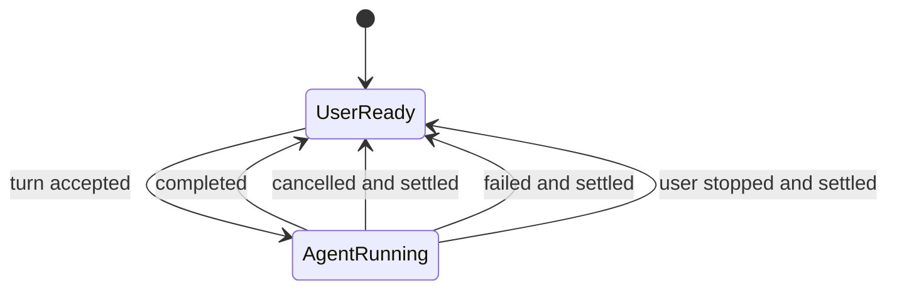
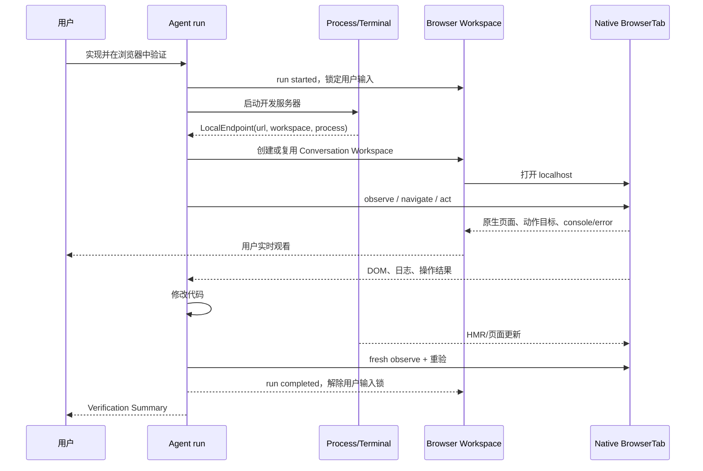
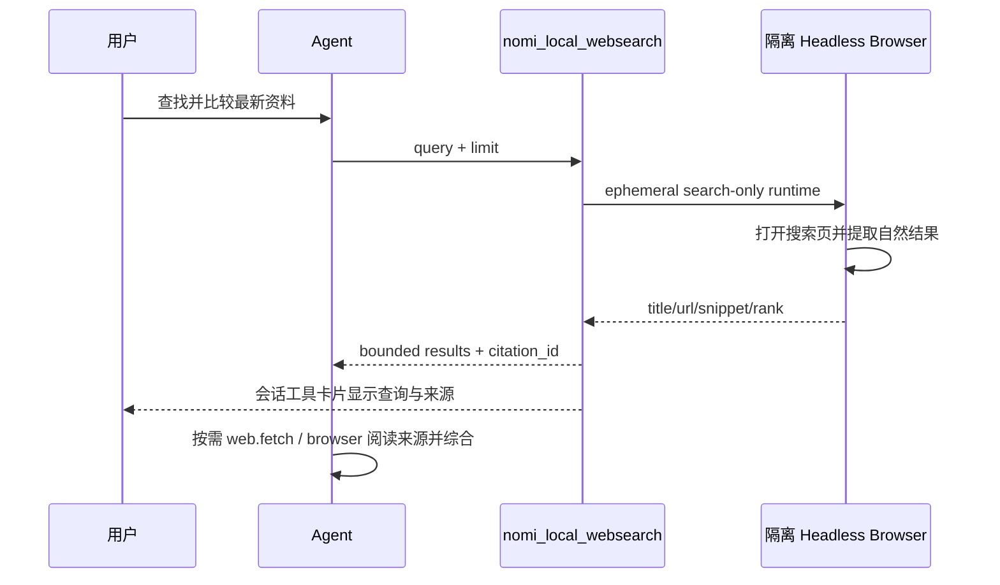
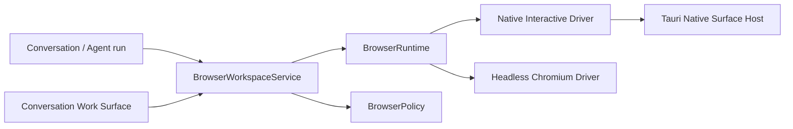
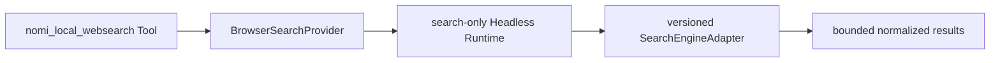

# Browser Workspace v2：会话内真实内嵌浏览器产品与技术设计

> 状态：**WINDOWS DELIVERED / MACOS HANDOFF READY**
>
> 修订日期：2026-09-16
> macOS 内核已获用户批准改为独立 CEF child NSView；Windows 保留 WebView2。
> 见[平台架构决策](../continuity/2026-09-16-browser-platform-architecture-decision.zh.md)。本决策不代表 Mac 验收通过。
>
> 适用分支：`rf/agent-capability-platform-v2`
>
> 本文是 Browser Engine / Embedded Surface 的目标 ADR。当前已实现行为仍以
> `docs/architecture/browser-platform.zh.md` 为准；实施硬切换后再改写当前架构文档。

## 0. 最终产品决定

本次重构建立 Browser Platform v2，不恢复旧 Browser Viewer，也不在旧 Browser 管理页上继续叠加功能。

以下决定已经冻结：

范围修订（2026-09-14，用户明确纠正）：前端测试是 Agent 底层能力，不是新增用户产品。Agent 自行打开应用内浏览器、
观察页面并模拟鼠标键盘操作，用户无需进入测试模式或配置测试面板。本次不建设浏览器底部终端、控制台、问题或测试步骤
面板；现有聊天工具记录与既有终端产品保持原有职责。下文以本次修订为准。

范围修订（2026-09-15，用户明确补充）：必须并存另一套独立的**系统浏览器操作能力**，连接用户正在使用、
已经登录的真实浏览器会话。不是启动独立 Profile 的外部 Chrome，不是导入 Cookie/密码，也不是内嵌浏览器的
模式切换。此能力在 Agent 工作台独立选择；详见 [系统浏览器补充设计](2026-09-15-system-browser.zh.md)。
以下 Workspace、原生输入门、新 Profile 和生命周期约束，除明确说明外只约束内嵌浏览器，不能拿来要求用户
重启、搬迁、重新登录自己的系统浏览器。新增能力未完成前，不因内嵌重构而误删系统浏览器连接能力。

范围修订（2026-09-16，用户明确裁决）：DevTools 可视面板不是当前必交付产品功能。本期不建设 F12/
Inspect 菜单、独立 DevTools 窗口归属或用户设置；保持未受管理的入口关闭。这不删除内部使用的
WebView2 DevTools Protocol 运输，它是观察、输入与生命周期实现细节，不是用户可见 DevTools 产品。
网络边界保留，但只实现必要的目标校验与会话归属，不建设通用代理管理平台或用户配置面板。

1. Tauri Desktop 的 Browser Workspace 使用**真实原生 child WebView**。网页直接由 WebView2、CEF 或
   WebKitGTK 渲染；不使用 JPEG/PNG 连续帧、screencast、canvas 远程控制或 iframe。
2. 用户看到的 BrowserTab 就是 Agent 操作的 BrowserTab。相同 URL、复制 cookie 或同步导航都不算同一实例。
3. `browser.act` 的点击、悬停、键盘、滚轮与拖拽必须进入**同一个 BrowserTab 的浏览器输入管线**；DOM 只用于
   观察、定位和高亮，不用 `element.click()`、`dispatchEvent()` 或直接改 `value` 冒充用户操作。用户看到 Agent
   光标移动和控件真实响应。
4. 一个 Conversation 拥有一个 Browser Workspace；Workspace 可以包含多个真实 Page Tab。
5. Browser Workspace 是当前 Conversation 的公开工作表面，不是个人隐私浏览器。Agent 运行时可以读取和操作
   该 Workspace 的全部 Tab；未另行授权的系统浏览器及其标签页不在这个权限范围内。
6. 在内嵌 Browser Workspace 中，用户和 Agent **绝不同时操作浏览器**。没有“用户接管”“交还控制”“控制租约”或运行中共享流程：
   - Agent 未运行时，用户可以完整操作；
   - Agent 运行时，用户只能观看，原生输入被锁定；
   - Agent 完成、取消、失败或被用户停止且当前原子动作已终止后，用户输入自动恢复。
7. Agent 遇到登录、验证码或需要用户判断的步骤时，结束当前 turn 并说明用户需要做什么。用户操作完成后发送
   新消息开启下一 turn；不暂停旧 turn 等待用户，也不恢复旧执行栈。
8. Conversation 中的内嵌 Browser Use 使用 Native Interactive Runtime；Knowledge、crawl、后台 automation
   使用 Headless Runtime。独立系统浏览器能力只附着用户授权的既有浏览器会话。三者按能力/消费者确定性分流，
   不根据错误自动换目标，不在运行中迁移页面。
9. `nomi_local_websearch@1.0.0` 是 Agent 工作台中可选的 NomiFun 本地浏览器检索能力，Agent Tool 名也固定为
   `nomi_local_websearch`。它始终由隔离的 Headless Browser Search Provider 执行，不占用、不读取 Conversation
   Browser，也不覆盖模型厂商的 `web_search` / Catalog `web.search`。
10. Browser 不再拥有独立的全局用户产品入口。删除 `/browser` 页面、Browser 主侧栏入口和旧 Browser Settings。
   Agent 能否使用 Browser 由 Agent 工作台配置；站点数据、下载和系统浏览器打开从会话 Browser 菜单管理；
   进程与资源细节进入统一 Help/Diagnostics。
11. 不新增数据库表，不执行数据库迁移，不导入旧 Browser Profile。内嵌 v2 使用全新 profile 根目录；选择内嵌
   浏览器时登录保存在其独立 Profile。用户可通过独立系统浏览器能力使用原有登录态，不强迫迁移或重新登录。
   内嵌 Browser Tab 首版不跨应用重启恢复；系统浏览器的现有标签由用户浏览器自身持有。
12. 不提供生产期 v1/v2 双写、旧 DTO alias、旧 route redirect、旧配置迁移或 fallback。开发期可以用 feature flag
    验证 v2；生产切换时物理删除 v1 产品路径。
13. Windows 是第一个完整交付平台。按 2026-09-14 用户确认，当前先完成 Windows 的实现与验收；macOS 先记录
    平台差异、实施任务与验收清单，待 Windows 完成后由用户转交 Mac 环境执行，不作为当前 Windows 交付的阻塞项。
    macOS 仍是后续跨平台正式目标，Linux 允许后置。各平台只有通过同一 native conformance 后才声明可用，
    不将 Windows 证据视为 macOS 证据，不以帧流或 DOM synthetic 降级。

一句话产品定义：

> Browser Workspace 是 Conversation 里的真实浏览器。Agent 工作时用户观看；Agent 停止后用户使用；下一次
> Agent 运行从同一页面 fresh observe 并继续。

## 1. 为什么这样设计

### 1.1 最简单的控制模型

浏览器是否允许用户输入，直接由 Conversation 的权威 Agent run 状态派生：



只有两个产品状态：

- `UserReady`：用户可以操作，Agent 没有浏览器执行权；
- `AgentRunning`：Agent 可以操作，用户只能观看。

不再创建以下概念：

- HumanControlLease；
- takeover/return-control；
- AttentionRequest service；
- user-private/shared-with-agent Tab；
- per-origin share grant；
- viewer token、frame token、heartbeat；
- 暂停旧 Agent run 等待用户再恢复。

这样控制权不需要第二套状态源，不会与 AgentSession run 状态漂移。

### 1.2 开放能力来自清晰边界，不来自复杂授权 UI

Browser Workspace 对当前 Conversation 内的用户和 Agent 都开放：

- 用户可自由输入 URL、开关 Tab、前进后退、刷新、选择文字、上传下载；
- Agent 可在运行时使用全部 Tab、DOM、console、page error、network 摘要和浏览器动作；
- 用户可以观看 Agent 的真实操作过程；
- Agent 停止后页面、History、表单、HMR 和登录状态仍在；
- 用户手动操作页面后，下一 turn 对同一页面 fresh observe 并从新状态继续。

安全边界放在 Conversation、Agent run、Profile、egress 和 Tauri capability 上，而不是要求用户管理 Lane、Host、
共享令牌或控制租约。

### 1.3 借鉴的产品原则

OpenAI 的官方浏览器产品说明把浏览器定义为 Agent 可直接打开页面、点击、输入、检查渲染状态并验证结果的
工作表面；Preview 流程把开发服务器、真实页面、代码修改与页面评论连成一个闭环：

- [OpenAI 官方浏览器文档](https://learn.chatgpt.com/zh-Hans/docs/browser)

VS Code 官方 Browser Tools 把“改代码 → 启动服务 → 集成浏览器操作 → 读取页面与 console → 修复 → 重验”作为
连续反馈闭环；localhost 链接、浏览器 Tab、页面元素反馈和 Agent Browser Tools 都在工作台中完成：

- [VS Code Browser Tools](https://code.visualstudio.com/docs/agents/run/browser-tools)
- [VS Code Integrated Browser](https://code.visualstudio.com/docs/debugtest/integrated-browser)

NomiFun 借鉴的是这些产品可被用户观察和验证的行为，不推断或复制未公开内部实现，也不引入超出本产品需要的
浏览器账户与隐私模型。

## 2. 产品目标与非目标

### 2.1 第一目标：前端开发与自动化验收

用户可以要求 Agent：

> 实现这个页面，启动开发服务器，在浏览器中走完注册流程；发现问题就修复，然后重新验证。

Agent 应在同一个 Conversation 内完成：

1. 修改代码；
2. 启动或发现开发服务器；
3. 在真实 Browser Workspace 打开页面；
4. 读取 DOM/可访问语义、console、page error 和必要的 network 结果；
5. 点击、输入、滚动、拖拽、处理 dialog；
6. 用户实时看到 Agent 在页面中的动作；
7. Agent 修复代码，复用同一个页面与 HMR 状态重新验证；
8. 最后输出来源于真实步骤的 Verification Summary。

### 2.2 第二目标：舒适的顺序式人机协作

- Agent 运行时不抢出一个外部 Chrome 窗口，用户在 Conversation 旁边观看；
- 用户想手动操作时，先停止 Agent；停止完成后 Browser 自动解锁；
- Agent 需要登录时结束 turn，用户直接在同一 BrowserTab 登录，再发送“继续”；
- 下一 turn 不恢复旧调用栈，只读取同一页面的新状态；
- 用户手动验证或修改页面状态后，可以把页面、元素或错误加入聊天。

### 2.3 第三目标：让任意模型获得可选网页检索

Agent 工作台提供一个明确的 `Nomi 本地网页搜索` 能力。用户启用后，即使当前模型没有原生 `web_search`
feature，Agent 仍能调用独立的 `nomi_local_websearch` 工具，获得结构化且可引用的公开网页结果。该能力：

- 默认不打开或污染 Conversation BrowserTab；
- 不读取用户的 Workspace Browser cookie、登录态或 History；
- 搜索结果可从工具卡片打开到会话 Browser 继续阅读；
- 与 `web.fetch` 分工：search 发现来源，fetch/Browser 读取来源；
- 对自定义 Agent 默认关闭，由用户或官方模板在 Agent 工作台显式选择。

### 2.4 非目标

- 不做 Chrome 替代品：首版没有书签同步、扩展商店、密码管理器或个人浏览历史中心；
- 不提供手机/平板布局。本仓库仍只支持最小 880x600 的桌面界面；
- 不在 Desktop WebUI 中用 iframe 或视频流模拟本地 Browser Workspace；
- 不把 raw CDP endpoint、debug port、profile path 或 browser process secret 暴露给 renderer；
- 不自动扫描本机端口；服务 URL 必须来自明确导航、用户点击或受信任的 Process/Terminal endpoint 事件；
- 不在 Agent 运行中允许用户点击页面，即使某次 Agent 暂时没有调用 Browser；
- 不跨应用重启恢复 Tab；persistent profile 只保留网站数据与登录态；
- 连续呈现不用 screenshot。Agent 可以显式截取单张 PNG 作为测试证据，它不是 Browser Surface。
- 不把 Search Engine 结果页完整 HTML、广告、追踪链接或登录 cookie 直接交给模型；
- 不在首版提供一组搜索引擎切换、代理参数和抓取并发等高级设置。

## 3. 核心产品流程

### 3.1 Agent 构建并验证前端



规则：

- Agent run 一旦被接受，当前 Conversation 的 Browser 输入立即锁定；不等到第一次 Browser tool call 才锁，
  避免用户输入与稍后到达的 Agent action 竞态；
- Agent 目标元素在真实页面内短暂高亮，顶栏只显示简短动作，例如“正在填写邮箱”；
- 不为了让用户看清而强制给 Agent action 加延迟；工具调用沿用现有会话记录，不新增过程面板；
- HMR 不重建 Tab；开发服务器重启时显示可恢复错误并允许 Agent reload；
- Agent 结束后 Browser 保持原页面并自动进入 `UserReady`。

### 3.2 用户停止 Agent 后操作

1. Agent 运行时，NativeInputGate 拦截网页区域的鼠标、键盘、拖放和触摸板输入；
2. 用户点击网页区域时只显示轻量提示：“Agent 正在操作，停止后即可手动使用”；
3. 用户点击已有的 Stop Agent 控件；
4. AgentSession 发出 cancel，Browser Workspace 继续保持 locked；
5. 当前原子 Browser action 完成取消/清理并收到权威 run terminal 事件；
6. NativeInputGate 解除，浏览器获得用户焦点；
7. 用户直接操作原生 WebView。

“点击 Stop”不等于已经可操作；只有 cancel settle 后才解锁。不存在把一次正在执行的点击从 Agent 手里抢走的路径。

### 3.3 Agent 需要用户登录或判断

1. Agent 发现无法继续；
2. Agent 用正常最终消息说明当前页面和需要用户完成的操作；
3. 当前 turn 完成，Browser 自动解锁；
4. 用户登录、验证或调整页面；
5. 用户发送“继续”或新的目标；
6. 新 turn 开始，Browser 再次锁定用户输入；
7. Agent 对同一 BrowserTab fresh observe 后继续。

不创建 `request_attention` Browser capability。需要用户时结束 turn 是 AgentSession 的普通产品语义，浏览器无需
维护另一套 waiting/resume 状态。

### 3.4 用户先浏览，再让 Agent 工作

1. Agent 未运行，用户在 Browser Workspace 中打开页面并自由操作；
2. 用户在 Chat 输入任务并发送；
3. turn accepted 后 Browser 立即失去用户输入焦点并显示 `Agent 正在操作`；
4. Agent 可以访问该 Conversation Browser 的全部 Tab；
5. Agent fresh observe 当前 Tab，执行任务；
6. turn terminal 后用户重新获得操作能力。

启动 Agent 就表示授权它使用当前 Conversation Browser。UI 在 Browser 空状态和第一次使用时明确说明这一点，
不再增加“共享给 Agent”按钮。

### 3.5 沿用现有会话交互

用户继续使用普通聊天与已有附件入口。页面观察、元素定位、诊断与必要的截图由 Agent 按任务调用底层能力；
不新增元素评论、日志选择、测试结果或“添加测试上下文”产品流程。不得自动附加完整 DOM、network body、cookie、
表单值或页面 secret。

### 3.6 Agent 使用 Browser Web Search



规则：

- 用户只在 Agent 工作台启用 `Nomi 本地网页搜索`，模型看到唯一的 `nomi_local_websearch` 工具；
- 搜索 Worker 没有 native Surface，不创建会话 Page Tab，也不触碰 Workspace Profile；
- Search 只发现 URL 与摘要。Agent 需要正文时调用 `web.fetch`，动态页面再用被授权的 Browser 能力；
- 用户点击来源时，才把 URL 打开到会话 Browser 或系统浏览器；工具执行本身不抢占中央 Work Surface；
- CAPTCHA、consent wall、blocked 与结果结构漂移返回明确错误，不伪装成“0 条结果”。

## 4. 产品 UI 交互设计

### 4.1 Conversation Workbench 布局

当前 `ChatLayout` 的“Chat + Preview + Workspace Rail”升级为 `ConversationWorkbenchShell`：

| 区域 | 内容 | 默认行为 |
| --- | --- | --- |
| 左侧主区 | Chat、消息、审批、输入框 | 始终存在 |
| 中央 Work Surface | Browser、文件 Preview、Diff | 按活动打开，可拖拽调整 |
| 右侧 Rail | Files、Changes、Knowledge、协作 | 空间不足时优先折叠 |

Browser 不进入 `WorkspaceExtraTab` 的窄右栏。它属于中央 Work Surface，拥有固定、不可滚动的 native slot。

布局只按容器宽度变化：

- 空间足够时 Chat 与 Work Surface 默认约 48:52；
- 无法容纳 360px Chat、520px Browser 和间距时先折叠右 Rail；
- 仍不足时进入桌面 Focus 模式，在 Chat 与 Work Surface 间切换；
- Focus 隐藏 Chat 时，现有聊天 Stop 控件移入会话标题栏，保留同一停止回调与等待状态；用户无需先收起浏览器才能停止 Agent；
- 不新增低于 880px 的 viewport breakpoint、移动 drawer 或 touch-only UI。

默认桌面形态：

```text
┌──────────────── Chat ───────────────┬──────────── Work Surface / Browser ────────────┬── Rail ──┐
│ messages / approvals                │ [Tab] [Tab] [+]                  Agent 正在操作 │ Files     │
│                                     │ [←][→][↻]  http://localhost:3000               │ Changes   │
│                                     ├────────────────────────────────────────────────┤ Knowledge │
│                                     │                                                │           │
│                                     │          真实 native BrowserTab                │           │
│                                     │       ○ Agent cursor + target ring             │           │
│                                     │                                                │           │
│ composer                            │                                                │           │
└──────────────────────────────────────────────────────────────────────────────────────────────────┘
```

### 4.2 Browser 结构

Browser Workspace 从上到下保持简单：

1. Page Tab strip：favicon、标题、加载/崩溃状态、关闭和 `+`；
2. Navigation bar：后退、前进、刷新/停止、地址栏、localhost/安全状态；
3. 单个状态区：`可手动操作` 或 `Agent 正在操作`；
4. Native WebView slot。

不附加测试工具区或浏览器内的第二套侧栏。

使用 Workbench 既有 Focus 切换与关闭 Work Surface；不提供弹出/归位窗口。
会话内嵌页面始终属于当前工作台，避免为 reparent 引入第二套窗口生命周期。

### 4.3 Agent 运行态

Agent 运行时：

- Browser 顶栏显示一个紧凑状态 pill 和 Agent 名称；
- 地址栏、Tab 新建/关闭、导航按钮和网页原生输入全部 disabled；
- 用户仍可选择 Work Surface、停止 Agent；
- 页面内显示 Agent 当前 target highlight；
- 如果 Agent 操作的是后台 Tab，UI 自动跟随，除非用户已手动固定当前 Tab；此时只显示目标 Tab 活动 badge；
- 用户点击被锁网页时不弹 Modal，只出现短暂 inline 提示并指向 Stop Agent。

Agent 完成后：

- 状态 pill 切换为 `可手动操作`；
- 所有浏览器原生输入和 toolbar 立即恢复；
- Agent 最后动作高亮淡出；工具结果仍在普通会话记录中；
- 页面、History、表单与 HMR 状态不改变。

### 4.4 Browser 菜单

Browser `…` 菜单承载低频操作：

- 在系统浏览器打开当前 URL；
- 清除此会话的站点数据（确认后关闭该会话网页，再清理登录态、站点存储和缓存；不影响其他会话）；
- 打开下载目录；
- 复制页面地址；
- 关闭全部 Page Tab。

不在菜单中暴露 Host、Lane、CDP、内存阈值、并发策略或 Browser 来源选择。

### 4.5 空状态与自动打开

Browser 空状态提供：

- 地址输入；
- 简短说明：“此浏览器属于当前会话；启动 Agent 后，Agent 可以读取和操作其中的页面。”

自动打开规则：

- 用户点击 Chat 中的 localhost 链接：打开 Work Surface 并聚焦地址栏或页面；既有独立终端产品不因本需求改变；
- Agent 首次打开页面：按用户最近一次 Work Surface 显示习惯展开，但不夺走 Chat 输入焦点；
- Agent Browser action 已经在后台运行：Browser tab 显示 activity badge；
- 浏览器错误：显示 badge，不强行展开；
- 没有独立全局“Browser 显示模式”设置。

### 4.6 不新增测试工作台

浏览器底部不设任何测试工具区。启动服务继续使用已有 Agent Process/Terminal 能力；读取页面、模拟输入及检查结果
由 Agent 自动完成。诊断信息只作为 Agent 内部观察数据，不向 renderer 推送诊断面板数据，不据诊断事件刷新 UI。
不得为本需求新增终端嵌入、问题列表、控制台面板、测试步骤或专门测试模式。

### 4.7 Agent 工作台中的网页搜索

`nomi_local_websearch` 必须出现在现有 Agent 工作台的 `网页` 分类中，而不是 Browser 菜单、模型设置或全局设置：

```text
网页

□ Nomi 本地网页搜索
  使用本机隔离浏览器搜索公开网页并返回可引用来源；不要求模型原生支持联网搜索。
  可用 · Nomi 本地浏览器
```

产品规则：

- 新建自定义 Agent 默认不选中；用户加入“已启用能力”后才写入 Preset；
- 当前 `AgentCapabilityWorkspace` 的能力移动/勾选交互继续使用，不新造 Browser Settings 页面；
- 详情只解释数据范围、当前解析出的实现和“不使用会话登录态”，不展示 selector、engine flags 或并发参数；
- 首版不提供 provider 下拉；这个能力按定义固定使用 BrowserSearchProvider，Snapshot 只冻结具体 Runtime 与
  SearchEngineAdapter 版本；
- Browser Search Runtime 不可用时，该能力显示 unavailable 并阻止保存，不因换模型而改变实现；
- 搜索工具卡片显示 query、耗时、结果数和来源列表；`打开`只是一个普通 URL 动作，不在卡片里嵌套小浏览器。

会话里的完成态工具卡片保持可扫描：

```text
🌐 Nomi 本地网页搜索                            1.8s
“Tauri child webview input handling”              5 个结果

1  Tauri Webview API                         tauri.app   打开
2  WebView2 DevTools Protocol                microsoft…  打开
3  …

由 Nomi 本地隔离浏览器检索 · 未使用会话登录态
```

运行中只显示当前 query 与 spinner；失败原位显示可理解的 challenge/timeout 文案和“重试”动作，不弹全局 Modal。

## 5. 当前代码现状与取舍

### 5.1 当前产品边界不适合继续扩张

当前 `/browser` 明确只管理 Lane/Host、身份、资源和设置，不渲染页面、不提供页面输入：

- `docs/architecture/browser-platform.zh.md`
- `ui/src/renderer/pages/browser/index.tsx`
- `ui/src/renderer/pages/browser/BrowserLaneDetails.tsx`

当前 URL Preview 使用 `WebviewHost.tsx` 中的 sandboxed iframe。它不是 Agent 使用的受管浏览器实例，不能共享
target、DOM、History 或可靠跨域状态，因此必须退出 URL 浏览器用途。

### 5.2 当前所有权方向需要翻转

当前主链：

```text
Agent runtime/attempt
  -> BrowserLaneClientProvider
  -> renewable owner lease
  -> BrowserSessionHub
  -> Host / Lane / Chromium target
```

runtime revoke 和 turn cleanup 会关闭 Lane。这适合后台工具，不适合一个在多个 turn 之间由用户和 Agent 顺序使用
的 Conversation Browser。

v2 主链：

```text
Conversation BrowserWorkspace
  -> BrowserRuntime
  -> BrowserTabRuntime[]

Agent run 只获得临时 BrowserRunGuard
User input 只在没有 BrowserRunGuard 时启用
```

### 5.3 `BrowserSessionHub` 不继续膨胀

当前 `crates/backend/nomifun-browser-platform/src/hub.rs` 同时承担 Host、Lane、调度、资源、owner lease、身份、
profile、restart、visibility、cleanup、inventory 和 events。不能再把 native Surface、UI 输入、Conversation
生命周期和测试反馈放进去。

v2 保留 crate，删除大一统 Hub 公共模型，并拆成小模块；不为了形式建立一组互相 RPC 的“微服务”。

### 5.4 保留的优秀资产

以下能力被抽取到 v2：

- injected script、ARIA snapshot、ref generation、actionability 与动作语义；
- stale ref、target/frame 生命周期和 observe/act 串行；
- URL/egress、prompt-injection 包装、secret redaction；
- 下载沙箱、文件限制和任务级预算；
- profile ownership、process identity、父死清理和 exact cleanup proof；
- ephemeral/persistent/replica 的隔离思想；
- scheduler、结构配额、资源压力和背压；
- Agent Capability Platform v2 的 exact Role Provider lock；
- 真实 Chromium fixtures 与安全回归。

### 5.5 历史 Viewer 只吸收不变量

旧 Viewer 中 one-shot token、generation、防过期输入、断线释放按键等思想是正确的，但其 JPEG/screencast、
viewer WebSocket、显示模式和接管状态机不适合本产品方向。

v2 不恢复任何 Viewer 文件或协议；native Surface 无帧传输，因此 frame token、viewer heartbeat 和 canvas 输入
整体消失。

### 5.6 当前输入引擎有好地基，但还不是完整用户操作

`crates/agent/nomi-browser-engine/src/input.rs` 已实现基于 `DOM.getContentQuads` 的坐标取点以及 CDP
`mousePressed/mouseReleased`、`mouseMoved`、`dispatchKeyEvent` 和 `insertText`；这是应保留的真实输入基础。

但 v1 仍有必须删除或改写的路径：

- `ActMode::Force` 的设计允许通过 DOM `dispatchEvent` 绕过浏览器输入；
- `SetValue`/部分 fill 与 select 路径直接改 DOM 值并补事件；
- viewport scroll 为追求确定性使用 `window.scrollBy`，没有真实 wheel 语义；
- `ActSpec` 没有完整 double-click、right-click、pointer drag/drop 合同；
- 输入事件没有统一的 fidelity/result 字段，用户无法区分真实输入和 DOM 快捷路径。

v2 不把这些兼容分支带进 Native Interactive Runtime。语义定位、重试与脱敏保留；所有用户级动作统一走
`BrowserInputDriver`。低保真 DOM mutation 只允许显式 `browser.evaluate`，不得伪装成 `browser.act` 成功。

### 5.7 当前只有模型原生 `web.search`，不应把它改造成另一种能力

现状已经存在 `web.search` Catalog 能力和 `web_search` Tool，其执行链明确是 provider-native：

- `nomi_core_agent_projection.rs` 要求 exact Chat route 必须是 OpenAI Responses 且声明 `web_search`；
- `factory/nomi.rs` 对其他模型返回 unsupported；
- `web_search_provider.rs` 明确只接受获得授权的模型 Provider；
- planner/participant router 的 `needs_web_search` 表示必须选择具备模型原生搜索的 route。

这些约束对“模型原生网页搜索”本身是自洽的。问题是系统缺少一个由 NomiFun 本地 Browser 执行、且不依赖模型
feature 的独立能力。v2 不再改写 `web.search` 的身份或复用其 `web_search` Tool 名，而是新增
`nomi_local_websearch`。两者在 Catalog、Tool Registry、Snapshot 和 Agent 工作台中保持不同身份，从源头避免
provider/tool 命名冲突。

## 6. 简化后的目标架构

### 6.1 只有三个核心边界



1. `BrowserWorkspaceService`
   - 每个 Conversation 一个 Workspace；
   - 管理 Page Tab、active Tab、run guard、generation、生命周期和 UI snapshot；
   - 是唯一业务入口。
2. `BrowserRuntime`
   - 统一创建/关闭 Tab，提供 automation 与可选 native Surface；
   - first-party 实现只有 Native Interactive 和 Headless Chromium 两类。
3. `BrowserPolicy`
   - 集中处理 URL/egress、Profile、权限、下载、上传和敏感数据；
   - 不保存 UI 状态。

调度、资源与 cleanup 是 `BrowserWorkspaceService` 的内部模块，不建立额外产品对象或独立服务 API。

### 6.2 BrowserWorkspace 聚合

概念合同：

```rust
struct BrowserWorkspace {
    conversation_id: ConversationId,
    provider: ExactRoleProviderRef,
    runtime: Arc<dyn BrowserRuntime>,
    profile: BrowserProfileRef,
    tabs: Vec<BrowserTab>,
    active_tab_id: Option<BrowserTabId>,
    active_run: Option<BrowserRunGuard>,
    runtime_generation: u64,
    revision: u64,
}

struct BrowserRunGuard {
    agent_session_id: AgentSessionId,
    run_id: AgentRunId,
    cancellation: CancellationToken,
}

struct BrowserTab {
    id: BrowserTabId,
    runtime_tab: Arc<dyn BrowserTabRuntime>,
    title: Option<String>,
    url: Option<Url>,
    lifecycle: BrowserTabLifecycle,
    document_generation: u64,
    observation_generation: u64,
}
```

不保存 `control_owner`：

```text
active_run.is_some()  -> Agent 可操作，用户输入锁定
active_run.is_none()  -> Agent 操作拒绝，用户输入开放
```

`BrowserRunGuard` 必须由 AgentSession 的权威 run lifecycle 创建和 RAII 释放。前端按钮、Browser tool JSON 和页面
脚本都不能创建或移除它。

Workspace 在首次创建时冻结 exact Browser Provider。后续 turn 必须使用同一个 Provider lock；如果用户为该
Conversation 换了不兼容的 Agent/Provider，系统明确要求关闭并重建 Browser Workspace，不迁移 live Tab，也不
静默切回 first-party Runtime。通常一个 Conversation 的 AgentSession/Provider 不变，因此普通使用没有额外 UI。

用户先手动打开浏览器、尚未有 Agent Browser Provider 的情况下，Workspace 可以先保持未绑定；首次解析到
已验证 Snapshot 的 Browser Provider 时原子绑定。未绑定不授予任何 Agent 操作权限，也不填入默认 Provider
字符串。用户再次打开面板不会解除已有绑定；其余 exact lock 与重建规则保持不变。

### 6.3 generation

- `runtime_generation`：该 Conversation BrowserRuntime 重建时递增；
- `document_generation`：navigation、crash restore 或文档替换时递增；
- `observation_generation`：Agent observe 产出 ref 时递增；
- `run_id`：确保旧 turn 的迟到 action 不能进入新 turn。

Agent operation 必须同时匹配 conversation、run、tab、runtime/document/observation generation。用户原生输入不
经过这些 token，但只有 `active_run == None` 时 NativeInputGate 才允许输入。

## 7. Runtime 合同

### 7.1 新接口

当前 `BrowserHostFactory/BrowserHostDriver/BrowserLaneDriver` 过度绑定外置 Chromium Host/Lane。v2 改为：

```rust
#[async_trait]
trait BrowserRuntimeFactory: Send + Sync {
    async fn create(
        &self,
        request: CreateBrowserRuntime,
    ) -> Result<Arc<dyn BrowserRuntime>, BrowserError>;
}

#[async_trait]
trait BrowserRuntime: Send + Sync {
    fn capabilities(&self) -> BrowserRuntimeCapabilities;
    fn subscribe(&self) -> BrowserRuntimeEventReceiver;
    async fn create_tab(
        &self,
        request: CreateBrowserTab,
    ) -> Result<Arc<dyn BrowserTabRuntime>, BrowserError>;
    async fn close_tab(&self, tab_id: &BrowserTabId) -> Result<(), BrowserError>;
    async fn close(&self) -> Result<RuntimeCloseProof, BrowserError>;
}

trait BrowserTabRuntime: Send + Sync {
    fn tab_id(&self) -> BrowserTabId;
    fn automation(&self) -> Arc<dyn BrowserAutomationPort>;
    fn surface(&self) -> Option<Arc<dyn BrowserNativeSurfacePort>>;
}

#[async_trait]
trait BrowserNativeSurfacePort: Send + Sync {
    async fn set_bounds(&self, bounds: LogicalRect) -> Result<(), BrowserError>;
    async fn set_visible(&self, visible: bool) -> Result<(), BrowserError>;
    async fn set_input_enabled(&self, enabled: bool) -> Result<(), BrowserError>;
    async fn focus(&self) -> Result<(), BrowserError>;
    async fn reparent(&self, target: SurfaceTarget) -> Result<(), BrowserError>;
}

#[async_trait]
trait BrowserInputDriver: Send + Sync {
    async fn pointer_move(&self, at: CssPoint) -> Result<(), BrowserError>;
    async fn pointer_button(
        &self,
        at: CssPoint,
        button: PointerButton,
        phase: ButtonPhase,
        click_count: u8,
    ) -> Result<(), BrowserError>;
    async fn wheel(&self, at: CssPoint, delta: CssVector) -> Result<(), BrowserError>;
    async fn key(&self, event: BrowserKeyEvent) -> Result<(), BrowserError>;
    async fn insert_text(&self, text: SecretString) -> Result<(), BrowserError>;
    async fn cancel_pressed_input(&self) -> Result<(), BrowserError>;
}
```

Automation 与 Surface 来自同一个 `BrowserTabRuntime`。一个 Page Tab 对应一个真实 WebView；隐藏 Tab 只 hide 或
suspend，不能按 URL 重建。`BrowserAutomationPort` 使用同一个 Tab 的 `BrowserInputDriver`，而不是自己执行 DOM
click。Headless Chromium 与 Native WebView 可以有不同 Driver，但动作状态机、输入语义和结果合同一致。

### 7.2 两类 Runtime

| Runtime | 使用者 | Surface | Profile | 生命周期 |
| --- | --- | --- | --- | --- |
| `NativeInteractive` | Conversation 主 Agent run 与用户 | 必须 native | Conversation persistent 或 ephemeral | Conversation/app |
| `HeadlessAutomation` | Knowledge、Web Search、crawl、scheduled、delegated/background Agent | 无 | ephemeral/replica | operation/owner |

确定性路由：

- Tauri Conversation 的主 Agent Browser 能力 → 该 Conversation 的 NativeInteractive Workspace；
- Knowledge `render_content` → HeadlessAutomation；
- `nomi_local_websearch` 的 BrowserSearchProvider → search-only HeadlessAutomation；
- scheduled/headless consumer → HeadlessAutomation；
- delegated/并行 Agent 不控制可见 Workspace，使用 HeadlessAutomation；
- Desktop WebUI 不创建 NativeInteractive；
- 不根据 URL、模型文字或运行中错误自动换 Runtime。

一个 Conversation 同时只允许一个主 Agent run 使用可见 Browser。并行 Agent 不能争夺它；如果任务必须在可见
浏览器完成，由主 Agent 串行执行。

### 7.3 服务模块

`nomifun-browser-platform` 保留，但删除单体 `hub.rs`，目标结构：

```text
nomifun-browser-platform/src/
├── workspace.rs          # aggregate + command service
├── run_guard.rs          # Agent run admission/settle
├── runtime.rs            # Runtime/Tab traits + registry
├── policy.rs             # URL/egress/permission/download/upload
├── identity.rs           # profile + replica
├── resource.rs           # 内部 governor
├── scheduler.rs          # headless 与 operation admission
├── cleanup.rs            # exact close proof/retry
├── event.rs
├── projection.rs
└── error.rs
```

不拆 `AccessService`、`ControlArbiter`、`AttentionService`、`Browser Center Service` 或 Browser Event Store。
Workspace state 在内存中，事件只用于实时投影与 resync。

## 8. Tauri 原生 WebView 实现

### 8.1 统一选择

Interactive Runtime 基于 Tauri multi-webview：主 React WebView 绘制 Browser chrome，网页由同一主窗口里的第二个
native child WebView 渲染。Tauri 提供 child WebView 的创建、定位、resize、hide/show 和 reparent：

- [Tauri Webview JavaScript API](https://v2.tauri.app/reference/javascript/api/namespacewebview/)
- [Tauri WebviewBuilder](https://docs.rs/tauri/latest/tauri/webview/struct.WebviewBuilder.html)

平台路径：

| 平台 | 原生引擎 | Agent 自动化 | 交付条件 |
| --- | --- | --- | --- |
| Windows | WebView2 | WebView2 CDP + shared semantic core | 首个完整交付平台 |
| macOS 14+ | CEF child NSView（2026-09-16 用户确认） | 独立 Mac 宿主、CEF 公开输入/协议接口 | conformance 通过后开启；Windows 仍使用 WebView2 |
| Linux | WebKitGTK | WebKit automation/script world + GTK input | X11/Wayland 分别通过后开启 |
| Desktop WebUI | 宿主浏览器 | 无 arbitrary-site child WebView | 明确 unavailable |

CEF 不进入 first-party 基线。只有系统 WebView 无法达到冻结的 conformance，且产品明确接受包体和独立 Chromium
升级成本时，才重新裁决 Interactive Runtime。若选择 CEF，它应替换相应平台的 Interactive Provider 并重新跑
完整 conformance，不能作为某些动作失败时偷偷启用的第二浏览器或长期双栈。

### 8.2 Tauri 依赖与封装

`WebviewBuilder` 当前属于 Tauri `unstable` feature：

- 只在 `apps/desktop` 启用；
- 固定 Tauri Rust、CLI 与 JS API 的兼容 minor；
- Tauri/Wry/platform handle 只出现在 `apps/desktop/src/browser_surface/`；
- Browser domain 与 Agent crate 不依赖 Tauri；
- API 变化只替换 Desktop Surface Adapter。

新增：

```text
apps/desktop/src/browser_surface/
├── mod.rs
├── host.rs
├── commands.rs
├── bounds.rs
├── input_gate.rs
├── security.rs
├── events.rs
├── windows.rs
├── macos.rs
└── linux.rs
```

在 Tauri `.setup` 中创建 `DesktopBrowserHostPort`，再作为显式 host dependency 传给后台
`DesktopServer::start_with_outcome`。禁止 backend 通过全局 OnceCell 反向查找 `AppHandle`。

后台运行在独立 Tokio thread。所有 WebView create/resize/focus/reparent 和 platform callback 通过有界 channel
调度到 Tauri main thread，并用 oneshot 返回。创建命令必须 async；当前 desktop 已记录 Windows 同步创建 WebView
可能 deadlock，这一纪律继续沿用。

### 8.3 Native slot

Renderer 的 `BrowserNativeSlot`：

1. 用 `ResizeObserver` 观察固定矩形；
2. requestAnimationFrame 合并 resize，只发送最新 logical bounds；
3. 携带 window label、tab id 和 slot generation；
4. Desktop Host 丢弃过期 bounds；
5. Work Surface 隐藏、切换到 Preview/Diff、窗口最小化或全局 Modal 出现时隐藏 child WebView；
6. 多显示器/DPI 变化重新读取 scale factor；
7. bounds 不可信或 generation 不匹配时宁可隐藏，不能覆盖错误 Conversation 或弹窗。

Native child view 有独立合成层，React `z-index` 不能视为可靠覆盖：

- Browser chrome 与状态区占据 slot 外的保留空间；
- Agent target highlight 注入真实页面内部；
- 全局 Modal 显示前先隐藏 WebView；
- 不用 React 透明层承担安全输入锁。

### 8.4 NativeInputGate

输入门态只由 `active_run` 派生：

```text
turn accepted  -> disable native input -> publish AgentRunning
run terminal   -> cancel/settle action -> enable native input -> publish UserReady
```

- Windows 使用 WebView2 Controller/Composition 或 child HWND 原生输入过滤；
- macOS 使用 NSView/NSWindow event gate 阻止用户对 CEF 页面输入，Agent 通过宿主拥有的 CEF 页面级输入接口；
- Linux 使用 GTK event controller；
- 输入 disabled 时仍允许页面渲染、Agent automation 与音视频播放；
- 解除前必须清理可能按下的 modifier、pointer capture、drag 和 IME composition；
- gate 只拦截真实硬件输入，不在页面上放一个透明 React 遮罩；Agent 输入仍直接进入浏览器引擎；
- 任一平台无法可靠锁定输入，就不能声明 Browser Workspace 可用。

没有 takeover button。唯一从 AgentRunning 回到 UserReady 的用户操作是 Stop Agent，且必须等待权威 settle。

### 8.5 popup、下载与外部协议

网页 `window.open` 不直接创建不可管理的顶层窗口。Platform callback 阻止默认创建，向
`BrowserWorkspaceService` 发布 `NewTabRequested`；服务验证 opener、URL、用户手势和 Tab 配额后创建新的
BrowserTabRuntime。

实现落点（2026-09-14）：Workspace 保持 Runtime 的身份、exact Provider 与 run gate 所有权；原生
NewTabRequested 由该 Workspace-owned Runtime 的宿主内消费者处理，不再进入触发它的输入操作串行队列。
消费者在原生事件发生时捕获 opener target 与操作取消信号，创建前复核所属 Runtime、generation、URL 和配额。
运行中的请求必须属于当前输入操作；空闲用户请求仍需原生 user gesture。新页先锁定输入，真实绑定后再按
当前 gate 发布；输入结算须等待相应 popup 工作。这样避免 window.open 与其创建请求相互等待，且不建立全局
跨会话 popup 控制器或新的前端授权接口。

外部 URI scheme、OAuth broker、Passkey 或系统应用使用明确的 external flow，不能偷偷创建另一个同 URL WebView
并声称延续当前 Tab。

### 8.6 外部网页零 Tauri 权限

Tauri 对 window 与 WebView 匹配使用 OR（已核对本地 Tauri 2.11.2 `ipc/authority.rs`）。加入 child WebView 后必须
移除 window 范围，仅限定 app WebView label；同时保留 windows 列表不能缩小权限：

```json
{
  "webviews": ["main", "companion-*"]
}
```

Browser child 使用 `browser-*` label，不匹配任何 Tauri capability：

- 不注入 `window.__backendPort` 或 `window.__nomiLocalTrust`；
- 不获得 invoke、dialog、filesystem、shell、notification 或 window 权限；
- 不允许 remote-domain IPC；
- 不暴露 AppServices credential；
- page-to-host message 只是不可信数据，不构成授权或完成证明。

自定义 `invoke_handler` 命令也必须先检查宿主拥有的 WebView 身份，不能仅依赖插件 ACL；Tauri 默认允许应用自定义
命令。该检查同时验证 WebView label 与 parent window label，禁止外部 child 调用应用命令。

自动化脚本使用 platform isolated world：Windows 使用 WebView2 CDP isolated world；macOS 使用 CEF 的 isolated world；Linux 使用
命名 script world：

- [WKContentWorld](https://developer.apple.com/documentation/webkit/wkcontentworld)
- [WebKitGTK UserContentManager](https://webkitgtk.org/reference/webkit2gtk/stable/class.UserContentManager.html)

## 9. Agent 自动化与同一页面

### 9.1 复用语义层，不复用 Chromium 客户端假设

`nomi-browser-engine` 调整为：

```text
nomi-browser-engine/src/
├── semantic/            # injected、ARIA、ref、actionability、redaction
├── automation.rs        # BrowserAutomationPort
├── event.rs
├── chromium/            # headless Chromium/CDP
└── native/
    ├── webview2.rs
    ├── wkwebview.rs
    └── webkitgtk.rs
```

现有 `CdpBackend` 继续服务 Headless Runtime。它不能继续代表整个 Browser Engine，也不能直接持有 Native Surface。

### 9.2 用户级输入是 `browser.act` 的硬合同

`browser.act` 不只是“让页面变成目标状态”，而是“让真实浏览器按用户操作路径到达目标状态”。动作矩阵：

| Agent 动作 | 必须走的输入路径 | 禁止的伪实现 |
| --- | --- | --- |
| click/double-click/right-click | pointer move → down → up，带 button/click count | `element.click()` |
| hover | 连续 pointer move，触发真实 hover/pointer enter | 只加 CSS class |
| type | 真实 focus、选择/清除、key 或 browser text input | 直接赋 `input.value` |
| press | key down/up，正确 modifier 与默认行为 | 只派发 `KeyboardEvent` |
| scroll | 命中点上的 wheel 输入 | `window.scrollBy` 冒充 wheel |
| drag/drop | pointer down → 有时序的 move → drop/up；支持 pointer capture | 合成一条 `DragEvent` |
| select option | 聚焦控件后使用浏览器选择/键盘路径 | 直接改 `selectedIndex` |
| upload file | browser file chooser / automation protocol | 模拟操作系统文件对话框 |

`upload file` 是唯一首版允许标为 `browser_protocol` 而不是 `browser_input` 的用户级动作；它与 Playwright/CDP
一样由浏览器进程设置文件选择，仍需路径沙箱与显式能力。`browser.evaluate` 可以做 DOM mutation，但它是独立、
默认关闭的 Developer 能力，结果不能冒充真实用户输入验证。

一次 ref-first 动作固定执行：

1. 校验 Conversation、run、tab 与三种 generation；
2. resolve ref，检查 visible/stable/enabled/editable 与 hit target；
3. 必要时滚入视口，重新取 content quad，选择当前 CSS-pixel 命中点；
4. 在页面 isolated world 绘制 `pointer-events:none` 的 Agent 光标、目标环和简短动作标签；
5. `BrowserInputDriver` 发送真实 move/down/up、key、wheel 或 drag 序列；
6. 等待 navigation、DOM mutation 与有限 network settle，读取 console/page error；
7. 验证 postcondition，记录 `interaction_fidelity`、前后 generation、耗时和失败原因。

成功回执的 fidelity 只有：

```rust
enum InteractionFidelity {
    BrowserInput,       // pointer/key/wheel/text 进入真实浏览器输入管线
    BrowserProtocol,    // 仅 file chooser 等明确列出的浏览器自动化 API
}
```

不存在 `DomSynthetic` 成功值；需要 DOM mutation 的调用只能来自单独的 `browser.evaluate`。

默认只接受 ref。坐标点击是 vision fallback，必须绑定当前 viewport PNG、DPR、tab 与 document generation；它是
Agent 的一次观察输入，不是 Browser Surface，也不建立 JPEG/screencast 帧流。页面跳转、resize 或 generation
变化后坐标立即失效。

`ActMode::Force` 不再通过 JS `dispatchEvent`。如果保留“忽略 actionability”的开发者逃生语义，它也只能在当前
可见命中点发送 `BrowserInputDriver` 事件，并在结果中明确 `checks_bypassed=true`；不可逆动作仍不自动重试。

真实 fixture 必须在页面侧记录 `pointer/mouse/keyboard/input/change/drag` 事件顺序、默认行为、focus、pointer
capture 与 `event.isTrusted`。除 file chooser 明示例外外，任何平台只要不能满足该合同，就不得把对应动作报告为
supported。

### 9.3 Windows WebView2

WebView2 的 `CallDevToolsProtocolMethod` 与 DevTools event receiver 可以在真实嵌入 WebView 上执行 CDP：

- [WebView2 ICoreWebView2](https://learn.microsoft.com/en-us/microsoft-edge/webview2/reference/win32/icorewebview2)
- [WebView2 CDP guide](https://learn.microsoft.com/en-us/microsoft-edge/webview2/how-to/chromium-devtools-protocol)

实现仅宿主内部使用的 `WebView2ProtocolTransport`：

- 方法名和 JSON 参数通过 `CallDevToolsProtocolMethod` 发送；
- completion handler 转换为 Rust Future；
- Page/Runtime/DOM/Accessibility/Network/Log 事件进入有界 receiver；
- callback 立即复制有界数据，不阻塞 UI thread；
- Tab close 注销全部 event token；
- raw COM、CDP method 和 runtime target 永不越过 Desktop Host。

实现 `WebView2InputDriver`：

- 复用现有 `Input.dispatchMouseEvent`、`Input.dispatchKeyEvent` 与 `Input.insertText` 语义；
- 补齐 mouse moved/pressed/released、double/right click、wheel、drag data 与取消时的 pressed-state cleanup；
- CSS pixel 从 content quad 原样进入 CDP，DPI 只用于 native Surface bounds，不混入页面坐标；
- Interactive Runtime 删除 `window.scrollBy`、DOM fill/select 和 JS event 的成功兜底；
- WebView2 Controller 的用户输入过滤与 CDP Agent 输入是两条宿主内路径，前者锁定不会阻断后者。

原生隐藏状态下不能将 requestAnimationFrame 连续回调视为稳定性检查的前提。Windows 实现使用 isolated world
中的有界几何采样（动画帧或 20ms 计时器唤醒、采样至少间隔 15ms、三次相同几何、总截止 2s），并在采样前后
验证 visible/enabled/editable 和精确节点身份；变化立即拒绝，不等待它后来移动到方便的位置。输入前仍重新定位及
检查逐层 iframe 命中。所有采样回调在完成/失败时取消；这只改变观察调度，不生成 DOM 输入或伪造页面状态。

实现时核对发现：当前 `cdp.rs` 已经通过 `transport::Connection` 发送裸 CDP 命令，chromiumoxide 主要提供生成协议
类型，未使用高层 `Page` 对象。应抽取 transport 与 semantic/action state machine 的接口，为 WebView2 接 COM
transport；保留这项已有解耦，不根据旧评估重写可复用的语义逻辑。

Windows 原生输入实施约束（2026-09-16 收口）：

- 同一 native frame session（主文档、同一文档内的元素）的 HTML 拖放使用真实浏览器输入，必须交付
  原始 DataTransfer、trusted drop 与 dragend(move)；取消和目标替换不得误提交。
- WebView2/Chromium 公开输入路径无法为跨渲染进程源端提供可验证的成功 dragend(move)。生产实现
  在任何 mouseDown 前比较源/目标 native frame session；不同 session 直接返回 `UnsupportedAction`，
  不合成事件、不关闭站点隔离、不替换宿主。这是明确的能力边界，不是 Windows 交付阻塞项。

### 9.4 macOS 与 Linux

macOS 使用独立 CEF 原生宿主，不复刻 WebView2 COM 架构，也不将 Windows 迁往 CEF。
此前 WKWebView/AppKit 与 PID 定向输入的 buttons/drag 前置验证失败，用户已明确批准更换 Mac 内核；
历史证据见 macOS native-preflight 与 repair 记录。

macOS：

- CEF child NSView 直接挂载主窗口，不使用 windowless/帧流；应用 UI 仍由 Tauri 承载；
- 每个 Conversation 使用独立 CefRequestContext 管理持久或临时存储，不读取个人浏览器 profile；
- 观察经 CEF 宿主协议进入 isolated world；navigation、popup、permission、download、process termination 经 CEF callbacks；
- 输入通过 CEF 公开页面级 native/protocol 接口送到同一可见实例，不发送系统级 CGEvent，不接管全局鼠标；
- NativeInputGate 阻止用户对页面的输入，Agent host input 与 UI stop 通道保持可用；
- Unicode/组合文本通过浏览器输入管线，不直接写 DOM；
- trusted input、默认行为、cross-frame、focus、IME 和 drag 必须在真实签名 app 中实测，不用 `element.click()`
  冒充完整兼容；必须验证沙箱、CEF framework/helper 打包签名公证、Tauri 消息循环共存和正常退出。

Linux：

- WebKitWebContext/WebKitWebsiteDataManager 管理 profile；
- UserContentManager 使用命名 script world；
- 优先使用 WebKit automation session；
- X11/Wayland 分别验证 child view、focus、IME、drag/drop、popup 和 reparent。

### 9.5 Runtime conformance

每个平台必须通过：

- navigate、redirect、SPA soft navigation；
- main-frame 与 cross-origin iframe observe；
- stale ref；
- click、double/right-click、hover、type、select、keyboard、wheel、drag/drop；
- 页面观测到的事件顺序、默认行为、focus、pointer capture 与 `event.isTrusted`；
- dialog、popup、Tab、History；
- console、page error、network 摘要；
- upload、download、clipboard；
- persistent/ephemeral Profile；
- AgentRunning 输入锁与 run terminal 解锁；
- crash、close、cancel、recreate；
- Surface hide/resize/focus/reparent；
- accessibility、IME 和高 DPI。

缺少证据的能力返回 typed unavailable，不做静默降级。

### 9.6 Script dialog 与输入回执（Windows 实测约束）

正式应用的插件配置也必须进入验收。tauri-plugin-dialog 的默认 JS 初始化会把网页同步 confirm 改成 Promise；
IPC 被拒绝并不能恢复网页语义。使用 native_api_plugins 保留显式插件 API、去掉 dialog 的全局替换，并把依赖 shim
的应用通知初始化限制在第一方顶层文档。外部网页保留浏览器原生 API，不以 iframe/恢复脚本补救被平台改坏的全局对象。

Windows 实测确认：WebView2 的默认脚本对话框设置在新 HTML 文档加载时生效，必须在首次导航及 popup 绑定前设置。
当原生 ScriptDialogOpening deferral 被保留时，confirm、prompt、alert 所在的点击调用在观察窗口内仍未结束；答复
并 Complete 后才完成。因此不能等待点击完成，再靠下一条工具调用去处理该对话框，也不能提前伪造点击完成。

实现应让 native host 保留在途输入所有权，向 Agent 返回明确的“等待网页对话框”结果和有界的不可信对话框信息；
同一 run 中的答复必须绑定当前 dialog/Tab/文档，关闭原生 deferral 后再确认原输入完成。停止或关闭时先取消 dialog，
再等待动作/popup 锁与回执，防止清理路径死锁。不得以重放点击、合成 DOM 事件或额外嵌套模型请求来伪装完成。

这不是新增用户测试工作流：用户空闲时处理普通网站对话框，Agent 运行时由 Agent 处理、用户只能观看。控制模型仍
只有 UserReady/AgentRunning，不加入用户接管或“暂停旧 run 等用户”的状态。

当前输入结果已区分 `completed` 与 `awaiting_dialog`，后者携带有界、不可信的 dialog 快照。Agent 的 `dialog`
操作复用 `browser.act` 权限，通过同一 run guard 答复；原始输入仍由 Runtime 保管，答复可能继续返回第二个
dialog，最终原输入回执结束后才返回 completed。等待期间不允许再派发其他观察/输入/普通 Tab 命令，关闭目标标签除外，避免等待原输入锁
造成死锁或重放点击；已有 tabs/diagnostics 快照读取不等待输入锁。Stop 取消当前及同一回调后续对话框，再完成输入
清理和 terminal→unlock。显式 Runtime close 可以以真实 controller 销毁结束未完成命令。

普通用户显示组件已接 `BrowserTabSnapshot.script_dialog`：提示框只有确认，确认框支持取消，prompt 支持文本输入，
beforeunload 使用明确的留在/离开按钮。内容按纯文本显示；Agent 运行时仅展示等待信息，不展示用户答复按钮或抢焦点。
这是标签页内的网站对话框，不让聊天区变成模态区域。沿用原生 Surface 遮挡处理，答复通过用户 operation gate，
不要求被遮住的原生页面仍可见；它不具备网站设备权限授权语义。Agent 不能借 user Tab command 绕过自己的答复路径。

run admission 必须先禁用 native HWND，再 drain 网站对话框，最后配置 CDP；网页 dialog 可能阻塞 CDP 命令，
不能把 drain 放在 CDP 配置之后。unlock 前恢复普通网站对话框，避免上一 run 的取消策略影响用户。

Windows 正式普通 Tab 创建与 popup 绑定现在自动安装 handler，并直接使用该 Tab 的 metadata/revision；不再依靠
验收程序复制元数据或手动安装。popup 的处理器与候选标签先就位，保持原生输入锁完成绑定，再根据实时 run 状态
切换原生输入；绑定后不再等待可能被首屏 dialog 阻塞的协议配置。

`pending_work` 统一保留输入、导航、观察及截图任务。导航返回活的 Runtime 快照，模型投影遇到 dialog 时明确标记
awaiting_dialog；观察返回 script_dialog 和空元素列表，截图被 dialog 阻塞时返回 dialog 信息而不是伪造图片。答复
继续等待原任务；没有在途任务的异步网站 dialog 也可答复。正常原生多标签工作仍能并行，只有已返回等待 dialog 的
工作限制后续命令，所有任务在取消/关闭时仍需收束。

正式宿主路径已验证用户初始文档 prompt、Agent 导航后的新文档 prompt、beforeunload 取消/接受、异步 dialog 对观察
和截图的影响、popup 首屏确认及原生 opener 保持。单标签关闭现绕过 dialog 等待，仍验证准确 target；先完成该
controller 的关闭，再收束其作用域内任务，不取消整个 run 或其他页面的 dialog。工具操作使用 run 的子取消令牌，
创建操作在分配标签 ID 时记录作用域。工具栏、页面自身、初始化失败和 Workspace 关闭共用串行化的标签销毁路径，
避免重复关闭和互相等待。主应用完整视觉验收仍未完成，不能当作完整浏览器交付。跨 frame 生命周期、popup 创建与 run
启停交错、异常清理完整矩阵及真实模型端到端验收继续保留。

## 10. Agent Capability Platform v2 接线

### 10.1 Browser Role Contract v2

Agent 能力保持少而强：

```text
browser.observe
browser.navigate
browser.act
browser.download
browser.upload
browser.render_content
browser.evaluate        # 可选 Developer 能力
```

删除：

- `browser.takeover`；
- `browser.request_attention`；
- model-visible `lane_name`、owner、profile、RuntimeClass、visibility、Surface、CDP 字段；
- model-visible close-all/resource-management 动作。

规则：

- Conversation 主 Agent 的 observe/navigate/act 操作使用当前 BrowserWorkspace；
- operation 必须匹配当前 run id；Agent run terminal 后全部拒绝；
- `browser.render_content` 只使用 Headless Runtime；
- `browser.evaluate` 仅在 exact capability 被选择时出现，默认只允许 Workspace localhost；
- Windows 已接入同步开发者表达式：独立 JS world 可读取/修改同一 root 页 DOM，不读取页面全局变量或共享语义观察 world。
  仅 HTTP(S) localhost/127.0.0.1/[::1]；64 KiB 源码、128 KiB JSON 返回、5 秒浏览器执行预算。
  脚本结果明确为 developer_script，不用作真实输入证明；异常/停止不回滚 DOM 修改，脚本不得用作后台任务调度器。
  Promise 不作为异步任务等待，脚本自行创建的页面事件/定时器/网络效果不能承诺自动撤销。
- Agent 不直接管理 Runtime、process、profile 或 Surface；
- Tab open/close/switch 是 typed browser action，不拆成大量 Capability ID。

`nomi_local_websearch` 不属于 Browser Role Contract。它是窄的普通 Tool Capability，内部可以消费受限 Headless
Runtime，但不会因此向 Agent 暴露任意 Browser action；两者在 Agent 工作台独立选择。

Role Contract 提升至 `2.0.0`。旧 v1 registration 在硬切换中删除；旧 Snapshot 不迁移，沿用 Agent Platform
已有的 exact-provider unavailable 语义。

### 10.2 Browser resource

Snapshot 冻结 Browser capability ceiling 与 exact Provider；运行期通过 ConversationId 解析 BrowserWorkspace
resource。BrowserTab 不进入 Preset，不写入 Snapshot，也不新增数据库 binding。

```text
Agent Snapshot
  + exact Browser Provider
  + current Conversation BrowserWorkspace
  + active Agent run id
  -> operation admission
```

### 10.3 不重复 Agent run 状态

`BrowserWorkspaceService` 订阅权威 AgentSession lifecycle：

- `run accepted` 创建 BrowserRunGuard 并锁输入；
- `completed/cancelled/failed` 先取消 Browser operation，再等待 operation gate settle，随后释放 guard；
- renderer 只显示服务端投影，不本地猜测 Agent 是否已经停下；
- websocket 丢事件时通过 Workspace snapshot revision resync；
- Browser 自身不保存 paused/waiting/takeover 状态。

## 11. Agent 工作台可选的 `nomi_local_websearch`

### 11.1 独立身份，绝不覆盖厂商工具

新增一个全新的 first-party Capability：

```text
Capability ID : nomi_local_websearch
Version       : 1.0.0
Action ID     : nomi_local_websearch.invoke
Agent Tool    : nomi_local_websearch
Display name  : Nomi 本地网页搜索
```

Capability ID 与 Agent Tool 都使用用户确认的精确名称 `nomi_local_websearch`。`local` 表示执行发生在 NomiFun
宿主拥有的隔离浏览器，不表示只能搜索 localhost；它搜索的是公开 Web。

现有 `web.search` / `web_search` 保持“模型厂商原生网页搜索”的身份和实现，不改名、不覆盖、不自动 fallback。
两项能力可以在 Agent 工作台独立选择，也允许同时启用；因为 Capability、Action、Tool 和 citation namespace 都不
相同，Registry 不发生碰撞。用户选择 `nomi_local_websearch` 后，无论模型是否原生支持搜索，都确定使用本地
Browser Provider。

### 11.2 最小工具合同

首版输入保持最小：

```json
{
  "query": "Tauri child webview input handling",
  "limit": 5
}
```

- `query`：1–2048 字符；
- `limit`：1–10，默认 5；
- locale/language 从当前 AgentSession 的明确 locale 派生；
- domain、freshness 等高级过滤首版使用查询语法，不扩张 schema。

统一结果：

```json
{
  "query": "Tauri child webview input handling",
  "provider": { "kind": "browser", "id": "nomi.local.browser", "version": "1" },
  "searched_at": "2026-09-14T10:00:00Z",
  "results": [
    {
      "citation_id": "nomi-local-search-…",
      "rank": 1,
      "title": "…",
      "url": "https://…",
      "snippet": "…"
    }
  ]
}
```

本地搜索只返回来源，不替 Agent 生成综合答案。`citation.render` 可以复用当前 AgentSession 的 citation store，但
citation ID 使用 `nomi-local-search-*` 命名空间，不能与厂商 `web_search` 来源混淆。

### 11.3 固定 Browser Provider，不读取模型 feature

保存 Preset/构建 Snapshot 时只做一个确定性解析：

```text
nomi_local_websearch selected
  ├─ BrowserSearchProvider + SearchEngineAdapter ready
  │    -> materialized
  └─ unavailable
       -> 阻止保存/启动
```

Resolver 不读取 `ChatRouteFeature::WebSearch`，不要求 OpenAI Responses，也不因用户换模型而改变实现。Snapshot
冻结 `BrowserSearchProvider` runtime build 与 `SearchEngineAdapter` 的 implementation digest；Session 启动时重新
验证 exact digest，漂移就 fail closed。

这不是新建任意 JSON 配置或数据库 binding。首版没有 provider 下拉、native-first、运行时 fallback、双发请求或
多 Provider 竞速。用户在 Agent 工作台选择的就是 Browser 版本本身，产品含义与执行路径完全一致。

`web.search` 继续按现有逻辑检查模型原生 feature；planner 的 `needs_web_search` 也只表示“这个 route 必须具备
厂商原生搜索”。`nomi_local_websearch` 是普通 Tool Capability，不设置该模型路由条件。

### 11.4 BrowserSearchProvider



Browser Provider 使用现有 Headless Runtime 的新 `LocalWebSearch` purpose，但不把 `BrowserRuntime` 或 selector 暴露
给模型：

1. 创建 anonymous ephemeral context 和唯一 Tab；
2. 只允许访问当前 versioned `SearchEngineAdapter` 声明的 origin；
3. 通过固定 URL builder 发起查询；
4. 等待 adapter 定义的结果 ready 条件；
5. 在 isolated world 提取自然结果；
6. 去除广告、重复项、非 HTTP(S) URL 与 tracking redirect，生成稳定 rank/citation；
7. 关闭 Runtime 并取得 close proof，临时 profile 随后删除。

`SearchEngineAdapter` 是 `nomifun-ai-agent::local_web_search` 内部的小接口，不是新微服务、Agent Capability 或
用户设置页。首发只启用一个经过真实 E2E 的 adapter；开源发行版可以替换/新增 adapter，但单次请求不轮询多家
搜索引擎。adapter 结构变化返回失败并要求升级 adapter，不能用模型临场猜 selector。

BrowserSearchProvider 是 `nomi_local_websearch` 的窄执行 owner，不要求 Agent 同时获得
`browser.observe/navigate/act`。启用本地搜索不会授权任意网页自动化；反过来，启用 Browser Role 也不会自动
获得本地搜索。

### 11.5 隔离、错误与资源上限

- 不使用 Conversation BrowserWorkspace、Workspace Profile、用户 cookie、History、代理登录态或当前 Page Tab；
- 禁止 upload/download、popup、permission、clipboard、file URL、localhost/private network 与任意 evaluate；
- 只向模型返回 title、canonical URL、bounded snippet、rank 与 citation ID；结果页正文按 untrusted data 包装；
- query 属于 `ExternalTransmit`，工具卡片和 Agent 工作台明确说明会发送给搜索引擎；
- 每次请求 1 个 context、1 个 Tab、30 秒 deadline、10 个结果；首版不持久化 query/history/cache；
- `CAPTCHA/consent wall` → `NOMI_LOCAL_WEBSEARCH_CHALLENGE`；
- `HTTP/egress blocked` → `NOMI_LOCAL_WEBSEARCH_BLOCKED`；
- deadline → `NOMI_LOCAL_WEBSEARCH_TIMEOUT`；
- DOM/结果合同漂移 → `NOMI_LOCAL_WEBSEARCH_RESULT_INVALID`；
- 0 个自然结果只有在 adapter 明确识别“无结果”页面时才是成功。

### 11.6 当前代码的接线与删除边界

Windows 桌面供应已采用已安装 Chrome 120+：只查找已知安装目录，不使用 PATH、工作区路径或旧 Browser 设置。
启动只读取 PE 产品版本与文件指纹，不启动探测浏览器；实际检索进程在创建网页前验证产品版本，文件或版本变化拒绝
旧 Snapshot。未找到合格安装时保持 unavailable，不自动下载浏览器或转用未验证的 Edge。能力仍由工作台显式选择。

保留厂商原生实现，新增独立本地实现：

```text
crates/backend/nomifun-ai-agent/src/
├── web_search_provider.rs       # 保留：web.search / web_search / provider-native
└── local_web_search/
    ├── mod.rs                   # nomi_local_websearch Tool
    ├── browser.rs               # restricted Headless Runtime adapter
    └── search_engine.rs         # versioned result-page adapter
```

- `nomifun-agent-domain-wave1` 新增 capability/action/input/output contract；
- first-party contribution 与 Agent Catalog 发布 `nomi_local_websearch@1.0.0`；
- `nomi_core_agent_projection.rs` 把它投影为普通 exact Tool，不检查 Chat route web-search feature；
- `factory/nomi.rs` 只根据 capability allowlist 与 BrowserSearchProvider exact binding 注册它；
- `web.search -> ChatRouteFeature::WebSearch` 和 `needs_web_search` 继续只服务厂商原生搜索；
- 抽取最小 citation sink 供两类搜索复用，但 Tool 名、citation namespace 和执行 owner 不合并；
- `AgentCapabilityWorkspace` 把精确 ID `nomi_local_websearch` 归入 `网页` 分类并显示专用产品文案；
- `conflicting_capabilities=[]`；它与 `web.search` 可以共存，Agent 依据两个 Tool 的明确描述选择本地或厂商检索；
- 它是全新 `1.0.0` Capability，不迁移或改写已有 `web.search` Snapshot。

这条链不新增数据库、全局 Browser 设置、Provider 选择器或 Agent 可见底层浏览器动作。

## 12. Profile、网络与安全

### 12.1 最小 Profile 模型

只保留两类：

| Profile | 创建条件 | 持久化 | 用途 |
| --- | --- | --- | --- |
| `ConversationPersistent` | 非临时 Conversation 绑定 workspace | 是 | 同一会话重复使用网站登录态 |
| `ConversationEphemeral` | 临时或无 workspace Conversation | 否 | 临时浏览与隔离测试 |

`AuthenticatedReplica` 仅作为 Headless Runtime 内部 snapshot，不进入用户 UI。

2026-09-16 用户确认以简单、交付快为优先，采用会话独立 Profile，替代项目共享方案。
使用已认证 user id + conversation id 的长度前缀编码稳定 hash 选择目录；不同用户或 Conversation 不共享
cookie/site data、Tab、active page、Agent run 或 operation state。项目路径不是 Profile 身份，不要求路径存在，
不因项目目录移动改变同一持久会话的登录态。临时或无 workspace 会话仍使用临时 Profile。

使用新的 `browser-v2/conversations/<identity-hash>/` 根目录，cookie、storage、cache 完全由 native WebView
data store 管理。不新增 `profile.json` 或 Profile 管理数据库，不保留项目共享目录 reader、迁移或兼容入口。
旧 `platform-profiles`、`browser-v2/profiles` 和 vault 不读取、不导入，也不自动删除。

### 12.2 网络出口

2026-09-16 用户裁决：Interactive Runtime 保持真实桌面浏览器的网络体验，不强制自建转发代理、
私网/IP/端口白名单或用户网络设置。这些机制会破坏系统代理、企业网络、Clash fake-IP、LAN 调试、
localhost 多端口与 HMR，同时大幅增加实现与验收复杂度。

最小网络/权限边界固定为：

- 用户和 Agent 的顶层导航只接受无内嵌凭据的 `http` / `https` URL；拒绝 `file:`、`data:`、
  `javascript:`、`chrome:` 及其他特权/自定义 scheme。`about:blank` 只能由宿主内部创建流程使用；
- WebView 使用操作系统/WebView2 原生网络栈、系统代理、证书和 DNS；localhost、局域网、WebSocket
  与 HMR 不另加应用白名单；
- Browser child 无 Tauri capability、local trust、backend credential 或任意文件系统权限；网页不能因为
  加载在应用窗口内而获得应用权限；
- Agent 只能在已授权 Conversation、exact Provider 和 active run 内导航/操作；迟到或旧 run 失效；
- 网页仍是普通浏览器内容，其网络请求受 Web 平台同源/CORS/PNA 和系统网络政策约束；NomiFun
  不宣称它是通用网络防火墙；
- 只读取页面内容的 Agent 观察和 diagnostics 仍按 Browser capability/run 边界执行，不向 renderer 暴露协议连接。

下述严格 DNS/IP pinning 只属于无用户观看的后台 `nomi_local_websearch` / render 消费者，不复用到
Conversation 内嵌浏览器。

公开检索的 DNS 策略（2026-09-14）：`nomi_local_websearch` 显式采用固定的
[Google Public DNS HTTPS API](https://developers.google.com/speed/public-dns/docs/doh/json)，只解析版本化 adapter
声明的引擎域名；搜索词仍只交给 Bing。ECS=0，禁止 resolver redirect、proxy 与 Cookie，不提供模型可选 DNS endpoint。
Question/CNAME/地址集合必须通过有界校验，所有 IP 仍须为公开地址并固定到真实连接；不为系统 Fake-IP 开例外，
也不把公开 DNS 用作拒绝后的自动兜底。其他 HTTP 消费者继续使用原来的系统 DNS 策略。
短期 DNS 缓存只属于一次检索，遵守最短 TTL 与 HTTP Age；浏览器资源最多 4 个并发，仍受原 30 秒和总流量预算约束。

### 12.3 网站权限

- camera、microphone、geolocation、notifications、clipboard-read、MIDI、USB、serial 默认拒绝；
- 仅 `UserReady` 时显示并允许用户处理 permission prompt；
- AgentRunning 时需要权限的页面动作失败并提示 Agent 结束 turn 让用户处理；
- 用户选择只对当前 Workspace Profile 或本次 Session 生效；
- prompt 消失、Conversation 切换或超时均默认拒绝。

Windows 实施规则（2026-09-14）：WebView2 在隐藏/恢复后会重新发起被取消的请求，并且仍可能报告
`IsUserInitiated=true`，不能把这个标志当作新的用户意图。因隐藏、运行开始或超时而自动取消的请求，按
当前顶层文档与请求 origin/权限种类保留拒绝结果；刷新/导航进入新文档后清除，用户可重新申请。
这份有界拒绝记录只在内存中，不写入 Profile；浏览器栏提供刷新提示，不自动刷新，不追加授权，不重放页面动作。

### 12.4 下载与上传

Windows 的下载弹窗生命周期由 native host 持有。一次显式 Agent 下载可将授权转交给这次点击创建的 popup，
但父子合计只允许领取一个文件，完成/取消后撤销所有未领取入口。下载-only popup 的 WindowCloseRequested
须等待下载终态后销毁；Wry 默认提前 DestroyWindow 的行为由固定源码补丁移除（仅 child view），不能用失效的
原生句柄或“文件出现”代替完成证明。补丁来源与范围记录于 `vendor/wry/NOMIFUN-PATCH.md`。

- Agent 下载继续进入任务沙箱，复用现有大小、数量、可执行文件阻断和发布证明；
  Windows 的 `Browser` 工具通过 `operation: download` 点击已观察到的链接/按钮，一次明确操作只接收一个同页原生
  DownloadStarting 事件；普通 act 不附带下载授权。宿主从已授权 workspace 创建内存下载 scope，模型不提交磁盘路径。
  单文件 512 MiB、scope 总量 1 GiB/256 文件、最多四个在途任务；传输落独立临时目录，原生写入结束并清理后，
  校验扩展名与内容头，在 workspace `downloads/` 下无覆盖发布，返回相对路径、实际字节和 SHA-256。
  Windows 发布前写入 MOTW。停止须等待原生传输与发布工作结束；清理失败保留所有权并阻止解锁，不启用旧 Lane/Hub。
- 用户下载由 app broker 选择保存位置，状态从会话 Browser 菜单查看；不新增底部栏或独立面板；
- Agent 上传只允许 workspace/sandbox 内已授权文件；
- 用户上传调用 app 文件选择器；
- Browser child 永远没有 filesystem Tauri capability。

### 12.5 OAuth 与系统流程

部分 OAuth、Passkey、系统账户代理或受保护媒体可能拒绝 embedded WebView。微软也明确不建议在 WebView2 中展示
OAuth 后抓取 token：[WebView2 authentication guidance](https://learn.microsoft.com/en-us/windows/apps/develop/ui/controls/webview2)。

产品提供“在系统浏览器打开”作为诚实 fallback。它是独立页面，不声称与 Browser Workspace 同实例；标准 OAuth
callback 可以回到应用，其他流程由用户返回 Workspace 后继续。

## 13. 生命周期与资源

### 13.1 Conversation Browser

- 每个 Conversation 一个 BrowserWorkspace，首版最多 8 个 Page Tab；
- Agent 首次使用或用户打开 Browser 时按需创建；
- Agent turn 完成只释放 BrowserRunGuard，不关闭 Workspace；
- 切换 Conversation 隐藏 native Surface，不关闭 Tab；
- 关闭 Work Surface 只隐藏；用户明确关闭全部 Tab、删除 Conversation、退出应用或紧急资源回收才关闭 Runtime；
- app exit 后不恢复 Tab；ConversationPersistent profile 保留；
- only active Tab visible，后台 Tab 按 driver 能力 suspend；媒体播放、下载、未提交表单和 active Agent action 禁止
  自动 suspend。

### 13.2 Headless workload

当前 `headless_page` 共用执行器已供本地检索使用，并提供 RenderContent 引擎入口；匿名 context、拒绝直连的代理、
按请求的公网校验/pinning 和精确进程/Profile 清理保持共用。Search purpose 不因增加渲染而扩大来源集合。
渲染允许经验证的公共跨来源 GET，截取实际执行 JS 后的有界 HTML；Knowledge 的 canonical Provider 选择、非 Agent
operation admission 与 Resource binding 必须另行完成，不能绕过它们把引擎直接接进 Knowledge 服务。
公网渲染遵循系统 DNS 的严格校验，本机 Fake-IP 环境的拒绝仍是未通过项，不以自动公共 DNS 回退掩盖。

- Knowledge、Web Search、crawl、scheduled/background task 保持 operation/owner scoped；
- Web Search 使用独立 search-only policy 和 anonymous ephemeral context，不复用普通 crawl/Conversation profile；
- 成功、失败、取消和超时后精确关闭；
- 可共享物理 Chromium Host，但 Session、target、ref、下载与取消隔离；
- 当前 Host cleanup、profile hygiene、scheduler 和 resource guard 迁移到 Headless Runtime 内部。

### 13.3 Runtime 与 process

Session 不由 process id 定义。多个 native WebView 可能共享底层 process/environment；结构配额精确，per-session RSS
只能标为估算。需要物理隔离的 ephemeral Runtime 使用独立 data store/environment。

Windows WebView2 支持 UDF 与多 Profile，但当前 Tauri builder 只直接提供 `data_directory/incognito`，不能假定已
暴露全部 controller options：

- [WebView2 user data folders](https://learn.microsoft.com/en-us/microsoft-edge/webview2/concepts/user-data-folder)
- [WebView2 multi-profile](https://learn.microsoft.com/en-us/microsoft-edge/webview2/concepts/multi-profile-support)

Windows 首版允许每个 Workspace Profile 使用独立、应用拥有的 UDF，并限制同时 active Profile 数；同 UDF 多命名
Profile 只有在 vertical slice 证明底层 controller creation 后才启用。

### 13.4 恢复与性能目标

- ready WebView 的 show/hide 与 Tab 切换本地 p95 目标为 150ms；
- bounds 更新按显示帧合并，不阻塞 React/Tauri main thread；
- Runtime crash 只提升受影响 Conversation 的 runtime generation；
- crash 后可按最后 committed URL 重建，但必须提示“页面已重建”，不声称保留 JS heap/表单；
- native Surface 创建失败返回 `BROWSER_NATIVE_SURFACE_UNAVAILABLE`，不 fallback 到 headless/iframe/图像流；
- input lock 失败时 Agent Browser operation fail closed，不让用户和 Agent 同时写。

## 14. 事件、API 与投影

### 14.1 最小 command

```text
browser_workspace.ensure
browser_workspace.close
browser_tab.create
browser_tab.close
browser_tab.activate
browser_tab.navigate_user
browser_surface.set_bounds
browser_surface.set_visible
browser_surface.focus
browser_surface.reparent
browser_profile.clear_site_data
browser_download.open_folder
```

Agent 的 observe/navigate/act 继续走 Browser Role Provider，不通过上述 human UI command。

Workspace/Tab/Profile 业务 command 走现有 authenticated application API，由 BrowserWorkspaceService 校验当前用户和
Conversation；`set_bounds/set_visible/focus/reparent` 是纯 Desktop Surface 操作，只走 Tauri command。两条 transport
在同一 Workspace/Tab id 上汇合，不为 WebUI 复制一个假的 Surface 实现。

不存在：

```text
share / revoke_share
takeover / return_control
attention / heartbeat
viewer_token / frame_ack
foreground_host / background_host
```

### 14.2 最小 event

```text
workspace.ready / crashed / closed
workspace.agent_lock_changed
tab.created / activated / navigation_started / loaded / crashed / closed
permission.requested / resolved
download.requested / progressed / completed / failed
automation.step_started / step_completed / step_failed
surface.visibility_changed / placement_changed
```

事件带单调 `revision`。客户端发现 gap 后读取一个 `BrowserWorkspaceSnapshot`；不继续用“收到任意 inventory event 就
分别请求 overview + lanes”的模式。

### 14.3 Renderer DTO

- 只有一个 v2 shape，不接受 `id/lane_id`、`state/status/lifecycle_state` alias；
- 不保留 camelCase/snake_case 双读；
- 不把 backend object spread 到 renderer；
- 用户地址栏可读取当前完整 http/https URL，但 query/fragment 不进入全局诊断或 Agent 外的 metadata broadcast；
- raw target、profile path、CDP endpoint 永不进入 DTO；
- `agent_locked` 来自服务端权威 run projection，不由前端 loading 状态推断。

## 15. Terminal、Process 与 Preview 整合

### 15.1 Agent 内部开发服务调用

Agent 从已有 Process/Terminal 工具结果获得自己启动的开发服务地址，直接调用浏览器导航、观察与输入能力。
宿主仍验证 URL 与工作区授权边界。不为此新增服务发现产品、端口列表、终端嵌入或专用启动按钮；不扫描端口，
也不由 renderer 从任意日志猜测服务。已有 Chat localhost 链接继续作为普通导航，`0.0.0.0` / `[::]` 导航时
映射到 loopback 并说明来源。独立终端保留原有功能，不为本需求追加会话浏览器接线。

### 15.2 删除 URL iframe Preview

删除 `PreviewContentType = 'url'`、`URLViewer.tsx` 和只为它服务的 `WebviewHost.tsx`。所有可导航 URL 进入
Browser Workspace；文件、Markdown、Diff、图片和 Office 继续使用 Preview。

### 15.3 测试反馈

Browser 工具沿用现有 Agent tool/session event 和普通会话结果。Agent 依据真实页面观察与输入结果决定下一步，
必要时读取内部诊断或生成明确请求的证据；不创建专门的测试结果视图、执行日志、测试数据库或用户操作流程。

## 16. 删除全局 Browser 产品入口

### 16.1 `/browser` 整页删除

删除：

- 主侧栏 Browser 入口；
- `/browser` route；
- Lifecycle/Settings tabs；
- Lane/Host tree；
- 全局关闭所有浏览器按钮；
- “前台打开/转回无头”；
- Host、epoch、RSS、owner、queue 面向普通用户的卡片。

用户操作 Browser 的唯一主入口是 Conversation Work Surface。

### 16.2 能力配置回归 Agent 工作台

- Agent 是否拥有 `browser.*` 能力：在 Agent 工作台/Preset 中配置；
- Agent 是否拥有 `nomi_local_websearch`：在同一工作台的 `网页` 分类中独立选择；它不隐含 `browser.*`，也不被
  `browser.*` 隐含，也不覆盖或排斥厂商原生 `web.search`；
- Browser Provider：沿用 Agent Capability Platform 的 Role Provider 设置；
- Local Web Search Provider：固定为 BrowserSearchProvider，不增加普通用户 provider/source 页面；
- Browser 不再维护第二套 enable/provider/source 页面。

### 16.3 上下文设置

站点数据、下载目录和打开外部浏览器都在 Browser `…` 菜单中；只有用户当前看得到影响对象时
才提供操作。

资源限制使用产品自动策略，不向普通用户暴露内存比例、Lane、并发或队列调优。需要排障时进入统一
`Help → Diagnostics → Browser`，该页面只读展示 Runtime/process/cleanup，并提供明确的 emergency shutdown。

## 17. Agent Browser Role 与用户 Browser 的边界

Browser Workspace 是一个灵活工作台，而不是安全弹窗集合，但仍有三条硬边界：

1. **Conversation boundary**：Agent 只能操作自己的 Conversation Browser；
2. **Run boundary**：只有权威 active run 可以调用，迟到/旧 run 全部拒绝；
3. **Platform boundary**：网页没有 Tauri/AppServices 权限，Agent 没有 raw native/CDP/profile 权限。

用户无需理解这些边界，也无需手动维护 token。UI 只显示“Agent 正在操作”与“可手动操作”。

## 18. 代码改造与淘汰清单

### 18.1 保留并抽取

| 当前区域 | v2 去向 |
| --- | --- |
| injected/ARIA/actionability | `nomi-browser-engine/semantic` |
| CDP backend | Headless Chromium Runtime |
| scheduler/resource | Workspace 内部 governor + Headless admission |
| exact cleanup/process identity | `cleanup.rs` |
| identity snapshot/vault 思想 | v2 Profile/replica 实现 |
| 原 `browser_url_projection.rs` → `nomifun-browser-platform::url_projection` | 安全 URL 投影工具，复用于 v2 非地址栏元数据 |
| Agent exact Role Provider lock | Browser Role Contract v2 |
| Chromium integration fixtures | Runtime conformance |
| SessionCitationStore / bounded result | 两类 Search Tool 可复用的引用与结果安全不变量 |

### 18.2 重写

| 当前区域 | 目标 |
| --- | --- |
| `nomifun-browser-platform/src/hub.rs` | `workspace/run_guard/runtime/policy/resource/cleanup` 小模块 |
| `browser_lane_provider.rs` | Conversation BrowserWorkspace resource provider |
| Browser management router | 最小 Workspace/Profile/diagnostics application ports |
| `ui/src/common/browser/*` | 唯一 v2 Workspace DTO/API |
| `ChatLayout` / `layoutCalc` | ConversationWorkbenchShell + Native slot |
| Browser tool adapter | thin Role v2 adapter，无 lane infrastructure UI |
| `nomi-browser-engine` action/input | ref-first semantic state machine + `BrowserInputDriver`，删除 DOM 动作兜底 |
| `local_web_search/*` | 独立 `nomi_local_websearch` Tool + BrowserSearchProvider + SearchEngineAdapter |
| `nomi_core_agent_projection.rs` | 保留 `web.search` 原生特判；新增本地搜索的普通 exact Tool 投影 |
| Agent 工作台 `nomi_local_websearch` | 任意模型可选的本地浏览器搜索卡片，归入 `网页` 分类 |
| boundary scanner | native surface、run guard、no-frame、no-v1 规则 |

当前 `BrowserSurface { Native, Gateway, Acp, Remote, Cluster, User, System }` 实际表示调用来源，与真实可视 Surface
同名。v2 删除该语义：调用来源使用 Agent Platform principal/invocation context；`BrowserSurface` 只表示 docked
或 popped-out 的原生展示位置。

### 18.3 物理删除

- `crates/backend/nomifun-app/src/router/browser_login.rs`
- `crates/backend/nomifun-app/src/router/browser_management.rs` 的 v1 route/DTO/兼容 coordinator
- `ui/src/renderer/pages/browser/` 整个产品页面
- `ui/src/common/browser/browserSession.ts` v1 API/normalizer
- `ui/src/renderer/components/settings/SettingsModal/contents/BrowserUseSettingsContent.tsx` 及其测试
- display-mode controller、migration、API、preference 与测试
- foreground/background Lane API、Host replacement 与测试
- `BrowserVisibilityPolicy` 和 `BrowserPresentationIntent` 的窗口显示语义
- model-visible `lane_name`、close-all 与资源管理动作
- `browser.takeover`、`browser.request_attention` 或任何用户接管状态
- `PreviewContentType::url`
- `URLViewer.tsx`
- `WebviewHost.tsx`
- `/settings/browser-use` redirect
- Browser v1 DTO aliases
- Viewer token、Viewer WebSocket、screencast、JPEG frame、frame ack、canvas input 代码与测试
- `browser.act` 中 JS `dispatchEvent` force、DOM `value/selectedIndex` 与 `window.scrollBy` 成功兜底
- 任何把 `nomi_local_websearch` alias/投影成 `web_search` 或 `web.search` 的兼容路径
- 任何让 `nomi_local_websearch` 读取 `ChatRouteFeature::WebSearch` / `needs_web_search` 的模型门槛
- 旧 Browser 文档、i18n key、导航项、设置项和 dead CSS

### 18.4 删除的配置

- `agent.browserUse`
- `agent.browserUse.displayMode`
- `agent.browserUse.displayModeVersion`
- `agent.browserUse.silent`
- `agent.browserUse.source`
- `agent.browserUse.persistentLogin`
- `agent.browserUse.fullPower`
- `agent.browserUse.siteMemory`
- `agent.browserUse.visualFallback`
- `browser.resourcePolicy` 用户调优 UI

新实现不读取旧 key，也不写迁移代码。新偏好仅包含 Work Surface 的显示习惯与 localhost 打开方式，使用现有
generic preference/KV。

### 18.5 残留扫描

切换提交必须对以下标识取得零生产结果：

```text
browser_viewer | viewer-token | startScreencast | screencastFrame
take_control | return_control | BrowserControlLease | AttentionRequest
BrowserVisibilityPolicy | displayModeVersion | foregroundLane | backgroundLane
BrowserLaneDto | normalizeBrowserLane | agent.browserUse.silent
PreviewContentType::url | URLViewer | WebviewHost
element.click | dispatchEvent.*browser.act
nomi_local_websearch.*WEB_SEARCH_TOOL_NAME | BrowserSearchProvider.*web\.search
nomi_local_websearch.*needs_web_search | nomi_local_websearch.*ChatRouteFeature::WebSearch
```

更新 `check:browser-platform-boundary`：

- renderer 禁止 Browser iframe/screencast/frame transport；
- Browser child label 禁止匹配 Tauri capability；
- 只有 Desktop Surface Adapter 可导入 Tauri platform WebView handle；
- 只有 Headless adapter 可启动外部 Chromium；
- BrowserWorkspace 创建只能经过 Workspace service；
- Agent action 必须验证 Conversation + active run；
- Native Interactive 的 `browser.act` 不得依赖 DOM click/value/scroll 成功路径；
- `nomi_local_websearch` 不得依赖当前模型原生 web_search trait，也不得注册为 `web_search`；
- no v1 Browser API/config identifiers。

## 19. 无数据库迁移的持久化策略

- BrowserWorkspace/Tab/run state：只在进程内；
- Conversation Profile：原生 WebView data store，目录 `browser-v2/conversations/<identity-hash>/`；
- 临时 Profile：系统临时目录，取得 RuntimeCloseProof 后删除；
- 下载：沿用现有文件发布体系；
- Web Search：query/result/cache/profile 均不持久化，citation 只保存在当前 AgentSession 有界内存；
- UI 布局偏好：现有 generic preference/KV；
- 不新增 browser_sessions/browser_tabs/browser_profiles 表；
- 不迁移旧数据库字段、旧 Browser Snapshot、旧 Profile 或旧配置；
- 旧 Browser 登录态在 v2 首次使用时明确重置。

不另建 Profile 元数据文件。目录身份由宿主从已认证用户和会话确定；renderer、页面和 Agent 工具参数不能指定目录。

## 20. 实施顺序

### Phase 0：冻结简单合同

- 固化本文、Browser Role Contract v2、`nomi_local_websearch@1.0.0`、BrowserWorkspace/RunGuard/Runtime DTO；
- 用最小签名 macOS app 验证 WKWebView 的 AppKit pointer/key/text/drag、`event.isTrusted` 与 input gate；不通过就先
  裁决 Runtime Provider，不能把风险拖到移植末期；
- 建 v2 module skeleton 与 architecture tests；
- 建 v1 物理删除 manifest；
- 暂不改生产入口。

### Phase 1：Windows 真实 WebView2 垂直切片

必须一次证明：

1. Conversation 中创建真实 child WebView2；
2. React slot 与 native bounds 同步；
3. 用户可直接滚动、中文输入、选择、复制粘贴、拖放；
4. Agent 通过同一个 WebView2 的宿主内部协议 observe 与 `BrowserInputDriver` 完成 click/type/wheel，
   并在同 native frame session 内完成 drag；
5. Agent run 开始时 native 输入锁定；
6. Agent completed/cancelled/failed settle 后自动解锁；
7. Stop Agent 在原子 action 结束前不解锁；
8. 切 Tab、隐藏、切 Conversation 不重建页面；
9. child page 无 Tauri/AppServices 权限；
10. close/crash/app exit 完成物理清理；
11. fixture 证明真实事件顺序、default behavior、focus、pointer capture 与 `event.isTrusted`；
12. 扫描确认 Interactive action 没有 DOM click/value/scroll 成功兜底。

未通过该切片，不启动大规模 Hub/UI 重写。

### Phase 2：Workspace 主干与 Agent Provider

- 实现 BrowserWorkspaceService、BrowserRunGuard、Runtime/Policy；
- 抽取 Resource/Cleanup；
- 接 Browser Role Contract v2；
- Conversation Agent 使用 Native Runtime；
- system/delegated/background consumer 使用 Headless Runtime；
- `browser.act` 全部接入 BrowserInputDriver 与统一 fidelity result；
- 建 snapshot + revision event projection。

### Phase 3：Nomi Local Web Search

- 发布 Agent 工作台可选的 `nomi_local_websearch@1.0.0`；
- 新增独立 Tool、BrowserSearchProvider 与 SearchEngineAdapter；
- 任意模型都走 search-only Headless Runtime，不读取模型 web-search feature；
- 保留 `web.search` / `web_search` 原生能力；两种工具名不同，可独立或同时启用；
- 跑结果规范化、citation、challenge、egress、profile cleanup 与任意模型路由 E2E。

### Phase 4：前端开发闭环与 UI

- ConversationWorkbenchShell；
- Browser chrome、Native slot、input locked/ready 两态；
- LocalEndpointDiscovered；
- Chat localhost 普通导航；Agent 通过既有 Process/Terminal 结果直接驱动浏览器；
- 保持普通浏览器 UI，不增加测试工作台；
- 短暂 target highlight；
- HMR、dev-server restart 和 Verification Summary。

### Phase 5：硬切换与彻底删除

- 切正式 Browser provider、routes 与 UI；
- 删除 `/browser` 和旧 Settings；
- 删除 v1 Host visibility/login/viewer/DTO/config；
- 删除 v1 Role registration；
- 使用新 profile root，不做 DB/Profile migration；
- 执行残留扫描、依赖图和边界检查。

### Phase 6：macOS，Linux 可后置

- 实施与回传格式见 [macOS v2 移交清单](../continuity/2026-09-16-browser-workspace-v2-macos-handoff.zh.md)；
- macOS 实现独立 CEF semantic bridge、BrowserInputDriver、input gate、request context 与 child NSView；
- Windows/macOS 跑同一 conformance 与签名安装包 smoke，通过后才共同声明正式支持；
- Linux WebKitGTK 按同一合同实现，但允许本次发布后置；X11/Wayland 未通过时明确 unavailable；
- 任何平台都不加帧流、iframe 或 DOM-click fallback。

## 21. 验收矩阵

### 21.1 产品验收

- Agent 能启动 fixture web app、打开集成 Browser、完成流程、读取 console 错误、修复并重验；
- 用户看到真实页面与 Agent target，按钮 hover/press、表单 focus、滚动和受支持的 drag 都在页面中真实发生，不打开
  外部 Chrome；
- Agent 运行时用户网页输入确定被阻断；
- 用户 Stop Agent 后，只有 cancel settle 才恢复输入；
- Agent 完成/失败后 Browser 自动恢复完整原生交互；
- 用户手动修改页面后，新 turn 对同一 Tab fresh observe；
- Browser hide/show、切 Conversation 不丢页面状态；
- Agent 通过已有 Process/Terminal、Browser 与普通会话完成开发验证，无专门测试 UI；
- `/browser` 和旧 Browser 设置不再存在；
- 880x600 使用桌面 Focus 模式，无手机布局；
- Browser chrome 与页面均可键盘操作并进入系统辅助功能树。
- Agent 工作台的 `网页` 分类可以独立启用/禁用 `nomi_local_websearch`，默认不为自定义 Agent 开启；
- 选择一个没有原生 web-search feature 的模型后，`nomi_local_websearch` 仍可用，保存和搜索都成功；
- `web.search` 与 `nomi_local_websearch` 可以独立或同时启用，Tool Registry 中身份互不覆盖；
- Browser Search 不创建可见 Tab、不读取 Workspace 登录态，结果与 citation 在会话工具卡片中可核验。

### 21.2 技术验收

- Windows WebView2 vertical slice 使用真实 control，不是 mock；
- Agent 和用户操作的 runtime tab id、document generation 与 native handle 一致；
- Browser child 无 Tauri capability/local trust/backend credential；
- active run 是 Agent action 的唯一 admission，旧 run 迟到调用 fail closed；
- 同一 Workspace observe/act 串行，不同 Headless Session 有界并发；
- stale runtime/document/observation generation 全部拒绝；
- input gate failure 让 Agent operation 失败，不开放双写；
- click/key/wheel 与同 native frame session drag 的事件顺序、default behavior、focus、pointer capture 与
  `event.isTrusted` 在真实 WebView fixture 通过；跨 session drag 在 mouseDown 前明确拒绝；file chooser
  是唯一有明确标记的 protocol fidelity 例外；
- Windows 与 macOS 的 Agent input 和用户 input 都落在同一个 native BrowserTab handle；
- popup、permission、download、upload、crash、cancel、close 都有 terminal result；
- `nomi_local_websearch@1.0.0` 在任意模型下都解析到 BrowserSearchProvider，Snapshot 固定 exact runtime/adapter；
- Agent Tool Registry 同时证明本地能力名精确为 `nomi_local_websearch`，没有覆盖或 alias 到 `web_search`；
- Browser Search 的 search-only egress、ephemeral profile、result normalization、citation scope、typed challenge 与
  close proof 全部通过；
- app shutdown 后无残留 native WebView、headless Chromium、profile ownership 或 cleanup debt；
- `bun run check:desktop-ui-boundary` 通过；
- 新 `check:browser-platform-boundary`、残留扫描、targeted UI/Rust tests 与 Windows native E2E 通过；
- macOS/Linux 未取得原生证据前不被文档或 UI 声称支持。

### 21.3 禁止的伪验收

- iframe 成功加载测试网址；
- 截图看起来像浏览器；
- 用户看到 WebView，Agent 点击另一个 headless Chrome；
- 用户看到 Agent target 高亮，但实际动作由 `element.click()`、`dispatchEvent()`、直接改 value 或 `window.scrollBy`
  完成；
- Agent tool 成功但 native input gate 未验证；
- 点击 Stop 后在 cancellation settle 前即可输入；
- 用 takeover/share/heartbeat 状态机绕过 Agent run lifecycle；
- 只有 DOM fixture，没有真实 IME/focus/drag/drop；
- `nomi_local_websearch` 在 Agent 工作台可见，但更换为无原生 web-search 的模型后变为 unavailable；
- 本地 Browser Provider 注册成 `web_search`、覆盖厂商工具，或两种搜索能力同时启用时发生 Registry collision；
- Browser Search 使用 Conversation cookie/profile，或 CAPTCHA 被当成 0 条结果；
- 只有 Windows mock，没有真实 WebView2；
- 旧 Viewer 测试继续通过。

## 22. 发布与债务清理

采用硬切换：

1. v2 在开发 feature 下取得真实 Windows 证据；
2. 一个切换提交把正式 Browser provider、Conversation UI 和工具路由指向 v2；
3. 同一批切换发布独立 `nomi_local_websearch@1.0.0` Catalog/Tool，并保留原生 `web.search` 身份；
4. 紧接的删除提交物理移除 v1 Browser 文件、配置、API、测试和文档，以及任何 Search alias/兼容桥；
5. production 不保留 v1 fallback；
6. 不创建 DB migration，不重写旧 Agent Snapshot，不导入旧 Browser Profile；
7. release notes 明确 Browser 登录态重置、`/browser` 入口删除和新的本地搜索能力名；
8. 旧 profile 磁盘清理由 release/uninstall cleanup 处理，Runtime 没有旧格式 reader；
9. 最终以 `rg`、dependency graph、feature graph 和 boundary scanner 证明旧路径不存在。

“汲取历史优秀设计”意味着迁移可独立证明的安全不变量；“摒弃历史不好设计”意味着旧对象、旧命名、旧 UI、
旧 DTO、旧配置、旧迁移和旧执行路径不再存活。

## 23. Definition of Done

只有同时满足以下条件才算完成：

- Conversation 内是真实 native WebView；
- Agent 与用户顺序操作同一个 BrowserTab；
- Agent click/type/wheel/drag 通过浏览器输入管线并在真实页面可见，DOM mutation 不冒充用户操作；
- AgentRunning/UserReady 只有一个权威来源；
- 没有用户接管、交还、共享、Attention 或 Viewer 状态机；
- 前端开发“改代码—运行—浏览—发现—修复—重验”闭环端到端成立；
- Browser UI 简单：Tab、导航、地址、单状态区和真实页面；
- Browser 没有独立主侧栏页面或旧设置中心；
- Headless system workload 与 Native Conversation workload 正确分层；
- `nomi_local_websearch@1.0.0` 可在 Agent 工作台选择；无原生 search 的模型通过隔离 BrowserSearchProvider
  获得精确同名 Tool 与 citation 合同，不覆盖厂商 `web_search`；
- 没有 JPEG/screencast/iframe Browser Surface；
- 没有新数据库表或迁移；
- v1 Browser 产品代码、API、配置、测试、文档与依赖物理删除；
- Profile、egress、下载、权限、secret、资源、cancel 和 shutdown 边界都有真实证据。
